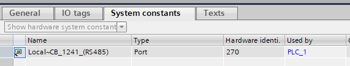
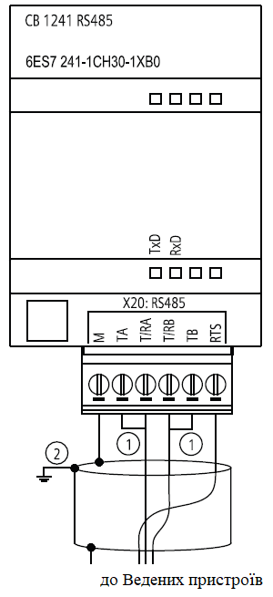
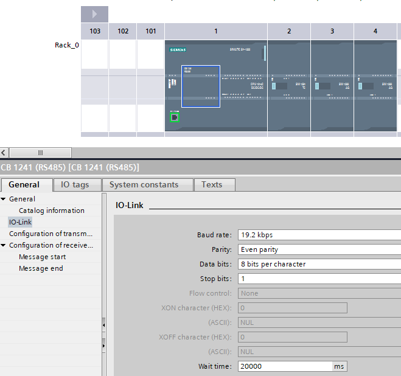
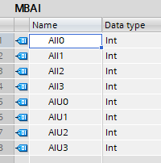
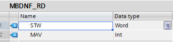
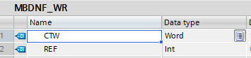
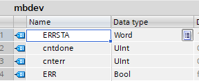

[<- До підрозділу](README.md)

# Практичне заняття: Реалізація Modbus Master з використанням функції MB_MASTER для S7-1200

## Довідкова частина

### Загальні концепції реалізації Modbus Master

Функціональний блок `MB_MASTER` реалізує комунікацію на S7-1200 як Modbus master, використовуючи послідовний порт на point-to-point module (CM) або communication board (CB). Перед використанням спочатку необхідно викликати функціональний блок `MB_COMM_LOAD`.

### Функціональний блок MB_COMM_LOAD

Інструкція `MB_COMM_LOAD` налаштовує порт для зв'язку за допомогою протоколу Modbus RTU для наступних комунікацій: 

- до трьох модулів point-to-point (PtP) CM 1241 RS485 або CM 1241 RS232

- комунікаційна плата CB 1241 RS485

Функціональний блоку `MB_COMM_LOAD` потрібно викликати один раз, після завершення налаштування порт можна використовувати за допомогою інструкцій `MB_MASTER` і `MB_SLAVE`. Повторний виклик може знадобитися тільки у випадку, якщо потрібно змінити один із параметрів зв'язку. Кожен виклик `MB_COMM_LOAD`  видаляє комунікаційний буфер. Щоб уникнути втрати даних під час обміну, не слід викликати цю інструкцію без потреби.

Таблиця 1. Параметри інтерфейсу `MB_COMM_LOAD`

| Параметр    | Declaration | Data type | Memory area               | Опис                                                         |
| ----------- | ----------- | --------- | ------------------------- | ------------------------------------------------------------ |
| REQ         | Input       | BOOL      | I, Q, M, D, L             | Виконання інструкції по передньому фронту.                   |
| PORT        | Input       | PORT      | I, Q, M, D, L or constant | ID комунікаційного порту: після того, як ви вставили комунікаційний модуль у конфігурацію пристрою, ідентифікатор порту з’явиться у розкривному списку біля підключення PORT. На цю константу також можна посилатися на вкладці "Constants" таблиці тегів.  |
| BAUD        | Input       | UDINT     | I, Q, M, D, L or constant | Швидкість передачі даних: 300, 600, 1200, 2400, 4800, 9600,  19200, 38400, 57600, 76800, 115200, усі інші значення не дійсні |
| PARITY      | Input       | UINT      | I, Q, M, D, L or constant | Паритет:  0 – None 1 – Odd 2 – Even                          |
| FLOW_CTRL   | Input       | UINT      | I, Q, M, D, L or constant | Керування потоком:  0 – (default) No flow control; 1 – апаратне керування потоком з RTS завжди ON (не застосовно для RS485 портів); 2 - апаратне керування потоком з переключенням RTS; |
| RTS_ON_DLY  | Input       | UINT      | I, Q, M, D, L or constant | Вибір затримки RTS: 0 – (за замовчуванням) затримка RTS не активна, доки не буде передано перший символ повідомлення; 1 до 65535 – затримка в мілісекундах "RTS active" до передавання першого символу повідомлення (не стосується портів RS-485). Затримки RTS повинні використовуватися залежно від вибору FLOW_CTRL. |
| RTS_OFF_DLY | Input       | UINT      | I, Q, M, D, L or constant | Вибір затримки вимкнення RTS: 0 – (за замовчуванням) без затримки після останнього переданого символу до "RTS  inactive"; 1 до 65535 – затримка в мілісекундах після останнього переданого символу до "RTS inactive" (не стосується портів RS-485) . Затримки RTS необхідно використовувати незалежно від вибору FLOW_CTRL. |
| RESP_TO     | Input       | UINT      | I, Q, M, D, L or constant | Час очікування відповіді: час у мілісекундах, дозволений `MB_MASTER` для відповіді Веденого пристрою. Якщо Ведений пристрій не відповідає протягом цього часу, `MB_MASTER` повторює запит або завершує запит із повідомленням про помилку, якщо було надіслано вказану кількість повторних спроб. від 5 мс до 65535 мс (за замовчуванням = 1000 мс). |
| MB_DB       | Input       | MB_BASE   | D                         | Посилання на блок даних екземпляра інструкцій "MB_MASTER" або "MB_SLAVE". Після того, як ви вставите «MB_SLAVE» або «MB_MASTER» у свою програму, ідентифікатор DB з’явиться у розкривному списку в підключенні вікна MB_DB. |
| DONE        | Output      | BOOL      | I, Q, M, D, L             | Виконання інструкції виконано без помилок.                   |
| ERROR       | Output      | BOOL      | I, Q, M, D, L             | Помилка: 0 – помилки не виявлено; 1 – вказує на те, що виявлено помилку. У параметрі STATUS виводиться код помилки. |
| STATUS      | Output      | WORD      | I, Q, M, D, L             | Код помилки конфігурації порту                               |

Таблиця 2. Можливі значення  STATUS

| Error code
 (W#16#...) | Опис                                                         |
| ---------------------- | ------------------------------------------------------------ |
| 0000                   | No error                                                     |
| 8180                   | Invalid value for the port ID (wrong  address for the communications module). |
| 8181                   | Invalid baud rate  value.                                    |
| 8182                   | Invalid parity value.                                        |
| 8183                   | Invalid flow control  value.                                 |
| 8184                   | Invalid value for the timeout of the  response (the time before which a timeout is reported must be at least 25  ms). |
| 8185                   | Incorrect pointer in the MB_DB  parameter to the instance DB of the "MB_MASTER" or  "MB_SLAVE" instruction. |

Таблиця 3. Статичні теги екземплярного DB

| Tag       | Data type | За замовченням | Опис                                                         |
| --------- | --------- | -------------- | ------------------------------------------------------------ |
| ICHAR_GAP | WORD      | 0              | Затримка інтервалу між символами. Цей параметр вказується в мілісекундах і використовується для збільшення очікуваного періоду між отриманими символами. Відповідна кількість біт для цього параметра додається до стандартного значення Modbus 35 біт (3,5 символів). |
| RETRIES   | WORD      | 2              | Кількість повторних спроб головного пристрою до повернення коду помилки `0x80C8` для  "No  response" |
| STOP_BITS | USINT     | 1              | Кількість стоп-бітів на символ. Дійсні значення 1 і 2        |


### Функціональний блок MB_MASTER

`MB_MASTER` не використовує події переривання зв’язку для керування процесом зв’язку, натомість контроль завершення операції після виклику необхідно робити постійним викликом `MB_MASTER` з перевіркою результату. Один і той же порт можна використовувати для одного або кількох викликів "MB_MASTER", якщо використовується той самий екземпляр БД.

Виклик інструкцію `MB_MASTER` варто робити в циклічному OB. 

Після початку передачі параметр `EN` (LAD/FBD) має залишатися встановленим на `1` до тих пір поки вихідний параметр `DONE` або `ERROR` не буде встановлено на `1`. Повторний виклик з встановленим параметро `REQ` під час виконання інструкції викликає помилку. Після виконання інструкції біт у параметрі `REQ` в екземплярному DB залишається встановленим протягом часу, що визначений параметром `BLOCKED_PROC_TIMEOUT` .

Після того, як `MB_MASTER` надсилає запит Веденому, необхідно постійно викликати функціональний блок поки не надійде відповідь від Веденого або помилка таймауту.

Таблиця 4. Параметри інтерфейсу `MB_MASTER`

| Параметр  | Declaration | Data type | Memory area               | Опис                                                         |
| --------- | ----------- | --------- | ------------------------- | ------------------------------------------------------------ |
| REQ       | Input       | BOOL      | I, Q, M, D, L             | Запит:  0 – не робити запит;  1 – Зробити запит на передачу даних до Modbus slave(s) |
| MB_ADDR   | Input       | UINT      | I, Q, M, D, L or constant | Адреса станції Modbus RTU: <br />- діапазон адрес за замовчуванням: від 0 до 247 <br />- Розширений діапазон адрес: від 0 до 65535 <br />Значення «0» зарезервовано для широкомовної передачі повідомлення всім Веденим пристроям Modbus. Функціональні коди Modbus `05`, `06`, `15` і `16` є єдиними кодами функцій, які підтримуються для широкомовної передачі. |
| MODE      | Input       | USINT     | I, Q, M, D, L or constant | Режим, який вказує на тип запиту: читання, запис або діагностика (значення див. в табл.5) |
| DATA_ADDR | Input       | UDINT     | I, Q, M, D, L or constant | Початкова адреса  змінної у Веденому пристрої (значення див. в табл.5) |
| DATA_LEN  | Input       | UINT      | I, Q, M, D, L or constant | Довжина даних: вказує кількість бітів або слів, до яких потрібно отримати доступ у цьому запиті. Налаштування довжини  див. в табл.5 |
| DATA_PTR  | In_Out      | VARIANT   | M, D                      | Вказує на DB або бітову адресу пам'яті CPU для даних, які потрібно записати або прочитати. Якщо вказано DB, то він має мати налаштування зі стандартним (не оптимізованим) доступом, сумісним із S7-300/400». |
| DONE      | Output      | BOOL      | I, Q, M, D, L             | `0`: транзакція не завершена ;<br />`1`: транзакція завершена без помилок |
| BUSY      | Output      | BOOL      | I, Q, M, D, L             | `0`:  транзакція `MB_MASTER` не виконується <br />`1`: транзакція `MB_MASTER` зараз виконується |
| ERROR     | Output      | BOOL      | I, Q, M, D, L             | `0`: немає помилок; <br />`1`: помилка, код помилки вказується в слові STATUS |
| STATUS    | Output      | WORD      | I, Q, M, D, L             | код виконання                                                |

Таблиця 5. Параметри MODE  та DATA_ADDR

| MODE | Modbus function | Data length          | Operation and data                                           | Modbus address                     |
| ---- | --------------- | -------------------- | ------------------------------------------------------------ | ---------------------------------- |
| 0    | 01              | 1-2000 <br />1-1992  | Read output bits: 1 to (1992 or 2000) bits per  query        | 1 to 9999                          |
| 0    | 02              | 1-2000 <br />1-1992  | Read input bits: 1 to (1992 or 2000) bits per  query         | 10001 to 19999                     |
| 0    | 03              | 1 to 125 <br />1-124 | Read holding registers: 1 to (124 or 125) WORD per  query    | 40001 to 49999 or 400001 to 465535 |
| 0    | 04              | 1-125<br /> 1-124    | Read input WORD: 1 to (124 or 125) WORD per  query           | 30001 to 39999                     |
| 1    | 05              | 1                    | Writing an output bit: One bit per query                     | 1 to 9999                          |
| 1    | 06              | 1                    | Writing a holding registers: 1 WORD per query                | 40001 to 49999 or 400001 to 465535 |
| 1    | 15              | 2-1968 <br />2-1960  | Writing multiple output bits: 2 to (1960 or 1968) bits per  query | 1 to 9999                          |
| 1    | 16              | 2-123 <br />2-122    | Writing multiple holding  registers: 2 to (122 or 123) WORD per  query | 40001 to 49999 or 400001 to 465535 |
| 2    | 15              | 1-1968 <br />2-1960  | Writing one or more output bits: 1 to (1960 or 1968) bits per  query | 1 to 9999                          |
| 2    | 16              | 1-123 <br />2-122    | Writing one or more holding  registers: 1 to (122 or 123) WORD per  query | 40001 to 49999 or 400001 to 465535 |
| 11   | 11              | 0                    | Зчитування слова стану зв’язку Ведених пристроїв і лічильника подій: слово стану вказує на виконання інструкції (0: не виконується; 0xFFFF: виконується). Лічильник подій збільшується щоразу, коли повідомлення успішно передано. Параметри DATA_ADDR і DATA_LEN інструкції "MB_MASTER" ігноруються цією функцією. | -                                  |
| 80   | 08              | 1                    | Перевірка стану веденого пристрою шляхом зчитування коду помилки (0x0000): 1 СЛОВО на запит | -                                  |
| 81   | 08              | 1                    | Скидання лічильника подій веденого пристрою з кодом діагностики 0x000A: 1 СЛОВО на запит | -                                  |

Для «Розширеного діапазону адрес» максимальна довжина даних зменшується на один байт або одне СЛОВО залежно від того, який тип даних використовується для функції.

Для запуску запиту на вхід `REQ` треба подати лоігчну одиницю.  Якщо той самий екземпляр `MB_MASTER` виконується знову з REQ input = 1 до того, як поточний запит буде повністю оброблено, наступні передачі не здійснюються. Однак, якщо запит було оброблено, новий запит видається під час повторного виконання `MB_MASTER` із введенням REQ = 1.

Таблиця 6. Можливі значення  STATUS  

| Код помилки (W#16#....) | Код помилки від Slave | Опис                                                         |
| ----------------------- | --------------------- | ------------------------------------------------------------ |
| 0000                    |                       | No error                                                     |
| 80C8                    |                       | Підлеглий тайм-аут. Перевірте швидкість передачі даних, парність і роз’єми Веденого пристрою. |
| 80D1                    |                       | The receiver issued a flow control  request to suspend an active transmission and never re-enabled the transmission  within the wait time. This error is also generated during  hardware flow control if the recipient does not detect CTS within the wait  time. |
| 80D2                    |                       | The send request was aborted because  no DSR signal is received from the DCE. |
| 80E0                    |                       | The message was terminated because  the receive buffer is full. |
| 80E1                    |                       | The message was terminated as a  result of a parity error.   |
| 80E2                    |                       | The message was terminated as a  result of a framing error.  |
| 80E3                    |                       | The message was terminated as a  result of an overrun error. |
| 80E4                    |                       | The message was terminated as a  result of the specified length exceeding the total buffer size. |
| 8180                    |                       | Недійсне значення для ID порту.                              |
| 8186                    |                       | Invalid Modbus station  address                              |
| 8188                    |                       | The MODE parameter has an invalid  value for a broadcast call. |
| 8189                    |                       | Invalid data address  value.                                 |
| 818A                    |                       | Invalid data length  value.                                  |
| 818B                    |                       | Invalid pointer to the local data  source/destination: Size not correct |
| 818C                    |                       | The DATA_PTR parameter has an invalid  pointer. Use a pointer to a bit memory area or a DB with the "Standard -  compatible with S7-300/400" access type. |
| 8200                    |                       | Порт зайнятий обробкою запиту на надсилання                  |
| 8380                    | -                     | помилка CRC                                                  |
| 8381                    | 01                    | код функції не підтримується                                 |
| 8382                    | 03                    | помилка довжини даних                                        |
| 8383                    | 02                    | Помилка в адресі даних або адреса поза допустимим діапазоном DATA_PTR |
| 8384                    | > 03                  | Помилка значення даних                                       |
| 8385                    | 03                    | Значення коду діагностики даних не підтримується (код функції 08) |
| 8386                    | -                     | Код функції відповіді не збігається з кодом функції запиту.  |
| 8387                    | -                     | Відповідь від неправильного Веденого                         |
| 8388                    | -                     | Відповідь Веденого пристрою на виклик запису є неправильною. Дані, надіслані Веденим, не відповідають запиту від Ведучого. |

Таблиця 7. Статичні теги екземплярного DB

| Variable              | Data type | Description                                                  |
| --------------------- | --------- | ------------------------------------------------------------ |
| MB_STATE              | UINT      | Internal status of the Modbus  instruction                   |
| BLOCKED_ PROC_TIMEOUT | REAL      | Time between completion of the  instruction call and resetting the ACTIVE bit in the instance DB. The time  buffer is used to avoid execution of the instruction being terminated before a  job has been sent completely. The default time is 500 ms. |
| EXTENDED_ ADDRESSING  | BOOL      | Configuring addressing:  0: Default address area (1 byte) 1: Extended address area (2 bytes) For additional information, refer to  the section EXTENDED_ADDRESSING: [Instance DB of the  "MB_SLAVE" instruction](23874923403.htm) |


## Практична частина

Завдання. Реалізувати програму користувача для PLC S7-1200 для обміну через мережу Modbus RTU on RS-485 з двома пристроями.

Таблиця 8. Завдання

| Пристрій                                                     | Адреса Slave | Змінні                                     |
| ------------------------------------------------------------ | ------------ | ------------------------------------------ |
| Модуль аналогових входів [MR-AI-1](https://www.fif.com.pl/en/io-extension-modules/371-analog-inputs-module-mr-ai-1.html) | 91           | 31001-31008 - читання                      |
| ПЧ Danfos FC51                                               | 2            | 42910-42911 - читання, 42810-42811 - запис |


### Реалізація підключення 



рис.1. Підключення кабеля шини RS-485 до  `CB 1241`. Цифрами показано: 1 - Підключіть "TA" і TB", якщо ПЛК є кінцевим пристроєм в мережі для активації термінаторів та захисного зміщення; 2 - Використовуйте екрановану виту пару та підключіть екран кабелю до землі.

### Конфігурування апаратної частини

Конфігурування апаратної частини передбачає встановлення опції `CB 1241` та означення відповідних налаштувань.



рис.2. Налаштування карти


рис.3. Логічний номер порта

### Програма користувача

У програмі використовуються наступні типи рис.4. 

 

роис.4. Користувацькі типи 

Перші три типи використовуються для збереження даних вводу/виводу по Modbus. Тип `MBAI` призначений для зберігання 8 вхідних значень: чотири по струму і чотири по напрузі. Тип  `MBDNF_RD` призначений для зберігання зчитаних слів з перетворювача частоти а тип  `MBDNF_WR` - слів для запису в ПЧ (про керування ПЧ можете прочитати за [цим посиланням](../pds/fc.md)). Тип `mbdev` використовується для діагностування пристроїв. 

Для керування мережею створено ФБ `MbClient`, екземпляр яукого викликається в `OB1`.

Таблиця 9. Параметри ФБ `MbClient`

| Назва        | Тип          | Коментар                                         |
| ------------ | ------------ | ------------------------------------------------ |
| **Static**   |              |                                                  |
| COMLD1       | MB_COMM_LOAD | Екземплярний ФБ `MB_COMM_LOAD`                   |
| COMLD1_REQ   | Bool         |                                                  |
| COMLD1_DONE  | Bool         |                                                  |
| COMLD1_ERR   | Bool         |                                                  |
| COMLD1_STA   | Word         |                                                  |
| MASTER1      | MB_MASTER    | Екземплярний ФБ `MB_MASTER`                      |
| MASTER1_REQ  | Bool         |                                                  |
| MBADR1       | UInt         |                                                  |
| MBMODE1      | USInt        |                                                  |
| DATAADR1     | UDInt        |                                                  |
| DATALEN1     | UInt         |                                                  |
| MASTER1_DONE | Bool         |                                                  |
| MASTER1_BUSY | Bool         |                                                  |
| MASTER1_ERR  | Bool         |                                                  |
| ERRTO        | Bool         |                                                  |
| MASTER1_STA  | Word         |                                                  |
| MASTER1_DATA | DB_ANY       |                                                  |
| MBSTEP       | UInt         | змінна кроку                                     |
| AI1_RD       | mbdev        | Діагностична інформація для пристрою AI          |
| DNFCOOL_RD   | mbdev        | Діагностична інформація для читання з ПЧ Danfoss |
| DNFCOOL_WR   | mbdev        | Діагностична інформація для запису в ПЧ Danfoss  |

Програма користувача наведена нижче. В програмі використовується кроково-орієнтований підхід, де крок за кроком відбувається відправлення запиту і очікування відповіді від пристроїв в мережі. 

```c++
IF FirstScan THEN 					//при старті ПЛК
    #COMLD1_REQ := true;
END_IF;
IF #COMLD1_REQ THEN
    #MBSTEP := 0;                   //номер кроку 
    #COMLD1.RETRIES := 0;           //кількість повторів - немає повторів
    #COMLD1.STOP_BITS := 2;         //кількість стоп-бітів
END_IF;
#COMLD1(REQ:=#COMLD1_REQ,
               "PORT":=270,         //береться з hw
               BAUD:=19200,         //бітова швидкість
               PARITY:=0,           //паритет - відсутній
               FLOW_CTRL:=0,        //немає керування потоком
               RTS_ON_DLY:=0,
               RTS_OFF_DLY:=0,
               RESP_TO:=500,        //500 мс таймаут відповіді
               DONE=>#COMLD1_DONE,  //оброблено без помилок
               ERROR=>#COMLD1_ERR,  //є помилка
               STATUS=>#COMLD1_STA, //статус помилки
               MB_DB:=#MASTER1);
#COMLD1_REQ := false;               //тільки на один цикл
CASE #MBSTEP OF
    0://start plc
        IF #COMLD1_DONE THEN
            #MBSTEP := 1;
            #MASTER1_REQ := true;		//вмикаємо опитування 
        END_IF;
    1://читання у веденого 91
        #MBADR1 := 91;                  //slave adr
        #MBMODE1 := 0;                  //Read 
        #DATAADR1 := 31001;             //Modbus address (input WORD)
        #DATALEN1 := 8;                 //Кількість слів для читання
        #MASTER1(REQ := #MASTER1_REQ,   
                 MB_ADDR := #MBADR1,    
                 MODE := #MBMODE1,      
                 DATA_ADDR := #DATAADR1,
                 DATA_LEN := #DATALEN1, 
                 DONE => #MASTER1_DONE,
                 BUSY => #MASTER1_BUSY,
                 ERROR => #MASTER1_ERR,
                 STATUS => #MASTER1_STA,
                 DATA_PTR :=  "IOMB".AI1_RD);
        IF NOT #MASTER1_BUSY THEN       //якщо запит оброблено
            #MBSTEP := 2;               //переходимо на крок 2  
            IF #MASTER1_ERR THEN        //якщо є помилка
                #AI1_RD.ERRSTA := #MASTER1_STA;         //запятовуємо її для аналізу
                #AI1_RD.cnterr := #AI1_RD.cnterr + 1;   //лічильник помилок збільшуємо на 1
                IF (#AI1_RD.cnterr>30000) THEN          //лічильник помилок перезапускається
                    #AI1_RD.cnterr := 1;
                END_IF;
            END_IF;
        END_IF;
    2://читання у веденого 2
        #MBADR1 := 2;
        #MBMODE1 := 0;                  //Read 
        #DATAADR1 := 42910;             //Modbus address (holding registers)
        #DATALEN1 := 2;
        #MASTER1(REQ := #MASTER1_REQ,
                 MB_ADDR := #MBADR1,
                 MODE := #MBMODE1,
                 DATA_ADDR := #DATAADR1,
                 DATA_LEN := #DATALEN1,
                 DONE => #MASTER1_DONE,
                 BUSY => #MASTER1_BUSY,
                 ERROR => #MASTER1_ERR,
                 STATUS => #MASTER1_STA,
                 DATA_PTR := "IOMB".DNFCOOL_RD);
        IF  NOT #MASTER1_BUSY  THEN
            #MBSTEP := 3;
            IF #MASTER1_ERR THEN
                #DNFCOOL_RD.ERRSTA := #MASTER1_STA;
                #DNFCOOL_RD.cnterr := #DNFCOOL_RD.cnterr + 1;
                IF (#DNFCOOL_RD.cnterr > 30000) THEN
                    #DNFCOOL_RD.cnterr :=1;
                END_IF;
            END_IF;
        END_IF;
    3://запис до веденого 2
        #MBADR1 := 2;
        #MBMODE1 := 1;                  //writing
        #DATAADR1 := 42810;             //Modbus address (holding registers)
        #DATALEN1 := 2;
        #MASTER1(REQ := #MASTER1_REQ,
                 MB_ADDR := #MBADR1,
                 MODE := #MBMODE1,
                 DATA_ADDR := #DATAADR1,
                 DATA_LEN := #DATALEN1,
                 DONE => #MASTER1_DONE,
                 BUSY => #MASTER1_BUSY,
                 ERROR => #MASTER1_ERR,
                 STATUS => #MASTER1_STA,
                 DATA_PTR := "IOMB".DNFCOOL_WR);
        IF  NOT #MASTER1_BUSY THEN
            #MBSTEP := 1;				//знвову на крок1
            IF #MASTER1_ERR THEN
                #DNFCOOL_WR.ERRSTA := #MASTER1_STA;
                #DNFCOOL_WR.cnterr := #DNFCOOL_WR.cnterr + 1;
                IF (#DNFCOOL_WR.cnterr > 30000) THEN
                    #DNFCOOL_WR.cnterr := 1;
                END_IF;
            END_IF;
        END_IF;
END_CASE;    
```


Практичне заняття розробив [Олександр Пупена](https://github.com/pupenasan). 


Якщо Ви хочете залишити коментар у Вас є наступні варіанти:

- [Обговорення у WhatsApp](https://chat.whatsapp.com/BRbPAQrE1s7BwCLtNtMoqN)
- [Обговорення в Телеграм](https://t.me/+GA2smCKs5QU1MWMy)
- [Група у Фейсбуці](https://www.facebook.com/groups/asu.in.ua)

Про проект і можливість допомогти проекту написано [тут](https://asu-in-ua.github.io/atpv/)