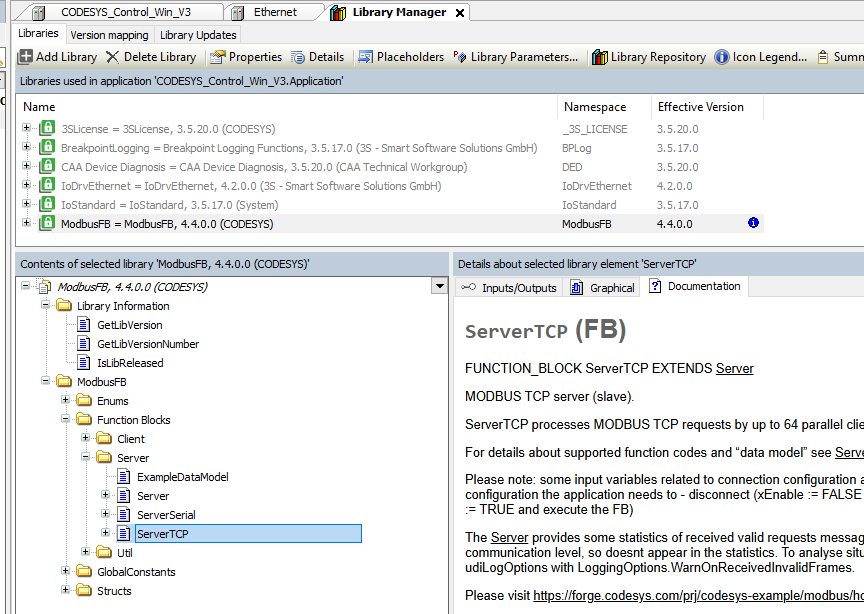
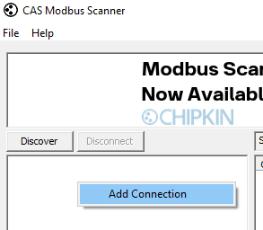
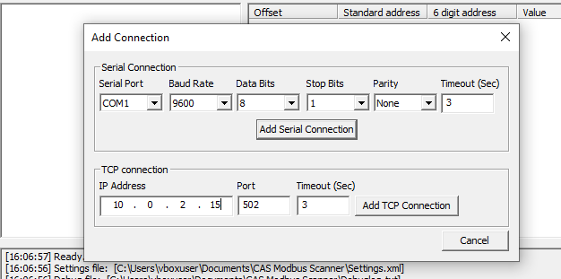
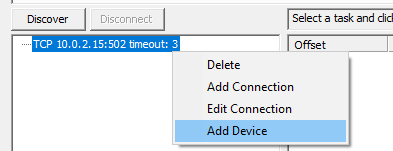
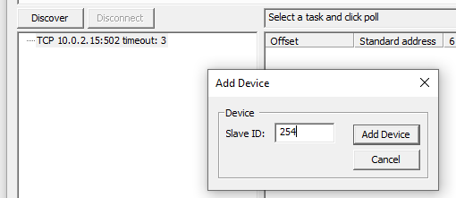
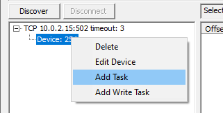
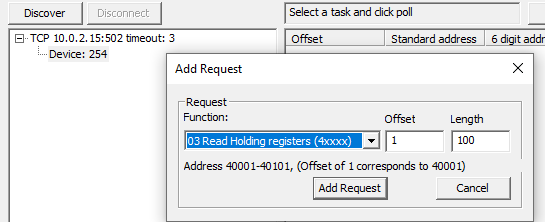
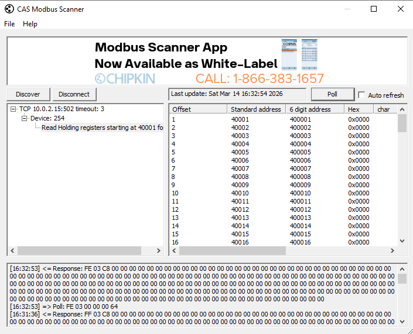
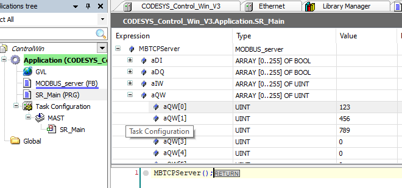

[<- До підрозділу](README.md)	[CODESYS (загальні теми)](../../plc/codesys.md) 	[PLC MachineStruxure M241, M251, M262 та інші](../../plc/ecostruxuremachineexpert.md) 	[Коментувати](#feedback)

# Реалізація Modbus TCP Server в CODESYS Control Win з використанням бібліотеки ModbusFB 

## Теоретична частина

У CODESYS Control Win та в інших PLC під CODESYS є кілька варіантів реалізації Modbus TCP Server. Здебільшого в PLC він реалізований на рівні операційної системи і не потребує написання коду. Однак у ряді випадків потребується програмна реалізація. Зокрема це може бути пов'язано з необхідністю перевірки роботи програми без наявного PLC у зв'язці з іншими програмними засобами, наприклад SCADA/HMI. Цей варіант потребує використання повноцінного середовища виконання, наприклад з використанням CODESYS Control Win. 

Серед доступних бібліотек для реалізації Modbus є ModbusFB, яка описана в [онлайн довіднику ModbusFB](https://content.helpme-codesys.com/en/libs/ModbusFB/Current/ModbusFB/fld-ModbusFB.html). Реалізація Modbus TCP Server і з використанням цієї бібліотеки і є предметом даного розідлу.

### Про ServerTCP FB

Modbus TCP Server реалізований через функціональний блок ServerTCP, який обробляє запити MODBUS TCP до 64 паралельних клієнтських з’єднань. 

Зверніть увагу: деякі вхідні змінні, пов’язані з конфігурацією з’єднання, зчитуються під час фронту сигналу `xEnable`. Щоб змінити конфігурацію з’єднання, застосунок повинен:

- роз’єднатися (`xEnable := FALSE` і виконати FB),
- змінити відповідні вхідні змінні,
- знову встановити з’єднання (`xEnable := TRUE` і виконати FB).

Server надає статистику щодо отриманих коректних запитів і надісланих відповідей. Некоректні повідомлення відкидаються на рівні комунікації, тому не відображаються у статистиці. Для аналізу ситуацій, коли можуть виникати некоректні відповіді, можна використати `udiLogOptions` з `LoggingOptions.WarnOnReceivedInvalidFrames`.

Входи блоку:

| Ім’я                | Тип              | Початкове                             | Коментар                                                     |
| ------------------- | ---------------- | ------------------------------------- | ------------------------------------------------------------ |
| xEnable             | BOOL             | FALSE                                 | Дозволяє серверу прийняти конфігурацію fcsSupported та dataModel. Якщо «модель даних» (tableDefinitions) містить помилки конфігурації, сервер не перейде в активний стан (xBusy = FALSE). |
| fcsSupported        | SupportedFCs     | Constants.SUPPORTED_FCS_SIMPLE_SERVER | Підтримувані «коди функцій», приймаються при xEnable FALSE → TRUE. Якщо не задано застосунком, використовується значення за замовчуванням Constants.SUPPORTED_FCS_SIMPLE_SERVER. |
| dataModel           | TableDefinitions | —                                     | «Модель даних», приймається при xEnable FALSE → TRUE.        |
| tInactivityInfoTime | UDINT            | 0                                     | Час неактивності (мс). Якщо за цей час не отримано коректних запитів, сигналізується неактивність. За замовчуванням 0 – без контролю неактивності. |
| wsInterfaceName     | WSTRING(255)     | —                                     | Назва інтерфейсу ETH для прив’язки (порожньо – будь-який ETH). Зчитується лише по фронту xEnable. |
| uiPort              | UINT             | 502                                   | Порт ETH. Зчитується лише по фронту xEnable.                 |
| xReset              | BOOL             | FALSE                                 | Скидання сервера. Закриває та знову відкриває сокет. Скидає xRunning, xError, eErrorID, xInactive, а також статистику запитів (udiNumMsgRecv, udiNumMsgReply, udiNumWriteRequests тощо) та ознаки xReadRequest, xWriteRequest. |
| udiLogOptions       | UDINT            | LoggingOptions.ServerStartStop        | Параметри журналювання.                                      |

Виходи блоку:

| Ім’я                              | Тип   | Коментар                                                     |
| --------------------------------- | ----- | ------------------------------------------------------------ |
| xRunning                          | BOOL  | Сервер запущений та очікує запити.                           |
| xError                            | BOOL  | Ознака помилки.                                              |
| eErrorID                          | Error | Код помилки.                                                 |
| xInactive                         | BOOL  | Не отримано коректних запитів протягом InactivityTimeOut.    |
| udiNumMsgRecv                     | UDINT | Статистика: кількість отриманих запитів з моменту запуску сервера. |
| udiNumMsgReply                    | UDINT | Статистика: кількість надісланих відповідей з моменту запуску сервера. |
| udiNumMsgExcReply                 | UDINT | Статистика: кількість надісланих виключних відповідей (exception). |
| udiNumMsgExcReplyIllegalFct       | UDINT | Статистика: кількість відповідей з помилкою «illegal function». |
| udiNumMsgExcReplyIllegalDataAdr   | UDINT | Статистика: кількість відповідей з помилкою «illegal data address». |
| udiNumMsgExcReplyIllegalDataValue | UDINT | Статистика: кількість відповідей з помилкою «illegal data value». |
| xReadRequest                      | BOOL  | Відбувся запит читання з моменту останнього виклику (включно з відхиленими). |
| udiNumReadRequests                | UDINT | Лічильник запитів читання (включно з відхиленими).           |
| xWriteRequest                     | BOOL  | Відбувся запит запису з моменту останнього виклику (включно з відхиленими). |
| udiNumWriteRequests               | UDINT | Лічильник запитів запису (включно з відхиленими).            |
| uiConnectedClients                | UINT  | Кількість фактично підключених клієнтів.                     |

### Підтримувані коди функцій

За замовчуванням сервер MODBUS підтримує:

- ReadCoils
- ReadDiscreteInputs
- ReadHoldingRegisters
- ReadInputRegisters
- WriteSingleCoil
- WriteSingleRegister
- WriteMultipleRegisters
- ReadWriteMultipleRegisters

Додатково може підтримувати:

- MaskWriteRegister

Підтримувані коди функцій можна налаштувати `fcsSupported`.

### Означення моделі даних

Означення моделі даних відбувається через структуру типу `TableDefinitions`. Модель даних дозволяє:

- непослідовні індекси для «елементів даних» (наприклад: індекси 0..9, 20..29)
- кілька (непослідовних) блоків пам’яті для «елементів даних» в одному «блоці даних» (наприклад: індекси 0..9 → блок пам’яті 1, індекси 20..29 → блок пам’яті 2)
- «елементи даних», не відображені у пам’яті (для них необхідно реалізувати користувацький код обробки операцій читання/запису)
- для «discrete inputs» / «coils»: розмір елемента даних 1 біт або 8 біт (по суті: ARRAY [0..numBits/8] OF BYTE або ARRAY [0..numBits-1] OF BOOL)
- для «input registers» / «holding registers»: розмір елемента даних 16 біт (по суті: ARRAY [0..numRegisters-1] OF UDINT)
- перекривання блоків пам’яті: можливе перекривання «registers» з «registers», а також «registers» з «discrete inputs» / «coils» (увага — складна для використання можливість)

Для підтримки цього модель даних означeє нуль або більше `TableSection` для кожної первинної таблиці MODBUS (`TableDefinition`). Деякі очевидні обмеження:

- усі «елементи даних» в межах однієї секції повинні мати однаковий `TableSection.uiDataItemSize`
- усі індекси «елементів даних» в межах однієї «первинної таблиці» повинні бути унікальними, перекривання індексів між секціями не допускається
- запити читання/запису не повинні охоплювати більше ніж одну секцію

Структурний тип `TableDefinitions` представляє первинні таблиці в моделі даних з 4-х таблиць типу `TableDefinition`

- `tableDiscreteInputs` 
- `tableCoils`
- `tableInputRegisters` 
- `tableHoldingRegisters` 

Структурний тип  `TableDefinition` використовується для означення однієї з «первинних таблиць» як частини «моделі даних». Включає такі властивості:

- `uiNumSections (UINT)` -  кількість секцій `TableSection` у таблиці
- `pSections (POINTER TO TableSection)` - вказівник на `TableSection`

Тобто кожна таблиця може включати кілька секцій які означені через тип `TableSection` , таким чином дає можливість збирати докупи кілька сегментів пам'яті як одну область даних Modbus.

Структурний тип `TableSection` використовується для означення секції однієї з «первинних таблиць» як частини «моделі даних». Включає такі властивості:

- `uiStart (UINT)` -  початковий індекс «елемента даних»

- `uiNumDataItems (UINT)`  -  кількість «елементів даних» у секції

-  `pStartAddr (POINTER TO BYTE)` - початкова адреса секції
- `uiDataItemSize (UINT)` -  розмір «елемента даних» у бітах: 
  - 1 або 8 для `DiscreteInputs` і `Coils`, вони можуть бути розміщені в пам’яті як `ARRAY OF BOOL (uiDataItemSize = 8)` або адресуватися побітово (`uiDataItemSize = 1`).
  - 16 для `InputRegisters` і `HoldingRegisters`. 

### Приклад

Наведений нижче приклад взятий з [Example projects for MODBUS    ](https://forge.codesys.com/prj/codesys-example/modbus/home/Home/)

```pascal
//  The application has to:
//  - configure server FB(s)
//  - provide the data memory for the "data model"
//  - enable / disable / control / execute the server FB(s) including error handling
// 
FUNCTION_BLOCK MODBUS_server_example
VAR
	aDiscreteInputsMemory : ARRAY [0..9] OF BOOL;  
	aCoilsMemory1 : ARRAY [0..4] OF BOOL;
	aCoilsMemory2 : ARRAY [0..4] OF BOOL;
	aInputRegistersMemory1 : ARRAY [0..6] OF UINT;  
	aInputRegistersMemory2 : ARRAY [0..2] OF UINT;  
	aHoldingRegistersMemory : ARRAY [0..6] OF UINT;  
END_VAR
VAR CONSTANT
	// функції які підтримуються
	fcsSupported : ModbusFB.SupportedFcs := (
		ReadCoils:=TRUE,
		ReadDiscreteInputs:=TRUE,
		ReadHoldingRegisters:=TRUE,
		ReadInputRegisters:=TRUE,
		WriteSingleCoil:=TRUE,
		WriteSingleRegister:=TRUE
		// інші коди -> FALSE
		// підтримка підфункцій для функції 08 -> FALSE
	);
	
// Проста багатосекційна «модель даних».
// Ця "модель даних" повністю відображена у пам’яті (усі "елементи даних" прив’язані до пам’яті).
// Вона містить непослідовні "елементи даних" і непослідовні ділянки пам’яті для демонстрації налаштування такої конфігурації.
// Можна також виконати "класичне" налаштування, див. «discrete inputs».
// "discrete inputs" – «класичний» варіант: послідовні «елементи даних» (0..n-1) і послідовна пам’ять для елементів даних (один суцільний блок пам’яті для всіх «елементів даних»).

	aDiscreteInputsSections : ARRAY [0..0] OF ModbusFB.TableSection := [
		// "discrete inputs" 0..255
		(
			uiStart := 0,
			uiNumDataItems := 256,
			pStartAddr := ADR(aDiscreteInputsMemory[0]),
			uiDataItemSize := 8
		)
	];
	
	// "coils" - consecutive "data items" and non-consecutive data item memory
	aCoilsSections : ARRAY [0..1] OF ModbusFB.TableSection := [
		// "coils" 0..4
		(
			uiStart := 0,
			uiNumDataItems := 5,
			pStartAddr := ADR(aCoilsMemory1[0]),
			uiDataItemSize := 8
		),
		// "coils" 5..9
		(
			uiStart := 5,
			uiNumDataItems := 5,
			pStartAddr := ADR(aCoilsMemory2[0]),
			uiDataItemSize := 8
		)
	];
	
	// "input registers" - non-consecutive "data items" and non-consecutive data item memory
	aInputRegistersSections : ARRAY [0..2] OF ModbusFB.TableSection := [
		// "input registers" 0..2
		(
			uiStart := 0,
			uiNumDataItems := 3,
			pStartAddr := ADR(aInputRegistersMemory1[0]),
			uiDataItemSize := 16
		),
		// "input registers" 5..8
		(
			uiStart := 5,
			uiNumDataItems := 4,
			pStartAddr := ADR(aInputRegistersMemory1[3]),
			uiDataItemSize := 16
		),
		// "input registers" 10..12
		(
			uiStart := 10,
			uiNumDataItems := 3,
			pStartAddr := ADR(aInputRegistersMemory2[0]),
			uiDataItemSize := 16
		)
	];

	// "holding registers" - consecutive "data items" and consecutive data item memory
	// "holding registers" 7..9 overlap with "input registers" 10..12
	aHoldingRegistersSections : ARRAY [0..1] OF ModbusFB.TableSection := [
		// "holding registers" 0..6
		(
			uiStart := 0,
			uiNumDataItems := 6,
			pStartAddr := ADR(aHoldingRegistersMemory[0]),
			uiDataItemSize := 16
		),
		// "holding registers" 7..9
		(
			uiStart := 7,
			uiNumDataItems := 3,
			pStartAddr := ADR(aInputRegistersMemory2[0]),
			uiDataItemSize := 16
		)
	];
	
	// the "data model" tables
	tableDefs : ModbusFB.TableDefinitions := (
		tableDiscreteInputs := (
			uiNumSections := 1,
			pSections := ADR(aDiscreteInputsSections[0])
		),
		tableCoils := (
			uiNumSections := 2,
			pSections := ADR(aCoilsSections[0])
		),
		tableInputRegisters := (
			uiNumSections := 3,
			pSections := ADR(aInputRegistersSections[0])
		),
		tableHoldingRegisters := (
			uiNumSections := 2,
			pSections := ADR(aHoldingRegistersSections[0])
		)
	);
END_VAR
VAR
	// our MODBUS TCP server (slave)
	serverTCP: ModbusFB.ServerTCP;
	
	initDone : BOOL := FALSE;
END_VAR
```


```pascal
IF NOT initDone THEN
	initDone := TRUE;
	// configure tcpServer 
	serverTCP(fcsSupported:=fcsSupported, dataModel:=tableDefs, wsInterfaceName:="Ethernet 2", uiPort:=502);
	// configure serialServer 
	serverSerial(fcsSupported:=fcsSupported, dataModel:=tableDefs, uiUnitId:=42,
				 iPort:=SysCom.SYS_COMPORT2, dwBaudRate:=SysCom.SYS_BR_115200, byDataBits:=8, eParity:=SysCom.SYS_EVENPARITY, eStopBits:=SysCom.SYS_ONESTOPBIT,
				 eRtuAscii:=ModbusFB.RtuAscii.RTU);
END_IF

// call the server FB's
serverTCP(xEnable:=TRUE);
serverSerial(xEnable:=TRUE);

IF serverTCP.xWriteRequest = TRUE OR serverSerial.xWriteRequest THEN
	aInputRegistersMemory2[1] := aInputRegistersMemory2[1] + 1;
END_IF
```


```pascal
// Цей застосунок надає огляд усіх функціональних блоків бібліотеки MODBUS,
// що є релевантними для користувача, та способів їх використання у CFC / ST.
// Зверніть увагу: цей приклад не виконує жодного коду, він призначений лише для вивчення.
PROGRAM Main
VAR
	slave_example_ST : MODBUS_server_example;
END_VAR
```


## Практична частина

### 1. Встановлення CODESYS Control Win

- [ ] Встановіть CODESYS Control Win V3. Інструкція по встановленню знаходиться за [посиланням](../../plc/simul/labcodesyscontrolwin.md)

### 2. Створення проєкту з конфігурацією

- [ ] Створіть проєкт з назвою `ModbusServer`
- [ ] У апаратній конфігурації добавте пристрій CODESYS Control Win V3. Як це зробити описано в [Встановлення та робота з CODESYS Control Win: практичне заняття ](../../plc/simul/labcodesyscontrolwin.md)
- [ ] Запустіть програмного PLC CODESYS Control Win та завантажте туди проєкт
- [ ] Від'єднайте середовище розробки від PLC  CODESYS Control Win 
- [ ] У межах пристрою  CODESYS Control Win добавте карту  `Ethernet`


рис.1.

- [ ] Зайдіть в налаштування добавленої карти Ethernet, натисніть кнопку `Browse...`


рис.2.

- [ ] Підключіться до програмного ПЛК та виберіть мережний адаптер через який буде відбуватися підключення. 


рис.3.

- [ ] Для задачі MAST виставте інтервал 200 мс та час сторожового таймеру 2 с, для того щоб ControlWin не сильно навантажував ПК та не вилітав при перевищенні задачі.


рис.4.

### 3. Добавлення бібліотеки Modbus

- [ ] Зайдіть в Tools Tree


рис.5.

- [ ] Добавте бібліотеку ModbusFB


рис.6.

- [ ] Подивіться на зміст бібліотеки і подивіться синтаксис функціонального блоку ServerTCP



рис.7.

### 3. Реалізація Modbus TCP Server

- [ ] Створіть функціональний блок з іменем `MODBUS_server` на мові ST.
- [ ] У розділі означення змінних вставте наступний код  

```pascal
FUNCTION_BLOCK MODBUS_server
VAR
	aDI : ARRAY [0..255] OF BOOL;  
	aDQ : ARRAY [0..255] OF BOOL;
	aIW : ARRAY [0..255] OF UINT;  
	aQW : ARRAY [0..255] OF UINT;  
END_VAR
VAR CONSTANT
	// функції які підтримуються
	fcsSupported : ModbusFB.SupportedFcs := (
		ReadCoils:=TRUE,
		ReadDiscreteInputs:=TRUE,
		ReadHoldingRegisters:=TRUE,
		ReadInputRegisters:=TRUE,
		WriteSingleCoil:=TRUE,
		WriteSingleRegister:=TRUE
	);
	
	aDiscreteInputsSections : ARRAY [0..0] OF ModbusFB.TableSection := [
		(
			uiStart := 0,
			uiNumDataItems := 256,
			pStartAddr := ADR(aDI[0]),
			uiDataItemSize := 8
		)
	];
	aCoilsSections : ARRAY [0..0] OF ModbusFB.TableSection := [
		(
			uiStart := 0,
			uiNumDataItems := 256,
			pStartAddr := ADR(aDQ[0]),
			uiDataItemSize := 8
		)
	];
	aInputRegistersSections : ARRAY [0..0] OF ModbusFB.TableSection := [
		(
			uiStart := 0,
			uiNumDataItems := 256,
			pStartAddr := ADR(aIW[0]),
			uiDataItemSize := 16
		)
	];
	aHoldingRegistersSections : ARRAY [0..0] OF ModbusFB.TableSection := [
		(
			uiStart := 0,
			uiNumDataItems := 256,
			pStartAddr := ADR(aQW[0]),
			uiDataItemSize := 16
		)
	];
	
	// the "data model" tables
	tableDefs : ModbusFB.TableDefinitions := (
		tableDiscreteInputs := (
			uiNumSections := 1,
			pSections := ADR(aDiscreteInputsSections[0])
		),
		tableCoils := (
			uiNumSections := 1,
			pSections := ADR(aCoilsSections[0])
		),
		tableInputRegisters := (
			uiNumSections := 1,
			pSections := ADR(aInputRegistersSections[0])
		),
		tableHoldingRegisters := (
			uiNumSections := 1,
			pSections := ADR(aHoldingRegistersSections[0])
		)
	);
END_VAR
VAR
	serverTCP: ModbusFB.ServerTCP;
	initDone : BOOL := FALSE;
END_VAR
```

- [ ] У розділі коду вставте наступний код, зверніть увагу, що `wsInterfaceName` повинен вказувати на ім'я Ethernet:

```pascal
IF NOT initDone THEN
	initDone := TRUE;
	serverTCP(fcsSupported:=fcsSupported, dataModel:=tableDefs, wsInterfaceName:="Ethernet", uiPort:=502);
END_IF
serverTCP(xEnable:=TRUE);
```

- [ ] У розділі означення змінних POU `SR_Main` добавте наступну змінну:

```pascal
PROGRAM Main
VAR
	MBTCPServer: MODBUS_server;
END_VAR
```

- [ ] У розділ коду POU `SR_Main` добавте наступний код:

```pascal
MBTCPServer();
```

- [ ] Зробіть компіляцію проєкту, завантажте в ControlWin та запустіть на виконання.

### 4. Відкриття порту 502 для доступу з мережі

Для того щоб вхідний порт який використовує Modbus TCP не блокувався брандмауером до нього необхідно надати доступ. Це можна зробити через командний рядок. 

- [ ] Запустіть командний рядок в режимі адміністратора


рис.8.

- [ ] Виконайте наступну команду:

```cmd
netsh advfirewall firewall add rule name="Modbus TCP 502" dir=in action=allow protocol=TCP localport=502
```

### 5. Перевірка роботи

- [ ] Завантажте та встановіть безкоштовний тестовий Modbus TCP Client [CAS Modbus Scanner](https://store.chipkin.com/products/tools/cas-modbus-scanner)
- [ ] Запустіть  CAS Modbus Scanner
- [ ] Поступово добавте `Connection`, `Device`, `Task`, `Request` як це показано на рис.9













рис.9.

- [ ] Виділіть `Request` після чого натисніть `Poll` , мають прийти значення регістрів. 



рис.10.

- [ ] Змініть значення кількох регістрів в області `aQW[0]` (рис.11). У CAS Modbus Scanner знову прочитайте значення регістрів, вони мають змінитися на відповідні.  



рис.11. 

- [ ] Збережіть проєкт.

### 6. Підготовка та відправлення звіту

- На Google диску створіть папку з назвою `MyLabs`, якщо вона ще не створена, а в ній створіть папку `LabMBserver`. Посилання на папку `MyLabs` необхідно переслати викладачу для звітності.
- У межах папки `LabMBserver` розмістіть файл проєкту.
- У межах папки `LabMBserver` створіть Google документ з копіями екрану та іншими матеріалами, якщо такі потребуються.

## Примітки

### Розширення використання області %MW до більшого розміру

Даний пункт носить інформаційний характер і не потребує виконання. 

У ряді випадків потребується розширення області `%MW` у CODESYS Control Win. Щоб збільшити пам'ять в CODESYS Control Win  необхідно внести зміни в файл `device.xml` папки `C:\ProgramData\EcoStruxure Machine Expert\V2.1\Devices\4096\0000 0001\3.5.x.y`

У `ts:section name="memory-layout">` наприклад перед `<ts:section name="areas">` добавити розділ

```xml
	  <!-- resize memory area to 32000 words  -->
	  <ts:setting name="memory-size" type="integer" access="visible">
        <ts:value>32000</ts:value>
      </ts:setting>
```


## Джерела

1. [Онлайн допомога ModbusFB](https://content.helpme-codesys.com/en/libs/ModbusFB/Current/ModbusFB/fld-ModbusFB.html)
1. [Example projects for MODBUS](https://forge.codesys.com/prj/codesys-example/modbus/home/Home/)

## Автори


Теоретичне заняття розробив [Олександр Пупена](https://github.com/pupenasan). 

## Feedback

Якщо Ви хочете залишити коментар у Вас є наступні варіанти:

- [Обговорення у WhatsApp](https://chat.whatsapp.com/BRbPAQrE1s7BwCLtNtMoqN)
- [Обговорення в Телеграм](https://t.me/+GA2smCKs5QU1MWMy)
- [Група у Фейсбуці](https://www.facebook.com/groups/asu.in.ua)

Про проект і можливість допомогти проекту написано [тут](https://asu-in-ua.github.io/atpv/)