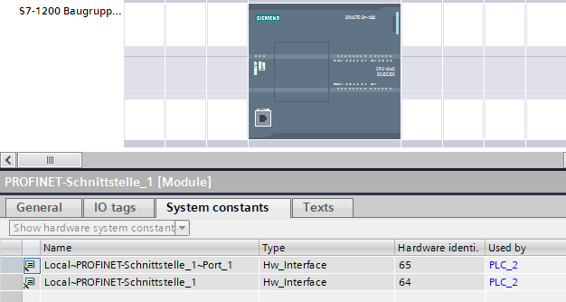
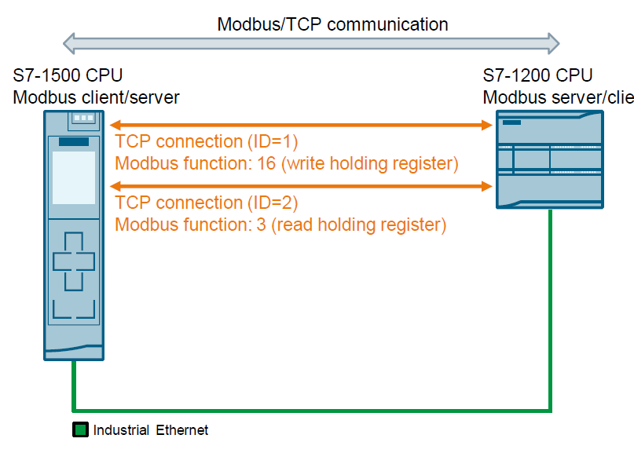
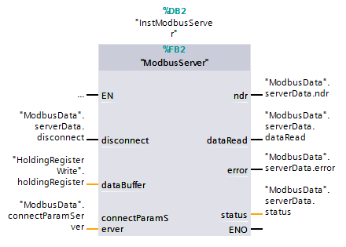
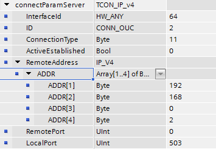

[<- До підрозділу](README.md)

# Реалізація Modbus TCP Server S7 1200/1500

Інструкція `MB_SERVER` спілкується як сервер Modbus TCP через з'єднання PROFINET. Інструкція "MB_SERVER" обробляє запити на підключення клієнта Modbus TCP, отримує та обробляє запити Modbus і надсилає відповіді. Для S7-1200 із мікропрограмою версії V4.0 ви можете використовувати інструкцію `MB_SERVER` до версії бібліотеки V3.1 включно. З S7-1200 версії прошивки V4.1 і S7-1500 ви можете використовувати інструкцію `MB_SERVER` усіх версій бібліотеки. Підключення може відбуватися через локальний інтерфейс центрального процесора або CM/CP. Для використання інструкції не потрібен додатковий апаратний модуль.

Ви можете створити кілька підключень до Сервера. Це дозволяє одному центральному процесору приймати підключення від кількох клієнтів Modbus TCP одночасно. Сервер Modbus TCP може підтримувати кілька TCP-з’єднань, а максимальна кількість з’єднань залежить від використовуваного ЦП. Загальна кількість підключень одного центрального процесора, включно з клієнтами та сервером Modbus TCP, не повинна перевищувати максимальну кількість підтримуваних підключень.

З’єднання Modbus TCP також можуть використовуватися екземплярами `MB_CLIENT` і/або `MB_SERVER`. У випадку підключення до сервера пам’ятайте про наступні правила:

- Кожне підключення "MB_SERVER" має використовувати унікальний екземплярний DB.

- Кожне підключення "MB_SERVER" має використовувати унікальний ідентифікатор підключення.

- Для кожного підключення інструкція "MB_SERVER" повинна бути викликана окремо.

Для кожного окремого екземплярного DB інструкції необхідно використовувати відповідний індивідуальний ідентифікатор підключення. Ідентифікатор підключення та екземплярний DB належать разом у парах і мають бути унікальними для кожного підключення.

## Параметри

Приклад виклику

```pascal
#instModbusServer(DISCONNECT:=#disconnect,
                  NDR=>#ndr,
                  DR=>#dataRead,
                  ERROR=>#error,
                  STATUS=>#status,
                  MB_HOLD_REG:=#dataBuffer,
                  CONNECT:=#connectParamServer);
```

Пареметри

| Parameter   | Declaration | Data type | Description                                                  |
| ----------- | ----------- | --------- | ------------------------------------------------------------ |
| DISCONNECT  | Input       | BOOL      | Інструкція "MB_SERVER" використовується для встановлення пасивного підключення з партнерським модулем. Сервер відповідає на запит на підключення з IP-адреси, яка введена в SDT "TCON_IP_v4" у параметрі CONNECT. Ви можете використовувати цей параметр, щоб контролювати, коли запит на з’єднання приймається: <br />-0: пасивне підключення встановлюється, коли немає підключення . <br />-1: Ініціалізація завершення з'єднання. Якщо вхід встановлено, інші операції не виконуються. В параметр STATUS виводиться  значення 0003 після успішного розриву підключення. |
| MB_HOLD_REG | InOut       | VARIANT   | Покажчик на регістр зберігання Modbus інструкції "MB_SERVER" MB_HOLD_REG завжди повинен посилатися на область пам'яті, розмір якої перевищує два байти. Регістр зберігання містить значення, до яких може отримати доступ клієнт Modbus за допомогою функцій Modbus 3 (читання), 6 (запис), 16 (запис кількох регістрів) і 23 (читання та запис в одному завданні). Як регістр зберігання використовуйте або глобальний блок даних з оптимізованим доступом, або область побітової пам’яті. |
| CONNECT     | InOut       | VARIANT   | Покажчик на структуру опису підключення Можна використовувати наступні структури (SDT):<br />- TCON_IP_v4: Містить усі параметри адреси, необхідні для встановлення запрограмованого з’єднання. Типовою адресою є 0.0.0.0 (будь-яка IP-адреса), але ви можете ввести конкретну IP-адресу, щоб сервер відповідав лише на запити з цієї адреси. При використанні TCON_IP_v4 з'єднання встановлюється під час виклику інструкції "MB_SERVER".<br />- TCON_Configured: Містить параметри адреси налаштованого підключення. Під час використання TCON_Configured з’єднання встановлюється центральним процесором після завантаження апаратної конфігурації. Для версій інструкцій > V4.2 MB_SERVER також можливі наступні описи підключення для TCP: <br />- TCON_IP_V4_SEC   <br />- TCON_QDN  <br />- TCON_QDN_SEC |
| NDR         | Output      | BOOL      | "New Data Ready":  <br />0: немає нових даних <br />1: Нові дані записані клієнтом Modbus |
| DR          | Output      | BOOL      | "Data Read":  <br />0: дані не зчитуються <br />1: Дані зчитуються клієнтом Modbus |
| ERROR       | Output      | BOOL      | Якщо під час виклику інструкції "MB_SERVER" виникає помилка, вихід параметра ERROR встановлюється в "1". Детальну інформацію про причину проблеми вказує параметр STATUS. |
| STATUS      | Output      | WORD      | Детальна інформація про статус інструкції.                   |

### Статичні теги екземплярного DB

У наведеній нижче таблиці описано статичні теги екземплярного DB інструкції "MB_SERVER", яка використовується в програмі. Ви можете написати тег HR_Start_Offset. Ви можете прочитати інші теги, щоб контролювати стан Modbus.

| Tag                  | Data type | Start value | Description                                                  |
| -------------------- | --------- | ----------- | ------------------------------------------------------------ |
| HR_Start_Offset      | WORD      | 0           | Assign the start address of the  Modbus holding register.    |
| QB_Start             | WORD      | 0           | Start address of the permitted  addressing range of the outputs that can be written (bytes 0 to  65535) |
| QB_Count             | WORD      | 0xFFFF      | Number of output bytes that can be  written by the Modbus master. Example: QB_Start=0 and QB_Count=10: Output  bytes 0 to 9 can be written. QB_Count=0: No output byte can be  written. |
| Request_Count        | WORD      | 0           | Total number of requests received by  the server.            |
| Server_Message_Count | WORD      | 0           | Total number of received alarms for  the relevant server.    |
| Xmt_Rcv_Count        | WORD      | 0           | Counter for detecting the number of  transfers during which an error occurred. The counter is only incremented when  an invalid Modbus request is received. |
| Exception_Count      | WORD      | 0           | Counters for detecting the number of  errors specifically for Modbus which cause an error message to  "MB_CLIENT". |
| Success_Count        | WORD      | 0           | Event counter for detecting the  number of requests that were successfully executed by the server. |
| Connected            | BOOL      | FALSE       | Indicates whether the connection to  the assigned client has been established or not: TRUE = connected, FALSE = not  connected. |

Інструкція «MB_SERVER» дозволяє вхідним функціям Modbus (1, 2, 4, 5 і 15) отримувати прямий доступ для читання та запису до входів і виходів образу процесу ЦП (використання типів даних BOOL і WORD). Для процесорів S7-1200 адресний простір для образу процесу входів і образу процесу виходів становить 1 КБ; і 32 КБ кожен для S7-1500-CPU. У наступній таблиці показано адресний простір функцій Modbus, перерахованих вище.

### CONNECT

Для інструкції "MB_SERVER" можна використовувати два різні описи підключення:

- Програмовані з'єднання зі структурою TCON_IP_v4. Параметри підключення зберігаються в структурі TCON_IP_v4, а підключення встановлюється за допомогою виклику інструкції "MB_SERVER".

- Налаштовані з'єднання зі структурою TCON_Configured (тільки з S7-1500). ЦП уже встановив налаштоване з’єднання. Використовуйте структуру TCON_Configured, щоб вказати, яке існуюче з’єднання буде використано для інструкції.

Кожен екземпляр інструкції "MB_SERVER" потребує унікального підключення. Створіть окрему структуру TCON_IP_v4 або TCON_Configured для кожного екземпляра інструкції для опису підключення.

Для запрограмованих підключень за параметром CONNECT використовуйте наведену нижче структуру для опису підключення до TCON_IP_v4. Переконайтеся, що в структурі TCON_IP_v4 указано лише підключення типу TCP.

| Byte    | Parameter         | Data type            | Start value | Description                                                  |
| ------- | ----------------- | -------------------- | ----------- | ------------------------------------------------------------ |
| 0 … 1   | InterfaceID       | HW_ANY               | -           | Апаратний ідентифікатор локального інтерфейсу, наприклад 64<br /> |
| 2 … 3   | ID                | CONN_OUC             | -           | Посилання на це підключення (діапазон значень: від 1 до 4095). Параметр унікально ідентифікує з’єднання в ЦП. Кожен окремий екземпляр інструкції "MB_SERVER" повинен використовувати унікальний ідентифікатор. Ідентифікатор також не повинен використовуватися одночасно іншою інструкцією іншого типу зв’язку. Примітка. Для процесорів S7-1500 із мікропрограмою версії V2.9 або вище та S7-1200 із мікропрограмою версії V4.5 або вище ідентифікатор також може бути надано інструкцією "TCONSettings". |
| 4       | ConnectionType    | BYTE                 | 11          | Тип підключення Виберіть 11 (десяткове) для TCP. Інші типи підключення не допускаються. Якщо використовується інший тип підключення (наприклад, UDP), відповідне повідомлення про помилку виводиться в параметрі STATUS інструкції. |
| 5       | ActiveEstablished | BOOL                 | FALSE       | Ідентифікатор способу встановлення з’єднання Виберіть FALSE для пасивного встановлення з’єднання. |
| 6 … 9   | RemoteAddress     | ARRAY [1..4] of BYTE | 0.0.0.0     | IP-адреса партнера по з’єднанню, наприклад, для 192.168.0.1: addr[1] = 192 addr[2] = 168 addr[3] = 0 addr[4] = 1 Якщо інструкція «MB_SERVER» приймає запити на з’єднання від будь-якого партнера по підключенню використовуйте "0.0.0.0" як IP-адресу. |
| 10 … 11 | RemotePort        | UINT                 | 0           | Номер порту партнера по віддаленому підключенню (діапазон значень: від 1 до 49151). Якщо інструкція «MB_SERVER» має приймати запити на підключення від будь-якого порту віддаленого партнера, використовуйте «0» як номер порту. |
| 12 … 13 | LocalPort         | UINT                 | 502         | Номер порту локального партнера з’єднання (діапазон значень: від 1 до 49151). Номер IP-порту визначає, який IP-порт відстежується для запитів на підключення клієнта Modbus. Значення за замовчуванням – 502. |


## Області пам'яті

| Modbus function   |              |               |                   |      |        |
| ----------------- | ------------ | ------------- | ----------------- | ---- | ------ |
| **Function code** | **Function** | **Data area** | **Address space** |      |        |
| 01                | Read: Bits   | Output        | 0                 | to   | 65.535 |
| 02                | Read: Bits   | Input         | 0                 | to   | 65.535 |
| 04                | Read: WORD   | Input         | 0                 | to   | 65.535 |
| 05                | Write: Bit   | Output        | 0                 | to   | 65.535 |
| 15                | Write: Bits  | Output        | 0                 | to   | 65.535 |

Вхідні запити Modbus із кодами функцій 3, 6, 16 і 23 записують або зчитують регістри зберігання Modbus (ви вказуєте регістр зберігання за допомогою параметра MB_HOLD_REG).

## Адресація через статичний тег HR_Start_Offset. 

Адреси реєстру зберігання Modbus починаються з 0 (з точки зору MB_CLIENT з 40001). Ці адреси відповідають адресній області області пам'яті центрального процесора для регістра зберігання. Ви також можете визначити тег HR_Start_Offset, щоб регістр збереження Modbus мав початкову адресу, відмінну від 0.

Приклад: Регістр зберігання починається з MW100 і має довжину 100 СЛІВ. Значення зсуву в параметрі HR_Start_Offset означає, що початкова адреса регістра зберігання переміщується з 0 до 20. Це викликає помилку щоразу, коли регістр зберігання адресується нижче адреси 20 і вище адреси 119.

| HR_Start_Offset | Address               | Minimum | Maximum |
| --------------- | --------------------- | ------- | ------- |
| 0               | Modbus address (WORD) | 0       | 99      |
| 0               | CPU address           | MW100   | MW298   |
| 20              | Modbus address (WORD) | 20      | 119     |
| 20              | CPU address           | MW100   | MW298   |

## Modbus функції

У наступній таблиці перераховані всі функції Modbus, які підтримуються інструкцією "MB_SERVER".

| Function code | Description                                                  |
| ------------- | ------------------------------------------------------------ |
| 01            | Read output bits                                             |
| 02            | Read input bits                                              |
| 03            | Read a holding register                                      |
| 04            | Read input words                                             |
| 05            | Write an output bit                                          |
| 06            | Write a holding  register                                    |
| 08            | Diagnostics function:  Echo test (subfunction 0x0000): The "MB_SERVER" instruction receives a data  word and returns this unchanged to the Modbus client. Reset event counter (subfunction 0x000A): The "MB_SERVER" instruction resets  the following event counters: "Success_Count", "Xmt_Rcv_Count",  "Exception_Count", "Server_Message_Count" and  "Request_Count". |
| 11            | Diagnostics function: Fetch event  counter of the communication The "MB_SERVER" instruction uses an  internal event counter for communication to record the number of successfully  executed read and write requests sent to the Modbus server. The event counter is not incremented  with the functions 8 or 11. The same holds true for requests that cause a  communications error, for example, if a protocol error has occurred (e.g., the  function code in the received Modbus request is not supported). |
| 15            | Write output bits                                            |
| 16            | Write a holding  register                                    |
| 23            | Write a holding register and read  holding register with a request |

## Приклад

У цьому прикладі використовуються дві функції Modbus. Для кожної функції Modbus встановлюється з’єднання Modbus TCP за допомогою пари блоків Modbus (MB_CLIENT і MB_SERVER).



FB2 "ModbusServer" в S7 1200 викликається циклічно в OB1.



Функціональний блок FB2 "ModbusServer" викликає внутрішньо інструкцію "MB_SERVER", щоб обробити запит на з'єднання для запису регістру зберігання. Запит на з’єднання виконується через з’єднання Modbus TCP з ID=1 і портом 502.

```pascal
#instModbusServer(DISCONNECT:=#disconnect,
                  NDR=>#ndr,
                  DR=>#dataRead,
                  ERROR=>#error,
                  STATUS=>#status,
                  MB_HOLD_REG:=#dataBuffer,
                  CONNECT:=#connectParamServer);
```

Використовуйте наступну структуру для опису з’єднання відповідно до TCON_IP_v4 для запрограмованих з’єднань на вході «connectParamServer».

- Переконайтеся, що в структурі TCON_IP_v4 ви вказали підключення лише типу TCP.
- Підключення не повинно використовувати такі номери портів TCP: 20, 21, 25, 80, 102, 123, 5001, 34962, 34963 і 34964.

На рис. нижче показано структуру TCON_IP_v4 з назвою "connectParamServer". Ви вказуєте цю структуру в параметрі "connectParamServer" FB "ModbusServer". 



Параметр «dataBuffer» — це вказівник на буфер даних для зберігання даних, які зчитуються або записуються на сервер Modbus. Ви можете використовувати глобальний блок даних або маркерну як область пам'яті. Дані записуються в блок даних DB3 "HoldingRegisterWrite" і зберігаються.

holdingRegister: Array [0 .. 4999] of Word

## STATUS 

Загальна інформація

| STATUS (16-кова) | Опис                                                         |
| ---------------- | ------------------------------------------------------------ |
| 0000             | Інструкція виконана без помилок.                             |
| 0001             | Підключення встановлено.                                     |
| 0003             | Підключення перервано.                                       |
| 7000             | Виклик не активний, з’єднання не встановлено (REQ=0,  DISCONNECT=1). |
| 7001             | Перший вкилик. Активовано встановлення з’єднання.            |
| 7002             | Проміжний виклик. З'єднання встановлюється.                  |
| 7003             | Підключення припиняється.                                    |
| 7005             | Дані надсилаються.                                           |
| 7006             | Дані приймаються.                                            |

Помикли протоколу. 

| STATUS (16-кова) | Код помилки в повідомленні про помилку від "MB_SERVER"  (16-кова) | Опис                                                         |
| ---------------- | ------------------------------------------------------------ | ------------------------------------------------------------ |
| 8380             | -                                                            | Отриманий кадр Modbus має неправильний формат або отримано занадто мало байтів. |
| 8381             | 01                                                           | Код функції не підтримується.                                |
| 8382             | 03                                                           | Помилка в довжині даних: Недійсна специфікація довжини в отриманому кадрі Modbus. Довжина кадру, введена в заголовку кадру Modbus, не відповідає кількості фактично отриманих байтів. Кількість байтів, введених у заголовок кадру Modbus, не відповідає кількості фактично отриманих байтів (функції 15 і 16). |
| 8383             | 02                                                           | Помилка в адресі даних або доступ за межі адресної області реєстру зберігання (параметр MB_HOLD_REG). |
| 8384             | 03                                                           | Помилка в значенні даних (функція 05)                        |
| 8385             | 03                                                           | Діагностичний код не підтримується (лише з функцією 08).     |

Параметричні помилки

| STATUS (16-кова) | Опис                                                         |
| ---------------- | ------------------------------------------------------------ |
| 80BB             | Недійсне значення параметра ActiveEstablished (ідентифікатор типу встановлення з’єднання див. параметр CONNECT: для сервера дозволено лише пасивне встановлення з’єднання (active_established = FALSE). |
| 8187             | Параметр MB_HOLD_REG має недійсний покажчик. Область даних занадто мала. |
| 8389             | Недійсне означення області даних: Недійсне значення data_type <br />Номер DB недійсний або не існує: <br />Invalid db value<br />DB number does not exist<br />DB with optimized access<br />DB is not located in the work memory<br />Недійсне значення довжини Перекриття Діапазони адрес MODBUS, які належать до одного типу даних MODBUS |

Коди помилок внутрішніх інструкцій зв’язку. На додаток до помилок, перелічених у таблицях, можуть виникати помилки, викликані інструкціями зв’язку («TCON», «TDISCON», «TSEND», «TRCV») ", "T_DIAG" і "T_RESET"). Коди помилок призначаються через блок даних екземпляра інструкції "MB_SERVER". Коди помилок відображаються для відповідної інструкції в розділі STATUS у розділі «Статичні». Значення кодів помилок доступне в документації відповідної інструкції зв’язку.

ERROR and STATUS parameters

| STATUS (16-кова) | Опис                                                         |
| ---------------- | ------------------------------------------------------------ |
| 8085             | Connection ID (ID parameter) is  already being used by a configured connection. |
| 8086             | The ID parameter is outside the valid  range.                |
| 8087             | Maximum number of connections  reached; no additional connection possible |
| 8089             | The CONNECT parameter does not point  to a connection description or the connection description was created  manually. |
| 8090             | You have tried to establish a  prepared connection, the properties of which are incompatible with the protocol  or interface that are specified at the CONNECT parameter. |
| 809A             | The structure at the CONNECT  parameter is not supported on an integrated interface or the length is  invalid. |
| 809B             | The InterfaceId element within the TCON_xxx structure does not reference a  hardware identifier of a CPU or CM/CP interface. The InterfaceId element cannot have the value "0" in the TCON_xxx structure  used; see section "Description". In the TCON_QDN or TCON_QDN_SEC structure used, the InterfaceId element has  neither the value "0" nor the InterfaceId of a valid CP. TCON_QDN or TCON_QDN_SEC requires a configured DNS  server. |
| 809C             | For UDP Multicast communication,  InterfaceID = 0 is not permitted. The hardware identifier of the local PLC or CP  interface intended for Multicast communication must be entered. |
| 80A1             | The specified connection or the port  is already being used. |
| 80A2             | Local port is being used by the system. The following  ports are reserved locally: 20, 21, 80, 102, 135, 161, 162, 443, 34962, 34963,  34964 as well as the area 49152 to 65535. |
| 80A3             | Ідентифікатор використовується підключенням, створеним програмою користувача, яка використовує той самий опис підключення в параметрі CONNECT. |
| 80A4             | IP address of the remote endpoint of  the connection is invalid or it corresponds to the IP address of the local  partner. |
| 80A7             | Communication error: You executed "[TDISCON](19142218379.htm)" before "TCON" had completed. |
| 80B4             | Only with TCON_IP_RFC: The local T  selector was not specified or the first byte does not contain the value 0x0E  (only with a length of T selector = 2) or the local T selector starts with  "SIMATIC-". |
| 80B5             | Only passive connection establishment  is permitted for connection type 13 = UDP (parameter ActiveEstablished of the  structure TCON_IP_v4 / TCON_PARAM has the value TRUE). |
| 80B6             | Parameter assignment error in the  ConnectionType parameter of the data block for connection description.  Only valid with TCON_IP_v4: 0x11, 0x0B and 0x13. Only valid with TCON_IP_RFC: 0x0C and  0x12 |
| 80B7             | With TCON_IP_v4:  TCP (active connection establishment): Remote port is  "0". TCP (passive connection establishment): Local port is "0". UDP: Local port is "0". IP address of the partner end point was set to 0.0.0.0. With TCON_IP_RFC:   Local (LocalTSelector) or remote (RemoteTSelector) T selector was specified  with a length of more than 32 bytes. For TSelLength of the T selector (local or remote), a length greater than 32  was entered. Error in the length of the IP address of the specific connection partner. IP address of the partner end point was set to  0.0.0.0. |
| 80B8             | Parameter ID in the local connection  description (structure at CONNECT parameter) and parameter ID of the instruction  are different. |
| 80C3             | All connection resources are  assigned, or ports might be dynamically used by other applications or  connections. |
| 80C4             | Temporary communication error:  The connection cannot be established at this time. The connection cannot be established because the firewalls on the connection  path are not open for the required ports. The interface is currently receiving new parameters. The configured connection is currently being removed by a "[TDISCON](19142218379.htm)" instruction. |
| 80C5             | The connection partner refuses to  establish the connection, has terminated the connection or actively ended  it. |
| 80C6             | The connection partner cannot be  reached (network error).   |
| 80C7             | Execution timeout.                                           |
| 80C8             | Value at the ID parameter is already  being used by a connection that was created using the user program. The  connection uses the identical ID, but different connection settings at the  parameter CONNECT. |
| 80C9             | Validation of the connection partner  failed. The connection partner that wants to establish the connection does not  match the defined partner of the structure at the CONNECT  parameter. |
| 80CE             | The IP address of the local interface  is 0.0.0.0.           |
| 80D0             | In connection with TCP and the active  connection end point: The remote_qdn parameter is an empty string. In this case,  no connection can be established. |
| 80D1             | The remote_qdn parameter is not a  fully qualified domain name. The dot at the end might be missing. |
| 80D2             | No DNS server address is  configured.                        |
| 80D3             | The fully qualified domain name could  not be resolved. Possible causes:  The DNS server is not reachable, for example, because it has been shut down  or the remote port is not reachable. An error occurred during communication with the DNS server. The DNS server returned a valid DNS answer, but the answer contained no IPv4  address. |
| 80E0             | Unsuitable or poor message was  received.                    |
| 80E1             | Error during the handshake. Possible  causes:  Abort by the user Security not high enough Renewed negotiation is not supported SSL/TLS version is not supported Validation of the host name failed |
| 80E2             | Certificate not supported /  certificate invalid / no certificate Possible cause: The time-of-day of  the module concerned is not set or the module is not synchronized. Example: The default setting for the  date of the module is 1 January 2012 and it was not set during commissioning.  The validity period of the certificate starts on 20 August 2016 and ends on 20  August 2024. In this case, the date of the module is outside the validity period  of the certificate; the certificate is invalid for the module. |
| 80E3             | Certificate was  discarded.                                  |
| 80E4             | No valid certification authority  found.                     |
| 80E5             | Certificate expired.                                         |
| 80E6             | Integrity errors in the Transport  Layer Security Protocol   |
| 80E7             | Not supported extension in X.509-V3  certificate             |
| 80E9             | TLS server without server certificate  is not supported.     |
| 80EA             | DTLS (UDP) protocol is not  supported.                       |
| 80EB             | A client cannot request a client  certificate.               |
| 80EC             | The server cannot perform validation  based on the subjectAlternateName (only clients can do this). |
| 80ED             | TLSServerCertRef_m-ID  invalid                               |
| xxyy, xx > 80    | For general error information, refer  to [Evaluating  errors with output parameter RET_VAL](../../ProgPLCBasicsenUS/75696202379/26622020619.htm) |

Помилка зв’язку під час надсилання або отримання даних. Якщо під час надсилання або отримання даних виникає помилка зв’язку (80C4 (Тимчасова помилка зв’язку. Вказане з’єднання тимчасово розірвано.), 80C5 (Віддалений партнер активно розірвав з’єднання.), 80A1 (Зазначене з’єднання). з'єднання перервано або ще не встановлено.)), наявне з'єднання розірвано. Це також означає, що ви можете бачити всі значення STATUS, які повертаються, коли з’єднання припиняється, і що код STATUS, який спричинив розірвання з’єднання, виводиться лише тоді, коли з’єднання припиняється. Приклад: якщо під час отримання даних виникає тимчасова помилка зв’язку, спочатку виводиться STATUS 7003 (ERROR=false), а потім 80C4 (ERROR=true).


Якщо Ви хочете залишити коментар у Вас є наступні варіанти:

- [Обговорення у WhatsApp](https://chat.whatsapp.com/BRbPAQrE1s7BwCLtNtMoqN)
- [Обговорення в Телеграм](https://t.me/+GA2smCKs5QU1MWMy)
- [Група у Фейсбуці](https://www.facebook.com/groups/asu.in.ua)

Про проект і можливість допомогти проекту написано [тут](https://asu-in-ua.github.io/atpv/)
