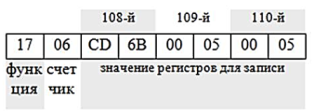
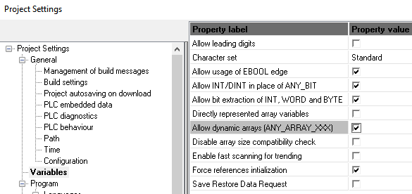
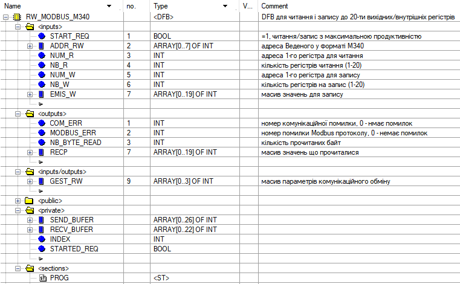
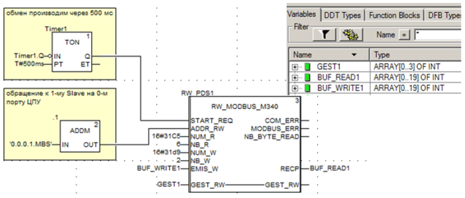

[<- До підрозділу](README.md)

# Реалізація функції 23 (17 HEX) Read/Write Multiple Registers в M340

Функція 23 дає можливість за один запит як прочитати вказані змінні так і записати інші змінні. Це зменшує час транзакції приблизно в два рази у випадку коли потрібно робити обидві операції одночасно. Це особливо актуально для обміну з пристроями вводу/виводу або іншою розподіленою периферією.  

Наприклад необхідно прочитати значення 3-х Holding Registers (`400108`, `400109`, `400110`) і записати `400201-й` і `400202-й`. 


рис.1. Формат повідомлення-запиту



рис.2. Формат повідомлення відповіді, якщо відповідь прийшла без помилок

Розглянемо це на прикладі створення функціонального блоку для реалізації функції Read/Write Multiple Registers в ПЛК Modicon M340. 

**Завдання.** Необхідно створити похідний тип функціонального блоку (DFB Type) для реалізації функції Modbus $17_{16}$ М340, за умов:

- кількість зчитуваних та записуваних регістрів довільне, але в діапазоні від 1 до 20;
- керуючий вхід функції `START_REQ` має запускати запити з максимально-можливою продуктивністю;
- дані для запису передаються у вигляді масиву `INT`;
- прочитані дані мають виходити у вигляді масиву `INT`;
- передбачити можливість контролю результату виконання операції через виходи: 
  - номеру комунікаційної помилки (`0` – відсутність помилки); 
  - номер помилки Modbus протоколу (`0` – відсутність помилки); 
  - кількість прочитаних байт;

Роботу функціонального блоку продемонструвати на прикладі періодичного (період=500 мс) зчитування з Slave 1, 6-ти регістрів, починаючи з `12741`, і записи 2-х регістрів, починаючи з `12761`.

**Рішення**

У UNITY PRO або Control Expert створіть проект з процесором P34 2000. В опціях проекту виставіть опцію `Variables -> Allow dynamic arrays` , яка дозволяє використовувати масив динамічні масив. 



рис.3. Виставлення опції  `Allow dynamic arrays`

Створіть DFB Type із структурою, показаною на рис.3. Крім перерахованих у постановці завдання входів та виходів блоку, додатково використовується параметр типу `input/output` `GEST_RW`. Масив `GEST_RW` – відповідає масиву комунікаційних параметрів, що використовується у функціональному блоці комунікаційної функції `DATA_EXCH`.



рис.4. Структура DFB Type `RW_MODBUS_M340`

Адреса Modbus Slave передається в блок тому самому форматі, як і у всіх комунікаційних функціях UNITY для M340.

Лістинг секції PROG типу похідного функціонального блоку RW_MODBUS_M340:

```pascal
    if NOT GEST_RW[0].0 AND STARTED_REQ then (*якщо функція DATA_EXCH оброблена*)
    	STARTED_REQ:=FALSE;
	COM_ERR:=GEST_RW[1]; (*в 1-м слові ком параметрів міститься звіт про обробку функції*)
	
	if COM_ERR=0 then (*якщо функція оброблена без помилок*)
		if (RECV_BUFER[0] and 16#00FF)=16#17 then (*якщо 1-й байт відповіді дорівнює номеру ф-ції*) 
		   NB_BYTE_READ:=ROL((RECV_BUFER[0] and 16#FF00),8); (*кількість прочитаних байт в 2-му байті*) 
		   (*--------- значення регістрів читання --------------*)
		   for INDEX:=0 to NB_BYTE_READ/2 do 
		   	RECP[INDEX]:=ROL((RECV_BUFER[INDEX+1]),8); (*перетворення BIG/LITTLE ENDIAN *)	
		   end_for; 
		else (*якщо 1-й байт не дорівнює номеру функції, то повернулася помилка*)
		   MODBUS_ERR:=ROL((RECV_BUFER[0] and 16#FF00),8); (*номер помилки у 2-му байті відповіді*)
		end_if;  
	end_if;

    end_if;

   if START_REQ and NOT GEST_RW[0].0 then (*---------------- запуск запиту--------------*)
	
	SEND_BUFER[0]:= 16#0017 or NUM_R and 16#FF00;(*1байт-адр 1-го рег читання (HI);2 байт-функція*)
	SEND_BUFER[1]:= NUM_R and 16#00FF;  (*3 байт-адр 2-го рег читання (LO), 4 байт-кількість (HI) завжди = 0*)
	SEND_BUFER[2]:= NB_R and 16#00FF or (*5 байт-кількість рег для читання (LO)*)
			NUM_W and 16#FF00;  (*6 байт-адр 1-го рег для запису (HI)*)
	SEND_BUFER[3]:= NUM_W and 16#00FF;  (*7 байт-адр 1-го рег для запису (LO), 8 байт-кількість (HI) завжди=0*)
	SEND_BUFER[4]:= NB_W and 16#00FF or (*9 байт-кількість рег для запису (LO)*)
			NB_W*2*16#100; 	    (*10 байт-кільк наступних байт = кіл_регістрів*2 => в старш байт*)
        (*--------- значенння регистрів для запису --------------*) 
	for INDEX:=0 to NB_W do
		SEND_BUFER[INDEX+5]:=ROL ((EMIS_W[INDEX]),8); (*перетворення BIG/LITTLE ENDIAN *)
	end_for;   
	
	GEST_RW [3]:= NB_W*2+10;(*в отсаннє слово таблиці параметрів потрібно записати*)
				(*кількість байт що передаються з записом, за вкилюченням адреси Slave*)   
	
	(*----------- вкилик функції ----------------*)
	DATA_EXCH (ADR := ADDR_RW ,
           TYP := 1, (*тип запиту, 1 - відправити запит і чекати відповіді*) 
           EMIS :=SEND_BUFER  (*дані для передачі*),
           GEST := GEST_RW(*параметри керуванняя*),
           RECP => RECV_BUFER (*дані для приймання*));
        
	STARTED_REQ:=TRUE;(* мітка запуска запиту*)
    end_if;
    if not START_REQ then  modbus_err:=0; end_if;
```

Для читання регістрів і бітів можна скористатися функцією `READ_VAR`, для запису `WRITE_VAR`, для інших клієнтських функцій Modbus в М340 використовується комунікаційна функція `DATA_EXCH`. Функція надсилає на адресу, вказану в `ADR`, запит (зміст запиту записується в `SEND_BUFER`). Параметр `TYP=1` вказує, що функція повинна чекати на відповідь. Після позитивної обробки функції, відповідь на запит буде доступна в `RECV_BUFER`. Запит формується у форматі MODBUS APP, тобто не включає поле адреси Slave (він береться з `ADDR`) та контрольну суму CRC (вона вираховується автоматично). Для роботи функції `DATA_EXCH` необхідно в останнє слово параметрів управління комунікаційним обміном (`GEST_RW[3]`) записати кількість байт, що передаються (виключаючи поле адреси та контрольної суми).

Слід зазначити, що у протоколі Modbus під час передачі регістрів спочатку передається старший байт слова, а потім молодший. Буфери передачі `DATA_EXCH` передаються в такий спосіб: молодший байт передається першим. Тобто при передачі та прийомі регістрів, старші та молодші байти будуть змінені місцями (проблема сумісності BIG/LITLE Endian). Для того, щоб вирішити цю проблему, у програмі використовується функція `ROL`, яка обертає вліво вказану кількість бітів слів (8, тобто один байт) у буфері передачі та прийому. При заповненні буфера передачі проходить зміщення на один байт, тому заповнення відбувається побайтно.

Програма для періодичного (період=500 мс) зчитування з Slave 1, 6-ти регістрів, починаючи з 12741, і записи 2-х регістрів, починаючи з 12761, показано на рис.4.



Рис.5. Програма для періодичного зчитування/запису регістрів (ліворуч) та таблиця змінних (у правому верхньому кутку)

Файл експорту DFB типу доступне [за посиланням](rw_modbus_m340_u.xdb)ю

Теоретичне заняття розробив [Олександр Пупена](https://github.com/pupenasan). 