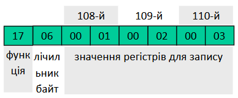
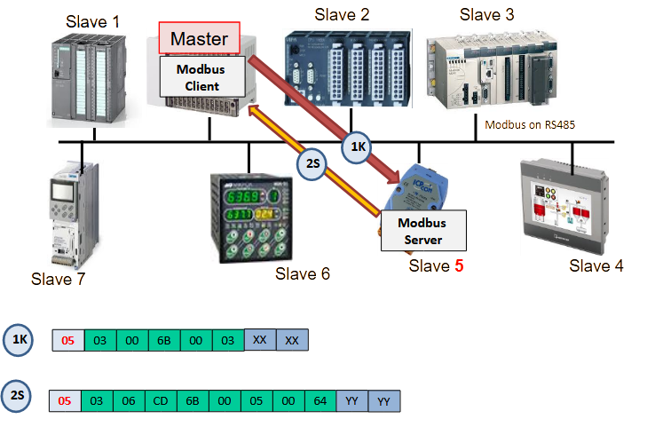
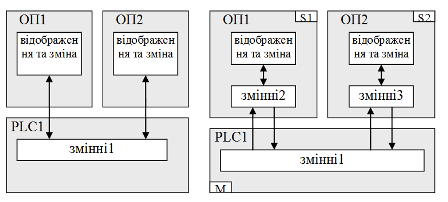
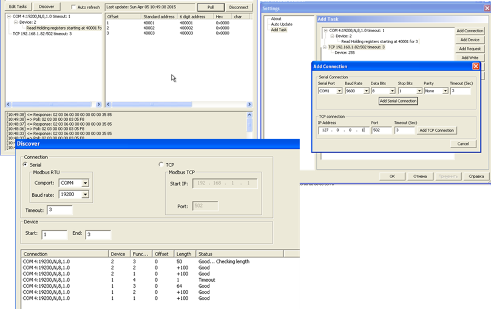

[<- До підрозділу](README.md)

# Мережі Modbus 

## 1. Загальні принципи функціонування та налаштування MODBUS

***MODBUS*** на сьогоднішній день є одним з найбільш популярних протоколів. Основна причина такої популярності – це простота в реалізації. Протокол MODBUS підтримує і розвиває організація ***MODBUS.ORG***. Вона забезпечує його відкритість та розроблює готові компоненти для спрощення реалізації. Згідно стандартів MODBUS.ORG – MODBUS є протоколом прикладного рівня для зв’язку типу Клієнт-Сервер між прикладними Процесами пристроїв, які під’єднані до різноманітних типів шин або мереж. В контексті OSI-моделі, ці мережі мають архітектуру, наведену на рис.1.

<a href="media/6_1.png" target="_blank"> 

Рис.1. MODBUS в контексті OSI-моделі

Як видно з рисунка, MODBUS на сьогоднішній день представлений 4-ма мережами: MODBUS RTU, MODBUS ASCII, MODBUS Plus і MODBUS TCP/IP. Перші реалізації MODBUS базувалися на послідовних інтерфейсах з двома режимами передачі RTU і ASCII, але з розвитком комп’ютерних мереж і їх інтеграції з промисловими мережами протокол MODBUS адаптували до використання в мережах, що базуються на основі TCP/IP. MODBUS Plus в основному використовується в пристроях Schneider Electric, тому розглядати його не будемо. 

MODBUS використовують для різних цілей, зокрема:

- обміну даними SCADA/HMI з ПЛК чи іншими інтелектуальними засобами (електроприводами, лічильниками, засобами розподіленого введення/виведення тощо);

- обміну даними між ПЛК;

- обміну даними ПЛК з іншими інтелектуальними засобами.

Усі вузли мережі, вірніше, їх прикладні процеси (програми), поділяються на дві категорії: ті, які мають дані (***Modbus сервери***), і ті, яким ці дані потрібно прочитати або змінити (***Modbus клієнти***). 

Для розуміння функціонування і особливостей роботи Modbus варто ознайомитися з ним з точки зору тих пристроїв, для яких він був створений. Протокол Modbus розроблено для зв’язування контролерів від фірми Modicon (тепер є частиною Schneider Electric). З боку серверу, який, як правило, являв собою ПЛК, передбачалося використовувати змінні з 4-х областей пам’яті (рис.2):

- дискретні виходи (0x), або котушки (***Coils***);

- дискретні входи (1x), іншими словами – вхідні біти (***Input Bits***) ;

- аналогові входи (3x), або вхідні регістри (***Input Register*,** 16-бітові) ;

- аналогові виходи (4x), або вихідні/внутрішні регістри (***Holding Registers*,** 16-бітові). 

Кожна область має умовний номер (зміщення) і вміщує комірки, до яких можна звертатися за адресою, починаючи з 1. Так, область Input Registers починається з комірки **3**0001 (або 300001, залежно від варіантів ПЗ). Усі інші комірки області вхідних регістрів розміщуються в адресах, номер яких послідовно збільшується. Таким чином, при розробленні проекту для такого типу ПЛК Modicon інженер-програміст указував, які комірки пам’яті за які саме канали відповідали. А пристрій Modbus клієнт, який мав прочитати чи записати цю комірку, звертався до неї за її номером та номером області пам’яті, в якому вона знаходилася. 

                               

*Рис.2.* Області пам’яті згідно з MODBUS

Комірки з усіх зон пам’яті доступні для читання. Однак для записування доступні тільки комірки з областей Holding Registers та Coils, адже вхідні дані змінюються тільки залежно від значення вхідних каналів. 

Не дивлячись на цілком логічну архітектуру пам’яті ПЛК Modicon, на практиці необхідно обмінюватися також іншими даними. По-перше, протокол Modbus використовується зараз для зв’язку не тільки з ПЛК Modicon. По-друге, в якості Modbus серверів, як було вже зазначено, може бути взагалі не контролер, а, наприклад, перетворювач частоти. Крім того, для обміну внутрішніми змінними, параметрами регуляторів тощо потрібні інші типи комірок пам’яті. Тому виробники пристроїв самі вирішують, як зрештою організована пам'ять пристрою і як вона зв’язується з комірками згідно з Modbus. Тобто в самому пристрої йде так зване ***відображення*** (***Mapping***) реальних комірок пам’яті на комірки, що означені в Modbus (рис.3). За якими правилами проводиться це відображення, означується самим виробником пристрою. Тому розробникові системи необхідно ознайомитися з документацією на конкретний пристрій, перш ніж з’єднуватися з ним по протоколу Modbus. 

 

*Рис.3*. Відображення реальних комірок пам’яті на віртуальну пам’ять MODBUS

## 2. Реалізація Modbus на прикладному рівні

### Формат MODBUS PDU

Порядок доступу до комірок пам’яті, правила формування повідомлень, які при цьому використовуються, означені протоколом MODBUS. ***MODBUS Application Protocol (MBAP*** MODBUS протокол прикладного рівня) базується на моделі клієнт-серверного обміну повідомленнями і означує формат повідомлень ***MODBUS PDU*** (Protocol Data Unit). Клієнтський прикладний процес робить повідомлення-запит до серверного процесу, в якому в полі "код функції" вказує йому на функцію (сервіс), яку необхідно провести, а в полі даних уточнює деталі виконання цієї функції. Більшість доступних функцій (сервісів) – це операції читання/записування (рис.4)  
 

*Рис.4.* Сервіси (функції) Modbus

При конфігуруванні введення/виведення в SCADA/HMI або інших конфігураційних програмах розробникові не обов’язково потрібно знати формати повідомлень. Однак при налагодженні розуміння протоколу може дати певні відповіді на проблемні питання. У той же час при написанні протоколу самотужки, формат повідомлення треба знати обов'язково. 

На рис.5. показано приклад виконання функції  читання Holding Registers.

  

*Рис.5.* Приклад читання Holding Registers з `400108` по `400110` (3 шт)

Перший байт у запиті є номером функції: 03 – читання Holding Registers. Далі вказується область даних, яку необхідно прочитати: починаючи зі 108-го (107 зміщення), 3 регістри. При позитивній відповіді (коли немає помилок) MODBUS сервер повертає той самий номер функції і регістри, які були запитані. При негативній відповіді, сервер пришле повідомлення з модифікованим номером функції (старший біт в 1) та номером помилки, у даному випадку $83_{16}$. 

Таким чином, для вказівки джерела даних (змінної) на пристрої Modbus необхідно вказати необхідну комірку (-ки). У програмі SCADA/HMI це може робитися різним чином:

- вказівкою адреси у форматі (0x, 1x, 3x, 4x);

- вказівкою області пам’яті (Input Bits, Coils, Input Register, Holding Registers) та зміщення в ній відносно 1-го елемента;

- вказівкою використовуваної функції, адресою початкового елемента.  

Для інших засобів спосіб означення може також відрізнятися, він може як конфігуруватися так і програмуватися з використанням спеціалізованих функцій. 

Згідно опису протоколу повідомлення має формат, який показано на рис.6. 

Рис.6. Формат повідомлення MODBUS PDU.

Клієнтський прикладний Процес робить повідомлення-запит до серверного Процесу, в якому в полі „код функції” вказує йому на дію, яку необхідно провести. Байти даних вміщують інформацію, яка необхідна для виконання даної функції. Серверний прикладний Процес у випадку вдалого виконання цієї функції повторює код функції у відповіді (якщо запит передбачає відповідь). При виникненні помилки, код функції у відповіді модифікується (старший біт виставляється в 1) а в байтах даних передається причина помилки. Тобто, якщо при передачі клієнтським прикладним Процесом повідомлення-запиту з функцією $03_{16}$ ($00000011_2$) виникла помилка у її виконанні Сервером, той відішле відповідь з полем функції рівним $83_{16}$($10000011_2$). В доповненні до зміни коду функції, при помилці, Сервер розміщує в поле даних унікальний код, який вказує на тип і причину помилки.

Код функції може приймати значення від 1 до 255 (коди 128-255 зарезервовані під коди повідомлень-відповідей при помилкових діях). Всі коди функцій в MBAP діляться на (див рис.7):

-     Public Function Codes – це публічні коди, які описані в стандарті MODBUS-ORG, список яких включає в себе вже назначені та використовувані коди, а також коди для майбутнього використання;

-     User-Defined Function Codes (65-72, 100-110) – це коди, які можуть використовуватись компаніями для власних функцій і не описані в специфікації;

-     Reserved Function Codes (9, 10, 13, 14, 41, 42, 43, 90, 91, 125, 126 і 127) – це зарезервовані коди, які не доступні для загального використання. 

Нижче розписані тільки ті функції, які призначені для доступу до даних процесу.

 

Рис.7. Функції MODBUS

У повідомленні-запиті за полем коду функції можуть слідувати дані, які уточнюють або доповнюють функцію допоміжними даними. Це можуть бути адреси змінних, їх кількість, лічильник байтів даних та самі дані для запису. Для певних функцій, поле даних може бути відсутнім взагалі. Максимальна довжина повідомлення прикладного рівня рівна 253. 

### Формат основних функцій

Повний список кодів а також специфікацію протоколу можна знайти на офіційному Веб сайті MODBUS.ORG - [www.MODBUS.org](http://www.modbus.org/). Далі детально розглянемо тільки найбільш вживані функції MODBUS для обміну даними процесу. Номер функції дається в шістнадцятковому форматі. Скорочення в дужках Hi та Lo що  вказують відповідно на старший та молодший байти. Тобто, якщо для вказівки адреси початкової змінної необхідно двобайтове слово, то значення старшого байта буде передаватись в полі з позначенням Hi, а молодшого – відповідно Lo.

#### Код функції 01h − читання статусу Coils (дискретних вихідних бітів). 

Повідомлення-запит вміщує адресу початкового біту і кількість бітів для читання. Біти нумеруються починаючи з 0. У повідомленні-відповіді кожне значення змінної передається одним бітом, тобто в одному байті пакується статус 8 бітових змінних. Якщо кількість їх не кратно восьми, інші біти в байті заповнюються нулями. Лічильник вміщує кількість байт в полі даних. 

 

#### Код функції 02h − читання статусу дискретних входів. 

Формат даного запиту такий же як попереднього, за винятком поля функції.

#### Код функції 03h  − читання значення вихідних/внутрішніх регістрів. 

Повідомлення-запит вміщує адресу початкового вихідного/внутрішнього регістру (двохбайтове слово), і кількість регістрів для читання. Регістри нумеруються починаючи з 0.

 

 У відповідному повідомленні в полі даних кожний регістр передається двома байтами.

#### Код функції 04h − читання значення вхідних регістрів. 

Формат даного запиту такий же як попереднього, за винятком поля функції.

#### Код функції 05h − запис вихідного/внутрішнього біту. 

В запиті вказується номер бітової змінної та значення: 0 – 0000, а 1 – FF00, всі інші значення не міняють стан змінних. В широкомовній передачі клієнтський запит виставляє значення даної змінної для всіх серверів.

 

Нормальна відповідь серверу являється повторенням запиту до клієнта. 

#### Код функції 06h − запис вихідного/внутрішнього регістру. 

Функція аналогічна попередній, але оперує з регістрами(словами). В запиті вказується номер вихідного/внутрішнього регістру та його значення. В широкомовній передачі запит виставляє значення даної змінної для всіх серверів.

 

Нормальна відповідь сервера являється повторенням запиту клієнту. 

#### Код функції 0Fh − запис декількох вихідних/внутрішніх бітів. 

В запиті вказується початкова адреса біту, кількість біт для запису, лічильник байтів і безпосередньо значення. В широкомовній передачі біти записуються всім серверам. Розглянемо приклад для встановлення наступних бітових вихідних/внутрішніх змінних:

 

В таблиці показана відповідність адреси змінної, починаючи з 19-ї, і значення біту. Для зручності біти розміщені у тому порядку, що і передаються. В другому байті корисні тільки 2 перші біти, значення інших не буде прийнято до уваги, оскільки кількість бітів вказані у кадрі. Запит та відповідь будуть мати такий вигляд:

 

#### Код функції 10h − запис декількох вихідних/внутрішніх регістрів. 

 

#### Код функції 17h − читання/запис декількох вихідних/внутрішніх регістрів 

Функція 23 дає можливість за один запит як прочитати вказані змінні так і записати інші змінні. Це зменшує час транзакції приблизно в два рази у випадку коли потрібно робити обидві операції одночасно. Це особливо актуально для обміну з пристроями вводу/виводу або іншою розподіленою периферією.  

Наприклад необхідно прочитати значення 3-х Holding Registers (`400108`, `400109`, `400110`) і записати `400201-й` і `400202-й`. 

### Повідомлення про помилки 

При запиті Клієнта до Серверу, можуть мати місце наступні ситуації:

-    якщо Сервер прийняв запит без комунікаційних помилок, і може нормально розпізнати запит, він повертає нормальну відповідь;

-    якщо Сервер не прийняв запит, відповідь не повертається. Клієнт очікує відповіді протягом певного тайм-ауту;

-    якщо Ведений (для MODBUS Serial) прийняв кадр, але знайшов комунікаційну помилку (паритет, помилка контрольної суми), то кадр-відповідь не повертається, а Ведучий чекає відповіді на запит протягом певного тайм-ауту;

-    якщо Сервер прийняв запит без комунікаційної помилки, але не може виконати замовлену функцію (наприклад, читання не існуючих виходів або регістрів), Сервер повертає повідомлення про помилку і її причини. 

Повідомлення про помилку має два поля які відрізняються від полів нормальної відповіді:

ПОЛЕ КОДУ ФУНКЦІЇ: при нормальній відповіді сервер повертає в цьому полі той номер функції, який потребував клієнт. У всіх кодах функції старший біт встановлений в 0. При поверненні повідомлень про помилку, Сервер встановлює цей біт в 1, по чому Клієнт може ідентифікувати наявність помилки.

ПОЛЕ ДАНИХ: В цьому полі при помилці повертається її код. 

Повідомлення помилки стосуються всіх типів MODBUS, але першопочатково були визначені для MODBUS Serial (RTU/ASCII). Нагадаємо, що відповідь про помилку приходить тільки в тому випадку, якщо прикладні програми обмінюються даними, але сервер не може виконати сервіс за якихось причин. Однак, якщо відбувається комунікаційна помилка, то сервер не відповість на запит взагалі. Якщо ж відповіді приходять, тоді ця відповідь містиме 5 байт, де 2-й байт – номер функції з модифікованим старшим бітом. По номеру помилки (3-й байт) можна визначити номер помилки (рис.8). Означені стандартом помилки наведені в табл.2.     

*Таблиця2.*  **Номер та опис помилки** **Modbus**

| **Код** | **Назва**            | **Опис**                                                     |
| ------- | -------------------- | ------------------------------------------------------------ |
| 01      | ILLEGAL FUNCTION     | Прийнятий код функції не може бути  оброблений на сервері    |
| 02      | ILLEGAL DATA ADDRESS | Адреса даних, вказана в запиті, не  доступна даному серверу  |
| 03      | ILLEGAL DATA VALUE   | Величина, вміщена в полі даних  запиту, є недопустимою величиною для сервера |
| 04      | SLAVE DEVICE FAILURE | Поки сервер намагався виконати дію  запиту, мала місце невиправна помилка |
| 05      | ACKNOWLEDGE          | сервер прийняв  запит і оброблює його, але необхідний певний час. Ця відповідь захищає клієнта  від генерації помилки тайм-ауту |
| 06      | SLAVE DEVICE BUSY    | сервер зайнятий обробленням команди,  клієнт повинен повторити запит пізніше |
| 07      | NEGATIVE ACKNOWLEDGE | Невдалий програмний запит (для  функцій 13 і 14)             |
| 08      | MEMORY PARITY ERROR  | сервер хоче читати розширену пам’ять,  але знайшов помилку паритету |

*Рис.8.* Відповідь веденого в разі помилки оброблення запиту Modbus

### Адресна модель MODBUS та доступ до даних

Всі змінні до яких звертається клієнтський прикладний Процес являються частиною області пам’яті пристрою. Як вже зазначалося, фізичні адреси цих змінних як правило не співпадають з тими, до яких він звертається згідно протоколу. Ці змінні є відображенням (mapping) дійсних даних в пристрої. На рис.9 показаний процес обробки запитів на стороні серверу MODBUS. Як видно з рисунку, при зверненні до певної змінної по її номеру, наприклад на читання,  по суті йде звернення до певної області даних в прикладній програмі пристрою. Зв’язок даних MODBUS моделі з фізичними даними називають відображенням (mapping\).   

  

Рис.9. Адресна модель MODBUS

Слід відмітити, що мінімальна адреса елементу даних моделі MODBUS дорівнює 1 а не 0.

Таке розмежування між фізичною структурою даних і MODBUS моделі даних дає можливість адаптувати протокол під структуру різних пристроїв. Для прикладу, в стандарті наводяться два популярні способи реалізації MODBUS моделі даних: розділення даних по блокам (рис.10) та використання доступу до даних одного і того ж блоку (рис.11). Як видно з рисунків модель даних з єдиним блоком дає доступ до одних і тих же фізичних даних. Тобто області Input та Holding регістрів співпадають, а області Digital Inputs та Coils теж співпадають і знаходяться в області регістрів. 

Рис.10. Модель даних MODBUS з розділеними блоками

Рис.11. Модель даних MODBUS з єдиним блоком 

Розглянемо модель даних для різних типів пристроїв. Для цього покажемо відображення даних моделі MODBUS на адресний простір Momentum/Quantum (Schneider Electric), M340/M580 (Schneider Electric), Vipa CPU-21xSER1 (VIPA) Vipa IM-253NET(VIPA) та перетворювача частоти ATV31 . Для старих контролерів Schneider Electric Momentum та Quantum, MODBUS – це рідний протокол, тому модель даних MODBUS абсолютно співпадає з моделлю їх адресного простору. Нумерація змінних починається з 1-ї (0-вий номер в запиті звертається до 1-ї змінної)

Для контролерів M340/M580 доступ надається тільки до внутрішніх змінних (`M` - Memory), тому різниці між вхідними та вихідними бітами та регістрами немає, однак бітова область не співпадає з регістровою. Тобто Сервер MODBUS цих ПЛК будуть однаково реагувати скажімо на функції `01` та `02`, або `03` та `04`. Нумерація змінних починається з `0-ї` (`0`-вий номер в запиті звертається до 0-ї змінної, тобто `%M0`-біт, або `%MW0` – регістр). Таким чином загальна таблиця відображення даних для різних ПЛК від Schneider Electric має наступний вигляд:

|                   | Momentum/Quantum | M340/ M580 |
| ----------------- | ---------------- | ---------- |
| Input Discrete    | 1XXX             | %M         |
| Coils             | 0XXX             | %M         |
| Input Registers   | 3XXX             | %MW        |
| Holding Registers | 4XXX             | %MW        |

Рис.12. Приклад Modbus Mapping для ПЛК M340

Для Siemens-подібних контролерів VIPA мережі MODBUS не являються найбільш вживаними. Тим не менше VIPA випускає номенклатуру модулів з підтримкою даного протоколу. Зокрема в процесорних модулях типу Vipa CPU-21xSER1, є вбудований послідовний порт з підтримкою MODBUS Serial (RTU/ASCII) як в режимі Ведучого так і Веденого. Модуль представляє бік Серверу MODBUS- в режимі Веденого (пояснення дивись в MODBUS Serial), тому саме в цьому режимі розглядається відображення даних моделі MODBUS. При конфігурації послідовного порту CPU-21xSER1, задається його режим (MODBUS Master). Далі, весь обмін проходить через вхідні та вихідні буфери (рис.13), які прикладна програма повинна поновлювати самостійно. Однак буферів всього два, а отже бітові змінні знаходяться в пам’яті регістрових, вхідні в області вхідних регістрів, вихідні – вихідних (див.рис.14). 

Рис.13. Обмін даними MODBUS в ПЛК VIPA CPU-21xSER1
Слід зазначити, що буфери є внутрішньою пам’яттю комунікаційного порту, а не самого ПЛК. Для відображення буферів на області пам’яті ПЛК, в комунікаційних функціях `SEND` та `RECEIVE` вказується необхідна область пам’яті, як правило це `DB-область`. Необхідно також пам’ятати, що адресація даних в буферах з боку мережі проходить по словам, а з боку програми до DB ПЛК – по байтам.

 Рис.14. Відображення змінних у вхідному та вихідному буферах для ПЛК VIPA

Інтерфейсний модуль Vipa IM-253NET(VIPA) для побудови розподілених систем вводу/виводу на базі Ethernet підтримує MODBUS TCP/IP тобто може бути Сервером MODBUS (Клієнтом бути не може). Доступ до входів та виходів системи на базі інтерфейсного модуля відбувається аналогічно, як показано на рис.13. Буфер IN поновлюється модулем автоматично, а виходи ПЛК автоматично відновлюються даними з буферу OUT.

рис.15. Приклад Modbus Mapping для ПЛК VIPA

Для перетворювачів частоти (ПЧ) аналогові/дискретні входи/виходи взагалі втрачають сенс, так як при обміні як правило цікавить інформація про стан самого ПЧ та швидкості, струму, двигуна тощо, а керування здебільшого зводиться до відправлення команди та заданого значення частоти. Тому відображення може бути будь яким. Як правило використовують єдину область Holding Registers, як це зроблено наприклад в  ПЧ Altivar (рис.16). Це ж стосується і інших вимірювальних пристроїв та засобів керування.    

рис.16. Приклад Modbus Mapping для ПЧ Altivar

### Послідовність байт та слів у змінних

У протоколі MODBUS означені 16-бітні регістри, і протоколом означено у якій послідовності передаються байти в них. Однак при необхідності роботи з даними типу REAL (FLOAT) та DINT/UDINT, в протоколі немає вказано правило послідовності передачі. Як правило при передачі більших за 16-розрядів даних проводиться прив’язка до комірок із сусідніми адресами. У цьому випадку також треба означити послідовність слідування цих комірок, інакше дані будуть неправильно інтерпретовані. Ця проблема відома як big-endian vs little-endian. Терміни `big-endian` і `little-endian` запозичено у Джонатана Свіфта з його сатиричного твору «Мандри Гуллівера», де описуються держави Ліліпутія і Блефуску, що вели між собою протягом багатьох років війни через розбіжності з приводу того, з якого кінця слід розбивати варені яйця («гострого» чи «тупого» кінця («little-» and «big-endians»)).

рис.17. Проблема доступу до REAL, DOUBLE та інших типів

На рис.18 показано приклад означення порядку регістрів для FLOAT і DWORD в SCADA zenon як клієнта. У SCADA Citect наприклад це вказується в налаштуваннях Citect.ini, а в WinCC Comfort – опцією "Change Word order" . Також на рис.18 показано, як будуть відрізнятися відображення значення змінних при різному порядку слідування регістрів у подвійних словах та в змінних із плаваючою комою.  

 

*Рис.18.* Налаштування порядку регістрів в REAL та DOUBLE в SCADA Zenon

При обміні між програмованими контролерами з різними представленнями порядку слів і байт можна скористатися функціями або інструкціями зміщення бітів (рис.19).  

*Рис.19.* Зміна послідовності байт в ПЛК 

Слід розуміти, що Modbus Protocol є протоколом прикладного рівня. Він не означує, яким чином проводиться доставка повідомлення від клієнта до сервера та в зворотному напрямку, це залежить від типу мережі Modbus. Для розробника SCADA/HMI необхідно також розуміти, як функціонує ця мережа, які додаткові налаштування потрібні та які є обмеження. У наступних параграфах розглядається Modbus RTU та Modbus TCP/IP. 

## 3. Modbus Serial

### Modbus Serial, Modbus over Serial, RTU, ASCII

Перші мережі MODBUS базувалися на асинхронних послідовних лініях зв’язку і отримали назву ***MODBUS RTU*** та ***MODBUS ASCII*.** На фізичному рівні вони використовують стандартні послідовні інтерфейси із символьним режимом передачі. На сьогодні в MODBUS.ORG ці мережі мають назву ***MODBUS over Serial Line*** і описані у відповідному стандарті. У ньому вказуються правила та рекомендації використання на канальному та фізичному рівнях. 

Згідно зі стандартами MODBUS.ORG, Modbus over Serial Line (Modbus RTU або Modbus ASCII) може функціонувати поверх інтерфейсів RS-485 або RS-232. На практиці Modbus over Serial Line може працювати поверх будь-яких стандартних послідовних асинхронних інтерфейсів (RS-422, Current Loop і т.п). Замість словосполучення "Modbus over Serial Line" частіше використовують "мережа Modbus" (Modbus network), "шина Modbus" (Modbus bus), Modbus Serial або прямо вказують Modbus RTU чи Modbus ASCII. Щоб вказати повний стек протоколів та інтерфейсів для конкретної реалізації мережі, краще використовувати назву типу "Modbus RTU on RS485". 

Усі вузли в мережі повинні функціонувати в однакових режимах і з однаковими комунікаційними параметрами. По замовченню - режим Modbus RTU.
Modbus RTU та Modbus ASCII відрізняються форматом кадрів, які переносять Modbus Serial Line PDU:

- Modbus RTU: кожен байт Modbus Serial Line PDU передається окремим символом (8 біт даних). 
- Modbus ASCII: всі числові значення передаються як ASCII символ, тобто 7-бітним кодом; один байт – два символи 

### Метод доступу та адресація

Оскільки мережа Modbus over Serial Line може мати шинну топологію, то в кожен момент часу тільки один вузол може передавати, тому необхідно визначити метод доступу.  У Modbus over Serial Line визначений метод доступу до шини за моделлю Ведучий/Ведений: 

- один вузол є Master (Ведучий) усі інші Slave (Ведений)
- кожен Slave при налаштуванні отримує унікальну адресу від 1 до 247, наприклад через утиліту конфігурування, або перемикачем
- Master не має адреси, усі відповіді направлені до нього
- Master передає свій кадр у будь який момент при необхідності, у Modbus Serial це передача в кадрі запиту до Серверу
- Slave може передати свій кадр тільки тоді, коли дозволяє Master, у Modbus Serial це передача в кадрі відповіді до Клієнту
- у Modbus Serial може функціонувати тільки один Клієнт на вузлі Master, на усіх інших вузлах (Slave) виконуються тільки процеси-Сервери 
- при широкомовних запитах (broadcast) використовується 0-ва адреса; широкомовні запити не потребують підтвердження, тому після відправки широкомовного кадру Ведучий не очікує кадр відповіді. 

рис.20. Modbus Serial – метод доступу та адресація 

В мережах MODBUS RTU та MODBUS ASCII Процес Ведучого завжди являється Клієнтом, а Процеси Ведених – Серверами. Це значить, що Ведучий відсилає запити, а Ведені їх обробляють. Цей запит може бути адресований як індивідуальному вузлу так і всім Веденим на шині (broadcast). Ведені не можуть ініціювати запити ні до Ведучого ні до іншого Веденого (рис.21). У деяких засобах можливе переключення ролей Master/Slave, механізм такої "мультимастерності" не означений протоколом і є доробкою виробників.

рис.21. Modbus Serial – Ведені не можуть спілкуватися між собою 

Якщо необхідно передати дані між Веденими це повинен робити Ведучий (рис.22):

- 1К. Ведучий робить запит на зчитування потрібних змінних.
- 1S. Ведений віддає значення змінних.
- 2K. Ведучий записує ці значення змінних Веденому.
- 2S. Ведений відповідає підтвердженням.

Такий спосіб не описаний в протоколі і реалізовується самостійно!

рис.22. Спосіб обміну між Веденими через Ведучого

На канальному рівні MODBUS RTU/ASCII використовується адресація орієнтована на ідентифікатори вузлів. Кожний Ведений повинен мати свою унікальну адресу (1-247), Ведучий не адресується.. При індивідуальних запитах, Ведучий з клієнтським Процесом формує кадр із повідомленням-запитом і відправляє його за вказаною адресою. Ведений з серверним Процесом отримує цей кадр і обробляє повідомлення. Після його обробки Ведений формує кадр з повідомленням-відповіддю і відправляє його назад Ведучому. Кадр з повідомленням-відповіддю носить також функції кадру підтвердження, який Ведучий буде чекати від Веденого протягом часу, визначеного тайм-аутом.

### Кадр Modbus Serial

На рис.23 показаний загальний вигляд кадру MODBUS Serial. Зверніть увагу, що розмежування між кадрами та тип контрольної суми тут не вказано, оскільки це залежить від режиму передачі ASCII або RTU. В полі адреси пристрою Ведучий при запиті вказує адресу отримувача, а Ведений при відповіді - свою адресу. Поля MODBUS PDU описані вище.

рис.23. Кадр Modbus Serial

рис.24. Приклад звернення до одного Веденого

рис.25. Приклад широкомовної посилки

### Помилки каналу та контрольна сума

Кадр передається з перевіркою контрольної суми, алгоритм розрахунку якої різний для Modbus RTU Modbus та ASCII. Якщо при отримані кадру контрольна сума не співпадає – цей кадр ігнорується. Те саме стосується біту паритету, якщо він вказується. Якщо символ не пройшов перевірку біту паритета – кадр також ігнорується. 

Відповідь Ведучим від від Веденого очікується протягом певного часу TimeOut, який як правило вказується в налаштуваннях Ведучого (рис.26). Ведучий при цьому може повторити запит декілька раз при помилці TimeOut, однак це буде впливати на загальний обмін з іншими Веденими.

рис.26. Приклад налаштування Timeout

На часовій діаграмі рис.27 показані три типові ситуації роботи моделі Ведучий/Ведений на MODBUS Serial. Перша ситуація – типовий обмін в одноадресному режимі, друга – в широкомовному, третя – реакція Веденого на комунікаційну помилку. 

 

Рис.27. Часова діаграма обміну на MODBUS Serial

### MODBUS RTU

Даний режим передбачає використання 8 біт даних в 11-бітному символі, що дозволяє передавати по байту на символ. Формат символу в RTU режимі:   1 стартовий біт;  8 біт даних (молодший біт передається першим); 1 біт паритету + 1 стоповий біт або без паритету + 2 стопових біта. 

Рис.28. Modbus RTU та Modbus ASCII формат символу

Формат кадру MODBUS RTU наведений на рисунку 29. Розмежування між кадрами проводиться за допомогою пауз між символами. Новий кадр не повинен з’являтися на шині раніше, ніж 3.5Тс від попереднього, де Тс – час передачі одного символу. Якщо час відсутності сигналу на лінії (інтервал тиші) буде більше ніж 3.5Тс приймач ідентифікує помилку. З іншого боку, появлення нового кадру раніше ніж 3.5Тс, теж приведе до помилки. 

Рис.29. Modbus RTU (8 bit) формат кадру

Поле адреси і коду функції в RTU режимі займають по одному байту, оскільки байти передаються по символу на кожний. В якості контрольної суми використовується два байти, обраховані по алгоритму CRC16.

### MODBUS ASCII

У даному режимі кожний байт повідомлення передається як два ASCII символи їх шістнадцяткового представлення, тобто значення байта $03_{16}$ буде передаватись як ASCII-код символів „0” і „3” (0110000 0110011) Отже байти даних, код функції і байт поля перевірки буде передаватись кодами символів 0-9, A-F. Формат символу в ASCII-режимі: 1 стартовий біт; 7 бітів даних, молодший біт передається першим; 1 біт паритету + 1 стоповий біт або без паритету + 2 стопових біта. 

рис.30. Modbus ASCII формат символу

Формат кадру наведений на рис.31. Як бачимо, для розмежування між кадрами використовуються стартовий символ „:” та стопова послідовність „CR LF”. Приймачі на шині безперервно відслідковують символ „:” який однозначно вказує на початок кадру. Коли він прийнятий, приймачі відловлюють поле адреси і т.д. Це дуже простий спосіб синхронізації, який дозволяє некритично відноситись до пауз між символами (до 1 сек.). Адреса Веденого та код функції займають по два символи, відповідно до значення одного байта. Далі йдуть `n*2` символів даних, де `n` - кількість байтів даних. В ASCII режимі MODBUS для підрахунку контрольної суми використовується алгоритм LRC. Причому контрольна сума проводиться над усіма байтами кадру, виключаючи стартову та стопову послідовність символів.

Рис.31. Modbus ASCII (7 bit) формат кадру 

Режим ASCII накладає менші вимоги на обладнання за рахунок використання стартової і стопової послідовності в розмежуванні кадрів і нечутливості до значних пауз між символами. Але переваги є і його недоліками. RTU-режим більш вимогливий до інтервалів між кадрами, але значно продуктивніший ніж попередній. 

Рис.32. Приклад передачі кадру в Modbus ASCII

### Методика розрахунку часу передачі

Розглянемо розрахунок часу опитування Ведених на MODBUS-RTU через приклад, в якому необхідно побудувати кадри форматів повідомлень запитів та відповідей для MODBUS RTU та розрахувати загальний час опитування 10-ти аналогових 16-бітних змінних для 4-х Ведених (рис.33). Швидкість передачі даних 19200 біт/с. Клієнтський Процес Ведучого (TSX Premium) та серверні Процеси Ведених (ПЛК TSX Micro ) приймають повідомлення на початку циклу, а відправляють - в кінці циклу. Час циклу Ведучого = 10 мс, Ведених - 5с. 

Доступ до внутрішніх аналогових змінних TSX Micro проводиться через 03 або 04 функцію, тому формат кадрів буде мати вигляд як на рис.23. 

 

Рис.33. Постановка задачі до прикладу 

Враховуючи, що структура інших кадрів – аналогічна, наводити їх формат немає сенсу. 

Аналогічно рис.27 побудуємо часову діаграму обміну (рис.34). З боку клієнтської програми повідомлення-запит формується за допомогою комунікаційної функції, відправка даних якої через комунікаційний порт проводиться в кінці циклу задачі, а отримування з порту – на початку циклу. Така поведінка клієнтської сторони цілком відповідає багатьом реалізаціям для різних ПЛК.

В TSX Micro MODBUS-Сервер реалізований на рівні операційної системи. Специфіка реалізації заключається в тому, що прийом MODBUS-запитів з комунікаційного порту системою проводиться на початку циклу, а відправка повідомлень-відповідей – вкінці. 

Слід зазначити, що реалізація MODBUS-Серверу може бути підтримана на рівні комунікаційного модуля, а обмін даними з пам’яттю самого пристрою проводитись через комунікаційні буфери. В цьому випадку реакція MODBUS-Сервера буде значно швидшою і не залежати від циклу програми. Для розрахунку часу транзакції для інших типів систем необхідно ознайомитися з деталями їх реалізації.  

На рис.27 показано, що надходження кадру приходить десь всередині циклу. Це значить, що їх обробка та генерація відповіді пройде приблизно через 1,5 циклу. Слід розуміти, що це усереднене значення, для найгіршої оцінки краще резервувати 2 часу циклу (тобто коли кадр прийшов відразу після опитування комунікаційного порту). Таким чином час транзакції для одного ПЛК, наприклад PLC1 (ТТ1),  буде дорівнювати:

`ТТ1=С5+T1.req+2*C1+T1.res+C5*2`                            (1)

 

Рис.34. Часова діаграма до прикладу 

ТТ1 розрахований з урахуванням 2 циклів затрачених Веденим на генерацію відповіді на повідомлення-запит. Якби транзакця проводилась не періодично, як по умові задачі, а по виникненню події, то в час транзакції необхідно б було включити також ще один цикл Ведучого. Нескладно вивести час опитування всіх Ведених:

`ТТall=C5*9+C1*2+C2*2+C3*2+C4*2+T1.req+T1.res+T2.req+T2.res+ T3.req+T3.res+ T4.req+T4.res`       (2)

Враховуючи, що цикли Ведених однакові, а кадри запитів і кадри відповідей для всіх Ведених мають однакову структуру, загальна формула буде мати наступний вигляд: 

`ТТall= C5*9 + C1*8 + (T1.req+T2.req)*4`                      (3)

Розрахуємо час T1.req та T2.req. Час передачі кадру (Тframe) можна орієнтовно розрахувати по кількості символів (Nsymb) в кадрі та часу передачі одного символу (Tsymb):

`Tframe=NsymbTsymb`                         (4)

Час передачі одного символу розраховується:

`час передачі одного символу = кількість біт в символі / бітова швидкість;`

Час передачі кадрів буде  дорівнювати:

`T1.req=8*(11/19200)=4,58 мс`

`T1.res=25*(11/19200)=14,33 мс`

`TTall=90+40+ (4,58+14,33)*4= 206 мс.`

Таким чином, для опитування 10-ти змінних з 4-х Ведених зі швидкістю 19200 біт/с необхідно затратити приблизно 206 мс. Якщо необхідне періодичне опитування бажано зарезервувати певний час, наприклад ще додатково 100 мс.

У ряді випадків реалізація функцій MODBUS-Клієнта лягає на операційну систему, а доступ до них в програмі ПЛК відбувається через інтерфейсні комунікаційні функції. Зокрема це характерно для більшості ПЛК від Scneider Electric. В ряді інших систем – клієнтську сторону на прикладному рівні необхідно повністю прописувати в програмі ПЛК, а інтерфейс надається тільки для обміну з комунікаційним портом. В цьому випадку система надає сервіси відправки та отримання повідомлення (яке формує і аналізує сама програма користувача), і генерації та перевірки контрольної суми.

### Реалізація фізичного рівня для MODBUS Serial

На відміну від початкової специфікації, яка обмежувалась описом кадру, в стандарті MODBUS.ORG описуються також правила для реалізації мережі на фізичному рівні. MODBUS over Serial Line базується на використанні послідовних інтерфейсів RS-485, RS-422 та RS-232, які описані [тут](../serial/README.md). 

Для  RS-485 визначена топологія – це шина, до якої передбачено три способи підключення пристроїв (рис.35):

-     безпосередньо до магістрального (trunk) кабелю, так званим способом daisy-chain;

-     через пасивну коробку підключення та кабель відгалуження (Derivation);

-     через активну коробку та специфічний кабель відгалуження. 

 

Рис.35. Інфраструктура шини MODBUS для послідовного інтерфейсу RS-485

Інтерфейси між кабелями та лементами мережі мають наступні позначення (див. рис.35): 

- ITr – інтерфейс до магістрального кабелю; 
- IDv – інтерфейс між пристроєм та пасивною коробкою;  
- AUI  - інтерфейс між пристроєм та активною коробкою; 
- LT – термінатори лінії.

Бітові швидкості означені рівними 9600 біт/с та 19200 біт/с (по замовченню). Інші швидкості є опціональними. Використовується метод кодування NRZ. 

При використанні RS-485 стандарт означує правила підключення пристроїв по 2-х провідній та 4-хпровідній схемі, а також правила сумісності 2-х провідних та 4-х провідних інтерфейсів на єдиній лінії. Нижче розглянуте тільки 2-х провідне підключення, яке є обов’язковим.

По суті, 2-х провідне підключення у дійсності є 3-х провідним, тому що крім ліній A-(D0) та B+(D1) використовується також загальна лінія C(Common), яка є обов’язковою (рис.6.36).

 

Рис.36. 2-провідне з’єднання пристроїв MODBUS по RS-485

Загальна кількість пристроїв обмежена: 32 пристрої на одному сегменті RS-485 без репітерів, використання яких дозволяється. Максимальна довжина кабелю залежить від швидкості, кабелю, кількості навантажень через daisy-chain і конфігурації мережі (2-х провідна або 4-х провідна). Для бітової швидкості 9600 і кабелю AWG26 максимальна довжина обмежена 1000м. Кабель відгалуження повинен бути коротше за 20 м. Якщо використовується мультипортова коробка з `n` портами, то кожен кабель відгалуження обмежений довжиною `40/n` м. 

Загальний сигнальний провід (Common) обов’язково з’єднується з екраном в одній точці шини, яка як правило знаходиться на вузлі Ведучого, або його коробки відгалуження.

Для погашення відбиття хвиль на кінцях лінії між D1 та D0 виставляється термінатори лінії (LT). Термінатори дозволяється виставляти тільки на магістральному кабелі. В якості термінаторів можна використати:

-     резистор номіналом 150 Ом та потужністю 0.5 Вт;

-     послідовно з’єднані конденсатор (1 нФ, 10 В мінімум) та резистор номіналом 120 Ом (0.25 Вт) при використанні поляризації лінії

У стандарті MODBUS Serial визначені правила реалізації захисного зміщення (поляризації), які  передбачають  підключення  живлення  номіналом 5 В між D1 та D0 через PullUp та PullDown резистори для утримання логічної ”1” на лінії при відсутності передачі. Номінал резисторів вибирається від 450 Ом до 650 Ом в залежності від кількості пристроїв (650 Ом при великій кількості). Захисне зміщення проводиться тільки в одній точці лінії, як правило на стороні Ведучого. Максимальна кількість пристроїв з реалізованою поляризацією зменшується на 4 порівняно з системою без поляризації. Поляризація є необов’язковою. Однак ряд пристроїв критично налаштовані на відсутність логічного сигналу. Якщо це так, то поляризацію необхідно реалізовувати самостійно, або використовувати існуючі схеми, якщо такі передбачені пристроями. В іншому випадку пристрої, які потребують поляризації не будуть нормально працювати в мережі. 

Стандарт означує також механічний інтерфейс, тобто типи роз’ємів, вилок та відповідність сигналів на контактах. В якості механічного терміналу можна використовувати клемну колодку, екранований RJ-45 (рис.37) або екранований SUB-D9 роз’єм (рис.38).

 

Рис.37. Використання RJ-45 типу з’єднувачів

Рис.38. Використання 9-пінового Sub-D типу з’єднувачів

В таблиці 3 вказані призначення контактів для конекторів при 2-х провідному підключенню по RS-485, а в таблиці 4 по RS-232 . 

Таблиця 3. Призначення контактів конектора при підключенні по RS-485

 

Таблиця 4 Призначення контактів конектора при підключенні по RS-232

 

В якості кабелів для 2-х провідного типу з’єднання стандарт визначає подвійну екрановану виту пару категорій 4 (до 600м) або 5 (до 1000м), де в одній парі йдуть збалансовані сигнали `D0` та `D1`, а в другій – сигнальна земля `Common`. Рекомендовані кольори кабелів: `D1` - жовтий; `D0` - коричневий;  `Common` - сірий.

Розглянемо на прикладі схему мережних з’єднань MODBUS RTU. Необхідно нарисувати схему мережних з’єднань для 2-х провідної реалізації шини MODBUS RTU з наступними вузлами:

- PLC1: VIPA CPU 115SER 6BL32 (Ведучий) через вбудований послідовний порт процесорного модулю;
- PLC2: TSX Twido TWDLMDA40DTK (Ведений) через комунікаційний модуль TWD NOZ 485T 
- PLC3: TSX Twido TWDLMDA40DTK (Ведений) через комунікаційний модуль TWD NOZ 485T 

На рис.39 показана схема мережних з’єднань до поставленої задачі. Специфікація мережних засобів дана в таб.5. 

Як видно з рис.39, PLC1 підключається до шини через пасивну коробку, а вірніше через клемну колодку, що в принципі рівнозначно. Це спричинено тим, що на ПЛК підключення йде з використанням 9-пінового SUB-D роз’єму, що потребує розробку власного кабелю, схема підключення (спаю) якого до коннектора та до клемної колодки показаний нижче основної схеми.  

Таким чином до вилки КК1 проводи кабелю КМ2 необхідно припаяти. Призначення пін розетки SER не співпадає зі стандартною. Піни 8 та 3, відповідно А(D0) та В(D1) йдуть в одну пару, яка потім підключаються до ХТ1:1 та ХТ1:2, а 5 та 6, відповідно  M5V(-5В) та P5V(+5В) йдуть в іншу виту пару кабелю КМ2. Живлення 5В необхідно для того, щоб реалізувати захисне зміщення (асиметрію) ввідповідно до стандарту, крім того -5В являється сигнальною землею (Common). 

Кабель КМ2 підключається до ХТ1 відповідно до схеми, показаної на рис.39. Екран кабелю з’єднується з сигнальною землею відповідно до вимог стандарту. Слід нагадати, що ПЛК VIPA в цій системі є Ведучим, отже і захисне зміщення і з’єднання екрана з землею необхідно реалізовувати саме в цьому місці. Захисне зміщення проводиться за допомогою живлення 5В, яке береться з порту SER та двох резисторів.

 

Рис.39. Схема мережних з’єднань до прикладу 6.6

Таблиця 5. Специфікація мережних засобів

| №    | Позна-чення | Найменування                                                 | Назва                 | Кіль-кість | Примітка                     |
| ---- | ----------- | ------------------------------------------------------------ | --------------------- | ---------- | ---------------------------- |
| 1    | PLC1        | ПЛК VIPA 100                                                 | VIPA CPU 115SER 6BL32 | 1 шт.      | VIPA                         |
| 2    | PLC2, PLC3  | ПЛК Twido                                                    | TWDLMDA40DTK          | 2 шт.      | Schneider Electric           |
| 3    | MK1, MK2    | комунікаційний модуль для реалізації інтерфейсу RS-485, підключення під  гвинт | TWD NOZ 485T          | 2 шт.      | Schneider Electric           |
| 4    | KK1         | 9-піновий SUB-D коннектор типу вилка                         |                       | 1 шт.      |                              |
| 5    | XT1         | клемна колодка на 4 клеми                                    |                       | 1 шт.      |                              |
| 6    | TL1,TL2     | термінатори лінії                                            |                       | 2 шт       | виготовляються з поз. 7 та 8 |
| 7    | Rt          | Резистор 120 Ом (0.25 Вт)                                    |                       | 2 шт.      | у складі поз.6               |
| 8    | Ct          | Конденсатор 1 нФ ( >10  В)                                   |                       | 2 шт.      | у складі поз.6               |
| 9    | Ru,Rd       | Резистор 500 Ом (0.25 Вт)                                    |                       | 2 шт       |                              |
| 10   | КМ1         | кабель подвійна екранована вита  пара 5-ї категорії AWG26    |                       | 300 м      |                              |
| 11   | КМ2         | кабель подвійна екранована вита  пара 5-ї категорії AWG26    |                       | 2 м        |                              |
| 12   | КМ3         | кабель подвійна екранована вита  пара 5-ї категорії AWG26    |                       | 300 м      |                              |

PLC2 та PLC3 з’єднуються з шиною за допомогою комунікаційного модулю з клемною колодкою. Це дозволяє реалізувати підключення типу daisy-chain. Однак на колодці не передбачене місце підключення екрану, тому кабель екранується окремо. Слід нагадати, що екранування дозволяє вирівняти потенціали на різних кінцях кабелю.  

Термінатори ліній реалізовані послідовним з’єднанням резистору та конденсатору, оскільки на шині задіяне захисне зміщення.

На сьогоднішній день MODBUS Serial використовується як на рівні контролерів так і на рівні датчиків (для розподіленої периферії). Його використання проблематичне при наявності на шині декількох диспетчерських пристроїв, які в Клієнт-Серверній архітектурі повинні бути Клієнтами, адже на MODBUS RTU/ASCII тільки Ведучий може бути Клієнтом. Але навіть в такій ситуації є можливість організувати доставку даних всім потребуючим вузлам, якщо вони підтримують такий режим. 

Виходячи з вказаного, на шині MODBUS Serial можна зупинити свій вибір у випадку, якщо:

-    всі пристрої-Сервери підтримують MODBUS RTU/ASCII в режимі Веденого;

-    необхідний тільки один пристрій-Клієнт, якому необхідно ініціювати обміни на шині, який підтримує MODBUS RTU/ASCII як Ведучий;

-    швидкість відновлення даних задовольняє умову задачі;

-    немає необхідності в приоритетних повідомленнях (телеграмах);

-    не ставляться особливі вимоги до надійності шини.

Альтернативою MODBUS RTU/ASCII є MODBUS TCP/IP, який дуже швидко став популярним і немає тих недоліків, які наведені вище.

## 4. Modbus TCP/IP

### Комунікаційна архітектура MODBUS TCPIP

Мережа MODBUS TCP/IP базується на стеку протоколів TCP/IP і перш за все призначена для роботи на базі мереж Ethernet. MODBUS TCP/IP описаний в специфікаціях MODBUS.ORG, в яких комунікаційна система MODBUS TCP/IP може включати різні типи пристроїв (рис.40):

-    MODBUS TCP/IP Клієнти і Сервери підключені до TCP/IP мережі;

-    міжмережні пристрої типу мостів, маршрутизаторів або шлюзів для з’єднання TCP/IP мережі з послідовними лініями підмереж, що дозволяє обмінюватися даними MODBUS Serial Клієнтськими і Серверними пристроями. 

Рис.40. Комунікаційна архітектура MODBUS TCP/IP

Таким чином комунікаційна система MODBUS TCP/IP дозволяє обмінюватися пристроям не тільки на мережах зі стеком TCP/IP, а і з пристроями на послідовних лініях зв’язку (MODBUS RTU/ASCII або MODBUS+). Тобто самим протоколом підтримується шлюзування на шини.

Враховуючи використання стеку TCP/IP та мереж з множинним доступом, відпадає необхідність в методі доступу (це навіть не вирішується на рівні Modbus). Для розуміння чому саме так, варто ознайомитися з цими протоколами, це можна зробити у відповідних розділах посібника ([Ethernet](../../nets/ethernetstart/README.md), [IP](../../nets/ipstart/README.md), [TCP/UDP](../../nets/tcpudp/README.md)). За тієї ж причини кількість Клієнтів і Серверів не обмежено на мережу, як у випадку з Modbus RTU. У той же часу один вузол (пристрій в мережі) може бути одночасно і Клієнтом і Сервером.

Історично склалося, що Modbus TCP/IP Client часто називають Modbus TCP/IP Master, а Modbus TCP/IP Server часто називають Modbus TCP/IP Slave, хоча в мережі не використовується метод доступу Master/Slave (Ведучий/Ведений).   

Як приклад можна привести рис.41, взятий зі специфікації протоколу прикладного рівня.

 Рис.41.Приклад архітектури мережі MODBUS

### Особливості реалізації протоколу

Аналогічно іншим реалізаціям MODBUS TCP/IP використовує MODBUS Application Protocol. Нагадаємо, що в MODBUS Serial на канальному рівні до PDU добавляється адреса веденого і контрольна сума, сам PDU не модифікується. Однак в MODBUS TCP/IP перед попаданням на транспортний рівень, до PDU (код функції та дані) додається додатковий MBAP-заголовок. (рис.42). Заголовок складається з полів, які описані в табл.6. Отриманий модуль передається рівню ТСР.

Рис.42. Формат модуля даних прикладного рівня (APDU) MODBUS TCP/IP

Зверніть увагу, що за допомогою поля UnitID можна вказати адресу вузла в MODBUS Serial, наприклад адресу Веденого в MODBUS RTU. Якщо потрібно адресувати вузол, безпосередньо підключений по TCP/IP то `UnitID=0`. 

Поле ProtocolID використовується для міжсистемного мультиплексування. Так ТСР порт для MODBUS серверу має номер 502, однак цей же порт, наприклад, використовує Schneider Electric в старих системах для UNITE-Серверу. Таким чином замінивши поле ProtocolID Ethernet модулі ПЛК Schneider Electric одночасно підтримують два протоколи: MODBUS та UNI-TE. 

Таблиця 6. Поля MBAP заголовка

| Поле          | Довжина  (байт) | Пояснення                                                    | Клієнт                      | Сервер                                     |
| ------------- | --------------- | ------------------------------------------------------------ | --------------------------- | ------------------------------------------ |
| TransactionID | 2               | ідентифікація транзакцій запитів/  відповідей                | ініціалізує Клієнт в запиті | копіює з запиту у повідомлення  -відповідь |
| ProtocolID    | 2               | тип протоколу, 0=MODBUS протокол                             | ініціалізує Клієнт в запиті | копіює з запиту у повідомлення  -відповідь |
| Length        | 2               | кількість наступних байтів                                   | ініціалізує Клієнт в запиті | ініціалізує Сервер у відповіді             |
| UnitID        | 1               | адреса Веденого, який підключений до вузла (1-247, 255 або 0 – призначено самому вузлу | ініціалізує Клієнт в запиті | копіює з запиту у повідомлення  -відповідь |

Для ідентифікації пристрою, якому передається запит, вказується його IP-адреса. Для ідентифікації TPDU, які направляються MODBUS-Серверу, як прикладному об’єкту, виділений 502-ий TCP-порт.

У багатьох випадках `UnitID` ігнорується Сервером, якщо той знаходиться в мережі IP. Як було зазначено здебільшого він використовується для маршрутизації у внутрішню мережу Modbus Serial, на яку є вихід в Modbus шлюза як Ведучого. У цьому випадку адреса `UnitID=255` буде вказувати сам шлюз, а адреси 1-247 відповідно веденого на шині. Але в деяких реалізаціях, `UnitID` може використовуватися для адресацію типу сервісу на пристрої з IP. Наприклад в ПЧ Altivar, `UnitID=0`  використовується для доступу до конфігураційних параметрів, а `UnitID=255` до сервісу IO Scanning.  

Слід зазначити що є MODBUS TCP/IP з'явився як розвиток Modbus, і тільки пізніше був описаний стандартом. Паралельно з'явилися і інші реалізації, зокрема:

- Modbus on UDP/IP, що використовує UDP замість TCP і відповідно має потенційно більшу шивдкодію 
- Modbus RTU/ASCII over TCP/IP, який інкапсулює весь кадр Modbus RTU або ASCII  в пакет TCP (або UDP). 

Однак в стандартах MODBUS.ORG ці реалізації не описані, і надалі не розглядаються.  

Рис.43. Порівняння формату Modbus TCP/IP та Modbus RTU over TCP/IP.  

- [Приклад реалізації MODBUS TCPIP Клієнтської програми для зв’язку VIPA Speed7 з віддаленими модулями вводу/виводу VIPA IM 253NET](exmplvipambt.md)
- [Приклад реалізації MODBUS TCPIP Клієнтської програми для зв’язку прикладних програм з інтегрованим VBA та ПЛК.](exmplmbtvba.md)

## 5. Рекомендації до проектування Modbus RTU/ASCII та Modbus TCP/IP

Основними перевагами мереж MODBUS перед іншими мережами є їх простота та бюджетність рішення. Нерідко вибір конкретної мережі диктується наявними обмеженнями з боку вибраної платформи. Якщо вибрані засоби мають інтегровані канали з підтримкою MODBUS, то при необхідності побудови мережних структур є сенс в їх використанні. Тільки якщо дане рішення принципово не підходить по ряду критеріїв, необхідно змінювати конфігурацію обладнання а інколи і самі програмно-технічні засоби. В даному підрозділі розглянемо загальні підходи до проектування мереж MODBUS в типових ситуаціях.

### Послідовність розробки мереж MODBUS RTU/ASCII

В загальному випадку проектування мереж MODBUS RTU можна проводити по алгоритму, наведеному на рис.44 (для MODBUS ASCII аналогічно). Враховуючи функціонування протоколу прикладного рівня по моделі Клієнт/Сервер обміну повідомленнями, в блоці 1 необхідно визначити вузли, які повинні ініціювати обмін. Серед типів програмно-технічних засобів, типовими ініціаторами обміну можуть бути (див. Призначення та функції промислових мереж [за посиланням](../intro/README.md)):

-     засоби людино машинного інтерфейсу (ЛМІ), до яких відносяться ОП та комп’ютери зі SCADA/HMI;

-     контролери, яким необхідно доступатись до інших контролерів або до периферійних засобів;

-     програматори або конфігуратори.

Нагадаємо, що засоби ЛМІ обмінюються даними з контролерами, периферійними засобами або іншими засобами ЛМІ. Для відображення плинних даних процесу, засоби ЛМІ опитують їх значення з певною періодичністю тільки тоді, коли сторінка відображення є активною. Така поведінка є логічною, оскільки економляться часові ресурси мережі. Однак деякі засоби ЛМІ дають можливість постійного опитування даних. Зокрема це характерно для операцій ведення архівів а також для задач тривог та подій. Запис даних процесу з ЛМІ проводиться як правило тільки при їх зміні. Тому логічним є те, що засоби ЛМІ в мережі повинні бути Клієнтами. Виключенням можуть бути ситуації, коли в мережі повинно бути декілька засобів ЛМІ, або коли є необхідність в передачі термінових повідомлень на термінал. Ці ситуації розглянуті нижче.

При необхідності обміну даними контролера з іншим контролером, або з периферійними засобами, він повинен ініціювати обмін, тобто бути Клієнтом. 

Програматори та конфігуратори теж повинні бути Клієнтами. В зв’язку з тим, що підключення їх до мережі проводиться тільки при необхідності, та при умові відсутності вимог до одночасного функціонування мережі разом зі зміною конфігурації/програми мережних вузлів, можна вважати, що програматор не входить в структуру мережі. В іншому випадку, необхідно виділяти окремий канал, тобто виділяти окрему мережу для пристроїв, які необхідно програмувати, якщо таке можливе (блок 14).  

В будь якому випадку, кількість клієнтських вузлів не може бути більше одного, оскільки прикладний процес Клієнта в одній мережі MODBUS RTU може знаходитись тільки на Ведучому. Якщо кількість Клієнтів (блок 1) все ж таки більше одного можна спробувати перенести клієнтські запити вузлів на один вузол з правами Ведучого (блок 4). Нижче розглянуті декілька прикладів такого переносу. Якщо перенос не вдається по певним причинам необхідно на вузлах виділити окремі канали, тобто замість одної мережі створити декілька мереж, якщо таке можливо (блоки 14 та 16), або змінити забезпечення вузлів (блок 15).       

Рис.44.Алгоритм проектування мереж MODBUS RTU 

Якщо Клієнт тільки один, його прикладний Процес буде виконуватися на вузлі з правами Ведучого шини (блок 3). Після всіх проведених вище перевірок, необхідно узгодити фізичні інтерфейси (блок 5) та при необхідності використати адаптери перетворювачі. При великих довжинах ліній необхідно підібрати репітер, після чого визначитися з кінцевою структурою, бітовим швидкостям та перевірити відповідність фізичних характеристик вимогам MODBUS RTU. 

При наявності часових комунікаційних характеристик для портів всіх засобів, які приймають участь в обміні, бажано розрахувати орієнтований час обміну, розрахунок якого показаний в прикладі 6.4. Якщо час обміну задовольняє, то мережа підходить для вирішення поставлених задач і можна переходити до розробки документів робочого проекту.       

### Перенесення клієнтських запитів в мережах MODBUS RTU/ASCII

Якщо при проектуванні мережі MODBUS RTU виявилось декілька прикладних Процесів Клієнтів, можна спробувати їх перенести на один вузол.

На рис.45 показаний приклад вирішення задачі, в якій необхідно поєднати в мережу чотири ПЛК (PLC1-PLC4) , для обміну даними з певною періодичністю. Розглянемо, який з PLC повинен бути Клієнтом, а отже і Ведучим MODBUS RTU.

Враховуючи, що обмін даними повинен бути періодичним, то кожен з ПЛК для інформаційних потоків може бути як ініціатором обміну, тобто Клієнтом, так і Сервером. Чи можна виділити єдиний Клієнтський вузол? PLC1  – не може бути єдиним клієнтським вузлом, бо присутній інформаційний зв’язок між PLC3 та PLC4. PLC2 теж не може, із-за зв’язків PLC3-PLC1 та PLC3-PLC4. Для PLC3 так як і для PLC4 залишається недосяжними зв’язок PLC1-PLC2. Для PLC4 крім того не може бути Клієнтом із-за зв’язку PLC3-PLC1. Таким чином явно виділяються як мінімум два Клієнти: PLC1 та PLC3.      

Рис.45. Перенесення клієнтських запитів на один ПЛК: зліва – постановка задачі, зправа – варіант вирішення задачі  

Рішення даної задачі може бути перенесення клієнтських запитів на один із вузлів, наприклад PLC3. Прямі клієнтські запити залишаються: PLC3 записує значення змінні3_1 в змінні1_1, зчитує значення зі змінні4 в змінні3_2. Для реалізації зв’язку між змінні2 та змінні1_2, необхідно щоб PLC3 зчитував ці значення з PLC2, після чого записував їх в PLC1. Як правило для цього виділяється додатковий буфер, в прикладі це змінні3_3.    

Вибір вузла з клієнтським прикладним Процесом, а отже Ведучого, може проводитись по різними критеріями: здатність комунікаційних каналів працювати в режимі MODBUS RTU Ведучого або Веденого, потужність комунікаційних каналів (продуктивність запитів що може обробити ПЛК), потужність процесору, зручність програмування або конфігурування, кількість прямих клієнтських запитів, зручність налагоджування, тощо. В нашому випадку ми зупинилися на PLC3, що обумовлено зменшенням кількості непрямих клієнтських запитів.  

Розглянемо наступний випадок. При необхідності підключення до єдиної мережі MODBUS RTU декількох засобів людино-машинного інтерфейсу, які, як ми зазначили, повинні формувати клієнтські запити, виникає необхідність в декількох Ведучих. На рис.46 продемонстрований приклад, в якому необхідно підключити дві операторські панелі до одного ПЛК як для відображення так і для управління. Жодна з операторських панелей не може взяти на себе ексклюзивні права Клієнта, оскільки інша операторська панель не зможе отримувати дані. Якщо операторські панелі підтримують MODBUS RTU в режимі Веденого, а ПЛК в режимі Ведучого, то рішення цієї задачі може бути як на рис.46 (праворуч). Для цього в операторських панелях повинна бути виділена область пам’яті (на рис.46 змінні2 та змінні3), з якою буде обмінюватись ПЛК, генеруючи запити на читання та запис регістрів/бітів. Відображення та зміна значень змінні1 з операторських панелей буде проходити через ці виділені області. 

  

Рис.46. Перенесення клієнтських запитів з декількох ОП на один ПЛК: зліва – постановка задачі, праворуч – варіант вирішення задачі 

Хоч в розглянутому прикладі використовуються операторські панелі, аналогічно вирішується ситуація, коли в якості засобів людино-машинного інтерфейсу виступають ПК зі SCADA, або комбінація ОП та SCADA. Для SCADA в цьому випадку необхідна наявність драйверів MODBUS RTU в режимі Веденого. 

В даній задачі можливе перенесення клієнтських запитів на один із засобів людино-машинного інтерфейсу. Однак це далеко не завжди можливо, оскільки в цьому випадку необхідно реалізувати переприсвоєння змінних з різними джерелами даних. Крім того, засоби ЛМІ в більшості випадків не можуть забезпечити детермінований час доставки даних.

### Послідовність розробки мереж MODBUS TCP/IP

На відміну від MODBUS RTU/ASCII в MODBUS TCP/IP, що як правило базується на Ethernet, немає проблем з наявністю клієнтських запитів тільки на одному вузлі. Прикладний Процес на вузлі може одночасно бути як Клієнтом так і Сервером. При розробці мережі враховують фізичні особливості засобів Ethernet та обмеження TCP/IP. Таким чином в загальній послідовності проекту мережі можна виділити такі кроки:

1. Визначення клієнтських вузлів.

2. Визначення кількості одночасних підключень для кожного вузла (кількість підключень часто обмежено на рівні ЦПУ, наприклад 8) 

3. Визначення підтримки потенційними клієнтськими вузлами режиму MODBUS Клієнта, а серверних – режиму MODBUS Серверу.

4. Перенесення клієнтських або серверних запитів на інші вузли за необхідності (якщо діють певні обмеження).

5. Розрахунок орієнтовного часу транзакції між вузлами Клієнта та Сервера.

6. Розробка мережних схем на базі Ethernet.

Розрахунок орієнтованого часу транзакції для MODBUS TCP/IP базується на тих саме принципах що і MODBUS RTU/ASCII. Однак замість часу, який витрачається на передачу кадру, необхідно врахувати час реакції комунікаційних засобів Etherent (концентраторів, комутаторів, мостів, шлюзів і т.д.).

## 6. Інструменти для тестування та налагодження 

У багатьох ситуаціях, особливо при ознайомленні з новою SCADA/HMI, іншою програмою або пристроєм, з яким необхідно з’єднатися, доводиться провести багато часу, щоб довести обмін до очікуваного результату. Особливо це характерно для ситуацій, коли у розробників небагато досвіду роботи з такими засобами або/та протоколом. У наступному параграфі розглянемо типові проблеми, з якими зустрічаються розробники при налагодженні зв’язку по мережах Modbus, а також шляхи їх вирішення. Тут наводяться засоби, які можуть допомогти в цьому.

При налагодженні зв’язку рекомендується використовувати різноманітні утиліти Modbus та засоби роботи з послідовними портами й мережею Ethernet. З апаратних засобів можуть знадобитися:

- перетворювачі інтерфейсів RS-232<->RS-485, USB<->RS-485, USB<->RS-232;

- Ethernet концентратори (HUB), або комутатори (Switch) з дзеркальним портом (Port Mirroring) для прослуховування обміну;

- тестер, осцилограф та інше додаткове устатковання. 

В Інтернеті є багато різних платних і безкоштовних програмних утиліт, які можуть допомогти при боротьбі з неполадками.  

1) Утиліти для роботи із СОМ-портами та TCP-сокетами з ручним формуванням та аналізом байтових послідовностей (кадрів для Serial та пакетів по TCP та UDP), зокрема:

- утиліти для роботи з COM-портом; 

- утиліти для роботи з пакетами TCP/UDP, наприклад http://packetsender.com для відправки/прийому поверх TCP/IP (UDP/IP); 

- Сніфери, аналізатори для прослуховування з аналізом протоколу. 

2) Утиліти для імітації Modbus Server/Slave

3) Утиліти Modbus Client/Master 

Нижче розглянемо деякі з них. Наведені програмні утиліти є популярними безкоштовними (або мають період безкоштовного користування) і наведені виключно для демонстрації ключових функцій, які можуть допомогти у вирішенні певних проблем. Кожен розробник підбирає собі свій "джентльменський набір", який тією чи іншою мірою задовольняє його потреби.  

### Утиліти для роботи з СОМ-портами

Ці утиліти не аналізують Modbus-повідомлення, хоча можуть мати цей додатковий функціонал. Вони показують обмін через СОМ-порт, що може допомогти при ручному візуальному аналізі трафіка. 

Утиліта Hercules (доступна пробна безкоштовна версія, [https://www.hw-group.com/software/hercules-setup-utility](https://www.hw-group.com/software/hercules-setup-utility)) дає можливість прослуховувати COM-порт ПК, на якому вона встановлена та відправляти байтові послідовності (рис. 47). Отримувати та відправляти дані можна як у HEX, так і в ASCII-форматі. Альтернативою цій утиліті є багато інших, зокрема Terminal [[terminal](https://sites.google.com/site/terminalbpp/)], кожен із спеціалістів вибирає собі найбільш зручний та з необхідним набором функцій. 

*Рис. 47* Приклад роботи Hercules

Наведені вище утиліти дають можливість працювати з COM-портом ПК у тому випадку, якщо відправник (отримувач) до нього підключений. Наприклад, якщо необхідно проаналізувати відповідь ПЛК на якийсь запит, який формується з ПК наладчика, або якщо треба "послухати" обмін між пристроями. Інколи виникає необхідність "послухати" COM-порт на тому ж ПК, на якому є програма, що його використовує. Наприклад, треба проаналізувати обмін SCADA з пристроєм. Для цього потрібен пасивний режим, який не заважав би основній програмі (SCADA) зайняти COM-порт. У цьому випадку може знадобитися утиліта, що вміє прослуховувати порт, розділяючи його з іншими застосунками. Одна з таких – це Free Serial Analyzer https://freeserialanalyzer.com. Платна версія програми має ще багато різних корисних функцій. На рис. 48 показано приклад вікна перегляду повідомлень із СОМ-порта, який використовує SCADA-програма для роботи через протокол Modbus. Альтернативою є добре відома [Portmon](https://technet.microsoft.com/sysinternals/bb896644.aspx), яка має менше можливостей. 

 

*Рис. 48* Приклад вікна перегляду повідомлень Free Serial Analyzer

Якщо SCADA/HMI або іншу програму необхідно з’єднати з іншою програмою через COM-порт для перевірки працездатності, не обов’язково їх запускати на різних ПК. Можна використати спарені віртуальні COM-порти, створивши їх утилітою [COM0COM](http://sourceforge.net/projects/com0com/?source=navbar) (рис. 49). Емуляція портів не є повноцінною, тим не менше може сильно допомогти в налагодженні та пошуку несправностей.    

 

Рис. 49. Принцип роботи COM0COM

### Утиліти для роботи з пакетами TCP/UDP

Для перевірки роботи з Modbus TCP/IP можуть стати в нагоді утиліти, які дають змогу формувати та отримувати повідомлення поверх стеку TCP/IP. Важливо, щоб була можливість реалізовувати як клієнтську так і серверну сторону TCP та UDP. Однією з таких програм є Packet Sender https://packetsender.com. На рис.50 показано приклад формування запиту та відповіді Mobdus TCP/IP. Подібний функціонал має утиліта TCP/IP Builder [TCP/UDP Client/Server](http://www.drk.com.ar/builder.php). 

 

Рис. 50 Приклад використання Packet Sender (TCP/UDP Client/Server)

### Сніфери, аналізатори для прослуховування з аналізом протоколу  

***Sniffer*** (від англ. to sniff – нюхати) – це мережний аналізатор трафіка, програма або програмно-апаратний пристрій, призначений для перехвату та наступного аналізу, або тільки аналізу мережного трафіка, призначеного для інших вузлів. Перехват трафіка може відбуватися звичайним "прослуховуванням" мережного інтерфейсу. Метод ефективний при використанні в сегменті концентраторів (hub) замість комутаторів (switch) або наявності в комутатора дзеркального порту. У іншому випадку метод менш ефективний, оскільки на сніфер потрапляють лише окремі кадри, які призначені приймаючому вузлу. Існують також інші методи прослуховування, але наразі ми обмежимося цим. 

Сніфери застосовуються як у благих, так і деструктивних цілях. Аналіз трафіка, що проходить через сніфер, дає можливість:

- відслідковувати мережну активність застосунків;

- налагоджувати протоколи мережних застосунків;

- локалізувати несправність або помилку конфігурації;

- знаходити паразитний, вірусний та закільцьований трафік, наявність якого збільшує навантаження мережного устатковання та каналів зв’язку;

- виявити в мережі шкідливе ПЗ, наприклад, мережні сканери, флудери, троянські програми, клієнти пірингових мереж та ін.;

- перехоплювати будь-який незашифрований (а інколи й зашифрований) трафік користувача з метою дізнавання паролів та іншої інформації.

На сьогоднішній момент існує достатня кількість хороших реалізацій сніферів. Деякі з них: 

- Tcpdump (http://www.tcpdump.org/) – консольний варіант сніфера. Працює на найбільш поширених ОС;

- Wireshark (http://www.wireshark.org/) до недавнього часу був відомий під ім'ям Ethreal;

- WinDump http://www.winpcap.org/windump.

Утиліта ***Wireshark*** є однією з найбільш зручних реалізацій сніферів, яка доступна для багатьох ОС і поширюється безкоштовно. Сніфери використовують інтерфейсну бібліотеку libpcap у режимі "захоплення" пакетів, тобто може отримувати копію всіх даних, що проходить через драйвер мережного інтерфейсу. Зміни в самі дані не вносяться. Якщо локальний трафік не проходить через драйвер мережного пристрою, то він не буде видимий сніфером. Іншими словами, фіксується тільки той обмін, який реально проходить через Ethernet-порт. Для контролю обміну всередині хоста (через 127.0.0.1) в нових версіях Wireshark надається інтерфейс Loopback.  

На рис. 51 показано зовнішній вигляд основного вікна WireShark. Аналізатор здатний розпізнавати та деталізувати велику кількість протоколів, у тому числі Modbus TCP/IP та S7. Детальніше можна ознайомитися з роботою сніфера, виконавши лабораторну роботу по промислових мережах  [[7](http://edu.asu.in.ua/mod/book/view.php?id=49)]  
 

Рис. 51 Зовнішній вигляд основного вікна утиліти WireShark

### Утиліти для імітації Modbus Server/Slave

За необхідності перевірки роботи Modbus Client бажано мати "еталонний" Modbus Server. Надалі під "***еталонним***" клієнтом (ведучим) або сервером (веденим) будемо розуміти той програмний чи програмно-апаратний засіб, працездатність і обмеження якого перевірені і який надає можливість вільно змінювати і передивлятися будь-які регістри. Таким "еталонним" сервером може стати імітатор контролера або реальний ПЛК, що має вбудовані функції Modbus Server. Якщо такого немає, або є потреба в додаткових функціях (наприклад, перегляд трафіка), можна скористатися спеціальними утилітами-серверами Modbus. Одна з таких утиліт – Modbus serial RTU/ASCII/TCP simulator http://www.plcsimulator.org. Зовнішній вигляд графічної консолі показано на рис.52. Ця утиліта має наступні можливості:

- Modbus RTU/ASCII Slave;

- Modbus TCP/IP Server;

- вікно виводу пакетів;

- імітація роботи усіх Slave на шині; 

- підтримка VB-скриптів для імітації роботи Slave (наприклад програми ПЛК).
   

*Рис. 52*. Зовнішній вигляд Modbus serial RTU/ASCII/TCP simulator

Нижче наведені кілька програмних утиліт Modbus Server:

- з функціями Modbus RTU/ASCII Slave:
  - ModLink (http://www.ozm.cz/ivobauer/modlink ) компоненти для Borland Delphi/С++. Є скомпільований демо-проект Modbus RTU/ASCII Slave для 32-х та 64-х бітних платформ; 

  - MODBUS Serial RTU+TCP/IP Simulator http://www.plcsimulator.org;  

  - Modbus DiagSlave (https://www.modbusdriver.com/diagslave.html) – консольна утиліта Modbus RTU/ASCII Slave (Linux, QNX RTOS 6.0.0, Win32);

  - Modbus Tools (https://www.modbustools.com) – набір утиліт Modbus Slave (тріал на 30 діб по 10 хв), .NET та ActiveX компоненти;

  - Simply Modbus Slave ([http](http://simplymodbus.ca/)[://simplymodbus.ca](http://simplymodbus.ca/)), в демо-режимі обмежена функціональність;

- з функціями Modbus TCP Server: 
  - MODBUS Serial RTU+TCP/IP Simulator (http://www.plcsimulator.org/);  

  - Modbus DiagSlave (https://www.modbusdriver.com/diagslave.html) консольна утиліта Modbus TCP/IP Server (Linux, QNX RTOS 6.0.0, Win32).

### Утиліти Modbus Client/Master з функціями пошуку Slave

Тестові програми Modbus Client, очевидно, є найбільш популярними і затребуваними. Як і у випадку з імітаторами Modbus Server, ці програми можна назвати "еталонними" Modbus Client. Вони дають можливість перевірити з’єднання з Modbus Server та визначити реакцію на запити. Прикладом такої програми є  [CAS Modbus Scanner](http://www.chipkin.com/products/software/modbus-software/cas-modbus-explorer). Програма має такі функції:  

- Modbus ASCII/RTU Master;

- Modbus TCP/IP Client;

- підтримує декілька одночасних з'єднань;

- має вікно виводу пакетів;

- підтримує функцію пошуку (Discover): пошук Modbus Slave (ASCII/RTU/TCP), для кожного пристрою визначення діапазону регістрів. 

Слід виділити наявність такої корисної функції, як Discover, яка дає можливість шукати пристрої Modbus Slave у вказаному діапазоні адрес. Зовнішній вигляд деяких вікон програми показано на рис.53. 

 

*Рис. 53* Зовнішній вигляд CAS Modbus Scanner

- функції Modbus RTU/ASCII Master:
  - ModLink (http://www.ozm.cz/ivobauer/modlink) – компоненти для Borland Delphi/С++. Є скомпільований демо-проект Modbus RTU/ASCII Master для 32-х та 64-х бітних платформ; 

  - LibModbus – Linux dynamic library (https://libmodbus.org/) – відкриті бібліотеки (створені на С) для Linux, Mac OS X, FreeBSD, QNX and Win32 для відправлення/приймання даних з використанням протоколу Modbus RTU/ASCII; 

  - Modpoll Modbus Polling Tool (https://www.modbusdriver.com/modpoll.html) – консольна утиліта Modbus RTU/ASCII Master (Linux, QNX RTOS 6.0.0, Win32);

  - Modbus RTU and TCP ActiveX controls (http://www.sapia-inc.com/) – ActiveX, .NET компоненти (демо на 60 хвилин) для Modbus RTU/ASCII Master;

  - Simply Modbus Master ([http://simplymodbus.ca](http://simplymodbus.ca/)), в демо-режимі обмежена функціональність;

- функції Modbus TCP Client: 
  - Modpoll Modbus Polling Tool (https://www.modbusdriver.com/modpoll.html ) – консольна утиліта Modbus TCP/IP Client (Linux, QNX RTOS 6.0.0, Win32) ;

  - Modbus RTU and TCP ActiveX controls (http://www.sapia-inc.com/) – ActiveX, .NET компоненти (демо на 60 хвилин) для Modbus TCP/IP Client;

  - Simply Modbus TCP Client (http://simplymodbus.ca/), в демо-режимі обмежена функціональність.

Наведені утиліти та засоби можуть знадобитися для вирішення таких завдань:

- перевірити доступ SCADA/HMI або пристрій на "еталонних" серверах Modbus; 

- перевірити доступ "еталонних" Modbus клієнтів до ПЛК (або іншого джерела даних);

- замінити ПЛК (або інше джерело даних) імітатором Modbus Server для налагодження;

- прослухати канал зв’язку між SCADA/HMI або іншим ПЗ та ПЛК (або іншого джерела даних). 

## 7. Налагодження та боротьба з неполадками

Досвідчені розробники мають певний набір дій, які допомагають у виявленні несправності або помилки конфігурації. У цьому параграфі наведено найбільш поширені проблеми, рекомендації щодо виявлення їх причин та можливі дії щодо їх усунення при роботі з комунікаціями SCADA/HMI по Modbus RTU/ASCII та TCP/IP. Утиліти, які при цьому рекомендується використовувати, наведені в попередньому параграфі. Приблизно такі ж підходи і тестування іншого типу Клєінта Modbus. 

### Дані на SCADA відображаються як недостовірні/недоступні (Modbus RTU/ASCII) 

Виділимо кілька можливих причин:

- неправильно налаштована швидкість, біт паритету, кількість біт тощо;

- неправильно вказано COM-порт;

- номер веденого в SCADA/HMI не збігається з реальним;

- сервер не підтримує функцію, вказану в запиті;  

- сервер не може повернути/змінити комірки, вказані в запиті; 

- COM-порт використовує в цей час інша програма;

- проблеми зі з’єднанням (неправильне підключення, великий рівень завад, фізичний обрив, тощо);

- проблеми з комунікаційним портом на одному з пристроїв. 

Для виявлення цих помилок для початку можна скористатися утилітою прослуховування COM-порту, наприклад "Free Serial Analyzer", яка покаже обмін через вказаний COM-порт. Звісно, що ця утиліта повинна виконуватися на тому самому ПК, що й SCADA. Якщо через COM-порт не проходить жодного запиту, то це значить, що драйвер SCADA не звертається до нього. Якщо не приходять відповіді, то варто скористатися утилітами "еталонного" клієнта та "еталонного сервера", підключаючи їх відповідно до ПЛК та SCADA. Якщо відповіді приходять, але помилкові (5 байт, де 2-й байт – номер функції з модифікованим старшим бітом), по номеру помилки (3-й байт) треба визначити номер помилки (див. повідомлення про помилки вище). 

Кожна помилка може свідчити про одну з кількох можливих проблем. Наприклад, може бути ситуація, коли драйвер оптимізує трафік і запитує змінні, яких немає у веденого. Якщо Ви означите в SCADA/HMI дві змінні INT з посиланням на Holding Register з номером 4 та 100, то дуже ймовірно, що драйвер буде намагатися прочитати їх одним запитом на читання з 4-го 97 штук, оскільки в Modbus підтримується зчитування до 120 регістрів. У результаті SCADA може на Modbus запит отримати помилку 02 (неправильна адреса). Це може говорити про те, що Modbus Slave не може відправляти відповідь з такою кількістю регістрів або певних регістрів з діапазону немає в адресному просторі. Інший приклад: враховуючи, що у Modbus означені два варіанти записування (одиночний та груповий), ведений Modbus може не підтримувати одного з них, а саме того, який використовує SCADA/HMI. Такі проблеми можуть вирішуватися тонким налаштуванням підсистем введення/виведення SCADA/HMI, якщо є така можливість. На жаль, бувають випадки, коли такі проблеми вирішуються тільки заміною протоколу або одного із засобів.

Бувають специфічні проблеми, пов’язані з особливостями реалізації підсистеми введення/виведення. Так, SCADA Citect шле стартову посилку, щоб перевірити доступність веденого. При цьому ведений може не підтримувати дану функцію. Детальніше про цю ситуацію і як з неї виходити Ви можете подивитися в лабораторній роботі [[9](http://edu.asu.in.ua/mod/book/view.php?id=41)] 

Вирішення апаратних проблем виходить за рамки цього посібника. Однак нижче наведені найбільш часті причини помилок та способи їх вирішення:

- невірно підключені провідники на RS-485: спробувати змінити місцями A і B;

- невірно підключені провідники на RS-232: заміряти опір між TxD і SG та RxD і SG при підключених пристроях:
  - якщо опір по 5 кОм – підключення правильне;

  - якщо опір між RxD і SG 2-3 – не реалізоване перехресне з’єднання, змінити підключення;

  - якщо опір між RxD і SG 5 кОм, а TxD і SG – мегаоми, обрив провода або неправильне підключення;

- неправильно організована лінія зв’язку, нестабільний або відсутній зв'язок: 
  - перевірити/реалізувати термінатори лінії; 

  - реалізувати захисне зміщення (bias), тобто поляризувати лінію в лог.1;

  - перевірити/реалізувати заземлення екранів;

  - перевірити/реалізувати розділити силові та мережні кабелі в лотках;

  - неправильно налаштовані перетворювачі інтерфейсів.    

### Дані на операторській панелі (ОП) відображаються як недостовірні/недоступні (Modbus RTU/ASCII) або дані для пристрою недоступні

Причини проблем можуть бути ті самі, що й у попередньому випадку, за винятком хіба що відсутності одночасного доступу кількох програм до одного СОМ-порта. Принциповою відмінністю є неможливість використати утиліти прослуховування СОМ-порта безпосередньо на операторській панелі або пристрої. Тому для вирішення причини проблеми можна підключитися до каналу `ОП/пристрій`<->`джерело даних` утилітою роботи з COM-портом, наприклад Hercules. Це можливо зробити у випадку, якщо зв'язок між даними пристроями реалізований через інтерфейс RS-485 або RS-422. Тоді, маючи відповідний перетворювач можна підключитися до лінії в режимі прослуховування. Якщо використовується інтерфейс RS-232, це можна зробити тільки через спеціальні апаратні засоби, оскільки цей інтерфейс дає змогу підключати до передавача тільки один приймач. Якщо таких засобів немає, тоді необхідно йти шляхом використання "еталонного" веденого та "еталонного" ведучого, поступово підключаючи їх до `ОП/пристрою` та джерела даних відповідно. Можливо, знадобиться скористатися утилітами роботи з COM-портами. Усі ніші дії аналогічні попередньому пункту. 

### Дані на SCADA відображаються як недостовірні (Modbus TCP/IP)

Виділимо кілька можливих причин:

- неправильно налаштована мережа;

- IP-адреса сервера в SCADA/HMI не збігається з реальним;

- ведений не підтримує функцію, вказану в запиті;  

- ведений не може повернути/змінити комірки, вказані в запиті; 

- проблеми зі з’єднанням (неправильне підключення, великий рівень завад, фізичний обрив, тощо).

У такому випадку можна почати з тестування з’єднання по IP. Для цього необхідно відправити з ПК SCADA/HMI "ping" на IP-адресу ПЛК. Однак треба мати на увазі, що для деяких ПЛК реагування на ці запити (ICMP ехо-запити) може бути заблоковане. Після перевірки з’єднання по IP, використовуючи тестові "еталонні" клієнти і сервери можна перевірити почергово кожного з партнерів зв’язку. У деяких випадках, якщо проблема все одно не вирішена, доведеться скористатися сніфером Wireshark на ПК SCADA/HMI.     

Усе інше, що стосується реакції на запити Modbus, аналогічне попереднім випадкам. 

### Дані на ОП відображаються як недостовірні (Modbus TCP/IP) 

На відміну від попереднього випадку, перелік утиліт, доступних на операторській панелі, може бути значно обмежений. Тим не менше, у багатьох ОП є можливість тестування ping. Для детального аналізу ситуації бажано проаналізувати трафік сніфером, для чого підключити ОП, ПЛК та тестовий ПК (з Wireshark) до одного концентратора (hub) або комутатора (switch) з дзеркальним портом (для тестового ПК). Використання звичайного комутатора не дасть результатів, оскільки пакети між ОП та ПЛК не будуть видимі тестовому ПК зі сніфером. 

### Відображене числове значення типу INT SCADA/HMI не відповідає такому в ПЛК

Виділимо кілька можливих причин:

- неправильно вказано адресу комірки;

- неправильно вказано область пам’яті Modbus; 

- неправильно вказано тип даних.

Найбільш поширеною помилкою є неправильно вказаний номер комірки. У більшості випадків це пов’язано з тим, що в протоколі зміщення вказується з 0, а номери комірок починаються з 1, що призводить до плутанини. Іншою проблемою може бути неправильно інтерпретоване в ПЛК (джерелі даних) Modbus-відображення. Наприклад, вказана для ПЛК (іншого пристрою) комірка 40001 може значити як зміщення в будь-якій області, так і перша комірка в області Holding Registers. Слід також пам’ятати, що в Modbus усі регістри є 16-бітовими значеннями зі знаком, а SCADA/HMI цілий тип може бути 32-х бітним.  

Як правило, ці проблеми вирішуються без необхідності використання спеціалізованих утиліт, методом проб і помилок.      

### Відображене числове значення типу REAL/UDINT SCADA/HMI не відповідає такому в  ПЛК

Виділимо кілька можливих причин:

- неправильно вказано адресу комірки;

- неправильно вказано область пам’яті Modbus; 

- неправильно вказано тип даних;

- неправильно вказано порядок слів (байт в словах) в REAL/UDINT.

Для перевірки причини спочатку можна змінювати значення в ПЛК і подивитися, чи реагує на нього SCADA/HMI. Якщо реакція є, але значення не збігаються на SCADA/HMI і ПЛК, то можливі дві причини або їхня комбінація: дані зсунуті на один регістр або неправильно вказано порядок слів (або байт). Порядок слів (байт) повинен задаватися в налаштуваннях SCADA/HMI. Як правило ці проблеми вирішуються без необхідності використання спеціалізованих утиліт, методом проб і помилок. Якщо в SCADA/HMI немає можливості такого налаштування, то можна реалізувати заміну байт/слів в ПЛК, наприклад, МЕК функціями ROR, ROL, SHIFT або подібними до них інструкціями.    

### Стан бітів SCADA/HMI не відповідає такому в ПЛК 

Окрім наведених вище причин неправильно зазначеної адреси, при адресації бітів у регістрах також може бути невідповідність їх номерів в ПЛК та SCADA/HMI. Поступовою зміною інших бітів у ПЛК можна визначити правило відповідності. Як правило, ці проблеми також вирішуються без необхідності використання спеціалізованих утиліт, методом проб і помилок.   

Це, звичайно, не весь перелік проблем і боротьби з ними. Інколи після усіх змін допомагає перезавантаження пристрою або навіть повторна прошивка. 

Наведені вище утиліти можуть знадобитися не тільки для Modbus, а й для інших мереж. Крім того, для визначення помилок можна скористатися інструментами налагодження самої SCADA/HMI, якщо вони є. Як правило, інструмент надає можливість переглянути статусну інформацію або спеціалізовані журнали. 

### Дані не встигають оновлюватися

При значних обсягах зчитуваних даних мережа може не справлятися з заданою періодичністю оновлення. Це особливо характерно для послідовних інтерфейсів (Modbus RTU/ASCII), але з такою проблемою можуть зіткнутися й користувачі Modbus TCP/IP. Причиною є велика кількість необхідних для оновлення запитів, кожен із яких проходить таку процедуру оброблення:

- формування та відправлення запиту клієнтом, у даному випадку клієнтом є SCADA/HMI;

- передача кадру із запитом по мережі;

- отримування та оброблення запиту сервером, тобто джерелом даних для SCADA/HMI;

- формування та відправлення відповіді по мережі;

- отримування та оброблення відповіді клієнтом.  

Кожен із цих кроків потребує певного часу. Для Modbus RTU/ASCII кожен новий запит повинен дочекатися оброблення попереднього. Для Modbus TCP/IP кілька запитів можуть відправлятися без очікування оброблення попередніх, але ця кількість також має обмеження. Крім того, передача поверх Ethernet робить передачу кадру порівняно швидкою. Тим не менше, для обох реалізацій на кожен запит йде час на оброблення в самих пристроях. 

На перший погляд здається, що при виникненні такої проблеми виходом може бути тільки зміна комунікаційної моделі, але можна спробувати робити певну оптимізацію. Необхідно намагатися мінімізувати кількість запитів. 

По-перше, треба групувати адреси запитуваних змінних якомога ближче один до одного, тобто не робити великих "зазорів" в адресах, що циркулюють між SCADA/HMI та джерелом даних. Наприклад, якщо є три Holding Registers з адресами 1, 120 і 360, які відображаються на одному дисплеї, то SCADA/HMI зробить три запити на читання одного регістра. Якщо ж значення необхідних змінних в джерелі розмістити в комірках 1,2 та 3, то буде зроблений лише один запит на читання трьох регістрів, що може прискорити оброблення практично в три рази.

По-друге, якщо попереднє групування в одну область вже проведене, треба намагатися зробити групування за дисплеями. Якщо ряд даних відображаються тільки на певних дисплеях, треба робити групування саме за цими даними.        

## Контрольні запитання

1. Якими мережами на сьогоднішній день представлений MODBUS? Охарактеризуйте їх в контексті моделі OSI.

2. Розкажіть про основи функціонування MODBUS Application Protocol. Який формат повідомлення MODBUS PDU? Як поділяються коди функцій з точки зору MODBUS.ORG?

3. Як MODBUS-серверний Процес дізнається про помилковий результат обробки повідомлення-запиту?

4. Які функції використовуються для доступу до даних процесу?

5. Як формуються повідомлення-запити та повідомлення відповіді для читання та запису діапазону вхідних та вихідних регістрів?

6. Які ситуації можливі при обробці запиту MODBUS Клієнта? Наведіть приклади відповідей про помилку.

7. Що таке MODBUS відображення даних? Які моделі відображення даних MODBUS використовуються в сучасних засобах автоматизації?

8. Прокоментуйте основи функціонування MODBUS RTU/ASCII в контексті моделі OSI. Як пов’язана модель функціонування обміну на прикладному рівні з функціонуванням на канальному?

9. Яка модель адресації та який метод доступу до шини використовується в MODBUS RTU/ASCII на канальному рівні? Як на цьому рівні проводиться контроль за правильністю доставки бітової послідовності?

10. В чому відмінність роботи MODBUS RTU та MODBUS ASCII на канальному та фізичному рівні?

11. Розкажіть про принципи розрахунку часу обміну між вузлами з використанням часової діаграми.

12. Розкажіть про принципи побудови кадрів для MODBUS RTU та MODBUS ASCII.

13. Які інтерфейси, бітова швидкість та топологія використовується для MODBUS RTU/ASCII на фізичному рівні? Яким чином вузли можуть підключатися до загальної шини?

14. Як реалізовується двохпроводне з’єднання вузлів по MODBUS RTU/ASCII? В якому місті і як реалізовується захисне зміщення? 

15. Які типи роз’ємів визначені в стандартах MODBUS.ORG для підключення пристроїв до шини по RS-485? 

16. Які основні недоліки ви можете назвати в принципах функціонування мереж MODBUS RTU/ASCII?

17. Прокоментуйте основи функціонування MODBUS TCP/IP в контексті моделі OSI. Які типи пристроїв передбачає комунікаційна архітектура MODBUS TCP/IP? 

18. Які поля включає формат модуля даних прикладного рівня MODBUS TCP/IP? Поясніть призначення полів заголовка MBAP? 

19. Яка адреса порту ТСР використовується для MODBUS Сервера?

20. Яким чином забезпечується доступ до необхідного вузла MODBUS RTU/ASCII, підключених через шлюз до MODBUS TCP/IP в заголовку MBAP?

21. Які вузли як правило являються ініціаторами обміну в MODBUS RTU/ASCII? Поясніть чому?

22. Навіщо необхідно визначати вузли з клієнтськими запитами? Чому вузол з клієнтським Процесом в MODBUS RTU/ASCII може бути тільки один?

23. Наведіть приклади переносу клієнтських запитів на один вузол. Які обмеження при цьому є?

24. В чому відмінність проектування MODBUS TCP/IP порівняно з MODBUS RTU/ASCII? 

## Записи відео лекцій

- [Modbus Protocol](https://youtu.be/uMx8Yw7JCJ4?si=nOtYDdfIxqElPWsz)
- [MODBUS RTU/ASCII](https://youtu.be/smUK3CvH8sI?si=K5nF_tDFSwLn1Rd-)
- [MODBUS on TCP/IP](https://youtu.be/AVz9dgdWxWI?si=ROdfX0Ogh-8SyHKb)
- [Утиліти MODBUS](https://youtu.be/90lDiN6JyQk?si=wJG0Gop1cV_Y01dv)

Теоретичне заняття розробив [Олександр Пупена](https://github.com/pupenasan). 

## Якщо сподобалося і хочете допомогти проекту

Ви можете перерахувати гроші на розвиток освітньої онлайн платформи для автоматників через постійну МОНО-банку. Гроші будуть йти на оплату хостингу майбутньої онлайн-платформи та інші витрати, що пов'язані з обслуговуванням та наповненням платформи та даного посібника. 

🔗Посилання на банку
<https://send.monobank.ua/jar/AUzj77o3bf>

💳Номер картки банки
5375 4112 2066 6239
