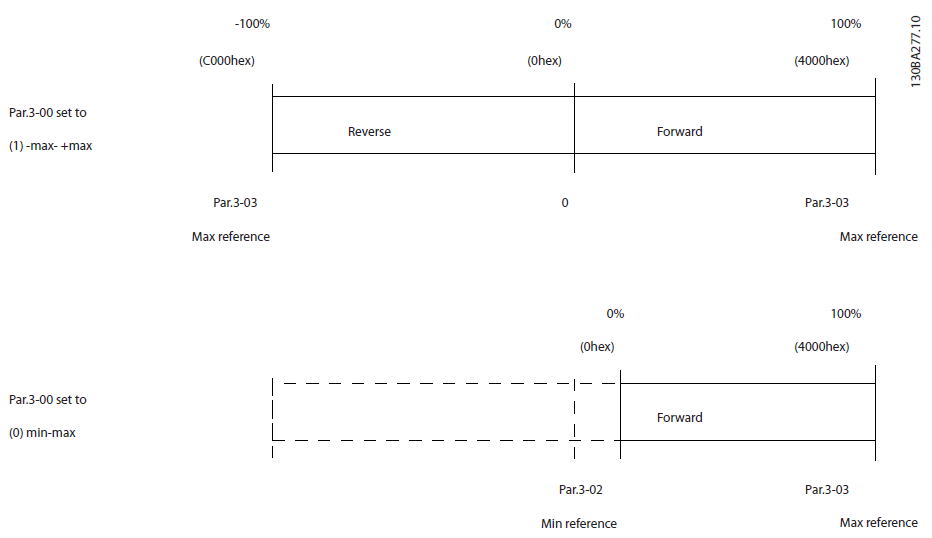
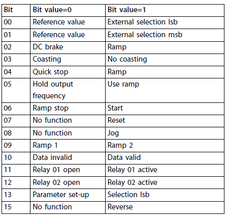
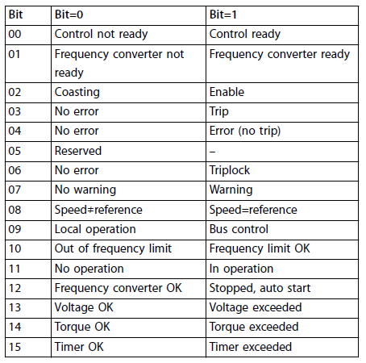
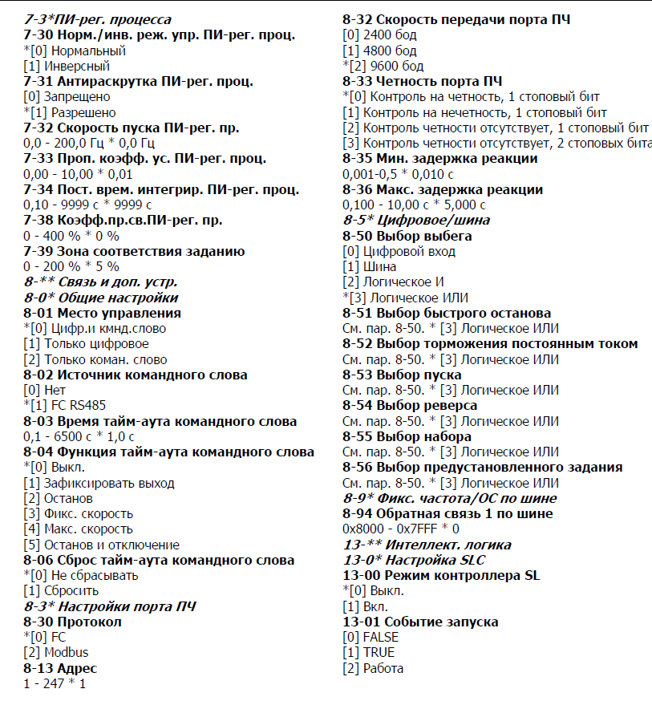

[<- До підрозділу](README.md)

# Керування ПЧ Danfoss з використанням профілю FC 

## Довідкова частина

Профіль FC є основним профілем для керування ПЧ Danfoss через мережу. Аналогічно іншим профілям профіль FC передбачає два слова керування та два слова контролю:   

Слова керування:

- `CTW` - Frequency converter control word register, слово команди
- `REF` -  Bus reference register 

Слова контролю:

- `STW` - Frequency converter status word register, слово  стану
- `MAV` - Frequency converter main value register

Керування автоматів станів передбачає виставлення відповідних бітів в слові, без забезпечення послідовностей переходу.

Задане значення швидкості передається на перетворювач частоти у відносному значенні у %. Значення передається у вигляді 16-розрядного слова `REF` в діапазоні `0-16384` (`0-4000 hex`) що відповідає `0-100%` від максимальної. Від'ємні значення форматуються з використанням доповнення 2. Фактична вихідна частота (`MAV`) масштабується так само, як `REF`.



рис.1. Діапазон частот в `REF` та `MAV` 

### Слово команди CTW



Таблиця 1. Біти слова команди

| № біта | Команда при Bit=0     | Призначення команди 0                                        | Команда при Bit=1      | Призначення команди 1                                        |
| ------ | --------------------- | ------------------------------------------------------------ | ---------------------- | ------------------------------------------------------------ |
| 00     | Reference value       | біт номера вибраного завдання (Біти 00 і 01 використовуються для вибору між 4 посиланнями значення, які попередньо запрограмовані в параметрі 3-10 Preset.) | External selection lsb | біт номера вибраного завдання                                |
| 01     | Reference value       | біт номера вибраного завдання                                | External selection msb | біт номера вибраного завдання                                |
| 02     | DC brake              | призводить до гальмування постійним струмом і зупинки. Встановіть гальмівний струм і тривалість у параметрі `2-01 DC Brake Current` і параметрі `2-02 DC Braking Time`. | Ramp                   | Робота по рампі                                              |
| 03     | Coasting              | перетворювач частоти негайно відключається від двигуну (вихідні транзистори закриваються), і двигун зупиняється через самовибіг | No coasting            | перетворювач частоти запускає двигун, якщо виконуються усі інші умови запуску. |
| 04     | Quick-stop            | зменшує швидкість двигуна до зупинки (встановлюється в параметрі 3-81 Час швидкої зупинки). | Ramp                   | Робота по рампі                                              |
| 05     | Hold output frequency | замороження поточної вихідної частототи (у Гц). Змінюйте заморожену вихідну частоту лише за допомогою цифрових входів (параметри з `5-10 Terminal 18 Digital Input` до параметру `5-13 Terminal 29 Digital Input`) запрограмований в  `[21] Speed up` і `[22] Slow down`. Зупинка можлива тільки `Bit 03 coast stop` або `Bit 02 DC brake` або дискретними входами | Use ramp               | Робота по рампі                                              |
| 06     | Ramp stop             | Викликає зупинку та зменшує швидкість двигуна до зупинки по рампі за допомогою вибраного параметра зменшення. | Start                  | Дозволяє перетворювачу частоти запускати двигун, якщо виконуються інші умови запуску. Зробіть вибір у параметрі `8-53 Start Select`, щоб означити, як біт `06 Ramp stop/start` взаємодіє з відповідною функцією на цифровому вході. |
| 07     | No function           | немає функції                                                | Reset                  | Скидання помилки (trip). Скидання активується по передньому фронту даного біту (зміна логічного 0 в 1). |
| 08     | No function           | немає функції                                                | Jog                    | Вихідна частота означується параметром `3-11 Jog Speed [Hz]` |
| 09     | Ramp1                 | Рампа, 207, 208                                              | Ramp2                  | Включить заданное время разгона/торможения, 209, 210         |
| 10     | Data invalid          | Слово команди (Cotrol Word) ігнорується. Вимкніть слово команди, якщо не бажаєте використовувати його під час оновлення або читання параметрів. | Data valid             | Слово команди (Cotrol Word) ігнорується.                     |
| 11     | Relay 01 open         | Реле 01 не активовано                                        | Relay 01 active        | Реле 01 активується, якщо `[36] Control word bit 11` вибрано в параметрі `5-40 Function Relay`. |
| 12     | Relay 02 open         | Реле 02 не активовано                                        | Relay 02 active        | Реле 02 активується, якщо `[37] Control word bit 12` вибрано в параметрі `5-40 Function Relay`. |
| 13     | Parameter set-up      | Вибрано Set-up 1                                             | Selection lsb          | Вибрано Set-up 2                                             |
| 14     | No function           | немає функції                                                | No function            | немає функції                                                |
| 15     | No function           | немає функції                                                | Reverse                | Реверс, 506                                                  |

### Слово статусу STW



Таблиця 2. Біти слова статусу

| № біта | Значення при Bit=0            | Розшифрування 0                                              | Значення при Bit=1        | Розшифрування 1                                              |
| ------ | ----------------------------- | ------------------------------------------------------------ | ------------------------- | ------------------------------------------------------------ |
| 00     | Control not ready             | ПЧ в помилці (trip) і не готовий до роботи                   | Control ready             | ПЧ готовий до роботи. При цьому компонент живлення не обов’язково заживлений (якщо для елементів керування є зовнішнє живлення 24 В). |
| 01     | Frequency converter not ready | ПЧ не готовий до роботи                                      | Frequency converter ready | ПЧ готовий до роботи, однак включена команда Coasting   через цифрові входи або через послідовний зв’язок. |
| 02     | Coasting                      | ПЧ відключився від двигуна, зупинка                          | Enable                    | Перетворювач частоти запускає двигун командою запуску        |
| 03     | No error                      | Немає помилки Trip                                           | Trip                      | ПЧ має блокуючу помилку (trip). Щоб відновити роботу, натисніть `[Reset]`. |
| 04     | No error                      | Немає помилки                                                | Error (no trip)           | ПЧ показує помилку, але не блокуючу (no trip).               |
| 05     | Reserved                      |                                                              | Reserved                  |                                                              |
| 06     | No error                      | ПЧ не заблоковано по помилці                                 | Trip lock                 | ПЧ в помилці і заблокований                                  |
| 07     | No warning                    | Немає попереджень                                            | Warning                   | Є попередження                                               |
| 08     | Speed ≠ reference             | Плинна швидкість не дорівнює заданій                         | Speed = reference         | Плинна швидкість дорівнює заданій                            |
| 09     | Local operation               | Активне місцеве керування. На панелі керування активовано [Off/Reset] або [Local] або у параметрі `3-13 Reference Site` вибрано `[2] Local` . Неможливо керувати перетворювачем частоти через послідовний зв’язок. | Bus control               | Активно керування по системі послідовного звязку             |
| 10     | Out of frequency limit        | Вихідна частота досягла значення параметра `4-12 Motor Speed Low Limit [Hz]`  або параметра `4-14 Motor Speed High Limit [Hz]` | Frequency limit OK        | Частота в межах заданих параметрів обмежень                  |
| 11     | No operation                  | Двигун не в роботі                                           | In operation              | Двигун в роботі                                              |
| 12     | Frequency converter OK        | На ПЧ немає тимчасового перегріву                            | Stopped, auto start       | ПЧ зупиняється через перегрівання, але пристрій не має блокуючої помилки (trip) і відновлить роботу, коли тмепература нормалізується |
| 13     | Voltage OK                    | Напруга в нормі                                              | Voltage exceeded          | Напруга постійного струму в ланці постійного струму ПЧ занадто низька або занадто висока. |
| 14     | Torque OK                     | Момент в нормі (нижче параметра `4-18 Current Limit`)        | Torque exceeded           | Момент вище норми, заданої в параметрі `4-18 Current Limit`  |
| 15     | Timer OK                      | Таймери теплового захисту двигуна і ПЧ не перевищують 100%   | Timer exceeded            | Один з тамйерів теплового захисту спрацював                  |


## Практична частина

### Постановка задачі

Для практичної частини використовується наступна конфігурація

|               |                                             |
| ------------- | ------------------------------------------- |
| DRIVE         | Danfoss Micro Drive FC51 132F0003           |
| FIELDBUS      | MODBUS RTU on RS485                         |
| DRIVE PROFILE | FC                                          |
| PLC HARD      | S7 1200 + комунікаційна плата CB 1241 RS485 |
| PLC SOFT      | TIA Portal                                  |

Передбачається керування з ПЛК:

- запуск/зупинка двигуна;
- керування швидкістю в розімкнутому режимі;

Контроль роботи приводу:

- контроль режиму роботи приводу (функціонування, наявність помилки, місцевий/дистанційний);
- поточна швидкість;

### Налаштування ПЧ для комунікації 

У даному прикладі ми опустимо налаштування в ПЧ параметрів двигуна та інших налаштувань, що не стосуються теми. Зупинимося тільки на налаштуваннях мережі. Усі налаштування керування через послідовний порт наведені на рис.2.  

Таблиця 3. Налаштування ПЧ

| Номер параметру | Значення              | Призначення                        |      |
| --------------- | --------------------- | ---------------------------------- | ---- |
| 8.02            | 1 - RS-485            | Джерело командного слова - RS-4985 |      |
| 8.30            | 2 - Modbus            | протокол - Modbus                  |      |
| 8.31            | 2 - Address           | адреса Веденого в Modbus           |      |
| 8.32            | 3 - Baudrate = 19200  | бітова швидкість 19200             |      |
| 8.33            | 3 - No parity, 2 stop | контроль парності                  |      |



рис.2. Комунікаційні параметри ПЧ FC51 (не знайшов англійською)

### Створення функціонального блока 

Для керування ПЧ створимо функціональний блок `DNFCTRL`. Параметри вказані в таблиці 4.

Таблиця 4. Параметри ФБ `DNFCTRL`

| Назва             | Тип  |
| ----------------- | ---- |
| **Input**         |      |
| STW               | Word |
| MAV               | Int  |
| START             | Bool |
| SPEEDSP           | Real |
| **Output**        |      |
| CTW               | Word |
| REF               | Int  |
| SPEEDCUR          | Real |
| **Static**        |      |
| cmdRamp           | Bool |
| cmdQuickStop      | Bool |
| cmdCoasting       | Bool |
| cmdStart          | Bool |
| cmdReset          | Bool |
| cmdRamp2          | Bool |
| cmdRelay1On       | Bool |
| cmdRelay2On       | Bool |
| cmdSellsb         | Bool |
| cmdReverse        | Bool |
| staControlReady   | Bool |
| staFreqConvReady  | Bool |
| staEnable         | Bool |
| staTrip           | Bool |
| staError          | Bool |
| staTriplock       | Bool |
| staWarning        | Bool |
| staSpeedEqRef     | Bool |
| staBusCtrl        | Bool |
| staFreqLimOk      | Bool |
| staInoperation    | Bool |
| staStopped        | Bool |
| staVoltExceeded   | Bool |
| staTorqueExceeded | Bool |
| staTimerExceeded  | Bool |

Програма користувача наведена нижче.

```c++
#SPEEDCUR := INT_TO_REAL(#MAV) * 100/16384;
IF #START THEN
    #cmdStart := true;
    #cmdRamp := true;
ELSE
    #cmdStart := false;
    #cmdRamp := true;
END_IF;
    
#staControlReady := #STW.%X0; 		//00 Control NOT ready / Control ready
#staFreqConvReady := #STW.%X1; 		//01 frequency converter NOT ready / Frequency converter ready
#staEnable := #STW.%X2; 			//02 Coasting / Enable
#staTrip := #STW.%X3; 				//03 No error / Trip
#staError := #STW.%X4; 				//04 No error / Error (no trip)
#staTriplock := #STW.%X6; 			//06 No error /Triplock
#staWarning := #STW.%X7; 			//07 No warning /Warning
#staSpeedEqRef := #STW.%X8; 		//08 Speed≠reference /Speed=reference
#staBusCtrl := #STW.%X9; 			//09 "Local" operation /Bus control
#staFreqLimOk := #STW.%X10; 		//10 Out OF frequency limit /frequency limit OK
#staInoperation := #STW.%X11; 		//11 No operation /In operation
#staStopped := #STW.%X12; 			//12 Frequency converter OK / Stopped, auto start
#staVoltExceeded := #STW.%X13; 		//13 Voltage OK /Voltage exceeded
#staTorqueExceeded := #STW.%X14; 	//14 Torque OK /Torque exceeded
#staTimerExceeded := #STW.%X15; 	//15 Timer OK /Timer exceeded

#REF := REAL_TO_INT(#SPEEDSP * 16384 / 100.0);
#CTW.%X0 := false; 					//00 Reference value /External selection lsb
#CTW.%X1 := false; 					//01 Reference value /External selection msb
#CTW.%X2 := #cmdRamp; 				//02 DC brake /Ramp
#CTW.%X3 := NOT #cmdCoasting; 		//03 Coasting /No coasting
#CTW.%X4 := NOT #cmdQuickStop; 		//04 Quick stop /Ramp
#CTW.%X5 := #cmdRamp; 				//05 Hold output frequency / Use ramp
#CTW.%X6 := #cmdStart; 				//06 Ramp stop / Start
#CTW.%X7 := #cmdReset; 				//07 No function / Reset
#CTW.%X8 := false; 					//08 No function / Jog
#CTW.%X9 := #cmdRamp2; 				//09 Ramp 1 / Ramp 2
#CTW.%X10 := true; 					//10 Data invalid / Data valid
#CTW.%X11 := #cmdRelay1On; 			//11 Relay 01 open / Relay 01 active
#CTW.%X12 := #cmdRelay2On; 			//12 Relay 02 open / Relay 02 active
#CTW.%X13 := #cmdSellsb; 			//13 Parameter set-up / Selection lsb
#CTW.%X15 := #cmdReverse; 			//15 No function / Reverse
```

У програмі реалізований шаблон та найпростіше керування ПЧ командами запуску та зупинки за рампою в залежності від входу `START`. Усіми іншими бітами можна керувати через біти екземплярного DB.

Слова стану `STW` та плинного значення `MAV` приходять в ФБ через входи. Вони мають подаватися на вхід ФБ з фрагмента програми що забезпечує читання змінних з ПЧ. Аналогічно вихідні змінні `CTW` та `REF` , які змінюються всередині ФБ мають передаватися іншим фрагментом програми на ПЧ.  Задане значення `SPEEDSP` в діапазоні 0-100% перетворюється у відповідне `REF`, а  дійсне ціле значення з ПЧ `MAV`  перетворюється у `SPEEDCUR`.

### Реалізація основної програми

Реалізація в основній програмі передбачає виклик ФБ `DNFCTRL` з відповідним створеним екземплярним DB. Для реалізації обміну по мережі Modbus реалізований інший фрагмент програми, який описаний в практичному занятті [Реалізація Modbus Master з використанням функції MB_MASTER для S7-1200](../modbusadvanced/mbmaster_s71200.md).

```c++
#DNFFCCTRL_ROAST(STW:="IOMB".DNFROAST_RD.STW,
                 MAV:="IOMB".DNFROAST_RD.MAV,
                 START:="IO".MROAST_KV_OUT,
                 SPEEDSP:="IO".MROAST_SPD_OUT,
                 CTW =>"IOMB".DNFROAST_WR.CTW,
                 "REF" =>"IOMB".DNFROAST_WR."REF");
```


Практичне заняття розробив [Олександр Пупена](https://github.com/pupenasan). 


Якщо Ви хочете залишити коментар у Вас є наступні варіанти:

- [Обговорення у WhatsApp](https://chat.whatsapp.com/BRbPAQrE1s7BwCLtNtMoqN)
- [Обговорення в Телеграм](https://t.me/+GA2smCKs5QU1MWMy)
- [Група у Фейсбуці](https://www.facebook.com/groups/asu.in.ua)

Про проект і можливість допомогти проекту написано [тут](https://asu-in-ua.github.io/atpv/)