# General Motion Control Libraries

Функціональні блоки трьох бібліотек, описаних тут, використовуються в програмному середовищі EcoStruxure Machine Expert для керування:

- приводами ATV320, ATV340, ATV6••, ATV9•• та LXM32M, а також інтегрованими приводами Lexium ILA, ILE і ILS через CANopen, EtherNet/IP та Modbus TCP
- приводами LXM32A, інтегрованими приводами LXM32ICAN і приводами SD328A через CANopen

Функціональні блоки відповідають стандарту IEC 61131-3.

Бібліотеки:

- Бібліотека GMC Independent PLCopen MC, Простір імен: GIPLC
- Бібліотека GMC Independent Altivar, Простір імен: GIATV
- Бібліотека GMC Independent Lexium, Простір імен: GILXM

Умовні правила іменування:

- Функціональні блоки з префіксом `MC_` (Motion Control) відповідають специфікації PLCopen V2.00. Вони узгоджені з глобальним стандартом програмування застосунків керування рухом.

- Функціональні блоки без префікса `MC_` є специфічними для виробника.

## Діаграма станів PLCopen

Діаграма станів відображає вісь у термінах PLCopen. У будь-який момент часу вісь перебуває рівно в одному стані. Якщо виконується функціональний блок або виявляється помилка, це може спричинити перехід стану. Функціональний блок `MC_ReadStatus` надає поточний стан осі.

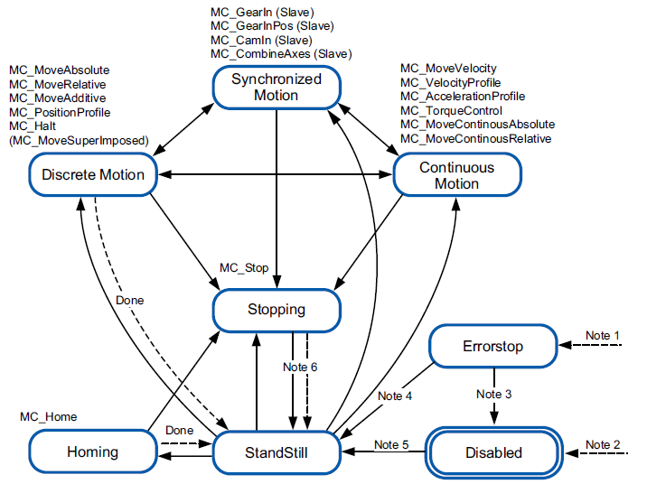

Примітка 1 Виявлено помилку (перехід з будь-якого стану).

Примітка 2 Вхід Enable функціонального блока MC_Power встановлено в FALSE і помилок не виявлено (перехід з будь-якого стану).

Примітка 3 MC_Reset і MC_Power.Status = FALSE.

Примітка 4 MC_Reset і MC_Power.Status = TRUE і MC_Power.Enable = TRUE.

Примітка 5 MC_Power.Enable = TRUE і MC_Power.Status = TRUE.

Примітка 6 MC_Stop.Done = TRUE і MC_Stop.Execute = FALSE.

## Функціональні блоки

### Function Blocks of GMC Independent PLCopen MC (GIPLC)

Бібліотека GMC Independent PLCopen MC містить такі функціональні блоки, які можуть використовуватися з приводами Altivar, Lexium 32, Lexium SD328A та інтегрованими приводами Lexium ILA, ILE і ILS:

| Функціональний блок   | Опис                                     |
| --------------------- | ---------------------------------------- |
| MC_Power              | Ініціалізація                            |
| MC_Jog                | Режим роботи: Jog                        |
| MC_TorqueControl      | Режим роботи: Profile Torque             |
| MC_MoveVelocity       | Режим роботи: Profile Velocity           |
| MC_MoveAbsolute       | Режим роботи: Profile Position           |
| MC_MoveAdditive       |                                          |
| MC_MoveRelative       |                                          |
| MC_Home               | Режим роботи: Homing                     |
| MC_SetPosition        |                                          |
| MC_Stop               | Зупинка                                  |
| MC_Halt               |                                          |
| MC_TouchProbe         | Захоплення позиції через сигнальний вхід |
| MC_AbortTrigger       |                                          |
| MC_ReadActualTorque   | Читання параметра                        |
| MC_ReadActualVelocity |                                          |
| MC_ReadActualPosition |                                          |
| MC_ReadAxisInfo       |                                          |
| MC_ReadMotionState    |                                          |
| MC_ReadStatus         |                                          |
| MC_ReadParameter      |                                          |
| MC_WriteParameter     | Запис параметра                          |
| MC_ReadDigitalInput   | Входи та виходи                          |
| MC_ReadDigitalOutput  |                                          |
| MC_WriteDigitalOutput |                                          |
| MC_ReadAxisError      | Обробка помилок                          |
| MC_Reset              |                                          |

ПРИМІТКА: Підтримка функціонального блока залежить від відповідного привода. Привід повертає діагностичний код 139, якщо цей функціональний блок не підтримується даним приводом.

### Function Blocks of GMC Independent Altivar (GIATV)

Бібліотека GMC Independent Altivar містить такі функціональні блоки, які можуть використовуватися з приводами Altivar:

| Функціональний блок            | Опис                           |
| ------------------------------ | ------------------------------ |
| VelocityControlAnalogInput_ATV | Режим роботи: Profile Velocity |
| VelocityControlSelectAI_ATV    |                                |
| Control_ATV                    |                                |
| SetDriveRamp_ATV               | Запис параметра                |
| SetFrequencyRange_ATV          |                                |
| ResetParameters_ATV            |                                |
| StoreParameters_ATV            |                                |
| ReadAnalogInput_ATV            | Входи та виходи                |

### Function Blocks of GMC Independent Lexium (GILXM)

Бібліотека GMC Independent Lexium містить функціональні блоки, які можуть використовуватися з приводами Lexium.

Ці функціональні блоки можуть використовуватися з приводами Lexium 32:

| Функціональний блок   | Опис                                     |
| --------------------- | ---------------------------------------- |
| Jog_LXM32             | Режим роботи: Jog                        |
| SetTorqueRamp_LXM32   | Режим роботи: Profile Torque             |
| TorqueControl_LXM32   |                                          |
| MoveVelocity_LXM32    | Режим роботи: Profile Velocity           |
| Home_LXM32            | Режим роботи: Homing                     |
| SetStopRamp_LXM32     | Зупинка                                  |
| Stop_LXM32            |                                          |
| Halt_LXM32            |                                          |
| TouchProbe_LXM32      | Захоплення позиції через сигнальний вхід |
| GearInPos_LXM32       | Режим роботи: Electronic Gear            |
| GearIn_LXM32          |                                          |
| SetDriveRamp_LXM32    | Запис параметра                          |
| SetLimitSwitch_LXM32  |                                          |
| ResetParameters_LXM32 |                                          |
| StoreParameters_LXM32 |                                          |
| ReadAxisWarning_LXM32 | Обробка помилок                          |

| Функціональний блок    | Опис                                     |
| ---------------------- | ---------------------------------------- |
| Jog_SD328A             | Режим роботи: Jog                        |
| MoveVelocity_SD328A    | Режим роботи: Profile Velocity           |
| Home_SD328A            | Режим роботи: Homing                     |
| TouchProbe_SD328A      | Захоплення позиції через сигнальний вхід |
| GearInPos_SD328A       | Режим роботи: Electronic Gear            |
| SetDriveRamp_SD328A    | Запис параметра                          |
| SetLimitSwitch_SD328A  |                                          |
| ResetParameters_SD328A |                                          |
| StoreParameters_SD328A |                                          |

| Функціональний блок | Опис                                     |
| ------------------- | ---------------------------------------- |
| Jog_ILX             | Режим роботи: Jog                        |
| Home_ILX            | Режим роботи: Homing                     |
| SetStopRamp_ILX     | Зупинка                                  |
| TouchProbe_ILX      | Захоплення позиції через сигнальний вхід |
| SpeedControl_ILX    | Режим роботи: Speed Control              |
| GearInPos_ILX       | Режим роботи: Electronic Gear            |
| SetDriveRamp_ILX    | Запис параметра                          |
| SetLimitSwitch_ILX  |                                          |
| ResetParameters_ILX |                                          |
| StoreParameters_ILX |                                          |
| ReadAxisWarning_ILX | Обробка помилок                          |

## Library-Specific Data Types

Функціональний блок `User_FB` має надавати посилання на вісь для функціонального блока `MC_Power` (Axis), і це посилання на вісь має бути типу `Axis_Ref_Base`. Під час виклику екземпляра функціонального блока `User_FB` посилання `Axis_Ref` (Altivar_340) передається до екземпляра функціонального блока `MC_Power`. `Axis_Ref` надає властивості тайм-ауту для зміни значень тайм-ауту. Ці властивості доступні за допомогою імені Axis_Ref, після якого ставиться «.».

З міркувань сумісності із застарілими бібліотеками CANopen функціональні блоки посилання на вісь для CANopen мають дві додаткові властивості: `uiNetworkNo` і `uiNodeId`. Ці властивості надають номер мережі та номер вузла відповідного пристрою CANopen і можуть використовуватися в застосунку.

Тип даних `Axis_Ref_Base` є специфічним для виробника типом даних і представляє загальну незалежну вісь. Цей тип даних слід використовувати для передавання Axis_Ref до користувацьких функціональних блоків. Приклад:

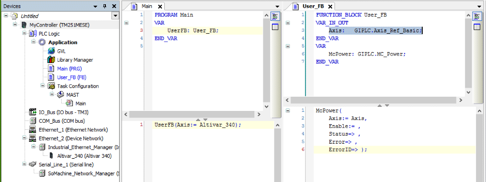

## Загальні входи та виходи

Поведінка функціональних блоків із входом Enable

Приклад 1 Одноразове виконання без виявлення помилки (виконання потребує більше ніж одного виклику).

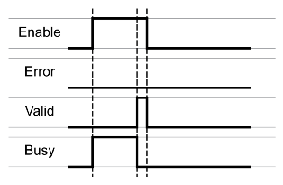

Приклад 2 Одноразове виконання з виявленням помилки (виконання потребує більше ніж одного виклику).

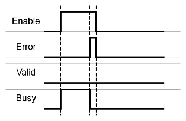

Приклад 3 Одноразове виконання без виявлення помилки (виконання потребує лише одного виклику).

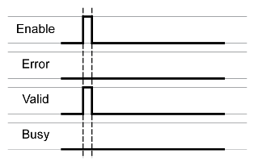

Приклад 4 Одноразове виконання з виявленням помилки (виконання потребує лише одного виклику).

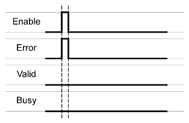

Приклад 5 Повторюване виконання без виявлення помилки (виконання потребує більше ніж одного виклику).

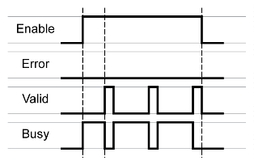

Приклад 6 Повторюване виконання з виявленням помилки (виконання потребує більше ніж одного виклику).

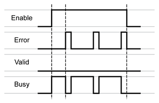

Приклад 7 Повторюване виконання без виявлення помилки (виконання потребує лише одного циклу).

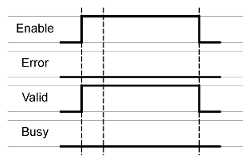

Приклад 8 Повторюване виконання з виявленням помилки (виконання потребує лише одного виклику).

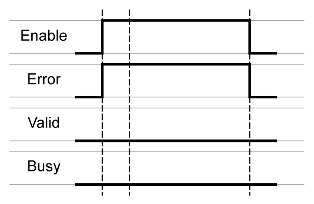

Поведінка функціональних блоків із входом Execute

Приклад 1  Виконання завершено без виявлення помилки.

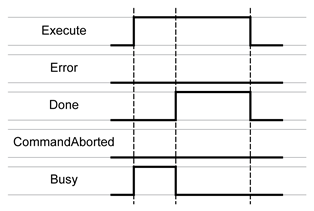

Приклад 2  Виконання завершено з виявленням помилки.

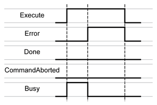

Приклад 3  Виконання перервано, оскільки було запущено інший функціональний блок керування рухом.

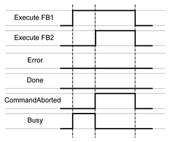

Приклад 4  Якщо під час циклу вхід Execute встановлено в FALSE, виконання функціонального блока не припиняється; вихід Done встановлюється в TRUE лише на один цикл.

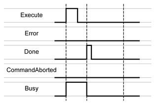

## MC_Power

Цей функціональний блок вмикає або вимикає силовий каскад привода.

- `TRUE` на вході Enable вмикає силовий каскад. Після вмикання силового каскаду встановлюється вихід `Status`.

- `FALSE` на вході Enable вимикає силовий каскад. Після вимкнення силового каскаду вихід `Status` скидається.

Якщо під час виконання виявляються помилки, встановлюється вихід `Error`.

Цей функціональний блок не слід використовувати як звичайний блок Enable. Під час кожного виклику функціонального блока значення входу Enable порівнюється зі значенням виходу Status. Якщо ці значення різні, виконується нова команда: або вмикання силового каскаду (`Enable = TRUE` і `Status = FALSE`), або вимикання силового каскаду (`Enable = FALSE` і `Status = TRUE`). Функцію потрібно викликати доти, доки не буде досягнуто заданого стану силового каскаду або доки не виникне помилка. Якщо виникла помилка функціонального блока (наприклад, тайм-аут), встановлюється вихід Error, який буде скинутий під час наступного виклику функціонального блока.

Функціональний блок не слід викликати циклічно. Викликайте цей функціональний блок лише тоді, коли необхідно вимкнути або ввімкнути силовий каскад.

ПРИМІТКА: Якщо виникла помилка тайм-ауту, діагностична інформація PowerTimeout надається функціональним блоком `MC_ReadAxisError`, а не через вихід `ErrorID` функціонального блока `MC_Power`.

Якщо цей функціональний блок активовано, одночасне використання функціонального блока `Control_ATV` може призвести до непередбачуваної поведінки.

## Control_ATV

Функціональний блок Control_ATV керує приводом Altivar за допомогою Control Word, Target Speed, Status Word, швидкості двигуна, струму двигуна та керуючих входів.

Як використовувати функціональний блок:

- Скасувати команду Free Wheel: `i_xFreeWhl` встановити у `TRUE`
- Скасувати команду Quick Stop: `i_xQckStop` встановити у `TRUE`
- Увімкнути функціональний блок: `i_xEn` встановити у `TRUE`
- Вибрати, чи залишатиметься привід у стані Operation Enabled за відсутності команд: `i_xKeepOpEn` встановити у `TRUE`
- Задати цільову швидкість: `i_wSpdRef` не повинно дорівнювати нулю
- Потім подати команду Forward або Reverse: `i_xFwd` або `i_xRev` встановити у TRUE

Рекомендації:

Якщо ви хочете використовувати функцію BRH4, коли Altivar керується через промислову мережу, встановіть вхід `i_xKeepOpEn` у `TRUE`.

Після команди Quick Stop режим Quick Stop (див. діаграму профілю привода Altivar 71) автоматично завершується, щойно швидкість і струм двигуна досягнуть 0. Щоб знову запустити двигун, необхідно зняти сигнал Quick Stop (негативна логіка, тобто `i_xQckStop` має бути `TRUE`).

Команда Quick Stop має вищий пріоритет, ніж звичайна зупинка (коли Forward і Reverse встановлені у `FALSE`).

Команда Free Wheel Stop має вищий пріоритет, ніж команда Quick Stop.

Після завантаження прикладної програми в контролер, якщо на 7-сегментному індикаторі привода з’являється миготливий напис "COF", подайте спочатку фронт, а потім спад сигналу на вході Fault Reset (`i_xFltRst`), щоб відновити коректний обмін з приводом.

Для отримання додаткової інформації дивіться Application Note (у каталозі "Application Note").

| Name            | Type     | Inherited from | Address | Initial | Comment                                                      |
| --------------- | -------- | -------------- | ------- | ------- | ------------------------------------------------------------ |
| `Axis`          | Axis_Ref |                |         |         | посилання на вісь                                            |
| `i_xEn`         | BOOL     |                |         |         | вмикає або вимикає функціональний блок                       |
| `i_xKeepOpEn`   | BOOL     |                |         |         | вибір: залишати привід у стані Operation Enabled за відсутності команди |
| `i_xFwd`        | BOOL     |                |         |         | команда руху вперед                                          |
| `i_xRev`        | BOOL     |                |         |         | команда руху назад                                           |
| `i_xQckStop`    | BOOL     |                |         |         | команда швидкої зупинки привода                              |
| `i_xFreeWhl`    | BOOL     |                |         |         | команда зупинки Free Wheel привода                           |
| `i_xFltRst`     | BOOL     |                |         |         | скидання помилок по фронту сигналу                           |
| `i_wSpdRef`     | WORD     |                |         |         | цільова швидкість привода                                    |
| `q_xEn`         | BOOL     |                |         |         | вихід увімкнення                                             |
| `q_xAlrm`       | BOOL     |                |         |         | вихід аварії                                                 |
| `q_wStatusword` | WORD     |                |         |         | копія Status Word                                            |

