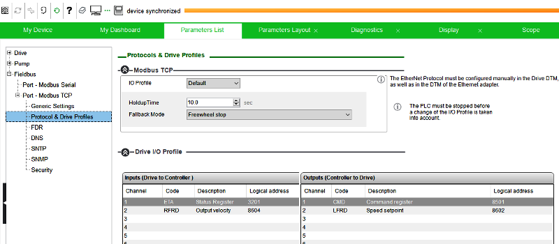
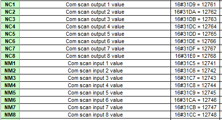
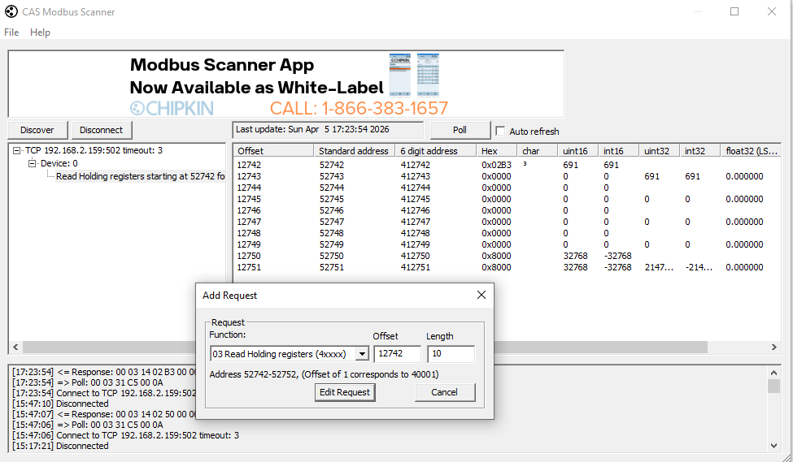
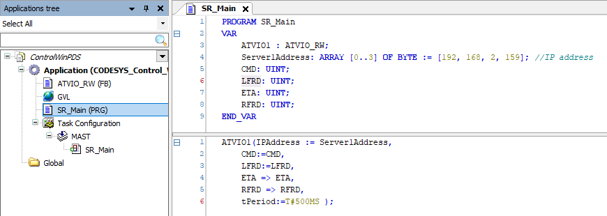
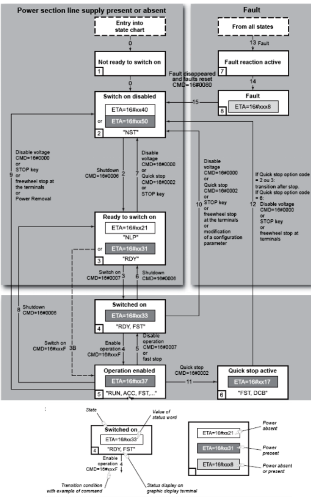

[<- До підрозділу](README.md)	[Коментувати](#feedback)

# Керування ПЧ Altivar з використанням профілю CIA402: практична частина

**Тривалість**: 3 акад години (1,5 пари)

**Мета:**  Навчитися розробляти елементи програмного забезпечення ПЛК для керування перетворювачами частоти по промисловій мережі.

## Лабораторна установка для проведення лабораторної роботи у віртуальному середовищі.

**Апаратне забезпечення, матеріали та інструменти для проведення віртуальної лабораторної роботи.** 

Для виконання першої частини необхідно:

- ПК

Для виконання другою частини необхідно:

- ПК
- ПЧ Altivar що має вбудований канал Ethernet, або мережну карту Ethernet з підтримкою Modbus TCP; за певної модифікації завдання можлива робота через Modbus RTU
- PLC: одна з моделей M241, M251, або M262 що має мережний порт Ethernet
- супутнє мережне обладнання  

**Програмне забезпечення, що використане у віртуальній лабораторній роботі.** 

Для виконання першої частини необхідно:

- PACTware або інше ПЗ що має функції FDT Frame Applaication, в т.ч. SoMove
- ПЗ для імітації роботи ПЧ Altivar - ATV Virtual Training Device
- бібліотеки DTM для Altivar та Modbus
- Machine Expert 

Для виконання другої частини необхідно:

- Machine Expert 

## Загальна постановка задачі

Цілі роботи: 

- забезпечити комунікаційний обмін між PLC (CodeSys Control Win) та емулятором Altivar
- вручну покерувати емулятором ПЧ Altviar по мережі з використанням профілю CIA402
- реалізувати бібліотечний блок для керування ПЧ Altviar по мережі з використанням профілю CIA402 та перевірити його роботу на емуляторі ПЧ Altviar
- перевірити роботу бібліотечного блоку на реальному ПЧ Altviar
- забезпечити керування реальним ПЧ Altviar з використанням бібліотечного блоку PLCopen MC

## Послідовність виконання роботи

- [ ] Ознайомтеся з теоретичним матеріалом [Використання інтерфейсів промислових мереж для керування перетворювачами частоти: в питаннях та відповідях](teor1.md)

## Частина 1. Робота з віртуальною установкою

Виконання даної частини передбачає що Ви проходили:

- практичне заняття [Використання FDT/DTM для конфігурування та налаштування ПЧ Altivar](../fdtdtm/lab.md)
- практичне заняття [Реалізація Modbus TCP Server в CODESYS Control Win з використанням бібліотеки ModbusFB ](../modbusadvanced/mbserver_codesys.md) 

### 1. Конфігурування емулятору ПЧ для керування по мережі

- [ ] Забезпечте можливість керування ATV Virtual Training Device через мережу, та перевірте це керування через DTM, як це описано в  [Використання FDT/DTM для конфігурування та налаштування ПЧ Altivar: практична частина](../fdtdtm/lab.md)
- [ ] Перейдіть в налаштування обміну по вбудованому порту Modbus TCP, там мають бути налаштування як показано на рис.1. 



рис.1. Налаштування керування ПЧ по мережі. 

Згідно більшості профілів,відповідно до стандарту  IEC 61800-7-1, обмін передбачає зчитування з ПЧ слова стану (у даному випадку ETA) та плинної частоти або швидкості (RFRD), а запис - слова команди (CMD) та заданої частоти або швидкості (LFRD). На рис.1 показані змінні обміну відповідно до Drive I/O Profile. У полі Logical address показані адреси регістрів Modbus за якими ці змінні знаходяться в пам'яті ПЧ. Однак для пришвидшення обміну з ПЧ ці змінні відображаються в групи змінних `Inputs` та `Outputs`. Перелік усіх змінних та їх адрес для конкретного ПЛК можна завантажити з офіційного сайту Шнейдер Електрик. Для Altivar 6xx вони доступні [за посиланням](https://www.se.com/us/en/download/document/EAV64332/).



рис.2. Адреси значень `Inputs` та `Outputs` в Altivar 6xx. 

Таким чином початкова адреса Modbus регістрів для груп: 

- Com scan output 1 value - `12761`
- Com scan input 1 value - `12741`

Тобто змінні для обміну з ПЧ будуть в таких областях пам'яті

| Назва змінної | зміщення адреси Modbus (починаючи з 0) |
| ------------- | -------------------------------------- |
| CMD           | 12761                                  |
| LRFD          | 12762                                  |
| STA           | 12741                                  |
| RFRD          | 12742                                  |

- [ ] Відключіть DTM від емулятору ПЧ, оскільки він не підтримує кілька з'єднань одночасно. 

### 2. Перевірка комунікації

Спочатку необхідно перевірити наявність комунікації з емулятором Modbus. Для цього можна скористатися [CAS Modbus Scanner](https://store.chipkin.com/products/tools/cas-modbus-scanner) як це було описано в [Реалізація Modbus TCP Server в CODESYS Control Win з використанням бібліотеки ModbusFB ](../modbusadvanced/mbserver_codesys.md) 

- [ ] Використовуючи CAS Modbus Scanner перевірте чи зчитуються регістри починаючи з `12742`. Зверніть увагу, що регістри в CAS Modbus Scanner вказуються з 1.



рис.3. Перевірка доступності комунікаційного каналу з використанням CAS Modbus Scanner

Якщо регістри повертаються, тоді комунікація робоча.

- [ ] Натисніть `Disconnect` щоб звільнити канал Modbus.

### 3. Реалізація зв'язку 

У цьому пункті необхідно реалізувати зв'язок по Modbus TCP між CODESYS Control Win та емулятором Altivar. Це дасть можливість налагодити зв'язок без використання обладнання.  

- [ ] Створіть проєкт з PLC CODESYS Control Win, в якому:
  - для задачі MAST виставте інтервал 200 мс та час сторожового таймеру 2 с, для того щоб ControlWin не сильно навантажував ПК та не вилітав при перевищенні задачі.
  - добавте плату Ethernet, яка буде асоціюватися з платою на вашому ПК
  - добавте бібліотеку `ModbusFB` 

Як це зробити, описано в [Реалізація Modbus TCP Server в CODESYS Control Win з використанням бібліотеки ModbusFB ](../modbusadvanced/mbserver_codesys.md) 

- [ ] Створіть функціональний блок з назвою `ATVIO_RW` на мові ST. 

- [ ] У полі означення змінних функціонального блоку впишіть:

```pascal
FUNCTION_BLOCK ATVIO_RW
VAR_INPUT
	IPAddress: ARRAY [0..3] OF BYTE;
	CMD: UINT;
	LFRD: UINT;
	tPeriod: TIME := T#500MS;   
END_VAR
VAR_OUTPUT
	ETA: UINT;
	RFRD: UINT;
END_VAR
VAR
	clientTcp: ModbusFB.ClientTcp;
	IW : ARRAY[0..9] OF UINT;
	QW : ARRAY[0..9] OF UINT;
	ReadVars: ModbusFB.ClientRequestReadHoldingRegisters;
	WriteVars: ModbusFB.ClientRequestWriteMultipleRegisters;
	tmTimer: TON;
	xConnect: BOOL;
	eLastRdError: Error;
	eLastWrError: Error;
END_VAR
```

- [ ] У полі коду функціонального блоку впишіть:

```pascal
QW[0]:= CMD;
QW[1]:= LFRD;
ETA :=IW[0];
RFRD := IW[1];

IF clientTcp.xError AND xConnect THEN
	xConnect := FALSE;
ELSE 
	xConnect := TRUE;
END_IF;
clientTcp (
	aIPaddr:=IPAddress, 
	uiPort:=502,
	xConnect:= xConnect, 
	tConnnectTimeOut := T#3S);
ReadVars (
	rClient:=clientTcp, 
	xExecute := tmTimer.Q, 
	uiUnitId:=0, 
	uiStartItem:=12741, 
	uiQuantity:=10, 
	pData:=ADR(IW), 
	udiReplyTimeout := 1000000, //1 s
	udiTimeOut := 2000000, //2 s
	);
WriteVars (
	rClient:=clientTcp, 
	xExecute := tmTimer.Q, 
	uiUnitId:=0, 
	uiStartItem:=12761, 
	uiQuantity:=10, 
	pData:=ADR(QW), 
	udiReplyTimeout := 1000000, //1 s
	udiTimeOut := 2000000, //2 s
	);	
IF ReadVars.xError THEN 
	eLastRdError:= ReadVars.eErrorID;
END_IF;
IF WriteVars.xError THEN 
	eLastWrError:= WriteVars.eErrorID;
END_IF;
tmTimer (IN :=  clientTcp.xConnected AND NOT (ReadVars.xDone OR ReadVars.xError), PT:= tPeriod);
```

Цей функціональний блок забезпечує читання та запис змінних в ПЧ, який вказується через поле IP адреси, аналогічно як це було зроблено в  [Реалізація Modbus TCP Server в CODESYS Control Win з використанням бібліотеки ModbusFB ](../modbusadvanced/mbserver_codesys.md) .

- [ ] У  POU `SR_Main` реалізуйте фрагмент коду для читання та запису змінних.



рис.4. Зміст `SR_Main`

- [ ] Зробіть компіляцію, запустіть середовище виконання CODESYS Control Win та завантажте в нього програму.
- [ ] Перевірте що дані зчитуються. Ключовою ознакою буде ненульове значення `STA` 

### 4. Перевірка керування ПЧ по мережі

У цьому пункті необхідно забезпечити керування двигуном з ПЧ по мережі, використовуючи 4-ри наведені вище змінні. Значення змінних керування (командне слово та задача частота) необхідно задавати з Watch List. Так само необхідно проводити контроль стану (змінна статусу та плинна частота). 

На рис. 5 показана агрегована діаграма автомату стану, яка дає можливість визначити стан ПЧ та двигуна за словом `ETA`. У цьому стані щоб забезпечити перехід до іншого стану треба задати відповідне значення команди. Так, наприклад щоб перейти зі стану `Switch on diasbled` в стан `Ready to switch on` необхідно відправити команду `CMD=16#0006`.    



рис.5. Автомат станів для профілю керування CiA 402

- [ ] Використовуючи Watch List та орієнтуючись на діаграму з рис.5 забезпечте керування ПЧ. Зверніть увагу що частота задається в об/хв. Додатково аналізуйте дані з вікна емулятору ПЧ.

### 5. Реалізація та перевірка функціонального блоку для керування двигуном з ПЧ по мережі

У цьому пункті необхідно написати власний функціональний блок, та перевірити його роботу, який маючи 4 мережні змінні забезпечує просте керування типу старт/стоп з заданою частотою. 

- [ ] Реалізуйте та перевірте роботу функціонального блоку який буде керувати двигуном з ПЧ по мережі, та матиме наступний інтерфейс

Таб.1. Опис інтерфейсу функціонального блоку для керування ПЧ по мережі

| Параметр | Тип інтерфейсу | Тип даних | Опис                                                         |
| -------- | -------------- | --------- | ------------------------------------------------------------ |
| Start    | IN             | BOOL      | команда на запуск: якщо `TRUE` - запустити, якщо `FALSE` - зупинити |
| SpeedSP  | IN             | REAL      | задане значення швидкості у % від мін-макс                   |
| SpeedPV  | OUT            | REAL      | дійсне значення швидкості у % від мін-макс                   |
| Started  | OUT            | BOOL      | стан двигуна: `TRUE` - двигун працює, `FALSE` - двигун зупинено |
| ETA      | INOUT          | UINT      | мережна змінна ETA                                           |
| RFRD     | INOUT          | UINT      | мережна змінна RFRD                                          |
| CMD      | INOUT          | UINT      | мережна змінна CMD                                           |
| LFRD     | INOUT          | UINT      | мережна змінна LFRD                                          |

## Частина 2. Робота з реальною установкою

### 6. Налаштування ПЧ для роботи по мережі

- [ ] Під наглядом викладача забезпечте можливість роботи ПЧ по мережі - вкажіть IP адресу, піключіть до локальної мережі, тощо. 
- [ ] Використовуючи технологію FDT/DTM налаштуйте реальний ПЧ аналогічно як в Частині 1.

### 7. Перевірка власного ФБ на реальному ПЧ

- [ ] Змініть програму з власним функціональним блоком так, щоб керування відбувалася з CodeSys ControlWin але реальним ПЧ
- [ ] Перевірте роботу модифікованої програми.
- [ ] Зупиніть роботу середовища виконання CodeSys ControlWin

### 8. Налаштування PLC M241 для роботи по мережі

- [ ] У існуючий проєкт Machine Expert добавте та налаштуйте M241 (можна M251 або M262) для роботи по мережі Ethernet з використанням FDT/DTM, як це було описано в останніх пунктах практичного заняття [Використання FDT/DTM для конфігурування та налаштування ПЧ Altivar](../fdtdtm/lab.md)
- [ ] Завантажте конфігурацію в реальний ПЛК
- [ ] Перевірте що змінні дійсно зчитуються з ПЧ

**Увага, при зміні джерела керування ПЧ треба перезавантажувати!**

### 9. Перевірка власного ФБ на реальному ПЧ

- [ ] Змініть програму з власним функціональним блоком так, щоб керування відбувалася реальним ПЧ з M241, тепер уже з урахуванням що змінні читаються і пишуться іншим способам
- [ ] Перевірте роботу модифікованої програми.

### 10. Робота з ПЧ з використанням бібліотеки Control_ATV

- [ ] Закоментуйте виклик власного функціонального блоку, щоб він не керував ПЧ
- [ ] Реалізуйте керування з використанням функції `Control_ATV` з бібліотеки [General Motion Control Libraries](gmclib_machstruxure.md)


## Автори


Практичне заняття розробив  [Олександр Пупена](https://github.com/pupenasan). 

## Feedback

Якщо Ви хочете залишити коментар у Вас є наступні варіанти:

- [Обговорення у WhatsApp](https://chat.whatsapp.com/BRbPAQrE1s7BwCLtNtMoqN)
- [Обговорення в Телеграм](https://t.me/+GA2smCKs5QU1MWMy)
- [Група у Фейсбуці](https://www.facebook.com/groups/asu.in.ua)

Про проект і можливість допомогти проекту написано [тут](https://asu-in-ua.github.io/atpv/) 
