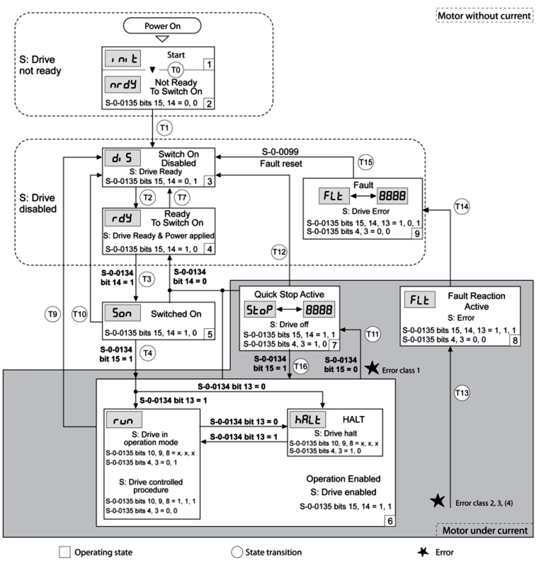
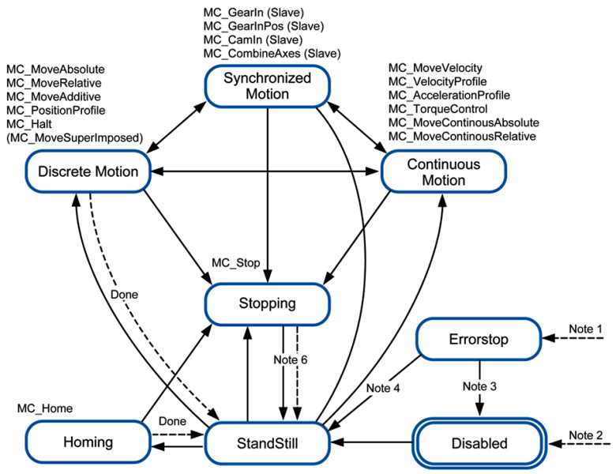

[<- До підрозділу](README.md)	[Коментувати](#feedback)

# Стандарт PLCOPEN motion control

Для кращого розуміння матеріалу прочитайте [Вступ до керування переміщенням: теоретична частина](../../motion/intro/teor.md)

## 1. Стандарт plcopen motion control. Діаграма станів

### 1.1. Що таке PLCopen Motion Control?

PLCopen — міжнародна організація, заснована у 1992 році з метою стандартизації програмування промислових контролерів. Технічний комітет 2 (TC2) розробив специфікацію «Function Blocks for Motion Control», яка визначає стандартний набір функціональних блоків для керування рухом. Поточна версія — Part 1–7, що охоплює одновісні, багатовісні, кулачкові та синхронні застосування.

Чому PLCopen важливий?  До появи цього  стандарту кожен виробник ПЛК мав власну бібліотеку Motion Control з  унікальними назвами блоків, параметрами та поведінкою. Це означало, що  програма, написана для Siemens, не могла бути перенесена на Schneider,  Beckhoff, B&R чи Mitsubishi без повного переписування. PLCopen вирішує цю  проблему: одна бібліотека, одна логіка — на будь-якому обладнанні.   

### 1.2. Діаграма станів осі (Axis State Machine) 

Серцем специфікації PLCopen є нормативна діаграма станів осі. У будь-який момент часу вісь перебуває в одному з визначених станів, а команди функціональних блоків є переходами між цими станами. Знання діаграми станів є обов'язковим для розуміння поведінки системи. 

| Стан  (State)      | Опис  стану та умови переходу                                |
| ------------------ | ------------------------------------------------------------ |
| Disabled           | Початковий  стан після ввімкнення живлення або після вимкнення приводу. Двигун  знеструмлений, переміщення заблоковане. Перехід у Standstill — командою  MC_Power (Enable=TRUE). |
| Standstill         | Привід  ввімкнений, вісь утримує позицію, готова до руху. Основний «режим  очікування». Команди MC_Home, MC_MoveAbsolute тощо запускаються з цього  стану. |
| Homing             | Виконується  процедура пошуку базової точки (MC_Home). Вісь рухається до датчика або  кінцевого вимикача. Завершення → перехід у Standstill. |
| DiscreteMotion     | Вісь  виконує рух до фіксованої позиції (MC_MoveAbsolute, MC_MoveRelative).  Завершення → Standstill. Команда MC_Halt → Standstill. Нова команда → залежно  від BufferMode. |
| ContinuousMotion   | Вісь  рухається із заданою швидкістю без кінцевої точки (MC_MoveVelocity). Зупинка  тільки командою MC_Halt або MC_Stop. |
| SynchronizedMotion | Вісь  синхронізована з ведучою (master) за допомогою MC_GearIn або MC_CamIn. Рух  підкорений зовнішньому профілю. |
| Stopping           | Виконується  MC_Stop. Вісь гальмує до зупинки та утримується. Вихід тільки через MC_Stop  (Enable=FALSE) → Standstill. |
| ErrorStop          | Аварійна  зупинка внаслідок помилки приводу, перевищення позиції або збою зв'язку. Рух  заблоковано. Вихід — MC_Reset → Standstill. |

### 1.3. Правила переходів між станами 

Декілька важливих правил, які необхідно знати практикуючому інженеру:

- MC_Power (Enable=TRUE): Disabled → Standstill.
- MC_Power (Enable=FALSE): будь-який стан → Disabled (негайно, без профілю гальмування).
- MC_Stop: будь-який рух → Stopping. Це особливий стан — вісь «заморожена» до зняття команди.
- MC_Halt: рух → Standstill (після завершення гальмування за профілем). На відміну від Stop, вісь не "заморожується".
- MC_Reset: ErrorStop → Standstill. Якщо помилка приводу не скинута — Reset не допоможе.
- Будь-яка команда при ErrorStop ігнорується, крім MC_Reset та MC_Power. 

MC_Stop переводить вісь у стан Stopping, з якого вона  НЕ може почати новий рух без явного MC_Stop(Execute=FALSE). MC_Halt зупиняє  вісь і повертає її у Standstill — звідки вона готова до нового руху. Це  практично продемонстровано у завданні 3.3 лабораторної роботи.  

### 1.4. Стандарт IEC 61800-7 та автомат станів приводу

Стандарт IEC 61800-7 описує, як саме працює привід "всередині", тоді як PLCopen описує як ним керувати з ПЛК.

- PLCopen = логіка ПЛК
- IEC 61800-7 = логіка самого приводу

#### 1.4.1. Основні стани приводу (Drive State Machine)

| Operating   state         | Опис                                           |
| ------------------------- | ---------------------------------------------- |
| 1 Start                   | Ініціалізація електроніки приводу              |
| 2 Not  Ready To Switch On | Привід не готовий до вмикання силової  частини |
| 3 Switch On Disabled      | Вмикання силової частини заборонено            |
| 4 Ready To Switch On      | Привід готовий до вмикання                     |
| 5 Switched On             | Силова частина увімкнена                       |
| 6 Operation Enabled       | Привід повністю готовий до роботи              |
| 7 Quick Stop Active       | Виконується швидка зупинка                     |
| 8 Fault Reaction Active   | Виконується реакція на помилку                 |
| 9 Fault                   | Стан помилки, привід вимкнений                 |

#### 1.4.2. Логіка роботи станів (просте пояснення)   

Робота приводу проходить через такі етапи:

1. Start → Not Ready 
   - запуск  електроніки 
2. Not Ready → Switch On Disabled 
   - ініціалізація  завершена 
3. Switch On Disabled → Ready To Switch On 
   - перевірка  безпеки (STO, напруга, енкодер) 
4. Ready To Switch On → Switched On 
   - подано  команду на включення силової частини 
5. Switched On → Operation Enabled 
   - привід  готовий виконувати рух 

рис.1. Таблиця переходів станів

Переходи станів ініціюються вхідним сигналом, командою польової шини або у відповідь на функцію моніторингу.

| Перехід | Стан (з  → в) | Умова /  подія                                               | Реакція                                                      |
| ------- | ------------- | ------------------------------------------------------------ | ------------------------------------------------------------ |
| T0      | 1 → 2         | Електроніка пристрою успішно ініціалізована                  | —                                                            |
| T1      | 2 → 3         | Параметри успішно ініціалізовані                             | —                                                            |
| T2      | 3 → 4         | Немає заниженої напруги; енкодер перевірений; швидкість < 1000  об/хв; STO = +24 В | —                                                            |
| T3      | 4 → 5         | Запит на увімкнення силової частини                          | —                                                            |
| T4      | 5 → 6         | Команда «Drive ON»                                           | Увімкнення силової частини; перевірка параметрів; відпускання гальма |
| T7      | 4 → 3         | Занижена напруга; STO = 0 В; швидкість > 1000 об/хв          | —                                                            |
| T9      | 6 → 3         | Запит на вимкнення силової частини                           | —                                                            |
| T10     | 5 → 3         | Запит на вимкнення силової частини                           | —                                                            |
| T11     | 6 → 7         | Помилка класу 1                                              | Швидка зупинка (Quick Stop)                                  |
| T12     | 7 → 3         | Запит на вимкнення силової частини                           | Негайне вимкнення, навіть якщо активний Quick Stop           |
| T13     | будь-який → 8 | Помилка класів 2, 3 або 4                                    | Виконується обробка помилки                                  |
| T14     | 8 → 9         | Завершена обробка помилки (клас 2) або помилки 3/4           | —                                                            |
| T15     | 9 → 3         | Команда «Fault Reset»                                        | Скидання помилки (причина має бути усунена)                  |
| T16     | 7 → 6         | «Fault Reset» після помилки класу 1                          | Перехід у стан «Operation Enabled»                           |

 Помилки:

| Клас  помилки | Перехід  станів | Реакція  на помилку                                          | Скидання  помилки                 |
| ------------- | --------------- | ------------------------------------------------------------ | --------------------------------- |
| 0             | —               | Рух не переривається                                         | Функція «Fault Reset»             |
| 1             | T11             | Зупинка руху через «Quick Stop»                              | Функція «Fault Reset»             |
| 2             | T13, T14        | Зупинка руху через «Quick Stop» і вимкнення силової частини після  повної зупинки двигуна | Функція «Fault Reset»             |
| 3             | T13, T14        | Негайне вимкнення силової частини без попередньої зупинки руху | Функція «Fault Reset»             |
| 4             | T13, T14        | Негайне вимкнення силової частини без попередньої зупинки руху | Перезапуск живлення (Power cycle) |

#### 1.4.3. Відповідність PLCopen ↔ IEC 61800-7

| PLCopen   стан | IEC   61800-7 стан |
| -------------- | ------------------ |
| Disabled       | Switch On Disabled |
| Standstill     | Operation Enabled  |
| Motion         | Operation Enabled  |
| ErrorStop      | Fault              |

#### 1.4.4. Що реально відбувається при MC_Power

| Дія              | Стан   приводу |
| ---------------- | -------------- |
| MC_Power = TRUE  | 3 → 4 → 5 → 6  |
| MC_Power = FALSE | будь-який → 3  |

MC_Power не просто "включає" привід, а проходить повний ланцюг станів

#### 1.4.5. Аварійна логіка

| Ситуація         | Перехід | Поведінка               |
| ---------------- | ------- | ----------------------- |
| Легка помилка    | 6 → 7   | Quick Stop              |
| Серйозна помилка | → 8 → 9 | Вимкнення приводу       |
| Reset            | 9 → 3   | Повернення в готовність |

#### 1.4.6. Класи помилок

| Клас | Реакція           | Скидання            |
| ---- | ----------------- | ------------------- |
| 0    | Без зупинки       | Fault Reset         |
| 1    | Quick Stop        | Fault Reset         |
| 2    | Stop + вимкнення  | Fault Reset         |
| 3    | Негайне вимкнення | Fault Reset         |
| 4    | Жорстке вимкнення | Перезапуск живлення |

#### 1.4.7 Загальні принципи роботи Controlword у системах керування приводом

Controlword — це керуюче слово, яке контролер передає приводу через fieldbus для зміни його стану та режиму роботи. Воно працює як бітова команда: кожен біт несе окрему функцію, а комбінація бітів визначає, що саме має зробити привід. Такий підхід застосовується у стандартизованій логіці керування приводами, описаній у IEC 61800-7, де перехід між станами здійснюється через команди керування і підтверджується словом стану. 

##### Основна ідея

Controlword не задає рух напряму.
 Воно спочатку:

- вмикає або дозволяє силову частину, 
- переводить привід у потрібний стан, 
- керує зупинкою або відновленням роботи, 
- скидає помилки після аварії. 

##### Як це працює

1. Контролер формує бітову команду.
    Це одне слово, у якому окремі біти відповідають за дозвіл роботи, зупинку, запуск або скидання помилки. 
2. Привід циклічно зчитує це слово через fieldbus.
    На основі значень бітів він змінює свій внутрішній стан. 
3. Перехід дозволяється лише тоді, коли виконані всі умови безпеки.
    Якщо є помилка або забороняючий сигнал, привід не переходить у робочий стан. 
4. Привід повертає назад слово стану.
    Це дозволяє контролеру перевірити, чи команда виконана і в якому стані зараз знаходиться привід. 

##### Що видно на схемі

На поданому фрагменті документа показано, що через fieldbus можна:

- змінювати операційний стан приводу, 
- вибирати режим роботи, 
- виконувати скидання виявлених помилок. 

#### 1.4.8. Принципи керування приводом через слова даних за IEC 61800‑7

Стандарти IEC 61800‑7 (частини серії CiA 402) визначають, як ПЛК керує приводом через бітові слова управління. Контролер передає Controlword (об’єкт 0x6040) у привід, а привід повідомляє про свій стан через Statusword (0x6041). Додатково деякі приводи мають «Слово дії/приводу» (Action/Drive Word) – довільний 16-бітовий статус/командний реєстр для додаткових функцій. Ключова ідея: Перш ніж командувати рухом, необхідно через Controlword «підняти» привід у стан Operation Enabled, відтак можна подавати команди позиціонування.

Перехід між станами здійснюється через запис бітів у Controlword і відображається в Statusword.

Controlword (керуюче слово, 16 біт)

Controlword – це 16-бітове слово, яке контролер записує в привід для зміни його стану. Найважливіші біти (0–3 та 7) відповідають за стандартні переходи станів. Інші біти можуть бути зарезервованими або специфічними для режиму роботи. Типові значення:

| Біт   | Значення                         |
| ----- | -------------------------------- |
| 0     | Switch On (вмикання привода)     |
| 1     | Enable Voltage (дозвіл живлення) |
| 2     | Quick Stop (швидка зупинка)      |
| 3     | Enable Operation (дозвіл роботи) |
| 4–6   | зарезервовано (режимозалежні)    |
| 7     | Fault Reset (скидання помилок)   |
| 8     | Halt / Stop (зупинка)            |
| 9     | Restart (відновлення після Halt) |
| 10–15 | зарезервовано                    |

Наприклад: Controlword = 0x0006 (в двійковому 0000 0000 0000 0110) встановлює біти 1 та 2 («Enable Voltage» і «Quick Stop»), переводячи привід у стан Ready to Switch On. Далі команда 0x0007 (0000 0000 0000 0111, додано bit0) переводить у Switched On, а 0x000F (0000 0000 0000 1111, біти 0–3) – у Operation Enabled.

Приклад Controlword:

- 0x0000 (0000 0000 0000 0000₂) – привід вимкнено.
- 0x0006 (0000 0000 0000 0110₂) – ReadyToSwitchOn (становить біти 1–2).
- 0x0007 (0000 0000 0000 0111₂) – SwitchedOn (біти 0–2).
- 0x000F (0000 0000 0000 1111₂) – OperationEnabled (біти 0–3).

Приклад Statusword:

- 0x0237 (0000 0010 0011 0111₂) може відповідати OperationEnabled (очікується 0111₂ у молодших бітах).
- 0x0040 (0000 0000 0100 0000₂) може означати Warning (bit7=1) або QuickStop (bit5=1).

Режим передачі: Controlword записується через процесні PDO (Receive PDO) від контролера до приводу. Зазвичай це R/W (контролер пише, привід читає).

Statusword (слово стану, 16 біт)

Statusword – 16-бітове слово, яке привід циклічно передає контролеру і яке відображає його поточний стан. Перші кілька бітів кодують статус автомата станів, решта – допоміжні сигнали (наприклад, «Under-voltage», «Target Reached» тощо). У таблиці нижче наведені типові значення бітів:

| Біт   | Значення                                               |
| ----- | ------------------------------------------------------ |
| 0     | ReadyToSwitchOn – готовий до  увімкнення               |
| 1     | SwitchedOn – силова частина  увімкнена                 |
| 2     | OperationEnabled – рух  дозволено                      |
| 3     | Fault – виявлено помилку                               |
| 4     | VoltageEnabled – напруга  подається                    |
| 5     | QuickStopActive – виконується  швидка зупинка          |
| 6     | SwitchOnDisabled – привід  відключений/заблокований    |
| 7     | Warning (ErrClass0) –  попередження (клас 0)           |
| 8     | Halt Active – активний запит на  зупинку (HALT)        |
| 9     | Remote – привід знаходиться під  зовнішнім управлінням |
| 10    | Target Reached – досягнення цілі  (Position reached)   |
| 11    | Internal Limit – внутрішнє  обмеження активне          |
| 12–15 | режимозалежні (розширені стани)                        |

На основі цих бітів можна визначити, в якому стані зараз привід (наприклад, 0001b = ReadyToSwitchOn, 0011b = SwitchedOn, 0111b = OperationEnabled) та чи виникла помилка (Fault=1) чи попередження (bit 7=1). Statusword передається у Transmit PDO (Process Data Objects) (TxPDO) та є «читається» контролером.

Action/Drive Word (приклад додаткового слова)

Деякі приводи мають додаткове 16-бітове «слово дії» (Action Word) або статусу руху. В цьому слові часто позначаються класи помилок та режими руху. Наприклад, у сервоприводі Schneider це слово має біти:

| Біт  | Значення                                                     |
| ---- | ------------------------------------------------------------ |
| 0    | ErrorClass0 (попередження)                                   |
| 1    | ErrorClass1 – помилка  класу 1                               |
| 2    | ErrorClass2 – помилка  класу 2                               |
| 3    | ErrorClass3 – помилка  класу 3                               |
| 4    | ErrorClass4 – помилка  класу 4                               |
| 5    | (зарезервовано)                                              |
| 6    | Motor Standstill – мотор стоїть  (ідл, швидкість=0)          |
| 7    | Moving +Dir – мотор рухається у  позитивному напрямку        |
| 8    | Moving –Dir – рух у негативному  напрямку                    |
| 9    | (налаштовуваний біт, наприклад “In  Position Deviation Window”) |
| 10   | (налаштовуваний біт)                                         |
| 11   | Profile Idle – генератор профіля  на паузі                   |
| 12   | Decelerating – гальмування  профілем                         |
| 13   | Accelerating – прискорення профілем                          |
| 14   | Constant Speed – сталою швидкістю  (пікова стадія профілю)   |
| 15   | (зарезервовано)                                              |

Примітка: наведено приклад. Конкретне призначення бітів «Action Word» залежить від виробника/режиму, але зазвичай включає класи помилок та статус двигуна. Це слово передається з приводу (читання контролером) зазвичай через TPDO.

Циклічна передача по шинах та приклади значень

Контроль: Controlword записуємо в привід через RPDO (Receive PDO). Наприклад, щоб увімкнути привід, зазвичай слідують такі послідовні значення:

0x0006 («Shutdown») – перехід в ReadyToSwitchOn.

0x0007 («Switch On») – перехід в SwitchedOn.

0x000F («Enable Op») – перехід в OperationEnabled.

Статус: Statusword передається через TPDO, його читає контролер. У реальному часі контролер зазвичай опитує статус кожен цикл (наприклад, 1 кГц).

Оновлення: Наприклад, цикл може виглядати так: контролер спить доти, доки не настане наступний цикл, синхронізує шину EtherCAT, приймає нові TPDO (зчитує Statusword, позицію, вхідні дані) і потім оновлює RPDO (записує Controlword, Mode of Operation, нові цілі). 

## 2. Функціональні блоки plcopen. Детальний розбір

Функціональні блоки PLCopen Motion Control реалізовані у бібліотеці Machine Expert/SoMachine та відповідають специфікації PLCopen Part 1. Розглянемо всі блоки, що використовуються у лабораторній роботі.

рис.2. 

### 7.1. Блоки ініціалізації

MC_Power — Ввімкнення/вимкнення приводу

| Параметр            | Опис                                                         |
| ------------------- | ------------------------------------------------------------ |
| Enable (BOOL, IN)   | TRUE — подати живлення; FALSE —  знеструмити привід (негайно). |
| Status (BOOL, OUT)  | TRUE — привід ввімкнений і готовий до  роботи.               |
| Error (BOOL, OUT)   | TRUE — виникла помилка під час  увімкнення.                  |
| ErrorID (WORD, OUT) | Код помилки. 0 = помилки немає.                              |
| Перехід стану       | Disabled → Standstill (Enable=TRUE). Будь-який стан → Disabled (Enable=FALSE). |

MC_Power — обов'язковий першим. Без нього жодна команда руху не виконається. Вхід Enable є рівневим (level-triggered): поки Enable=TRUE, привід залишається увімкненим. При Enable=FALSE привід негайно знеструмлюється — навіть під час руху! 

MC_Reset — Скидання помилок

| Параметр           | Опис                                              |
| ------------------ | ------------------------------------------------- |
| Execute (BOOL, IN) | Передній фронт (0→1) запускає  скидання.          |
| Done (BOOL, OUT)   | TRUE — скидання успішно завершено.                |
| Error (BOOL, OUT)  | TRUE — скидання не вдалось (помилка ще  активна). |
| Перехід стану      | ErrorStop → Standstill (при успіху).              |

Execute є фронтовим (edge-triggered): блок реагує лише на наростаючий фронт. Якщо апаратна помилка приводу не усунена, скидання не відбудеться.

MC_Home — Процедура пошуку базової точки

| Параметр                   | Опис                                                         |
| -------------------------- | ------------------------------------------------------------ |
| Execute (BOOL, IN)         | Запустити процедуру (передній фронт).                        |
| Position (REAL/LREAL,  IN) | Логічне значення, яке буде присвоєно  осі після досягнення «Home» позиції. |
| HomingMode (INT, IN)       | Тип процедуру: пошук давача, пошук  кінцевого вимикача, поточна позиція як Home тощо. |
| Done (BOOL, OUT)           | TRUE — процедура завершена.                                  |
| Перехід стану              | Standstill → Homing → Standstill.                            |

Homing встановлює «нульову відмітку» системи координат. MC_SetPosition виконує схоже завдання, але без фізичного руху: просто перепризначає числове значення поточної позиції.

### 7.2. Блоки керування рухом

MC_MoveAbsolute — Рух до абсолютної координати

| Параметр                 | Опис                                                         |
| ------------------------ | ------------------------------------------------------------ |
| Execute (BOOL, IN)       | Запустити рух (передній фронт).                              |
| Position (REAL, IN)      | Цільова абсолютна позиція у фізичних  одиницях (мм, °).      |
| Velocity (REAL, IN)      | Максимальна швидкість руху. Завжди  додатня — напрямок обирається автоматично. |
| Acceleration (REAL,  IN) | Значення прискорення (розгін). 0 =  максимум за замовчуванням. |
| Deceleration (REAL,  IN) | Значення гальмування. Може  відрізнятись від Acc для асиметричного профілю. |
| Jerk (REAL, IN)          | Ривок. 0 = трапецієподібний профіль;  >0 = S-подібний профіль. |
| Direction (ENUM, IN)     | Для модульних осей: PositiveDirection / NegativeDirection / CurrentDirection /  ShortestWay. |
| BufferMode (ENUM, IN)    | Режим накладання команд (Aborting / Buffered / BlendingLow та ін.). |
| Done (BOOL, OUT)         | TRUE — вісь досягла цільової позиції.                        |
| Active (BOOL, OUT)       | TRUE — цей блок є поточним активним.                         |
| Перехід стану            | Standstill або DiscreteMotion →  DiscreteMotion → Standstill. |

MC_MoveRelative — Переміщення на відносну відстань 

Аналогічний до MC_MoveAbsolute, але параметр Distance визначає зміщення відносно ПОТОЧНОЇ позиції осі (не заданої!). Якщо вісь рухається, відлік починається від позиції на момент фронту Execute. Знак Distance задає напрямок: + або –. 

MC_MoveVelocity — Рух із заданою швидкістю 

| Параметр                | Опис                                                         |
| ----------------------- | ------------------------------------------------------------ |
| Execute (BOOL, IN)      | Запустити (передній фронт).                                  |
| Velocity (REAL, IN)     | Задана швидкість (завжди додатня).                           |
| Direction (ENUM, IN)    | PositiveDirection або  NegativeDirection — визначає знак руху. |
| Acc / Dec / Jerk        | Параметри розгону та гальмування.                            |
| InVelocity (BOOL,  OUT) | TRUE — швидкість досягла заданого  значення.                 |
| Active (BOOL, OUT)      | TRUE — рух активний.                                         |
| Перехід стану           | Standstill / DiscreteMotion →  ContinuousMotion.             |

Рух у режимі MoveVelocity є нескінченним і не має цільової позиції. Вісь рухається доти, доки не отримає команду MC_Halt або MC_Stop. 

MC_Stop та MC_Halt — Зупинка осі 

| Параметр                    | MC_Stop                                       | MC_Halt                                     |
| --------------------------- | --------------------------------------------- | ------------------------------------------- |
| Тип входу Execute           | Рівневий (поки TRUE — вісь у Stopping)        | Фронтовий (запускає зупинку)                |
| Стан після зупинки          | Stopping (заблокована)                        | Standstill (готова до руху)                 |
| Запуск нового руху          | Неможливий, поки Execute=TRUE                 | Можливий відразу після Done                 |
| Профіль гальмування         | За Deceleration та Jerk з параметрів  блоку   | За Deceleration та Jerk з параметрів  блоку |
| Рекомендоване  застосування | Аварійна зупинка, утримання позиції,  безпека | Зміна режиму руху, пауза між  операціями    |

## 3. Режими буферизації та програмні обмеження

### 3.1. BufferMode — Режим накладання команд 

Параметр BufferMode визначає, як нова команда руху взаємодіє з уже виконуваною. Це критично важливо для складних автоматизованих сценаріїв, де потрібно подавати серію команд руху одну за одною. 

| BufferMode             | Поведінка                                                    | Застосування                              |
| ---------------------- | ------------------------------------------------------------ | ----------------------------------------- |
| Aborting  (за замовч.) | Нова  команда миттєво переривається попередня та починає виконання. Гальмування НЕ  відбувається — привід негайно перемикається. | Більшість  стандартних застосувань.       |
| Buffered               | Нова  команда ставиться у чергу та розпочинається тільки після повного завершення  (Done=TRUE) попередньої. | Послідовні  маршрути, технологічні цикли. |
| BlendingLow            | Перехід  починається, коли швидкість падає до меншого з двох значень Velocity. | Плавні  траєкторії, зменшення коливань.   |
| BlendingPrevious       | Перехід  відбувається із збереженням швидкості попередньої команди — сполучення рухів  без зупинки. | Контурне  фрезерування, плавні переходи.  |

### 3.2. Програмні обмеження (Soft Limits) 

Soft limits — програмно задані границі допустимого переміщення осі. На відміну від апаратних кінцевих вимикачів (Hardware Limits), вони не вимагають фізичного монтажу додаткового обладнання та можуть бути змінені у ПЗ без втручання у схему. 

- При активованих Soft Limits привід перед кожним рухом перевіряє, чи не виходить цільова позиція за межі.
- Якщо Position > SoftLimitMax або Position < SoftLimitMin — команда відхиляється, генерується помилка.
- Переміщення також зупиняється, якщо поточна позиція перевищує межу (наприклад, через дрейф).
- У лабораторній роботі межі задані як Min=0, Max=200 у відповідних одиницях осі.
- Порушення меж відображається червоним кольором на графіку позиції в MotionDesignObject.

### 3.3. Контури регулювання сервоприводу

Для повноти розуміння розглянемо структуру регуляторів у сервоприводі Lexium 32. Система є каскадною: зовнішній контур (позиція) → середній (швидкість) → внутрішній (струм/момент).

| Контур            | Задавальний  сигнал                          | Зворотний  зв'язок      | Смуга  пропуск. |
| ----------------- | -------------------------------------------- | ----------------------- | --------------- |
| Позиції           | Задана позиція від ПЛК/Motion  Planner       | Сигнал  енкодера        | 10–100  Гц      |
| Швидкості         | Задана  швидкість (вихід регулятора позиції) | Диферен.  енкодера      | 100–600  Гц     |
| Струму  (моменту) | Заданий  момент (вихід регулятора швидкості) | Давачі  струму шин IGBT | 1000–5000  Гц   |

## Відео

- [Лек 6. Задачі керування позиціонуванням. Гостьова лекція. Доповідач Крещенко Павло](https://youtu.be/brOsNwtu6Rs?si=qWfW3HqEpWLOlfVX&t=3090)

## Список літератури

1. 

## Автори

Практичне заняття розробив Павло Крещенко

## Feedback

Якщо Ви хочете залишити коментар у Вас є наступні варіанти:

- [Обговорення у WhatsApp](https://chat.whatsapp.com/BRbPAQrE1s7BwCLtNtMoqN)
- [Обговорення в Телеграм](https://t.me/+GA2smCKs5QU1MWMy)
- [Група у Фейсбуці](https://www.facebook.com/groups/asu.in.ua)

Про проект і можливість допомогти проекту написано [тут](https://asu-in-ua.github.io/atpv/) 