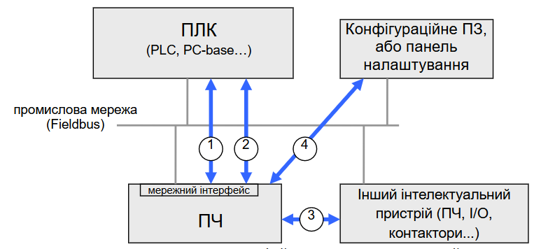
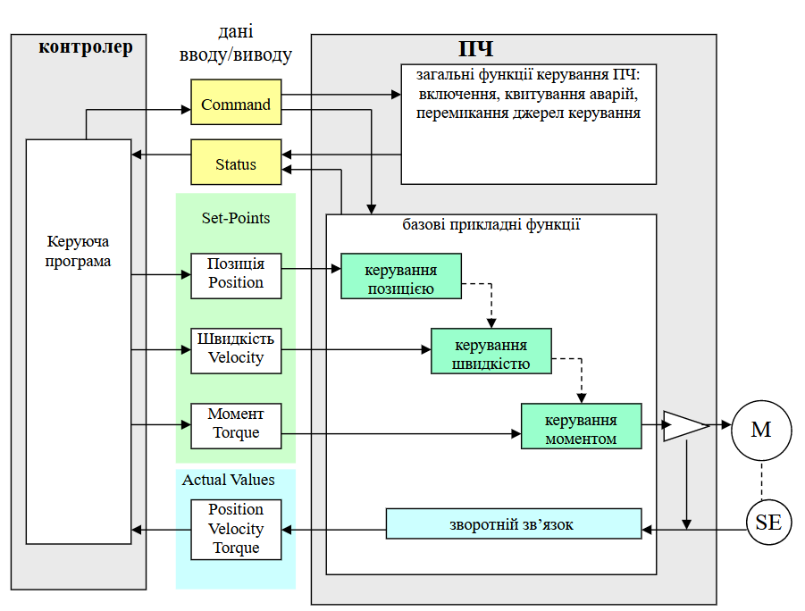
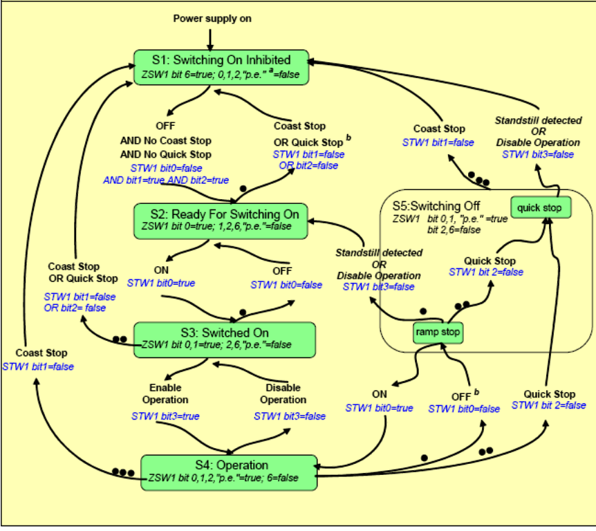
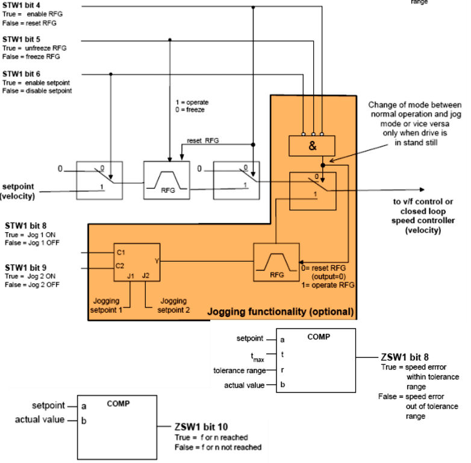
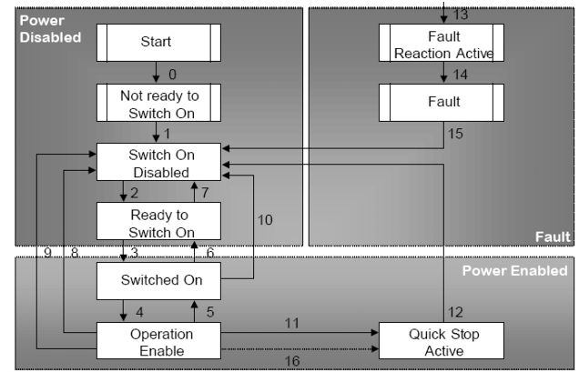

[<- До підрозділу](README.md)

# Використання інтерфейсів промислових мереж для керування перетворювачами частоти: в питаннях та відповідях

## 1. Використання інтерфейсів промислових мереж частотних перетворювачів

### Які можливості дають інтерфейси промислової мережі у ПЧ?

1. Мережевий інтерфейс у перетворювача частоти (**ПЧ**) може використовуватися для керування та контролю з контролера, напкиклад **ПЛК**, (поз.1. рис.1), за допомогою обміну даними вводу/виводу (I/O Data). У цьому випадку для контролера (PLC, PAC, PC-base…), ПЧ є зовнішнім польовим пристроєм, яким треба керувати (запускати/зупиняти двигун, видавати завдання частоти…) і який треба контролювати (визначати стан приводу, зчитувати поточні значення частоти, струму, напруги…). Класичними колись способами такого керування було використання уніфікованих аналогових (4-20 мА, 0-10В, 0-5В), дискретних (0/24В) а також імпульсних (частотних) сигналів. Однак такий підхід значно обмежує кількість можливих сигналів під час обміну, і при їх збільшенні здорожує систему. Так, наприклад, тільки для контролю зупинки/роботи двигуна, визначення плинної, частоти та сили струму необхідно задіяти один дискретний і два аналогових виходи ПЧ і відповідно входи ПЛК. Якщо ще потрібно отримання значення напруги, необхідно задіяти (якщо є) ще один аналоговий вихід ПЧ і вхід ПЛК. Іншим недоліком використання аналогових сигналів є погана завадостійкість ліній, і як наслідок – спотворення корисного сигналу. Використання цифрового послідовного промислового зв'язку, тобто промислових мереж, дає можливість уникнути цих проблем. Також за такого підходу ПЛК може використовувати входи/виходи ПЧ у якості своїх віддалених входів/виходів, що може значно зменшити вартість кінцевої системи.

Рис.1. Використання інтерфейсів промислових мереж частотних перетворювачів

2. Крім обміну даними вводу/виводу, мережний інтерфейс дає можливість обмінюватися параметричними даними (Device Parameters) з пристроєм, який керує, наприклад ПЛК (поз.2. рис.1). Оскільки ПЧ є частиною системи керування, у центрі якої стоїть ПЛК, вважається, що це ПЧ є його "віддаленим модулем". Крім обміну даними вводу/виводу, цей віддалений модуль потрібно контролювати, конфігурувати та діагностувати. Наприклад, можна прочитати слово попередження чи аварії.

3. Мережний інтерфейс може використовуватися для безпосереднього обміну з іншими польовими пристроям (peer to peer device, поз.3.рис.1). Обчислювальні можливості перетворювачів частоти настільки збільшилися, що вони можуть успішно справлятися зі складними завданнями навіть без керуючого ПЛК. Одним із таких завдань може бути синхронізація ПЧ між собою або обмін із пристроями віддаленого вводу/виводу.

4. Мережний інтерфейс може використовуватися для конфігурування зовнішніми утилітами або панелями налаштування (місцевий інтерфейс, поз.4.рис.1). Враховуючи зростаючу функціональність і відповідно складність ПЧ, їх конфігурування вимагає дедалі більше зусиль. У багатьох випадках для нормальної роботи ПЧ достатньо змінити з десяток параметрів, в основному параметри двигуна, зчитаних з шильдиків (хоча це компетенція більше електриків, ніж автоматників). Операції конфігурування зазвичай проводяться з використанням локальної текстової панелі. Однак наявність великої кількості ПЧ і додаткових параметрів призводить до великих витрат людино-годин на подібне конфігурування вже не кажучи про незручності і ускладнення цього. Крім того, така складність призводить до нерідких помилок у цьому процесі та в результаті до поломок. Для таких систем розробники пропонують спеціалізоване ПЗ (інженерні утиліти), які через мережний інтерфейс можуть змінювати параметри ПЧ.

### До чого зводиться завдання керування перетворювачем частоти через промислову мережу?

Розв'язання завдання керування ПЧ через промислову мережу можна розділити на дві частини:

1. Забезпечення обміну даними введення/виведення між ПЛК та ПЧ.
2. Забезпечення логіки керування ПЧ.

Перша частина завдання зводиться до того, щоб між ПЛК та ПЧ циркулювали необхідні дані. Для цього потрібно знати карту розподілу пам'яті конкретного ПЧ щодо конкретної промислової мережі та налаштувати або запрограмувати доступ до неї. Спосіб організації такого обміну визначається комунікаційними особливостями промислової мережі та особливостями ПЛК та ПЧ стосовно організації обміну і, по факту, не є чимось особливим, порівняно з обміном з іншими типами пристроїв. За умови забезпечення такого обміну, умовно можна вважати, що ПЛК і ПЧ знаходяться в одному адресному просторі. Тобто ПЛК просто оперує якимись змінними, що відповідають за функціонування ПЧ. 

Проте, цього не достатньо для реалізації завдання. Основною причиною тому є той факт що ПЧ є складним багатофункціональним пристроєм, який може перебувати у різних станах, в залежності від чого він веде собе по різному. Тому програма керування в ПЛК повинна контролювати ці стани і віддавати команди для їх зміни. Кілька прикладів таких станів наведено в таблиці 1. Так як ПЧ є складним пристроєм, його треба розглядати з різних точок зору, тому що в один момент часу з різних точок зору він знаходиться в різних станах.  Надалі будемо вважати що комбінація цих станів є узагальним станом ПЧ, який надалі будемо називати просто "стан". 

Таблиця 1.

| Точка зору: погляд на ПЧ як на | Приклад можливих станів                                      |
| ------------------------------ | ------------------------------------------------------------ |
| польовий пристрій              | аварія - сигналізуючи про помилку функціонування             |
| вузол мережі                   | режим періодичного обміну даними; режим конфігурування мережі (наприклад, PROFIBUS – Preparation, CANOpen - Preoperational); режим відсутності доступу до мережі; |
| засіб для керування двигуном   | вибіг на вказану частоту; зупинений;                         |

Переведення ПЧ зі стану в стан відбувається як за внутрішніх умов, так і за команд керування з боку ПЛК. Керування станом зводиться до зміни змінних ПЧ (обмін якими забезпечується вирішенням першої частиною завдання) за певним правилом. Таким чином, друга частина задачі зводиться до забезпечення логіки керування ПЧ, яка базується на станах. У найпростішому випадку для запуску ПЧ досить просто змінити один або кілька біт. У складніших випадках необхідно побудувати цілу послідовність дій, тобто керувати **автоматом станів**.

### Що таке автомат станів та діаграма станів функцій ПЧ?

У кожному конкретному стані ПЧ поводиться по-різному. Так, наприклад, у нормальному операційному (робочому) режимі можна керувати швидкістю обертання двигуна, а в стані аварії – команди керування двигуном не працюють. Автомат станів – це логіка поведінки функцій ПЧ, виходячи з станів, перехід між якими здійснюється за командами з ПЛК, чи за виникнення внутрішніх подій. Автомат станів описується діаграмою станів, зазвичай у графічному вигляді для кращого розуміння програмістом, проектувальником або іншому технічному спеціалісту.

У більшості випадків логіка керування функціями ПЧ залежить тільки від конкретного ПЧ, або від **профілю**, що підтримується ним, і мало залежить від типу використовуваного мережного інтерфейсу.

### Що таке функціональний профіль керування ПЧ, навіщо він потрібний?

Профіль пристрою в мережі (не тільки ПЧ, а будь якого) – це набір правил, що означує поведінку конкретного пристрою, який відповідає цьому профілю. Якщо, наприклад, у мережі CANOpen, пристрій підтримує профіль модуля аналогового вводу, то в змінних за конкретними адресами можна буде знайти значення аналогових входів, значення масштабування і т.д. За використання профілю, для розробника прикладного програмного забезпечення створення системи мало залежатиме від виробника пристрою, оскільки він відповідає правилам профілю. Відповідно підключення та заміна такого пристрою дещо схожа на методику Plug&Play. 

Аналогічно, можна сказати і про профіль керування ПЧ. Профіль керування означує модель та логіку керування функціями ПЧ, інтерпретацію команд слова керування, та значення бітів слова стану.

### Які профілі ПЧ існують нині?

Нині є багато профілів керування ПЧ. Більшість з них – фірмові (пропрієтарні), наприклад профіль `FC` у ПЧ Danfoss або `I/O Profile` у ПЧ Altivar (Schneider Electric). Тим не менше, кілька із них є стандартизованими та використовуються у ПЧ багатьох виробників. Саме на них коротко зупинимося далі. До найпопулярніших відносяться такі профілі:

1. CiA 402 (CAN in Automation);
2. CIP Motion (ODVA);
3. PROFIDrive (PROFIBUS International);
4. SERCOS (SERCOS International).
5. DRIVECOM (INTERBUS).

Всі ці профілі, окрім DRIVECOM описані в 7-й частині стандарту IEC 61800 "Adjustable speed electrical power drive systems" (ДСТУ EN 61800-7-1:2022 Системи силового електроприводу з регульованою  швидкістю. Частина 7. Загальний інтерфейс і використання профілів для  систем силового електроприводу). 

### Як пов'язані профілі ПЧ з промисловою мережею, що використовується?

Історично так склалося, що багато профілів ПЧ з'явилися в ролі профілі пристроїв в конкретній мережі. З цієї точки зору вони були інтерфейсно-залежними, наприклад PROFIDRIVE в мережі PORFIBUS. Однак, в даний час використання конкретного протоколу мережі не означує обов'язкову наявність конкретного профілю ПЧ.

З точки зору функціонального профілю ПЧ, розміщення та спосіб доступу до даних не має значення. Тому наявність скажімо CANOpen в ПЧ, не говорить про те, що він керується по CiA 402. І навпаки, ПЧ з підтримкою CiA 402 може керуватися через мережі Modbus, Profibus, WorldFIP і т.д. Те ж саме стосується того, що ПЧ з PROFIBUS не передбачає керування за профілем PROFIDRIVE (наприклад `FC` в Danfoss, `DRIVECOM` в Lenze). 

## 2. Загальні принципи керування ПЧ через промислову мережу

### Як керується і контролюється ПЧ з боку контролера?

Перетворювач частоти може функціонувати в різних режимах: керування моментом, керування швидкістю так керування переміщенням. При цьому таке керування може відбуватися як зі зворотним зв'язком від датчиків, так і з розімкненим керуванням, як з перемиканням (вибором) завдання, так і з числовим завданням (рис.2). У будь-якому випадку всі функції ПЧ можна умовно віднести до однієї з груп: 

- загальних функцій керування: включення режиму функціонування, квитування аварій, перемикання джерела керування та інші; 
- базових прикладних функцій: керування швидкістю, моментом, переміщенням.

Рис.2. Принципи керування та контролю ПЧ

Далі по тексту користуватимемося назвами, означеними IEC 61800-7.

Для передачі команд через мережу від ПЛК до ПЧ використовуються змінні командного керування, які позначаються як `COMMAND` (рис.2). Це одне або більше 16-бітних слів, кожен біт яких означує яку дію потрібно зробити. Для контролю над станом ПЧ використовуються змінні стану, які позначаються як `STATUS`. Це одне або більше 16-бітних слів, кожен біт яких означує, в якому стані знаходиться та чи інша функція ПЧ.

Для завдання поточних значень швидкості, частоти, позиції керуючий ПЛК передає уставки (`Set Points`), а для контролю над ними – отримує поточні значення (`Actual Values`). Крім уставок і поточних значень, контролер і ПЧ, що ним керує, можуть обмінюватися іншою інформацією, наприклад значеннями сигналів з датчиків і виконавчих механізмів, підключених до приводу, або уставки ПІД-регулятора. Крім цього, додаткові дані можуть використовуватися для зчитування або запису параметрів ПЧ.

### Які команди найчастіше використовуються для керування ПЧ, і якими станами визначається його функціонування?

Найбільш типовими для ПЧ є наступні стани.

Стан помилки (`Faulted State`), у якому ПЧ не може функціонувати. Для контролю над помилками, у слові стану зазвичай виділяється окремий біт помилки. Для переходу ПІЧ в нормальний стан (`No Faulted`) необхідна команда скидання помилки (`Reset Fault`) з керуючого контролера або локально, за місцем (наприклад з лицьової панелі). Крім біта помилки в слові стану деяких ПЧ є також біт попередження `Warning`.

Операційний режим. За нормальної роботи ПЧ функціонують його базові прикладні функції: керування швидкістю, моментом або переміщенням. Незалежно від того, звідки він керується (локально з панелі, локальними входами/виходами або через мережу), з точки зору функціонування він знаходиться в операційному режимі (`operating`). У режимі `not operating` базові функції керування не функціонують, а двигун зупиняється. Значення режиму контролюється через відповідний біти змінної статусу `Operating`. 

Режими джерела керування. Залежно від джерела керування, у профілі можуть бути означені такі стани: `local control` - ПЧ приймає команди та задані значення через локальний інтерфейс (наприклад, лицьову панель або локальні входи/виходи ПЧ); `remote control` - ПЧ приймає команди та задані значення через мережний інтерфейс, наприклад з ПЛК. Значення режиму контролюються через біт статусу `Remote Control`.

При подачі живлення на ПЧ він може стартувати в одному з режимів, наприклад режим `not operating` і `local control`. Команда `Operate` перемикає автомат стану режимів `operating` і `not operating`. Біт-команди `Local/Remote` переводять привод у відповідний режим керування. 

## 3. Профіль PROFIDRIVE

### Що таке PROFIDRIVE?

PROFIdrive (Profile Drive Technology) – стандарт профілю для ПЧ (а також інших приводних пристроїв), запропонований організацією PROFIBUS & PROFINET International для використання його спільно з мережами PROFIBUS та PROFINET. 

Для обміну даними процесу для контролю та керування (див.1. рис.1.1) використовуються циклічні сервіси мережі (наприклад polling в PROFIBUS). Загальне конфігурування відбувається через відповідні сервіси мережі. Тим не менше, профіль передбачає можливість параметризації приводу через циклічний сервіс обміну IO Data через так званий канал параметризації, в якому передаються запити на читання або запис параметрів, які не є частиною змінних керування.

### Як у PROFIDRIVE реалізовано керування та контроль роботи приводу?

Керування в PROFIDRIVE здійснюється за допомогою керуючих слів Control Words (STW), а контролюються через слова статусу Status Words (ZSW). Кількість ZSW і STW може бути більшою за один.

Для керування та контролю приводом дані вводу/виводу (дані процесу) включають один або кілька значень уставок (наприклад задане значення швидкості) та поточних значень (наприклад дійсне значення швидкості, струм двигуна і т.п.). Можливі комбінації уставок та поточних значень складено у заздалегідь визначені стандартом формати телеграм.

### Які команди PROFIDRIVE використовуються для керування ПЧ, і якими станами означується його функціонування?

Стан помилки та її квітування. ПЧ може бути в режимі "без помилок" - `No Fault` (`ZSW1.3 = 0`, тобто біт третій у слові `ZSW1` дорівнює `0`) або в "наявність помилки" - `Fault Present` (`ZSW1.3 = 1`). Додатково означено стани для попереджувальної тривоги: `Warning Present` (`ZSW1.7 = 1`) та `No Warning` (`ZSW1.7 = 0`). Квітування аварії проводиться командою `Fault Acknowledge` (`STW1.7=1`). Механізм квітування аварій відрізняється залежно від платформи, це може бути як за переднім так і за заднім фронтом команди квітування. Крім того, поведінка приводу в кожному стані означується в самому пристрої, у тому числі в залежності від налаштувань конфігуруванні ПЧ.

Стан роботи базових функцій. Керування режимом функціонування базових прикладних функцій PROFIDRIVE описується загальною діаграмою стану, показаною на рис.3. Кожен стан нумерується від`S1` до `S5`. Стан Operation `(S4`) відповідає за операційний режим роботи приводу. Він сигналізується другим бітом першого слова статусу (`Operation Enabled` – `ZSW1.2 = 1`). Стан `Not Operating` в PROFIdrive ділиться на кілька підрежимів: `Switching On Inhibited`, `Ready for Switching On`, `Switched On` і `Switching OFF`.

Керуючий ПЛК може керувати автоматично станами тільки якщо:

- Виставлено режим віддаленого керування `Control Requested` (`ZSW1.9 = 1`);
- ПЛК відправляє команду `Control By PLC` (`STW1.10 = 1`), повідомляючи, що він готовий до керування та його значення даних вірні;

- ПЛК відправляє команду `ON` (`STW1.0 = 1`), включити ПЧ;

- ПЧ сигналізує про готовність до операційного режиму сигналом `Ready To Operate` (`ZSW1.1 = 1`).

На рис.3 у прямокутниках показані стани загального автомата та біти статусу, яким вони сигналізуються. Стрілки показують події та команди, які призводять до переведення автомата з одного стану в інший. Подія `Standstill detected` сигналізує про виявлення зупинки двигуна. Можливе аварійне переведення приводу в стан `S1` (на діаграмі позначено індексом `b`).

 

рис.3. Автомат станів для PROFIDRIVE

### Як функціонує ПЧ в профілі PROFIDRIVE у режимі керування швидкістю?

У PROFIdrive прикладні режими роботи приводів виділяються у шість прикладних класів (Application Class, AC). Усі режими керування моментом та розімкнене керування швидкістю відносяться до класу АС1 "Standard Drive". На рис.4 показано функціональну діаграму операційного режиму приводу Satndard Drive.

рис.4. Функціональна діаграма операційного режиму в PROFIDrive для приводу StandardDrive 

У таблиці 1 зведені всі команди PROFIdrive у яких наведені біти 4,5,6,8,9 стосується лише режиму керування Satndard Drive.

Таблиця 1. Команди PROFIdrive (слово керування №1)

| Назва згідно COMMAND IEC 61800-7 | Назва PROFIdrive                                            | Біт STW1 | призначення команди                                          |
| -------------------------------- | ----------------------------------------------------------- | -------- | ------------------------------------------------------------ |
|                                  | 1 - ON 0 – OFF (OFF1)                                       | 0        | Команда на увімкнення/вимкнення основного живлення. При подачі команди `OFF1` двигун буде плавно зупинятися по заданій рампі (лінійній траєкторії), до повної зупинки, після чого подача живлення на двигун припиниться. |
|                                  | 1 – No Coast Stop (No OFF2)  0 – Coast Stop (OFF2)     | 1        | Команда `OFF2` негайно знімає напругу з двигуна основним вимикачем живлення. Двигун зупиняється за рахунок інерції (самовибіг). |
|                                  | 1 - No Quick Stop (No OFF3)  0 – Quick Stop (OFF3)     | 2        | Команда на швидку зупинка двигуна.                           |
| OPERATE                          | 1 – Enable Operation  0 – Disable Operation            | 3        | Команда на увімкнення/вимкнення операційного режиму. В операційному режимі всі уставки функціонують. |
|                                  | 1 – Enable Ramp Generator 0 –  Reset Ramp Generator    | 4        | Активація нарощування уставки по рампі                       |
|                                  | 1 – Unfreeze Ramp Generator  0 – Freeze Ramp Generator | 5        | Фіксація (замороження) заданої уставки                       |
|                                  | 1 – Enable Setpoint  0 – Disable Setpoint              | 6        | Активація уставки                                            |
| RESET FAULT                      | 1 – Fault Acknowledge  0 – No Significance             | 7        | Квітування помилки. Реакція приводу залежить від типу помилки |
|                                  | 1 – JOG1 ON  0 – JOG1 OFF                              | 8        | Активація (перемикання) фіксованої частоти 1                 |
|                                  | 1 – JOG2 ON  0 – JOG2 OFF                              | 9        | Активація фіксованої частоти 2                               |
| REMOTE LOCAL                     | 1 – Control By PLC  0 – No Control By PLC              | 10       | Режим активації команди на керування приводом з керуючого ПЛК |

У таблиці 2 зведені біти статусу PROFIdrive, де біти 4,5,6,8,10 стосується лише режиму керування Satndard Drive. 

Таблиця 2. Зведені біти статусу PROFIdrive (слово стану №1)

| Назва згідно  STATUS IEC 61800-7 | Назва PROFIdrive                                             | Бsт ZSW1 | призначення біту стану                                       |
| -------------------------------- | ------------------------------------------------------------ | -------- | ------------------------------------------------------------ |
|                                  | 1 – Ready To Switch On  0 – Not Ready To Switch On      | 0        | Живлення підключено, електроніка ініціалізована              |
|                                  | 1 – Ready To Operate    0 – Not Ready To Operate        | 1        | Повторює `0-й` біт слова керування `STW1.0`                  |
| Operating                        | 1 - Operation Enabled    0 – Operation Disabled         | 2        | Привід в операційному/не операційному режимі                 |
| Faulted                          | 1 – Fault Present    0 – No Fault                       | 3        | У буфері є непідтверджені активні помилки. Підтвердження всіх помилок та їх зникнення знімає біт |
|                                  | 1 – Coast Stop Not Activated (No OFF 2)    0 – Coast Stop Activated (OFF 2) | 4        | Активовано зупинку способом зняття живлення з двигуна        |
|                                  | 1 – Quick Stop Not Activated (No OFF 3)    0 – Quick Stop Activated (OFF 3) | 5        | Активовано швидку зупинку                                    |
|                                  | 1 – Switching On Inhibited    0 – Switching On Not Inhibit | 6        | Привід увімкнено в режимі заборони функціонування            |
| Warning                          | 1 - Warning Present    0 - No Warning                   | 7        | У буфері є попередження                                      |
|                                  | 1 – Speed Error Within Tolerance Range  0 – Speed Error Out Of  Tolerance Range | 8        | якщо =1 – різниця між заданою та дійсною швидкістю у межах норми |
| Remote control                   | 1 – Control Requested    0 – No Control Requested       | 9        | якщо =1 - привід готовий до керування від ПЛК                |
|                                  | 1 – f Or n Reached Or  Exceeded    0 – f Or n Not Reached | 10       | якщо =1 - частота або швидкість досягла уставки              |

## 4. Профіль CiA402

### Що таке CiA402?

Профіль CiA402 був розроблений організацією CAN in Automation і під назвою DS-402, який використовується і нині як базовий прикладний профіль управління ПЧ у мережах CANOpen, ETHERNET Powerlink та ETHERCat. Тим не менше, як вже зазначалося, профіль CiA402 може використовуватися і в інших мережах. Нижче розглянемо функціонування CiA402 лише в контексті мережі CANOpen. Слід зазначити, що використання частотних перетворювачів мережі CANOpen не обов'язково передбачає використання профілю CiA402 (DS-402).

### Як у CiA402 реалізовано керування та контроль приводом?

Керування CiA402 здійснюється за допомогою слова `Controlword` (для CANOpen індекс у Словнику $6040_{16}$), а контролюються через слово статусу `Statusword` (для CANOpen індекс у Словнику $6041_{16}$).

Дані вводу/виводу для керування та контролю над приводом включають одне або кілька значень уставок та поточних значень. При використанні профілю разом з CANOpen ці дані та параметри прикладних профілів зберігаються в конкретних Об'єктах Словника починаючи з індексів $6000_{16}$. Так, наприклад, для режиму керування швидкістю без зворотного зв'язку означені наступні об'єкти словника:

- слово керування - `Controlword` (ID $6040_{16}$);
- Слово стану - `Statusword` (ID $6041_{16}$);
- задана швидкість – `Target velocity` (ID $6042_{16}$);
- поточна швидкість - `velocity actual value` (ID $6044_{16}$).

### Які команди CiA 402 використовуються для керування ПЧ, і якими станами визначається його функціонування?

Стан помилки та її квитування. ПЧ може бути в режимі `Fault` (3-й біт `Statusword` = `1`) або `No Fault` (3-й біт `Statusword` = `0`). Скидання аварії проводиться командою `Fault Reset` (7-й біт `Controlword` = `1`). Поведінка приводу у кожному стані визначається у самому пристрої, наприклад при конфігуруванні. Після скидання аварії, ПЧ переводиться в стан `Ready To Switch On`.

Стан роботи базових функцій. Діаграма станів для профілю CiA402 наведена на рис.5, номери переходів відповідають подіям з таблиці 5. Стан `not operating` у профілі CiA402 складається з кількох підстанів. Таким чином автомат включає такі стани:

- `Not ready to Switch On` – стадія ініціалізації ПЧ, комунікації недоступні;
- `Switch On Disabled` – закінчення стадії ініціалізації, силова частина приводу неактивна, подача живлення на неї не здійснюється та заборонена, доступна параметризація приводу через комунікації;
- `Ready to Switch ON` – очікування на подачу живлення на силову частину приводу, доступна параметризація через комунікації.
- `Switched On` – подано живлення на силову секцію приводу, двигун не заживлений, доступна параметризація через комунікації;
- `Operation Enabled` – нормальний операційний режим, помилок не виявлено, на двигун подано живлення, доступна параметризація через комунікації за винятком конфігураційних даних силової частини.
- `Fault Reaction Active` – визначено помилку приводу, проводиться її обробка; функції керування двигуном недоступні.
- `Fault` – стан помилки, привід заблокований, живлення на двигун не подається;
- `Quick Stop Active` – стан швидкого зупинення двигуна.

 

рис.5. Діаграма станів для профілю CiA-402

Стан ПЧ означується словом `Statusword`, а переходи між станами можуть здійснюватися за внутрішніми подіями, або за командою `Controlword`. У таблиці 3 наведені значення бітів слова статусу в різних станах.

Таблиця 3. Значення бітів слова стану

| Стан                   | Біт 6: Switch On Disabled | Біт 5:Quick Stop Active | Біт 4:Voltage Enabled | Біт 3:Fault | Біт 2:Operation Enabled | Біт 1:Switched On | Біт 0:Ready to Switch ON | Значення за маскою $006F_{16}$ |
| ---------------------- | ------------------------- | ----------------------- | --------------------- | ----------- | ----------------------- | ----------------- | ------------------------ | ------------------------------ |
| Not Ready To Switch ON | 0                         | x                       | x                     | 0           | 0                       | 0                 | 0                        | -                              |
| Switch On Disabled     | 1                         | x                       | x                     | 0           | 0                       | 0                 | 0                        | 0040                           |
| Ready to Switch ON     | 0                         | 1                       | x                     | 0           | 0                       | 0                 | 1                        | 0021                           |
| Switched On            | 0                         | 1                       | 1                     | 0           | 0                       | 1                 | 1                        | 0023                           |
| Operation Enabled      | 0                         | 1                       | 1                     | 0           | 1                       | 1                 | 1                        | 0027                           |
| Quick Stop Active      | 0                         | 0                       | 1                     | 0           | 1                       | 1                 | 1                        | 0007                           |
| Fault Reaction Active  | 0                         | x                       | x                     | 1           | 1                       | 1                 | 1                        | -                              |
| Fault                  | 0  0                 | 0  1               | x  x             | 1  1   | 0  0               | 0  0         | 0  0                | 0008  0028                |

`x` – неозначений стан

У таблиці 4 наведені команди для переходу між станами та біти слова `Controlword`, що відповідають їм.

Таблиця 4. Команди для переходу між станами

| Команда           | 7:Fault Reset | 3:Enable Operation | 2:Quick Stop | 1:Enable Voltage | 0:Switch On | Знач в 16-ковому форматі |
| ----------------- | ------------- | ------------------ | ------------ | ---------------- | ----------- | ------------------------ |
| Shutdown          | x             | x                  | 1            | 1                | 0           | 0006                     |
| Switch On         | x             | x                  | 1            | 1                | 1           | 0007                     |
| Enable Operation  | x             | 1                  | 1            | 1                | 1           | 000F                     |
| Disable Operation | x             | 0                  | 1            | 1                | 1           | 0007                     |
| Disable Voltage   | x             | x                  | x            | 0                | x           | 0000                     |
| Quick Stop        | x             | x                  | 0            | 1                | x           | 0002                     |
| Fault Reset       | 0->1*         | x                  | x            | x                | x           | 0080                     |

\* - за переднім фронтом сигналу

У таблиці 5 наведено події та команди, за якими здійснюється перехід між станами. Номер переходу показано на рис.5.

Таблиця 5. Події та команди, за якими відбувається перехід між станами

| № пере-  ходу | Зі стану               | На стан                | Подія                                                 | Реакція на подію                                             |
| ------------- | ---------------------- | ---------------------- | ----------------------------------------------------- | ------------------------------------------------------------ |
| 0             | Start                  | Not Ready To Switch ON | Запуск привода                                        | Привод проходить самодіагностику та стартову ініціалізацію   |
| 1             | Not Ready To Switch ON | Switch On Disabled     | позитивний результат ініціалізації                    | Активація комунікації та відображення процес них даних       |
| 2             | Switch On Disabled     | Ready to Switch  ON    | команда Shutdown                                      | перехід в наступний стан                                     |
| 3             | Ready to Switch  ON    | Switched On            | команда Switch On                                     | силова секція приводу включається                            |
| 4             | Switched On            | Operation Enabled      | команда Enable Operation                              | перехід в операційний режим: доступні функції  управління двигуном |
| 5             | Operation Enabled      | Switched On            | команда Disable Operation                             | операційний режим відключається                              |
| 6             | Switched On            | Ready to Switch  ON    | команда Shutdown                                      | силова секція приводу відключається                          |
| 7             | Ready to Switch  ON    | Switch On Disabled     | команда Quick Stop                                    | перехід в наступний стан                                     |
| 8             | Operation Enabled      | Ready to Switch  ON    | команда Shutdown                                      | негайне відключення силової секції та напруги з двигуна      |
| 9             | Operation Enabled      | Switch On Disabled     | команда Disable Voltage                               | негайне відключення силової секції та напруги з двигуна      |
| 10            | Switched On            | Switch On Disabled     | команда Disable Voltage або Quick Stop                | негайне відключення силової секції та напруги з двигуна      |
| 11            | Operation Enabled      | Quick Stop Active      | команда Quick Stop                                    | виконується швидка зупинка двигуна                           |
| 12            | Quick Stop Active      | Switch On Disabled     | швидка зупинка виконана або  команда  Disable Voltage | силова секція приводу відключається                          |
| 13            | Всі стани              | Fault Reaction Active  | помилка на приводі                                    | виконання дії відповідно до типу помилки                     |
| 14            | Fault Reaction Active  | Fault                  | обробка помилки закінчена                             | функції управління двигуном недоступні, силова секція  може відключитися |
| 15            | Fault                  | Switch On Disabled     | команда  Fault Reset                                  | зняття помилкового стану у випадку відсутності помилок,  біт команди Fault Reset повинен обнулитись з  контролеру |
| 16            | Quick Stop Active      | Operation Enabled      | команда  Enable Operation                             | активуються функції управління двигуном                      |

### Як функціонує ПЧ в профілі CiA-402 у режимі керування швидкістю?

У CiA-402 режим керування швидкістю без зворотного зв'язку називається `Profile Velocity mode`. Для цього режиму в операційному стані запуск двигуна відбувається за допомогою команди `No Halt` (8 біт `Controlword` = `0`), зупинка - `Halt` (8 біт `Controlword` = `1`). Задана швидкість обертання визначається об'єктом `Target velocity` (для CANOpen - $6042_{16}$), а контролюється об'єктом - `Velocity actual value` (для CANOpen - $6044_{16}$). Контроль роботи двигуна в операційному режимі проводиться також додатковими бітами статусу, які є опціональними:

- `Target Reached` (біт 10):
  -  при `Halt = 1`, - `0` означає, що двигун зупиняється, `1` - що двигун зупинився; 
  - при `Halt=0`, - `0` означає, що швидкість не досягла уставки, `1` – що швидкість досягла уставки;

- `Speed` (біт 12) - якщо `0` - швидкість не дорівнює нулю, `1` - швидкість дорівнює нулю.

Загальний список бітів слова керування для режиму керування швидкістю наведено у таблиці 6.

Таблиця 6. Біти слова керування для режиму керування швидкістю

| назва Command  IEC 61800-7 | назва  CiA-402   | біт  Controlword | пояснення                                                    |
| -------------------------- | ---------------- | ---------------- | ------------------------------------------------------------ |
|                            | Switch ON        | 0                | =1, включення силової секції приводу                         |
|                            | Enable Voltage   | 1                | =0,  негайне відключення силової секції та напруги з двигуна |
|                            | Quick Stop       | 2                | =1,  швидка зупинка двигуна                                  |
| OPERATE                    | Enable Operation | 3                | =1,  переведення в операційний режим                         |
|                            |                  | 4                | зарезервовані                                                |
|                            |                  | 5                | зарезервовані                                                |
|                            |                  | 6                | зарезервовані                                                |
| RESET FAULT                | Fault Reset      | 7                | скидання  помилок                                            |
|                            | Halt             | 8                | зупинка  двигуна                                             |
|                            |                  | 11-15            | призначення  залежить від виробника                          |

Загальний список бітів слова стану для режиму керування швидкістю наведено у таблиці 7.

Таблиця 7. Біти слова стану для режиму керування швидкістю

| назва STATUS  IEC 61800-7 | назва  CiA-402      | біт  Statusword | пояснення                                                    |
| ------------------------- | ------------------- | --------------- | ------------------------------------------------------------ |
|                           | Ready to Switch  ON | 0               | =1,  готовий до подачі живлення на силову частину приводу    |
|                           | Switched On         | 1               | =1,  силова частина приводу підключена до живлення           |
| Operating                 | Operation Enabled   | 2               | =1,  знаходиться в операційному режимі                       |
| Faulted                   | Fault               | 3               | =1, є  активна помилка                                       |
|                           | Voltage Enabled     | 4               | =1,  активність обробки команди Disable Voltage              |
|                           | Quick Stop Active   | 5               | =0,  відбувається швидка зупинка двигуна                     |
|                           | Switch On Disabled  | 6               | =1, не  готовий до подачі живлення на силову частину приводу |
| Warning                   | Warning             | 7               | =1, є  попереджувальні повідомлення                          |
|                           |                     | 8               | призначення  залежить від виробника                          |
| Remote control            | Remote              | 9               | =1,  доступне управління з CANOpen, =0 – управління з мережі недоступне |
|                           | Target Reached      | 10              | залежить  від HALT:   двигун  зупиняється/зупинився або швидкість рівна/нерівна уставки |
|                           | Speed               | 12              | =1, швидкість дорівнює нулю  =0, швидкість  не дорівнює нулю |

Теоретичне заняття розробив [Олександр Пупена](https://github.com/pupenasan). 

