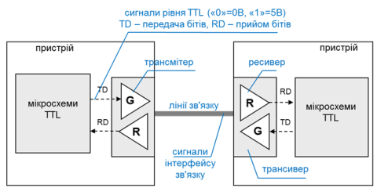
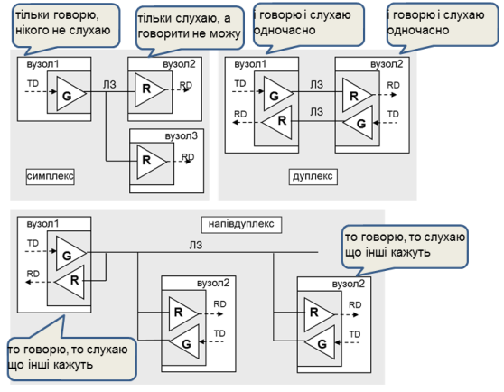
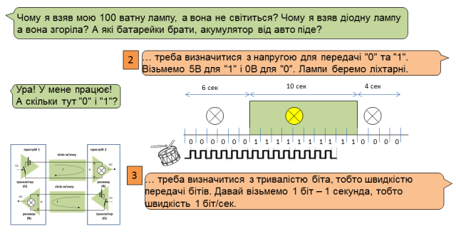
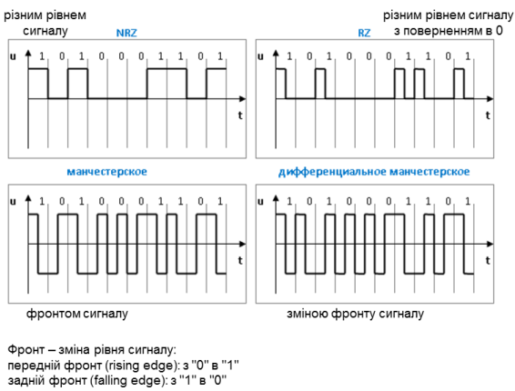

[<- До підрозділу](README.md)

# Фізичний рівень функціонування мережі: основні поняття

Для розуміння функціонування мереж на фізичному рівні можна зробити гіпотетичний експеримент, в якому товариші створюють власну мережу на базі звичайних електронних елементів. Поступово рухаючись в бік ускладнення мережі будуть проявлятися ті чи інші особливості.  

## 1. Способи передачі даних

Взагалі є два способи передачі двійкових даних – **послідовно** і **паралельно** . Паралельний має ряд недоліків (велика кількість провідників, ризик різної довжини проводів, взаємні наводки ..) тому зараз він як правило використовуються тільки всередині пристроїв. 

рис.2.1. Способи передачі даних. 

Інформаційний обмін даними між прикладними програмами на всіх рівнях OSI-моделі відбувається у вигляді послідовностей логічних бітів. Канальний рівень передає цю послідовність фізичному рівню, задачею якого є перетворення її в послідовність фізичних сигналів, яка відповідає логічній «1» і «0» та передачі її по фізичному каналу фізичним рівням всіх вузлів, які підключені до його середовища передачі. Тобто фізичний рівень повинен забезпечити фізичну передачу послідовності бітів між канальними рівнями вузлів, пов’язаних між собою. 

На фізичному рівні (з точки зору OSI-моделі) описуються механічні, електричні та функціональні характеристики, а також фізичне середовище передачі даних для конкретної мережі.   Фізичним середовищем передачі даних можуть бути: металевий провід (кабель), оптоволоконний кабель, радіохвилі або лазерний промінь, причому деякі мережі можуть базуватися на їх комбінації.  

Приклад послідовної передачі - це телеграф. За одиницю часу приймається тривалість однієї точки.  Тривалість тире дорівнює трьом точкам.  Пауза між елементами одного знака — одна точка, між знаками в слові — 3 точки, між словами — 7 точок.

## 3. Спрощена модель послідовної передачі бітів

Якщо гіпотетично зібрати схему з лампи, кнопки, батарейки та проводів, то вона виглядатиме я на рис.2.2. У цьому випадку  вважається, що "0" – контакт розімкнений, і лампа не світиться, а "1" – контакт замикаємо, лампа світиться. 

рис.2.2. Спрощена модель послідовної передачі бітів

Для двухстороннього обміну можна зробити повнодуплексний зв'язок

## 3. Основні елементи фізичного інтерфейсу

Сигнали зв'язку мікросхем не пристосовані для передачі на великі відстані, потрібне підсилення, додаткове перетворення. Цим займаються трансмітери (рис.2.3).  

- G(Generator) або T(Transmitter) – **трансмітер**, **передавач** 
- R (Receiver) – **ресивер**, **приймач**
- G+R (Transceiver) – **трансивер**

рис.2.3. Основні елементи фізичного інтерфейсу

Фізичне середовище, що призначене для переносу інформації між одиницями обладнання, які приймають участь в інформаційному обміні, будемо називати лініями зв’язку (Interchange Circuit).

На мережному вузлі безпосередньою передачею даних до лінії зв’язку займається трансмітер або передавач (transmitter), а прийомом ресивер або приймач (receiver). Трансмітери та ресивери на принципових схемах, як правило позначають трикутниками з літерами відповідно "G" (або "T") та "R"(рис. 2.3). Пристрій, який об´єднує функції передавача і приймача називають трансивером або приймач-передавач (transceiver), який як правило реалізується у  вигляді окремого чіпсету. Трансиверу надходить логічний сигнал "0" або "1" (по рівню TTL), які він перетворює у певний фізичний сигнал і передає по лінії зв’язку. З іншого боку другий трансивер робить зворотне перетворення. Логічний сигнал який подається на трансмітер для передачі його по фізичному каналу, як правило позначається TD (Transmit Data) або Tx, а отриманий від ресивера – RD (Receive Data) або Rx. 

## 4. Типи зв'язку

Перенос даних в мережі по лініям зв’язку може проходити в трьох режимах: симплексно (simplex), дуплексно (full duplex) та – напівдуплексно (half duplex) (рис.2.4) . 

рис.2.4. Типи зв'язку

У випадку симплексної передачі дані передаються тільки в одному напрямку У цьому випадку на одному з вузлів мережі підключений тільки один передавач, а на всіх інших вузлах підключені тільки приймачі. 

При дуплексному з’єднанні дані одночасно передаються в прямому і зворотному напрямку, тобто в мережі трансивери вузлів одночасно працюють як на прийом так на передачу. У цьому випадку виникає необхідність у розділенні фізичних ліній зв’язку, або їх ресурсів. Для дуплексного з’єднання двох пристроїв можна використати дві різні лінії, одна з яких працює на прийом, а інша - на передачу. Можна також використати різні частоти для передачі по одній і тій самій лінії зв’язку. Це дозволяє з’єднувати по дуплексному зв’язку декілька вузлів між собою.

У напівдуплексному з´єднанні дані передаються в прямому і зворотному напрямку, але в різний час. Для цього типу з’єднання характерно розділення однієї лінії зв’язку для передачі від декількох передавачів. В певний момент часу працює тільки один передавач, а трансивери всіх інших вузлів можуть працювати в режимі прийому. В інший момент часу активним стає інший передавач. Напівдуплексний спосіб обміну більш економічний порівняно з дуплексним, оскільки використовує тільки одну лінію і не потребує частотного розділення. Однак він потребує визначення порядку доступу до лінії зв’язку всіх передавачів в мережі.

## 5. Кодування та швидкість

В інтерфейсі фізичного рівня обумовлюють який сигнал по напрузі визначений для кожного логічного стану. Кожний приймач представляє собою певне навантаження тобто вхідний опір (імпеданс) ресивера. Якщо крізь нього пропустити струм, на ньому пройде певне падіння напруги. Задача передавача забезпечити приймачів таким струмом, щоб напруга на них відповідала необхідному рівню, визначеному в інтерфейсі для заданого логічного стану. 

Якщо вхідний опір приймача не буде безкінечно великим, то по кабелю буде проходити струм і в результаті пройде падіння напруги. Якщо збільшувати імпеданс приймачів, то необхідний менший струм для передачі того самого сигналу по напрузі, однак це приводить до чутливості їх до паразитних струмів, які спричиняються різними джерелами перешкод. Тому в мережах опір приймачів вибирають так, щоб з одного боку зменшити потужність передавачів, а з іншого – зменшити чутливість до перешкод. 

Далі необхідно визначитися з кодуванням сигналу. При безпосередньому кодуванні, низький рівень сигналу (наприклад 0 В чи 0 мА) може відповідати логічному "0"  тобто space  (спокій),  а високий (наприклад 10 В чи 20 мА) – логічній "1" тобто mark(відправка). Такий спосіб називається прямим кодуванням\. У випадку прямого кодування, швидкість буде вказувати скільки біт передається за певний проміжок часу, тобто з тривалістю одного біта (рис.2.5). 

рис.2.5. Рівень сигналу, кодування та швидкість

Окрім прямого кодування, часто користуються зворотнім кодуванням, – коли логічний "0" передається високим рівнем сигналу, а "1" – низьким, а також полярним кодуванням – коли сигнали "0" і "1" протилежні за знаком по напрузі відносно загальної точки. Пряме, зворотнє і полярне кодування називаються кодуванням без повернення до нуля NRZ (Non-Return to Zero), так як в них відсутній обов’язковий перехід до нульового рівня (рис.2.6). 

Метод NRZ простий в реалізації, але чутливий до завад і спотворень. Крім того, приймач не може розрізнити, де закінчується і починається кожний окремий біт а також налаштуватися на необхідну швидкість. Це значить, що він не зможе відрізнити відсутність сигналу від послідовності бітів (представлених низьким рівнем сигналу) та працювати при динамічно змінюваних швидкостях без допоміжної синхронізації.

рис.2.6. Різні способи кодування

Вказані вище проблеми вирішуються при кодуванні з поверненням до нуля RZ (Return to Zero). У даному випадку вихідні дані для передачі комбінуються з сигналом синхронізації. Кожний біт, як і в попередньому випадку, починається з визначеного для нього рівня сигналу, а в середині кожного імпульсу відбувається перехід на нульовий рівень, по фронту якого приймач синхронізується з передавачем. Може також використовуватись RZ- кодування з сигналами різної полярності. Ці переваги над NRZ- кодуванням досягаються шляхом виділення в два рази більш широкої смуги пропускання, а також більш складною реалізацією.

Манчестерське або двохфазне кодування Bi-phase Level (BiФ-L) – використовує два рівня напруги з переходом в середині кожного імпульсу (біта). При прямому манчестерському кодуванні "0" представлений переходом від низької напруги до високої (передній фронт), а "1" - від високої до низької (задній фронт). При диференційному манчестерському кодуванні, як і в попередньому способі кожен біт являє собою зміну напруги, але сигнал передається не типом фронту, а наявності чи відсутності його зміни:"0" – фронт сигналу не змінюється, "1" – фронт сигналу змінюєьться з "переднього" на "задній", або навпаки. Можна сказати по іншому: якщо рівень сигналу (напруги) не змінюється при зміні періоду передачі одного біта, то наступний біт – логічна "1".

## 6. Модуляція (в модемах) 

Окрім передачі зі збереженням цифрової форми сигналу, використовується перетворення цифрового сигналу в аналогову форму для можливості передачі по аналоговим каналам. Це відбувається шляхом різних способів зміни (модуляції) гармонійного сигналу (несучої). Модуляція несучої представляє собою зміну деяких параметрів (амплітуди, частоти, фази) високочастотної несучої як функції вихідного інформаційного сигналу. В якості несучої використовується високочастотний синусоїдальний або імпульсний сигнал. Різні типи модуляції визначаються типом несучої і процедурою модуляції. Розрізняють:

-     амплітудну модуляцію АМ (AM - Amplitude Modulation), коли змінюють амплітуду несучої;

-     частотну модуляцію ЧМ (FM - Frequency Modulation), при якій змінюється частота несучої, як функція від вхідного сигналу;

-     фазову модуляцію ФМ (PM – Phase Modulation), коли змінюється фазовий зсув несучої. 

рис.2.7. Модуляція (в модемах): а – двійковий сигнал; б – амплітудна модуляція; в – частотна модуляція; г – фазова 

У випадку модуляції несучої цифровим сигналом розрізняють:

-     амплітудну маніпуляцію АМн (ASK – Amplitude Shift Keying) (рис.2.7б);

-     частотну маніпуляцію ЧМн (FSK - Frequency Shift Keying) (рис.2.7в);

-     фазову маніпуляцію ФМн (PSK - Phase Shift Keying) (рис.2.7г).

Серед трьох вказаних методів фазова маніпуляція найбільш стійка до завад. На сьогоднішній день як правило використовують маніпуляцію несучої не як функцію від двох станів ("1" або "0"), а як функцію від комбінації бітів. Наприклад, послідовності 00, 01, 10, 11 можуть кодуватися фазовим зсувом відповідно 0º, 90º, 180º і 270º відповідно, при цьому об’єм даних збільшується у два рази. Більш складнішими маніпуляціями, при яких для передачі декількох біт об’єднуються амплітудна і фазова модуляція, є:

-     квадратурно-фазова маніпуляція (QPSK – Quadrature Phase Shift Keying);

-     квадратурно-амплітудна модуляція (QUAM-16, QUAM-64 – Quadrature Amplitude Modulation. 

Число змін одного з параметрів несучої називається сигнальною швидкістю, або швидкістю передачі в бодах (Baud rate\) і вимірюється в бодах. За кожний бод передається один символ, який складається з декількох бітів, що визначається методом модуляції. Бітовою швидкістю називається об’єм бітів, яка передається по каналу за 1 сек, включаючи службові біти та біти синхронізації і вимірюється в біт/с. При модуляції вона дорівнює добутку сигнальної швидкості і кількості біт на символ. 

## 7. Топології і кількість вузлів

Канальний рівень оперує кадрами як готовими байтовими структурами. Передачею кадрів по фізичному середовищу займається фізичний рівень. В системах що використовують в якості середовища передачі металевий провід, важливою характеристикою є топологія мережі.  

Мережна топологія означує фізичну структуру мережі. Вона накладає обмеження на розташування ліній зв’язку та впливає на функціонування сервісів канального рівня. Базовими топологіями є: кільце, зірка й шина (рис. 2.11). 

В лінійній топології (ланцюжок) вузли з’єднуються один з одним створюючи лінію. По факту кожен вузол крім кінцевих є посередником для передачі даних.

У кільцевій структурі вузли попарно з’єднані між собою таким чином, що створюється кільце. Тобто кожен вузол має два канали  для зв’язку з двома сусідніми вузлами. Відмова в роботі хоча б одного вузлів приводить до порушення роботи кільця. Однак багато мереж використовують кільце для резервування шляху лінійної топології, тобто у операційному режимі дані все одно рухаються тільки по ланцюжку. 

У топології зірка вся інформація передається через виділений центральний вузол. Кожна периферійна станція підключається до цього вузла окремим фізичним каналом (променем), і може обмінюватись з іншою станцією тільки через центральний вузол. По суті зірка – це з’єднання типу точка-точка багатоканального вузла з іншими вузлами. 

У топології шина всі пристрої підключаються до загальної лінії зв’язку, тим самим використовуючи одне й те саме середовище як для передачі так для прийому. Основна її перевага полягає в простоті, дешевині й легкості переконфігурування. Добре підходить для розподілених об'єктів. Має ряд недоліків: присутність у кожному вузлі мережі загального трафіка, небезпека втрати зв'язку при одиночному обриві каналу зв'язку. 

Топологія дерево представляється ієрархічним поєднанням сегментів з топологією зірка. 

рис.2.8. Топології мережі

## 8. Синхронізація

При обміні даними між вузлами необхідно щоб передавач і приймач використовували одне і те саме джерело часу, тобто щоб вони були синхронізовані. В протилежному випадку, приймач не зможе визначити, коли надходить перший біт, тобто розпізнати початок посилки. Але навіть при початковій синхронізації джерела тактів передавача і приймача, а також домовленості про час початку відправки, при передачі великих послідовностей бітів, може виникнути розсинхронізація. 

На рис.2.9. показана послідовність бітів, яку передає трансмітер і розпізнає ресивер. Пунктирними лініями показані такти кожного з пристроїв. Оскільки неможливо фізично організувати абсолютно однакові часові інтервали тактів в пристроях, то в певний інтервал часу передачі – біти  будуть зміщені, отже посилка неправильно сприйнята (на рисунку виділено штриховою лінією).

рис.2.9. Необхідність синхронізації

При синхронній передачі приймач і передавач постійно синхронізуються під час передачі. Синхронізація проходить через певні проміжки часу або даних за допомогою синхронізуючої посилки, яка представляє собою імпульсний сигнал (набір імпульсів) певної частоти. Цей сигнал генерується або передавачем, або приймачем, або окремим пристроєм. Синхронізуючий сигнал може передаватися по спеціальному проводу (каналу), або разом з цифровими даними (наприклад RZ-кодування, манчестерське кодування), або перед ними (наприклад у вигляді преамбули). В першому випадку необхідний допоміжний провід (канал), в другому – допоміжна смуга пропускання, в третьому – допоміжні біти.

При асинхронній передачі, обмін даними може проходити і без визначеного джерела часу. Передача починається в будь який момент часу з сигналу початку передачі – стартового біта. В цей час приймач синхронізується з передавачем. Обмін проходить короткими наборами бітів (символами), що дозволяє не робити додаткову синхронізацію під час передачі. При асинхронній передачі приймач повинен наперед знати всі параметри зв’язку, в першу чергу – швидкість, щоб правильно ідентифікувати сигнали які поступають.

## 9. Задачі які вирішуються і не вирішуються на фізичному рівні.

Таким чином задачі які вирішуються на фізичному рівні зводяться до наступних:

1. тип зв'язку (симплекс, дуплекс, напівдуплекс)
2. тип та рівень сигналу (напруга/струм/світло…), кодування (NRZ, манчестерське…) ;
3. бітова швидкість;
4. тип кабелю, довжини ліній;
5. топологія;
6. кількість вузлів;
7. синхронізація;
8. боротьба з відбиттям хвиль;
9. боротьба з завадами

У той же час на фізичному рівні не вирішуються наступні задачі:

1. порядок доступу до загального середовища передачі;
2. доставка даних адресату;
3. повний контроль цілісності доставки даних;
4. фрагментація великих повідомлень;
5. об'єднання сегментів різного за типом мереж;
6. правила та семантика спілкування між прикладними програмами;
7. організація сеансу зв'язку;
8. захист від несанкціонованого доступу;
9. керування стан вузла
10. …. та багато інших

## Питання для самоконтролю

1. Принципи паралельної і послідовної передачі. Який спосіб більш використовуваний в комп'ютерних мережах і чому?
2. Типи зв'язку симплекс, дуплекс, напівдуплекс. Які способи які мають переваги та недоліки?
3. Призначення трансиверів. Чи можна гіпотетично об'єднувати пристрої без них (якщо вскрити корпус і під єднатися проводами)? Відповідь обґрунтуйте.
4. Швидкість передачі, кодування (NRZ vs Manchester coding), модуляція. Навіщо потрібні різні способи і модуляція.
5. Середовище передачі: варіанти реалізації, переваги та недоліки.
6. Як кількість вузлів та довжина лінії впливає на передачу за напругою.
7. Питання синхронізації, варіанти вирішення.
8. Питання які вирішуються і не вирішуються на фізичному рівні передачі.    

## Посилання на відеозаписи лекцій

- [Запис. Фізичний рівень Ч1](https://youtu.be/-9usAcXPu_w?si=tOkDf6uyGpY6YMh6)
- [Запис. Фізичний рівень Ч2](https://youtu.be/-o29D8iNxqo?si=H0ar3V_QbUFPgbbN)

Теоретичне заняття розробив [Олександр Пупена](https://github.com/pupenasan). 
