[<- До підрозділу](README.md)

# Мережі Profibus DP/PA: теоретична частина

PROFIBUS (PROcess FIeld Bus) – це відкрита промислова комунікаційна мережа, яка призначена для використання в системах автоматизації технологічних процесів та виробництв і розроблена спеціально для швидкодіючих та складних задач зв’язку. 

Робота над PROFIBUS була започаткована в 1987 році рядом німецьких компаній та інститутів. Метою було створення високошвидкісної промислової мережі для німецької промисловості. Першою була розроблена специфікація PROFIBUS FMS, а в 1993 році з’явилася специфікація PROFIBUS DP. Ці специфікації закріпилися в національному німецькому стандарті DIN 19245 відповідно в 1991 та 1993 р. В 1996 році вони увійшли до загальноєвропейського стандарту EN 50170. На сьогоднішній день мережі PROFIBUS також закріплені у міжнародних стандартах IEC 61158 та IEC 61784, а аспекти їх застосування і технічні характеристики визначені в загальнодоступних документах некомерційної німецької організації PNO (PROFIBUS Nutzerorganisation, заснованої у 1989р). Крім того PROFIBUS підтримується міжнародною всесвітньою організацією PI (PROFIBUS International, 1995 р.), що гарантує відкритість мережі і зв’язок між пристроями різних виробників. 

## 1. Мережі PROFIBUS в контексті моделі ISO та МЕК

На сьогоднішній день PROFIBUS це система, яка включає в себе різноманітні технології (рис.7.1.):

-     PROFIBUS DP (Decentralized Periphery);

-     PROFIBUS FMS (Fieldbus Message Specification);

-     PROFIBUS PA (for Process Automation)

<a href="media7/7_1.png" target="_blank">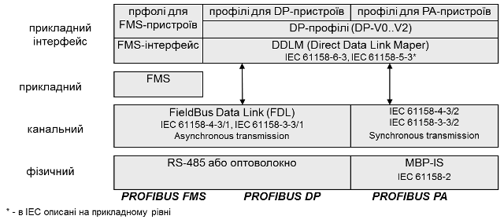</a> 

Рис.7.1. PROFIBUS в контексті OSI-моделі

Мережа PROFIBUS DP використовується в системах автоматизації процесу для зв’язку контролерів з розподіленою периферією, а PROFIBUS PA для зв’язку контролерів з датчиками в промисловій зоні. 

PROFIBUS DP - це сивмольно-орієнтований асинхронний тип мережі, який на фізичному рівні базується на інтерфейсі RS-485 або на різних типах оптоволоконних з’єднань.  Відсутність протоколу прикладного рівня (згідно опису EN) дозволяє безпосередньо обмінюватися ідентифікованими даними між вузлами, що значно прискорює процес обміну. Кількість та призначення даних визначається профілем та конфігурацією мережі. Слід зазначити, що в трьохрівневій моделі МЕК, PROFIBUS DP на прикладному рівні описаний: протоколом - IEC 61158-5-3 та інтерфейсом рівня - IEC 61158-6-3. У розділі 7.7 наведена інша модель PROFIBUS DP, яка викладена в специфікації від PNO. 

PROFIBUS PA – перша із PROFIBUS комунікацій, яка з’явилася в стандарті IEC 61158. Мережа реалізовує синхронний тип обміну, що більш характерний для обміну даними вводу/виводу в жорсткому реальному часі. На фізичному рівні використовується інтерфейс MBP, який дозволяє живити по інформаційній парі проводів підключені датчики та виконавчі механізми. Це спеціальна пропозиція для вибухонебезпечних зон виробництва. Сегмент PROFIBUS PA може підключатися до сегменту PROFIBUS DP і таким чином включаючись у загальну PROFIBUS систему.

PROFIBUS FMS – це по суті сервіс прикладного рівня, який забезпечує ацикліччний обмін повідомленнями, що дозволяє передавати дані великого обсягу. Враховуючи, що він базується на тих же сервісах канального рівня що і PROFIBUS DP, вони можуть працювати у одній і тій же мережі. 

В мережах PROFIBUS, незалежно від їх типу, використовується гібридний метод доступу до шини (рис.7.2), що дозволяє обмінюватися даними між рівноправними вузлами (активні учасники ─ Ведучі), а також забезпечувати їх обмін з розподіленими периферійними засобами на шині (пасивні учасники - Ведені). 

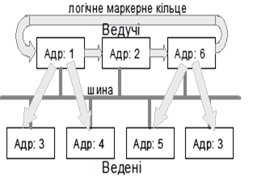 

Рис.7.2. Метод доступу в мережах Profibus

## 2. Реалізація фізичного рівня PROFIBUS DP

PROFIBUS DP на фізичному рівні базується на інтерфейсі RS-485 або на різних типах оптоволоконних з’єднань з бітовою швидкістю до 12 МБіт/с. Дані передаються 11-бітними символами (1 старт, 8 даних, 1 паритет, 1 стоп) методом NRZ. Максимальна кількість вузлів на сегмент – 32, максимальна довжина лінії залежить від бітової швидкості:

- від 9600біт/с до 187500біт/с – до 1000 м;
- 500 кбіт/с – до 500 м;
- 1500 кбіт/с – до 200 м;
- 12 Мбіт/с – до 100 м.

Використовується шинна топологія (рис.7.3). З’єднання вузлів проводиться по 2-провідній схемі (сигнал А та В) без сигнальної землі. На кінцях кожного сегменту виставляються термінатори лінії опором 220 Ом.  

В стані покою, коли всі передавачі мовчать, на лінії обов’язково повинна бути логічна „1”. Тобто в мережі необхідно реалізовувати поляризацію лінії (захисне зміщення). Для цього на кінцях лінії, крім термінаторів лінії, до шини підключається живлення 5 В через PullUp та PullDown резистори номіналом 390 Ом. Захисне зміщення з обох кінців забезпечується як правило безпосередньо кінцевими вузлами. Використання зміщення з двох кінців більш надійне порівняно з централізованою схемою, як наприклад у Modbus RTU, оскільки при відключенні одного з кінцевих вузлів мережа залишається робочою.  

Підключення пристроїв до загальної шини проводиться способом daisy-chain, тобто без відгалужень. Ці вимоги пов’язані з ефектом відбиття хвиль на коротких ділянках відгалуження. На рис.7.4 видно, що кабель шини повинен „зайти” до кожного і „вийти” з кожного пристрою. На цьому ж рисунку показаний спосіб розділення загальної шини на сегменти, які об’єднуються за допомогою репітерів. Таким чином можна досягнути іншої топології і збільшити кількість пристроїв та загальну довжину мережі. Треба пам’ятати, що наявність репітерів треба враховувати при виборі швидкості передачі даних.

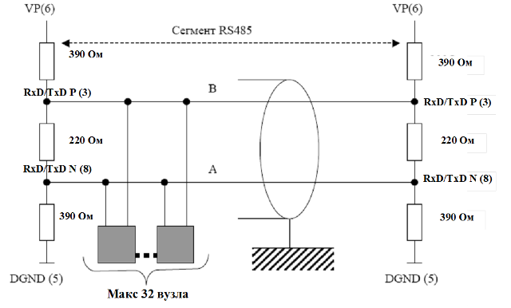

Рис.7.3. Структура шинного сегменту RS-485 

<a href="media7/7_4.png" target="_blank">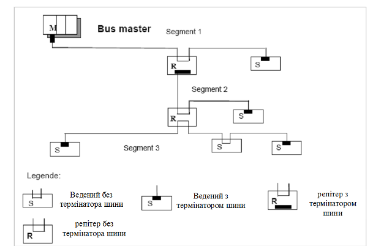</a> 

 Рис.7.4. Сегментація та підключення пристроїв до PROFIBUS шини 

Деякі пристрої необхідно підключати тільки в певні періоди часу, наприклад програматори. В цьому випадку дозволяється підключення до шини через активні відгалужувачі (наприклад шинні термінали, репітери, активні кабельні з’єднувачі).

 В якості з’єднувача в стандартах IEC 61158-2 і EN 50170-2 рекомендується використовувати 9-піновий SUB-D конектор, призначення контактів якого наведене на рис.7.5. Наявність наведених функцій для контактів 3,5,6 та 8 є обов’язковою. Стандарти дозволяють використовувати інший тип з’єднувачів, або клемну колодку з аналогічними контактами. 

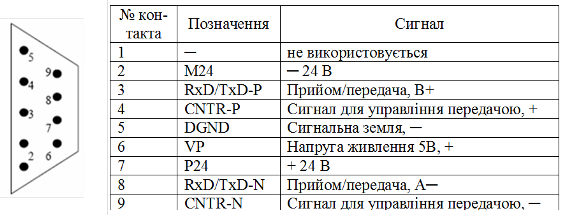

Рис. 7.5 Призначення контактів 9-пінового SUB-D конектора

Стандарт IEC 61158-2 визначає два типи кабелів рекомендованих для підключення PROFIBUS шини: виті пари типу А та В. Характеристики цих кабелів і припустимі швидкості передачі даних для них, в залежності від довжини лінії зв’язку, наведені у табл. 7.1 і табл.7.2.

Для шинної топології на базі RS-485 інтерфейсу, для достатнього погашення відбиття сигналів рекомендують мінімізувати довжину відгалужень від магістральної шини. Загальна ємність всіх відгалужень на шині не повинна перевищувати: 0,05 nF для 3 Мбіт/с, 6 Мбіт/с та 12 Мбіт/с; 0,2 nF для 1,5 Мбіт/с; 0,6 nF для 500 кбіт/с; 1,5 nF для 187,5 кбіт/с; 3,0 nF для 93,75 кбіт/с; 15 nF для 9,6 та 19,2 кбіт/с.

Таблиця 7.1 Характеристики кабелів

| Параметр кабелю                       | Тип А                                       | Тип В                                      |
| ------------------------------------- | ------------------------------------------- | ------------------------------------------ |
| Характеристичний імпеданс             | 135-165 Ом   (при частотах від 3 до 20 МГц) | 100-130 Ом   (при частотах більше 100 кГц) |
| Ємність                               | <30 пФ.м                                    | <60 пФ.м                                   |
| Погонний опір                         | <110 Ом/км                                  | не визначено                               |
| Переріз проводу                       | >= 0.34 мм2                                 | >= 0.22 мм2                                |
| Колір ізоляції для не IS застосування | фіолетовий                                  | не визначено                               |
| Колір ізоляції для IS застосування    | синій                                       | не визначено                               |
| Колір проводу A (RxD/TxD-N)           | зелений                                     | не визначено                               |
| Колір проводу B (RxD/TxD-P)           | червоний                                    | не визначено                               |

Таблиця 7.2  Залежність швидкості передачі даних від довжини лінії зв’язку

| Бітова швидкість (кбіт/с)         | 9.6  | 19.2 | 93.75 | 187.5 | 500  | 1500 | 3000         | 6000         | 12000        |
| --------------------------------- | ---- | ---- | ----- | ----- | ---- | ---- | ------------ | ------------ | ------------ |
| Макс. довжина кабелю   типу А (м) | 1200 | 1200 | 1200  | 1000  | 400  | 200  | 100          | 100          | 100          |
| Макс. довжина кабелю типу В (м)   | 1200 | 1200 | 1200  | 600   | 200  | 70   | не допустима | не допустима | не допустима |

Таким чином, для бітової швидкості порядку 1500 Кбіт/с сумарна довжина всіх відгалужень на кабелі типу А не повинна перевищувати 6,6 м, а для швидкості 3/6/12 Мбіт/с – 1,6 м. При високих швидкостях (3-12 Мбіт/с) необхідно включити додатковий імпеданс на лінії зв’язку відгалужувачів або в шинні з’єднувачі. Стандарт рекомендує використати для цього додаткові індуктивності (рис.7.6) 

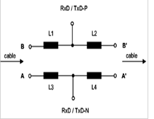

Рис.7.6. Використання індуктивностей  в якості додаткових імпедансів 

Для кабелю типу А, індук-тивності L1-L4 мають мати значення від 110±22 нГн. Значення індуктив-ностей розраховуються відповідно до імпедансу між B та B’, А та А’, ємнісних характеристик з’єднувача, трансиверу та інших деталей. Тобто при відключенні пристрою від шини (з’єднувача від пристрою), в даній точці може відбутись відбиття сигналу, що спотворює корисний сигнал на загальній шині. На рис. 7.7 показана конструкція мережного з’єднувача, при підключенні по типу daisy-chain. 

Слід зазначити, що у випадку використання кабеля типу В, термінатор лінії повинен мати опір 150 Ом замість 220 Ом (для кабеля типу А).  

У випадку прокладки лінії передачі у місцях з потужними електромагнітними завадами, необхідно використати екранований кабель та правильно виконати заземлення екрану. Екран кабелю повинен бути з’єднаний з корпусом штекера (рис.7.7).  

<a href="media7/7_7.png" target="_blank">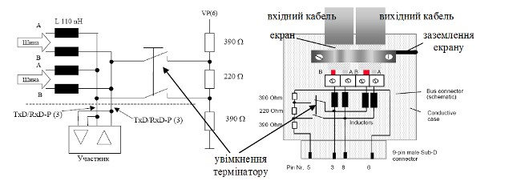</a> 

Рис.7.7. Схема мережного з’єднувача для мереж з бітовою швидкостю >1500 біт/с  

Згідно стандартів PROFIBUS заземлення екрану необхідно проводити в усіх точках підключення кабелю через відповідне виконання роз’ємів (рис.7.8) або по загальним правилам заземлення кабелів з високочастотним сигналом (див. розділ 3).   

Приклад 7.1. PROFIBUS. Побудова схеми мережних з’єднань для PROFIBUS DP на базі RS-485. 

Завдання. Підібрати необхідні технічні засоби та розробити схему мережних з’єднань для PROFIBUS DP відповідно до наведеної структури рис.7.8.

 

Рис.7.8. Структурна схема системи до прикладу 7.

Рішення. PLC1 – Speed7 має вбудований PROFIBUS DP інтерфейс, який можна використати в якості Ведучого. PLC2 вибираємо з таким розрахунком, щоб в процесорному модулі теж був інтегрований інтерфейс ROFIBUS-DP (VIPA 215-2BP02), що значно дешевше ніж купувати окремий модуль. Модулі розподіленого вводу виводу RIO1 повинні бути PROFIBUS DP Веденими (VIPA 153-4PH00). Для підключення до мережі частотного перетворювача Lenze необхідний відповідний комунікаційний модуль E82ZAFPC001. Таким чином схема мережних з’єднань буде мати вигляд показаний на рис.7.9. Специфікація мережних засобів та вузлів дана в таблиці 7.3. На рис. 7.10 приводиться схема підключень кабелів КМ1-КМ3 до мережних з’єднувачів КК1-КК3. 

<a href="media7/7_9.png" target="_blank">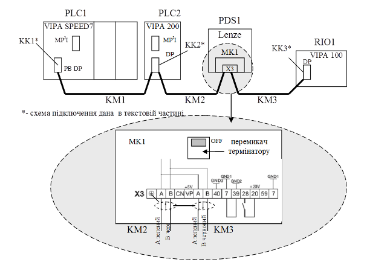</a> 

 Рис.7.9. Схема мережних з’єднань до прикладу 7.1.

 

Рис.7.10. Схема підключення кабелів до мережних з’єднувачів (до прикладу 7.1).

Таблиця 7.3. Специфікація мережних засобів та вузлів

| №    | Позна-чення | Назва                                                        | Тип            | Кіль-кість | Фірма |
| ---- | ----------- | ------------------------------------------------------------ | -------------- | ---------- | ----- |
| 1    | PLC1        | ПЛК VIPA Speed7                                              | VIPA 314-6CF02 | 1 шт.      | VIPA  |
| 2    | PLC2        | ПЛК VIPA 200                                                 | VIPA 215-2BP02 | 1 шт.      | VIPA  |
| 3    | RIO1        | Модуль  віддаленого вводу/виводу VIPA 100                    | VIPA 153-4PH00 | 1 шт.      | VIPA  |
| 4    | PDS1        | Частотний перетворювач Lenze 8200 Vector для управління асинхронним  двигуном 0,37 кВт | E82EV371K2C    | 1 шт.      | LENZE |
| 5    | MK1         | комунікаційний модуль для роботи в мережі PROFIBUS DP частотних перетворювачів Lenze 8200, з вбудованим  термінатором | E82ZAFPC001    | 1 шт.      | LENZE |
| 6    | KK1-KK3     | мережний з’єднувач Easy Conn PB 90° для мережі  PROFIBUS DP з вбудованим термінатором | VIPA 972-0DP10 | 3 шт.      | VIPA  |
| 7    | KM1         | Кабель екранована вита пара для PROFIBUS DP (тип „Стандарт”) | VIPA 830-0LE00 | 30 м       | VIPA  |
| 8    | KM2         | Кабель екранована вита пара для PROFIBUS DP (тип „Стандарт”) | VIPA 830-0LE00 | 40 м       | VIPA  |
| 9    | KM3         | Кабель екранована вита пара для PROFIBUS DP (тип „Стандарт”) | VIPA 830-0LE00 | 15 м       | VIPA  |

## 3. Реалізація фізичного рівня PROFIBUS PA (MBP)

PROFIBUS PA на фізичному та канальному рівні базується на технології передачі MBP\ (Manchester Coding (M) and Bus Powered(BP)), яка застосовується в функціонально небезпечних областях автоматизації, що дозволяє використовувати цю шину в потенційно вибухонебезпечних процесах. Як видно по самій назві, для передачі використовується манчестерське кодування з можливістю живлення пристроїв по одній 2-х провідній шині. В стандарті IEC 61158-2 PROFIBUS PA визначена як Тип 3 в синхронному режимі з бітовою швидкістю 31,25 Кбіт/с.

Безпечна технологія передачі MBP як правило обмежується певними сегментами заводу (польові пристрої в небезпечних Ex-зонах), які з’єднуються з сегментами RS-485 (безпечна зона, система управління та інженерні пристрої в пункті управління) за допомогою сегментних відгалужувачів (segment coupler) та сегментних з’єднувачів (segment link). З’єднання сегментів PROFIBUS DP та PROFIBUS PA показані на рис.7.11. 

Сегментні відгалужувачі\ (segment coupler) – це перетворювачі сигналів, які модулюють сигнал з RS-485 в MBP та навпаки. Пристрої на шині PROFIBUS PA прозорі з точки зору загальної шини, тобто Ведучі обмінюються з ними як з окремими Веденими. Швидкість на сегменті PROFIBUS DP в цьому випадку повинна бути 45.45 Кбіт/с. 

Сегментні з’єднувачі\ (segment link) – це інтелектуальні пристрої, які являються Ведучими пристроями на сегменті PROFIBUS PA і обмінюються даними з Веденими сегменту. З боку PROFIBUS DP сегментні з’єднувачі являються Веденим, який має одну адресу, а вузли на PROFIBUS PA видимі як модулі вводу/виводу. При використанні сегментних з’єднувачів обмеження на швидкість з боку PROFIBUS DP відсутня.

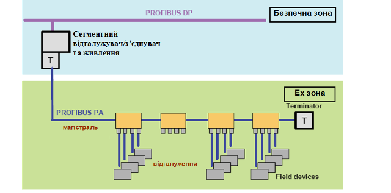

Рис.7.11 З’єднання сегментів PROFIBUS DP та PROFIBUS PA

PROFIBUS PA підтримує шинну та деревовидну топологію. В якості магістральних кабелів та відгалужень рекомендується використовувати кабелі типу А, В, C та D(див. таб.7.4).

Таблиця 7.4. Характеристика кабелів

|                                                              | Тип А (основний)               | Тип В                                   | Тип С                            | Тип D                              |
| ------------------------------------------------------------ | ------------------------------ | --------------------------------------- | -------------------------------- | ---------------------------------- |
| Структура кабелю                                             | Витий, двожильний, екранований | Одна або декілька витих пар, екрановані | Декілька витих пар, неекрановані | Декілька невитих пар, неекрановані |
| Площа перерізу (номінальна)                                  | 0,8 мм2  (AWG18)               | 0,32 мм2  (AWG22)                       | 0,13 мм2  (AWG26)                | 1,26 мм2  (AWG16)                  |
| Погонний опір (пост. струм)                                  | 44 W/км                        | 112 W/км                                | 264 W/км                         | 40 W/км                            |
| Хвильовий опір при 31,25 кГц                                 | 100 W±20%                      | 100 W±30%                               |                                  |                                    |
| Затухання при 39 кГц                                         | 3 dB/km                        | 5 dB/km                                 | 8 dB/km                          | 8 dB/km                            |
| Ємнісна неузгодженість                                       | 2 nF/km                        | 2 nF/km                                 |                                  |                                    |
| Груповий час запізнювання  (7,9...39 кГц)                    | 1,7 ms/km                      |                                         |                                  |                                    |
| Ступінь екранування                                          | 90 %                           |                                         | -                                | -                                  |
| Рекомендована довжина мережі включно з  ¼-хвильові узгоджуючі шлейфи | 1900 m                         | 1200 m                                  | 400 m                            | 200 m                              |

 Максимальна кількість пристроїв у сегменті обмежена 32-ма вузлами. Загальна довжина лінії залежить від топології, довжини відгалужень, кабелю. Наприклад, при кабелі типу А – не більше 1900м. Довжина відгалужень не повинна перевищувати 30 м. Сегмент з обох кінців обмежений термінатором, один з яких вбудований у сегментний відгалужувач/з’єднувач, а інший підключається у кінці сегменту (рис.7.12).

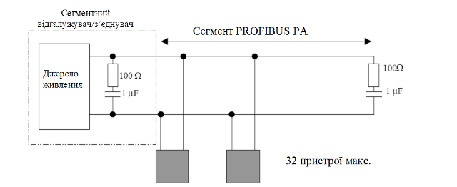

Рис.7.12. Принципова схема сегменту PROFIBUS PA

Фізичне підключення кабелів відгалуження проводиться з використанням спеціальних з’єднувачів, які мають високий рівень захисту по IP (рис.7.13). 

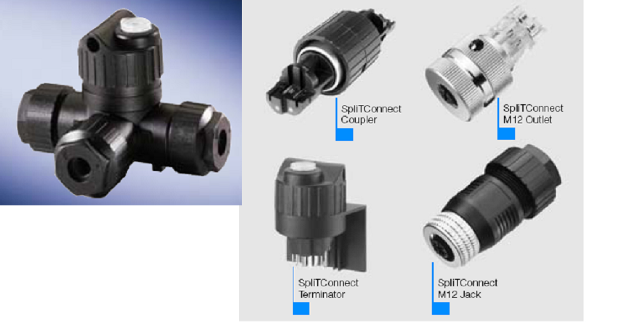

Рис.7.13. Відгалужувачі, з’єднувачі, термінатори SpliTConnect (Siemens) для PROFIBUS PA

В PROFIBUS PA для передачі даних використовується біт-синхронізований з манчестерським кодом протокол передачі (позначається також H1). Дані передаються за допомогою модуляції ±9мА несучого струму шини Іb (рис.7.14).

## 4. Реалізація канального рівня

В мережах PROFIBUS використовується гібридний метод доступу (див.рис.7.2). Кожний вузол (Ведучий або Ведений) має унікальну адресу від 0 до 126. Вузол може передати кадри одному вузлу (точка-точка), використовуючи його адресу, або всім вузлам (широкомовний режим) використовуючи широкомовну адресу=127.  

Кадри PROFIBUS DP передаються 11-бітними символами, а в PROFIBUS PA – побітово синхронним способом. Однак структура кадрів має однаковий формат для обох типів мережі. На канальному рівні відомі такі типи сервісів: SRD – дані відправляються і приймаються з підтвердженням; SDN – дані відправляються без підтвердження; SDA (тільки для FMS) – відправка даних з підтвердженням; CSRD (тільки для FMS) – циклічна посилка та прийом з підтвердженням. Ці сервіси використовують різні формати кадрів як з постійною так зі змінною довжиною (рис.7.15). 

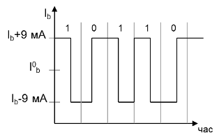

Рис.7.14. Передача даних в PROFIBUS PA за допомогою модуляції струму

Всі кадри, окрім кадру короткого підтвердження, починаються з стартового байту, який вказує на тип формату кадру. Далі вказується адреса отримувача/чів (0-247) та адреса відправника (0-246). Контрольний байт в кадрі уточнює призначення кадру. Контрольна сума вираховується логічним об’єднанням значення всіх байт по AND без переповнення. Закінчуються кадри кінцевим байтом (1616). 

За допомогою кадру-маркеру, активний вузол (Ведучий) передає маркер наступному Ведучому вузлу (рис.7.2). Отримавши маркер Ведучий обмінюється даними з Веденими, після чого передає маркер далі. Так відбувається до тих пір, поки маркер не надходить до активного вузла з найбільшою адресою (HSA− Highest Station Address). Цей вузол передає маркер активному вузлу з найменшою адресою, тим самим замикаючи маркерне кільце. 

<a href="media7/7_15.png" target="_blank">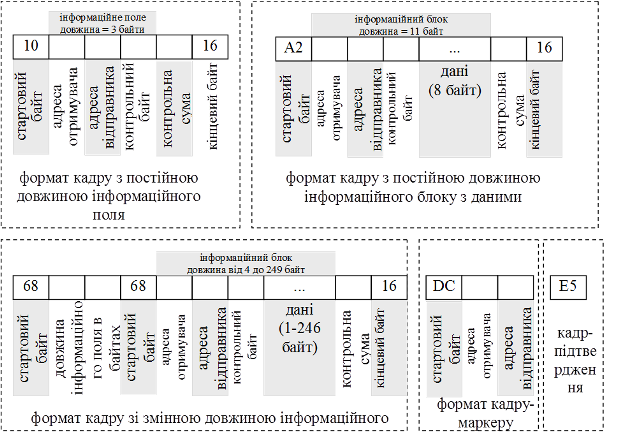</a> 

Рис.7.15. Формат кадрів для PROFIBUS

Управління доступом до шини активних вузлів відбувається як на фазі ініціалізації так і на фазі функціонування маркерного кільця. При цьому встановлюється адреса всіх активних вузлів, які присутні на шині і заносяться в список активних станцій LAS (List of Active Station). Для управління маркером при цьому, особливо важливі адреси попередньої станції – від якої маркер отримується, і наступної станції – якій маркер передається. Крім того LAS потрібен для виключення з кільця дефектних активних вузлів та включення в кільце вузлів, які знову з´явилися, без переривання функціонування мережі.

## 5. Базові функції обміну даними між вузлами в PROFIBUS DP (DP-V0)

В PROFIBUS DP доступні різні типи сервісів: цикліччний/ациклічний обмін даними процесу, ациклічний обмін параметричними даними, функції діагностування та управління вузлом. 

Для швидкого циклічного обміну даними процесу в PROFIBUS DP використовується постійне опитування центральним вузлом (контролером) розподіленої периферії. Цей механізм може бути описана клієнт-серверною моделлю ідентифікованого обміну (модель Polling), а в PROFIBUS DP він називається циклічним обміном (Cyclic Data Exchange), тому що обмін Ведучого з Веденими проходить по циклу. Функції циклічного обміну забезпечується сервісами Data_Exchange (див.7.5.2). Вони з’явилися першими і входять до складу базових функцій PROFIBUS DP. До базових функцій також відносяться всі інші функції перераховані вище, крім ациклічного обміну даними процесу, яка та ряд інших з’явилися в старших версіях протоколу PROFIBUS. На сьогоднішній день існує три версії PROFIBUS DP:

-     PROFIBUS DP-V0 з базовими функціями;

-     PROFIBUS DP-V1 та PROFIBUS DP-V2 з додатковими функціями.

Оскільки функції молодших версій реалізовані в протоколах старшої версії також, зберігається їх сумісність. В даному розділі розглянуті базові функції PROFIBUS DP, тобто функції PROFIBUS DP-V0, а в наступному – додаткові функції PROFIBUS DP-V1 та PROFIBUS DP-V2.

### 5.1. Функція циклічного обміну даними процесу

#### Циклічний обмін даними процесу

Циклічний обмін даними процесу продемонструємо на типовій конфігурації мережі PROFIBUS DP, тобто структурі з одним Ведучим (рис.7.16). 

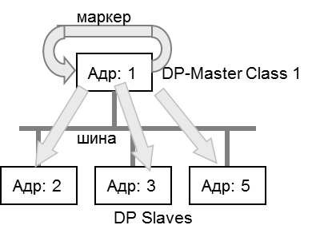

Рис.7.16. Структура з одним Ведучим.

Кожний Ведений може зайняти шину для передачі кадру тільки з дозволу Ведучого. Перелік адрес Ведених зберігається в списку опитування Ведучого(Polling-Liste). DP-циклом називається процес опитування Ведучим всіх своїх Ведених в період часу від отримання маркеру до передачі його наступному Ведучому. Структура DP-циклу складається з циклічної частини, в період якої Ведучий обмінюється з веденими даними процесу, та ациклічної, в період якої Ведучий може обмінюватися параметричними даними (див. 7.2.3). 

Обмін даними процесу між Ведучим і Веденим проходить без аналізу змісту цих даних з використанням сервісу SRD. Ведучий відправляє запит типу Data_Exchange в якому передає Веденому значення вихідних даних процесу і отримує від нього кадр-відповідь (підтвердження) з вхідними даними процесу (рис.7.17). Це ідентифікований тип обміну, тому кількість і призначення цих даних визначається в момент конфігурації мережі, завдяки чому забезпечується максимальна швидкодія. 

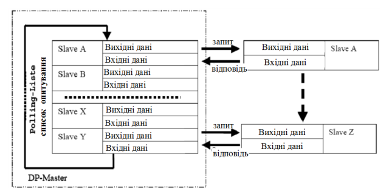

 Рис.7.17. Опитування Ведених по списку опитування 

При циклічному обміні даними процесу, Ведений реагує тільки на ті запити Data_Exchange, які приходять від Ведучого, який його конфігурував та параметризував (див 7.5.3).  

Повідомлення, які надсилає Ведучий мають "високий" пріоритет, а які видає Ведений – "низький". Однак Ведений може під час відповіді змінити клас пріоритету повідомлення на "високий", якщо необхідно повідомити про наявність діагностичної події. Після отримання такої відповіді, Ведучий додатково опитує веденого на предмет уточнення діагностичної інформації, повідомленням типу SlaveDiag. Процес обміну діагностичною інформацією проходить ациклічним способом, в період ациклічної частини ROFIBUS DP циклу. 

#### Команди SYNC та FREEZE 

Крім циклічного обміну даними процесу з Веденим, Ведучий може також відправляти команди в широкомовному режимі. Насамперед це команди SYNC та FREEZE, які дозволяють синхронізувати процес зчитування та запису даних.  

Так, при циклічному опитуванні, різниця в часі опитування впливає на "свіжість" оновлення вхідних даних процесу. Тобто при опитуванні Веденого 5, його дані будуть новіше ніж Веденого 2, оскільки за час, який пройшов від останнього опитування Веденого 2, той отримав нові вхідні дані. Якщо необхідно, щоб вхідні дані Ведених були з однаковою часовою міткою, необхідно спочатку їх заморозити, а потім зчитати. Таким чином на початку циклу Ведучий в широкомовному режимі відправляє команду "freeze", після якої Ведені заморожують плинне значення входів до наступної команди "freeze", а Ведучий зчитує ці значення. Якщо режим FREEZE необхідно відмінити, то Ведучий відправляє команду "unfreeze", після якої Ведені відновлюють вхідні дані процесу в довільний час.  

Подібним чином працює режим SYNC. Ведучий відправляє команду "sync", тим самим зберігаючи виходи Ведених в попередньому значенні. Потім кожному з Ведених він записує значення вихідних змінних, однак Ведені не оновлюють виходи новими значеннями, поки не прийде наступна команда "sync". Таким чином виходи Ведених одночасно оновлюються в момент отримання широкомовної синхронізуючої команди.   

### 5.2. Функції (сервіси)  базових типів вузлів

В ROFIBUS DP визначено два класи Ведучих, набір сервісів яких відрізняється: Ведучий класу 1 (DPM1) та Ведучий класу 2 (DPM2). 

DP Master Class 1 (DPM1) – це центральний контролер, який циклічно обмінюється даними користувача з Веденими. Типовим прикладом такого вузла є ПЛК. Йому доступні такі базові функції протоколу:

1. Data_Exchange – циклічний обмін даними процесу з призначеними йому Веденими; 

2. Set_Prm и Chk_Cfg – відправка параметричних (конфігураційних) даних Веденому в момент його конфігурації та перевірка цих даних; 

3. Slave_Diag – читання у Веденого діагностичної інформації; 

4. Global_Control – управління станом Ведених.

DP Master Class 2 (DPM2) – це Ведучі, призначені для конфігурування та діагностики мережі (програматори). Пристрої DPM2 не повинні постійно функціонувати в мережі. DPM1 Ведучим цього класу доступні всі описані вище функції та ряд додаткових:

-     RD_Inp и RD_Outp – читання входів та виходів з потрібного Веденого;

-     Get_Cfg – зчитування дійсних даних конфігурації Веденого;

-     Set_Slave_Add – призначення нової адреси Веденому.

Ведені, тобто DP-Slave, обмінюються даними тільки з Ведучим DPM1, який попередньо його сконфігурував або з Ведучим DPM2. 

Таким чином в ROFIBUS DP можливі три випадки з’єднання:

- між DPM1 (ініціатор обміну) та DP-Slave;

- між DPM2 (ініціатор обміну) та DP-Slave;

- між DPM1 та DPM2 (ініціатор обміну) .

Обмін між Ведучими одного класу не підтримується базовими функціями ROFIBUS DP. Однак можлива комбінація функцій в одному засобі: DPM1 та DPM2, чи DPM1 та DP-Slave.

### 5.3. Структура DP-циклу

На рис.7.16 та рис.7.17 показана структура циклічного обміну даними прикладного Процесу Ведучого зі своїми Веденими по шині. Крім циклічного обміну даними процесу (Data_Exchange), необхідне виділення часу для інших сервісів, які не потребують постійного використання ресурсів мережі, однак час від часу повинні функціонувати (обмін параметричними даними). Це такі функції як параметризація, конфігурування та діагностика Ведених. Для функціонування таких сервісів в DP-V0 в DP-циклі виділена ациклічна частина (рис.7.18). 

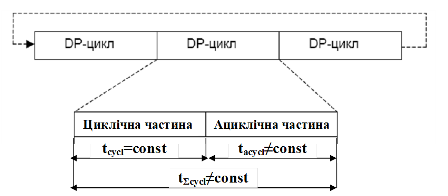

Рис.7.18 Структура циклу ROFIBUS DP в системі з одним Ведучим

В циклічній частині DP-циклу проходить процес циклічного обміну даними процесу (Data_Exchange), які розглянуті вище. До змінної по часу ациклічної частини відносяться такі функції:

-  обмін даними під час фази ініціалізації Веденого;

-  діагностичні функції для Веденого;

-  комунікації з Ведучим DPM2;

-  повторення спотворених кадрів;

В протоколі DP-V0 обмін даними процесу з Веденим в ациклічній частині не підтримується. Однак в циклічний частині, при передачі повідомлення-відповіді, Ведений може повідомити Ведучому про наявність діагностичного переривання (Diagnostic Interrupt) шляхом зміни пріоритету повідомлення на високий. Ведучий, отримавши таке повідомлення, в ациклічній частині дає повідомлення-запит типу SlaveDiag, на який Ведений передає відповідь з діагностичними даними.    

Ациклічні функції мають низький пріоритет і можуть виконуватись протягом декількох циклів. В залежності від кількості цих дій час виконання конкретного DP-циклу може змінюватись. 

В деяких системах необхідно, щоб час шинного циклу DP був постійним, тобто обмін даними процесу проходив строго періодично. Це, наприклад, актуально для систем управління електроприводами (PDS) для самосинхронізації декількох приводів. На відміну від нормального циклу DP, Ведучим передбачається (резервується) певна частина часу для ациклічного обміну (рис.7.19). Ведучий слідкує, щоб зарезервована змінна частина не перевищила виділений час, обмежуючи кількість ациклічних повідомлень в DP-циклі. З іншого боку, якщо зарезервований час не використовується, Ведучий витримує необхідну паузу. Завдяки цьому гарантується, що заданий постійний час буде витриманий з точністю до мікросекунди

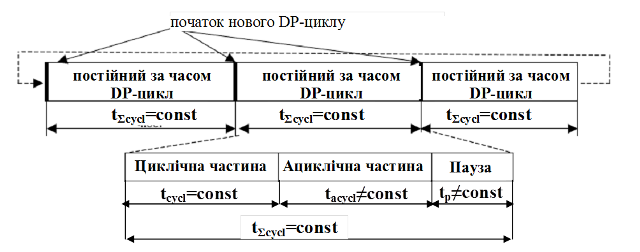

Рис.7.19. Структура постійного за часом циклу ROFIBUS DP в системі з одним Ведучим

### 5.4. Конфігурування та ініціалізація мережі

#### Ініціалізація Веденого

Слід ще раз зазначити, що циклічний обмін у PROFIBUS DP – це ідентифікований обмін. Тобто Ведучий віддає Веденому вихідні дані та забирає вхідні, а кількість та призначення цих даних визначається при ініціалізації Веденого. По суті, процес налаштування такого зв’язку – це домовленість між комунікаційними партнерами перед операційним функціонуванням циклічного обміну. Ця домовленість проходить з використанням службових сервісів управління мережею. Процес налаштування Веденого перед циклічним опитуванням називається ініціалізацією. Процес ініціалізації конкретного Веденого проходить в ациклічній частині DP-циклу. 

У PROFIBUS DP ініціалізує (конфігурує та параметризує) Веденого той Ведучий, з яким буде налаштований ідентифікований обмін. На рис.7.20 показані стадії процесу ініціалізації. Спочатку за допомогою діагностичних даних перевіряється готовність Веденого. Якщо  DP-Slave готовий для параметризації, Ведучий відсилає параметричні та конфігураційні дані. Саме ця інформація потрібна Веденому, щоб визначити якими саме даними процесу він буде обмінюватись з Ведучим в циклічному обміні. Позитивний результат перевірки готовності Веденого до роботи (діагностична інформація) завершує процес його ініціалізації. Коли Ведений проініціалізований, він переходить в операційний режим, тобто в режим циклічного обміну даними. 

#### Режими роботи мережі

Поведінка Ведених на шині PROFIBUS DP залежить від режиму функціонування Ведучого DPM1, який його ініціалізував. Ці режими стандартизовані і можуть приймати значення:

- Offline – відсутній зв’язок Ведучого з Веденим;
- Stop – циклічний обмін даними з Веденими відсутній;
- Clear – Ведучий зчитує вхідну інформацію з Ведених, однак виходи виставляє в аварійному значені (fail-safe state);
- Operate – нормальний операційний режим, в якому доступні операції циклічного обміну.

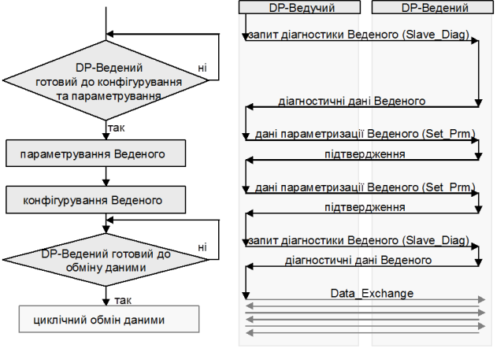

 Рис.7.20. Стадії ініціалізації Веденого

DPM1 циклічно відправляє стан режиму всім назначеним веденим через визначені інтервали в широкомовному режимі. Крім того контролюється працездатність кожного Веденого, для чого Ведучий DPM1 виділяє для них окремі діагностичні таймери (Data_Control_Timer). Якщо протягом дозволеного часу Ведений не зреагував на запити Ведучого, той сигналізує про це програмі користувача. Крім того, якщо конфігураційний параметр Auto_Clear виставлений у стан 1, система переходить в стан Clear, про що повідомляється всім Веденим.

Ведені в свою чергу використовують сторожовий таймер (WatchDog), який відслідковує активність звернення до нього Ведучого. Якщо таймер спрацював – вихідні дані, які оновлює даний Ведучий, виставляються в аварійне значення.

Слід зазначити, що в мультимастерній структурі тільки один Ведучий DPM1 може ініціалізувати конкретного Веденого а також обновити його виходи. Інші Ведучі можуть тільки зчитувати з цього Веденого вхідні дані.  

Прокоментуємо функції, які використовуються в процесі ініціалізації.

#### Дані параметризації (Set_Prm) 

За допомогою даних параметризації Веденому повідомляються необхідні локальні та глобальні параметри, властивості та функції. Зміст даних параметризації встановлюється при проектуванні Ведучого. 

Проектування Ведучого включає конфігурацію мережі та настройки Ведених. Враховуючи велику різноманітність типів засобів, які можуть функціонувати на PROFIBUS DP в якості Веденого, необхідний універсальний механізм переліку та опису параметрів для конкретного засобу. В PROFIBUS DP для цього використовуються  GSD-файли (Geräte Stamm Daten (нім.) – дані про походження приладу), які описані в 7.7.4. Підключивши до інструменту конфігурації мережі GSD-файл для конкретного засобу, можна добавити в конфігурацію цей засіб в якості Веденого та налаштувати для нього необхідні параметри. 

Таким чином, для кожного Веденого в пам’яті Ведучого знаходяться значення всіх параметрів, які необхідно змінити. Саме вони передаються на стадії параметризації. Зокрема це так параметри: 

-     Station-Status – специфічні настройки для поведінки Веденого;

-     Watchdog – контроль часу спрацювання; 

-     Ident-Number – ідентифікаційний номер типу засобу, який видається PNO; цей ID зберігається в GSD-файлі і при параметризації відправляється Веденому; Ведений приймає дані параметризації тільки якщо отриманий ідентифікаційний номер в запиті співпадає з його власним, завдяки чому запобігається помилкова параметризація. 

-     Group-Ident – груповий ідентифікатор, за допомогою якого Ведені можна об’єднувати в групи для групових операцій типу "Sync" та "Freeze".

-     User-Prm-Data – специфічні, характерні даному засобу дані для Веденого. 

#### Дані конфігурування (Chk_Cfg) 

За допомогою конфігураційного кадру Ведучий повідомляє Веденому формат розпізнавання, об’єм та структуру вхідних/вихідних даних процесу, які приймають участь в обміні. Ця область, яка називається також модулем, узгоджується по формі між Ведучим та Веденим (формат розпізнавання): буде це байтова структура чи структура зі слів. Через формат розпізнавання на модуль можна встановлювати вхідні/вихідні області розміром максимум в 16 байт/слів.

Області вхідних/вихідних даних процесу, які вміщують зв’язну інформацію і тому мають передаватися тільки разом (одним масивом), повинні оброблятися як консистентні дані. До них відносяться, наприклад, області параметрів для регуляторів чи набори параметрів для приводу. За допомогою спеціальних форматів розпізнавання (які залежать від Веденого та виробника) можна встановлювати консистентність для області входів та виходів (модулів) з максимальною довжиною 64 байти або слова. Формат області входів/виходів процесу для Веденого зберігаються в GSD-файлах і при проектуванні пропонуються відповідним інструментом проектування. 

#### Діагностичні дані (Slave_Diag) 

За допомогою запиту діагностичних даних Ведучий перевіряє на фазі запуску, чи присутній Ведений і чи готовий він для параметризації. Діагностичні дані від Веденого складаються із діагностичної частини і необов’язкової, специфічної для Веденого, діагностичної інформації. Через діагностичні дані Ведений повідомляє Ведучому свій робочий стан і у випадку діагностики – причину діагностичного переривання. 

Приклад 7.2. Розробка проекту для мережі PROFIBUS DP. 

Завдання. Сконфігурувати всі вузли мережі PROFIBUS DP для реалізації поставленої на рис.7.21 задачі, схема мережних з’єднань якої дана в прикладі 7.1. 

<a href="media7/7_21.png" target="_blank">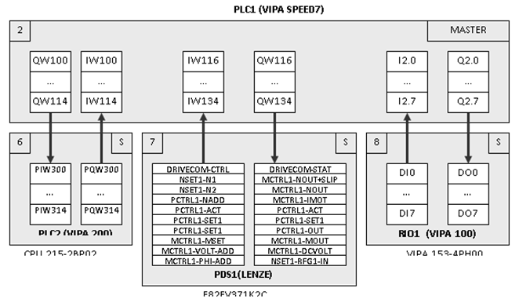</a> 

Рис.7.21. Постановка задачі до прикладу 7.2

Рішення. Для ясності поставленої задачі зробимо деякі пояснення. PLC1 (VIPA SPEED7) являється центральним вузлом мережі, який повинен обмінюватися даними процесу з частотним перетворювачем (PDS1) та віддаленим модулем вводу виводу (RIO1). Це значить, що він повинен бути активним вузлом, тобто Ведучим на шині PROFIBUS DP. Частотний перетворювач повинен обмінюватися даними з PLC1 статусною інформацію та значеннями різних плинних та заданих параметрів, призначення яких не принципово для рішення даної задачі. Дискретні входи та виходи модуля віддаленого вводу/виводу повинні відображатися в змінних PLC1. По суті, для програми користувача в PLC1 значення входів та параметрів на периферійних засобах – це лише вхідні/вихідні змінні, які у ПЛК VIPA та SIMENS позначаються як I (входи) Q (виходи).

Однак PLC1 повинен координувати роботу PLC2 (VIPA 200), обмінюючись в обох напрямках 8-мима 16-бітними змінними. Для цього PLC2 на цій шині виступає в якості Веденого вузла, оскільки інтерфейс DP, який інтегрований в CPU 215-2BP02, може використовуватись як в режимі Ведучого так і Веденого. Такий обмін можливий з використанням периферійних вхідних та вихідних змінних PLC2, які повинні бути виділені для цього. Слід зазначити, що з точки зору PLC2, змінні PIW (периферійні вхідні слова) являються входами, однак в адресному просторі Ведучого, тобто PLC1, вони будуть відображатися як виходи. Аналогічна ситуація і для PQW.

Для функціонування такої системи необхідно налаштувати та сконфігурувати кожний вузол. Прокоментуємо, яким чином необхідно налаштувати кожного з Ведених.

PLC2 – це інтелектуальний Ведений. Ведучий не ініціалізує його, оскільки для нього проект створюється за допомогою спеціальних інструментів. В даному випадку можна використати Step7. Для роботи в мережі відповідно до задачі необхідно налаштувати DP-канал, тобто:

-     вказати режим роботи = Slave;

-     вказати адресу = 6 (див рис.7.20);

-     вказати бітову швидкість = 12 Мбіт/с;

-     при необхідності налаштувати додаткові параметри.

Необхідно вказати діапазон периферійної пам’яті, виділеної для Ведучого: (input bytes 300-315, output bytes 300-315).

Частотний перетворювач PDS1 (LENZE) можна налаштувати за допомогою панелі або спеціального ПЗ. Необхідно вказати адресу (С1509=7), вказати джерелом завдання – функціональний модуль (С0005=200). Бітова швидкість визначається автоматично.

Модуль віддаленого вводу/виводу RIO1(VIPA 100) має перемикач адреси, яким необхідно виставити адресу 8. Всі інші настройки визначаються Ведучим в процесі ініціалізації.

Налаштування Ведучого шини PROFIBUS DP, тобто PLC1, проводиться в проекті для даного контролера. В якості інструмента проектування будемо використовувати Step7, який дасть можливість більш наглядно продемонструвати шляхи створення конфігурації мережі.

Конфігурацію мережі можна створити в розділі HWConfig (Hardware Configuration), де створюється апаратна конфігурація для ПЛК. Мережа конфігурується в настройках комунікаційного модуля, де вказуються:

-     режим роботи = Master;

-     адреса = 2 (див рис.7.20);

-     бітова швидкість = 12 Мбіт/с;

-     при необхідності додаткові параметри.

Після конфігурації самої мережі, необхідно вказати Ведені, які "належать" даному ПЛК (адже при мультимастерній архітектурі на мережі можуть бути Ведені для інших Ведучих). Для включення та на лаштування Ведених, відповідно до їх профілю, в Step7 необхідно підключити всі необхідні GSD-файли: 

- для VIPA CPU2xxDP;

- для VIPA DP100V;

- для модуля Lenze E82ZAFPC001. 

Після підключення цих файлів профілів, в каталозі профілів з’являться нові розділи та комунікаційні об’єкти. На рис.7.22 показані три частини каталогу, які відносяться до Ведених в даній задачі. Прокоментуємо можливі комунікаційні об’єкти, які доступні для обміну з цими пристроями. 

Для VIPA CPU2xxDP можна сконфігурувати обмін даними різної довжини (до 8 слів) з можливістю консистентної передачі. В поставленій задачі необхідно передавати і отримувати 8 слів. 

Для VIPA DP100V вибирається конкретна модель модуля, в нашому випадку це 153-4PH00 (DIO8), що передбачає обмін одним байтом в обидва боки. 

Об’єкти Lenze теж можна вибрати відповідно до задачі. При цьому виділяються два типи об’єктів: PZD (змінні процесу) та PAR (параметри). За допомогою об’єкту PAR, який займає 4 вхідні + 4 вихідні слова, можна доступитись по індексу до будь якого параметру частотного перетворювача як для читання так і для запису. Об’єкти PZD – передають значення змінних процесу та задані значення. Відповідно до поставленої задачі об’єкти PAR не використовуються, а використовуються 10 вхідних та вихідних об’єктів PZD. 

<a href="media7/7_22.png" target="_blank">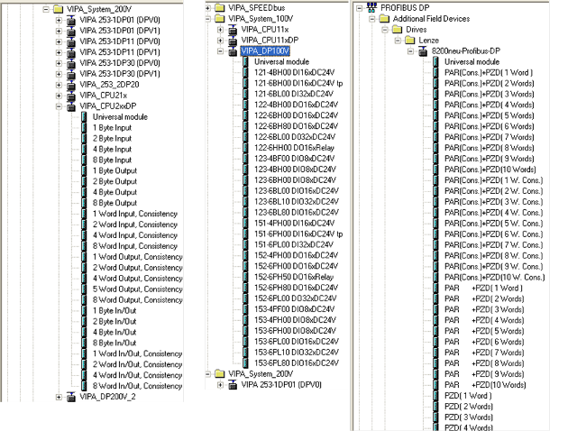</a> 

 Рис.7.22. Доступні об’єкти в каталозі профілів (до прикладу 7.2) 

Використовуючи каталог профілів вибирається профіль засобу, наприклад VIPA CPU2xxDP, для якого налаштовуються адреса та загальні параметри. Загальний вигляд конфігурації для поставленої задачі показаний на рис.7.23. 

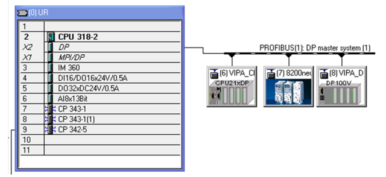

Рис.7.23. Конфігурація PROFIBUS DP в проекті Ведучого в Step7 (до прикладу 7.2) 

Для кожного Веденого необхідно вказати комунікаційні об’єкти, які вибираються в каталозі профілів. Автоматично для кожного з цих об’єктів в області вводу/виводу процесу Ведучого виділяється пам’ять (налаштовується їх відображення на образ процесу Ведучого). Розподіл пам’яті можна змінити відповідно до задачі рис.7.24. 

Якщо немає необхідності в додаткових настройках, процес конфігурування можна вважати завершеним.

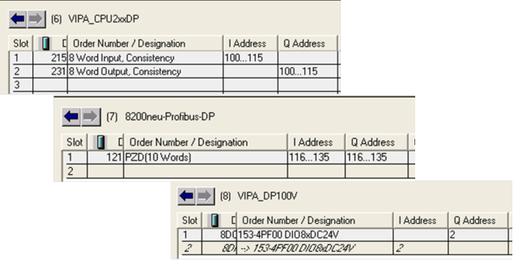

Рис.7.24. Налаштування комунікаційних об’єктів Ведених та їх відображення в адресному просторі Ведучого (до прикладу 7.2) 

## 6. Розширені функції обміну даними між вузлами в PROFIBUS DP (DP-V1, DP-V2)

### 6.1. Версії DP-V1 та DP-V2

З розвитком систем автоматизації та підвищенням вимог до комунікаційного зв’язку, PROFIBUS DP вдосконалювався та доповнювався новими функціями. Так з’явилися нові версії протоколів PROFIBUS DP-V1 та PROFIBUS DP-V2, що доповнилися розширеними функціями, які є необов’язковими для використання. На рис.7.25 показане добавлення нових функції при переході до нових версій. 

Основні функції DP-V0 перераховані в попередньому підрозділі. Структура GSD-файлів, які підтримувалися ще в базовій версії разом з доповненнями приводиться в наступному підрозділі. Ведучі та Ведені, які підтримують розширення називаються відповідно Master DP-V1/Master DP-V2 та Slave DP-V1/Slave DP-V2. 

Основною відмінністю DP-V1 від попередньої версії є поява функції ациклічного обміну даними процесу (Acyclic Data Exchange) паралельно з функціонуванням циклічного. Такий зв’язок характерний для генерування подій (Events), тривог (Alarm), обміну з ЛМІ, які не потребують постійного трафіку. Пізніше PROFIBUS  DP був вдосконалений до DP-V2, в основному за рахунок додаткових функцій для роботи з приводами (PDS): ізохронним способом обміну даними (Isochronous Mode) та широкомовним обміном даними між Процесами вузлів по типу Видавець/Підписувач (Data Exchange Broadcast-DXB). 

### 6.2. Ациклічний обмін даними процесу 

Для функціонування ациклічного (ациклічного) обміну даними процесу використовується механізм переривань (Interrupt), аналогічний функціонуванню діагностичного переривання, яке ми розглянули в попередньому підрозділі. Тобто при циклічному обміні даними процесу, Ведений передає повідомлення-відповідь з високим пріоритетом, яке вимагає від Ведучого додаткового обміну в ациклічному трафіку. А в ациклічній частині DP-циклу, Ведений вже передає ациклічні дані процесу.    

<a href="media7/7_25.png" target="_blank">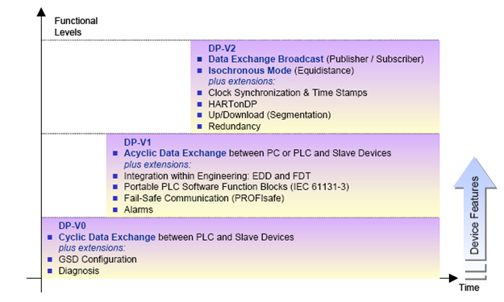</a> 

 Рис.7.25. Функціональність PROFIBUS DP від версії до версії

### 6.3. Широкомовний обмін даними процесу  

Data Exchange Broadcast забезпечує прямим зв’язком між Веденими по принципу pull моделі Видавець/Підписувач (рис.7.26). При запиті від Ведучого, прикладний процес Веденого в широкомовному режимі відправляє кадр з вхідними даними, на які можуть підписатись прикладні Процеси інших Ведених. Це розширення дає можливість значно зменшити навантаження на шину, оскільки в задачах де приходиться організовувати обмін між Веденими, в DP-V0/V1 цим займається Ведучий. 

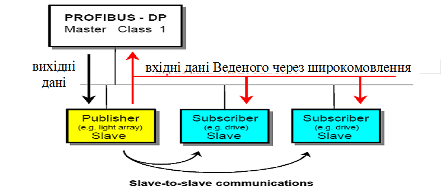

Рис.7.26 Широкомовний обмін даними процесу

### 6.4. Ізохронний режим

Режим Isochronous Mode дозволяє реалізувати часово-синхронну передачу даних незалежно від навантаження шини. Функція дозволяє реалізувати високоточні процеси позиціонування з часовим відхиленням менш ніж одна мікросекунда. Для цього всі цикли пристроїв синхронізовані до циклу Ведучого через широкомовне повідомлення "global control". Спеціальний сигнал (послідовний номер циклу) дозволяє контролювати цикли синхронізації. На рис.7.27 показані: доступний час для обміну даними процесу (DX), час доступу Ведучих DPM2 (MSG) та час паузи (Reserve). Синхронізація годинників вузлів дозволяє чітко визначити інтервали опитування входів, обробки процесу та запису виходів. Для зменшення часу реакції системи (оптимізації), можна вказати значення часових зсувів: опитування входів Ведених відносно кінця DP-циклу (Ті), запису виходів відносно початку DP-циклу(То), запуску задачі відносно початку DP-циклу (Тм).       

<a href="media7/7_27.png" target="_blank">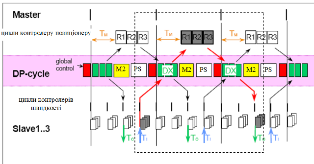</a> 

Рис.7.27 Обмін в ізохронному режимі

## 7. Профілі в PROFIBUS DP

### 7.1. Технічна структура PROFIBUS

На рис.7.1 показана структура PROFIBUS в контексті моделі OSI. Однак в специфікаціях PROFIBUS стандартів DIN та EN для  PROFIBUS DP прикладний рівень не описаний, а в IEC 61158 до цього рівня увійшли функції інтерфейсу DDLM та профілі. А у загальнодоступному документі від PNO наводиться наступна модель (технічна структура системи) PROFIBUS (рис.7.28). 

<a href="media7/7_28.png" target="_blank">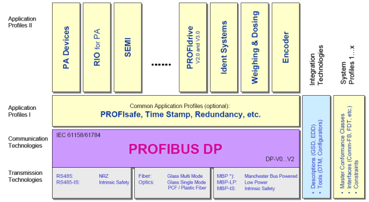</a> 

Рис.7.28. Технічна структура системи PROFIBUS

На фізичному рівні описані різні типи реалізації фізичних інтерфейсів, тобто різні технології передачі (Transmission Technologies), загальний опис яких наведений в таб.7.4. На рівні комунікаційних технологій (Communication Technologies), який також називається протокольним рівнем, визначені два типи протоколів FMS та DP (DP-V0, DP-V1, DP-V2). Прикладний рівень визначається системою прикладних профілів та технологій: Application Profiles I (загальні прикладні профілі); Application Profiles II (специфічні прикладні профілі для пристроїв); Integration Technologies – інтеграційні технології (методи та інструменти), які забезпечують опис та швидке впровадження різнорідних пристроїв в системі PROFIBUS; System Profiles – системні профілі, тобто діапазон стандартів (профілі Ведучих, інтерфейси), які забезпечують реалізацію однорідних, стандартизованих систем. 

Таблиця 7.4. Характеристики мереж PROFIBUS на фізичному рівні з різними варіантами реалізації.

<a href="media7/t7_4.png" target="_blank">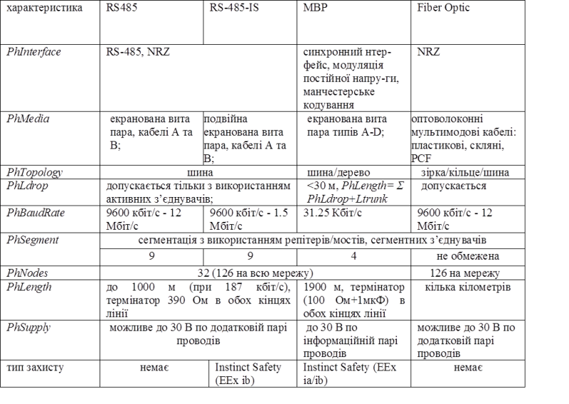</a> 

Профілі PROFIBUS – це специфікації, визначені виробником і користувачами відносно специфічних властивостей, особливостей виконання та поведінки пристроїв та систем. Специфікації профілю визначають параметри та поведінку пристроїв та систем, які належать сімейству профілю. Сімейства профілів розроблені для полегшення здатності до взаємодії з пристроєм, а в деяких випадках для полегшення взаємозаміни пристроїв одного сімейства на шині. У профілях враховуються особливості застосування і визначені типом спеціальні особливості польових пристроїв, управління і методів інтеграції (інжинірингу). Розрізняють:

-  general application profiles (загальні прикладні профілі, Application Profiles I) – це профілі які описують специфіку пристроїв для різних варіантів виконання; наприклад профілі PROFIsafe для систем функціональної безпеки, Redundancy – для систем з резервуванням);

-  specific application profiles (специфічні прикладні профілі, Application Profiles II) – це профілі, які розвинуті для пристроїв певного класу задач; наприклад PROFIdrive – для електроприводів PDS, PanelDevices – для засобів людино-машинних інтерфейсів;

-  system and master profiles (системні профілі) – це профілі, які описують функціональні можливості систем, доступних пристроям: DPM1, DPM2, DP Slave, DP-V0/V1/V2. 

### 7.2. Загальні прикладні профілі

 Загальні прикладні профілі (Application Profiles I) описують функції та характеристики, які стосуються області застосування. Вони можуть також використовуватися в поєднанні зі специфічними прикладними профілями. 

#### PROFIsafe 

До недавнього часу для функціонально-небезпечних процесів та виробництв використання промислових мереж було проблематичним. З появою профілю PROFIsafe, PROFIBUS створив всебічне, відкрите рішення для функціонально-безпечного (safety-base) застосування, яке задовольняє найбільш безпечним критеріям. PROFIsafe визначає яким чином запобіжні засоби (кнопка аварійної зупинки, лампи) можуть зв’язатися по PROFIBUS з запобіжними контролерами (контролери ПАЗ) настільки безпечно, щоб можна було їх використовувати для зв’язаних з функціональною безпекою задач до категорій KAT4, сумісною з EN954, AK6 або SIL3 (Safety Integrity Level). Це реалізовує безпечні з’єднання по профілю, тобто по спеціальному формату даних користувача та спеціального протоколу. Специфікація була сумісно складена виробниками, користувачами, комітетами стандартизації та інспектування (TÜV, BIA). Вона базується на сумісних стандартах, перш за все  IEC 61508, які в тому числі стосуються розробників програмного забезпечення (рис.7.29). 

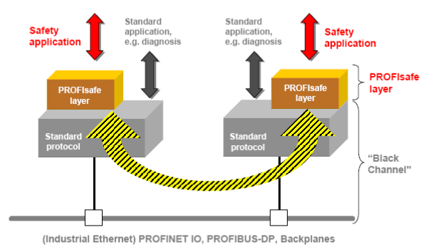

Рис.7.29. Реалізація PROFIsafe

PROFIsafe приймає до уваги кількість можливих помилок, які можуть відбутися в шинах, типу затримки, втрати або повторення даних, неправильних послідовностей, спотворення даних. Є декілька способів корекції, частина з яких були відібрані для PROFIsafe, а саме: послідовна нумерація телеграм;  таймаут для вхідних кадрів-повідомлень та їх підтвердження; ідентифікатор між відправником та отримувачем ("пароль"); додатковий захист даних (CRC).

Комбінуючи ці міри корекції разом з запатентованим "SIL monitor" (контроль частоти помилкових повідомлень) PROFIsafe досягає класів безпеки до SIL3 та вище. 

PROFIsafe – це програмне рішення, яке впроваджене в пристроях як додатковий рівень над прикладним рівнем, при цьому стандартні компоненти типу ліній зв’язку, ASICs або протоколи залишаються незмінними (див. рис.7.30). Пристрої з профілем PROFIsafe можуть використовуватись в сумісності з стандартними пристроями на тому самому кабелі без якихось обмежень. PROFIsafe використовує ациклічний обмін даними процесу і може використовуватись на технологіях передачі RS485, оптоволоконні або MBP. 

#### Time Stamp 

При реєстрації часових подій в мережах, особливо для діагностики і визначення помилки, корисно забезпечити точний час виникнення події. Для цього, PROFIBUS пропонує профіль Time Stamp (часовий відбиток). При виникненні повідомлення шляхом ациклічного обміну даними Ведучий зчитує не тільки саме повідомлення а і його часовий відбиток.

#### Slave Redundancy 

В багатьох випадках необхідна реалізація системи з дублюванням зв’язку. По цій причині для PROFIBUS створили специфікацію механізму дублювання ведених Slave Redundancy (резервування Веденого), який описує наступні характеристики пристрою (рис.7.31):

-     ведені пристрої повинні мати два різні інтерфейси PROFIBUS, які називаються первинним (primary) та резервним (backup); вони можуть бути на одному пристрої (резервування шляхів), або розподілені між декількома пристроями (резервування пристроїв);

-     пристрої обладнані двома незалежними стеками протоколів з спеціальним розширенням для резервування;

-     резервний зв’язок redundancy communication (RedCom) відбувається між стеками протоколів, тобто в межах пристрою (при резервуванні шляхів) або між двома пристроями (при резервуванні пристроїв). 

У нормальному режимі, з’єднання відбувається виключно з первинним Веденим, і тільки він  конфігурується. По резервному зв’язку Ведучий відсилає діагностичні дані та дані процесу резервному Веденому. Коли первинний Ведений виходить з ладу, резервний Ведений приймає на себе його функції, або в результаті безпосереднього виявлення відмови, або по просьбі Ведучого. Резервний Ведений пристрій може використовуватись на одній PROFIBUS лінії, або, у випадку додаткового резервування лінії, – на двох лініях зв’язку. 

 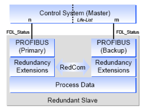

Рис.7.31. Резервування Ведених

### 7.3. Специфічні прикладні профілі

PROFIBUS виділяється серед інших промислових мереж великою гамою підтримуваних пристроїв для різних прикладних задач. Для цього розроблено ряд специфічних прикладних профілів (Application Profiles II) для конкретних типів пристроїв, які наведені в таб.7.5. 

Таблиця 7.5. Специфічних прикладних профілів

| Профіль                   | Застосування профілю                                         |
| ------------------------- | ------------------------------------------------------------ |
| PROFIdrive                | визначає поведінку пристроїв та процедури доступу до даних для електроприводів (PDS) |
| PA devices                | визначає характеристики PA пристроїв                         |
| Robots/NC                 | описує яким чином управляються роботи, які призначені для обробки та збирання |
| Panel devices             | описує інтерфейс для простих засобів людино-машинного інтерфейсу до високорівневих компонентів автоматизації |
| Encoders                  | описує інтерфейс до поворотних, кутових та лінійних енкодерів |
| Fluid power               | описує яким чином управляються гідравлічні приводи           |
| SEMI                      | описує характеристики пристроїв для виробництва напівпровідників по стандарту SEMI |
| Low-voltage switchgear    | описує обмін даними для різних пристроїв вимикання/перемикання (вимикачі,магнітні пускачі) |
| Dosign/weighing           | описує використання систем зважування та дозування           |
| Ident systems             | описує комунікації між пристроями ідентифікації (сканери штрих кодів, транспондери) |
| Liquid pumps              | визначає використання рідинних насосів                       |
| Remote I/O for PA devices | для пристроїв вводу/виводу для PROFIBUS РА                   |

Використання прикладних профілів дає можливість спростити процедуру розробки системи з однотипних пристроїв від різних виробників, оскільки їх поведінка та структура даних визначаються однаковими специфікаціями профілю. Крім того, така уніфікація зменшує кількість помилок, оскільки профілі розробляються з урахуванням багатолітнього досвіду експлуатації подібних пристроїв. В даному посібнику не приводиться опис наведених вище профілів, за винятком PROFIdrive, який наведений в розділі 11.  

### 7.4. Використання GSD для інтеграції пристроїв в мережу

Сучасні польові засоби забезпечують широкий діапазон інформації та виконуваних функцій, які перед цим виконувались в контролерах та в системах управління. Для виконання цих задач необхідні інструменти для вводу в дію, обслуговування, розробки та параметризації цих пристроїв, які потребують точного та повного опису даних для пристрою та його функцій, таких як: тип прикладної функції; конфігураційні параметри; діапазон значень; одиниці вимірювання; значення по замовченню; значення граничних меж; ідентифікація і таке інше.

Те ж саме стосується контролера/системи управління, специфічні параметри яких та формат даних повинні також бути повідомлені (інтегровані) для гарантії безпомилкового обміну даними з польовими пристроями. 

В PROFIBUS розвилося багато методів та інструментів ("інтеграційних технологій") для опису пристроїв. В автоматизованих системах управління процесом переважно використовується технологією GSD-опису, в якому описуються особливості зв’язку між пристроями PROFIBUS. GSD зручний для простих застосувань і розробляється та поставляється виробником обладнання. GSD-опис оформлений у вигляді текстового GSD-файлу формату ASCII, який вмішує основну та специфічну інформацію для зв’язку з конкретним типом пристрою. Для конфігурації цього пристрою за допомогою ключових слів інструмент конфігурації зчитує з GSD ідентифікатор пристрою, настроювальні параметри, відповідний тип даних та межі їх значень і т.д. Деякі із ключових слів обов’язкові, наприклад Vendor_Name, і інші є опціональними, наприклад Sync_Mode_supported. GSD-файли поділені на три секції. 

1) General Specifications. Ця секція включає інформацію про виробника та назву пристрою, апаратну та програмну версію, підтримувані швидкості, часові інтервали для контролю та призначення сигналів на з’єднувачах.  

2) Master Specifications. Ця секція включає параметри Ведучого, такі як максимальна кількість можливих Ведених, завантажувані/вивантажувані опції. Для пристроїв, які можуть бути тільки Веденими – ця секція відсутня.

3) Slave Specifications. Секція включає всю інформацію, специфічну для даного пристрою, як Веденого. Це може бути кількість та тип вхідних/вихідних каналів, специфікація тексту діагностичного повідомлення та інформація про доступні модулі, у випадку модульного пристрою. 

GSD-формат розроблений для максимальної зручності у використанні (наявні списки, опції і т.д.) та підтримує інтеграцією растрових малюнків для символічного зображення пристроїв.  

Кожний Ведений та Ведучий DPM1 повинні мати ідентифікатор виробника (Manufacturer ID). Це потрібно для того, щоб Ведучий міг ідентифікувати тип підключених Ведених без додаткових протокольних затрат. Ведучий порівнює ідентифікатор підключеного Веденого, з вказаним ідентифікатором в даних конфігурації. Тільки при їх рівності почнеться обмін даними в операційному режимі. Це гарантує помилку від невірної конфігурації.

Спеціальні ідентифікатори зарезервовані для профілів пристроїв (Profile ID):

- 9700h - 977Fh – РА пристрої;

- 3A00h - 3AFFh – пристрої профілю PROFIdrive.   

## Контрольні запитання до розділу 7

1. Перерахуйте мережі PROFIBUS, які використовуються на сьогоднішній день? Яке призначення кожної з них? Охарактеризуйте їх в контексті моделі OSI.

2. На якому інтерфейсі, яке середовище передачі, яка бітова швидкість, топологія та який метод кодування використовується для електричного з’єднання для PROFIBUS DP?

3. Як забезпечується термінування, захисне зміщення, сегментація в PROFIBUS DP, побудованого на базі RS-485?

4. Які правила підключення вузлів до загальної шини PROFIBUS DP, побудованого на базі RS-485?

5. Який тип з’єднувача рекомендується використовувати для PROFIBUS DP, побудованого на базі RS-485? Прокоментуйте призначення кожного піну.

6. Які типи кабелів використовуються для PROFIBUS DP, побудованого на базі RS-485? Які вимоги до бітової швидкості, загальної довжини лінії зв’язку та довжини відгалужень при використанні різних кабелів?

7. Які додаткові засоби необхідно використати при підключенні пристроїв до шини, на  бітових швидкостях вище 3Мбіт/с? Поясніть конструкцію з’єднувача, який використовується при таких швидкостях.

8. Як правильно виконується заземлення екранів кабелів?

9. На якій технології передачі на фізичному рівні базується мережа PROFIBUS PA? Розкажіть про принципи її функціонування.

10. Яке призначення в сегментних відгалужувачах та сегментних з’єднувачах? Чим вони відрізняються?

11. Яка топологія, бітова швидкість та кабелі використовуються в PROFIBUS PA? Прокоментуйте принципову схему сегменту PROFIBUS PA.

12. Який метод доступу використовується в мережах PROFIBUS? Як адресуються вузли в мережі?

13. Які способи обміну використовуються в PROFIBUS DP? Які функції відносяться до базових PROFIBUS DP-V0?

14. Що таке циклічний обмін даними процесу? Які він функціонує? 

15. Розкажіть про призначення та принципи функціонування команд SYNC/FREEZE?

16. Які Ви знаєте класи Ведучих вузлів PROFIBUS DP-V0? Які функції цим вузлам доступні?

17. З яких складових складається цикл ROFIBUS DP в системі з одним Ведучим? Які функції виконуються в ациклічній частині? Навіщо потрібні DP-цикли з постійним часом, та з яких складових вони складаються?

18. Як функціонують діагностичні переривання Веденого в контексті функціонування DP-циклу?

19. Розкажіть про процедуру ініціалізації Ведучим свого Веденого.

20. Що таке консистентність даних процесу в PROFIBUS DP? Навіщо її визначати? Які обмеження на об’єм консистентних даних?

21. Які розширені функції обміну доступні в PROFIBUS DP-V1 та DP-V2? 

22. Як функціонують сервіси ациклічного обміну даними процесу? 

23. Як функціонують сервіси широкомовного обміну даними процесу?

24. Як функціонують сервіси ізохронного режиму обміну?

25. Прокоментуйте технічну структуру системи PROFIBUS. Що таке загальні прикладні профілі, специфічні прикладні профілі та системні профілі і як вони пов’язані?

26. Охарактеризуйте мережі PROFIBUS на фізичному рівні з різними варіантами реалізації.

27. Яке призначення і принципи функціонування профілю PROFIsafe?

28. Як функціонують системи на базі профілю  Slave Redundancy?

29. Наведіть приклади специфічних профілів PROFIBUS.

30. Розкажіть про призначення та принципи побудови GSD-файлу. 

## Відезаписи

- [Відезапис лекції Profibus огляд ](https://youtu.be/_QrB22gCy1U?si=TTXpOtPRZ3eesHIp)
- [Відезапис лекції Profibus фізичний рівень](https://youtu.be/k-szp4Jdw_c?si=I5HqPw63E1rGnarT)
- [Відезапис лекції Profibus base](https://youtu.be/9lso90jJLJM?si=cyqxzEQ_mqTUohsD)

Теоретичне заняття розробив [Олександр Пупена](https://github.com/pupenasan). 
