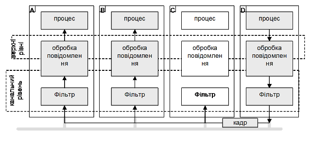

[<- До підрозділу](README.md)

# Основні робочі характеристики промислових мереж

## 1. Про робочі характеристики в контексті моделі взаємодії мережі

При ознайомленні з можливостями промислової мережі взагалі та конкретного вузла, звертають увагу на основні її робочі характеристики, по яким можна в цілому оцінити її функціональні можливості. Перед тим як ознайомитися з ними необхідно розглянути функціонування сучасних мереж через представлення їх у контексті ієрархічної моделі.   

У моделі представлення мережі ISO OSI (Open System Interconnection Reference Model) для спрощення структури більшість мереж організовуються у набори рівнів або шарів (**layers**), кожен з яких має своє призначення. Тобто все апаратне та програмне забезпечення, що приймає участь в мережному обміні виконує певні функції (сервіси) в послідовності обміну, і цю функцію відносять до певного рівня. Якщо стандартизувати інтерфейс цього сервісу, то можна забезпечити сумісність апаратного та програмного забезпечення від різних постачальників. Кількість рівнів, їх назва, та склад відрізняються в залежності від мережі. Однак у всіх мережах ціллю кожного рівня є представлення деяких сервісів для вищого рівня і підтримування зв’язку з однойменним рівнем на іншому пристрої. Правила і домовленості, які використовуються у даному спілкуванні називаються **протоколом рівня** (layer protocol). На кожному з рівнів обробка даних згідно протоколу включає в себе перетворення інформації з одного виду у інший, розбивку даних на частини та додавання службової інформації.

При розробці мереж на кожному з рівнів означують:

-  механізм ідентифікації відправників та отримувачів та систему адресації;

-  правила переносу даних: напрямок, логічні канали та пріоритети;

-  контроль помилок при передачі даних, тип і дії при їх виникненні;

-  правило розбивки даних та їх об’єднання;

-  керування потоком даних та узгодження швидкодії;

-  маршрутизація – вибір шляху передачі даних.

Апаратуру або/і програму, яка займається задачами кожного з рівнів будемо називати **об’єктом рівня** або **сутністю рівня**\. Виділяють такі об’єкти рівнів:

- прикладний об’єкт (прикладна сутність), 
- транспортний об’єкт (транспортна сутність), 
- мережний об’єкт (мережна сутність), 
- канальний об’єкт (канальна сутність) 
- та об’єкт фізичного рівня (сутність фізичного рівня або фізичний інтерфейс). 

Для забезпечення зв’язку сутність кожного рівня займається обміном даними з сутністю такого ж рівня на іншому вузлі. Однак цей зв’язок проходить не безпосередньо, а по наступній схемі (рис.2.2): дані, які необхідно передати надходять до самого верхнього рівня, який обробляє їх і передає нижчому рівню і т.д. аж до 1-го рівня, який займається безпосередньою передачею даних по фізичному середовищу. На іншому вузлі, дані, які приймаються обробляються кожним рівнем у протилежному напрямку. Обробка інформації на кожному рівні відбувається відповідно до протоколу. 

Рис. 2.2. Передача даних від одного вузла до іншого через мережу з багаторівневою архітектурою

Кожен із рівнів у мережі надає набір сервісів (служб) для реалізації певних задач. **Сервіс** або служба (**Service**) – це набір операцій, які нижній рівень представляє верхньому. Сервіс означує які саме операції рівень буде виконувати, але не оговорює яким чином.

Між кожною парою суміжних рівнів знаходиться **інтерфейс** (**interface**), який означує набір примітивних операцій, які надаються верхньому рівню від нижнього. Під інтерфейсом можна розуміти ті програмні чи апаратні функції, які надаються верхньому рівню для доступу до своїх сервісів. 

Набір рівнів і протоколів називається **архітектурою мережі**. Список протоколів, які використовуються системою (по одному протоколу на рівень) називається **стеком протоколів**\. 

Ієрархія моделі OSI включає 7 рівнів:

1) **Фізичний рівень (Physical Link Layer)**. Даний рівень описує механічні та електричні характеристики, а також визначає фізичне середовище для передачі даних. Тобто сутність фізичного рівня займається передачею та прийомом бітів по каналу зв’язку. Принциповими питаннями тут є: який тип сигналу (напруга, струм, світло і інші) і якої величини використовується для передачі логічної "1" та "0"; тривалість одного біту; напрямок передачі даних; коли розпочати і закінчити передачу; кількість і призначення фізичних каналів зв’язку, спосіб стикування (типи роз’ємів) і т.ін. Рекомендуємо ознайомитися з [цією темою](../phbasic/teor.md) для кращого розуміння призначення фізичного рівня. 

Фізичний рівень повинен забезпечити достовірну доставку бітів від передавача до приймача.

2) **Рівень передачі даних (Data Link Layer)** або **канальний рівень**. Його задача забезпечити можливість та надійність передачі даних на фізичному рівні. Всі дані, які передаються з верхнього (мережного) рівня, передаються у вигляді кадрів, розмір яких залежить від конкретної мережі. За допомогою спеціальних алгоритмів проводиться контроль за правильною передачею на фізичному рівні з подальшою реакцією на помилки. Окрім підтримки каналу зв’язку та контролю за помилками, у мережах з загальним доступом до сумісно використовуваного фізичного каналу, на цьому рівні регламентується алгоритми та процедури доступу. 

Канальний рівень повинен забезпечити достовірну доставку даних від одного вузла до іншого в одній і тій самій мережі. 

3) **Мережний рівень (Network Layer)**. Основна із задач – це означення маршруту пересилки пакетів від джерела до приймача. Мережа може бути  організована через об’єднання підмереж, між якими виникає необхідність в обміні даними. Оскільки підмережі можуть бути різнорідними по природі, задачею мережного рівня є забезпечення прозорості між ними. Окрім цих функцій на даний рівень накладаються також функції означення часових затримок пакетів у мережах, питання синхронізації, часу передачі і т.ін.

Мережний рівень повинен забезпечити достовірну доставку даних від одного вузла до іншого в різних мережах, об’єднаних в одну інтермережу. 

4) **Транспортний рівень (Transport Layer)**. Основна функція – прийняти дані від сеансового рівня (або прикладного, якщо сеансовий відсутній), при необхідності розбити їх на частини, передати їх мережному рівню і гарантувати прибуття їх в правильному порядку до місця призначення. Цей рівень забезпечує передачу даних безпосередньо між прикладними програмами.

Транспортний рівень повинен забезпечити достовірну доставку даних від однієї програми (прикладного Процесу) до іншої, які функціонують на одному вузлі або на різних вузлах в мережі. 

5) **Сеансовий рівень (session Layer)**. Дозволяє організовувати сеанси обміну між прикладними програми (встановлення та розрив з’єднання, тощо). 

6) **Рівень представлення (Presentation Layer)**. Служить для перетворення форматів даних із одного в інший.

7) **Прикладний рівень (Application Layer)**. Містить набір протоколів для доступу до даних прикладного Процесу. 

Прикладний рівень повинен забезпечити одній прикладній програмі доступ до об’єктів іншої прикладної програми через систему домовленостей. 

Більшість промислових мереж підтримують фізичний рівень, рівень передачі даних і прикладний рівень. Як виключення існують протоколи промислових мереж, що реалізують всі сім рівнів OSI-Моделі, наприклад LonWorks.

Функціонування мережі в контексті моделі OSI продемонструємо на прикладі. 

> На вузлі 1 (рис.2.3) функціонують три прикладні програми (надалі Процеси) під умовними позначками A, B, C, а на вузлі 2 – Процеси D, E, F. Покажемо, як йде передача даних від Процесу B до Процесу E, використовуючи мережу описану на 1, 2, 3, 4 та 7 рівні моделі OSI. П
>
> Процеси С та Е спілкуються за єдиними правилами обміну, які визначені протоколом 7-го рівня Частково цей протокол визначає семантику спілкування, тобто відповідність символьних позначень до функцій, які необхідно виконати, та дані, які необхідно передати з цими функціями. Таким чином між двома прикладними програмами ведеться обмін кодом та даними, по правилам протоколу даного рівня, які називають **APDU** (Application Protocol Data Unit – модуль даних протоколу прикладного рівня). Оскільки Процеси B і E повинні якось взаємодіяти між собою, то за передачу даних між цими Процесами відповідає транспортний рівень.

Рис. 2.3. Обробка даних при обміні даними через мережу

> Для транспортного рівня код і дані прикладного рівня – це дані, які треба передати від одного Процесу до іншого. Для цього необхідно використати правила адресації цих Процесів, щоб правильно доставити дані, тобто щоб їх отримав Процес E, а не скажімо Процес F. Ці правила визначаються протоколом транспортного, тобто 4-го рівня. Для того, щоб транспортний об’єкт на вузлі 2 міг ідентифікувати Процес, якому передають дані (у нашому випадку Е), транспортний об’єкт на вузлі 1 добавляє допоміжні дані до тих, які він отримав у прикладного рівня. Дані які добавляються на кожному рівні перед даними з вищого рівня називаються заголовком (header). Таким чином, для ідентифікації Процесу отримувача транспортний об’єкт відправника добавляє його адресу (Е) у заголовок H1 і передає управління мережному рівню. Заголовок разом із даними на транспортному рівні прийнято називати **TPDU** (Transport Protocol Data Unit – модуль даних транспортного протоколу). 
>
> Мережний рівень у свою чергу повинен забезпечити доставку модулів TPDU від вузла до вузла, які можуть знаходитись у різних за принципом функціонування підмережах. Для цього до TPDU добавляється заголовок з адресою приймача та відправника (у нашому випадку H2), який необхідний маршрутизаторам (router) для знаходження правильного шляху до визначеної підмережі. Окрім того, на даному рівні дані можуть бути розбиті на частини, для можливості їх передачі на нижніх рівнях (це саме може відбуватися на всіх рівнях). Ці частини разом із заголовками називаються пакетами\ (packet) або NPDU\ (Network Protocol Data Unit – модуль даних мережного протоколу). У нашому випадку модуль TPDU на мережному рівні ділиться на два пакети з заголовками H2, які передаються послідовно один за одним канальному рівню. 
>
> Пакети, які отримує канальний рівень, вставляються у кадри (frame). Кадри мають заголовок, у якому міститься інформація про адресу вузла отримувача та/або відправника в локальній мережі та/або допоміжні службові коди. Отримувач може бути у свою чергу тільки допоміжним пристроєм для забезпечення передачі даних в іншу підмережу, тому може і не бути кінцевим вузлом призначення. Але для канального рівня це не важливо, тому що функції маршрутизації належать мережному рівню. Окрім заголовка, у кінці до пакету може добавлятися кінцевик (terminator) з службовою інформацією, наприклад даними контролю за правильною передачею. Безпосередня передача кадру по бітам забезпечується обладнанням та ПЗ фізичного рівня.
>
> Отримання даних та їх обробка проходить по тій же схемі з точністю до навпаки. Засоби канального рівня на вузлі 2 відловлюють кадр, визначають по заголовку H3, що кадр призначений саме їм, по T3 перевіряють правильність отриманих даних, вилучають пакет і передають мережному рівню. Це саме вони роблять і з другим пакетом. Мережний рівень у свою чергу вилучає модулі TPDU з пакетів, об’єднує їх і передає транспортному рівню, який по заголовку H1 ідентифікує Процес E і передає йому дані.

Це спрощений і далеко неповний перелік дій з даними на кожному рівні, який дає представлення про послідовність і принцип обробки даних при передачі. 

Надалі в контексті такої моделі розглядаються такі робочі характеристики: 

-    прикладні сервіси, що використовуються, їх тип та модель функціонування;

-    використання профілів;

-    методи доступу до середовища передачі;

-    модель адресації доставки кадрів;

-    контроль доставки даних: використання сервісів на різних рівнях мережі – з підтвердженням/без підтвердження;

-    топологія мережі;

-    максимально можлива кількість вузлів;

-    максимальна бітова швидкість;

-    середовище передачі;

-    сумарна максимальна довжина ліній зв’язку;

-    використання стандартних інтерфейсів;

-    можливість сегментації;

-    можливість об’єднання в інтермережу;

-    транспортні сервіси.  

Розглянемо більш детально ці характеристики.

## 2. Прикладні сервіси, інтерфейс прикладного рівня

На прикладному рівні означуються правила і семантика обміну між прикладними Процесами або надалі просто Процесами (з великої літери) якими можуть бути програми, застосунки, тощо. Для того щоб один прикладний Процес зміг спілкуватися з іншим, необхідно означити „мову” спілкування і тип діалогу. Сервіси прикладного рівня повинні забезпечити необхідну функціональність мережі (див. таб.2.1). Можна виділити такі сервіси, які підтримуються прикладним рівнем:

1.   обмін даними процесу в реальному часі: 

2.   програмування/конфігурування вузла;

3.   діагностичні сервіси;

4.   управління станом вузла;

5.   функції резервування. 

Тобто прикладний рівень в мережних засобах може надавати кілька з наведених сервісів. 

### Інтерфейс прикладного рівня 

Для користування сервісами прикладного рівня користувачу надається інтерфейс прикладного рівня (рис.2.4). Інтерфейс прикладного рівня може представляти собою комунікаційні функції (наприклад `READ_VAR` для читання змінної), доступ до таблиці мережних об’єктів, які конфігуруються (мережні змінні, IO Scanner, словник об’єктів) тощо. Деякі промислові мережі надають можливість графічного конфігурування обміну даними на прикладному рівні, наприклад через мову функціональних блоків (FF, LONWorks). Ці програмні засоби надають графічний вигляд інтерфейсу прикладного рівня. 

Рис.2.4. Організація роботи прикладного рівня

У будь якому випадку інтерфейс прикладного рівня дає можливість прикладній програмі або користувачеві доступитися до сервісів прикладного рівня.  Прикладні Процеси, між якими необхідно встановити зв’язок, можуть знаходитись на різних вузлах або на тому самому вузлі, суть від цього не змінюється, адже обмін проходить саме між ними, а не двома вузлами. Задачею створення інформаційного каналу між прикладними Процесами займаються нижні рівні. 

Розглянемо яким чином реалізовуються дані сервіси в самому прикладному рівні.  

### Взаємодія між прикладними Процесами 

Для того, щоб прикладні Процеси на вузлах могли обмінюватися даними, необхідно налаштувати між ними зв’язок. В залежності від реалізації такого зв’язку можна виділити три моделі взаємодії між прикладними Процесами:

- модель **Клієнт-Сервер (Client-Server)**;

- модель **Видавець-Підписувач (Publisher-Subscriber)**;

- модель **Виробник-Споживач (Producer-Consumer)**;

Модель Клієнт-Сервер передбачає взаємодію тільки двох прикладних Процесів: Процесу-запитувача (**Клієнт**) та Процесу-відповідача (**Сервер**). Затребуваний сервіс реалізується через **запити (request)** які надсилає Клієнт на Сервер. Сервер, обробивши запит повертає **відповідь (response)**. Структура запиту і відповіді залежить від реалізації протоколу. У найпростішому варіанті це можуть бути просто дані для запису (в запиті) та для читання (у відповіді) без додаткової вказівки що це за дані. 

Модель Видавець-Підписувач (Publisher-Subscriber) забезпечує зв’язок між декількома прикладними Процесами, один з яких **Видавець** а інші **Підписувачі**. Процедура передачі даних називається **публікацією (publication)**. Цей тип обміну найбільш підходить для передачі даних у багатоадресному режимі, оскільки прикладних Процесів-підписувачів може бути декілька. Таким чином у певний момент часу дані надходять від прикладного Процесу-видавця всім Процесам-підписувачам. В залежності від того, який прикладний Процес генерує публікацію, виділяють два типи моделі Видавець-Підписувач (рис.2.5):

-    **pull model**, коли момент публікації визначає прикладний Процес одного із вузлів, який у необхідний момент відправляє запит на публікацію. У деяких системах це може бути спеціально виділений прикладний Процес, що називається **Pull Publishing Manager**;

-    **push model**, коли момент публікації визначає прикладний Процес-видавець, наприклад при зміні цих даних, або через певні проміжки часу.    

Прикладний Процес у системі для одних даних може бути Видавцем, а для інших – Підписувачем.

   

 Рис.2.5. Функціонування моделі видавець-підписувач: pull model – ліворуч, push model – праворуч. 1 – публікація, 2 – запит на публікацію. 

Модель Виробник-Споживач (Producer-Consumer) з точки зору користувача аналогічна моделі Видавець-Підписувач, за винятком того, що для  адресації отримувачів використовується фільтрація по ідентифікатору повідомлень типу **Виробник-Споживач-msg**. Як правило фільтрація повідомлень проходить вже на канальному рівні, однак для мереж на базі Ethernet, цей процес може проходити на більш високих рівнях. Прикладний Процес, який в широкомовному режимі видає (виробляє) дані в мережу називається **Виробником**, а який їх приймає – **Споживачем**. Всі інші характеристики аналогічні моделі Видавець-Підписувач, тому при розгляді функціонування мереж на прикладному рівні – ці моделі ототожнюються. 

Слід зазначити, що с стандарті МЕК 61158-1 виділені тільки дві моделі взаємодії між прикладними процесами Клієнт-Сервер та Видавець-Підписувач.  

### Ідентифікація даних 

Модель обміну між прикладними Процесами вказує на спосіб  передачі даних між ними, однак не означує спосіб ідентифікації цих даних. Додатково необхідно означити місцезнаходження та формат даних як в прикладному Процесі вузла-джерела так і вузла-отримувача. 

Можна виділити два способи ідентифікації даних: вказати необхідні дані для обміну на початку функціонування мережі або вказувати область та формат даних безпосередньо в момент обміну між прикладними Процесами. Перший спосіб будемо називати **ідентифікованим обміном (identified data)**, а другий **обміном повідомленнями (messaging)**.  

При ідентифікованому обміні, перед операційним функціонуванням мережі (перед фазою обміну даними між прикладними Процесами) означують область даних на джерелі та відповідну їй область даних на приймачі. Іншими словами, дані між прикладними Процесами пов’язують інформаційними зв’язками. Означену область даних в ідентифікованому обміні будемо називати **ідентифікованими даними**. Таким чином при встановленні зв’язку між прикладними Процесами, дані які будуть надходити, будуть розміщуватись в наперед сконфігурованих комірках пам’яті, з наперед визначеним форматом. Для користувача це може виглядати наступним чином: він означує мережні змінні на двох ПЛК, яким дає однаковий ідентифікатор мережного обміну; коли програма заливається в обидва ПЛК, обмін відбувається неявно, з напередвизначеними налаштуваннями.     

Для мереж рівня датчиків призначення даних для конкретного пристрою означуються типом самого пристрою та його специфічними особливостями. Як правило в таких системах для кожного типу пристроїв створюють свій набір параметрів, де і визначається його поведінка та наповнення даних. Такий набір об’єднують у **Прикладний Профіль** пристрою. Профілювання пристроїв дає можливість легко інтегрувати однотипні пристрої різних виробників, що дає додаткові зручності при конфігуруванні мережі. Для користувача це виглядає як добавлення в конфігурацію мережі з каталогу конкретного пристрою. Після запуску контролера, він знає з яким саме пристроєм спілкується і до яких даних він звертається. 

При обміні повідомленнями, тип необхідної операції кодується у повідомленні, яке може вміщувати також дані та інформацію про їх ідентифікацію. Змістовне наповнення повідомлення визначається у момент передачі. Перевага такого способу перед ідентифікованим обміном заключається у визначенні необхідних даних в будь який момент часу, недоліком – додаткове виділення додаткових часових ресурсів на процес ідентифікації даних. Для користувача це також часто потребує написання програми з викликом функції (щось на кшталт `READ_VAR`) з вказівкою які саме дані потребується прочитати чи записати, або який сервіс виконати. Однак це може виглядати як і конфігурований сервіс, в якому тільки з одного боку зв'язку вказується які дані необхідно прочитати/записати.    

Для обміну даними процесу, зокрема циклічно-періодичного та ациклічного способу по зміні значення, більше підходить ідентифікований обмін. Для обміну параметричними даними більш підходить обмін повідомленнями. Тому, в найкращому випадку промислова мережа повинна надати два типи прикладних сервісів для різних задач:

-        ідентифікований обмін для даних процесу, що циклічно-періодично оновлюються;

-        обмін повідомленнями для даних процесу, що потрібні по запиту, або для параметричних даних (конфігурування, програмування, діагностика тощо);   

### Моделі сервісів прикладного рівня 

Функціонування сервісів прикладного рівня, що забезпечують обмін даними можна розглядати в контексті моделей взаємодії між  прикладними Процесами в поєднанні зі способом ідентифікації даних. Таким чином для промислових мереж можна виділити чотири моделі функціонування сервісів прикладного рівня для обміну даними:

1. **Клієнт-серверна модель обміну повідомленнями**; представники: MODBUS (MBAP), CANOpen (SDO), FF (незаплановані повідомлення), WorldFIP (Aperiodic Traffic).

2. **Клієнт-серверна модель ідентифікованого обміну (Polling)**; представники: Profibus DP (DP-V0/V1), INTERBUS(PDC), AS-I.

3. **Модель Видавець-Підписувач / Виробник-Споживач ідентифікованого обміну**; представники: WorldFIP (Periodic Traffic), FF (заплановані повідомлення), RTPS, Profibus DP (DP-V2), CANOpen (PDO), LON-Works (NVT). 

4. **Модель Видавець-Підписувач / Виробник-Споживач обміну повідомленнями**; представники: CIP (Explicit Message Connection), LonWorks (SNVT),  FF (VCR розсилка звітів). 

Слід зазначити, що наведені моделі не є загальноприйнятими і можуть відрізнятися від наведених в інших джерелах. Приведені моделі використовуються тільки для зручності сприйняття матеріалу в даному посібнику. 

**Клієнт серверна модель обміну повідомленнями** між прикладними Процесами функціонує наступним чином. Прикладний Процес-Клієнт формує повідомлення для Процесу-Серверу, у якому вказує необхідну функцію та дані, що її уточнюють. Він ініціює запит, в кому це повідомлення відправляється Процесу-Серверу. Той робить зворотну операцію декодування повідомлення. Провівши необхідні операції, що вказані в повідомленні, Процес-Сервер генерує повідомлення-відповідь, яке відправляє Процесу-Клієнту. Протокол прикладного рівня визначає семантику формування повідомлення-запиту і повідомлення-відповіді.

Наведемо приклад роботи клієнт-серверної моделі обміну повідомленнями.

> Припустимо, що прикладному Процесу вузла 1 (рис.2.6) необхідно прочитати значення змінної А з Процесу на вузлі 2 і занести результат у свою змінну В. Для цього користувачу (інженеру) необхідно скористатися відповідним інтерфейсом. Це може бути візуальний інтерфейс або прикладна функція типу:
>
> `ЧИТАТИ_МЕРЕЖ_ЗМІННУ(А,В) `
>
> де: `А` – назва змінної з віддаленого вузла, а `В` – назва змінної, куди буде записуватись результат. 

 Рис.2.6. Приклад організації роботи клієнт-серверної архітектури

> У цьому випадку Процес вузла 1 виступає як Клієнт, а вузла 2 – як Сервер. Вузол 1 робить запит, який складається з 2-х байт. Перший байт вказує на команду, тобто функцію (в нашому прикладі „R”- читання змінної), другий – являє собою аргумент даної функції. Оскільки використовувана функція – це читання, то аргументом буде об’єкт для читання (в нашому випадку змінна А). Єдиний протокол прикладного рівня робить такий формат запиту зрозумілим для Процесу вузла 2. Обробивши запит Клієнта, Процес-Сервер зчитує значення змінної А (=10) і направляє відповідь із 3 байт: функція – „r” (відповідь на читання), аргумент відповідної функції і безпосередньо результат. На рисунку не показане проходження запиту та відповіді через всі рівні мережі (приклад 2.3), тому вони прямують безпосередньо між Процесами 

Як правило, для клієнт-серверного обміну повідомленнями, дані при читанні/запису групують. Так, наприклад, при циклічно-періодичному опитуванні системою SCADA/HMI не згрупованих даних з контролера, вона буде звертатися до нього за кожною змінною окремим запитом, що значно зменшить продуктивність обміну. В найгіршому випадку для 100 змінних треба буде генерувати 100 повідомлень-запитів і відповідно отримати 100 повідомлень-відповідей. Крім того, кожний запит обрамляється службовими байтами (символами), які можуть бути більшими за корисну інформацію. Тому на практиці при читанні та при записі користуються повідомленнями-запитами групового пересилання даних з полями „номер початкової змінної” і „кількість змінних”. **Для збільшення швидкодії мережі всі змінні, які приймають участь в обміні, бажано групувати разом, щоб вони зчитувались по можливості одним запитом-повідомленням!**

Клієнт-серверна модель обміну повідомленнями насамперед підходить для ациклічних операцій (ациклічний обмін даними процесу, обмін параметричними даними). У потрібний момент часу Клієнт може відправити запит-повідомлення на виконання будь-якої функції, передбаченої протоколом. У промислових мережах для цього найчастіше використовуються наступні формати повідомлень:

-    читання/запис значень змінних;

-    керування роботою пристроїв (старт, стоп, ініціалізація);

-    діагностика пристроїв;

-    конфігурування пристроїв та завантаження програми.

У клієнт-серверній моделі обміну повідомленнями можливий також циклічно-періодичний обмін даними процесу, однак при цьому витрачається значний час на формування та передачу повідомлення для тієї самої операції. Тому для циклічно-періодичних операцій краще підходить ідентифікований обмін. Яскравим прикладом клієнт серверної моделі обміну повідомленнями є Modbus. 

В **клієнт-серверній моделі ідентифікованого обміну**, яку також називають модель з циклічним полінгуванням (Polling), Процес-Клієнт ініціює доставку ідентифікованих даних до Процесу-Серверу, у відповідь отримує ідентифіковані дані призначені йому. Таким чином, на відміну від клієнт-серверної моделі обміну повідомленнями, під час обміну даними немає необхідності в їх ідентифікації, оскільки дані ідентифіковані в передопераційному режимі. Яскравим прикладом такого обміну є Profibus DP.   

Хоч клієнт-серверна модель ідентифікованого обміну для циклічно-періодичних операцій витрачає менше ресурсів порівняно з обміном повідомленнями, для циклічно-періодичного обміну даними процесу вона неідеальна. Враховуючи що змінні процесу, які зчитуються циклічно-періодично не змінюють своє значення з часу попереднього читання, значні ресурси мережі будуть витрачатися марно. Дієвою альтернативою клієнт-серверній моделі ідентифікованого обміну для циклічно-періодичного обміну даними є модель функціонування Видавець-Підписувач. **Модель Видавець-Підписувач (або Виробник-Споживач) для ідентифікованого обміну** функціонує наступним чином.  При конфігуруванні мережної системи, як правило при ідентифікації даних, для кожного вузла вказується належність ідентифікованих даних для Видавництва чи для Підписки. Якщо дані вузла призначені для Видавництва, то в момент необхідності їх публікації, він відправляє ці дані в широкомовному режимі. Вузли, яким потрібне значення цих даних, конфігуруються на них як Підписувачі, і в момент їх публікації, оновлюють їх значення. Аналогічно функціонують сервіси Виробник-Споживач, за винятком того, що функції виробництва та споживання даних можуть бути підтримані вже на канальному рівні через комунікаційні буфери.   

**Модель Видавець-Підписувач (або Виробник-Споживач) для обміну повідомленнями** підходить для тих задач, де необхідно часто відправляти велику кількість різних за типом повідомлень, без необхідності очікування відповіді. Для прикладу, це може бути діагностична інформація, дані тривог, попереджувальні повідомлення, які передаються через певний виділений логічний канал. На відміну від Клієнт-Серверної моделі обміну повідомленнями, в даній моделі немає необхідності в ініціації сеансу. Повідомлення яке передається від Видавця (Виробника) до Підписувачів (Споживачів) не передбачає обов’язкову відповідь, хоча така можлива. Крім того, повідомлення може надсилатись декільком прикладним Процесам одночасно.   

На сьогоднішній день багато промислових мереж дають можливість користуватися як мінімум двома типами сервісів прикладного рівня: клієнт-серверна модель обміну повідомленнями для ациклічного трафіку (обмін параметричними даними) та однією з моделей ідентифікованого обміну для циклічного (обмін даними процесу). Підводячи підсумки, для кожного сервісу визначимо найкращі моделі функціонування (таб.2.3).  

Таблиця 2.3 Найбільш підходящі моделі для реалізації сервісів обміну даними на прикладному рівні

| сервіси прикладного  рівня                                   | краща модель  реалізації                                     |
| ------------------------------------------------------------ | ------------------------------------------------------------ |
| обмін даними  процесу: циклічно-періодичний                  | pull Publish-Subscribe (Producer-Consumer) ідентифікованого  обміну |
| обмін даними  процесу: ациклічний по зміні                   | push Publish-Subscribe (Producer-Consumer) ідентифікованого обміну |
| обмін даними  процесу: ациклічний по запиту                  | клієнт-серверна модель обміну  повідомленнями                |
| програмування/конфігурування  вузла (обмін параметричними даними) | клієнт-серверна  модель обміну повідомленнями                |
| керування станом вузла                                       | клієнт-серверна  модель обміну повідомленнями                |
| діагностичні сервіси                                         | для  ідентифікації помилки - Publish-Subscribe  (Producer-Consumer) обміну повідомленнями |
| функції резервування                                         | для  відправки образу процесу -  Publish-Subscribe  (Producer-Consumer) ідентифікованого обміну |

## 3. Забезпечення каналом зв’язку між вузлами. Методи доступу

Прикладні сутності (прикладні Процеси) виконуються на конкретних апаратних засобах – вузлах мережі. Для того, щоб їх зв’язати, перш за все необхідно забезпечити зв’язок між пристроями. Створенням каналу зв’язку займаються сутності канального рівня. 

Канальний рівень виконує ряд специфічних функцій: 

- забезпечує службовий інтерфейс для верхнього рівня; 
- обробляє помилки передачі даних в повідомленні; 
- керує потоком даних, що виключає порушення роботи повільних приймачів швидкими передавачами; 
- в мережах з загальним доступом організовує порядок доступу до загального середовища передачі та забезпечує доставку даних до потрібних вузлів. 

Канальний рівень оперує **кадрами** (Frame\), що являють собою послідовність інформаційних та службових байтів, які почергово відправляються сутністю фізичного рівня. 

В широкомовних мережах задачею канального рівня є забезпечення доставки кадрів конкретному(-ним) адресатові. Так як одночасно шину прослуховують всі приймачі, необхідно ідентифікувати того, кому призначений даний кадр. 

### Адресація доставки кадрів 

В широкомовних мережах всі вузли прослуховують шину і відповідно отримують однакові дані. Задача канального рівня відфільтрувати кадри, які не призначені для даного вузла (рис.2.7). 

Рис.2.7. Відфільтровування кадрів на канальному рівні

Доставка кадрів може проводитись одним із двох способів: 

-    доставка кадрів орієнтована на адресу вузлів (модель Source-Destination-msg);

-    доставка кадрів орієнтовна на ідентифікатор повідомлення (модель Producer-Consumer-msg).

Доставка кадрів по моделі **Відправник-Адресат-msg (Source-Destination-msg\)** орієнтована на адресацію вузлів отримувача (інколи також відправника), і є найбільш популярним способом доставки даних. У таких системах кожен вузол в мережі має свою унікальну адресу. При формуванні кадру, канальний рівень вузла відправника добавляє до нього заголовок з адресою (-сами) вузлів отримувачів. Всі вузли отримують цей кадр, але тільки вузли з вказаною адресою пропустять його для обробки верхнім рівням. Таким чином фільтр канального рівня кожного вузла налаштований на свою адресу. Адресу вузла на канальному рівні прийнято називати MAC-адресою (Media Access Control). 

У різних протоколах використовуються свої механізми адресації, однак можна зробити деяку їх систематизацію. У мережах з методом доступу Ведучий-Ведений кожний Ведений повинен мати свою адресу, за якою він отримує кадри від Ведучого. Ведучий, в свою чергу, може не мати адреси, якщо всі кадри відправлені Веденими, будуть призначені йому. Для мереж з множинним доступом, відправник у кадрі повинен вказати окрім адреси отримувача ще і свою адресу. В іншому випадку не буде зрозуміло від кого прийшов кадр. 

Більшість мереж дозволяють проводити широкомовну передачу, тобто передавати дані всім вузлам на шині. Як правило це сервіси, які не передбачають відповіді або підтвердження від вузлів. Для широкомовної передачі виділяється спеціальна широкомовна адреса (найчастіше 25510), яка резервується для цих цілей, і пропускається фільтрами канального рівня. Крім широкомовної передачі, деякі мережі підтримують також багатоадресну передачу.

Ряд мереж з загальним доступом використовують інший спосіб фільтрації кадрів – на основі ідентифікаторів повідомлення, який отримав назву **Виробник-Споживач-msg (Producer-Consumer-msg\)**. При такому способі адресації доставки кадрів, кожний кадр містить ідентифікаційне поле, по якому проводиться фільтрація. Фільтр кожного вузла налаштовується тільки на потрібну множину ідентифікаторів. Інакше кажучи, фільтр буде пропускати через себе тільки ті кадри, ідентифікатори яких відповідають одному із заданих значень. 

В системах Виробник-Споживач кожен кадр що передається по мережі повинен мати унікальний ідентифікатор, на який:

-  канальний рівень одного з вузлів буде налаштований як відправник (**producer, Виробник**);

-  канальний рівень вузлів призначення буде налаштований як отримувач (**consumer, Споживач**), тобто його фільтр буде пропускати цей кадр.

Модель адресації Виробник-Споживач-msg ефективна в мережах з груповою передачею даних, зокрема в системах з ідентифікованим обміном даними Виробник-Споживач. Представниками цієї моделі адресації є  мережі CAN та WorldFIP.

Враховуючи однакову назву моделей адресації та функціонування сервісів прикладного рівня, для перших в даному посібнику введений суфікс "msg". Слід зазначити, що наведені моделі не являються загальноприйнятими і можуть відрізнятися від наведених в інших джерелах. Дані моделі використовуються тільки для зручності сприйняття матеріалу в даному посібнику.

### Методи доступу  

Для широкомовних мереж (шинна та деревовидна топологія) необхідно визначити порядок доступу до єдиного каналу. Широкомовні мережі, які використовують у якості носія сигналу металевий кабель, мають шинну топологію. Якщо у мережі з шинною топологією не буде чітко визначено, хто в конкретний момент може займати шину для передачі, то може виникнути момент одночасної передачі бітової послідовності двома або кількома передавачами. Така ситуація називається колізією\ (Collision) або конфліктом. У цьому випадку приймачі не зможуть визначити, який біт був переданий, оскільки рівень сигналу буде результатом дій декількох передавачів. Окрім того, у деяких мережах таке взагалі неприпустимо, оскільки апаратура передачі пристроїв може вийти з ладу із-за значних струмів на шині. Організація доступу до шини – це одна з задач канального рівня. 

У промислових мережах найчастіше використовують централізовані методи доступу, тобто коли правом видачі дозволу на займання шини володіє один вузол. У кожний конкретний час саме він визначає, якому вузлу на шині зараз можна передавати дані. 

### Централізований метод доступу Ведучий-Ведений 

Найбільш популярні серед мереж з централізованим методом доступу – мережі типу Ведучий-Ведений (Master-Slave\), у яких право на управління володінням шиною надається Ведучому, а Ведені займають шину тільки з його дозволу. Останні мають унікальну адресу (адреса Веденого), за допомогою якої Ведучий ідентифікує кому надсилається повідомлення. 

Як правило у системах Ведучий-Ведені, Ведені являються пасивними вузлами, які можуть тільки відповідати на запити Ведучого. Якщо при цьому Процеси взаємодіють по моделі Клієнт-Сервер, то Процес на вузлі з правами Ведучого завжди буде Клієнтом, а на вузлі Веденого – Сервером, що виключає можливість безпосереднього обміну між Веденими. 

Існують  рішення, в яких Процес кожного вузла має право на ініціювання обміну. Для клієнт-серверної взаємодії це означає, що клієнтський Процес може знаходитись на вузлі Веденого. Для реалізації такої схеми Ведучий проводить циклічне опитування (polling) кожного Веденого (рис.2.8). Якщо клієнтський Процес Ведучого хоче звернутися до 1-го Процесу у списку веденого, система працює як в попередньому випадку. Якщо Процесу Ведучого нічого не потрібно від 1-го Веденого, він надсилає йому запит ідентифікації, на який Ведений відповідає кадром підтвердження (на рис.2.8 це відповідно запити 1 і 2). Після обслуговування 1-го Веденого, Ведучий опитує 2-го і т.д. Якщо Процесу Веденого необхідно зробити клієнтський запит, замість підтвердження він надсилає кадр з цим запитом (3). У зв’язку з тим, що можливість зайняти шину передавачем Веденого регламентується Ведучим (адже той надав таке право запитом ідентифікації) принцип Ведучий-Ведений залишається. Після отримання кадру запиту Веденого, Ведучий йому відповідає звичайним підтвердженням (типу запит отримав, коли оброблю – відповім). Така схема дає можливість прикладним Процесам Веденого проявити себе в якості Клієнта, тому умовно будемо називати такі мережі Ведучий-Ведений з активними Веденими\. Ведучий постійно веде опитування Ведених, що веде до виявлення несправних вузлів, та дає можливість включати нові вузли з правами Веденого у мережу без переконфігурування Ведучого.

Слід зупинитися ще на одній принциповій відмінності між наведеними схемами функціонування Ведучий-Ведений. В обох випадках на канальному рівні використовується сервіс з підтвердженням без установки з’єднання. Тобто після кадру від Ведучого, повинен надійти відповідний кадр від Веденого. Щоб уникнути зависання роботи мережі, у випадку виходу з ладу Веденого існують тайм-аути\ – максимально можливий час очікування кадру від веденого. 

Рис.2.8. Функціонування мереж з активними Веденими: 1- ідентифікація або клієнтський запит,   2 - підтвердження Веденого, 3 - запит Веденого, 4 – підтвердження Ведучого

В класичній схемі Ведучий-Ведений після того, як клієнтський прикладний Процес Ведучого відправляє запит Процесу Веденого, Ведучий очікує відповіді на цей запит. Тобто, поки прикладний Процес Веденого не обробить запит від Ведучого кадр відповіді не прийде, а Ведучий не зможе надіслати кадр іншому Веденому. В системі з активним Веденим, канальний рівень після отримання кадру від Ведучого відразу його підтверджує відповідним кадром. У цей час прикладний Процес Веденого ще не отримує надісланий до нього запит, однак Ведучий вже може сформувати запит до іншого Веденого. Тобто, наприклад, за перший цикл сканування Ведених, Процес Ведучого може надіслати запити всім Веденим, а за другий вже отримати відповіді. Це значить, що продуктивність роботи такої системи з декількома вузлами як правило вища, ніж в класичній схемі. 

У системах Ведучий-Ведені на прикладному рівні може також функціонувати модель "Видавець-Підписувач". У цьому випадку, Ведучий повинен регламентувати час відновлення прикладним Процесом-Видавцем своїх змінних. 

Серед розглянутих схем функціонування Ведучий-Ведені, класична –простіша в реалізації, однак в системі, що працює за моделлю Клієнт-Сервер, передбачає наявність тільки одного вузла-Клієнта, який являється Ведучим. Нерідко у мережах існує необхідність використання декількох Клієнтів (наприклад два ПК з SCADA, або дві панелі оператора і т.д.). Для таких випадків підійде шина з активними Веденими. Недоліком останньої є складність у реалізації та деякі затрати часу на циклічне опитування. Функціонування на прикладному рівні моделі Видавець-Підписувач для обміну ідентифікованими даними теж потребує складного протоколу на всіх рівнях моделі OSI. Недоліком всіх моделей є наявність центрального вузла, у випадку збою якого мережа перестає функціонувати. Тому існують мережі з плаваючим Ведучим\, коли функції Ведучого можуть перейти до іншого вузла у випадку виходу з ладу останнього.

До класичної схеми Ведучий-Ведений можна віднести роботу канального рівня MODBUS RTU/ASCII, AS-i, HART, з активним Веденим - UNI-TELWAY, CC-Link.  

### Централізований метод доступу з Арбітром шини 

Цей метод доступу підходить до мереж, де прикладні Процеси вузлів обмінюються на базі pull-моделі Видавець-Підписувач (Виробник-Споживач) обміну ідентифікованими даними. Нагадаємо, що в цій моделі ідентифіковані дані передаються Видавцем (Виробником) до Підписувачів (Споживачів) в момент надсилання запиту на публікацію (виробництво). На канальному рівні запит на публікацію означає відправку по мережі підготовлених ідентифікованих даних, які знаходяться в буфері. Для управління доступом до шини, всі заплановані передачі відбуваються згідно розкладу, за яким слідкує один вузол, який називають Арбітром\ шини\. Арбітр шини має таблицю залежності відновлення мережних змінних та запланованих повідомлень від часу. Для мереж з моделлю адресації Producer-Consumer-msg таблиця містить ідентифікатори змінних/повідомлень, які необхідно відновлювати. Роль Арбітра дуже схожа на роль Ведучого: жоден вузол не почне передавати, поки Арбітр не дасть команду на відновлення мережної змінної згідно розкладу.

Слід зазначити, що прикладні Процеси на мережі з такою моделлю доступу, можуть обмінюватись як по моделі Видавець-Підписувач (Виробник-Споживач) так і по Клієнт-Серверній моделі. Це може бути реалізовано наступним чином. Запит від клієнтського Процесу, розміщується у буфері канального рівня. Як тільки відновлюється якась мережна змінна, для якої Процес даного вузла є Видавцем/Виробником, разом зі змінною він відправляє ідентифікатор запиту-повідомлення, який Арбітр розміщує в список ациклічних повідомлень. Після відновлення всіх мережних змінних, Арбітр відсилає сигнал на дозвіл формування запиту з першим ідентифікатором в списку ациклічних повідомлень, на який зреагує вузол з клієнтським Процесом. Після відправки запиту, Арбітр направляє сигнал для відправки наступного ациклічного повідомлення. Повідомлення-відповіді від серверних Процесів відправляються від вузлів аналогічно. 

Модель доступу до шини з арбітром функціонує в таких мережах як WorldFip та FF. 

### Децентралізований метод доступу Маркерне кільце 

В промислових мережах використовують також відомий в комп’ютерних мережах метод доступу з використанням передачі маркера по кільцю (Token\ Ring – маркерне кільце\). У цьому методі кожен вузол займає шину для передачі на час володіння маркером, а після закінчення часу віддає маркер іншому вузлу. Маркерне кільце підходить для мереж з одноранговими вузлами, коли час володіння ресурсами шини (володіння маркером) рівномірно розділяється між учасниками. Така реалізація дозволяє економити часовий ресурс (якщо вузлу нічого передавати, він може передати маркер далі) та виявити відсутні вузли в мережі. Маркерне кільце використовується в мережах "Транзит", CC-Link IE. 

### Множинний випадковий метод доступу 

Множинний або довільний метод доступу передбачає доступ до шини будь якого вузла, коли в нього є дані для передачі. При використанні такого способу, в один із моментів обов’язково виникне колізія у випадку, коли більше ніж один вузол одночасно захоче передавати дані. Основні відмінності між протоколами довільного доступу визначаються способами вирішення цих колізій. У ряді таких протоколів передавач при необхідності відразу буде намагатися зайняти шину без її прослуховування. Розглянемо це на прикладі. 

> Проілюструємо проблему виникнення колізії в мережі з випадковим методом доступу без попереднього прослуховування шини на прикладі системи з трьома вузлами А, В, С. Коли у вузла А з’являються дані для передачі вузлу С, він займає шину для передачі. Поки передає вузол А, у вузла В теж з’являються дані для передачі, тому він теж починає їх передавати. Виникає колізія і вузол С не зможе отримати дані ні від вузла В, оскільки біти його кадру з самого початку перекриваються з бітами кадру вузла А, ні від вузла А, із-за спотворення другої частини кадру. Як бачимо вузол В не тільки не зміг передати свої кадри, а і завадив це зробити вузлу А. Для підвищення ефективності, ряд протоколів передбачають прослуховування шини перед тим, як зайняти її для передачі. Такі протоколи називають протоколами з контролем несучої CSMA (Carrier-Sense Multiple Access – множинний доступ з контролем несучої). Серед них найбільшу популярність має CSMA/CD (CSMA with Collision Detection – множинний доступ з контролем несучої і виявленням конфліктів), який використовується у класичному Ethernet. Розглянемо принцип його функціонування на прикладі. 

> Проілюструємо функціонування протоклу CSMA/CD на прикладі системи з трьома вузлами А, В, С. Вузли А, В і С прослуховують шину. Коли у вузла А з’являються дані для передачі і при цьому шина вільна, він займає шину для передачі. Під час передачі кадра вузла А у вузлів В і С з’явилися дані для передачі. Вони виявляють зайнятість шини і чекають її звільнення. Як тільки шина звільнилася (тобто вузол А повністю передав весь кадр), вузли В і С одночасно намагаються передавати свої кадри, що приводить до колізії. Обидва вузли при передачі своїх бітів прослуховують канал, знову виявляють колізію і припиняють передачу. Кожен включає генератор випадкового часу, через який вони знову зможуть спробувати передати свій кадр. Якщо наприклад у вузла В генератор видав менший час - саме він починає передавати свій кадр.
>

### Множинний метод доступу з використанням поля арбітражу

Один із цікавих способів вирішення колізій у мережах типу CSMA є використання у кадрах передачі поля арбітражу. Для реалізації такої схеми необхідно, щоб на шині один логічний сигнал фізично домінував над іншим логічним сигналом. Тобто, скажімо, при одночасній передачі логічної „1” вузлом А і логічного „0” вузлом „В” в результаті на шині була логічна „1”. В такому випадку логічну „1” називають домінантним бітом\ (dominant bit), а „0” – рецесивним\ (recessive bit). Всі вузли прослуховують шину, і як тільки вона стає вільною, вони можуть передавати свої кадри. Якщо два вузли одночасно доступилися до каналу, то при передачі бітів наступить момент, коли логічні стани біту одного і іншого вузла не співпадуть і домінантний біт буде визначальним. Вузол, який передавав дані з рецесивним бітом побачить на шині не свою посилку і миттєво припинить передачу. Область бітів в яких виставляється пріоритет називається полем арбітражу\. Біти у полі арбітражу вузол виставляє виходячи зі своєї адреси або/і пріоритетності кадру. Розглянемо приклад. 

> Продемонструємо роботу протоколу з використанням поля арбітражу в системі з двома вузами А і В. Кожний вузол на шині має свою адресу. Нехай до шини одночасно доступилися вузол А, який має адресу 16310(101000112), і вузол В з адресою 16110(101000012) (рис.2.9). Після передачі 7-го біту поля арбітражу, вузол В припинить передавати свій кадр, оскільки логічна „1” у кадрі вузла А домінує над логічним „0” кадру вузла В. В такій системі як бачимо вузли з старшими адресами будуть мати більший пріоритет. 

Рис.2.9. Вирішення колізій за допомогою поля арбітражу

У деяких системах вузли можуть динамічно змінювати поле арбітражу, наприклад, збільшувати пріоритет під час передачі важливих і термінових повідомлень. 

Протоколи з використанням поля арбітражу у різних джерелах називають по-різному: - CSMA\/\CA\ (CSMA Collision Arbitration); CSMA/CD+AMP (CSMA Collision Detection and Arbitration on Message Priority); CSMA/BA (CSMA Bitwise Arbitration); CSMA/МA. На сьогоднішній день в промисловій автоматиці цей протокол використовується в мережах CAN.

### Передбачуваний псевдо-постійний метод доступу CSMA

Цей алгоритм доступу використовується в мережі LonWorks і відноситься до сімейства CSMA. Він називається псевдо-постійним "p-persistent", оскільки час очікування перед відправкою кадру в мережу вибирається випадковим чином. Тобто коли шина вільна, кожен вузол перед відправкою кадру генерує випадковий час. По закінченню цього часу, перевіряється вільність шини, і при позитивному результаті відправляється кадр. Такий алгоритм значно зменшує кількість колізій. Цей алгоритм також називається передбачуваним "predective", оскільки алгоритм розраховує трафік каналу. Тобто діапазон, з якого генерується випадкова тривалість паузи перед відправкою пакету, вибирається в залежності від кількості вузлів в мережі. Таким чином в цілому алгоритм доступу до середовища в LonTalk називається predictive\ p-persistent CSMA\.

### Гібридні методи доступу

Гібридні методи доступу використовують комбінацію з методів, розглянутих вище. Найбільш відомим методом є комбінація методу передачі маркеру і Master-Slave, які використовуються в мережах PROFIBUS (рис.2.10). Всі вузли діляться на активні учасники – Ведучі, і пасивні – Ведені. Між активними учасниками передається маркер (логічне маркерне кільце), на час володіння яким він може спілкуватися з пасивними вузлами. 

 

Рис.2.10. Гібридний метод доступу в Profibus

### Метод доступу TDMA 

В TDMA (Time Division Multiple Access) для доступу до шини кожному вузлу виділяється часовий інтервал (тайм-слот\), а дані від кожного вузла поєднуються в один Сумарний Кадр\ (Summation-Frame\). Для функціонування такої мережі необхідно чітке визначення часу передачі. Як правило для цього одному з вузлів надається право Ведучого, який володіє інформацією про кількість вузлів в мережі, та визначає тривалість сумарного кадру як суму всіх тайм-слотів. Можуть бути виділені додаткові тайм-слоти, для передачі ациклічних повідомлень. Цей метод доступу часто використовують в безпровідних мережах та в ряді промислових мереж, наприклад INTERBUS, CIP-CompoNET. 

Дещо схожий метод доступу CTDMA розглянутий в підрозділі, присвяченому мережі CIP-ControlNET.

Як бачимо переваги того чи іншого методу доступу до шини відчутні тільки в контексті конкретної області застосування та моделі функціонування сервісів на прикладному рівні. Якщо у прикладних сервісів конкретної промислової мережі можливий певний вибір, то метод доступу до шини повністю визначений і незмінний. Методи доступу до шини суттєво залежать від реалізації фізичного рівня. Так, разом зі стандартними промисловими інтерфейсами найчастіше використовується метод Ведучий-Ведений. Слід зазначити, що методи доступу до середовища, що використовуються в промислових мережах не вичерпується наведеними в даному посібнику.    

## 4. Формування кадру та контроль за помилками

Для обміну даними між канальними сутностями використовуються кадри (Frame). Кадри вміщують не тільки інформацію про дані процесу, а й додаткову службову інформацію. Канальний рівень користується сервісами фізичного рівня, який приймає потік бітів і передає їх за призначенням, додаючи службові сигнали (наприклад синхронізуючі). Цей потік не застрахований від помилок. Кількість прийнятих бітів може бути меншою, рівною або більшою кількості переданих біт. Крім того, значення прийнятих бітів може відрізнятися від переданих. Рівень передачі даних повинен знайти і по можливості виправити ці помилки.

Передача кадрів може вестись як побітно, тобто послідовністю бітів різної довжини, так і посимвольно (побайтно) – послідовністю символів. Символ вміщує не тільки біти даних, а й службові біти (стартовий, стоповий, біти парності тощо). У першому випадку між бітами в кадрі відсутні паузи, в другому – між бітами різних символів йде певна пауза, яка обумовлена стоповими бітами. 

Кадр який був відісланий приймачу може бути спотворений у результаті дій завад і не вірно прийнятий адресатом. Може виникнути ситуація, що кадр взагалі не дійде до отримувача, наприклад із-за виходу із ладу останнього. Оскільки однією з вимог промислових мереж є надійність, необхідно забезпечити контроль за доставкою кадру та його цілісністю. Такий контроль проводиться при використанні надійних сервісів з підтвердженнями. 

При отриманні даних, отримувач повинен проаналізувати їх правильність, і у випадку виявлення помилки (пошкодження даних) може відправити зворотній кадр з інформацією про помилку. У цьому випадку відправник може повторно організувати передачу кадру. Таким чином, при позитивному результаті отримання кадру, отримувач відсилає позитивне підтвердження ***ACK*** (ACKnowledgement), а при отриманні помилкового кадру – негативне підтвердження ***NACK*** (Negative Acknowledgement). Дана задача вирішується на канальному рівні, а спосіб її вирішення залежить від протоколу. Протокол описує також спосіб визначення помилки в кадрі. 

При передачі даних по фізичному каналу завади на лінії можуть спотворити один, або ще гірше, декілька бітів у кадрі. Для боротьби з помилками у мережах існують дві основні стратегії. Кожна з них передбачає додавання надлишкової інформації до даних, що передаються. Тобто до кадру добавляються допоміжні дані, які при його отриманні дозволяють отримувачу визначити помилку. Перша стратегія, яка в основному використовується для дротового зв’язку, базується на тому, що допоміжні дані тільки *виявляють* *наявність* помилки. При такому підході отримувач по надлишковим даним аналізує правильність отриманих даних, і якщо помилка присутня - робить повторний запит, або відправляє негативне підтвердження. Друга стратегія направлена на передачу надлишкових даних не тільки для ідентифікації помилки, а і для можливості відтворення помилкових даних. Цей підхід використовується в безпровідній передачі.  

Надлишкові дані, які добавляються до кадру для контролю за помилками і являються результатом певної функції над інформаційними даними, як правило називають ***контрольною сумою*** (Check Sum). Найбільш простий спосіб обрахунку контрольної суми може бути зроблений способом побітової логічної операції між кожним байтом кадру. Результат вставляється в кінець кадру, тобто в кінцевик. Як приклад - використання виключного АБО (XOR) над усіма інформаційними байтами.

Один з поширених алгоритмів обрахунку контрольної суми наведеним вище способом – це алгоритм ***LRC*** (Longitudinal Redundancy Check). Всі байти повідомлення арифметично сумуються між собою, а результат записується в байт. Під час певного кроку сума може вийти за межі одного байта, але старші біти в сумі не враховуються (відкидаються) і результат завжди буде одно-байтним. В кінці обрахунку міняється знак результату (помножується на «-1»).   

Метод ***CRC*** (Cyclic Redundancy Check) більш складніший у використанні, але у випадках коли можливе спотворення декількох бітів інформації – він більш надійний. Контрольна сума CRC використовується у багатьох мережних протоколах, наприклад в MODBUS RTU (CRC16). 

## 5. Топологія мережі та сегментація

Канальний рівень оперує кадрами як готовими байтовими структурами. Передачею кадрів по фізичному середовищу займається фізичний рівень. В системах що використовують в якості середовища передачі металевий провід, важливою характеристикою є топологія мережі.  

Мережна топологія визначає фізичну структуру мережі. Вона накладає обмеження на розташування ліній зв’язку та впливає на функціонування сервісів канального рівня. Базовими топологіями є: кільце, зірка й шина (рис. 2.11). 

Рис. 2.11. Базові топології мереж

### Топологія "кільце" (ring) 

У кільцевій структурі вузли попарно з’єднані між собою таким чином, що створюється кільце. Тобто кожен вузол має два канали  для зв’язку з двома сусідніми вузлами. Зв’язок з іншими вузлами мережі може проходити тільки через ці два вузли. Враховуючи можливість створення дуплексного каналу між вузлами, можна побудувати високошвидкісну систему, в якій всі вузли рівноцінно будуть доступатися до мережних змінних. Разом з кільцевою фізичною топологією, на канальному рівні може використовується логічне маркерне кільце. 

В залежності від реалізації мережі, відмова в роботі одного вузлів може привести до порушення роботи кільця, а, отже, і до зупинки всіх передач. Щоб цього уникнути, необхідно включати в мережу автоматичні перемикачі, які замикають мережне кільце в тому місці де пристрій вийшов з режиму нормальної роботи. Тобто вони дозволяють включати/виключати окремі вузли без переривання нормальної роботи. 

У той же час у кільцевій топології мережі Ethernet, кільце реалізовується через попарно-з'єднані вбудовані у пристрої комутатори з використанням спеціального протоколу. Це дозволяє працювати так, начебто це топологія "ланцюжок", з умовним розривом в кільці. У випадку дійсного розриву мережа перебудовує обмін через робочу сторону ланцюжку. Таким чином кільце стає резервованим ланцюжком, що підвищує надійність мережі.    

Серед промислових мереж, які базуються на цій топології можна виділити мережі "Транзит" (ПЛК - РЕМІКОНТ Р-130), INTERBUS  та промисловий Ethernet. Крім того промислові та комп’ютерні мережі, що використовують оптоволоконний кабель теж часто базуються на цій топології. 

### Топологія "зірка" (star) 

У даній топології вся інформація передається через виділений центральний вузол. Кожна периферійна станція підключається до цього вузла окремим фізичним каналом (променем), і може обмінюватись з іншою станцією тільки через центральний вузол. По суті зірка – це з’єднання типу точка-точка багатоканального вузла з іншими вузлами. 

На канальному рівні немає необхідності в організації доступу до середовища передачі, оскільки воно використовується для дуплексного обміну тільки між двома вузлами. Центральний вузол повинен бути винятково надійним пристроєм. Крім того підключення нових вузлів вимагає наявність каналів на центральному вузлі, а також окремих кабельних ліній. Топологія зірка дозволяє істотно оптимізувати трафік, передаючи пакети тільки в ті промені, де перебувають їхні одержувачі.

Класичний Ethernet на коаксіальному кабелі базується на топології шина, однак Ethernet на базі витої пари має топологію зірка. Слід зазначити, що для Ethernet на базі концентраторів, фізично всі канали зв’язані між собою через один концентратор, який виконує функції багатоканального репітера і поєднує між собою канали загальною шиною. Внаслідок шинного зв’язку необхідно організовувати на канальному рівні порядок доступу до цієї шини. Для комутованого дуплексного Ethernet, комутатор забезпечує також маршрутизацію кадрів по каналам, тому метод CSMA/CD не є для цього рішення актуальним.  

### Топологія "шина" (bus) 

Найпоширеніший тип мережної топології для промислових мереж. Всі пристрої підключаються до загальної лінії зв’язку, тим самим використовуючи одне й те саме середовище як для передачі так для прийому. Основна її перевага полягає в простоті, дешевині й легкості переконфігурування. Добре підходить для розподілених об'єктів. Має ряд недоліків: присутність у кожному вузлі мережі загального трафіка, небезпека втрати зв'язку при одиночному обриві каналу зв'язку. 

У будь-якій шинній структурі всі пристрої приєднані до загального середовища передачі даних, або шини. Таким чином всі вузли прослуховують шину, що з одного боку дає змогу відправляти широкомовні повідомлення, а з іншого – вимагає означення методу доступу до середовища задля передачі. 

На відміну від топології кільце, адресат одержує свій інформаційний пакет без посередників. Процес підключення додаткових вузлів до шини не вимагає додаткових каналів з боку вже працюючих вузлів мережі, як це має місце у випадку топології зірка. 

Слід відмітити, що в шинній топології не дозволяються великі відгалуження від магістрального кабелю. Максимальна їх довжина регламентується правилами побудови мережі. 

### Лінійна топологія (linear), ланцюжок (daisy chain) 

В лінійній топології вузли з’єднуються один з одним створюючи лінію. Для промислового Ethernet - це популярна топологія наряду з кільцем. Здебільшого ланцюжок роблять у випадку, коли немає можливості організувати кільце.

### Топологія "дерево" (tree) 

Це гібридна топологія, яка базується на поєднанні шинної та зіркоподібної топології. Зовні це ієрархічна структура, в якій на верхньому рівні елементи поєднуються у шину, від вузлів якої можуть йти зіркоподібні відгалуження. В таких системах як правило використовується середовище з загальним доступом (аналогічно шині).  

### Cегментація

Крім обмеження на територіальне розміщення кабелів зв’язку, топологія також впливає на максимальну швидкість передачі даних, правила термінування, можливість і правила фізичної сегментації. Під фізичним сегментом мережі розуміють фізичну частину мережі, відокремленою спеціальним мережним пристроєм:

-  на фізичному рівні репітером (повторювачем) або концентратором (hub);

-  на канальному рівні комутатором (switch) або мостом (bridge);

-  на мережному рівні маршрутизатором (gateway).

**Репітери** забезпечують підсилення сигналу, що дозволяє на фізичному рівні збільшити кількість вузлів в мережі, максимальну довжину ліній зв’язку, однак обмежує швидкісні характеристики передачі. **Концентратори** використовуються для об’єднання декількох пристроїв в мережу, а також можуть виконувати функції репітерів, за рахунок чого територіальна "зірка" реалізовується в фізичну "шину".  З точки зору засобів канального рівня мережа поєднана репітером або концентратором є одним цілим.

**Міст (bridge)** забезпечує пересилку кадрів між сегментами за їх фізичними адресами (MAC-адресами) або іншими параметрами фільтрації за змістом кадру. Тобто міст забезпечує фільтрацію кадрів, що циркулюють між сегментами, що значно зменшує завантаження цих сегментів. **Комутатор (switch)** – це багатопортовий міст, що забезпечує фільтрацію кадрів між сегментами, підключеними до його портів.

**Маршрутизатор (router)** забезпечує пересилку даних між сегментами мережі, які архітектурно можуть відрізнятися між собою, однак мають спільний протокол міжмережного обміну. Більш детально принципи функціонування маршрутизаторів описані в 2.4.6.  

## 6. Фізичні інтерфейси передачі даних

Більш детально про фізичні інтерфейси передачі даних та методи передачі бітів Ви можете дізнатися з інших розділів даного посібника, тут коротко розглянемо основні характеристики. На фізичному рівні для передачі даних може використовуватись електричний сигнал (електричні кабелі), оптичний (оптоволокно) або радіохвилі різної частоти (включаючи інфрачервоний спектр). Передачу бітів електричним сигналом можна безпосередньо, або модулюючи несучий сигнал. Серед безпосередніх способів найбільш відомі методи NRZ, манчестерське кодування та диференційне манчестерське кодування. При модулюванні сигналу використовують амплітудну, фазову, частотну модуляцію, або їх поєднання. Передачу бітів можна реалізувати електричним сигнал по струму або по напрузі. При використанні напруги можуть застосовувати асиметричний або симетричний (диференційний) метод передачі. 

Для підключення технічних засобів до мережі, та реалізацію кабельної інфраструктури використовують різні типи з’єднувачів (конекторів). Для промислових умов експлуатації їх роблять в герметичному виконанні, наприклад М12.  

На фізичному рівні більшість промислових мереж використовують один із стандартних послідовних інтерфейсів: RS-232, RS-422, RS-485 або CurrentLoop („струмова петля”). Використання цих інтерфейсів пов’язано з відносною дешевизною організації зв’язку (існують готові мікросхеми з їх реалізацією) та їх популярністю. 

### Інтерфейс RS-232 

Цей стандартний дуплексний інтерфейс першочергово був розроблений для передачі даних між ПК (через СОМ-порт) та модемом. На сьогоднішній день частіше використовується для зв’язку засобів без використання модему – "нуль-модемне з’єднання", для якого вистачає 3-х проводів (TxD-для передачі, RxD - для прийому, SG - сигнальна земля). Механічно цей стандарт означує 9- і 25-контактні роз’єми. Бітова швидкість вибирається з діапазону від 50 до 38400 біт/с, максимальна довжина ліній зв’язку – 15 м. Кількість пристроїв в мережі – 2. Особливих вимог до кабелю зв’язку немає. 

### Інтерфейс RS-422 

Симетричний дуплексний інтерфейс RS-422 використовує диференціальні сигнальні лінії (перепад напруги на сигнальних лініях). На прийомному кінці використаються дві інформаційні лінії й лінія заземлення. Реалізований принцип передачі робить цей стандарт стійким до зовнішніх завад. Рекомендоване середовище передачі – подвійна вита пара з окремою сигнальною землею (5 провідне з’єднання). Використання цього стандарту дозволяє використовувати фізичні лінії передачі даних до 1200 м і швидкість до 10 Мбіт/с. Однак він не розрахований на використання в шинних топологіях. Тим не менше до одного передавача можна підключити до 10 приймачів: 2 вузла в дуплексному режимі, інші тільки в симплексному – на прослуховування. В кінцях лінії з боку приймача рекомендується ставити термінатори лінії, наприклад резистори, з номіналом рівним характеристичному опору кабелю.

### Інтерфейс RS-485 

Цей тип інтерфейсу відповідає специфікації симетричної передачі даних, описаної в американському стандарті EІA/TIA-485. Сумісний з стандартом RS-422, однак дає можливість будувати шинні топології (до 32 вузлів) з напівдуплексним способом обміну, за рахунок використання додаткового інформаційного управляючого сигналу активації/деактивації трансмітера. В якості середовища передачі рекомендується використовувати виту пару. Необхідне термінування ліній аналогічне як в RS-422, але з обидвох боків.  

Для порівняння інтерфейсів, розглянутих вище, найбільш важливі характеристики зведені в таблицю 2.4. 

Таблиця 2.4  Порівняльні характеристики послідовних інтерфейсів

| Назва, стандарт                        | EIA RS-232C  | EIA RS-422A                             | EIA/TIA-485,   RS-485                   | 20 мА „струмова петля”,CL, ИРПС,                 |
| -------------------------------------- | ------------ | --------------------------------------- | --------------------------------------- | ------------------------------------------------ |
| Тип сигналу                            | Напруга      | Напруга, дифе-ренційний симетричний     | Напруга, диференційний симетричний      | струм                                            |
| режим з’єднання                        | дуплекс      | дуплекс                                 | півдуплекс, дуплекс                     | дуплекс                                          |
| максим. кількість передавачі/приймачів | 1/1          | 1/10                                    | 32/32 (при опорі приймачів 12кОм)       | 1/1, в багаточкових схемах залеж. від реалізації |
| максим. відстань                       | 15 м         | 1200 м (може бути обмежено пристроєм)   | 1200 м (може бути обмежено пристроєм)   | декілька км                                      |
| максим. бітова швидкість               | 115200 біт/с | порядку 10 Мбіт/с, часто обмежено 19200 | порядку 10 Мбіт/с, часто обмежено 19200 | порядку 1 Мбіт                                   |

В інтерфейсі „струмова петля” кількість трансиверів залежить від конкретної реалізації. 

Для всіх інтерфейсів (окрім RS-232С) максимальна бітова швидкість залежить від багатьох факторів. Перш за все – це довжина лінії зв’язку, також тип кабелю, рівень завад, способи узгодження ліній і т.д. При необхідності підключення засобів з різними промисловими інтерфейсами необхідно використати адаптери перетворювачі, наприклад RS-232<->RS-485, або USB<->RS-485. 

## 7. Маршрутизація

Більшість промислових мереж функціонують і описані в контексті фізичного, канального та прикладного рівнів. Тим не менше ряд промислових мереж підтримують можливість сегментації на мережному рівні. 

Основною функцією мережного рівня є забезпечення передачі кадру з одного фізичного сегменту в інший, навіть якщо ці сегменти відрізняються своєю архітектурою. Вузли, які займаються цією передачею називають маршрутизаторами. Об’єднання сегментів в цьому випадку будемо називати інтермережею\, а самі сегменти – підмережею\. Маршрутизатори одночасно підключаються до декількох мереж, тобто мають вихід на декілька фізичних ліній зв’язку. Їх задача отримати пакет з однієї мережі, по необхідності розбити на частини і відправити в іншу мережу по іншій лінії у відповідності з маршрутною таблицею\. В маршрутній таблиці міститься інформація про те, яким чином можна попасти в необхідну мережу (мережі). Слід наголосити, що це дуже спрощена схема функціонування, яка не враховує багатьох особливостей. 

Розглянемо функціонування інтермережі на декількох прикладах. На рис.2.12 зображені 6 мереж, об’єднаних в одну інтермережу. В середині широкомовних мереж (з #1 по #5) кожен вузол має свою адресу, передбачену протоколом канального рівня для цієї мережі. Цією адресою користуються інші вузли цієї ж мережі для обміну даними. Але для вузлів інших мереж ця адреса не має ніякого значення! Для адресації вузлів в інтермережі використовується своя система, визначена на мережному рівні. Надалі, адресу, визначену на мережному рівні будемо називати мережною адресою\, хоч правильніше б було назвати її міжмережною адресою. На рисунку мережі з #1 по #6 можуть бути різні за природою, але використовують спільний протокол на мережному рівні і єдину міжмережну систему адресації. Таким чином кожний вузол, окрім MAC-адреси на канальному рівні (на рисунку показані на вузлах маленьким шрифтом) має ще унікальну в середині інтермережі мережну адресу. Слід нагадати, що мережний рівень оперує пакетами, в яких і розміщується адреса отримувача і відправника.

> Розглянемо яким чином відправляється запит від Процесу вузла з мережною адресою 1.1 на вузол 1.3 (рис.2.12), якщо система адресації побудована таким чином, що один байт виділяється під номер мережі, а один байт під номер станції в мережі, тобто використовується двохбайтова система адресації. Це значить, якщо вузол має позначення 1.2, то він являє собою станцію 2 в мережі 1 (в першому байті адреси буде значення 1, а в другому – 2). 

 

Рис. 2.12. Приклад функціонування інтермережі

> Як бачимо, ці вузли знаходяться в одній мережі. Але сутності, вищих за мережний рівень (наприклад транспортна сутність) в даному випадку не вміють працювати з канальним рівнем, щоб напряму відправити кадр на МАС-адресу 103. Їм без різниці знаходиться вузол з адресою 1.3 в локальній мережі, чи в іншій мережі. Верхній рівень просто передає дані для відправки і значення адреси отримувача. Розглянемо як може формуватися кадр на вузлі відправника з адресою 1.1 (рис.2.13).

 

 Рис.2.13. Приклад формування пакету та кадру

> Сутність, яка вище мережного рівня (наприклад, транспортна сутність) сформувала дані для передачі на вузол 1.3. Через інтерфейс мережного рівня вона передала «що» відправляти і «куди» відправляти. Сутність мережного рівня бачить, що номер мережі отримувача співпадає з власним номером мережі (свою адресу вона знає). Отже необхідно знайти МАС-адресу отримувача і відправити пакет безпосередньо йому. В нашій мережі мережна сутність кожного вузла має таблицю відповідності, в якій вона знаходить відповідну МАС-адресу до заданої мережної. Разом з МАС-адресою отримувача, вона передає сформований пакет канальному рівню. Той в свою чергу вставляє в заголовок свою адресу та адресу отримувача, а в кінцевик – контрольну суму.

> Розглянемо яким чином відправляється запит від Процесу вузла з мережною адресою 1.1 на вузол 2.3 (рис.2.12). В цьому випадку мережна сутність бачить, що адреса отримувача лежить не в зоні її досяжності. В такому випадку вона відправляє кадр маршрутизатору М1, який має МАС-адресу 105. Кадр, який буде направлений маршрутизатору буде виглядіти так як показано на рис.2.14. Як бачимо, адреса отримувача в пакеті залишилась 2.3, хоча маршрутизатор має мережну адресу 1.4. Тим не менш кадр відправляэться на МАС-адресу маршрутизатора. Коли маршрутизатор отримає цей кадр, його мережна сутність побачить, що пакет в кадрі не призначений безпосередньо для неї, отже його треба відправити далі. Оскільки маршрутизатор підключений до декількох мереж, то він перевіряє, чи належить адреса отримувача в кадрі одній із цих мереж. М1 являється вузлом в мережах #1, #3, #4 і #6, а мережа отримувача - #2. Якби вони співпали то ситуація б пішла далі як у попередньому прикладі. Але у цьому випадку - маршрутизатор шукає в своїй маршрутній таблиці по мережі #2 наступний маршрутизатор, через який можна вийти на дану мережу. Запис буде знайдено з мережною адресою 6.2 (тобто М3). У своїй таблиці відповідності по цій адресі М1 знаходить лінію зв’язку, це буде лінія 2. Далі він вилучає повністю пакет, інкапсулює його в кадр, і відправляє по мережі #6. Мережа #6 має інший формат кадру і не потребує адресації на канальному рівні. 

 

Рис.2.14. Транспортування пакету за допомогою маршрутизаторів

> Коли маршрутизатор М3 отримує кадр, він виявляє, що підключений до тієї мережі, куди повинен попасти пакет (тобто #2). Знаходить в таблиці відповідності необхідну лінію зв’язку (2) та по мережній адресі необхідну МАС-адресу (теж 2), вилучає пакет і інкапсулює пакет в кадр з цією адресою. 

> Розглянемо яким чином відправляється запит від Процесу вузла з мережною адресою 1.1 вузлу з адресою 5.2 (рис.2.12).  Все, що сказане в прикладі 2.9 підходить і для цього випадку, окрім одного кроку. Оскільки мережа #6 представляє собою на фізичному рівні з’єднання точка-точка, адресація на канальному рівні тут не потрібна, тому в попередньому прикладі достатньо було знайти лінію зв’язку (канал). Але в нашому випадку на каналі 4 два маршрутизотора. Тому, окрім номера лінії треба ще вказати МАС-адресу маршрутизотора. 

У розглянутих прикладах показаний один з принципів маршрутизації, який навмисно, для його простоти, не враховує багато нюансів. На практиці використовуються дещо схожі алгоритми, наприклад в [протоколі IP](../../nets/ipstart/teor.md), на якому базується Internet. В промислових мережах можуть використовуватись зовсім інші підходи, але мета залишається та сама – прозорий обмін пакетами між однорідними або різнорідними мережами.

Мережний рівень підтримує ще ряд сервісів:

- маршрутизація пакетів;

- побудова маршрутних таблиць;

- роздача мережних адрес.  

## 8.Транспортування даних

При доставлені пакетів на вузол, необхідно щоб ці дані потрапили до конкретної прикладної сутності (Процесу, прикладної програми). Коли на вузлі виконується тільки одна прикладна програма (наприклад, у контролері) дані передаються їй, або системі. Однак сучасні ПТЗ можуть підтримувати одночасне виконання декількох Процесів. Тому необхідно реалізувати доступ до конкретного Процесу. Для цього виділимо такі типи сервісів: 

-  доступ до операційної системи;

-  доступ до прикладного сервісу;

-  доступ до програми користувача;

-  доступ до окремої програмної складової;

Розглянемо приклад. Припустимо в мережі є два вузли, які представлені двома комп’ютерами (рис.2.14). Клієнтський Процес App1 хоче передати певні дані Процесу App3, а App2 - App4. Якщо дані будуть вставлятися безпосередньо в пакети/кадри і передаватись з вузла А на вузол Б, то мережна/канальна сутність не зможе визначити якому з Процесів призначені дані в пакеті/кадрі. Адже на канальному та мережному рівні вирішується питання доставки даних вузлу, а не конкретній прикладній сутності. Ця задача покладається на сутність транспортного рівня. Як і на попередніх двох рівнях вона вирішується за допомогою адресації. В даному випадку  адресуються не вузли і не повідомлення, а прикладні сутності, тобто Процеси-отримувачі та Процеси-відправники. Ці адреси (точки доступу **TPDU**) прийнято називати **TSAP** (Transport Service Access Point – точки доступу транспортного сервісу), а в ряді протоколів портами\ (port\). Надалі в даному посібнику буде вживатися термін "порт". 

Рис.2.15. Вибір маршруту для даних

Кожній прикладній сутності назначається свій порт, за допомогою якого до неї можна звернутися (серверний порт). У нашому прикладі App3 і App4 можна б було призначити серверні порти відповідно 3 і 4. Таблиця відповідності портів прикладним сутностям повинна зберігатися як на вузлі А, так і на вузлі Б. Клієнтам теж повинні бути призначені порти. У протоколах UDP і TCP клієнтські порти назначаються динамічно, оскільки сервер буде відповідати тому клієнту, який до нього звернувся. 

Транспортні протоколи, як і мережні, можуть надавати декілька типів сервісів: з установкою або без установки з’єднання, з підтвердженням або без підтверджень. Ці типи сервісів будуть прокоментовані при розгляді протоколів TCP та UDP (див. [Основи протоколів TCP та UDP: теоретична частина](../../nets/tcpudp/teor.md)). 

## 9. Підсумкова таблиця з основними робочими характеристиками

Основні характеристики промислових мереж з можливими варіантами їх реалізації в контексті моделі OSI, зведемо в одну таблицю. Позначимо їх абревіатурами, які надалі будемо використовувати в посібнику.

Таблиця 2.5 Можливі варіанти реалізації основних характеристик промислових мереж. 

| OSI          | характеристика                                               | варіанти реалізації                                          | коментар                                                     |
| ------------ | ------------------------------------------------------------ | ------------------------------------------------------------ | ------------------------------------------------------------ |
|              | область призначення  NetArea                                 | -    рівень датчиків   -    рівень  контролерів   -    рівень  датчиків/контролерів | деякі мережі призначені  для кількох рівнів; рівень датчиків включає польовий рівень (field level) |
| прикладний   | наявні сервіси  AppService                                   | -    циклічний обмін  даними процесу;   -    періодичний  обмін даними процесу;   -    ациклічний по  зміні значення обмін даними процесу;   -    ациклічний по  запиту обмін даними процесу;   -    обмін  параметричними даними (програмування та конфігурування вузла);   -    управління  станом вузлів;   -    діагностичні  сервіси;   -    функції  резервування; | означується набором  протоколів прикладного рівня; вузол мережі не завжди підтримує всі сервіси; |
| прикладний   | модель обміну  AppModel                                      | -    клієнт-серверна модель обміну  повідомленнями;    -    клієнт-серверна модель ідентифікованого  обміну (Polling);   -   Видавець-Підписувач/Виробник-Споживач ідентифікованого обміну;    -   Видавець-Підписувач/Виробник-Споживач  обміну повідомленнями; | протокол може  підтримувати кілька сервісів з різними варіантами моделей; |
| прикладний   | наявність профілів вузлів,   AppProfile                      | -    профілі не  визначені;   -    перелік  підтримуваних профілями типів вузлів; | вузол мережі як правило  підтримує тільки один профіль пристрою; |
| прикладний   | кількісна характеристика  відновлення даних процесу  AppProcData | використ. сервіс: максимальна кількість змінних для циклічно-періодичного  обміну даними процесу | наводяться заявлені дані  в офіційних джерелах; залежить від вузлів мережі; для мереж з відсутнім циклічним  трафіком наводиться обмеження ациклічного |
| прикладний   | швидкісна характеристика  відновлення даних процесу  AppResolut | кількість\_інформації/час\_ оновлення                        | наводяться заявлені дані  в офіційних джерелах               |
| транспортний | наявні сервіси  TpService                                    | -    доступ до  операційної системи;   -    доступ до  прикладного сервісу;   -    доступ до  програми користувача;   -    доступ до  окремої програмної складової; | визначається набором  протоколів транспортного рівня; вузол мережі не завжди підтримує всі сервіси; |
|              | модель обміну  TpModel                                       | - надійні: з  встановленнмя з’єднання, з підтвердженнями (Acknowledge);   - ненадійні: без  встановлення з’єднання, без підтвердження; | можливі комбінації                                           |
| мережний     | наявні сервіси  NtService                                    | -    маршрутизація  пакетів;   -    побудова  маршрутних таблиць;   -    роздача  мережних адрес. | визначається набором  протоколів мережного рівня; вузол мережі не завжди підтримує всі сервіси; |
| канальний    | метод адресації  ChAddModel                                  | -    Відправник-Адресат-msg  (правило адресації);   -    Виробник-Споживач-msg; | визначається протоколом  канального рівня; може включати обидві моделі |
| канальний    | метод доступу  ChAccess                                      | -    Ведучий-Ведений;   -    Ведучий-Ведений  з активними Веденими;   -    з Арбітром  шини;   -    CSMA/CD, CSMA/CA, predective p-persistent CSMA;   -    TDMA, CTDMA;   -    маркерний;   -    гібридний  - | визначається протоколом  канального рівня;                   |
| канальний    | контроль за помилками  ChChecksum                            | -    LRC;   -    CRC (різні  варіанти);   -    інший; | визначається протоколом  канального рівня;                   |
| канальний    | можливість сегментації  ChSegment                            | -    так: кількість  сегментів, спосіб сегментації, обмеження;   -    ні; | використовуються мости та  комутатори;                       |
| фізичний     | фізичний інтерфейс  PhInterface                              | -    стандартні:  RS-232,RS-422, RS-485, CL, USB, BlueTooth,   IR;   -    інші: передача  напругою/струмом, метод кодування/модуляції, симетричний/асиметричний; | для багатьох мереж  можливий вибір;                          |
| фізичний     | фізичне середовище  передачі  PhMedia                        | -    звичайний або  спец. кабель (кількість жил);    -    вита пара  (кількість витих пар);   -    екранована вита  пара (кількість витих пар);   -    коаксіальний  кабель;   -    оптоволокно  (одно-, багатомодовий);   -    радіохвилі  (тип); | для багатьох мереж  можливий вибір;                          |
| фізичний     | топологія  PhTopology                                        | - шина;   - зірка;   - кільце;   - дерево;   - вільна;  - ланцюжок | для багатьох мереж  можливий вибір; комбінація можлива при сегментації; |
| фізичний     | максимальна довжина  відгалужень  PhLdrop                    | -    не  допускається;   -    довжина в  метрах, вплив на загальну довжину лінії, обмеження; | визначається тільки для шини  та дерева; залежить від бітової швидкості; |
| фізичний     | бітова швидкість передачі  PhBaudRate                        | - вибирається з ряду можливих (вказується мін-макс);    - фіксована; | залежить від вибраного  інтерфейсу, середовища передачі, довжини та кількості сегментів; обмеження  вказуються |
| фізичний     | можливість сегментації  PhSegment                            | -    так (кількість  сегментів);   -    ні;             | залежить від інтерфейсу  та середовища; використовуються репітери та концентратори; |
| фізичний     | максимальна кількість  вузлів на сегмент   PhNodes           | максимальна кількість  вузлів в сегменті, максимальна кількість всього в мережі | залежить від інтерфейсу  та середовища;                      |
| фізичний     | максимальна довжина  сегменту  PhLength                      |                                                              | максимальна довжина в  метрах сегменту та всієї мережі; правила термінування; |
| фізичний     | живлення по мережі  PhSupply                                 | -    не  дозволяється;   -    по  інформаційних проводах , макс. струм;   -    по окремих  проводах кабелю, макс. струм; | вказується напруга та  максимальний струм; залежить від вузла мережі; |

Теоретичне заняття розробив [Олександр Пупена](https://github.com/pupenasan). 
