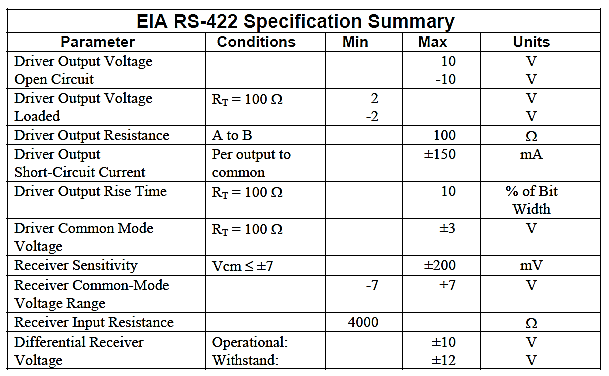

[<- До підрозділу](README.md)

# Стандартні послідовні інтерфейси: RS-232, RS-422, RS-485, CL

## 1. Стандартні послідовні інтерфейси

На фізичному рівні більшість промислових мереж використовують один із стандартних послідовних інтерфейсів: RS-232, RS-422, RS-485 або CurrentLoop („струмова петля”). Використання цих інтерфейсів пов’язано з відносною дешевизною організації зв’язку (існують готові мікросхеми з їх реалізацією) та їх популярністю. 

Один із найстаріших інтерфейсів – RS-232 поступово зникає з комп’ютерної техніки, про що свідчить його відсутність на портативних комп’ютерах (COM-порт). На заміну йому прийшов USB, який практично витіснив з ПК не тільки цей інтерфейс, а і інтерфейс паралельного порту. Але в області автоматизації інтерфейс RS-232 до сих пір використовується наряду з іншими. 

Інтерфейс RS-422А в чистому вигляді мало де застосовується. Замість нього частіше використовують RS-485 в дуплексному режимі, оскільки вони сумісні. RS-485 поряд з RS-232 знайшов найбільше застосування і, як правило, підтримується в мікропроцесорних засобах автоматизації.

Інтерфейс радіальний послідовний – ІРПС, аналог зарубіжного CurrentLoop, був дуже популярним у вітчизняних (радянських) засобах автоматизації, зокрема він реалізований в контролерах ЛОМІКОНТ та РЕМІКОНТ. На сьогоднішній день цей інтерфейс мало де використовується в сучасних засобах автоматизації. 

## 2. Інтерфейс RS-232

Стандарт інтерфейсу RS-232C розроблений в 1969 році і опублікований асоціацією EIA як варіант "С" рекомендованого стандарту (RS -Recommended Standard) номер 232. Інтерфейс призначений для підключення апаратури, яка передає або приймає дані АПД (DTE — Data Terminal Equipment) до апаратури каналів даних АКД (DCE — Data Communication Equipment). Кінцева мета – це з’єднання двох DTE (рис.3.23.а). Найпростіший приклад такої системи, коли в ролі DTE виступає комп’ютер, в якому RS-232 реалізований в якості COM-портів, а в ролі DCE – модем (рис.3.23.б). 

Рис.3.23. З’єднання за допомогою RS-232: а – схема з’єднання DTE з використанням DCE; б – приклад з’єднання двох ПК (як DTE) через модем (як DCE); в – схема з’єднання двох DTE без DCE (нуль-модемний зв’язок)

На практиці великої популярності набув спосіб з’єднання через RS-232 двох DTE без DCE, який отримав назву нуль-модемного з’єднання (Zero-modem або Z-modem). 

Стандарт описує управляючі сигнали інтерфейсу, обмін даними, електричний інтерфейс і типи роз’ємів. Передбачені синхронний та асинхронний режими обміну (в комп’ютері COM-порт підтримує тільки асинхронний режим). Функціонально RS-232C еквівалентний стандарту МККТТ V.24 і V.28. 

### Електричні характеристики

Стандарт RS-232C описує несиметричні (незбалансовані, unbalanced) передавачі та приймачі, тобто сигнал передається відносно загального проводу – схемної землі за допомогою напруги. Для передачі використовується сигнальна лінія TD – Transmit Data (інколи позначається TxD), а для прийому – RD – Receive Data (інколи позначається RxD), загальний провід SG (Signal Ground). Логічній "1" на вході відповідає діапазон напруги від –12В до –3В; логічному "0" – від +3В до +12В. Діапазон від –3В до +3В – зона нечутливості, яка обумовлює гістерезис приймача: логічний стан лінії поміняється тільки після переходу через поріг (рис.3.24). Рівні сигналів "1" і "0" на виходах передавачів повинні лежати в межах відповідно від -5В до -12В і від +5В до +12В. Інтерфейс не забезпечує гальванічної розв’язки пристроїв. 

Рис. 3.24. Прийом сигналів в RS-232C

Різниця потенціалів між схемними землями SG пристроїв, що з’єднуються, не повинна бути більше 2В. Підключення і відключення інтерфейсних кабелів пристроїв з автономним живленням повинно проводитись при відключеному живленні. Інакше в момент підключення пристроїв можуть вийти з ладу мікросхеми в результаті дії на них різниці потенціалів.

Стандартні трансивери RS-232 повинні забезпечити передачу та прийом бітів з швидкістю до 115200 біт/с на відстані до 20 м.

### Типи роз’ємів

На обладнанні DTE прийнято встановлювати вилки типу DB-9P (9 штиркові) або DB-25P (25 штиркові). Останні як правило використовуються для синхронних режимів, оскільки мають допоміжні штирки. 

> У прийнятій цією фірмою системі позначень буква D позначає всю серію роз'ємів D-sub, а друга буква використовується для вказівки розміру роз'єму, виходячи з стандартних контактів, які можуть розміститися всередині D-подібного екрану (A = 15 контактів, B = 25, C = 37, D = 50, E = 9), далі слідує число фактично використовуваних контактів, і буква, що позначає «землю» роз'єму: M — male («тато»), F — female («мама»), P — plug ( штепсель/«тато»), S — socket (розетка/«мама»). Наприклад, DB25M означає роз'єм D-sub з екраном, що містить 25 контактів і фактичним числом контактів, рівним 25. Ймовірно тому, що в оригінальному ПК як для паралельного, так і для послідовного портів використовувалися роз'єми DB-25, багато хто, не розуміючи, що "B" в даному випадку означає розмір екрану, стали сам роз'єм D-sub називати DB, замість того, щоб використовувати позначення "DA", "DC" або "DE". Коли для послідовного порту стали використовувати 9-штиркові роз'єми, їх почали називати DB9 замість DE9. Зараз досить поширено, що роз'єми DE9 продаються, як DB9. Під DB9 в сучасному світі (і в даному посібнику) майже завжди мають на увазі 9-штирковий роз'єм з розміром екрану Е.

На пристроях DCE використовуються розетки DB-9S та DB-25S. Це значить, що при такому з’єднанні пристрої DTE (наприклад ПК) та DCE (наприклад модем) можна підключати безпосередньо один до одного, або через "прямий" кабель з вилкою з одного боку та розеткою з іншого (рис.3.25).

Рис. 3.25. Підключення DTE (зліва) до DCE (справа)

В системах автоматизації частіше використовується нуль-модемне з’єднання, для якого використовується нуль-модемні кабелі. Якщо при з’єднанні використовуються тільки інформаційні сигнальні лінії (TxD, RxD, SG), то з’єднання проводиться мінімальним нуль-модемним кабелем (рис.3.26.б), в протилежному випадку – повним (рис.3.26.а). 

 Рис. 3.26. Нуль-модемне підключення, за допомогою нуль-модемного кабелю: а – повного, б – мінімального

### Призначення ліній інтерфейсу RS-232C

На практиці інтерфейс RS-232 використовується як правило в асинхронному режимі, тому розглянемо сигнальні лінії, призначені тільки для цього режиму. Для кращого розуміння, при розгляді ліній інтерфейсу, DCE будемо називати модемом, а DTE – комп’ютером.

В табл. 3.2 наведені сигнальні лінії RS-232C та їх призначення. В другій та третій колонці вказані відповідні контакти роз’ємів, а в четвертій колонці також вказана додаткова інформація, яка вказує напрямок передачі даних по лінії: IN – в комп’ютер, OUT – з комп’ютера. 

Таблиця 3.2. Сигнальні лінії інтерфейсу RS-232C

| Сигнал      | DB-25S | DB-9S | Призначення                                                  |
| ----------- | ------ | ----- | ------------------------------------------------------------ |
| PG          | 1      | -     | Захисна земля (Protected Ground). З’єднується з корпусом пристрою і екраном кабелю. |
| **SG**      | 7      | 5     | Сигнальна земля (Signal Ground), відносно неї діють лінії сигналів. |
| **TD(TxD)** | 2      | 3     | OUT Вихід передавача (Transmit Data).                        |
| **RD(RxD)** | 3      | 2     | IN Вхід приймача (Receive Data).                             |
| RTS         | 4      | 7     | OUT Запит дозволу на передачу (Request To Send). "Вкл" означає наявність даних у  комп’ютера для передачі. При напівдуплексі – перемикання модему в режим  передачі. |
| CTS         | 5      | 8     | IN Готовність передачі (Clear To Send). "Відкл" - модем забороняє комп’ютеру  передавати йому дані. |
| DTR         | 20     | 4     | OUT Готовність DTE (Data Set Ready). "Вкл" - комп’ютер готовий до роботи з  модемом. |
| DSR         | 6      | 6     | IN Готовність DCE (Data Terminal Ready). "Вкл" - модем готовий до роботи з комп’ютером. |
| DCD         | 8      | 1     | IN Виявлення несучої (Data Carried  Detected). "Відкл" модем  сигналізує про сигнал поганої якості |
| RI          | 22     | 9     | IN Сигнал виклику (Ring Indicator). "Вкл" – модем отримав сигнал виклику  (дзвінок на телефонній лінії) |

### Управління потоком даних 

При асинхронному режимі, в поєднанні з трансивером RS-232 використовується стандартні схеми UART з символьним способом передачі. Бітова швидкість при цьому вибирається з ряду: 50, 75, 110, 150, 300, 600, 1200, 2400, 4800, 9600, 19200, 38400, 57600 і 115200 біт/с. Кількість біт даних може складати 5, 6, 7 або 8 (5- і 6-бітні формати практично не використовуються). Кількість стопових бітів може бути 1, 1.5 або 2. Для управління потоком даних (Flow Control) можуть використовуватися два варіанти протоколу – апаратний та програмний. 

Апаратний протокол управління потоком\ (hardware\ flow\ control\) RTS/CTS використовує сигнал RTS, який подається на CTS, що дозволяє зупинити передачу даних, якщо приймач не готовий до прийому (рис.3.27). Передавач видає черговий байт тільки при увімкненій лінії CTS. Але байт, який вже почав передаватися затримуватися не буде – це гарантує цілісність посилки. Апаратний протокол забезпечує найшвидшу реакцію передавача на стан приймача. При зв’язку двох пристроїв DTE повним нуль-модемним кабелем (рис.3.26.а) необхідно перехресно з’єднати RTS передавача та CTS приймача, а при мінімальному (рис.3.26.б) RTS та CTS перемикаються на тому ж пристрої. В протилежному випадку, при налаштуванні апаратного управління потоком, деякі типи передавачів будуть мовчати, оскільки на CTS не буде дозволу передачі. Апаратний протокол DTR/DSR аналогічний попередньому, але використовує другу пару сигналів.

 

Рис. 3.27. Апаратне управління потоком даних RTS/CTS

Програмний протокол управління потоком\ (software\ flow\ control\) XON/XOFF передбачає наявність дуплексного каналу передачі даних (рис.3.28). Працює він наступним чином: якщо пристрій, який приймає дані, по якимось причинам не може їх більше приймати, він відсилає передавачу байт-символ XOFF (ASCII код 1316), по отриманню якого останній припиняє передачу. Коли приймаючий пристрій знову стає готовим до приймання даних, він відправляє символ XON (ASCII код 1316), прийнявши який протилежний пристрій продовжує передавати дані. Час реакції передавача на зміну стану приймача, порівняно з апаратним протоколом, збільшується за рахунок часу передачі символу та часу реакції програми передавача на прийом символу. Перевагою програмного протоколу є відсутність необхідності передачі управляючих сигналів інтерфейсу, тобто мінімальний кабель для двостороннього обміну може мати тільки 3 проводи (рис.3.26.б) навіть без перемикання управляючих проводів на пристроях. Недоліком, окрім часових запізнень та наявності допоміжного буферу, являється складність реалізації дуплексного режиму обміну, тому що при зворотній передачі даних повинні виділятися і оброблятися управляючі символи, що обмежує набір символів, які можуть передаватися.

Рис. 3.28. Програмне управління потоком даних XON/XOFF

Функціонально нуль-модемне з’єднання двох трансиверів можна показати у вигляді, представленому на рис.3.29. На схемі показані тільки сигнальні лінії для передачі даних (без синхронізуючих і управляючих ліній). Дані, які надходять для передачі позначені як TD, для прийому – як RD, сигнальна земля (загальний) – як SG. 

Рис. 3.29. Функціональна схема нуль-модемного з’єднання

Апаратно один передавач даного інтерфейсу може забезпечити необхідним рівнем сигналу тільки одного приймача. Таким чином інтерфейс RS-232 дозволяє об’єднати між собою тільки два пристрої з одним передавачем і одним приймачем на максимальній відстані 20 м. 

## 3. Інтерфейс RS-422A (EIA-422A)

Інтерфейс RS-232 має ряд недоліків, які обмежують область його використання в промислових умовах. Насамперед це пов’язано з чутливістю до електромагнітних завад, малою довжиною кабелю з’єднання і малою бітовою швидкістю. Організація EIA випустила ряд нових стандартів, один з яких RS-422A, під назвою „Electrical Characteristics of Balanced Voltage Digital Interface Circuits” (Електричні характеристики ланцюгів цифрових інтерфейсів з симетричною напругою”).

Даний стандарт описує (рекомендує) тільки електричні характеристики інтерфейсу, тобто вимоги до передавачів (драйверів - drivers) та приймачів і не визначає параметри сигналів, типи роз’ємів, тип та довжину кабелів та ін. Інтерфейс базується на збалансованих (симетричних) лініях передавачів та приймачів, тобто напруга передається по трьом проводам - два сигнальних та сигнальна земля. 

Рис. 3.30. Функціональна схема передавача (а) та приймача (б) в інтерфейсі RS-422A

На рис.3.30 показаний принцип функціонування збалансованого передавача (а) та приймача (б) лінії. Збалансований передавач лінії при передачі на TD логічної „1”, формує напругу між сигнальним проводом „A” і землею „C” – UA) та протилежну за знаком напругу між проводами „B” і „C” –UВ  (на рис.3.30 показаний знак інверсії). При передачі логічного „0” передавач інвертує знак сигналу. Приймач вимірює напругу між „А” і „В” і якщо різниця буде більше ніж +200 мВ то приймач буде розпізнавати його як певний логічний стан лінії. Якщо різниця змінить свій знак і стане менше ніж -200 мВ, приймач змінить логічний стан на протилежний.

Якщо на проводі „А” передавача в інтерфейсі RS-422А по відношенню до проводу „В” від’ємна напруга, лінія перебуває в стані логічної „1”, якщо додатна – логічного „0”. Позначення проводу „А” як правило еквівалентне „─„, а позначення „В” - „+” (інколи приймають навпаки). RS-422А витримує синфазну напругу ±7В (середня напруга на виходах А і В відносно землі).

Диференційний спосіб передачі зменшує вплив синфазної завади на лінію передачі, оскільки вимірюється не сигнал між сигнальним проводом і землею, а різниця потенціалів між двома сигнальними лініями. Навіть якщо на обох проводах будуть наведені паразитні струми, диференційна напруга практично не зміниться. 

Стандарт також описує електричні вимоги до передавачів та приймачів. Зокрема, один передавач повинен бути розрахований на 10 приймачів. Інтерфейс працює в дуплексному режимі. Тому можливі два варіанти з’єднання: передавачі та приймачі двох вузлів з’єднуються перехресно (точка –точка); передавач одного вузла обслуговує до 10 приймачів інших вузлів.

На основі даного стандарту з’явилися деякі рекомендації по його використанню. Це схеми підключення, способи заземлення, максимальні відстані, використання резисторів-термінаторів, максимальні бітові швидкості і т.д. Так встановлено, що максимальна бітова швидкість – становить біля 10 Мбіт/с, максимальна відстань (при невеликих швидкостях) – біля 1200 м. Ці величини залежать від багатьох параметрів: типу кабелю, рівня завад, типу роз’ємів і т.д. В якості середовища передачі на великі відстані рекомендують використовувати виту пару, бажано екрановану. На рис.3.31 показаний один із способів реалізації дуплексного з’єднання двох пристроїв по RS-422А.   

Рис. 3.31. Функціональна схема 5 – провідного дуплексного з’єднання двох вузлів по RS-422A 

Інтерфейс RS-422А має один значний недолік – на ньому не можна побудувати мережі з шинною топологією, тому він не знайшов такого широкого застосування як RS-485.  Чому ж інтерфейс, в якому передавач може забезпечити струмом 10 приймачів не може працювати на шині разом з іншими передавачами? Проблема в тому, що передача інформації забезпечується логічними "0" та "1" які мають відповідний рівень фізичного сигналу по напрузі. Наприклад в символьному режимі, при відсутності передачі на лінії приймача повинна бути присутня логічна "1", яку передає трансмітер. Тобто в кожен момент часу трансмітер буде прикладати напругу певного рівня. Якщо декілька передавачів буде підключено до однієї лінії зв’язку – це може привести до виходу з ладу трансиверів, оскільки кожен з передавачів буде генерувати свої сигнали. Цей недолік відсутній у інтерфейса RS-485.

## 4. Інтерфейс RS-485 (EIA/TIA-485)

Даний стандарт був сумісно розроблений двома асоціаціями EIA і TIA. Оскільки всі свої стандарти EIA маркувала як RS, то популярна назва стандарту RS-485, однак офіційна - EIA/TIA-485, що ідентифікує дійсне походження даного стандарту. На сьогоднішній день різноманітні розширення стандарту RS-485 (надалі будемо називати його так) охоплює широку різноманітність доповнень.

Все що стосується електричних характеристик стандарту RS-422A справедливо і для RS-485: використовується збалансована система зв’язку з тими ж рівнями сигналу, за винятком синфазної напруги, яку витримує інтерфейс – від +12В до -7В. Тому даний інтерфейс сумісний зі своїм попередником (зворотна сумісність не підтримується).

На відміну від свого попередника RS-422А, інтерфейс RS-485 розрахований на багатоточкове з’єднання, тобто на побудову шинних топологій. Перш за все на трансиверах крім інформаційних сигналів RD та TD з’явився додатковий сигнал управління передачі/прийому (рис.3.32). Тепер, при закінченні передачі пристрій може відключити свій передавач (перевести його в високоімпедансний стан), і надати можливість іншим трансмітерам підключатися для передачі. Іншими словами сигнал дозволу передачі переводить траснмітер з активного стану в пасивний, тобто передавач може генерувати логічну „1”, логічний „0” або знаходитись в пасивному стані. В який час і в якому порядку передавачі вузлів будуть доступатися до шини стандарт не оговорює, дане питання повинне вирішуватись на канальному рівні (організація доступу до шини). Реалізація інтерфейсу повинна забезпечити працездатність обладнання при короткочасних колізіях (коли два передавача займають одночасно шину), що, до речі, теж не описано в стандарті.

При розробленні даного стандарту розраховували на більшу кількість можливих приймачів. Один трансмітер розрахований на 32 одиниці наванта-ження, які в свою чергу, визначаються як вхідний імпеданс (опір) одного стандартного приймача (12 кОм). Таким чином стандартний передавач може обслуговувати 32 приймача з опором 12 кОм, які підключені до загальної шини паралельно. Якщо приймачі мають більш високий опір, наприклад 48 кОм (4  12 кОм), то до однієї шини можна підключити відразу 128 таких приймачів, при збільшенні опору до 96 кОм – 256 приймачів і т.д. Слід розуміти, що збільшення імпедансу приймача робить систему чутливою до завад. 

### Схеми з’єднання

На рис.3.32 показана функціональна схема з’єднання 3-х пристроїв до загальної шини через RS-485 інтерфейс. Напівдуплексна система дозволяє в один момент часу вузлу передавати інформацію, а в інший приймати. Передавач та приймач кожного вузла підключається до єдиної шини, тобто контакт „А” кожного передавача та контакт „А’ ” кожного приймача (штрихом позначені контакти приймачів) підключаються до загального лінії „А”, так само і контакти „В” та „В’ ” підключаються до лінії „В”. Таким чином, коли передавач одного вузла передає послідовність бітів, всі приймачі інших вузлів їх приймають. В один момент часу тільки один передавач може бути активним, його стан управляється з боку самого пристрою дозволом передачі. 

RS-485 не визначає вимоги до середовища передачі. Як правило використовують екрановану виту пару. На рис.3.32 показана 3-х провідна схема, однак на практиці нерідко використовують 2-х провідну (без сигнальної землі). 

 

Рис. 3.32. Функціональна схема трьохпровідного пів-дуплексного з’єднання вузлів по RS-485

Таке з’єднання дозволяється, якщо різниця потенціалів між „землями” вузлів не перевищує певний діапазон. Для реалізації 2-х провідної схеми з’єднання достатньо однієї витої пари, трьох-провідної – подвійної витої пари (пара сигнальних проводів, пара земляних). 

Швидкість передачі даних вибирається в залежності від сумарної довжини лінії, характеристик кабелю, і, як правило, приводиться в документації до обладнання у вигляді номограм.  

На швидкостях  < 19200 біт/с дозволяються відгалуження від шини порядку 1 м, великі відгалуження не дозволяються – порушується топологія , можливі відбиття з спотворенням сигналу

### Плутанина в підключенні

Полярності  контактів A і B у всіх виробників **РІЗНІ**, тому  з'єднуйте `+` з `+` та `-` з `-` замість `А` з `А` та `В` з `В`. Інколи для уникнення плутанини використовуються маркування `Data+` та `Data-`, `D0(-)` та `D1(+)` – RS485 для Modbus

### Схеми узгодження

При великих швидкостях і при значних відстанях (десь >200 м на бітовій швидкості 19200) необхідно вирішити проблему відбиття сигналу на кінцях лінії. Основою для мінімізації відбиття є використання узгоджуючих резисторів з номіналами, які відповідають хвильовому опору кабелю. Як правило в промислових мережах використовують кабель з характеристичним імпедансом 120 Ом, тому на схемі на рис.3.32 на обох кінцях шини між лініями „А” і „В” підключений узгоджувальний резистор (термінатор) з відповідним опором. 

На практиці виникає необхідність паралельного підключення до шини джерела постійного струму (розглянуто нижче). Резистори представляють активний опір, тому розсіють певну потужність, що вимагає використання більш потужних джерел струму. Це спонукає до використання альтернативних схем узгодження. 

Добавлення конденсатора послідовно з резистором виключає протікання постійного струму, і не створює бар’єру для високочастотного сигналу (рис.3.33.а). Такий спосіб вимагає клопіткого підбору ємності для забезпечення уникнення ефекту відбиття. Альтернативний варіант зменшення споживаної потужності - використання діодів Шотки (рис.3.33.б).

Рис. 3.33. Альтернативна схема RC узгодження 

### Забезпечення захисного зміщення (поляризація)

 Реалізація інтерфейсу передбачає, що при відсутності бітів для передачі трансмітер переходить у високоімпедансний стан. При сигнальній "тиші" всі трансивери на шині будуть працювати в режимі прийому. Оскільки жоден трансмітер не буде генерувати сигнал, на шині буде 0 В. Для більшості мереж, зокрема для тих, які працюють в символьному режимі, відсутність передачі обов’язково позначається певним рівнем сигналу, наприклад логічною "1". Однак при напрузі на входах приймачів від  -200мВ до 200мВ, вихідний стан залишається невизначеним, іншими словами це означає обрив зв’язку. У цьому випадку логічна „1” або „0” на виході RD приймачів рівноймовірні (або запам’ятовують попередній стан). 

Така ситуація неприпустима. В момент інформаційної тиші необхідно тримати сигнал напруги певної величини за допомогою зовнішнього джерела постійного струму, який підключається між сигнальними проводами A та B, тобто необхідно забезпечити зміщення потенціалу відносно нуля.

Всю лінію можна представити як замкнутий ланцюг із опорів ресиверів та двох термінаторів, що підключені паралельно. Задача захисного зміщення зводиться до забезпечення цього ланцюгу таким струмом, щоб напруга на ній була в межах, що відповідає логічній "1", тобто >200мВ. В більшості випадків підключають джерело напруги 5 В, і підбирають такі шунтуючі опори, щоб забезпечити ланцюг необхідним струмом. Ці опори отримали назву резисторів захисного зміщення (bias resistors): резистор завдання початкового високого рівня (pullup) – на одній лінії, наприклад „В”, і низького рівня (pulldown) – на другій лінії, наприклад „А” (рис.3.34). Значення опору резистора зміщення залежить від виду узгодження (термінування) і кількості вузлів тобто приймачів, підключених до шини. Номінали опорів зміщення розраховують виходячи з необхідного мінімального струму зміщення в мережі для забезпечення різниці потенціалів між А і В >200мВ у такій послідовності:

1. Розраховується загальний опір лінії, який складається з опору всіх приймачів (як правило 12 кОм кожний) та опору термінаторів (як правило 120 Ом).

2. Розраховується мінімальний струм для 200 мВ: Iзм=Uзм/Rл (Uзм=200 мВ, Rл – обрахований в п.1.);

3. Розраховується необхідний сумарний опір лінії: Rлн=Uж/I, де Uж – напруга живлення зміщення (як правило 5В), Iзм – мінімальний струм з п.2;

4. Визначається номінал резисторів зміщення: Rзм= (Rлн-Rл)/2.

 Рис. 3.34. Використання резисторів захисного (RC) зміщення разом з узгоджувальними резисторами (RT)

Приклад 3.3. Реалізація фізичного рівня. Розрахунок номіналів резисторів зміщення. 

Завдання. Розрахувати номінал резисторів захисного зміщення для мережі на основі RS-485 яка має 10 вузлів на шині (по 12 кОм кожний приймач) і 2 узгоджувальні резистори по 120 Ом. 

Рішення.  

1) 10 приймачів опором 12 кОм, з’єднаних паралельно та 2 термінатора дають сумарний опір:

загальна провідність = 1/12000  10 + 1/120  2 = 21/1200 См; 

загальний опір = 57 Ом 

2. Мінімальний необхідний струм:

   Iзм=200мВ/57 Ом ≈ 3.5 мА. 

3. Необхідний опір лінії не повинен перевищувати 

   Rлн=5В2/3.5 мА≈1428 Ом. 

4. Віднімемо 57 Ом, які вже в нас є і отримаємо: 

  1371Ом / 2 = 685 Ом для кожного резистора.    

Резистори захисного зміщення можуть бути встановлені на будь-якому вузлі мережі або бути розподіленими між декількома вузлами. Опір всіх резисторів захисного зміщення в системі повинен бути меншим чи дорівнювати розрахованому значенню. Надмірно високий їх опір приводить до недостатнього зміщення, а отже до неправильної роботи системи, малий – приводить до підвищення навантаження на передавачі.

### Репітери (повторювачі)

На довгих лініях (>1000 м), або великій кількості пристроїв (>32 при 12кОм), або за необхідності великих відгалужень ставляться репітери (повторювачі). По суті репітер містить два трансивера, з'єднаних між собою через гальванічну розв'язку.  

Репітери вносять додаткові  затримки в передачу сигналу, зв'язані з необхідністю керування передавачем `DE` по таймауту відсутності/присутності передачі. Тому кількість репітерів, підключених послідовно, може бути обмежено правилами побудови мережі.

## 5. Інтерфейс „струмова петля” 20 мА (Current Loop, ИРПС)

Вище були розглянуті інтерфейси, які використовували в якості носія інформації напругу. При великих відстанях краще використовувати струм. Коротко зупинимося ще на одному популярному інтерфейсі, який носить назви: 20mА Current Loop (CL, струмова петля) і ИРПС 20мА (Интерфейс Радиальный ПоСледовательный). 

Для передачі логічного „0” в інтерфейсі використовують струм 0мА, логічної „1” – 20мА, тому в назву інтерфейсу добавляють „20мА”. Оскільки передача ведеться по символам, то коли передавач мовчить, він виставляє на лінію логічну „1”. Таким чином довготривалий сигнал 0мА ідентифікується як розрив.

 

Рис. 3.35. Функціональна схема дуплексного з’єднання двох вузлів по струмовій петлі

Струмова петля передбачає дуплексне з’єднання. На рис.3.35 умовно зображена функціональна схема такого з’єднання в тому форматі, в якому були приведені до цих пір всі інтерфейси.

Насправді існують схеми використання даного інтерфейсу для побудови шинних топологій. Причому максимальна довжина лінії зв’язку *збільшується* при збільшенні кількості вузлів в мережі. 

Використовують дві схеми з’єднання пристроїв: 

-          з активним передавачем та пасивним приймачем;

-          з активним передавачем та активним приймачем.

Відрізняють ці схеми способом живлення ліній зв’язку. Розглянемо першу схему, зображену на рис.3.36, де генератор струму знаходиться в приймачах. 

Сигналом TD управляється умовний контакт, який замикає або розмикає лінію. Оскільки струм йде по шляху найменшого опору, то при замиканні лінії він не буде циркулювати через приймач іншого вузла. В протилежному випадку, якщо контакт розімкнений, по лінії піде струм 20мА, який пройде через світлодіод приймача. Останній використаний разом з світлочутливим елементом (скажімо фотодіодом) в якості гальванічної розв’язки і називається **оптопарою**. Таким чином, якщо контакт вузла 1 розімкнений - в світлочутливому елементі вузла 2 наведеться струм, і приймач видасть на RD логічну „1”. Принцип передачі в зворотному напрямку аналогічний.

 

Рис. 3.36. Використання схеми типу активний передавач – пасивний приймач.

В іншій схемі з’єднання, яка показана на рис.3.37, відмінність полягає в реалізації схеми приймача вузла 1 і передавача вузла 2. Як бачимо вузол 1 має активний передавач і активний приймач, тобто обидва живлять лінії зв’язку. 

 Рис. 3.37. Використання схеми типу активний передавач – активний приймач.

В табл.3.3 наведена залежність максимальні відстані при певній бітовій швидкості для обох наведених вище схем. Як бачимо при швидкості 9600 біт/с, яка найбільш часто зустрічається в промислових мережах реалізованих на стандартних послідовних інтерфейсах, можна досягнути відстані декількох кілометрів (правильніше сказати навпаки: при значній відстані можна досягнути великих швидкостей).

*Таблиця 3.3*  Залежність максимальної довжини лінії від швидкості передачі

| Швидкість  біт/с                     | Максимальна відстань (м)             |       |
| ------------------------------------ | ------------------------------------ | ----- |
| Активний передавач/ пасивний приймач | Активний передавач/ активний приймач |       |
| 1 152 000                            | 150                                  | 50    |
| 230 400                              | 300                                  | 150   |
| 115 200                              | 600                                  | 300   |
| 57 600                               | 800                                  | 400   |
| 38 400                               | 1100                                 | 550   |
| 19 200                               | 2000                                 | 1000  |
| 14 400                               | 2600                                 | 1300  |
| 9 600                                | 3400                                 | 1700  |
| 300                                  | >3400                                | >1700 |

## 6. Порівняльна характеристика стандартних послідовних інтерфейсів

Для порівняння інтерфейсів, розглянутих вище, найбільш важливі характеристики зведені в таблицю 3.4. 

Таблиця 3.4. Порівняльні характеристики послідовних інтерфейсів.

| Назва, стандарт                            | EIA RS-232C           | EIA RS-422A                        | EIA/TIA-485,   RS-485               | 20 мА „струмова петля”,CL, ИРПС,                 |
| ------------------------------------------ | --------------------- | ---------------------------------- | ----------------------------------- | ------------------------------------------------ |
| Тип сигналу                                | Напруга, асиметричний | Напруга, диференційний симетричний | Напруга, диференційний симетричний  | струм                                            |
| Режим з’єднання                            | дуплекс               | дуплекс                            | напівдуплекс, дуплекс               | дуплекс                                          |
| Максимальна кількість передавачі/приймачів | 1/1                   | 1/10                               | 32/32   (при опорі приймачів 12кОм) | 1/1 у багаточкових схемах залежно від реалізації |
| Максимальна відстань (приблизно)           | 20 м                  | 1200 м                             | 1200 м                              | декілька км                                      |
| Максимальна бітова швидкість (приблизно)   | 115200 біт/с          | 10 Мбіт/с                          | 10 Мбіт/с                           | 1 Мбіт/с                                         |

 Прокоментуємо декілька комірок таблиці. RS-485 може працювати і по 5-провідній дуплексній схемі. Вона передбачає з’єднання одного передавача (з правами Ведучого) з іншими приймачами (на вузлах з правами Ведених) по одній парі проводів. По другій парі передавачі Ведених вузлів з’єднуються з приймачем ведучого. Така схема вимагає більше проводів (відповідно накладних затрат) і не така універсальна, але виключає колізії між «ведучим» і «веденими» і збільшує швидкість обміну між вузлами за рахунок дуплексного з’єднання. Таке з’єднання має місце тільки в мережах типу Ведучий/Ведені і не може бути застосована в широкомовних мережах.

При використанні RS-485 кількість приймачів вказана рівною 32, це при опорі приймачів 12кОм. При інших опорах, наприклад 48кОм, максимальна кількість приймачів відповідно буде 128.

В інтерфейсі „струмова петля” 20 мА кількість передавачів/приймачів залежить від конкретної реалізації.

Для всіх інтерфейсів (окрім RS-232С) максимальна бітова швидкість залежить від багатьох факторів. Перш за все – це довжина лінії зв’язку, а також тип кабелю, рівень завад, способи узгодження ліній і т.ін. 

Вибір інтерфейсу для реалізації мережі залежить від багатьох факторів. В більшості випадків пристрій може підтримувати тільки один визначений інтерфейс. Для зв’язку з іншими пристроями дуже ймовірне використання адаптерів-перетворювачів інтерфейсів, які розглянуті в наступному підрозділі.

При побудові шинних топологій як правило користуються RS-485. Інколи використовують також багатоточкове з’єднання по інтерфейсу "струмова петля". Якщо необхідне з’єднання точка-точка – вибирають дуплексний зв’язок, оскільки, при тих самих бітових швидкостях досягається майже в 2 рази більша швидкість передачі даних, за рахунок подвійного каналу. В цьому випадку можна використати RS-422А або RS-485 в дуплексному режимі (якщо обладнання дає можливість організувати таке з’єднання). RS-232 популярний при з’єднанні пристроїв з ПК.

Поряд з розглянутими інтерфейсами існує ряд інших. Деякі з них не знайшли широкого використання в області промислових мереж, інші тільки почали активно впроваджуватися. Один з найбільш перспективних інтерфейсів являється USB, який практично витіснив СОМ-порт (RS-232) та паралельний порт з персональних комп’ютерів. В даній книзі стандарт USB не розглядається, однак він добре описаний в літературі з комп’ютерних технологій та комунікацій. 

## 7. Використання адаптерів-перетворювачів інтерфейсів

### Типи адаптерів-перетворювачів

Описані вище послідовні інтерфейси складають далеко не повний перелік інтерфейсів фізичного рівня. На фізичному рівні нерідко використовуються унікальні інтерфейси. Однак навіть для мереж, які базуються на стандартних послідовних інтерфейсах, нерідко виникає задача в об’єднані пристроїв з різними реалізаціями фізичного рівня. Для вирішення такої задачі існують адаптери-перетворювачі (конвертери) інтерфейсів. Адаптер можна представити у вигляді пристрою, що має два різні інтерфейси. Задача даного пристрою електрично перетворити вхідні сигнали RD одного інтерфейсу у вихідні TD іншого. 

Розглянемо можливі випадки з’єднань пристроїв з різними інтерфейсами:

- RS-422A <–> RS-485 – оскільки інтерфейси сумісні, то RS-485 може працювати в режимі RS-422A, але не навпаки. Для зворотного режиму необхідно допоміжні схемні рішення;

- RS-232 <–> Current Loop 20 mA – необхідний адаптер-перетворювач. Схемні рішення доволі прості в реалізації, виконуються або у вигляді окремого пристрою або плати в ПК;

- RS-232 <-> RS-485. Оскільки RS-485 не описує спосіб передачі даних то в даному випадку можливі дві ситуації: перетворювач для побітової та посимвольної передачі. У першому випадку реалізувати схему перетворення доволі складно і дорого. Як правило в RS-232 передача йде по символам, управління якою займається UART, а в побітовій передачі – все залежить від реалізації протоколу фізичного рівня. В посимвольній передачі використовується адаптер-перетворювач RS-232С <-> RS-485.

Зупинимося на принципах роботи адаптерів RS-232С <-> RS-485 більш детально, оскільки вони одні з найбільш поширених в промисловості. Нагадаємо, що передавачі в системі RS-485 повинні підтримувати можливість відключення від лінії зв’язку, якщо трансивер не передає дані. Однак передавачі RS-232 разом з UART при відсутності передачі видають логічну "1". Тобто, при звичайному схемному рішенні електричного перетворення сигналу з  RS-232 в RS-485, передавач RS-485 ніколи не відключиться, що недопустимо в шинних топологіях.

Таким чином в конвертері повинно бути забезпечене переключення передавача RS-485 зі сторони RS-232 в активний чи пасивний (високоімпедансний) стан. Виробники адаптерів вирішують цю проблему по різному. Розглянемо декілька способів.

### Керування адаптером RS-232<->RS-485 зі сторони RS-232

Один із варіантів вирішення проблеми управління станом трансмітера RS-485 є використання одного з сигналів управління потоком зі сторони інтерфейсу RS-232C: RTS або DTR. 

На рис.3.38 показана модель перетворювача, який управляється сигналом RTS. На рисунку перетворювач умовно поділений на 2 частини з відповідними інтерфейсами. Коли пристрій з RS-232C має передавати дані, він активує передавач адаптера за допомогою RTS, виставляючи на цій лінії логічну „1”. Далі він надсилає послідовність бітів в символьному вигляді по лінії TD. Перетворювач за допомогою схемних рішень відсилає цей сигнал на передавач адаптера зі сторони RS-485. Оскільки той вже активований, цю ж послідовність він видає на лінію RS-485 інтерфейсу. Так буде тривати, поки пристрій зі сторони RS-232С не зніме „1” з RTS, що приведе до переключення передавача в високоімпедансний (неактивний) стан.

Рис. 3.38. Управління передавачем адаптера RS-232<->RS-485 сигналом RTS 

Алгоритм управління сигналом RTS для RS-232C може бути різним. Для комп’ю-терів, як правило, налаштову-ють роботу СОМ-порту так, щоб сигнал RTS виставлявся автоматично в „1”, коли буфер передачі заповнений байтами, і „0”, коли він пустий. Для СОМ-порту це нормальний режим роботи з апаратним управлінням потоком. Рідше використовується сигнал DTR.

При наведеному способі реалізації перетворювача можлива ситуація передчасного відключення сигналу RTS до передачі трансмітером RS-485  останнього біту. Такі проблеми повинні вирішуватись на пристрої зі сторони інтерфейсу RS-232C. Ще одна з проблем заключається в тому, що не всі пристрої вміють управляти сигналом RTS. У цьому випадку існує інший, більш універсальний спосіб управління передавачем адаптера.

### Автоматичне управління адаптером RS-232<->RS-485

Цей метод у різних фірм називається по різному: Automatic Send Data Control (ASDC), Automatic Data Direction Control (ADDC), Automatic RTS Signal Control (ARSC), але всі вони базуються на принципі управління по сигналу даних, які передаються (рис.3.39). Тобто адаптер сам відслідковує, коли включати і коли відключати передавач по даним, які надходять зі сторони RS-232. Один з варіантів такої реалізації – відслідковування приймального буферу. Як тільки адаптер з боку RS-232 отримав перший біт символу (стартовий біт) − відразу активує передавач. Оскільки біт в стані логічної „1” не може триматися більше часу одного символу, то після паузи відсутності логічного „0” протягом певного часу (не менше тривалості одного символу), конвертер буде ще тримати передавач в активному стані, після чого переведе його в високоімпедансний стан. Якщо затягнути цю паузу, може виникнути ситуація, коли інший передавач в системі зі сторони RS-485 захоче передати дані (адже лінія вже звільнилася) і виникне колізія. 

Рис. 3.39. Управління передавачем адаптера за сигналом даних, що передаються

Адаптери з управлінням по сигналу даних по приймальному буферу користуються більшою популярністю ніж адаптери з управлінням сигналами RTS чи DTR. 

Ще один з методів управління передавачем, який не знайшов широкого використання, по сигналу зі сторони пристрою з інтерфейсом RS-485. Останній для цього повинен мати спеціальну сигнальну лінію (аналогія з RTS), яка передбачена саме для цього. Коли пристрій з RS-485 планує передавати дані, він переводить перетворювач в стан прийому, тобто вимикає передавач. Специфіка таких перетворювачів заключається в тому, що використати їх можна тільки в режимі точка-точка, що сильно звужує коло їх використання. Такий перетворювач не накладає ніяких вимог по управлінню на пристрій з RS-232C, що звісно ж таки повинно компенсуватись зі сторони RS-485.  

## Контрольні запитання 

1. Які способи з’єднання між пристроями доступні при використанні інтерфейсу RS-232? Що таке нуль-модемне з’єднання?

2. Перерахуйте електричні характеристики інтерфейсу RS-232. Які основні недоліки даного інтерфейсу?

3. Які типи роз’ємів визначені інтерфейсом RS-232? Розкажіть про призначення всіх контактів 9-пінового роз’єму.

4. Яким чином організовується управління потоком даних при символьному способі передачі по RS-232?

5. Перерахуйте електричні характеристики RS-422. Які основні переваги даного інтерфейсу порівняно з RS-232?

6. Перерахуйте електричні характеристики RS-485. Які основні переваги даного інтерфейсу порівняно з RS-422?

7. Які схеми з’єднання використовуються з інтерфейсом RS-485? 

8. Які схеми терімнування використовуються з інтерфейсом RS-485?

9. Розкажіть про призначення захисного зміщення при використанні шинних топологій на базі інтерфейсу RS-485. Як розраховуються резистори захисного зміщення?

10. Перерахуйте електричні характеристики інтерфейсу "струмова петля". Які переваги та недоліки даного інтерфейсу порівняно з іншими?

11. В яких випадках необхідно використовувати адаптери-перетворювачі інтерфейсів? Які адаптери найчастіше використовуються?

12. Поясніть про необхідність в управлінні передавачем RS-485 в адаптері RS-232<->RS-485. Якими способами вирішується дана проблема.

<iframe width="560" height="315" src="https://www.youtube.com/embed/QbC0KNzl784?si=umQZQYHurfr84xTq" title="YouTube video player" frameborder="0" allow="accelerometer; autoplay; clipboard-write; encrypted-media; gyroscope; picture-in-picture; web-share" referrerpolicy="strict-origin-when-cross-origin" allowfullscreen></iframe>

Теоретичне заняття розробив [Олександр Пупена](https://github.com/pupenasan). 
