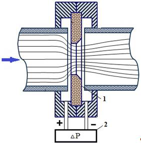
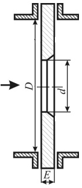
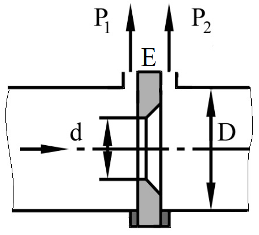
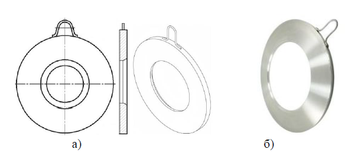
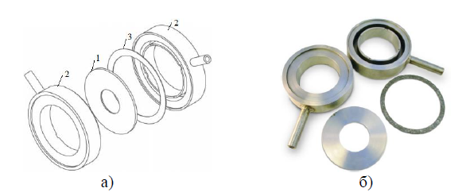
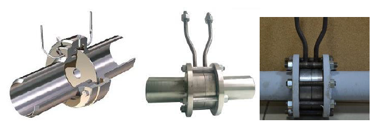
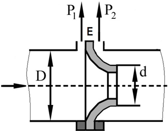
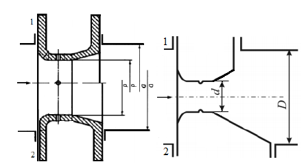
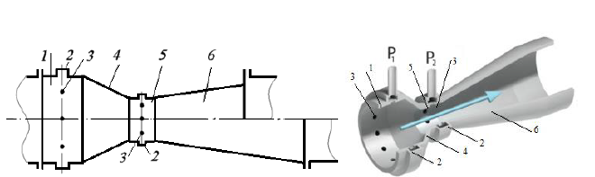

[<- До підрозділу](README.md)

# Витратоміри змінного перепаду тиску: теоретична частина

## 1. Загальні поняття

Витратоміри змінного перепаду тиску – це витратоміри рідини або газу, в яких витрата визначається за перепадом тиску, що утворюється нерухомим пристроєм, який встановлюється у трубопроводі, або є елементом трубопроводу. Найбільшого поширення набули витратоміри зі звужувальними пристроями (або з пристроями звуження потоку).

Принцип дії витратомірів із звужувальними пристроями заснований на тому, що при проходженні рідини через місцеве звуження каналу середня швидкість потоку в ньому збільшується, а тиск падає, тобто частина потенціальної енергії потоку перетворюється в кінетичну. Перепад тисків, що при цьому утворюється, залежить від витрати рідини, що протікає через трубопровід, та може бути виміряна диференціальними манометрами.

Вимірювальний комплект витратоміру змінного перепаду тиску (рис.1) складається із звужувального пристрою 1, який встановлюється в потік рідини або газу, та дифманометра 2 відградуйованого в одиницях витрати, який вимірює перепад тисків, що створюється на звужувальному пристрої. За допомогою дифманометра можна отримати стандартний електричний чи пневматичний сигнал і передати його на відстань. Лініями зв’язку між звужувальним пристроєм та дифманометром є з’єднувальні (імпульсні) трубки зі спеціальними пристроями на них.

Рисунок 1 – Вимірювальний комплект витратоміру змінного перепаду тиску: 1 – звужувальний пристрій (діафрагма); 2 – дифманометр.

Для вимірювання витрат рідини дифманометр установлюють нижче від звужувального пристрою. Це робиться щоб уникнути впливу газових бульбашок на результати вимірювання. Для вимірювання витрат газів дифманометр розміщують над звужувальним пристроєм, щоб уникнути похибок від потрапляння рідини в прилад. Для вимірювання витрати пари з'єднувальні трубки потрібно заповнити конденсатом і використати зрівняльні посудини.

Звужувальні пристрої поділяють на стандартні та нестандартні. Для вимірювання витрат найбільш широко застосовуються нормалізовані (стандартні звужувальні пристрої: 

- діафрагми (ДСТУ ГОСТ 8.586.2:2007 (ISO 5167-2:2003)); 
- сопла та сопла Вентурі (ДСТУ ГОСТ 8.586.3-2005 (ISO 5167-3:2003)), 
- труби Вентурі (ДСТУ ГОСТ 8.586.4-2005 (ISO 5167-4:2003)) та ряд інших. 

Виконання звужувальних пристроїв у суворій відповідності зі стандартами дозволяє використовувати їх без індивідуальних градуювань.

### Діафрагми

Стандартні діафрагми є основним типом звужувальних пристроїв. Діафрагма являє собою тонкий диск з круглим отвором (рис.2), що має з боку входу потоку гостру прямокутну кромку. Отвір є фасонним: спочатку циліндричним, потім конічним. Товщина діафрагми визначається діаметром трубопроводу, де вона встановлюється, і становить приблизно E≈0,05D, де D – діаметр трубопроводу. Діаметр отвору діафрагми d визначається в результаті розрахунку згідно з ГОСТ 8.586.1-2005.

Рисунок 2. Стандартна діафрагма

Діафрагми бувають двох основних типів: безкамерні (рис.3), які використовують для вимірювання витрат у трубопроводах з діаметром D = 300…1000мм, та камерні (рис.4), які відрізняються наявністю кільцевих камер для відбору тиску і, які використовують для вимірювання витрат у трубопроводах з діаметром D = 50…500мм.

Рисунок 3 – Діафрагма безкамерна: а) схема; б) фотографія (діафрагма); 2 – камери; 3 – прокладка

Рисунок 4 – Діафрагма камерна: а) схема, б) фотографія; 1 – диск

Відбір тисків до і після діафрагми здійснюється за допомогою спеціальних камер і окремих отворів. На рис.5. наведені діафрагми: безкамерна, камерна та камерні в збірці.

Рисунок 5 – Діафрагми безкамерна, камерна та камерні в збірці

### Сопла

Сопло ISA 1932 – це сопло, у якого звужувальна частина на вході, утворена дугами двох радіусів, переходить в циліндричну частину на виході (рис.6).

Рисунок 6 Сопло ISA 1932
Стандарт ISO 5167-3 визначає можливість використання сопла ISA 1932 для труб діаметром від 50 до 500 мм. Конструкція відбірних пристроїв тиску для діафрагм і сопел однакова.

Профіль сопла Вентурі наведено на рис.7. Він складається з вхідних торцевої поверхні, перпендикулярної до осьової лінії сопла, звужувальної частини з заокругленим профілем, циліндричної частини (горловини) і вихідної конічної частини (дифузора). Вхідна торцева поверхня і звужувальна частина сопла Вентурі аналогічні торцевій поверхні і звужувальній частині сопла ІСА 1935. Сопло Вентурі може бути довгим або коротким. У довгого сопла найбільший діаметр вихідного конуса дорівнює діаметру трубопроводу, у короткого він менше діаметра трубопроводу. Сопло Вентурі встановлюють на трубопроводах діаметром від 65 до 500 мм.

Рисунок 7 – Сопло Вентурі: 1 - укорочене сопло Вентурі; 2 - неукорочене сопло Вентурі
Відбір тиску для сопла Вентурі виконують аналогічно з соплами ISA 1935. Відбір тиску в горловині проводять через окремі отвори, з'єднані за схемою або за допомогою кільцевої камери усереднення (або п'єзометричного кільця).

### Труби Вентурі

Труба Вентурі (рис.8) складається з циліндричного вхідного патрубка 1, вхідного конуса 4, горловини (циліндрична частина) 5 і дифузора (вихідний конус) 6. У вхідному конусі і горловині виконані кільцеві камери 2, що призначені для усереднення тиску. Вони сполучаються з внутрішніми порожнинами вхідного конуса і горловини за допомогою декількох отворів 3.

Рисунок 6.9 – Труба Вентурі: 1 – циліндричний вхідний патрубок; 2 – кільцеві камери; 3 – отвори; 4 – вхідний конус; 5 – горловина (циліндрична частина); 6 – дифузор (вихідний конус)

Труба Вентурі називається довгою, якщо найбільший діаметр вихідного конуса дорівнює діаметру трубопроводу, або короткою, якщо зазначений діаметр менше діаметра трубопроводу. Труба Вентурі встановлюється на трубопроводах діаметром від 50 до 1400 мм.

При виборі пристрою звуження необхідно враховувати наступне. Характер потоку й розподіл тиску однаковий у всіх типах звужувальних пристроїв. Втрати тиску у звужувальних пристроях збільшується в такій послідовності: труба Вентурі, довге сопло Вентурі, коротке сопло Вентурі, сопло, діафрагма. Сопла Вентурі дозволяють вимірювати витрати з малими втратами, оскільки за формою вони нагадують стислий струмінь і зон завихрення на них практично не створюється. На практиці найчастіше застосовується дросельна шайба, оскільки має невисоку вартість і проста у виготовленні. При встановленні звужувальних пристроїв необхідно дотримуватися ряду умов, що впливають на похибку вимірювань. Звуження потоку в трубопроводі має відбуватися перпендикулярно осі трубопроводу. Ось звужувального пристрою повинна збігатися з віссю трубопроводу. Важливою умовою є необхідність забезпечення сталого плину потоку перед входом в звуження потоку і після нього. Такий потік забезпечується наявністю прямих ділянок трубопроводу певної довжини до і після звужуючого пристрою.

Технологічні вимірювання і прилади. Вимірювання рівня та витрат [Електронний ресурс]: навч. посіб. для студ. спеціальності 151 «Автоматизація та комп’ютерно-інтегровані технології» / КПІ ім. Ігоря Сікорського; уклад.: С. Г. Бондаренко, Д. М. Складанний, А. О. Абрамова. – Електронні текстові данні (1 файл: 2 Мбайт). – Київ: КПІ ім. Ігоря Сікорського, 2020. – 117 с.

Теоретичне заняття розробив [Прізвище або нік розробника Імя](https://github.com). 
