[< -- До підрозділу](README.md)         [Зміст](../../contents.md)

# Навчальне завдання 1. Описати ручні клапани.

https://opentextbc.ca/plumbing4b/chapter/describe-manual-valves/

Ручні газові клапани вбудовуються в систему трубопроводів різними способами, щоб забезпечити можливість надійного перекриття подачі газу в певну ділянку трубопровідної системи або до конкретного приладу. Газовий монтажник повинен вибрати правильний клапан для виконання відповідного завдання. Газові норми визначають конкретні місця та випадки, у яких необхідно встановлювати ручні газові клапани.

Наприклад, Кодекс установлення CSA B149.1 чітко вимагає, щоб для кожного приладу був установлений легкодоступний запірний газовий клапан. Цей ручний запірний клапан зазвичай розташовується безпосередньо біля приладу, де до нього можна легко дістатися, щоб дати змогу газовому монтажнику від’єднати прилад і виконати необхідний ремонт або обслуговування.

## Типи ручних газових клапанів

Більшість запірних застосувань вимагає використання ручного клапана, який повністю відкривається або закривається при повороті рукоятки на чверть оберту. Найпоширенішими є кульові клапани та змазувані пробкові клапани, але ексцентрикові типи також застосовуються на більших трубопроводах. Клапани типу голчастих, дискових (butterfly) і глобусних (globe) також використовуються для дроселювання потоку.

### Класифікація клапанів

Усі газові клапани повинні використовуватись у межах діапазону їхніх сертифікованих тискових і температурних характеристик. Кодекс установлення газових систем визнає низку сертифікаційних організацій і стандартів для ручних запірних клапанів. Маркування на корпусі клапана або технічна документація виробника дозволяють перевірити призначення клапана. Множинні сертифікаційні позначки, які часто наносяться виробником на корпус і рукоятку клапана, можуть заплутати користувача (рисунок 1).

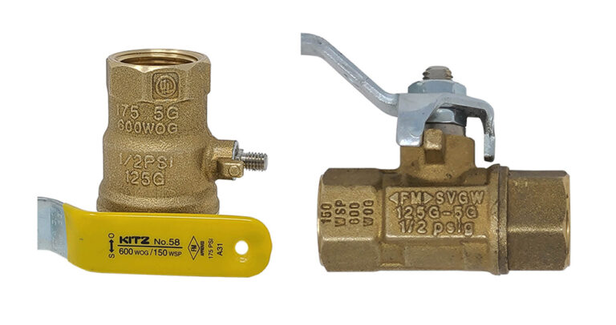

рис.1.

Поширені позначення класів тиску або сертифікацій, що зустрічаються на газових клапанах:

- WOG означає Water, Oil and Gas, а CWP — Cold Working Pressure. Обидва показують допустимий робочий тиск для неімпульсних середовищ при температурі навколишнього середовища до 38 °C. Позначення “Gas” тут відноситься до повітря, азоту тощо, але не охоплює горючі гази. Для застосування у паливних газових системах потрібні окремі сертифікації.
- WSP означає Working Steam Pressure і визначає тиск пари, при якому може використовуватися клапан. Цей параметр застосовується для бронзових кульових клапанів, оскільки зі зростанням температури міцність матеріалу зменшується.
- G позначає придатність для горючих газів, оскільки не всі клапани сертифіковані для паливного газу. Клапани, призначені для роботи з горючими газами, можуть мати одне або кілька таких позначень:
   • ½ PSIG (або ½ G) — низькотискове застосування, зазвичай безпосередньо біля газового приладу;
   • 5G — вищий клас тиску для клапанів, що використовуються у Канаді в системах розподілу газу всередині та поза приміщеннями;
   • 125G — американський клас тиску 125 PSIG для газових систем;
   • CAN/CGA-3.16 — канадський клас тиску 125 PSIG для зовнішнього використання.

Поширені скорочення сертифікаційних організацій, які вказують клас клапана:

- UL — Underwriter’s Laboratories, перевіряє клапани на тиск, утричі більший від зазначеного, і дозволяє ставити логотип UL лише після успішного тесту;
- CSA — Canadian Standards Association, випробовує клапани за канадськими та американськими стандартами; під логотипом можуть бути позначення “C” або “US”, або обидва;
- CGA — Compressed Gas Association, розробляє стандарти для промислових, медичних та харчових газів;
- FM — Factory Mutual Global, страхова компанія США, що сертифікує обладнання після технічної оцінки;
- UPC / cUPC — Uniform Plumbing Code та Canadian Uniform Plumbing Code гарантують безпечність і санітарність сантехнічних виробів;
- ANSI — American National Standards Institute, перевіряє відповідність різним стандартам.

### Кульові клапани

Найпоширенішим запірним клапаном для приладів є кульовий клапан із важелем, який не потребує змащення. У побутових і комерційних системах вони зазвичай мають корпус із латуні (BRS) і хромовану латунну кулю. Найчастіше використовуються тефлонові сідла та ущільнення, але в менших розмірах застосовують O-кільця (рисунок 2).

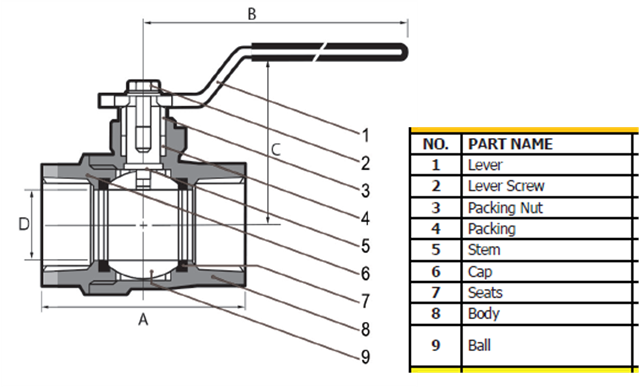

рис.2.

У центрі кулі просвердлено отвір. Коли рукоятка знаходиться у відкритому положенні (вздовж осі клапана), отвір вирівняний із прохідними отворами корпусу, і потік проходить. У закритому положенні рукоятка та отвір повернуті перпендикулярно до корпусу, і потік перекрито (рисунок 3).

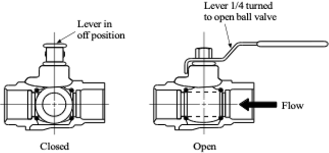

Зазвичай клапани мають двокомпонентний корпус, де дві різьбові частини утримують кулю та сідла. Менші клапани можуть бути однокорпусними, де куля фіксується стопорним кільцем і шайбою (рисунок 4).

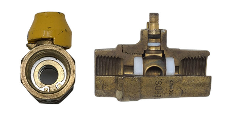

Розмір отвору (порту) у кулі може відрізнятися. Повнопрохідний (full port) кульовий клапан має отвір того ж діаметра, що й з’єднувальна труба, тоді як зменшенопрохідний (reduced port або standard port) має отвір на один типорозмір менший (рисунок 5).

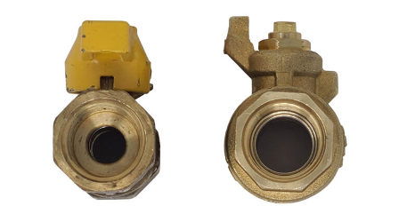

#### Типи рукояток

Кульові клапани постачаються з різними типами та кольорами рукояток — сталевими, алюмінієвими або крильчастими. Зазвичай ручки газових клапанів мають жовтий колір, але зустрічаються й червоні, сині чи зелені. Деякі ручки можна переставити для блокування клапана у закритому положенні.

#### Кінцеві з’єднання

Латунні кульові клапани розміром до 2 дюймів найчастіше мають внутрішню різьбу (FNPT) або фланцеві з’єднання з накидною гайкою, або комбінацію обох типів (рисунок 6).

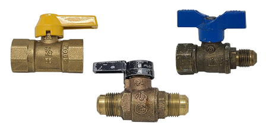

### Пробкові клапани

Пробкові клапани — ще один тип ручних запірних клапанів для газових систем. Вони також відкриваються і закриваються при повороті рукоятки на чверть оберту. Замість кулі вони використовують конусоподібну пробку з отвором. Раніше для внутрішніх низькотискових застосувань використовувалися пружинні латунні версії (рисунок 7), але тепер їх не виготовляють.

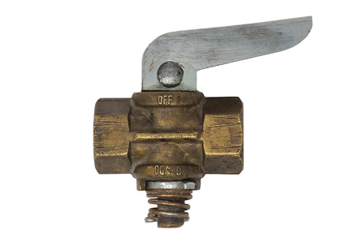

Тип, що змащується, дозволений для внутрішнього і зовнішнього використання і є типовим для газових лічильникових вузлів. Часто його називають Luboseal™ — за популярною торговою маркою. Конічна пробка має O-кільця зверху і знизу, які підтримують тонку плівку мастила між пробкою та корпусом (рисунок 8).

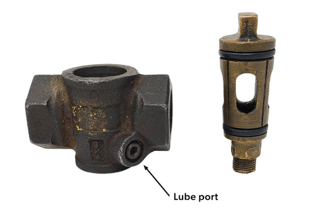

Мастило забезпечує герметичність і легше обертання пробки. Спеціальні канали дозволяють додавати мастило без демонтажу клапана і без переривання роботи системи. Мастило вводиться через отвір у корпусі (рисунок 8) або у верхній частині пробки (рисунок 9).

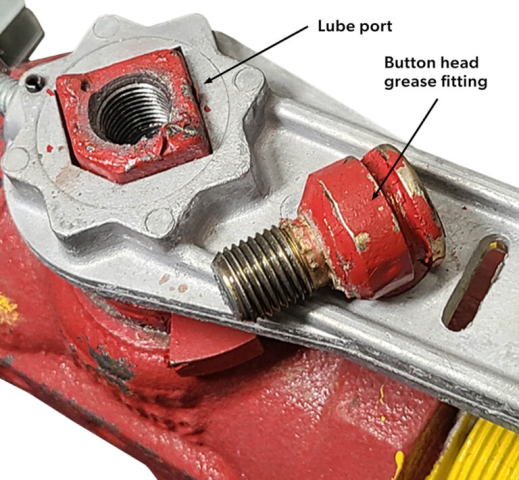

Змазувані газові клапани, встановлені в лічильникових вузлах, обслуговуються газовими компаніями. На рисунку 10 показано три запірні клапани Luboseal™, де середній байпасний клапан зафіксований у закритому положенні, а верхній червоний клапан має діелектричне ізольоване вихідне з’єднання.

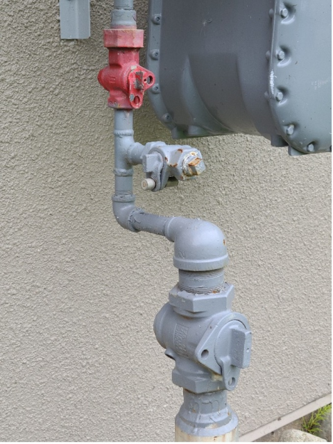

### Дросельні клапани

Існують і інші ручні клапани, що не використовуються для повного запирання потоку у паливних газових системах. У певних випадках їх називають клапанами регулювання подачі (firing rate) або клапанами з обмежувальним отвором (limiting orifice) (рисунок 11). Наприклад, дискові, глобусні та голчасті клапани застосовують для регулювання потоку до пальника, але перед ними обов’язково має бути встановлений сертифікований ручний запірний клапан.

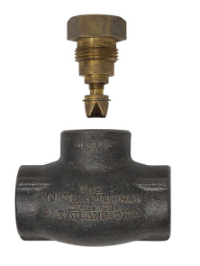

Тепер виконайте самоперевірку 1 і перевірте свої відповіді.

## License

[Block B: Fuel Gas Systems](https://opentextbc.ca/plumbing4b) Copyright © 2025 by SkilledTradesBC is licensed under a [Creative Commons Attribution-NonCommercial-ShareAlike 4.0 International License](https://creativecommons.org/licenses/by-nc-sa/4.0/), except where otherwise noted.