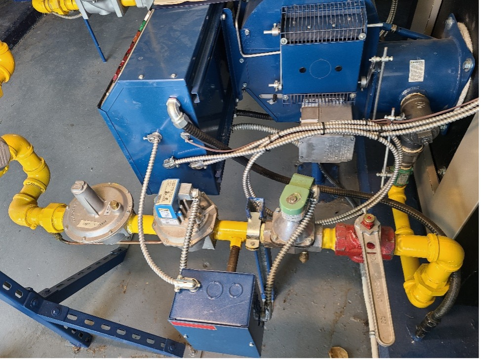

[< -- До підрозділу](README.md)         [Зміст](../../contents.md)

# Навчальне завдання 2. Описати газовий тракт.

https://opentextbc.ca/plumbing4b/chapter/describe-gas-valve-train/

Послідовність регулюючих і захисних елементів від основного запірного клапана приладу до його пальника називається газовим трактом (valve train) або колекторним вузлом (manifold assembly). Компоненти газового тракту використовуються для ручного та автоматичного запуску, зупинки й регулювання подачі газу до приладу. На великих газових установках, зазвичай понад 400 MBH, елементи тракту, розташовані після ручного запірного клапана (рисунок 12), монтуються на місці, оскільки вони не входять до складу самого приладу. Для таких установок вимоги до компонентів газового тракту та їх складання визначені окремим газовим кодексом CSA B149.3.

Рисунок 12. Зібраний на місці газовий тракт

Для установок потужністю менше 400 MBH вузол газового тракту зазвичай постачається вже змонтованим у складі приладу. Хоча спосіб збирання може відрізнятися у різних виробників, усі вони містять елементи, показані на рисунку 13, у тому чи іншому вигляді. Ця схема наведена для ознайомлення, оскільки на ній усі компоненти показані окремими частинами, тоді як у сучасних приладах багато з них об’єднані в одному корпусі клапана.

Підписана схема показує компоненти вузла газового тракту, розташовані в порядку встановлення (зліва направо): основний ручний запірний клапан, автоматичний запобіжний клапан, крани B і A, регулятор приладу, автоматичний газовий клапан, основний і запальний пальники та датчик полум’я.

Рисунок 13. Газовий тракт приладу

Компоненти газового тракту після ручного запірного клапана включають:

- Автоматичний запобіжний клапан — перекриває подачу газу до всього приладу у випадку відмови пальника. Якщо цей клапан перекриває газ як до основного, так і до запального пальника, його називають системою 100% безпеки.
- Кран B — може бути кульовим, але зазвичай є голчастим клапаном, вбудованим у комбінований корпус. Використовується для ізоляції та регулювання подачі газу до запального пальника з метою налаштування полум’я запалу.
- Кран A — ручний запірний клапан, який дозволяє ізолювати компоненти, розташовані далі по потоку, для проведення обслуговування, залишаючи при цьому подачу газу до запального пальника. Не регулює ні тиск, ні витрату — лише відкриває або закриває лінію газу.
- Регулятор приладу — підтримує постійний тиск газу перед пальником (пальниками), навіть при коливаннях вхідного тиску або зміні витрати газу. Це забезпечує стабільне рівне полум’я на основних пальниках. Регулятори розглядатимуться детальніше в навчальному завданні 3.
- Автоматичний газовий клапан — зазвичай живиться змінним струмом напругою 24 В, але може працювати також від мережевої (120 В) або міллівольтової (тисячні частки вольта) системи. Зазвичай він підключається послідовно з контрольним елементом (термостатом, аквастатом або пресостатом), який автоматично вмикає прилад за потреби. Також це може бути неелектричний клапан, керований механічним термочутливим регулятором.

## License

[Block B: Fuel Gas Systems](https://opentextbc.ca/plumbing4b) Copyright © 2025 by SkilledTradesBC is licensed under a [Creative Commons Attribution-NonCommercial-ShareAlike 4.0 International License](https://creativecommons.org/licenses/by-nc-sa/4.0/), except where otherwise noted.