[< -- До підрозділу](README.md)         [Зміст](../../contents.md)

# Навчальне завдання 3. Описати регулятори тиску.

https://opentextbc.ca/plumbing4b/chapter/describe-pressure-regulators/

Тиск у різних системах газопроводів може значно відрізнятися, щоб відповідати різним вимогам і обмеженням системи. Наприклад, у магістральних лініях подачі природного газу або в резервуарах для зберігання пропану тиск є високим, щоб збільшити їхню об’ємну ємність. У той час як максимальний допустимий вхідний тиск для газових приладів зазвичай становить лише ½ фунта на квадратний дюйм (psig). Регулятори тиску використовуються в усій системі газопроводів для підтримання необхідного зниженого вихідного тиску при забезпеченні потрібної витрати газу для задоволення попиту. Регулятори є автономними, самокерованими пристроями, які використовують енергію самої системи для роботи.

Деякі з наведених нижче термінів можуть мати різне вживання, але в цьому підручнику вони визначаються так:

- **Категорія (Category)** – назва, пов’язана з регуляторами, які використовуються для певної мети або в певному місці.
- **Клас (Classification або Class)** – термін, що описує обмеження за тиском або витратою, які можуть існувати в межах категорії.
- **Тип (Type)** – термін, який визначає різні фізичні конструкції та варіанти виконання. Існує багато типів регуляторів у межах однієї категорії, що дозволяє досягати різних робочих характеристик.
- **SCFH** – продуктивність; означає стандартні кубічні фути газу за годину при температурі 70°F і тиску 14,7 PSIA.
- **Сервопривід (Servo) або пілот (Pilot)** – механізм, що приводиться в дію іншим механізмом.

# Призначення

Газові регулятори тиску виконують дві основні функції:

- знижують тиск подачі до безпечного робочого рівня для будівлі або підключених приладів;
- підтримують постійний вихідний тиск незалежно від змін у витраті газу чи у вхідному тиску.

Вихідний тиск регулятора зазвичай можна відрегулювати в певному діапазоні для відповідності вимогам системи.

Деякі регулятори також забезпечують захист від надлишкового тиску, запобігаючи перевищенню номінального тиску елементів системи.

# Категорії регуляторів

У Кодексі установки природного газу та пропану CSA B149.1 визначено чотири категорії регуляторів тиску:

- сервісні регулятори;
- регулятори приладів;
- лінійні регулятори тиску;
- високотискові регулятори.

## Сервісні регулятори

Сервісні регулятори встановлюють на сервісній лінії для зниження тиску газу до необхідного рівня для будівлі. Вузли обліку природного газу обладнані сервісним регулятором (рисунок 14), який встановлюється газовою компанією, а не газовим монтажником.

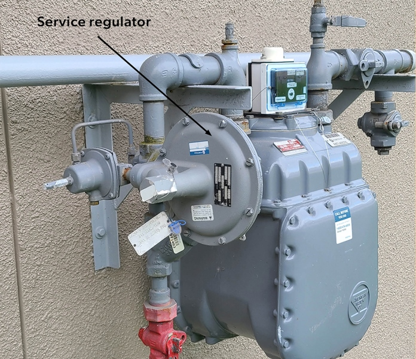

Рисунок 14. Вузол обліку природного газу

Для пропанових систем сервісні регулятори встановлює газовий технік або монтажник між резервуаром для зберігання газу та будівлею. Такі регулятори також називають регуляторами другого ступеня або двоступеневими регуляторами (рисунок 15).

Рисунок 15. Пропанові сервісні регулятори

Максимальні тиски подачі для різних типів будівель наведено в розділі 5.1 газового кодексу CSA B149.1. Наприклад, у приватному житловому будинку максимальний допустимий тиск становить 2 psig.

## Регулятори приладів

Регулятори приладів розташовані у складі газового тракту приладу для зниження вхідного тиску до відповідного тиску в колекторі, необхідного для належної роботи пальників (рисунок 16). Основне призначення регулятора приладу полягає у підтриманні відносно постійного вихідного тиску газу до пальників, щоб забезпечити стабільне рівне полум’я на головних пальниках.

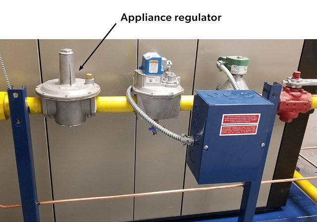

Рисунок 16. Регулятор приладу в газовому тракті

Більшість приладів, що працюють на природному газі, потребують тиску в колекторі від 3 до 4 дюймів водяного стовпа, тоді як прилади на пропані зазвичай потребують тиску від 10 до 11 дюймів водяного стовпа. Для побутових і комерційних приладів типовим є регулятор із максимальним вхідним тиском 0,5 psig (14 дюймів вод. ст.).

Для приладів із теплопродуктивністю менше 400 MBH регулятор приладу часто входить до складу комбінованого газового клапана (рисунок 17). Такі комбіновані клапани зазвичай містять сервокеровані регулятори, здатні знижувати або модулювати тиск у колекторі до 0,5 дюйма водяного стовпа. Комбіновані газові клапани буде розглянуто детальніше в [B1 LT4](https://opentextbc.ca/plumbing4b/chapter/describe-automatic-gas-valves/).

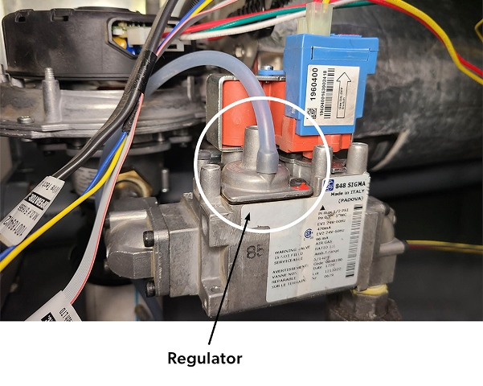

Рисунок 17. Регулятор приладу як частина комбінованого газового клапана

## Лінійні регулятори тиску

Сервісний регулятор часто забезпечує тиск у системі, який перевищує максимально допустимий тиск, установлений для газових приладів. У таких випадках між сервісним регулятором будівлі або сервісним регулятором зрідженого газу (LP-gas) на 2 psig (13,8 кПа) і самим приладом встановлюють лінійні регулятори тиску. Наприклад, сервісний тиск 2 psig потрібно знизити до максимуму 0,5 psig (14 дюймів водяного стовпа), оскільки це є граничним вхідним тиском для більшості регуляторів приладів (рисунок 18).

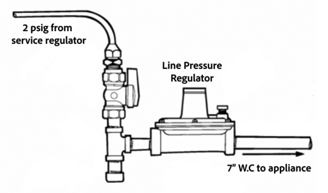

Рисунок 18. Лінійний регулятор тиску

Лінійні регулятори тиску класифікуються відповідно до сфери їхнього застосування і поділяються на регулятори класу I та класу II.

- Регулятори класу I мають максимальний вихідний тиск ½ psig і використовуються переважно у побутових і легких комерційних приладах, для яких максимальний допустимий вхідний тиск становить ½ psig. Вони можуть бути сертифіковані для роботи з вхідним тиском 2, 5 або 10 psig.
- Регулятори класу II мають максимальний вихідний тиск 2 psig і застосовуються переважно в промислових приладах, для яких максимальний вхідний тиск становить 2 psig. Вони можуть бути сертифіковані для роботи з вхідним тиском 5 або 10 psig.

Лінійні регулятори тиску, які використовуються в установках із тиском подачі понад 2 psig, повинні бути оснащені випробуваним і схваленим пристроєм захисту від надлишкового тиску (OPD — Overpressure Protection Device), щоб запобігти перевищенню вихідного тиску понад номінальний для елементів системи.

## Високотискові регулятори

Високотисковий регулятор подібний до лінійного, але використовується в тих випадках, коли вхідний тиск газу перевищує 10 psig (70 кПа), а вихідний становить понад 2 psig (14 кПа). Наприклад, якщо газова лінія заведена безпосередньо до машинного приміщення готелю при максимально допустимому тиску 20 psig для живлення котлів, а далі продовжується до інших споживачів, то перед виходом із машинного приміщення необхідно встановити додатковий регулятор, який знижує тиск до максимуму 5 psig. Інше обладнання в готелі все одно потребуватиме одного чи кількох лінійних регуляторів для зниження тиску до ½ psig перед подачею газу до приладів.

# Типи роботи

Усі регулятори підтримують заданий вихідний тиск для керування витратою газу. Вони працюють за рахунок тиску і не потребують зовнішнього джерела енергії. Усі регулятори поділяються на два основні типи:

- прямої дії (direct-operated);
- пілотні (pilot-operated).

## Регулятори прямої дії

Регулятори прямої дії, також відомі як самокеровані регулятори, є найпростішим і найпоширенішим типом регуляторів тиску. Це автономний вузол, який об’єднує клапан і виконавчий механізм (рисунок 19). Вони безпосередньо використовують тиск після себе (вихідний тиск) для керування положенням клапана, регулюючи витрату газу відповідно до потреби системи.

Рисунок 19. Регулятор прямої дії

Під час роботи регулятор прямої дії вимірює тиск після себе (вихідний тиск) через внутрішній канал або зовнішню контрольну трубку. Цей вихідний тиск протидіє зусиллю пружини, що переміщує діафрагму та запірний елемент клапана, змінюючи розмір прохідного отвору всередині регулятора.

## Пілотні регулятори

Пілотні регулятори застосовуються для великих витрат газу або там, де потрібне точне регулювання тиску. Роботу пілотного регулятора можна спростити, розглядаючи його як два незалежних регулятори, з’єднані між собою (рисунок 20). Менший із них зазвичай є пілотним регулятором. Пілот діє як підсилювач тиску: він вимірює вихідний тиск і створює необхідний навантажувальний тиск на діафрагму основного регулятора. Це підвищує загальну чутливість і точність регулювання.

![A diagram of a pilot-operated regulator. There are two regulators; the pilot regulator, which is smaller, and the main regulator, which is larger. The gas flows in from the left and then continues to the right towards the restricting element of the main regulator as well as flows up to the restricting element of the pilot regulator (inlet pressure, P1). By the pilot regulator, the gas flows past the restricting element and diverges three ways: Up to the pilot’s measuring element (outlet pressure P2), upper right to the loading element of the main regulator (outlet pressure P2), and lower right to the measuring element of the main regulator (loading pressure, PL). There is atmospheric pressure in the loading element of the pilot regulator. The outlet pressure flows out around the main regulator’s restricting element and out the right side.](media/b1-fig-20-pilot-operated-regulator.png)

Рисунок 20. Пілотний регулятор

Оскільки такі регулятори головним чином застосовуються у великих комерційних, промислових та інституційних установках, вони детальніше розглядаються під час навчання за програмою класу «A».

# Робота регулятора

Хоча регулятори прямої дії випускаються у багатьох варіантах конструкцій і виконання, принцип їхньої роботи залишається однаковим. Усі регулятори мають три основні робочі елементи або компоненти, які використовуються для регулювання витрати газу та тиску, як показано на рисунку 21.

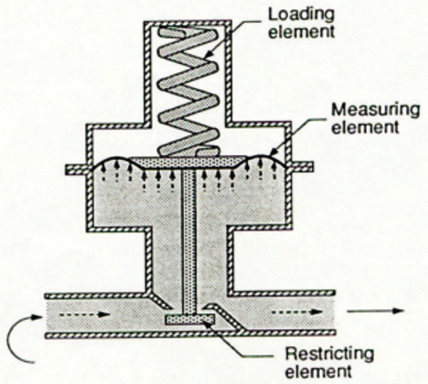

Рисунок 21. Робочі елементи

## Обмежувальний елемент

Обмежувальний елемент складається з корпусу клапана, отвору (сопла), запірного елемента (клапанного диска) та штока (рисунок 22). У сукупності вони керують кількістю потоку, що проходить через отвір. Коли шток рухається вгору, запірний елемент наближається до отвору, обмежуючи потік. Щоб збільшити потік через отвір, шток переміщується вниз — віддаляючи запірний елемент від отвору.

Рисунок 22. Обмежувальний елемент

## Вимірювальний елемент

Вимірювальний елемент забезпечує зворотний зв’язок для регулятора, показуючи, чи відповідає поточна подача газу потребі системи. Зазвичай цим елементом є діафрагма, яка відчуває зміни тиску після регулятора (рисунок 23). Виготовлена з неопрену, вона є дуже гнучкою і зазвичай підтримується металевою пластиною, що дає змогу рівномірно розподілити дію тиску на поверхню діафрагми. Пластина з’єднана зі штоком клапана, тому положення запірного елемента змінюється відповідно до тиску, який діафрагма сприймає через контрольну трубку або внутрішній канал.

Рисунок 23. Вимірювальний елемент

## Навантажувальний елемент

У сучасних регуляторах навантажувальним елементом є пружина, яка врівноважує силу, створювану вихідним тиском на нижній бік діафрагми (рисунок 24). Зусилля відкривання пружини змінюється за допомогою регулювального гвинта. Це дозволяє встановити бажаний вихідний тиск, який називається уставкою регулятора (setpoint).

Рисунок 24. Навантажувальний елемент

## Принцип роботи

Щоб краще зрозуміти роботу та діагностику регуляторів, варто зазначити, що не встановлений регулятор прямої дії перебуває у нормально відкритому (NO) положенні, оскільки для його закриття потрібен тиск газу з боку виходу.

Розглянемо послідовність роботи, ніби це нова газова система, яка щойно починає заповнюватися газом:

- Під час заповнення системи газ проходить через відкритий клапан, і тиск газу після регулятора починає зростати, заповнюючи камеру під діафрагмою. Це змушує діафрагму рухатися вгору, долаючи зусилля пружини. Повітря, що виходить із верхньої камери через вентиляційний отвір (bleed vent), дозволяє діафрагмі вільно рухатись. Рух діафрагми вгору закриває клапан. Кількість тиску після регулятора, необхідна для закриття клапана, безпосередньо залежить від сили, яку створює пружина над діафрагмою. Це і є уставка (setpoint).
- Коли прилад запускається, тиск під діафрагмою знижується, що дозволяє пружині натиснути на діафрагму вниз і відкрити клапан. Повітря, що надходить через вентиляційний отвір, дозволяє діафрагмі рухатися без опору.
- Діафрагма та клапан стабілізуються, коли сила під діафрагмою дорівнює силі, створюваній пружиною. У цей момент регулятор досягає стану рівноваги, і витрата газу та вихідний тиск відповідають вимогам системи.
- Якщо запускаються додаткові прилади або збільшується інтенсивність горіння, діафрагма опускається нижче, і клапан стабілізується в новому положенні щодо отвору, дозволяючи більший потік газу при тому самому тиску уставки.
- Якщо споживання газу зменшується або припиняється, діафрагма рухається вгору, і клапан стабілізується в новому положенні щодо отвору, зменшуючи подачу газу при тому самому тиску. Повітря, що входить або виходить через вентиляційний отвір, дозволяє діафрагмі рухатись вільно.

### Регулювання уставки

Регулятори можна налаштовувати, змінюючи уставку вихідного тиску в межах допустимого діапазону для певної пружини. Бажаний вихідний тиск змінюють, обертаючи регулювальний гвинт у корпусі регулятора (рисунок 25), щоб збільшити або зменшити силу, яку пружина чинить на гнучку діафрагму.

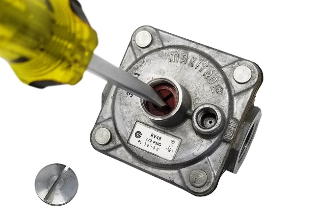

Рисунок 25. Регулювання гвинта налаштування

Використовуйте таку процедуру для зміни уставки:

1. Вимкніть подачу газу.
2. Встановіть обладнання для вимірювання тиску, щоб контролювати тиск після регулятора. Деякі регулятори мають різьбові отвори для під’єднання манометра безпосередньо на корпусі клапана (рисунок 26). Але багато моделей не мають спеціальних з’єднань для приладів, тому потрібно знайти іншу відповідну точку підключення.

 

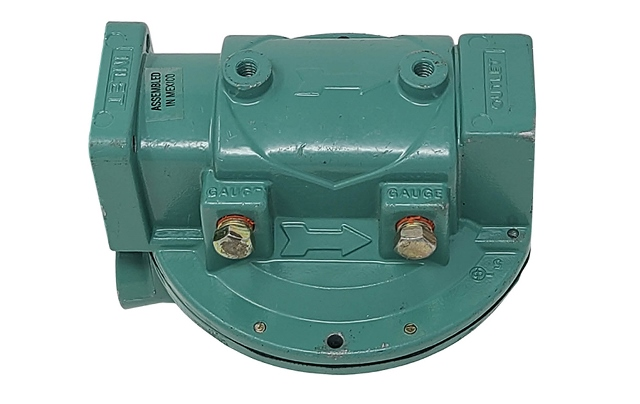

Рисунок 26. Регулятори з портами для перевірки тиску

1. Зніміть захисну кришку регулювального гвинта.
2. Увімкніть подачу газу.
3. Увімкніть прилад або систему, щоб забезпечити подачу газу через регулятор.
4. Спостерігайте за показами тиску та виконайте відповідне регулювання. Щоб підвищити вихідний тиск, поверніть регулювальний гвинт за годинниковою стрілкою, збільшуючи натяг пружини. Щоб зменшити тиск, поверніть гвинт проти годинникової стрілки, зменшуючи натяг пружини.
5. Встановіть кришку на місце.
6. Вимкніть подачу газу.
7. Від’єднайте вимірювальне обладнання.
8. Надійно заглушіть усі точки підключення для вимірювання.
9. Знову відкрийте подачу газу.
10. Перевірте місця підключення на витоки.
11. Переконайтеся, що прилади або пальники після регулятора працюють у безпечному режимі.

# Характеристики роботи

Значення робочих характеристик регулятора часто неправильно розуміють. Ідеально було б, якби регулятор забезпечував широкий діапазон витрат без зниження тиску після себе, але це неможливо. Єдиний спосіб, за якого внутрішні частини регулятора починають рухатись, — це коли діафрагма відчуває зміну вихідного тиску. Щоб збільшити витрату газу через регулятор, обмежувальний елемент має відкритися ширше, а це відбувається лише при зниженні тиску. Якщо регулятор ще не відкрився достатньо, щоб задовольнити попит, вихідний тиск має впасти ще нижче, аби клапан відкрився більше. Ця характеристика відома як **спад (droop)** або **відхилення (offset)**.

## Спад тиску (Droop)

Якщо нанести графік залежності витрати від вихідного тиску для конкретного регулятора, фактична крива його роботи виглядатиме, як на рисунку 27. Для цього регулятора ідеальна уставка відповідає витраті 50 SCFH — лише при цій витраті вихідний тиск точно дорівнює уставці. Коли попит перевищує 50 SCFH, вихідний тиск знижується нижче 1 psig.

За максимальної витрати 500 SCFH через регулятор вихідний тиск дорівнював би 0 psig, що, очевидно, неприйнятно для роботи будь-якого газового обладнання.

Регулятор може пропустити лише певну кількість газу, що залежить від діаметра отвору клапана і вхідного тиску. Зверніть увагу, як швидко продуктивність регулятора падає після того, як клапан відкривається повністю (тобто коли диск відходить від отвору на відстань, що дорівнює ¼ діаметра отвору). У момент критичної витрати газ досягає максимальної швидкості потоку через отвір — це так звана **звукова швидкість** для даного газу. Після цього збільшити витрату через клапан можна лише шляхом підвищення вхідного тиску.

![A line graph showing the regulator performance curve. The X axis shows the Flowrate, from 0 to 500 SCFH. The Y axis shows the Outlet Pressure, from 0 to 1.2 PSIG. The ideal setpoint (outlet pressure) is 1 PSIG. This ideal setpoint (1 PSIG) is made at a flowrate of 50 SCFH. The outlet pressure slowly drops until it reaches the point of actual outlet pressure. The Actual outlet pressure is about 0.7 PSIG as the valve approaches the wide-open position and then is about 0.6 to 0.4 PSIG in the wide-open position. It then quickly drops to 0 PSIG at a flowrate of 500 SCFH, the critical flow point.](media/Figure-27.png)

Рисунок 27. Крива робочих характеристик регулятора

Щоб забезпечити, щоб вихідний тиск залишався якомога ближчим до заданої уставки, виробники зазвичай вказують спад тиску як відсоток від уставки. Для пропану та природного газу типовими є показники точності спаду в межах від 10% до 20%.

На рисунку 28 наведено приклад для точності 20%: опубліковане значення витрати становить 275 SCFH, оскільки це максимальна витрата, за якої робота регулятора ще залишається в межах 20% допустимого відхилення. Якщо фактична витрата газу менша за 275 SCFH, вихідний тиск буде ближчим до заданої уставки. І навпаки, якщо витрата перевищує 275 SCFH, точність регулювання знижується, і регулятор може вже не забезпечити достатній тиск для нормальної роботи обладнання та пальника.

Рисунок 28. Межі точності спаду тиску

## Закриття (Lockup)

Підвищення тиску понад уставку, необхідне для повного закриття клапана, називається **закриттям** або **lock-up** (рисунок 29). Ця характеристика є важливою, оскільки визначає, наскільки ефективно регулятор тиску виконує своє головне завдання — підтримання сталого вихідного тиску.

Зазвичай регулятори, що працюють із вхідним тиском понад 0,5 psig, мають бути типу з позитивним перекриттям (positive shut-off). Це означає, що диск клапана має м’яке ущільнення, а сідло або отвір клапана — конічну оброблену крайку. Такі регулятори зазвичай забезпечують закриття в межах ±10% від початкової уставки вихідного тиску.

Рисунок 29. Характеристика закриття

### Важільні та кулачкові приводи штока

Сервісні, високотискові та лінійні регулятори зазвичай працюють за умов значної різниці тиску між входом і виходом. Для збереження точності регулювання та стабільного закриття в таких випадках зазвичай потрібна більша діафрагма. Аналогічного ефекту можна досягти, використовуючи важіль або кулачковий шток, які збільшують силу, створювану діафрагмою.

Регулятори з важільним або кулачковим приводом (рисунок 30) забезпечують додаткову силу, необхідну для надійного закриття клапана при високому вхідному тиску. Додаткове механічне підсилення також допомагає утримувати диск у стабільному положенні, запобігаючи його коливанням або вібраціям під час роботи![The left image depicts a regulator utilizing a lever to apply additional force for a secure lock-up.The right image is a labeled diagram of a cam stem regulator, showing its main internal components from top to bottom. These include the drilled closing cap with a travel stop to open the relief valve, flapper assembly, adjusting screw, control spring, relief valve opening spring, molded diaphragm, relief valve seat, screen vent, cam stem diaphragm assembly, service tube assembly, end cap, and disk holder.](media/Figure-30.png)

Рисунок 30. Регулятори із важелем і кулачковим механізмом

## Підсилення (Boost)

У попередніх поясненнях роботи регулятори використовувалися із зовнішніми контрольними лініями, які відчувають тиск у точці після регулятора. Графіки характеристик показували, що зі збільшенням витрати регулятор перестає утримувати задане значення через просідання (droop), і зрештою робочий тиск падає нижче прийнятного рівня. Типовіший регулятор має внутрішній порт або трубку сенсування. Прямодіючі регулятори з внутрішнім сенсуванням не лише зазнають просідання, але також мають протидіючу силу, що називається підсиленням (boost), яка може призводити до перевищення вимог щодо точності у верхній частині діапазону. Підсилення можна використати для компенсації просідання, збільшуючи витрату, при якій регулятор зберігає точний контроль тиску.

Регулятор із внутрішнім сенсуванням вимірює тиск усередині корпусу клапана, де потік турбулентний і швидкість висока. У точці поблизу виходу сопла, яка називається vena contracta, швидкість найбільша, а тиск найнижчий. Коли попит на витрату збільшується, швидкість у точці сенсування також зростає, що спричиняє дедалі більшу різницю між тиском у точці сенсування регулятора (у зоні vena contracta) та тиском після регулятора (рисунок 31).

Рисунок 31. Vena contracta

У результаті регулятор із внутрішнім сенсуванням «обманюється» через цей хибно занижений тиск і відкривається більше, ніж відкрився б при сенсуванні тиску через зовнішню контрольну лінію після регулятора. Це збільшення витрати може перетворитися на підвищення точності. Деякі регулятори з внутрішнім сенсуванням мають трубку Піто, щоб розташувати точку вимірювання у оптимальному місці (рисунок 32), так щоб ефект підсилення компенсував просідання, але не створював надмірного підсилення.

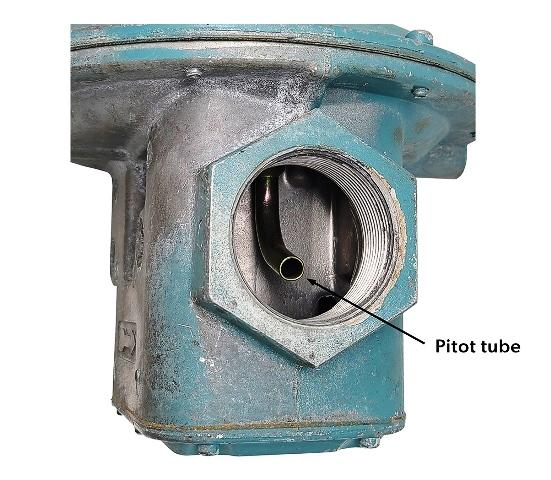

Рисунок 32. Трубка Піто

Підсилення може бути корисним для розширення тієї частини характеристики регулятора, яка потрапляє в опубліковану точність. Рисунок 33 показує приклад регулятора з внутрішнім сенсуванням, у якого підсилення настільки велике, що він майже виходить за верхню межу точності. Для точності 20% максимальна опублікована витрата становила б 450 SCFH, що значно краще порівняно з 275 SCFH, які були б опубліковані для того самого регулятора, про який ішлося раніше, але з зовнішньою контрольної лінією.

![A line graph showing the regulator performance curve and the regulator boost performance curve. The X axis shows the Flowrate, from 0 to 500 SCFH. The Y axis shows the Outlet Pressure, from 0 to 1.2 PSIG. The ideal or setpoint (outlet pressure) is 1 PSIG. Both the normal regulator performance curve and the regulator boost performance curve have an outlet pressure of 1.1 PSIG at a flowrate of SCFH. They both reach the ideal of 1 PSIG at a flowrate of 50 SCFH. The regulator boost performance curve soon increases to 1.2 PSIG (a 20% increase) while the regulator performance curve decreases to 0.8 PSIG (a 20% decrease). The regulator boost performance curve then decreases quickly and reaches the 20% accuracy threshold (0.8 PSIG) at a flowrate of 450 SCFH. Both curves reach 0 PSIG at a flowrate of 500 SCFH.](media/Figure-33.png)

Рисунок 33. Крива підсилення регулятора

## Збалансована діафрагма

Інший метод, який виробники регуляторів використовують для компенсації впливу вхідного тиску на сідло клапана, полягає у додаванні збалансованої діафрагми (рисунок 34). Вхідний тиск, що діє вниз на внутрішній диск клапана, водночас тисне вгору на збалансовану діафрагму. Ефективні площі рівні, тому сили діють однаково в обох напрямках. Збалансована діафрагма приєднана та ущільнена до штока клапана і розділяє нижню область основної діафрагми та верхню секцію клапана. Така конструкція дає змогу підтримувати стабільний контроль вихідного тиску при значних коливаннях вхідного тиску та мінімізувати замикання клапана як при високих, так і при низьких вхідних тисках.

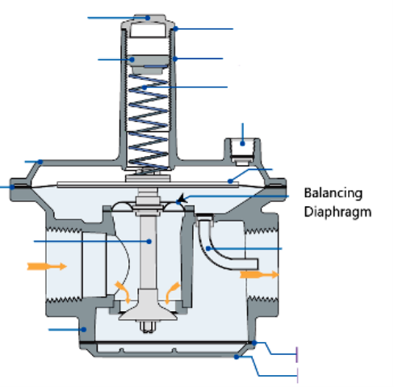

Рисунок 34. Регулятор зі збалансованою діафрагмою

## Вент регулятора

Вент регулятора (атмосферний вент, bleed-vent) є важливою частиною регулятора, настільки важливою, що його іноді називають четвертим робочим елементом регулятора. Він дає змогу повітрю над діафрагмою виходити або заходити, коли діафрагма рухається вгору або вниз. Якщо вент заблокований або частково перекритий, діафрагма не зможе правильно рухатися. Наприклад, якщо вент повністю заблоковано, повітря над діафрагмою «замкнеться» і не дозволить діафрагмі піднятися настільки, щоб закрити обмежувальний елемент. Це призведе до того, що тиск після регулятора підніметься вище встановленого значення.

Якщо вент частково заблокований або обмежений, рух повітря буде затримуватися, коли діафрагма намагається витіснити повітря або втягнути його через отвір вентиля. Це викличе значні коливання тиску після регулятора вище і нижче встановленого значення — явище, відоме як «полювання» або «циклування».

Вент також дозволяє газу виходити назовні, якщо діафрагма розірветься або відкриється внутрішній клапан скидання тиску. Існують спеціальні вимоги до монтажу, які потрібні для контролю можливого виходу газу; вони будуть розглянуті у розділі B-2.

# Пропанові системи

Пропанові системи відрізняються від систем природного газу тим, що тиск пропану в резервуарі змінюється разом із температурою повітря. Тиск у пропановому баку може змінюватися від приблизно 8 psi (55 кПа) взимку до приблизно 220 psi (1500 кПа) влітку. Для будь-якого регулятора, що більша різниця тисків між входом і виходом, то складніше регулятору підтримувати точність. Тому в пропанових системах між баком та приладом зазвичай використовують два регулятори. Наприклад, код CSA B149.1 вимагає двоступеневого редукування для всіх стаціонарних установок і встановлює, що тиск між першим і другим ступенем не повинен перевищувати 10 psi. У холодному кліматі цю максимальну різницю тиску слід зменшити до 5 psi, щоб запобігти переходу пари пропану в рідку фазу.

Якщо виконати двоступеневе редукування, перший ступінь подає майже сталий вхідний тиск 8–10 psi (55–70 кПа) на регулятор другого ступеня. Це означає, що регулятор другого ступеня не мусить компенсувати великі коливання вхідного тиску, оскільки регулятор першого ступеня забезпечує його досить стабільним тиском.

Існує два методи двоступеневої регуляції, показані раніше на рисунку 13:

- два окремі регулятори — один на баку та один на вході в будівлю, або
- один подвійний регулятор, який виконує обидві функції всередині себе. Використовується лише тоді, коли відстань трубопроводу від бака до будівлі не перевищує 30 футів (9 м).

# Механічні пальники

Механічні пальники використовують вентилятор, нагнітач або стиснене повітря для подавання необхідної кількості повітря для горіння, а також можуть допомагати у відведенні продуктів згоряння.

У минулому механічні пальники застосовувались переважно у промислових і великих комерційних системах горіння. Із появою модулюючих конденсаційних технологій, що використовуються в більшості сучасних малих комерційних і побутових приладів, механічні пальники стали дуже поширеними. Часто це попередньо змішувальні пальники, які змішують газ і повітря перед входом у пальниковий порт.

Пальники із змішуванням у соплі змішують газ і повітря безпосередньо під час входу в сопло пальника. І повітря, і газ подаються у пальник під надлишковим тиском (рисунок 35). На приладах зі змінною потужністю (модулюючих) тиск або витрата повітря можуть змінюватися, але тиск або витрата газу також повинні автоматично регулюватися так, щоб залишатися у прямій пропорції до повітря.

Рисунок 35. Пальник із змішуванням у соплі

Аспіраторний (вентурі) тип попередньо змішувального пальника (рисунок 36) використовує повітря високої швидкості, що проходить через трубку Вентурі, щоб захопити і змішати потрібну кількість газу.

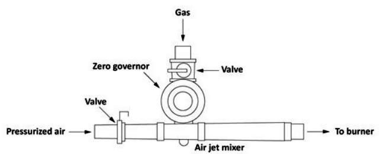

Рисунок 36. Аспіраторний (вентурі) змішувач

Щоб підтримувати пропорційні газоповітряні суміші, модулюючі пальникові системи з трубкою Вентурі потребують регулятора тиску, який може автоматично змінювати витрату газу відповідно до зміни подавання повітря для горіння. Такі регулятори називаються регуляторами нульового тиску або співвідношення.

## Регулятори нульового тиску / співвідношення

Регулятори нульового тиску керують вихідним тиском так, щоб на виході був нульовий надлишковий тиск відносно атмосфери. Вони дозволяють газу текти лише тоді, коли на виході клапана відчувається розрідження. Вони відчувають знижений тиск у вентурі, коли проходить повітря для горіння, і відкриваються пропорційно швидкості потоку повітря.

Це конструкції зі збалансованою діафрагмою з дуже легкою балансувальною пружиною, призначеною лише для компенсації сили від ваги рухомих частин (рисунок 37A).

Для іншого дуже поширеного варіанту, показаного на рисунку 37B, виробники просто додали врівноважувальну пружину на нижній бік диска клапана в їхньому регуляторі зі збалансованою діафрагмою. Протидіюча пружина компенсує сили вниз, створені пружиною встановлення і вагою рухомих частин. Слід зазначити, що такі регулятори залежать від гравітації, тому їх не можна встановлювати догори дриґом.

Рисунок 37. Регулятори нульового тиску

Ці регулятори ідеально підходять для газових двигунів та модулюючих аспіраторних пальників, оскільки вони автоматично змінюють подавання газу відповідно до будь-яких змін у потоці повітря через змішувач Вентурі (рисунок 38).

Рисунок 38. Схема змішувача Вентурі

Комерційні та побутові модулюючі/конденсаційні котли й проточні водонагрівачі мають усі компоненти в одному зібраному пальниковому модулі (рисунок 39). Серворегулятор нульового тиску вбудований у комбінований газовий клапан. Замість дросельної заслінки для регулювання потоку повітря для горіння використовується двигун змінної швидкості на нагнітачі, який змінює повітряний потік. Коли нагнітач модулює свою продуктивність відповідно до потреби в теплі, регулятор нульового тиску змінює подавання газу, автоматично забезпечуючи пропорційне змішування.

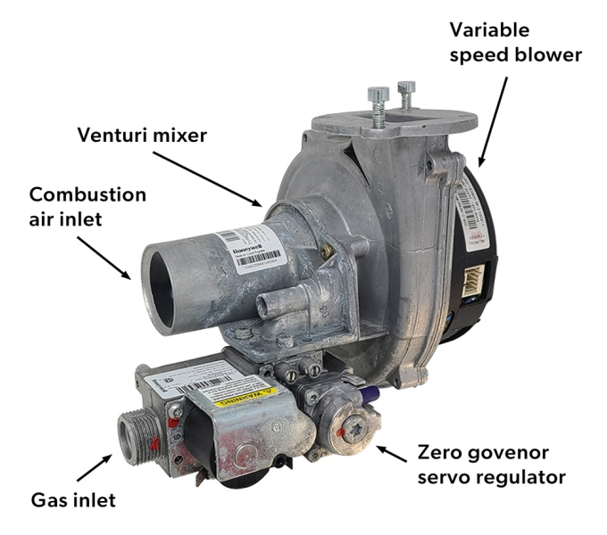

Рисунок 39. Пальниковий вузол із змішуванням у Вентурі

Для пальників із змішуванням у соплі регулятор співвідношення (вирівнювальний регулятор) подає газ до пальника під тиском, який знаходиться у прямій (1:1) пропорції до тиску повітря, що подається до пальника (рисунок 40). Коли тиск повітря на пальник зростає, регулятор співвідношення спричиняє зростання тиску газу на обмежувальному соплі. І навпаки, коли тиск повітря зменшується, тиск газу також зменшується. Регулятор співвідношення є регулятором нульового тиску, до якого під’єднано трубку сенсування до вентиля bleed-регулятора. Ця лінія подає повітряний тиск у камеру діафрагми, збільшуючи зусилля навантажувального елемента. У результаті тиск газу встановлюється так, щоб відповідати тиску повітря для горіння. Коли тиску повітря немає, такий регулятор нульового тиску повертається в закрите положення.

![A labelled diagram of a nozzle mixer schematic. Combustion air and gas flow from separate entrances fed separately into the burner. Combustion air flows into the blower, through a butterfly valve, through a pressure gauge that measures the pressure of the air, through an orifice, and into the burner. There is a sensing tube after the butterfly valve that loads air pressure into the diaphragm chamber of the gas line. The gas flows through a valve, into the equalizing regulator, through a pressure gauge that measures the pressure of the, through an orifice, and into the burner. The system ensures that the air and gas pressure air are the same.](media/Figure-40.png)

Рисунок 40. Схема змішувача соплового типу

## License

[Block B: Fuel Gas Systems](https://opentextbc.ca/plumbing4b) Copyright © 2025 by SkilledTradesBC is licensed under a [Creative Commons Attribution-NonCommercial-ShareAlike 4.0 International License](https://creativecommons.org/licenses/by-nc-sa/4.0/), except where otherwise noted.