[< -- До підрозділу](README.md)         [Зміст](../../contents.md)

# Навчальне завдання 4. Описати автоматичні газові клапани

https://opentextbc.ca/plumbing4b/chapter/describe-automatic-gas-valves/

Порівняно з ручними газовими клапанами, які передбачають безпосередню дію через важіль або маховик, автоматичні клапани керуються електричними, гідравлічними або пневматичними сигналами від сенсорів. Такі клапани можуть бути налаштовані на відкривання, закривання або модуляцію потоку газу.

Як уже зазначалося під час розгляду компонентів газового тракту у завданні LT2, автоматичні клапани керують подачею газу до пальників приладу. У газовому тракті автоматичні клапани використовуються з двома основними цілями:

- як запобіжний клапан, що вимикає подачу газу у разі відмови системи;
- як робочий клапан, що забезпечує нормальну подачу й припинення подачі газу до пальників під час їхньої роботи.

Для приладів із теплопродуктивністю менше 400 MBH автоматичний запобіжний клапан і робочий клапан зазвичай об’єднані в одному корпусі у вигляді **комбінованого газового клапана**. Спосіб їхнього спрацьовування і послідовність відкривання-закривання часто залежать від типу системи контролю полум’я, яка використовується. На цьому етапі може бути корисно ознайомитися з компетенцією сантехніка 3 рівня E-6 — *Вибір систем контролю полум’я (Flame Safeguards)*.

Скорочення та терміни, що використовуються в цьому навчальному завданні:

- **VAC** – вольти змінного струму (Volts Alternating Current)
- **VDC** – вольти постійного струму (Volts Direct Current)
- **mV DC** – міллівольти постійного струму (Millivolts Direct Current)
- **NTC** – негативний температурний коефіцієнт; описує терморезистор, опір якого *зменшується* зі зростанням температури
- **PTC** – позитивний температурний коефіцієнт; описує терморезистор, опір якого *збільшується* зі зростанням температури
- **HIS** – гаряче поверхневе запалювання (Hot Surface Ignition), також відоме як «світловий стрижень» (Glow Bar)
- **DSI** – пряме іскрове запалювання (Direct Spark Ignition)
- **ECO** – відсічення енергії (Energy Cut-Off)
- **TCO** – температурне відсічення (Temperature Cut-Off)
- **FVIR** – захист від займання горючих парів (Flammable Vapour Ignition Resistant)
- **FV sensor** – датчик горючих парів (Flammable Vapour sensor)

# Автоматичний запобіжний клапан

Автоматичний запобіжний клапан — один із найважливіших елементів у газовому тракті. Він може бути окремим компонентом або частиною комбінованого газового блока. Його функція полягає в тому, щоб припинити подачу газу, якщо існує ризик накопичення газу без контрольованого джерела запалювання. Такий клапан перекриває газ при знеструмленні системи безпеки згоряння, спрацьовуванні граничного вимикача або втраті робочого середовища. Найчастіше запобіжні клапани керуються електричним способом.

# Автоматичний робочий клапан

Автоматичний газовий клапан зазвичай спрацьовує від сигналу датчика, який дозволяє подачу газу до пальників, де відбувається запалювання. Існує багато типів автоматичних газових клапанів з різними датчиками і методами активації. Два найпоширеніші способи роботи:

- **Електричний** – керуюче коло подає або знімає напругу на електромагнітний соленоїд, який відкриває або закриває клапан. Зазвичай такі схеми працюють від 24 VAC, але можуть також використовувати 120 VAC або mV DC.
- **Механічний (неелектричний)** – керування здійснюється механічним датчиком, наприклад, капілярною трубкою з сильфоном або стрижнем і трубкою, що безпосередньо діють на клапан.

# Електричні газові клапани

Більшість автоматичних газових клапанів керуються електричним способом і призначені для подачі газу до основних або запальних пальників.

## Соленоїдний клапан

Соленоїдний газовий клапан працює за основним принципом електромагнітної котушки, який застосовується й у складніших типах клапанів. Коли керуюче коло активується, воно подає напругу на магнітну котушку, яка притягує якір (шток клапана) всередину котушки, піднімаючи запірний диск з сідла клапана. Це дозволяє газу надходити до пальника. Коли контролер вимикає подачу сигналу, котушка розмагнічується, і диск клапана опускається на сідло під дією власної ваги та тиску газу з боку подачі (рисунок 41).

Рисунок 41. Соленоїдний клапан

Деякі моделі можуть також мати легку пружину, яка допомагає почати рух запірного елемента вниз, але в усіх випадках закривання клапана відбувається під дією власної ваги диска і штока. Тому такі клапани необхідно встановлювати у вертикальному положенні. Цей тип клапана працює лише від електричних кіл із напругою 120 або 24 В змінного струму (VAC) і зазвичай використовується в запальних (пілотних) лініях приладів із великою тепловою потужністю (рисунок 42).

Рисунок 42. Соленоїдний клапан пілотного пальника

## Термоелектричний клапан

Термоелектричні газові клапани живляться постійним струмом, який надходить від термопари або термобатареї (термопіли). Одним із прикладів є запобіжний клапан безперервного пілота, що живиться від термопари, яка генерує близько 30 мілівольт. Такі термоклапани часто називають *Pilotstat*, оскільки вони термічно контролюють наявність полум’я запального пальника. Поки полум’я запалу присутнє — головний пальник може запалюватися безпечно. Якщо полум’я запалу відсутнє, подача газу має бути припинена.

Якщо потік газу перекривається як до головного, так і до запального пальника, система вважається 100% безпечною. В інших системах перекривається лише подача до головного пальника, тоді як газ до запального продовжує подаватися — така система називається неповністю безпечною (80% safe) або “вільний пілот” (wild pilot).

На рисунку 43 показано три можливі положення запобіжного клапана для системи з безперервним пілотом:

- У положенні A термопара знеструмлена, клапан закритий — газ не подається ні до запального, ні до головного пальника.
- У положенні B натиснута кнопка скидання. Газ може надходити лише до запального пальника, де він запалюється вручну. Поки кнопка утримується, термопара нагрівається полум’ям запалу й подає живлення на електромагніт.
- У положенні C, коли термопара достатньо нагріта, вона виробляє напругу, достатню для утримання головного клапана у відкритому стані після відпускання кнопки. Тепер газ подається як до запального, так і до автоматичного робочого клапана головного пальника.
- Якщо полум’я запалу згасає, термопара охолоджується, електромагніт знеструмлюється, фіксатор звільняється, і клапан повертається у положення A.

Рисунок 43. Робота автоматичного запобіжного клапана

Час спрацьовування є важливим фактором для автоматичних запобіжних клапанів. Максимальний час реакції на згасання полум’я (F.F.R.T.) — це проміжок часу між моментом зникнення полум’я та знеструмленням газового клапана:

- 90 секунд для газів, легших за повітря, коли теплопродуктивність приладу не перевищує 400 MBH.
- 20 секунд для газів, важчих за повітря, коли теплопродуктивність приладу не перевищує 400 MBH.
- 4 секунди для приладів із теплопродуктивністю понад 400 MBH.

На рисунку 44 показано модуль соленоїда типу pilotstat (силовий блок), знятий із комбінованого газового клапана водонагрівача накопичувального типу, з під’єднаною термопарою. Модуль витягнуто з корпусу клапана відповідно до його внутрішнього розташування. Зверніть увагу, що pilotstat є першим внутрішнім компонентом після входу газу в комбінований клапан. Отже, газ повинен пройти через запобіжний клапан, перш ніж потрапить до внутрішнього термостатичного автоматичного газового клапана.

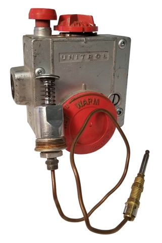

Рисунок 44. Комбінований газовий клапан водонагрівача

## Діафрагмовий клапан

Діафрагмовий газовий клапан (рисунок 45) є соленоїдним клапаном із пілотним керуванням, тобто він використовує наявний вхідний тиск газу як основну силу для відкривання або закривання клапана.

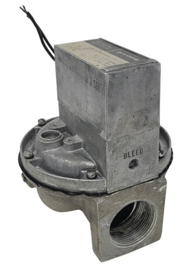

Рисунок 45. Діафрагмовий газовий клапан 1 ½”

Такі клапани є простими автоматичними клапанами типу «ввімкнено/вимкнено» і не регулюють та не модулюють потік газу (рисунок 50):

1. Коли надходить запит на нагрів, електромагніт збуджується.
2. Електромагніт притягує якір у положення, яке перекриває отвір тиску, дозволяючи газу над діафрагмою виходити через вентиляційний отвір до постійного пілотного полум’я (рисунок 46, ліворуч).
3. Перепад тиску на діафрагмі стає більшим за силу пружини, тому діафрагма піднімає запірний диск із сідла клапана, дозволяючи газу проходити до пальника.
4. Коли запит на нагрів задоволено, електромагніт знеструмлюється, і зворотна пружина якоря переміщує його у положення, яке перекриває вентиляційний отвір (рисунок 46, праворуч).
5. Робочий газ із боку подачі надходить у отвір тиску та заповнює простір над діафрагмою.
6. Коли тиски над і під діафрагмою вирівнюються, пружина опускає клапан у закрите положення. Після закриття площа нижньої сторони, на яку діє тиск газу, зменшується, унаслідок чого додаткова сила зверху збільшує притискання запірного елемента до сідла клапана.

Примітка: схема не в масштабі, оскільки отвір тиску насправді має розмір шпилькового отвору; тому якір і електромагніт можуть перекривати потік газу з дуже малою силою. Це дає змогу діафрагмовим клапанам працювати при низькій напрузі, наприклад у міллівольтових системах.

![The left diagram provides a detailed breakdown of the valve’s components from top to bottom, including the armature return spring, circuit leads, electromagnet, and armature. The armature pivots to close off the vent port, which is also labeled along with the pressure port, diaphragm, diaphragm spring, gas flow direction, valve disc, and valve seat. The right diagram focuses on the gas flow, showing how gas enters through the inlet, passes through the labeled pressure port, and moves into the diaphragm chamber, demonstrating the valve’s function in regulating gas flow.](media/Figure-46.png)

Рисунок 46. Робота діафрагмового газового клапана

Хоча такий тип діафрагмового клапана сьогодні використовується рідко, він добре ілюструє важливий принцип, який і досі застосовується в більшості автоматичних газових клапанів. На рисунку 47 показано інший, більш поширений варіант діафрагмового газового клапана. Зверніть увагу на деякі відмінності:

- внутрішній дренажний канал відводить газ назад у вихідну камеру;
- запірний диск перевернуто, а робочий тиск газу діє на нижній бік діафрагми;
- зворотна пружина якоря стискається, коли електромагніт збуджується;
- обмежувальний отвір (сопло) регулює швидкість відкривання клапана.

Рисунок 47. Діафрагмовий газовий клапан із внутрішнім дренажем

## Комбіновані газові клапани

Комбіновані газові клапани поєднують у собі деякі або всі компоненти газового тракту в одному блоці. Для приладів із теплопродуктивністю менше 400 MBH (120 кВт) зазвичай у корпусі одного клапана об’єднують усі елементи газового тракту (рисунок 48).

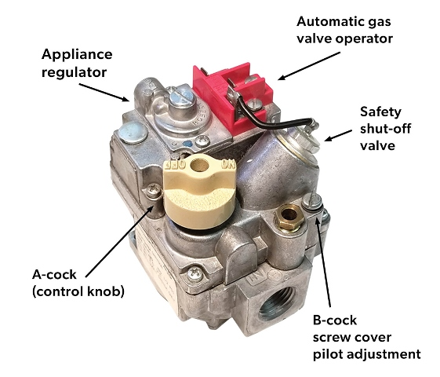

Рисунок 48. Комбінований газовий клапан на міллівольтах

Для приладів із більшою теплопродуктивністю комбінований газовий клапан може об’єднувати лише кілька компонентів, наприклад автоматичний робочий клапан і регулятор. Діафрагмовий регулювальний газовий клапан діаметром 1 дюйм, показаний на рисунку 49, може використовуватись для основних пальників із теплопродуктивністю до 1000 MBH. Це клапан повільного відкривання, який керує подачею газу до головного пальника (вмиканням і вимиканням) і водночас підтримує тиск у колекторі на рівні 3,5 дюйма водяного стовпа.

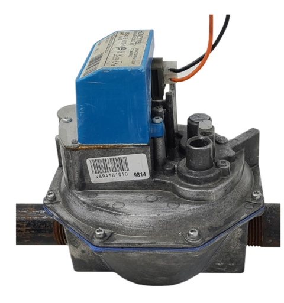

Рисунок 49. 1” комбінований регулювальний діафрагмовий газовий клапан

### Робота регулювального діафрагмового газового клапана

Регулювальний діафрагмовий газовий клапан також називають сервокерованим (Servo gas valve), оскільки в його складі є малий сервопілот-регулятор, який визначає положення сідла діафрагми. Сервоклапан працює за тим самим принципом, що й діафрагмовий клапан: він подає невелику кількість газу з боку подачі до робочої камери діафрагми. Але якщо діафрагмовий клапан працює лише в режимах «відкрито/закрито», то сервоклапан може також виконувати функцію регулятора тиску, частково відкриваючи або закриваючи основне сідло клапана.

Етапи роботи:

Коли контролер не дає запиту на тепло (рисунок 50), котушка соленоїда дренажного клапана (bleed  valve) не збуджена. Плунжер приводу знаходиться внизу, перекриваючи вентиляційний отвір. Вхідний газовий тиск проходить через обмежувальний отвір і вниз по дренажному каналу, створюючи тиск під основною діафрагмою клапана. Тиск газу однаковий над і під діафрагмою. Сила пружини та те, що площа нижньої поверхні діафрагми більша, утримують клапан у закритому стані.

Рисунок 50. Сервоклапан з діафрагмою у закритому стані

Коли надходить запит на тепло, соленоїд дренажного каналу збуджується і піднімає плунжер дренажного клапана (рисунок 51). Газ під основною діафрагмою виходить через дренажний канал і далі через відкритий серворегулятор до вихідної камери основного клапана. Тиск газу над основною діафрагмою тепер долає силу пружини та знижений тиск газу під діафрагмою, і основний клапан відкривається. (Зверніть увагу: газ у верхній камері може виходити швидше через отвір серворегулятора, ніж надходити через малий обмежувальний отвір. Інакше нижня камера не змогла б «скидатися» й клапан не відкрився б.)

Рисунок 51. Сервоклапан з діафрагмою повністю відкритий

У міру того як тиск на виході основного клапана зростає, він передається через чутливий до тиску порт на нижній бік діафрагми серворегулятора (рисунок 52). Це підвищення тиску змушує серворегулятор стискати свою навантажувальну пружину. Серводиск підіймається, і потік газу, що виходить через дренаж, обмежується.

У результаті тиск у робочій камері діафрагми зростає, і основний клапан наближається до свого сідла, зменшуючи витрату газу.

Серворегулятор постійно відстежує тиск на виході основного клапана та керує швидкістю дренування, створюючи такий тиск у робочій камері, який утримує основний запірний диск у положенні, що забезпечує потрібну витрату газу при заданому тиску уставки.

![A labeled diagram of a Servo diaphragm valve in the throttled position. The components are highlighted in clockwise order, starting from the left side: inlet receiving 7” of water column, restrictor, bleed valve operator, bleed valve plunger in the open position, Servo regulator adjustment screw, Servo regulator valve partially closed, pressure sensing port, outlet delivering 3.5” of water column, main valve and diaphragm in the partially closed position, working gas pressure chamber, and the bleed line for main diaphragm control.](media/Figure-52.png)

Рисунок 52. Дроселювання сервоклапана з діафрагмою

Після того як контролер задовольнив запит на тепло або у разі зникнення живлення, соленоїдна котушка знеструмлюється, і клапан повертається в закрите положення, показане на рисунку 50.

Попередні схеми були створені з навчальною метою. Реальне розташування внутрішніх компонентів і напрям руху деталей буде відрізнятися на заводських розрізах виробників (рисунок 53), але принцип використання малого сервопілотного регулятора для встановлення положення основного сідла клапана залишається незмінним.

Зверніть увагу, що запобіжний клапан тепер є першим внутрішнім елементом у складі клапана. Цей розріз показує внутрішню будову клапана, подібного до того, який був зображений на рисунку 49.

Як і в будь-якому регуляторі, невеликий серворегулятор має вентиляційний отвір над діафрагмою, що дозволяє вільний рух повітря в і з верхньої камери діафрагми. Оскільки ці клапани встановлюються всередині приміщень, у вентиляційному отворі передбачене вбудоване обмежувальне сопло, яке зменшує кількість газу, що може вийти у разі пошкодження діафрагми серворегулятора.

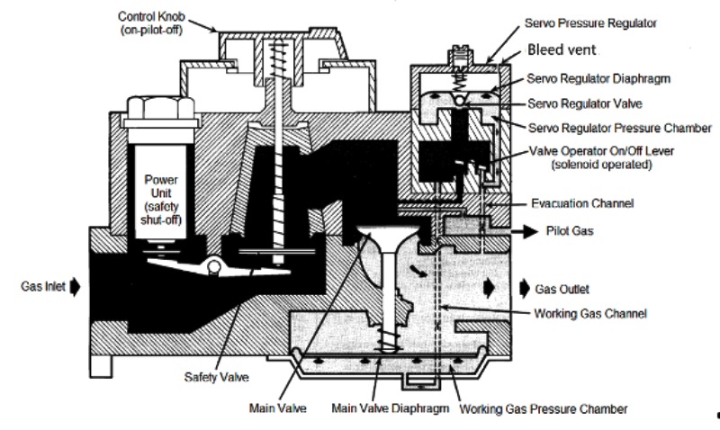

Рисунок 53. Комбінований сервогазовий клапан

### Резервовані (redundant) газові клапани

Починаючи з 1979 року всі комбіновані газові клапани для опалення повинні бути двосідельними клапанами або — у міллівольтових системах — супроводжуватися додатковим запобіжним елементом, що відключає живлення клапана. Для цього в комбіновані газові клапани вбудовують другий автоматичний запобіжний клапан. Цей другий (резервний) клапан забезпечує додатковий рівень захисту від потрапляння газу в камеру згоряння у разі, якщо основне сідло клапана пропускатиме газ у закритому положенні.

Резервний газовий клапан також є діафрагмовим клапаном сервокерованого типу, подібним до показаного на рисунку 53. Якщо порівняти з рисунком 54, можна побачити, що котушка резервного клапана використовує соленоїдний привід на 24 В змінного струму, а не 30 мВ, як у запобіжному клапані, зображеному на рисунку 53.

Якщо система працює з періодичним запальником (intermittent pilot), послідовність роботи така:

1. Коли напруга на клапан не подається, і основний, і пілотний клапани перебувають у закритому стані, а газ утримується на вхідному порту пілотним клапаном.
2. Контролер подає запит на тепло і після попередньої продувки живить котушку пілотного клапана, відкриваючи пілотний клапан. Пілотний газ подається під вхідним тиском і не регулюється — його можна лише дроселювати внутрішнім голчастим клапаном (не показано).
3. Газ надходить до запального пальника, де запалюється іскровим запалювачем. Після підтвердження наявності полум’я системою контролю полум’я іскровий запалювач вимикається.
4. Полум’я запального пальника підтверджене й контролюється; тоді живиться котушка основного клапана. Газ проходить через внутрішній канал у робочу камеру під діафрагмою, відкриваючи основний клапан, і надходить до основного пальника, де запалюється від пілотного.
5. Серворегулятор відстежує тиск на виході основного клапана і регулює швидкість дренування, створюючи робочий тиск, який утримує основний запірний диск у положенні, що відповідає необхідній витраті та тиску уставки.
6. Коли запит на тепло знімається, контролер розмикає контакти, і обидві соленоїдні котушки — пілотного та основного клапанів — знеструмлюються, подача газу припиняється.

![A labelled diagram of the redundant gas valve internal flow. The inlet of the gas valve is on the left, with the inlet pressure tapping above. The gas passes through the inlet screen. Above is the pilot (redundant) valve coil which controls a restricting element. The gas flows past the pilot valve and towards the main valve. The gas is diverted up the working gas channel by the main valve coil and down into the working gas pressure chamber, opening the main valve. The servo regulator, with a regulator cap, regulator adjustment screw, and regulator vent (leak limited), controls the servo bleed rate of bypass gas. The servo regulator is near the main valve coil and the bypass gas is released after the main valve. The main valve diaphragm is on the bottom and controls the main valve restricting element. After the main valve, there is outlet pressure tapping. The gas passes through the outlet screen and finally exits the outlet.](media/Figure-54_Redundant-gas-valve-internal-flow.jpg)

Рисунок 54. Внутрішній потік у резервованому газовому клапані

Клапан також може бути налаштований для роботи з електронною системою запалювання, яка запалює основний пальник без використання пілотного полум’я. У системах HSI або DSI для основного пальника використовується кабельний жгут, який одночасно подає живлення на приводи як пілотного, так і основного клапанів. У цьому випадку в підключення пілотної лінії вкручується різьбова заглушка (рисунок 55).

Кришка вентиляційного отвору регулятора, показана на рисунку, виконує лише роль пилозахисної кришки, оскільки обмежувальне сопло для запобігання витоку газу в разі пошкодження діафрагми інтегровано всередині вентиляційного каналу.

Рисунок 55. Універсальні комбіновані резервовані газові клапани

У деяких типах резервованих газових клапанів, що використовуються лише у системах прямого запалювання (DSI/HSI), обидва приводи електрично з’єднані всередині, і пілотного відбору газу немає (рисунок 56). Цей клапан також спроєктований максимально компактним. Зверніть увагу на велику камеру діафрагми регулювального клапана, видиму збоку цього вузла.

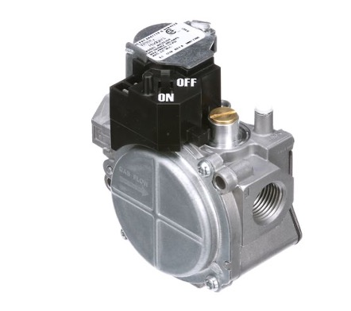

Рисунок 56. Компактний газовий клапан для прямого запалювання

Крім того, оскільки подача газу на пілотний пальник не потрібна, основне та резервне сідла клапанів об’єднані в один двосідельний соленоїдний клапан (рисунок 57). Регулювальний клапан утримується в закритому положенні до того моменту, поки основне сідло клапана не подасть тиск газу на нижній бік діафрагми через робоче сопло та канали (показано не всі). Далі робочий тиск газу керується серворегулятором, який задає положення регулювального клапана.

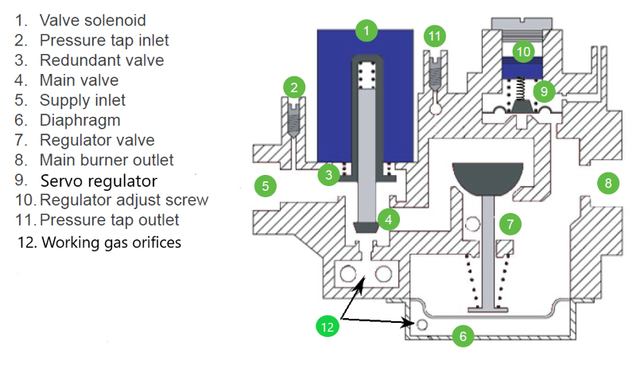

Figure 57. Внутрішній потік у двосідельному резервованому газовому клапані. [*Опис зображення*](https://opentextbc.ca/plumbing4b/chapter/describe-automatic-gas-valves/#b1fig57_desc)

### Референтний тиск серворегулятора

Багато сучасних приладів точно налаштовуються під змінні умови, при цьому забезпечуючи стабільний тиск газу в камері згоряння. Щоб розглядати такий клапан, важливо розуміти, що перепад тиску на пальниковому жиклері визначається тиском у газовому колекторі приладу. Зазвичай це різниця між тиском у колекторі та атмосферним тиском навколишнього середовища на виході жиклера.

У більшості високоефективних газових печей повітря для горіння подається в прилад індукційним вентилятором, і в камері згоряння утворюється неатмосферний тиск, у цьому випадку негативний або вакуум (рисунок 58). Це змінює різницю тисків на газовому жиклері і, відповідно, витрату газу до пальників. Тиск у колекторі повинен дорівнювати необхідному перепаду тиску на жиклері (∆P) плюс тиску в камері згоряння.

Наприклад, якщо жиклер розрахований на перепад ∆P у 4 дюйми водяного стовпа, а в камері згоряння є негативний тиск (вакуум) 1 дюйм водяного стовпа, тоді серворегулятор необхідно відрегулювати вниз до 3 дюймів водяного стовпа, щоб підтримувати правильну подачу газу (∆P 4" + (−1") = 3").

------

![Two labelled diagrams of sealed combustion chamber pressures. On the left diagram, labels and arrows indicate the parts and flow within the high efficiency gas furnace. Combustion air is drawn through the top and then is heated with a burner. The air flows into the Primary heat exchanger and the exhaust gases flow through three 180-degree curves in the pipes. It then flows into the secondary heat exchanger, through the induced draft fan that is drawing in the combustion air, and out the exhaust vent. At the bottom is the house air blower that draws in cold air and then blows it upward, causing it to be heated as it goes up, and then the hot house air is blown out of the supply plenum. On the right diagram, labels and arrows indicate the pressures of a sealed combustion chamber. At the start, the pressure is the gas valve regulator pressure setting. As it continues, width of the opening narrows at the orifice, which results in the orifice/manifold pressure. As it exits the orifice, it changes to the combustion chamber pressure.](media/Figure-58.png)

Рисунок 58. Тиски герметичної камери згоряння

Кожна установка матиме різні конфігурації вентиляції, що може призвести до різного впливу на величину вакууму в камері згоряння. Додатково будуть коливання через зміну барометричних умов. Під’єднавши компенсаційну трубку тиску камери згоряння до отвору відводу (bleed vent) регулятора серво­регулятора газового клапана, негативний тиск камери згоряння подається на сторону навантажувального елемента діафрагми регулятора (рисунок 59). Це дозволить регулятору автоматично змінювати тиск у колекторі й підтримувати постійний перепад тиску на жиклері. Компенсований тиск у колекторі часто називають *референтним тиском колектора*. Зверніть увагу, що до референтної трубки також під’єднані два датчики тиску як частина системи безпеки запалювання, щоб перевіряти, що вентилятор працює належним чином.

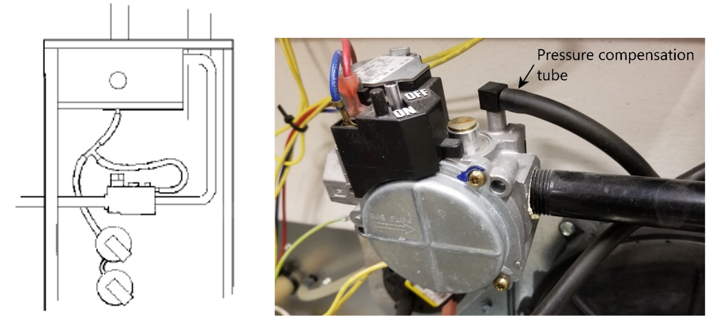

Рисунок 59. Референтна трубка камери згоряння

## Ступінчасті та модуляційні комбіновані газові клапани

Для високоефективних конденсаційних приладів важливо намагатися узгодити теплову потужність із потребою системи в теплі. Зменшення подачі газу під час низького навантаження забезпечує максимальну ефективність приладу. Існує кілька підходів до зміни подачі газу, які залежать від типу приладу та необхідного діапазону регулювання. Два найпоширеніші способи змінної подачі:

- багатоступенева подача
- повна модуляційна подача

### Багатоступенева подача

Багатоступеневе вироблення тепла ділить загальну теплову потужність на декілька приростів або ступенів. У міру збільшення навантаження ступені вмикаються послідовно. Багатоступенева подача багато років застосовується на комерційних теплових установках шляхом розподілення загального теплового навантаження між кількома модуляційними котлами.

Побутові повітряні печі часто є двоступеневими. Нижча подача дає змогу агрегату економити енергію та зменшувати температурні коливання, працюючи більш безперервно. У більшості випадків піч працює на малому вогні. Якщо зовнішня температура різко падає, піч може перейти у режим великого вогню, щоб підтримати потрібну температуру в будівлі.

Двоступеневий газовий клапан використовується з двоступеневим термостатом для подачі палива в кількостях, необхідних для забезпечення ступінчастого теплового навантаження (рисунок 60). Клапан має два серворегулятори, що дає змогу подавати нижчий тиск у колекторі й менше палива при першому ступені нагріву. Коли друга ступінь активується, серворегулятор великого вогню запускається, і до пальника подається 100 відсотків подачі палива. Зверніть увагу, що цей корпус клапана дуже подібний до одного з попередніх зображень, але має додаткову кришку регулювання серворегулятора та ще одне електричне підключення для активації сервоперемикального соленоїдного клапана. Типові діапазони тиску: малий вогонь 1–1,5 дюйма водяного стовпа; великий вогонь 3–4 дюйми водяного стовпа.

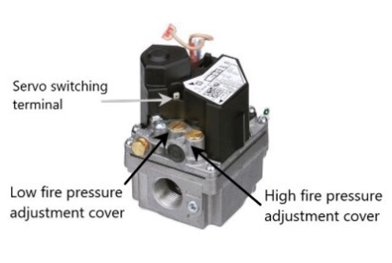

Рисунок 60. Двоступеневий резервований газовий клапан

### Модуляційна подача

Коефіцієнт регулювання газового пальника — це відношення максимальної теплової потужності до мінімального рівня теплової потужності, на якому прилад може працювати ефективно або контрольовано. Повністю модуляційний контролер пальника змінює теплову потужність відповідно до навантаження в усьому діапазоні регулювання. Наприклад, конденсаційний котел на 100000 BTU/год із коефіцієнтом регулювання 10:1 може забезпечувати теплове навантаження від 100000 до 10000 BTU/год і будь-яке значення між ними.

У цьому процесі газовий пальник має підтримувати правильне співвідношення паливо–повітря в усьому діапазоні теплових потужностей, щоб забезпечити максимальну ефективність горіння та роботи котла. Це завдання виконує електронний контролер, який аналізує низку робочих параметрів, щоб визначити потрібну теплову потужність.

Виробники газових приладів зазвичай використовують один із двох підходів до модуляції тиску за допомогою комбінованого газового клапана:

- регуляція типу «нульовий губернатор» (zero governor) або співвідношення (ratio regulation);
- електричні модуляційні приводи.

#### Модуляція типу zero governor/ratio

Концепцію змішувачів Вентурі та регуляції zero governor було наведено в навчальному завданні 3. У цьому випадку модуляційний пальник із механічним змішуванням використовує вентилятор змінної швидкості для регулювання потоку повітря для горіння. Щоб зберігати пропорційне змішування, регулятор zero governor у складі комбінованого газового клапана автоматично змінює подачу газу відповідно до подачі повітря. Ці зміни потоку залежать від величини розрідження, створюваного швидкістю повітря в трубці Вентурі (рисунок 61). Пам’ятайте, що регулятор zero governor намагається підтримувати атмосферний тиск у точці P2. Як і всі інші серворегулятори, він використовує вхідний тиск для створення необхідного робочого тиску на робочу діафрагму, яка переміщує робочий клапан у потрібне положення.

![A drawn figure (left) and a picture (right) of a modulating venturi burner. In the drawn figure, it shows that air flows in from the top and bottom of the venturi. A blower pushes the air into the venturi and then through the injector, at which point the system tries to maintain the atmospheric pressure at P2. There are labels and lines indicating the bleed vent, zero governor servo regulator, operating valve, and working diaphragm. In the picture, labels and arrows show the two points where air flows into the modulating venturi burner.](media/Figure-61.png)

Рисунок 61. Модуляційний пальник Вентурі

Як уже пояснювалося раніше, регулятори типу zero governor керують вихідним тиском із метою отримання нульового тиску відносно атмосфери. Вони дозволяють подачу газу лише тоді, коли на інжекторі відчувається негативний тиск, який передається на нижній бік діафрагми серворегулятора. Верхній бік діафрагми серворегулятора через відвідний отвір (bleed vent) відчуває тиск навколишнього повітря. Для приладів із прямим відводом повітря подача повітря, показана на рисунку 64, здійснюється через трубу. Ця труба створює певний опір всмоктуванню вентилятора; відповідно, повітря, що подається до трубки Вентурі, уже буде під невеликим негативним тиском. Важливо, щоб регулятор не сприйняв цей додатковий негативний тиск на інжекторі як такий, що створюється Вентурі, і не подав надто багато газу. Якщо відвідний отвір також відчуває той самий негативний тиск подачі повітря на верхньому боці діафрагми, цей негативний тиск компенсується, і регулятор відчуває лише розрідження, створене швидкістю потоку у Вентурі.

Для багатьох невеликих настінних котлів і проточних водонагрівачів (рисунок 62) труба подачі повітря під’єднана тільки до корпусу приладу. Сервісна кришка має ущільнення, яке відокремлює подачу повітря для горіння від приміщення, фактично перетворюючи корпус приладу на повітропровід для входу вентилятора. Тому відвідний отвір регулятора zero governor, який також розташований у корпусі, відчуває той самий тиск, що й вхід вентилятора.

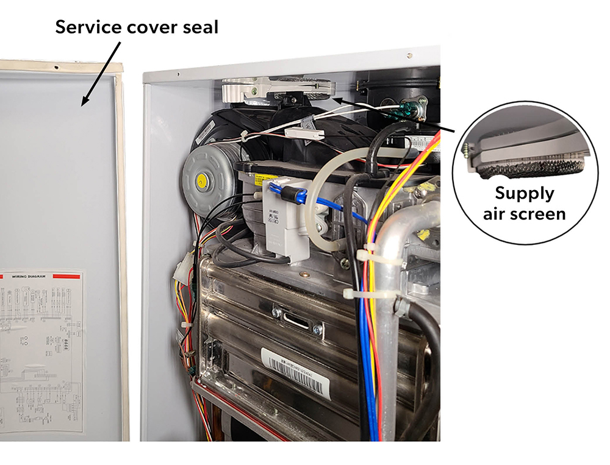

Рисунок 62. Підключення подачі повітря

У деяких модуляційних пальниках зі змішуванням типу Вентурі труба подачі повітря під’єднана безпосередньо до входу вентилятора (рисунок 63). У таких випадках компенсаційна трубка тиску буде під’єднана вище за течією від трубки Вентурі до відвідного отвору (bleed vent) серворегулятора zero governor. Це нейтралізує негативний тиск, створений опором повітропроводу подачі повітря.

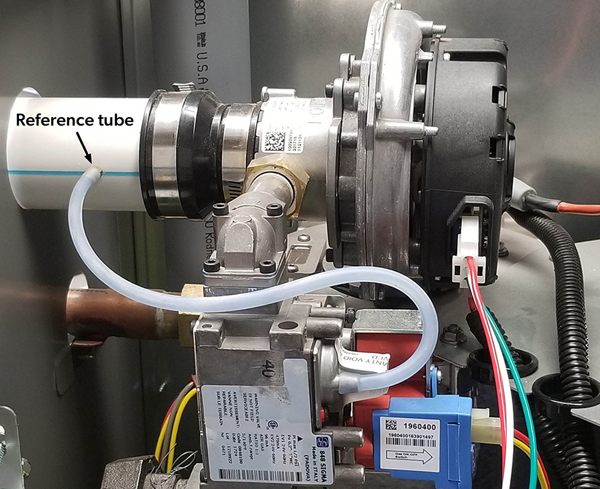

Рисунок 63. Референтна трубка zero governor

#### Модуляційні електричні приводи

Інший підхід до модуляції тиску газового клапана полягає в тому, щоб замінити регулювальний гвинт і пружину серворегулятора на електричний привід. Модуляційні електричні приводи мають внутрішню систему, яка встановлює положення вихідного вала пропорційно вхідному керуючому сигналу. На відміну від приводів типу «вкл/викл», модуляційні приводи не обов’язково проходять повний хід від відкритого до закритого положення за один рух, а переміщуються лише відповідно до зміни вхідного керуючого сигналу. Зазвичай аналоговий керуючий сигнал становить 0–10 В DC або 4–20 мА. Пропорційне позиціювання визначається вхідним сигналом, наприклад 0–10 В, де 0 В — закрито, 10 В — відкрите, 5 В — 50% відкриття. Таким чином привод може змінювати налаштування колекторного тиску від низького до високого вогню або будь-яке проміжне положення залежно від сигналу контролера. Контролер постійно відстежує вихідний тиск та інші датчики зворотного зв’язку системи, щоб коригувати налаштування серворегулятора.

Існує два типи електричних позиціонувальних приводів, що використовуються у комбінованих газових клапанах для регулювання навантажувального зусилля серворегулятора:

- модуляційні соленоїдні приводи
- крокові приводи (stepper motors)

Серворегуляторна частина комбінованого діафрагмового газового клапана, показаного на рисунку 64, має модуляційний соленоїдний привід. Зверніть увагу, що існують налаштовувані обмежувачі максимального й мінімального тиску. На зображенні видно, що соленоїд утримує вихідний вал приблизно посередині його повного діапазону ходу. Це положення встановлює зусилля пружини приблизно на 50% від її діапазону уставок тиску. Деякі прилади налаштовують максимальний тиск за допомогою потенціометра на контролері, щоб обмежити вихідний керуючий сигнал у режимі високого вогню.

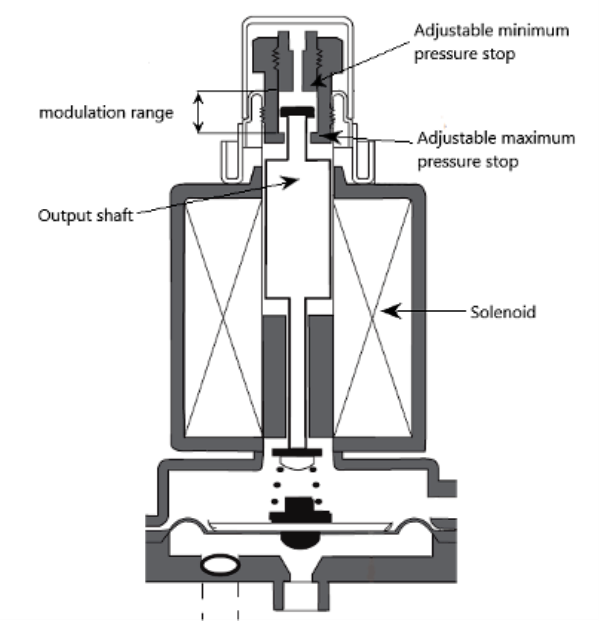

Рисунок 64. Модуляційний соленоїдний серворегулятор

Використання крокового двигуна є ще одним поширеним способом модуляції уставки серворегулятора. Обертовий оператор на базі двигуна постійного струму використовується для повертання гвинта регулювання тиску до потрібного значення. Наприклад, клапан, показаний на рисунку 65, має той самий корпус і внутрішні елементи, що й раніше наведені резервовані газові клапани на рисунках 56 і 57, але з додаванням оператора на основі крокового двигуна. Такі клапани можуть забезпечувати повний діапазон модуляції від 35 до 100% з кроком 1%. Зверніть увагу, що кроковий двигун обертає різьбовий шпиндель, який переміщує регулювальну гайку вгору або вниз, змінюючи уставку тиску газу.

Рисунок 65. Комбінований газовий клапан із кроковим двигуном

## Саможивлені автоматичні газові клапани

Саможивлені газові керувальні клапани мають соленоїди, які працюють від 750 мВ, що постачаються термопарою, нагрітою запальною пальником. Зверніть увагу, що клеми живлення на комбінованому клапані на рисунку 66 позначені як TP (Thermopile). Інші виробники також використовують позначення PP (powerpile) або PG (pilot generator). Цей клапан має окреме під’єднання для термопари, що є необхідною конфігурацією для приладів із прямим відводом продуктів згоряння, яким потрібна швидкодійна реакція на згасання полум’я. Є також ручний регулювальний диск основного пальника, який фактично є продовженням регулювального гвинта серворегулятора. Тиск запальної пальника не регулюється і має окремий регульований голчастий клапан.

Рисунок 66. Комбінований мілівольтовий газовий клапан

У цьому клапані запальна пальник має розділене полум’я: швидкодійна термопара живить ланцюг аварійного вимкнення, а термобатарея живить основний клапан (рисунок 67). На газових обігрівачах без димоходу така ж швидкодійна термопара використовується зі спеціальною запальною пальником ODS (датчик зниження вмісту кисню). Якщо вміст кисню в приміщенні зменшується, запальне полум’я піднімається від термопари, охолоджуючи її, що спричиняє закриття газового клапана і вимкнення обігрівача.

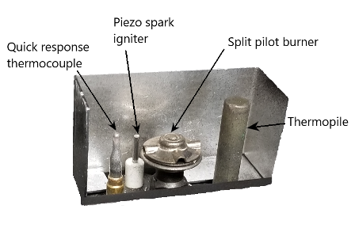

Рисунок 67. Мілівольтний запальник

Інша конфігурація мілівольтового газового клапана використовує термобатарею для живлення як кола безпеки запальника, так і головного клапана. На рисунку 68 видно, що і запальний клапан, і основний клапан під’єднані паралельно до термобатареї (TP). Термостат (TH) буде лише вмикати та вимикати основний клапан.

Оскільки термобатареї потрібно більше часу, щоб охолонути й закрити запальний клапан, їх використовують лише в приладах з природною тягою, яким не потрібне швидке вимкнення у разі згасання полум’я.

Рисунок 68. Схеми під’єднання мілівольтового газового клапана

## Газовий клапан з живленням від батарей

Щоб відповідати стандартам ефективності, каміни з постійним пілотним полум’ям поступово замінюються на електронні системи запалювання з низьковольтним живленням постійного струму, які використовують звичайні сухі елементи живлення як джерело енергії. Блок приймача/контролера має відсік для встановлення чотирьох батарей AA або окремий батарейний тримач, що під’єднується до модуля (рисунок 69).

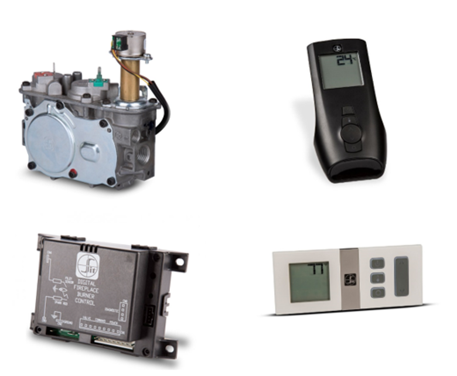

Рисунок 69. Система керування каміном з живленням від батарей

Усі компоненти керуючого кола будуть від одного виробника, спроєктовані для роботи один з одним на 6 В DC. Такі системи можуть містити опції модуляції висоти полум’я та теплової потужності як частину температурного керування.

# Газові клапани для водонагрівачів накопичувального типу

Подібно до раніше розглянутих комбінованих газових клапанів, керувальні клапани для накопичувальних водонагрівачів мають кілька компонентів в одному блоці. Залежно від типу газового клапана деякі функції безпеки та роботи можуть включати:

- ручне вимкнення
- регулятор тиску
- гвинт регулювання запальника
- аварійне вимкнення
- керування температурою води
- обмежувач максимальної енергії (ECO)
- термозахист камери згоряння (TCO)
- стійкість до займання парів ЛЗР (FVIR)

Для більшості типів газових клапанів накопичувальних водонагрівачів корпус клапана містить датчик температури води (аквастат), розміщений у гільзі занурення. Увесь клапан вкручується в отвір у стінці бака, щоб закріпитися та занурити датчик у воду.

Керувальні клапани накопичувальних водонагрівачів поділяють на дві категорії: із запальником, що горить постійно, або з періодичним (intermittent) запалюванням. Інше поширене групування — неелектричні (стрижень і трубка) або електричні.

## Типи з постійним запальником

Газові клапани накопичувальних водонагрівачів із постійним запальником бувають двох типів: неелектричні (rod and tube) або саможивлені (millivolt). Однією з переваг традиційних накопичувальних водонагрівачів із постійним запальником є здатність виробляти гарячу воду під час відключення електроенергії.

Типи з постійним запальником (Unitrol) потребують запального вузла, що включає термопару або термобатарею і п’єзозапальник (рисунок 70). Якщо полум’я запальника з будь-якої причини згасне, внутрішній клапан аварійного вимкнення запальника буде знеструмлений і закриється.

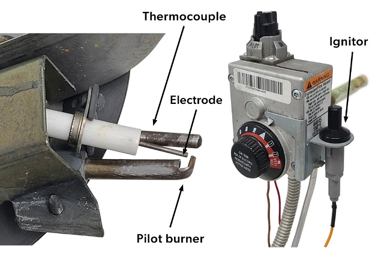

Рисунок 70. Компоненти неелектричного газового клапана накопичувального водонагрівача з постійним запальником

### Неелектричні газові клапани типу rod and tube

У газовому клапані rod and tube основний пальник активується термомеханічним датчиком, що складається з мідної трубки та стрижня з інвару. На рисунку 71 край мідної трубки сточено, щоб показати внутрішній стрижень. Мідна трубка має високий коефіцієнт розширення і стискання, тоді як стрижень усередині виготовлений із металевого сплаву інвару, який має дуже низький коефіцієнт розширення та стискання. Трубка й стрижень з’єднані лише з боку зануреної частини, тому зміна температури води викликає розширення або стискання мідної трубки, змушуючи робочий кінець інварового стрижня рухатися вперед і назад у корпусі газового клапана.

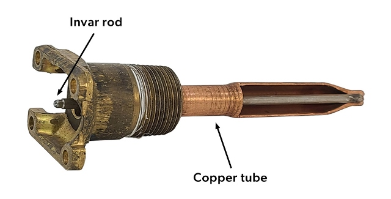

Рисунок 71. Температурний датчик типу rod and tube

Верхня схема на рисунку 72 показує клапан у закритому положенні, тому основний пальник вимкнений. У міру охолодження води в баку мідна трубка стискається, і кінець інварового стрижня натискає на важіль, повільно переміщуючи клацальний механізм. Нижня схема на рисунку 72 показує, що після того, як внутрішній диск проходить свою центральну точку, клацальний механізм відкриває газовий клапан, і газ надходить до основного пальника. Зазвичай температура води опускається приблизно на 8 °C (15 °F) – 11 °C (20 °F) від уставки, перш ніж пальник увімкнеться.

Під час нагрівання мідна трубка розширюється і переміщує інваровий стрижень праворуч, віддаляючи його від клапана. Це дозволяє клацальному механізму повернутися у звичайне положення, а пружині клапана — закрити клапан. Положення температурного регулятора визначає максимальну температуру води, яку термостатично контролює мідна трубка. Обертання температурного регулятора переміщує регулювальний стрижень вперед або назад, змінюючи положення важеля та температуру, при якій інваровий стрижень активує клацальний механізм.

![Two labelled diagrams showing the rod and tube temperature sensor. In the upper diagram, the valve seat is closed. The clicker snap mechanism is to the right of center, farther away from the valve seat. A lever is attached to the clicker snap mechanism, the adjustment rod, and the invar rod within the copper tube. Around the top of the copper tube is the shank and a pipe leading to the water tank. In the lower diagram, the valve seat is open. Gas is flowing in towards the adjustment rod and the clicker snap mechanism is snapped over the center. The cooler water makes the copper contract, and the invar rod moves towards the left, pushing the clicker snap mechanism.](media/Figure-72.png)

Рисунок 72. Робота системи Rod and Tube

#### Обмежувач максимальної енергії нагрівання (ECO)

Пристрій *energy cut-off* (ECO) є обмежувачем безпеки, який використовується в газових клапанах типу rod and tube. ECO — це температурно-чутливе плавке з’єднання, увімкнене послідовно між термопарою та пілотстатом, тому 30 мВ, що виробляє термопара, проходять через нього на шляху до котушки пілотстата. На рисунку 73 мідну трубку розрізано, щоб показати запобіжник, розташований поруч з інваровим стрижнем.

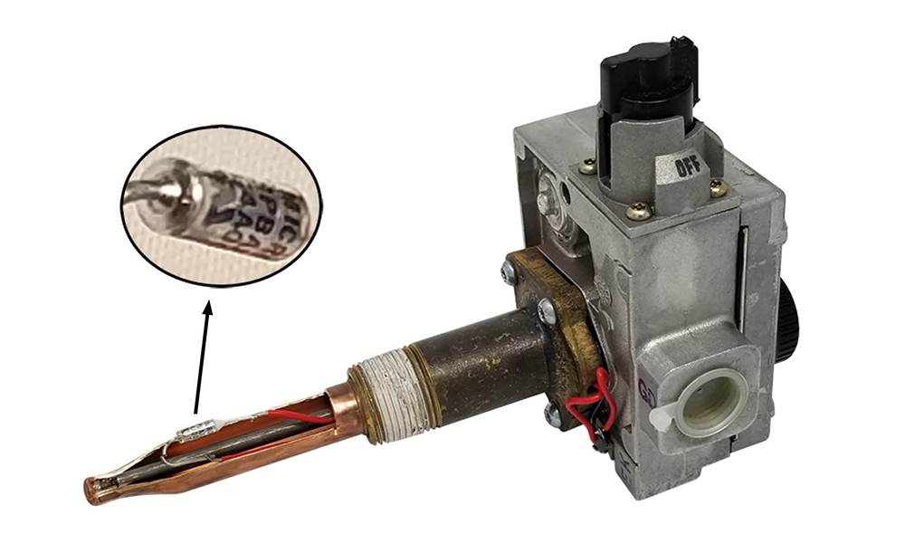

Рисунок 73. Поперечний розріз ECO

Якщо відбудеться відмова газового клапана, що спричинить підвищення температури води понад 93 °C (200 °F), ECO розплавиться, розірвавши ланцюг безпеки та припинивши подачу газу до пальників. ECO є одноразовим захисним елементом, і для повернення водонагрівача в роботу потрібно замінити весь газовий клапан.

#### Термозапобіжник камери згоряння (TCO)

Система безпеки накопичувального водонагрівача також містить ручний відновлюваний захисний вимикач, призначений для вимкнення газового регулятора/термостата у випадку надмірної температури в камері згоряння. *Thermal cut-off* (TCO) встановлюється у внутрішні дверцята герметичної камери згоряння та вмикається послідовно в ланцюг безпеки разом з ECO (рисунок 74).

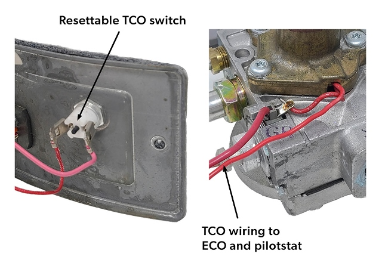

Рисунок 74. TCO і схеми під’єднання

Надмірні температури в камері згоряння можуть бути спричинені перешкодою для потоку повітря для горіння, наприклад накопиченням ворсу та пилу на полум’ягаснику (розташованому під камерою згоряння). TCO також є частиною виробничої системи *flammable vapour ignition resistant* (FVIR), оскільки спрацьовує у разі займання будь-яких займистих парів, таких як бензин, усередині камери згоряння.

### Саможивлені системи

У саможивленому типі газового клапана водонагрівача з постійним запальником використовується термобатарея замість термопари. Використання термобатареї на 750 мВ дозволяє полум’ю запальника генерувати достатньо електричної енергії для живлення плати управління всередині газового клапана (рисунок 75). TCO камери згоряння як і раніше вмикається послідовно з двома проводами термобатареї (червоним і білим), які під’єднуються до передньої частини газового клапана, де вони з’єднуються з платою управління (мікроконтролером).

Мікроконтролер збирає інформацію про роботу нагрівача, видає коди помилок через світлодіодний індикатор стану та керує роботою основного пальника. Замість системи rod and tube температуру води визначають два однакових терморезистори типу *negative temperature coefficient* (NTC), розташовані в гільзі занурення. Терморезистори є теплочутливими змінними резисторами, тому зміна температури води змінює їхній опір. Плата керування інтерпретує опір терморезисторів, щоб точно визначати температуру води та вмикати або вимикати пальник. Наявність двох терморезисторів забезпечує резервування: якщо мікроконтролер читає різну температуру з двох датчиків, система переходить у режим помилки. Клеми COM — це комунікаційне під’єднання, яке дає змогу виробнику водонагрівача під’єднувати додаткові аксесуари, наприклад таймер або Wi-Fi контролер.

Рисунок 75. Саможивлений газовий клапан водонагрівача

Газовий клапан складається з п’яти основних компонентів (рисунок 76); їх сконструйовано так, що будь-який з них може бути замінений без необхідності міняти весь керувальний клапан або зливати бак, оскільки пластикова задня плита та гільза занурення можуть залишатися встановленими.

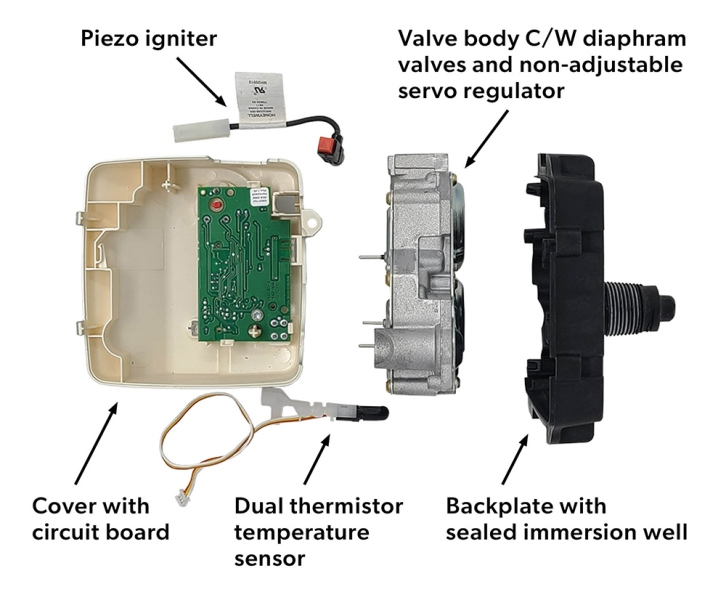

Рисунок 76. Розділені основні компоненти

## Типи з періодичним запалюванням (електричні)

Накопичувальні водонагрівачі з вищими показниками ефективності мають електронне запалювання замість постійного запальника. Вони також можуть мати вентилятори примусового відведення, заслінки та конденсаційні теплообмінники. Такі водонагрівачі потребують живлення 120 В AC для роботи вентилятора і не можуть виробляти гарячу воду під час відключення електроенергії.

Деякі моделі та марки газових клапанів мають внутрішній трансформатор, що перетворює 120 В AC на 24 В AC для живлення газового клапана, тоді як інші використовують безпосередньо 120 В AC для роботи газового клапана (рисунок 77).

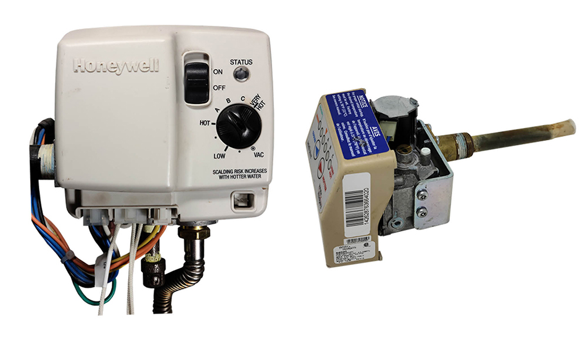

Рисунок 77. Дві поширені моделі електричних газових клапанів для накопичувальних водонагрівачів

Ці клапани також використовують два NTC-терморезистори в гільзі занурення для вимірювання температури води (рисунок 78). На додачу до керування газовим клапаном для підтримання температури води, внутрішній мікроконтролер також активує, контролює та проводить самодіагностику вентилятора димоходу, періоду пропродувки, датчика тиску димоходу, електричного запальника, електронного датчика полум’я, температурного вимикача димоходу, обмежувача максимальної температури води (ECO) та датчика займистих парів (FV).

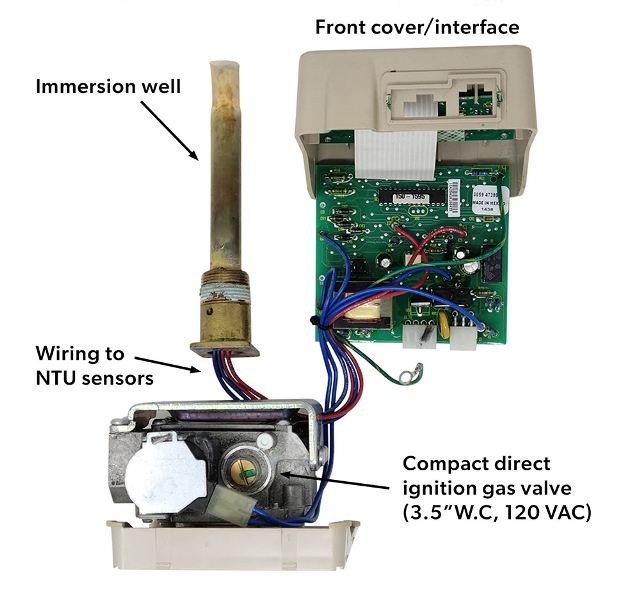

Рисунок 78. Розібраний електричний газовий клапан

### Стійкість до займання парів легкозаймистих речовин

Для водонагрівачів із примусовим відведенням продуктів згоряння електричні газові клапани використовують датчик парів легкозаймистих речовин (FV-sensor) як частину системи FVIR, щоб виявляти такі пари до того, як вони потраплять у камеру згоряння. Це відрізняється від водонагрівачів із постійним запальником, де TCO реагує вже на займання парів усередині камери згоряння.

Датчик FV розташований зовні, у нижній передній частині водонагрівача, всередині захисного пластикового кожуха. На рисунку 79 пластиковий кожух знято, а датчик від’єднано від основи. Зверніть увагу, що в захисному корпусі датчика багато повітряних отворів; якщо вільний доступ повітря до датчика заблокований або закритий пилом, листям, водою тощо, він не працюватиме.

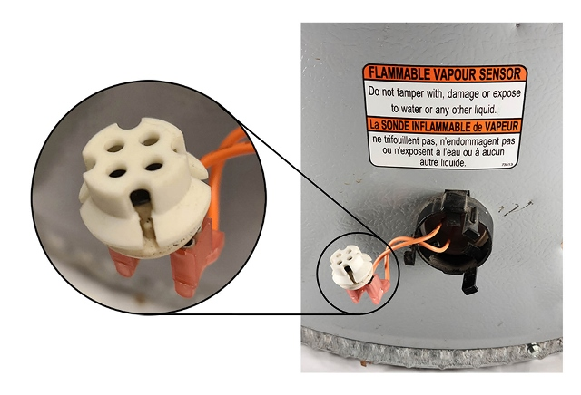

Рисунок 79. Датчик FV

Якщо датчик FV виявляє наявність займистих парів під час роботи водонагрівача, газовий керуючий модуль переходить у режим блокування, і водонагрівач вимикається. Якщо водонагрівач не працює в момент виявлення парів, керування також переходить у режим блокування та не дає приладу запалитися.

Після інциденту із займистими парами та після того, як пари розсіються, датчик FV має автоматично скинутися. Проте контролер газового клапана може залишатися у режимі блокування й вимагати ручного скидання. У більшості випадків займання парів усередині камери згоряння не відбувається, оскільки датчик FV встигає виявити ці пари та вимкнути водонагрівач.

Датчик повинен мати електричну провідність, щоб невеликий струм міг проходити через нього, сигналізуючи газовому клапану про відсутність парів бензину. Датчик FV легко перевірити мультиметром і можна замінити, просто під’єднавши новий до клем.

На водонагрівачах із постійним запальником TCO також захищав пристрій від обмеженого притоку повітря для горіння. Натомість у цих електричних моделях замість TCO використовується температурний вимикач димоходу (HLS), показаний на рисунку 80 як частина вентиляційного блока.

![A labeled Honeywell connection diagram illustrating the wiring connections between the blower unit and the control module. Starting from the top left of the diagram, the blower unit includes a series of safety switches, listed in clockwise order: the high limit switch (HLS), connected by a red wire; the normally open vacuum switch (VS) (NO), connected by a yellow wire; and the normally closed vacuum switch (VS) (NC), with the yellow wire completing the circuit back to the high limit switch. The wiring to the motor originates from a power cord, with black, white, and green wires connected to the motor. These wires continue to the control board. Additionally, a blue wire connects to the motor to regulate the fan speed. At the gas control module, connections include a pilot-electrode assembly, a water temperature sensor (WTS), and a flammable vapour sensor (FVS).](media/Figure-80.png)

Рисунок 80. Схема під’єднання Honeywell

# Неелектричні газові клапани

Окрім газового клапана типу rod and tube існує низка інших неелектричних газових клапанів. Деякі з них використовуються для регулювання температури, інші — як спеціалізовані захисні клапани.

## Гідравлічні

Гідравлічно керовані газові клапани — це різновид неелектричних газових керуючих клапанів, що застосовуються для регулювання температури в плитах, камінах і окремих опалювальних приладах. Такі прилади мають запальник, а гідравлічний виконавчий механізм керує тільки подачею газу до основного пальника. Гідравлічні приводи також називають гідравлічними термостатами або пристроями з капілярною трубкою, оскільки оператор складається з чутливої колби, заповненої рідиною з високим коефіцієнтом розширення.

Коли колба відчуває зміну температури, змінюється об’єм рідини. Зміна об’єму передається по капілярній трубці до герметичної гофри, яка розширюється або стискається. Герметична гофра зазвичай діє на дисковий механізм швидкого спрацювання, подібний до датчика rod and tube, і вимагає мінімальної зміни температури для різкого відкривання або закривання. На рисунку 81 показано клапан за температури нижчої за уставку, коли клапан перебуває у відкритому положенні.

Рисунок 81. Компоненти клапана з капілярною трубкою

На рисунку 82 показано типовий керувальний клапан із діафрагмовим приводом, який може комплектуватися різними типами виконавчих механізмів, одним із яких є гідравлічний тип, що не потребує джерела живлення.

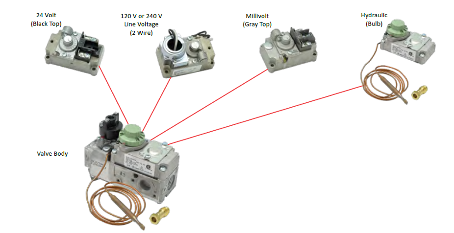

Рисунок 82. Варіанти виконавчих механізмів

Крім клапанів із різким спрацюванням, коли клапан повністю відкритий або закритий, більшість виробників клапанів також мають модуляційні типи (snap-throttle, modusnap). Модуляційний гідравлічний термостат подібний до варіанту з різким спрацюванням, за винятком того, що клапан спочатку різко відкривається та закривається на попередньо встановленому мінімальному поданні. Якщо температура продовжує знижуватись, подання змінюватиметься між повним і мінімальним. На рисунку 83 показано клапан, у якому запобіжний пілотний клапан утримується у відкритому положенні термопарою. Температура відповідає уставці, тому двосідельний клапан закритий.

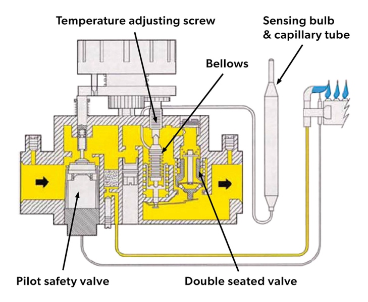

Рисунок 83. Модуляційний гідравлічний клапан у закритому положенні

На рисунку 84 (ліворуч) видно, що температура опустилася нижче уставки, і внутрішнє сідло клапана з різким спрацюванням перебуває у відкритому положенні. Це внутрішнє сідло забезпечує мінімальну витрату газу; якщо потреба в нагріві задоволена, температура підвищиться, і клапан різко закриється.

Якщо потрібна більша теплова потужність (праворуч), гофра продовжує стискатися, і зовнішнє дроселювальне сідло піднімається, регулюючи витрату газу між фіксованим мінімумом і повною потужністю пальника.

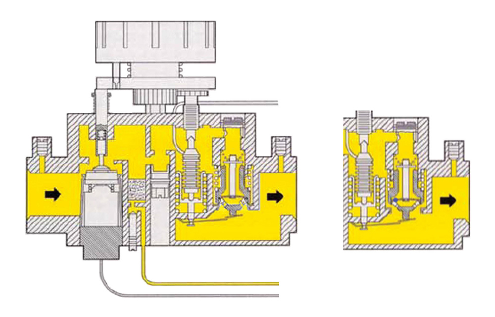

Рисунок 84. Гідравлічний модуляційний клапан: зліва — малий вогонь, справа — дроселювання

Газовий потік і температурні уставки показано на рисунку 85, щоб краще зрозуміти послідовність роботи:

- Червона лінія температури показує, як температура опускається нижче уставки. Коли вона досягає попередньо встановленого диференціала (a) нижче уставки, клапан різко відкривається до режиму малого вогню.
- Якщо виміряна температура знову піднімається до уставки, клапан різкого спрацювання закриється.
- Якщо температура продовжує падати під час роботи на малому вогні і досягає попередньо встановленого диференціала (b), тоді починає відкриватися модуляційне сідло, збільшуючи потік пропорційно (c) до повного відкриття клапана в режимі великого вогню.

![A labelled graph showing the relationship between gas flow and temperature of a hydraulic modulating valve. It indicates the High Fire Rate, the Low Fire Rate, and where the temperature set point is. When the temperature is too high above the set point, the snap valve closes, and the gas flow stops. If the temperature is below the pre-set differential (a) from the set point temperature, the snap valve opens to the Low Fire Rate. There is a red X at this spot. If the temperature continues to drop, there is another pre-set differential (b) until the gas flow increases. If the temperature decreases further, the modulating seat increases the flow proportionately (c). Below a certain temperture, the gas flow remains at the High Fire Rate.](media/B1-LT4-Fig-85.png)

Рисунок 85. Різке спрацювання/модуляційна подача газу

### Гідравлічні вимикачі

Капілярні температурні датчики також використовуються для керування електричними вимикачами в електричних колах газових клапанів. Рисунок 86 є прикладом гідравлічно керованого запобіжного вимикача запальника. На перший погляд чутлива колба та капілярна трубка дуже схожі на систему термопари. При уважнішому розгляді збільшеного зображення газового клапана можна побачити, що капілярна трубка під’єднана до гофри. Це газовий клапан на 24 В AC з постійним запальником, і гофра утримує запобіжний вимикач запальника у ввімкненому стані, доки запальник горить.

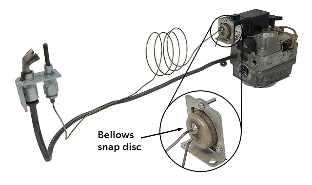

Рисунок 86. Капілярний запобіжник запальника

Це лише один приклад, але електричні вимикачі, що працюють від капілярної трубки, також застосовуються як обмежувачі максимальної температури та як елементи регулювання температури в мілівольтових і VAC-живлених газових клапанах.

## Газові клапани духовок

Газові клапани духовок у плитах є гібридом електричних і неелектричних робочих компонентів (рисунок 87). Схема під’єднання керувального кола газового клапана на 120 В AC показує, що термостат подає живлення як на гарячий поверхневий запальник (HSI), так і на термобіметалевий газовий клапан. Термостат — це гідравлічний сильфонний клацальний вимикач із капілярною трубкою, що веде до чутливої колби, розташованої всередині духовки. Оскільки термостат, HSI та газовий клапан увімкнені послідовно, електричний струм повинен пройти спочатку через нагрівальний елемент (glow bar), а вже потім до клапана. HSI блокує струм до газового клапана за рахунок електричного опору, який зменшується в міру збільшення температури запальника. Коли запальник досягає жовтого розжарення — достатнього для запалювання газу — він пропускає достатню кількість струму для відкривання газового клапана.

Рисунок 87. Газовий клапан духовки та гриля

Усередині газового клапана є біметалева пластина, яка піднімає тарілку клапана від сідла, коли біметал достатньо нагрівається ізольованим нагрівальним елементом, намотаним навколо його основи (рисунок 88).

Це просте коло має вбудований захист: якщо запальник пошкоджений, струм не потрапить до газового клапана.

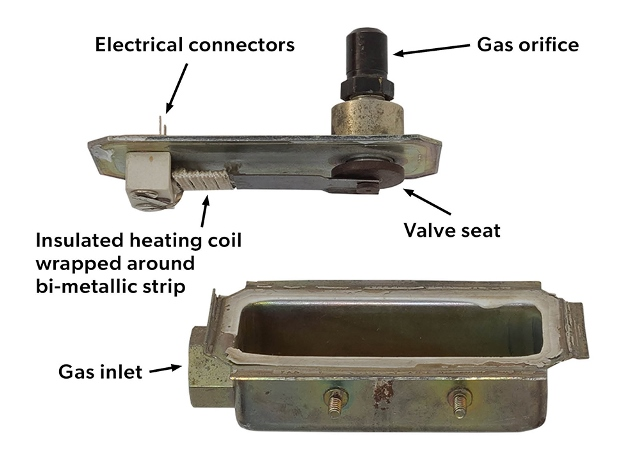

Рисунок 88. Внутрішні компоненти газового клапана духовки

## Сейсмічний газовий клапан

Сейсмічні газові клапани — це запобіжні клапани, призначені для перекриття подачі газу до будівлі під час землетрусу. На рисунку 89 показано дві популярні моделі; обидві потрібно встановлювати горизонтально, оскільки всередині є кулька, що зміщується під дією горизонтальної вібрації. Вони мають індикаторне віконце та потребують ручного скидання після спрацювання. Під час встановлення обов’язково перевіряйте напрямок потоку.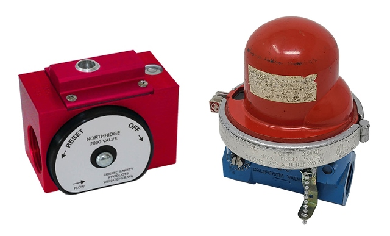

Рисунок 89. Клапани, що реагують на землетрус

## Протипожежні газові клапани

Комерційне кухонне обладнання з витяжними системами має автоматичну систему пожежогасіння. Газові норми вимагають, щоб будь-які газові прилади, захищені або ті, що потрапляють у зону дії системи пожежогасіння, були взаємопов’язані так, щоб подача газу перекривалася при спрацюванні системи.

Клапан відсічення газу має бути таким, що перезаряджається, і розташований поза зоною захисту. Автоматичний клапан швидкого закривання може бути електричним або механічним. Електричні типи зазвичай є соленоїдними клапанами, тоді як неелектричні механічні типи використовують кабельну систему активації.

Кабельна система, показана на рисунку 90, має пружинний газовий клапан (внизу ліворуч), який закривається після звільнення й утримується у відкритому положенні кабелем. Кабель може бути звільнений ручною станцією (внизу праворуч) або термочутливим плавким елементом, розташованим над кухонним обладнанням (верхнє фото); кожен із них також вивільняє вогнегасну речовину на захищувану зону.

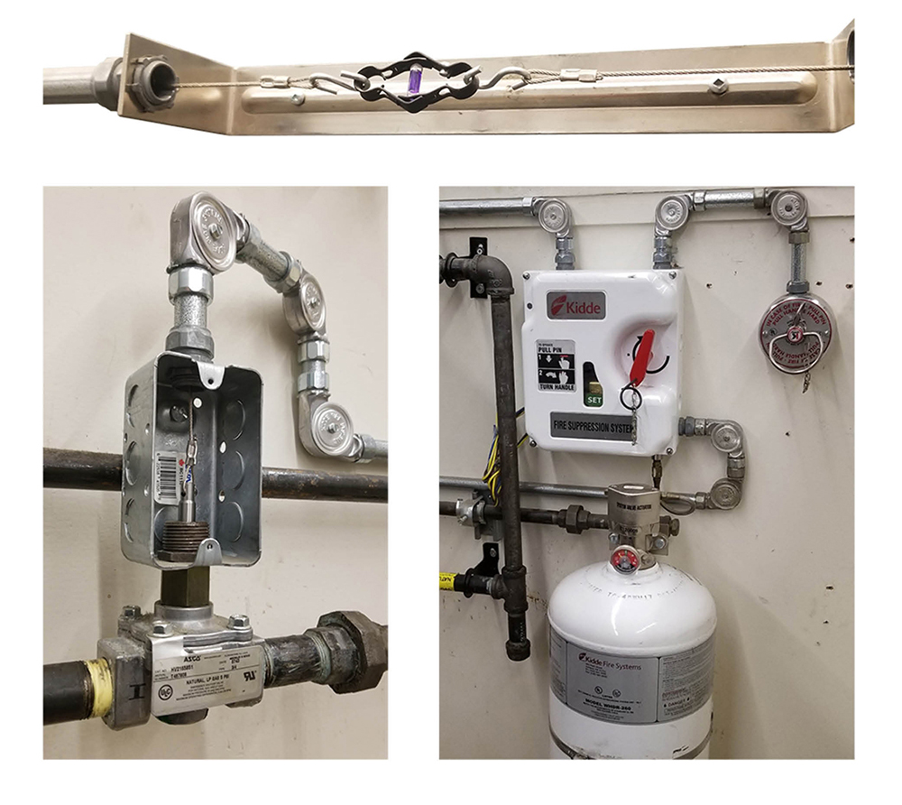

Рисунок 90. Система пожежогасіння кухонної витяжки

## License

[Block B: Fuel Gas Systems](https://opentextbc.ca/plumbing4b) Copyright © 2025 by SkilledTradesBC is licensed under a [Creative Commons Attribution-NonCommercial-ShareAlike 4.0 International License](https://creativecommons.org/licenses/by-nc-sa/4.0/), except where otherwise noted.