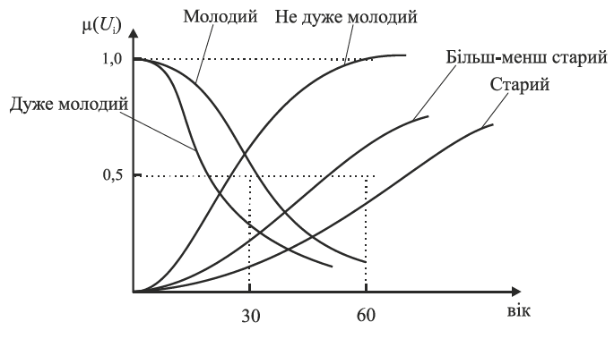

[<- До підрозділу](README.md)

# Розв’язування системних задач з використанням методології нечітких множин

Це розділ навчального посбіника [Системний аналіз складних систем управління: Навч. посіб. /А.П. Ладанюк, Я.В. Смітюх, JI.O. Власенко та ін. — К.: НУХТ, — 274 с](https://dspace.nuft.edu.ua/server/api/core/bitstreams/a264d75f-5e98-41b9-994e-991b4bcc93eb/content)

## 4.1. Формалізація та перероблення якісної інформації. Нечіткі множини 

Розв’язування системних задач аналізу складних систем ґрунтується на точному знанні математичної моделі об’єкта керування. Це не завжди можливо у разі розгляду слабкоформалізованих об’єктів і систем.  Вирішення поставлених завдань залежить від методів нечіткого аналізу та нечітких множин.  Нечіткий, а саме якісний аналіз є одним із важливих і визначальних етапів системного аналізу, це:  

- збирання;

- систематизація;

- формалізація;

- перероблення якісної інформації. 

Нечіткий аналіз у межах системного аналізу складних систем управління розглядає розв’язання системних задач.

Нечіткі системи занадто складні, щоб бути змодельованими за допомогою звичайних математичних методів. У цілому нечіткість описує об'єкти або процеси, які не піддаються чіткому визначенню чи точному вимірюванню. Прикладами таких систем є великі інженерні системи, соціальні системи, економічні системи, системи управління, медичні діагностичні комплекси, а також людське сприйняття.

Методологію нечітких множин слід застосовувати у таких типових ситуаціях: 

- попереднє вивчення складного процесу та формування мети дослідження;
- вибір найважливіших ефектів і характеристик (показників) процесу;  
- аналіз експериментальних даних з погляду адекватності реальному процесу;
- оцінювання функціонування складних систем управління;
- розв’язання системних задач;
- прийняття рішень в умовах невизначеності та в нечітко визначених ситуаціях тощо.

Якісна інформація виражається за допомогою звичайної мови, але має нечіткий, наближений характер. Для використання комп’ютерних технологій потрібно **зіставити словесним термінам кількісні оцінки**, щоб формалізувати дані та поставити їм у відповідність ефективні алгоритми оброблення. Такий спосіб передбачає розв’язання задачі лінгвістичної апроксимації.

Якісний етап системного аналізу має два аспекти — змістовий (семантичний) та математичний.

Змістовий аспект — збирання, оцінювання достовірності, систематизація та формалізація інформації. Часто якісна інформація, її достовірність істотно залежить від психічних та фізіологічних можливостей людини. У свідомості людини формується концептуальна модель як уявлення про стан та особливості об’єкта досліджень. Це позначається на  суб’єктивізмі в даних, які в надалі використовуються в системі.

Формалізація якісної інформації грунтується на експериментальних даних, які дають змогу порівнювати нечіткі уявлення та числові множини. При цьому в загальному випадку залучаються експерти, а в найпростішому вважають, що множина `Х` складається з двох елементів `{0,1}`, наприклад “хороша” чи “погана” продукція. Так само технологічні параметри — `високий`, `низький` тощо, але кожному з них відповідає своє числове значення.

*Математичний аспект* якісного аналізу полягає у відображенні якісних уявлень у математичні об’єкти.

Наприклад, якщо об’єкт характеризується двома координатами стану $X_1$ і $X_2$ *,* то можна прогнозувати значення величини $X_2$ за фіксованих значень $X_1$, тобто за значної зміни значення $X_1$ значно змінюється також значення $X_2$, в противному разі значення $X_2$ змінюється мало. Терміни `велике`, `значне`, `слабке` потрібно формалізувати. Технологічні параметри технологічних комплексів (ТК) і підсистем складають такі групи параметрів:

- вимірювані автоматично (температура, тиск, рівень та ін.). На основі цих параметрів людина-оператор може прогнозувати зміни параметрів у неконтрольованих точках, використовуючи нечітку інформацію;
- описуються словесними (нечіткими) термінами, а для їхнього переведення у числовий вигляд участь бере людина – експерт (наприклад, якість продукції як інтегральне оцінювання).   

Передбачається, що формалізація якісної інформації ґрунтується на  відповідності між нечітко означеними характеристиками та математичними об’єктами. Це характерно для першої групи: параметру відповідає числова координата з установленим початком координат і мірою, а значення параметра може описуватись словесно.

Для параметрів першого типу елемент $x_j\in X$ — конкретні величини (наприклад, температура). Кількісною характеристикою  $x_j \in X$ є елементи $u_j\in U$ . Множина  $U$ — діапазон зміни параметрів. За словесного опису парі ($x_j$,$u_j$ ) відповідає нечіткий термін  $q_k \in Q$($Q$ — множина нечітких термінів). Нечіткими термінами є – “високий”, дуже “високий”, “низький”, “далеко”, “близько” та ін.  На вибір цих термінів значно впливає вибір опорної (реперної) точки, як правило, для номінального режиму.

За класичного підходу до керування не беруть до уваги такі фактори, як неясність, невизначеність, нечіткість чи неточність, а саме вони є головними в реальному житті для складних систем. На основі теорії нечітких множин Л. Заде розроблена схема розв’язання проблем, в яких суб’єктивна думка чи оцінка відіграють істотну роль під час оцінювання фактів неясності й невизначеності. У 1965 р. американський математик Л. Заде запропонував теорію нечітких або розмитих множин, яку називають нечіткою логікою. Ця теорія дала схему розв’язання проблем, в яких суб’єктивні думки або оцінка відіграють істотну роль під час оцінювання фактів неясності або невизначеності. 

Автор теорії нечітких множин стверджував, що зі зростанням складності точні твердження втрачають значущість, а значущі твердження втрачають точність.

У технічній літературі нечітка логіка отримала назву від терміна “**Fuzzy-Logic**” (фуці-логіка).

Теорія нечітких множин пройшла шлях від розроблення формальних засобів подання нечітко визначених понять, які використовує людина, та апарату для оброблення їх до моделювання наближених міркувань, які використовує  людина в повсякденній діяльності, й до створення комп’ютерів з нечіткою логікою.

Перевага підходу нечіткої логіки порівняно з класичними методами під час опису систем управління полягає в тому, що при цьому можна не використовувати аналітичних залежностей. У багатьох випадках достатньо лише професійного опису того, як процесом керує досвідчений оператор (без залучення математичних, хімічних та інших залежностей). Нечітка логіка — перша теорія, яка оперує неточними та не зовсім зрозумілими поняттями. Передбачається, що здебільшого ситуація оцінюється приблизно, а не точно.

Об’єктивна поява цього підходу зумовлено тим, що у разі ускладнення систем зменшується можливість точних і значущих тверджень щодо поведінки системи і настає межа, за якою точність і значущість стають взаємовиключними характеристиками. Тоді вводяться спеціальні позначення (мітки), які визначають  більш-менш нечіткі поняття:

$U$ — універсальна множина (довільний набір об’єктів чи математичних конструкцій);

$A$ — кінцева підмножина $U$ з елементами $U_1, U_2...,U_n$ 

Тоді  $A=\{u_1,u_2,...,u_n\}; A=\{u_1,\mu_A(u_j)\}, u_j\in U$ — кінцева множина впорядкованих пар, де  $\mu_A(u_j)$ — міра членства, функція належності, яка показує ступінь належності елемента до цієї множини. 

Якщо всі  $\mu_A(u_j)\in \{0,1\}$ тобто дорівнюють 0 чи 1, то це звичайна (чітка) множина. Якщо  може набувати значення в інтервалі від 0 до 1, то $А$ — нечітка (розмита) множина. Тоді

$\mu_A(u_j)=0$— елемент не належить множині;

$\mu_A(u_j)=1, u_j \in U$; 

$0(\mu_A(u_j))<1$— визначає ступінь належності $u_j$  множині $U$.

Отже, $А$ — розмита множина.

​	У розмитій логіці значення істинності може бути розмитою підмножиною будь-якої впорядкованої множини. Практично це розмита підмножина на інтервалі [0,1], тобто точка цього інтервалу. Лінгвістичні критерії істинності — “правильно”, “не зовсім правильно” можна інтерпретувати як мітки розмитих множин. Це відповідає природній мові, в якій більшість предикатів розмиті, а не чіткі. Тоді виникають модифікатори предикатів (“дуже”, “більш-менш”, “цілком” тощо), які відіграють важливу роль у генеруванні значень логічних змінних, зокрема “дуже високий”, “більш-менш важливий”.

У класичних логічних системах є два квантори: існування та загальності. У розмитій логіці додатково до них використовуються такі квантори, як “кілька”, “головним чином”, “майже завжди”, “часто”. У розмитій логіці розмитий квантор інтерпретується як розмите число чи розмита пропорція.

Прикладом може бути зріст людини. Для поняття “високий” визначено функції залежності, наведені на рис. 4.1.


​	

Рис.4.1. Розмита множина при визначенні зросту

**Лінгвістична змінна** — це така змінна, яка задається на кількісній шкалі й набуває значення у вигляді слів та словоутворень природної мови. Окреме значення лінгвістичної змінної, або лінгвістичне значення, називають **термом**. Таке значення задається за допомогою функції належності, тобто кожному  терму відповідає нечітка множина. Значення лінгвістичної змінної (ЛЗ) описується нечіткими змінними. Лінгвістичні змінні  використовуються для якісного словесного опису кількісної величини. Будь-яка ЛЗ та всі її значення пов’язані з конкретною кількісною шкалою (базовою шкалою). Приклад базової шкали для оцінювання ступеня руйнування об’єкта:

	

Масштаб шкали може бути довільним. Для віку

*Т*(вік)={молодий, старий, дуже молодий, більш-менш молодий…}.

Кожний елемент (терм) цієї множини може виражатись через розмиту множину (рис. 4.2).



Рис.4.2. Функції належності

Значення лінгвістичних змінних можуть задаватись не лише базовою шкалою, а й аналітичними функціями. Наприклад, функції належності допустимих лінгвістичних термів можна задати функцією       

(4.1)

$\alpha$ та константа у чисельнику залежить від характеру лінгвістичної змінної. Так,  для значення “високий” функція має вигляд

(4.2)

“досить високий”

(4.3)

  “майже високий”

(4.4)

  “середній”            

                                                            

 “досить низький”

 (4.5)


Головним завданням під час розроблення нечіткої системи є процедура лінгвістичної апроксимації. 

Як приклад розглянемо апроксимацію функцій належності міцності бражки та міцності епюрату. 

Побудова функцій належності концентрації спирту в бражці оцінюється п’ятьма термами з чітко визначеним робочим діапазоном. Цей фактор визначений на універсальній множині: 

Ф1=[6,0 ... 10,0],  %об;                                                                    

*H(*Ф1)=<6,0; 7,25; 8,25; 9,5; 10; 10,5>,  %об.                                    

Для лінгвістичної апроксимації міцності бражки використовували аналітичний підхід. При цьому діапазон зміни міцності бражки слід розбити на піддіапазони, аналізуючи експертну інформацію, отриману в результаті експертного опитування. На рис. 4.3 наведено приклад лінгвістичної апроксимації змінної — “міцність бражки”.


Рис. 4.3. Лінгвістична апроксимація міцності бражки

У таблиці 4.1 наведені параметри функцій належності, що отримані в результаті лінгвістичної апроксимації.

*Таблиця 4.1.* Характеристика термів міцності бражки                  

| Позначеннятерму | Концентрація спиртув бражці | Координати функціїналежності |
| --------------- | --------------------------- | ---------------------------- |
| Ф1,1            | Низька (6,0 — 7,25)         | [6,0;6,0; 7,0; 7,25]         |
| Ф1,2            | Нижчаза норму (7,0 — 8,25)  | [7,0;7,7; 8,0;  8,25]        |
| Ф1,3            | Норма (8,0 — 9,5)           | [8,0;8,3; 9,0; 9,5]          |
| Ф1,4            | Вищаза норму (8,2 — 10)     | [8,2; 8,7 9,0;10,0]          |
| Ф1,5            | Висока (9,7 — 10,5)         | [9,7;10,0; 10,5]             |

​	Для управління на базі нечіткої логіки (фуці-керування характерним є безпосереднє застосування експертних знань, які формуються якісно, для генерування необхідних впливів на об’єкт. Знання щодо взаємодії з процесом за цією методикою подаються у формі правил виду:

```
ЯКЩО (початкова ситуація), ТО (відповідна реакція).
```

Така логічна конструкція відповідає природній поведінці людини в конкретній ситуації, наприклад:

```
ЯКЩО (температура висока), ТО (зменшити дещо подачу пари).
```

Або

```
ЯКЩО (температура висока) ТА (швидкість зростання температури значна), ТО (припинити подачу пари).
```

Використовуючи функції належності, можна записати такі вирази:

 (4.6)

де $М$ — сукупність об’єктів, які належать до основної множини $Х$; $Х$ — об’єкти множини $М$.

Такий вираз  не є алгебраїчною сумою, він лише визначає, що елементи $X_j$ належать до множини $М$ з функціями належності $\mu_j$. Це може бути формою запису математичної моделі в нечіткому середовищі. Можна записати також

(4.7)

За аналогією із звичайними множинами в нечіткій логіці формуються основні операції над множинами $А$ та $В$:

- множина логічного об’єднання 

 (4.8)

- множина логічного перетину 

(4.9)                                                                

- множина логічного доповнення (НІ)

(4.10)

Головною операцією нечіткої логіки є процедура ***нечіткого висновку***, за допомогою якої з нечітких умов отримують наближені рішення (розв’язки). Процедура нечіткого висновку ґрунтується на операції логічного слідування (імплікації), яка використовується в традиційній математичній логіці.

Імплікація дає змогу формалізувати знання експерта за формою “якщо $А$, то $B''$, де $А$ — передумова, $В$ — висновок. Стосовно нечіткого управління $Х$ — базова множина значень $х$ регульованої змінної (координати). Тоді $Х$ — базова множина $х$, $А$ — множина значень $х$; $U$ — базова множина значень управлінь $u$, $В$ — множина значень $u$.

Залежно від способу отримання логічних висновків з нечітких правил можуть бути різні регулятори. Для промислового використання частіше застосовується алгоритм нечіткого регулятора Мамдані, коли регулятор формує чітке однозначне управління за допомогою процедури дефазифікації (рис. 4.5).

Початковими даними для такого алгоритму є:

- антецеденти $n$ правил $A_{11},A_{12},...,A_{1n}$,$A_{21},A_{22},...,A_{2n}$ ,$A_{n1},A_{n2},...,A_{nn}$ , які відповідають функціям належності μ і зв’язані логічними операціями кон’юкції (∩), диз’юкції (*U*) чи інверсії ($\overline{}$); висновок *n* правил $B_1$, $B_2,...,B_n$  з відповідними функціями належності;
- конкретні значення $x_1^*$ ,$x_2^*$...$x_n^*$, вхідних змінних $x_1$ ,$x_2$...$x_n$,.

У результаті цього потрібно отримати керування $U$, для чого:

- за допомогою основних операцій визначають значення істинності передумов $n$ правил

 (4.11)

- враховують, що відповідно до з основного правила логічного висновку істинність висновку $В$ не може перевищувати істинність передумови $А$, тому $\mu_В(U)$ обмежується зверху на рівні $\mu_А(х)$:

(4.12)


- здійснюють агрегування кількох правил “ЯКЩО...ТО...” через максимізацію функцій належності всіх об’єднуваних правил. У результаті цього функція належності керувальної дії  

    (4.13)

- здійснюють процедуру дефазифікації для знаходження конкретного значення управління. Серед різних методів найпоширенішим є метод центра ваги, коли

(4.14)

Таким чином, дефазифікація — процедура генерування керувань.

Такі сигнали керування отримують на виході фуці-контролера (нечіткого регулятора) отримують як нечітку множину в формі функцій належності.

Метод центра ваги передбачає, що управління обчислюється як значення абcциси центра ваги площини, яка утворена функцією належності та віссю абцис.

## 4.2. Функції належності

Вибір виду функцій належності та їхніх параметрів значною мірою визначається досвідом, інтуїцією та іншими суб’єктивними факторами, в тому числі особою, яка приймає рішення  (ОПР). Саме  тут і виникають нові невизначеності суб’єктивного характеру.

Приклади. Функцій ступенів належності подано на рис. 4.4 — 4.7.


Рис. 4.4. Функції ступенів належності твердження “значення *х* мале”


Рис. 4.5. Функції ступенів належності твердження “значення *х* велике”


Рис. 4.6. Функція ступенів належності твердження “значення |*х*| мале”


Рис. 4.7. Функція ступенів належності твердження «значення |*х*| велике”

​	Функція ступенів належності може задаватись:

- самостійно дослідником, на основі власного досвіду (для простого випадку);
- із залученням експертів, обробленням їхніх оцінок (для складних та відповідальних випадків).

​	Важливість використання логіко-лінгвістичних змінних зумовлена такими причинами:

- не всі критерії оптимізації можуть задаватися кількісно;
- між рядом параметрів, які впливають на функціонування АТК, не вдається встановити точних кількісних залежностей;
- процес оптимізації в АТК — багатокроковий, а зміст кожного кроку не завжди можна визначити однозначно;
- існуючі способи опису самих АТК (їхньої структури) та процесів у них  дають громіздкі залежності, їх важко або неможливо використовувати;
- у змінюваних умовах зовнішнього середовища та властивостей АТК утруднюються процеси адаптації, тим більше, що окремі підсистеми мають активну природу, тобто є людино-машинними.

​	Процедури задання дослідником функції належності в нечітких підмножинах:

- визначають діапазон зміни величини параметра *х*  *Х* з множини Ω;
- знаходять відображення φ: Ω→*U*, де $U\in[0,1]$. Як φ може бути використане будь-яке перетворення, зокрема лінійне;
- величина параметра $х\inХ$ описується словесно множиною термінів $Q$, наприклад  $Q^\Delta${високий, дуже високий, невисокий, низький, дуже низький і т.д.}. Потрібно, щоб у $Q$ не було термінів — синонімів, у протилежному разі  їх класифікують відповідно до термінології, яка існує в цій галузі (температура 120 °С у цукровій промисловості — висока, в металургії — дуже низька);
- на множині *Q* вводиться термін $q_0\in Q$  — “норма”, а відносно нього симетрично визначається терміном , $Q_k\in Q=1,k=1,n$  та протилежні їм за змістом $q_e\in Q, e=1,..n$
- функції належності , $\mu_j(U), j=1, (2n+1)$, встановлюють відповідність $q\rightarrow U $ з точністю до якісних відмінностей первинних термінів та прийнятих операцій над нечіткими множинами;
- термін “норма”, тобто $q_0\in Q$ і $u_0\in U$  визначає і форму функції $\mu(U)$, а також потребує виконання таких асимптотичних властивостей:

(4.15)

де *a, b* — сталі цього терміна.

На рис. 4.8 представлено приклад функція ступені належності , яка формалізує термін «високий».


Рис.4.8. Функція ступеня належності , яка формалізує термін «високий»

Опорний елемент $U_0\in U$ відповідає поняттю “норма”. Як правило, це 0,5 ($\mu(U_0)=0,5$). Звичайно, тут є значний суб’єктивізм відносно вибору $U_0$.

Умова $\lim\limits_{U\to 0}\mu(U)=0$ означає, що елементи $U<U_0$ меншою мірою можна віднести до терміна “високий”, ніж $U_0$.

Умова $\lim\limits_{U\to 1}\mu(U)=1$  показує, що для $U>U_0$ ступінь належності до терміна “високий” зростає.

Нечітка множина, яка формується, вважається нормальною за умови 

(4.16)

Ураховуючи асимптотичні властивості функції μ(*U*), можна встановити інтервали $[0,U_a]$ та [U_b,1] , на яких функція чітко задається класифікацією

(4.17)

Найскладніше задати $\mu(U)$  за умови $U\in[U_a,U_b]$. На цьому інтервалі для будь-якого $U\in[U_a,U_b]$ дослідник задає  $\mu(U)$ залежно від різниці $(U-U_0)$ з урахуванням знака. Приймається, що функція $\mu(U)$ є монотонною, а розриви можуть відбуватися тоді, коли, в процесах трапляються “катастрофи”, тобто система стає нестійкою.

Для визначення функцій ступеня належності експертами рекомендуються такі процедури:

1) Виділення точки $u_1\in U$ на універсальній шкалі, яка, на думку експерта, точно відповідає нечіткій множині. У цьому разі $\mu(U_1)=1$. Це розглядається на випадок, коли для формалізації термінів беруть три елементи $U_i(i=1,3)$ універсальної множини $U$. Для зменшення психологічного навантаження на експерта кількість термінів потрібно зменшувати. На рис. 4.9 наведено спосіб задання функцій належності, за допомогою яких формалізуються поняття “низький”, “середній”, “дуже високий”.


Рис.4.9. Функція ступеня належності μ(*U*), яка формалізує термін «високий»

2) Знаходження на універсальній шкалі зліва та справа від $U_1$ точок, які, на думку експерта, не можуть належати до цього терміна. Це точки  $U_2$ та $U_3$ , для яких $\mu(U_2)=\mu(U_3)=0$.

3) Графічна побудова функцій за вибраними точками за умови лінійної апроксимації.

4) Виділення підмножини $U_1 \le U$, на якій визначено формалізацію терміна $U_!=[U_2,U_3]$ . Інколи точки $U_2, U_3$,  можуть переходити у нескінченність.

Розглянуто один з найпростіших способів.

Під час керування технологічними установками діапазон зміни кожного параметра задають відрізком (технологічні параметри — нечіткі підмножини деяких універсальних множин)


кожен із відрізків розбивають на інтервали, наприклад


Значення параметра, яке лежить в одному з інтервалів, словесно характеризують термінами “малий”, “середній”, “великий”. Тоді функція належності в нечітких підмножинах, які формалізують прийняті терміни, описують залежністю

(4.18)

*де Q* — стала величина, яку знаходять при ідентифікації функції належності (табл. 4.3):


Таблиця 4.3. Приклад формування функції належності


## 4.3. Принципи і структура системи управління з нечітким регулятором

Навіть найскладнішими об’єктами (нелінійні, багатопараметричні, невизначені) успішно керують досвідчені оператори на основі інтуїтивних правил “ЯКЩО...ТО”, які не мають чіткого інформаційного забезпечення.

Стратегія керування, яку використовує оператор, може формулюватись як набір правил, які досить просто виконати вручну, але важко формалізувати за допомогою звичайних алгоритмів. Основною причиною цього є використання оператором якісних, а не кількісних оцінок під час опису умов прийняття рішень. Саме тут і застосовують апарат нечітких множин.

Структурну схему системи з нечітким контролером наведено на рис. 4.10.


Рис.4.10. Структура системи з нечітким контролером

***Процедура фадзифікації параметрів*** — переведення поточних значень вхідних змінних у лінгвістичні величини (можливий числовий діапазон параметрів якісно характеризують лінгвістичними величинами “мале”, “середнє”, “велике”). Кожна лінгвістична величина інтерпретується як фазі-множина і описується функцією належності. У такий спосіб якісні оцінки переводяться в кількісні, тобто кожному поточному числовому значенню змінної процесу відповідає ступінь належності до тієї нечіткої підмножини, яка символізує конкретну лінгвістичну змінну. Функції належності, як правило, перекривають одна одну, тому для кожної змінної кілька функцій належності можуть оцінювати різні величини істинності, які відрізняються від нуля.

***Логічне рішення*** формується на основі лінгвістичного правила “ЯКЩО *А*, ТО  *В*” — “робочого правила”. Частина “ЯКЩО” (передумова) може означати спряження будь-якої складності логічних операцій. Частина “ТО” (рішення, висновок) є визначенням лінгвістичної величини для вихідної дії контролера. При цьому правила формулюються так, що досягається результат, за якого для будь-якої лінгвістичної величини управління як мінімум одне з правил є прийнятим.

Під час розв’язування цієї задачі доцільно використовувати алгоритми нечіткого логічного висновку. Для прикладу розглянемо керування об’єктом великої потужності (див. рис. 4.11), якість готового продукту якого залежить від багатьох факторів, головними з яких є: температура, тиск і маса сировини (навантаження). Температуру і тиск оперативно змінювати в потрібному напрямку складно, тому вибирають зміну сировини як ефективне керування: масу сировини *М* потрібно змінювати на величину Δ*М* так, щоб забезпечити повне співвідношення між температурою *Т*, тиском *Р* та масою *М* (це співвідношення попередньо визначається технологічним регламентом).


Рис. 4.11. Функції належності змінних:

*а —*- температури; *б* — тиску


Рис. 4.12. Функції належності змінних:

*а* — маси;  *б* — зміни маси 

На рис. 4.12 наведено експертні уявлення лінгвістичних змінних *Т, Р, М* і Δ*М* за допомогою кількох термінів у вигляді функцій належності, а саме:


База правил (знань) має форму


Наприклад, “ЯКЩО *М*=”середнє” ТА  *Р*=”досить мале” ТА *Т*=”низька”, ТО Δ*М*=”зменшити”.

​	Цю базу правил зручно звести в таблицю (табл.4.4).

Таблиця 4.4.База правил                                                                   


​	Таким чином, для всіх вхідних і вихідних змінних задано лінгвістичні терми, які відповідають певним діапазонам чітких значень, та сформовано таблицю на основі умовних висловлювань.

​	На основі наведених вище процедур нечіткого управління отримано:

- фадзифіковані змінні:

  

- функція належності для управління має вигляд, показаний на  рис.4.13.


Рис.4.13. Функція належності для керування

У результаті дефадзифікації отримано Δ*Μ*=4,5 т, тобто за таких умов доцільно збільшувати масу сировини на 4,5 т.

Традиційні методи теорії керування модифікуються з урахуванням можливостей нечіткої логіки, наприклад: оцінювання надійності систем; ідентифікація станів обладнання (діагностика); ідентифікація нечітких регресійних моделей. Значну увагу приділено застосуванню нечітких регуляторів для керування складними технологічними об’єктами, ліфтами у висотних будинках, рухом потягів метрополітену тощо. 

Для практичної реалізації пропонується використання інструментального середовища *Matlab*. Як показує практика, це один з найпрогресивніших програмних продуктів.

## 4.4. Приклад реалізації системи оцінювання

На практиці часто виникає потреба в оцінюванні якісно визначених показників, які пов’язані логічними причиннимим залежностями.

Для моделювання нечіткої системи оцінювання якості будують систему нечіткого логічного висновку, яка має три входи. На рис.4.14 зображено параметричну схему такої системи. 


Рис.4.14.  Параметрична схема системи

Для вирішення поставленого завдання потрібно розв’язати задачу лінгвістичної апроксимації, яка полягає у формуванні нечіткої терм-множини.

Основними типами функцій належності пропонується використовувати трикутну функцію належності, оскільки для їхньої побудови досить легко можна сформувати експертну інформацію.

У нашій системі три входи та один вихід, тому формуємо чотири терм- множини відповідно до кожної змінної.

Для побудови нечітких правил за допомогою спеціального інструментального середовища  формують нечіткі логічні висновки.  Для цього використовують продукційну модель знань. 

Такого роду інформацію можна використовувати для підтримки прийняття рішень на технологічних ділянках харчових виробництв. 

Розглянутий вище підхід дає змогу спростити роботу експертів для виявлення основних залежностей між вхідними та вихідними змінними процесів брагоректифікації, оскільки, маючи лише експериментальну статистику роботи окремих колон, на основі отриманої бази знань можна сформувати базу знань інтелектуальної системи управління.


## Контрольні запитання і завдання

1. Що таке нечіткий аналіз?
2. Що таке якісна інформація?
3. Які нечіткі терміни використовуються при формалізації якісної інформації?
4. Дайте визначення термінів «функція належності», «нечітка множина».
5. Наведіть приклади функцій належності.
6. Що таке лінгвістична змінна? Приклад.
7. Як формуються функції належності для технологічних змінних? Приклад.
8. Як визначається кількість термів для нечітких змінних?
9. Наведіть приклад продукційних правил.
10. Які операції виконуються над нечіткими множинами?
11. Як формується нечіткий висновок?
12. Наведіть послідовність процедур для формування функцій належності.
13. Наведіть структуру систем з нечітким контролером (регулятором).
14. Як здійснюються процедури фазифікації та дефазифікації?
15. Наведіть приклад керування складним об’єктом з використанням нечітких множин.


Теоретичне заняття розробили А.П. ЛАДАНЮК, Я.В. СМІТЮХ, Л.О. ВЛАСЕНКО, Н.А. ЗАЄЦЬ, І.В. ЕЛЬПЕРІН

