[<- До підрозділу](README.md)		[Коментувати](#feedback)

# Загальні концепції керування машинами: теоретична частина

## 1. Машина в контексті систем керування

### Поняття машини 

Під **машиною** у даній лекції будемо розуміти мехатронний об’єкт, що поєднує механічні, електричні та керувальні підсистеми і призначений для виконання визначеного циклу робіт, де керування полягає в узгодженні рухів, дій і станів у часі. **Мехатронний об’єкт** є більш загальним поняттям, яке охоплює технічні системи з механікою, приводами, датчиками і керуванням, незалежно від того, чи реалізують вони завершений машинний цикл. У цьому сенсі машина є окремим, але не єдиним випадком мехатронного об’єкта. 

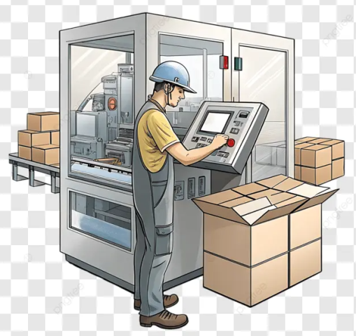

рис.1.  Загальний вигляд машини та оператора машини (згенеровано ШІ, взято на теренах інетрнету)

Порівняємо машину з технологічним об'єктом з точки зору автоматизації керування.

- Машина з точки зору автоматики зазвичай працює у вигляді циклів або послідовностей дій. Її робота має чітко визначений початок, хід виконання та завершення. Керування машиною орієнтоване на події, такі як команда пуску, зупинки, досягнення заданого положення або завершення операції. У більшості випадків автоматизоване керування машиною безпосередньо пов’язане з рухом механічних елементів та їх взаємодією між собою або з об’єктом оброблення.
- Технологічний об’єкт з точки зору автоматики, навпаки, характеризується безперервною або квазі-безперервною поведінкою у часі. Основною метою керування таким об’єктом є підтримання або стабілізація технологічних змінних, таких як температура, тиск, витрата або рівень. Для технологічного об’єкта не характерні чітко окреслені цикли з початком і кінцем; ключову роль відіграє регулювання і компенсація збурень.

Таблиця 1. Порівняння об'єктів керування: машини та технологічного процесу з точки зору автоматики

| Ознака                    | Машина                                                    | Технологічний об’єкт                                  |
| ------------------------- | --------------------------------------------------------- | ----------------------------------------------------- |
| Характер роботи           | Працює у вигляді циклів або визначених послідовностей дій | Працює у безперервному або квазі-безперервному режимі |
| Початок і завершення      | Має чітко означені фази запуску, виконання і завершення   | Не має чітко виражених фаз початку і завершення       |
| Основний об’єкт керування | Дії, рухи і взаємодія механізмів                          | Фізичні параметри об’єкта                             |
| Тип керування             | Подійно- та станово-орієнтоване                           | Орієнтоване на регулювання                            |
| Ключові сигнали           | Події, стани, дозволи, підтвердження                      | Значення параметрів і їх відхилення                   |
| Роль часу                 | Критична послідовність і синхронізація дій                | Критична стабільність параметрів у часі               |
| Типові засоби             | Датчики положення, приводи, виконавчі механізми           | Датчики температури, тиску, витрати, рівня            |
| Поведінка об’єкта         | Дискретна або квазі-дискретна                             | Переважно безперервна                                 |
| Типові задачі             | Запуск, зупинка, координація рухів і станів               | Підтримання і стабілізація параметрів                 |

Саме ця різниця у характері об’єктів пояснює, чому підходи, типові для процесної автоматизації, не можуть бути безпосередньо перенесені на машинну автоматику. Методи, ефективні для безперервного регулювання параметрів, погано масштабуються на задачі, де домінують події, послідовності дій і координація рухів.

### Машина як об’єкт керування

З точки зору систем керування машина розглядається як об’єкт, поведінка якого визначається не окремими фізичними величинами, а логікою виконання дій. Для опису такої поведінки інженер оперує кількома базовими групами понять (рис.2).

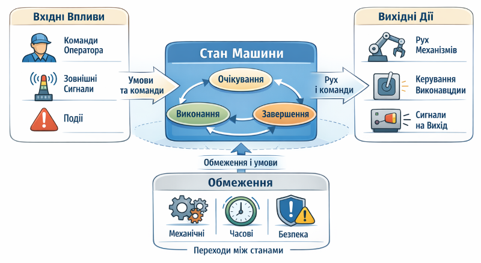

рис.2. Машина як об’єкт керування (згенеровано ШІ)

- Вхідні впливи охоплюють команди оператора, сигнали від суміжних систем і зовнішні події, які ініціюють роботу машини або змінюють її хід. Ці впливи не призводять до фізичних дій безпосередньо, а формують умови, за яких допускається перехід машини до виконання певних операцій.

- Внутрішній **стан машини** описує, у якій фазі роботи вона перебуває в даний момент часу і які дії для неї є допустимими. Стан відображає не окремі сигнали, а узагальнену логічну ситуацію, наприклад очікування, виконання операції, завершення циклу або перебування в аварійному режимі. Саме через зміну станів формалізується поведінка машини. **Режим роботи машини** означує загальні правила її використання. Режим задає, які дії дозволені, які стани є доступними і в яких умовах машина може переходити між ними. Типовими прикладами режимів є робочий, ручний, налагоджувальний або сервісний режими. Вибір режиму впливає не на фізичну конструкцію машини, а на допустимі способи її експлуатації.

- Вихідні дії машини проявляються у вигляді рухів механізмів, вмикання або вимикання виконавчих елементів, а також формування сигналів для інших систем. Ці дії є наслідком перебування машини в певному стані і реалізації дозволених переходів, тому вони не розглядаються ізольовано від загальної логіки керування.

- Окрему роль відіграють обмеження, що накладаються на роботу машини. До них належать механічні обмеження, зумовлені конструкцією, часові обмеження, які означують допустимі тривалості та затримки дій, а також безпекові обмеження, що означують дозволені й заборонені режими роботи. Сукупність цих обмежень означує, які стани є допустимими і між якими з них можливі переходи.

У такому підході керування машиною полягає не в безпосередньому керуванні окремими механізмами, а в організації переходів між допустимими станами з урахуванням вхідних впливів і обмежень. Саме ця логіка станів і переходів становить основу машинної автоматики. 

На відміну від багатьох інших об’єктів автоматизації, для машини критичними є не числові значення фізичних величин самі по собі, а факт настання певної події, яка організовує перехід в інший стан. **Подією** в машині вважається ситуація, яка має однозначний логічний зміст і безпосередньо впливає на подальший хід роботи. Це може бути досягнення кінцевого положення механізму, завершення руху, подання команди оператором або спрацювання захисного елемента. У зв’язку з цим машинна автоматика значною мірою спирається на дискретні сигнали, які однозначно фіксують факт настання події. Ці сигнали слугують основою для побудови логіки керування, де поведінка машини описується через послідовність станів і умов переходу між ними. 

### Роль людини в керуванні машиною

У машинній автоматиці людина виступає не як безпосередній керівник окремих механізмів, а як оператор машини в цілому. Це означає, що оператор не втручається напряму у керування рухами, не вмикає і не вимикає окремі двигуни або виконавчі елементи, а взаємодіє з машиною через визначений інтерфейс керування тільки у потрібні моменти часу.

Основною функцією оператора є ініціювання команд і зміна режимів роботи. Через органи керування або HMI оператор означує, у якому режимі має працювати машина, коли розпочати або завершити виконання циклу, а також у яких умовах робота має бути припинена. Таким чином оператор ініціює дії машини, але не визначає деталі їх виконання. Машина виконує задану послідовність дій автоматично, відповідно до внутрішньої логіки керування, а оператор лише дозволяє або забороняє початок цієї послідовності. Після запуску циклу втручання людини, як правило, мінімальне або взагалі відсутнє.

Окрім подання команд, оператор здійснює контроль стану машини. Він спостерігає за поточним режимом роботи, станами та повідомленнями про помилки або аварійні ситуації. У разі виникнення нестандартної ситуації оператор приймає рішення щодо подальших дій, але й у цьому випадку діє в межах логіки, закладеної у систему керування. 

Можна сказати що людина не задіяна в процесах постійно, а тільки за потреби. На відміну від автоматизованих систем керування технологічними процесами, де оператор більшість часу сидить за АРМ (автоматизоване робоче місце) на базі комп'ютерів, для машин характерно наявність операторських панелей, які час від часу використовує оператор машини за потреби. Більшість часу оператор машини знаходиться не біля панелі, а виконує свої завдання по обслуговуванню машин. Тому разом з операторськими панелями використовуються інші засоби операторського контролю, зокрема світлосигнальні колони та засоби звукової сигналізації. Враховуючи характер робіт, разом з операторськими панелями можуть використовуватися такі засоби людино-машинного інтерфейсу як кнопки та індикаторні лампи.

Враховуючи близькість оператору до механічних та електричних елементів машини, які можуть нашкодити йому під час роботи, велику увагу при розробці машин приділяються засобам безпеки.        

### Особливості машинної автоматики

До особливостей машинної автоматики можна віднести наступні.

- Домінування дискретної логіки. Більшість рішень у машинній автоматиці приймається на основі логічних умов, станів і подій. Навіть коли в системі присутні аналогові сигнали, вони зазвичай використовуються для формування логічних фактів: досягнуто положення, перевищено межу, завершено рух. Наслідком цього є орієнтація програм керування на булеві змінні, міжблокувальні умови, послідовності та станні моделі, а не на безперервні алгоритми.

- Наявність задач керування рухом. Керування рухом виступає ключовою задачею більшості машин. Це означає, що логіка програми повинна бути тісно пов’язана з координатами, швидкостями, напрямками та фазами руху. Програма не просто вмикає виконавчі механізми, а синхронізує їх роботу у часі та просторі. Звідси випливають вимоги до чіткої структури циклів, однозначного визначення початку і завершення рухів, а також коректної обробки проміжних станів.

- Жорсткі часові вимоги. Жорсткі часові вимоги є прямим наслідком роботи з механікою. Події в машині відбуваються швидко, а запізнення реакції може призвести не лише до помилки, а й до фізичного зіткнення, заїдання або пошкодження вузлів. Тому в машинній автоматиці критично важливими стають детермінізм виконання програми, передбачуваність циклу PLC і контроль часу реакції на події. Алгоритми проєктуються з урахуванням найгірших сценаріїв, а не середніх значень.

- Тісний зв’язок з механікою. Програмна логіка не може розглядатися окремо від конструкції машини. Послідовність дій часто безпосередньо повторює кінематичний ланцюг або технологічний цикл. Наслідком цього є поява в програмі понять, які не мають чисто програмного походження: упори, хід, мертва зона, зчеплення, інерція. Програміст PLC фактично працює на стику логіки та механіки.

- Подійно-орієнтована логіка. Машина реагує не на «поточний стан змінних», а на події: натиск кнопки, досягнення кінцевика, завершення руху, виникнення помилки. Це призводить до необхідності явного відстеження фронтів сигналів, запам’ятовування контексту та розділення одноразових і постійних дій. Лінійні алгоритми без урахування подій швидко стають некерованими.

- Обмеження з боку безпеки машин. Це накладає додатковий шар логіки, який не можна ігнорувати або спрощувати. Будь-яка дія машини має бути дозволена лише за виконання визначених умов безпеки, а порушення цих умов повинно мати пріоритет над усією іншою логікою. Наслідком цього є ієрархія керування, де безпечні стани та аварійні зупинки мають вищий пріоритет, ніж технологічні задачі.

У сукупності ці фактори формують специфічний клас задач, у яких головною метою є не оптимізація параметрів, а керування поведінкою машини у часі з урахуванням фізичних, логічних і безпекових обмежень.

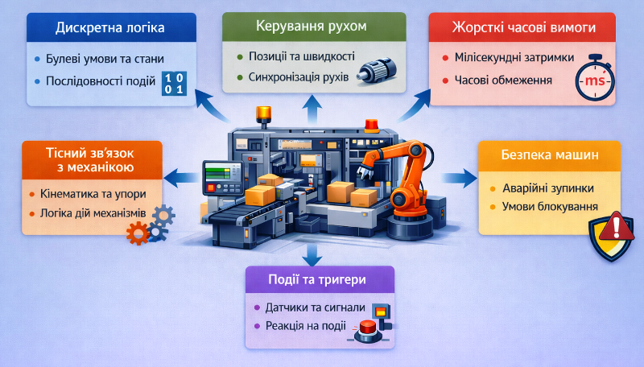

рис.3. Особливості машинної автоматики (згенеровано ШІ)

Виходячи з вище сказаного при побудові систем керування машинами виникає потреба у більш формалізованих моделях і підходах, зокрема:

- означення станових моделей, де поведінка машини описується через обмежену кількість чітко означених станів і переходів між ними;
- виділення приводів як окремих сутностей, що дозволяє розділити логіку руху і логіку керування процесом, зменшуючи взаємні залежності;
- окремого розгляду ПЧ (перетворювачі частоти) і сервосистем як самостійних підсистем з власною логікою та інтерфейсами, що усуває перевантаження основної програми PLC;
- чіткого структурованих програм керування;
- означення безпекових умов та режимів;
- врахування часових характеристик та обмежень;
- врахування кінематики механічних засобів

## 2. Технічні засоби машинної автоматики

### Загальний огляд структури системи керування машиною

У машинній автоматиці технічні засоби доцільно розглядати не як набір окремих пристроїв, а як ієрархічно впорядковану систему ролей, кожна з яких відповідає за певний аспект поведінки машини. Такий підхід дозволяє відразу відокремити локальне керування машиною від взаємодії з оператором і зовнішніми системами. Для ілюстрації такої ієрархічної побудови далі розглянемо технічні засоби машинної автоматики на прикладі типової структури системи керування машиною (рис.4), реалізованої в екосистемі EcoStruxure Machine Expert від Schneider Electric.

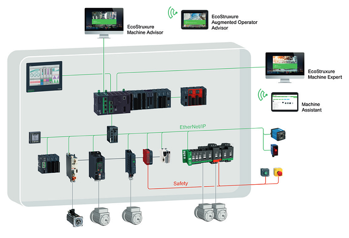

рис.4. Приклад технічної структури системи керування машиною EcoStruxure MAchine Expert від Schneider Electric (джерело - каталоги Schneider Electric)

- Найнижчий рівень структури формують датчики та виконавчі механізми. 
- Перетворювачі займають проміжне місце між логікою керування і фізикою машини. Вони реалізують перехід від дискретних команд PLC до керування енергією, швидкістю, моментом або положенням. 
- Центральним елементом машинної автоматики є PLC, який виконує роль координатора. Саме в ньому зосереджена логіка керування, обробка подій від датчиків, формування команд для виконавчих механізмів і перетворювачів, а також реалізація вимог безпеки. 
- Окремий рівень у структурі займають засоби HMI. Вони забезпечують взаємодію людини з машиною, відображення станів, параметрів і повідомлень, а також введення команд оператора. Варто зауважити, що до засобів HMI відносяться не тільки операторські панелі, а і різноманітні кнопки, індикатори, світло-сигнальна апаратура, тощо.
- Вищий рівень структури формують засоби керування виробництвом. Вертикальна інтеграція забезпечує обмін даними з системами верхнього рівня, такими як SCADA, MES або аналітичні сервіси. Горизонтальна інтеграція реалізує взаємодію між машинами, робочими центрами або допоміжними пристроями. На цьому рівні машина розглядається вже не як окремий об’єкт, а як елемент виробничої системи.
- Для реалізації інтеграції в машинній автоматиці великою мірою використовують промислові мережі, при цьому вимоги до реального часу в таких мережах зазвичай жорсткіші, ніж у процесній автоматиці, оскільки обмін даними безпосередньо впливає на керування рухом, синхронізацію механізмів і безпечну поведінку машини.
- Окреме місце в структурі системи керування машиною займають засоби безпеки (safety). У машинній автоматиці безпека не є надбудовою над керуванням, а інтегрується безпосередньо в логіку роботи машин

Далі в цьому розділі коротко зупинимося на цих засобах.

### Датчики в машинній автоматиці

У машинній автоматиці датчики розглядаються насамперед як елементи, що формують події і стани машини. Вони визначають, коли дозволено або заборонено виконання рухів, перехід між етапами циклу чи зміну режиму роботи. Тут розглянемо саме ті датчики які є типовими для керування машинами.

- Базовою групою є датчики положення та кінцеві вимикачі. Вони фіксують досягнення механічних крайніх або опорних положень і фактично визначають межі допустимого руху. У логіці машинної автоматики такі датчики часто використовуються як умови завершення операції або як елементи захисту від виходу за механічні обмеження.

рис.5. Кінцевий вимикач (джерело - https://i.makeagif.com/media/3-20-2023/_PsNeX.gif)

- Датчики наближення застосовуються для безконтактного виявлення об’єктів або елементів механізму. У машинній автоматиці вони виконують функцію підтвердження присутності, позиціонування або синхронізації дій між механізмами. Незалежно від типу, такі датчики зазвичай формують дискретні події, що безпосередньо впливають на переходи між станами машини.

рис.6. Датчики наближення (джерело - https://www.electroniclinic.com/wp-content/uploads/2020/10/Inductive-proximity-sensor-working-428x360.jpg)

- Енкодери та датчики швидкості використовуються там, де є потреба у визначенні швидкості руху або положення. Вони забезпечують зворотний зв’язок для позиціонування, синхронізації осей або контролю динаміки руху. У машинній автоматиці ці датчики часто працюють у тісному зв’язку з приводами та перетворювачами (ПЧ, сервоприводами, тощо).

рис.7. Енкодери  (джерело - https://briterencoder.com/wp-content/uploads/2025/10/vs1.webp )

- Датчики тиску, вакууму та зусилля в машинній автоматиці застосовуються не стільки для точного регулювання, скільки для контролю виконання операції. Вони сигналізують про досягнення потрібного зусилля, наявність вакууму або коректність притиску. У більшості випадків такі датчики використовуються для формування логічних умов у циклі машини, а не для безперервного керування процесом.
- Окрему групу становлять датчики безпеки. Вони не описують технологічний стан, а контролюють допустимість роботи машини з точки зору безпеки людини або навколишнього середовища. Світлові завіси, вимикачі дверей та подібні елементи формують сигнали, які мають пріоритет над усією іншою логікою і безпосередньо впливають на дозволи руху та переходи в безпечні стани.

рис.8. Датчики безпеки (джерело - https://www.pilz.com)

З точки зору сигналів у машинній автоматиці переважають дискретні датчики, оскільки саме вони найкраще відповідають подієвій природі керування машиною. Аналогові сигнали застосовуються вибірково і зазвичай перетворюються у логічні умови ще до використання в основній логіці станів.

Для машинної автоматики критичною є повторюваність спрацювання датчиків і затримки їх реакції. Навіть невеликі часові розбіжності можуть призвести до порушення синхронізації механізмів або нестабільної роботи циклу. Тому вибір датчика завжди пов’язаний з вимогами до часу реакції і відтворюваності а також кількості спрацювань протягом життєвого циклу.

### Виконавчі механізми машин

У машинній автоматиці як в мехатронному об'єкті типово використовуються наступні виконавчі механізми.    

- Електродвигуни: 

  - Асинхронні двигуни зазвичай використовуються для простих або повторюваних рухів, де важливі надійність і стабільність. 
  - Серводвигуни застосовуються там, де потрібне керування положенням, швидкістю або синхронізацією рухів. 
  - Крокові двигуни займають проміжне місце і часто використовуються у компактних або допоміжних механізмах. 

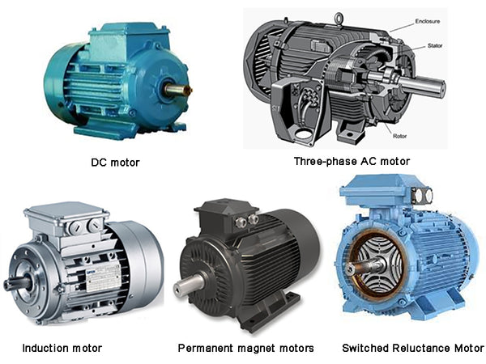

рис.9. Двигуни

- Пневматичні циліндри. З точки зору логіки керування вони часто сприймаються як дискретні виконавчі механізми, проте фізично їх рух має тривалість, інерцію і залежність від навантаження. Це означає, що навіть для пневматики програмна логіка повинна враховувати час виконання дії та підтвердження її завершення.

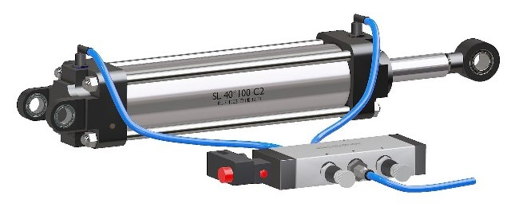

рис.10. Пневмоциліндр

- Гідравлічні приводи використовуються в машинах, де потрібні великі зусилля або стабільна передача потужності. Для машинної автоматики вони важливі не стільки як джерело енергії, скільки як механізми з чіткими обмеженнями і вимогами до безпеки. Керування гідравлікою майже завжди вимагає узгодження логіки, датчиків і режимів роботи приводу.

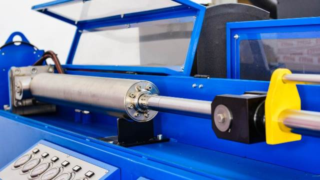

рис.11. Гідравлічний циліндр

- Допоміжні механізми, такі як клапани, муфти або гальма, часто не сприймаються як основні виконавчі елементи, але саме вони визначають допустимість і коректність руху. Клапан може дозволяти або забороняти подачу енергії, муфта — з’єднувати або роз’єднувати механізми, гальмо — фіксувати положення. У логіці машинної автоматики ці елементи відіграють роль умов і блокувань, без яких керування рухом стає небезпечним або некерованим.

Ключовою особливістю виконавчих механізмів у машинній автоматиці є те, що рух розглядається як керований процес. Будь-яка команда має початок, перебіг і завершення, які повинні бути узгоджені з іншими рухами та станами машини. Це створює прямий зв’язок між механікою і логікою керування.

Зворотний зв’язок є важливим, але не завжди обов’язковим елементом. У простих механізмах керування може здійснюватися без прямого зворотного зв’язку, із підтвердженням дії через часові або кінцеві умови. У складніших системах зворотний зв’язок по положенню або швидкості стає основою для синхронізації і точності руху. В обох випадках програмна логіка повинна явно враховувати, чи є рух контрольованим лише командою, чи підтверджується фактичним станом механізму.

### Перетворювачі та приводи

Перетворювачі та приводи є однією з ключових специфік машинної автоматики, оскільки саме вони з’єднують логіку керування з реальним рухом машини. Без цього рівня машинна автоматика зводилася б до вмикання і вимикання механізмів, тоді як на практиці необхідно керувати швидкістю, моментом, положенням і динамікою руху.

- **Перетворювачі частоти (ПЧ)** для асинхронних двигунів застосовуються тоді, коли від двигуна вимагається керований рух, а не просто обертання. ПЧ дозволяє змінювати швидкість, напрямок і характер розгону та гальмування, але при цьому сам по собі не визначає, коли і з якою метою цей рух має виконуватися. У машинній автоматиці ПЧ розглядається як окрема підсистема з власними режимами, станами та діагностикою, а не як «розширений вихід» PLC.

рис.12. Перетворювач частоти

- **Сервоприводи** являють собою більш інтегровану систему, у якій двигун, енкодер і регулятор працюють як єдине ціле. Така структура забезпечує точне керування положенням, швидкістю і моментом, а також можливість синхронізації кількох осей. З точки зору машинної автоматики сервопривід є не просто виконавчим механізмом, а джерелом інформації про фактичний стан руху, що безпосередньо впливає на логіку керування машиною.

рис.13. Сервопривод з серводвигуном

Важливою особливістю перетворювачів і приводів є роль параметризації. Значна частина поведінки руху означується не програмою PLC, а налаштуваннями самого приводу: характеристиками розгону, обмеженнями швидкості і моменту, реакціями на помилки. У машинній автоматиці це означає, що логіка керування і поведінка руху розподілені між PLC і приводом, і ці дві частини повинні бути узгоджені між собою.

Саме на цьому рівні чітко проявляється відмінність між логікою керування і керуванням рухом. Логіка керування відповідає на питання, коли і за яких умов рух дозволений або заборонений, у якому стані перебуває машина і який наступний крок допустимий. Керування рухом визначає, як саме цей рух виконується з точки зору фізики: з якою швидкістю, з яким прискоренням і з якою точністю. Змішування цих двох рівнів у машинній автоматиці швидко призводить до складних і нестабільних систем.

### PLC

Машинна автоматика накладає специфічні вимоги до PLC, як до технічного засобу. Ці вимоги пов’язані насамперед з керуванням рухом, часовою детермінованістю і взаємодією з приводами.

- Наявність швидких дискретних входів. У машинній автоматиці PLC часто повинен обробляти сигнали з енкодерів, датчиків положення або імпульсних датчиків, де звичайна швидкість опитування входів є недостатньою. Швидкі входи, які також називаються лічильними входами, дозволяють реагувати на події з високою часовою роздільною здатністю і зменшують залежність логіки від циклу виконання програми. Тобто обробка цих входів великою мірою реалізована на окремих апаратних елементах, вбудованих в PLC. Про реалізацію таких входів можна почитати в посібнику в лекції  [Лічильні входи PLC](../../plc/hardware/count.md)

- Імпульсні виходи. Аналогічно важливою є підтримка апаратних функцій формування імпульсів, таких як [PWM](../../plc/hardware/pwm.md) та [PTO](../../plc/hardware/pto.md). У багатьох машинах керування рухом або допоміжними механізмами виконується без повноцінних сервоприводів, і PLC повинен мати можливість формувати керуючі сигнали з гарантованими часовими параметрами на апаратному рівні. Це дозволяє відокремити генерацію імпульсів від програмної логіки і підвищити детермінізм системи.

- Спеціальні бібліотеки. Критичною вимогою для машинної автоматики є наявність в PLC вбудованих засобів або бібліотек для керування приводами. Йдеться не лише про комунікацію з ПЧ або сервоприводами, а про підтримку типових функцій руху: запуск, зупинка, позиціонування, синхронізація, обробка станів і помилок. Такі бібліотеки дозволяють працювати з рухом на рівні логіки машини, не переносячи фізичні деталі керування в основний алгоритм.

- Жорсткий реальний час. Ще однією важливою особливістю є підтримка реального часу на рівні системи PLC. Це стосується як стабільності циклу виконання програми, так і можливості пріоритетного виконання задач, пов’язаних з рухом або безпекою. У машинній автоматиці PLC повинен не лише «встигати», але і виконувати завдання у чіткі інтервали часу.

- Комунікації. Машинна автоматика передбачає одночасну роботу з приводами, HMI, засобами безпеки і інтеграційними інтерфейсами. Тому PLC повинен підтримувати кілька промислових мереж і протоколів без втрати детермінізму для критичних задач.

### HMI

В машинній автоматиці немає особливих вимог до виконання HMI. Як вже зазначалося здебільшого використовуються операторські панелі та локальні засоби контролю та керування, такі як кнопки, індикатори, світлосигнальні колони. 

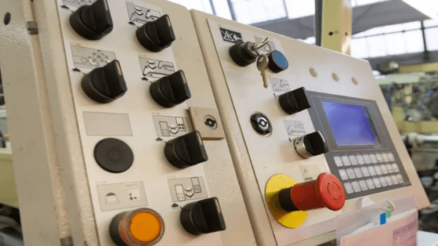

рис.14. Пульт керування з операторською панеллю та засобами локального контролю та керування

Світлосигнальні колони забезпечують швидку візуальну індикацію стану машини без необхідності взаємодії з панеллю HMI. Світлосигнальні колони використовуються для відображення режиму роботи, наявності аварій, готовності до запуску або необхідності втручання оператора. З точки зору системи керування вони є частиною HMI і керуються логікою PLC, що дозволяє узгодити візуальну індикацію зі станами машини і подіями безпеки.

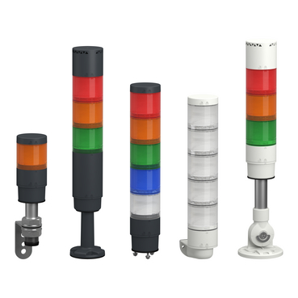

рис.15. Світлосигнальні колони

### Безпекові пристрої та контури

У машинній автоматиці безпекові пристрої є невід’ємною частиною поведінки машини і безпосередньо визначають, які дії дозволені в кожен момент часу. Їх основна функція полягає у переведенні машини в безпечний стан та унеможливленні небезпечних рухів. 

Safety-виконання в машинній автоматиці призначене для гарантованого переведення машини в безпечний стан у разі небезпечної ситуації або відмови. Його ключова особливість полягає в тому, що безпечна реакція повинна відбутися передбачувано і незалежно від стану основної логіки керування або програмних помилок. На відміну від цього, non-safety виконання використовується для нормального керування роботою машини і не має вимоги збереження безпечної поведінки у разі відмови. Помилки або збої в non-safety логіці можуть призводити до некоректної роботи, але не повинні використовуватися для реалізації функцій безпеки. Принципова відмінність полягає в тому, що safety-виконання проєктується з урахуванням відмов, діагностики і контрольованої деградації, тоді як non-safety виконання орієнтоване на функціональність і продуктивність. У машинній автоматиці це означає чітке розділення логіки керування і логіки безпеки, навіть якщо вони реалізовані в межах одного контролера.

Безпека реалізується не окремими елементами, а у вигляді безпечних контурів. Це означає, що всі компоненти, які беруть участь у формуванні безпечної реакції, повинні відповідати вимогам safety, а не лише первинні датчики. До безпечного контуру входять не тільки аварійні кнопки, вимикачі дверей або світлові завіси, але й логічні елементи обробки сигналів, комунікаційні засоби, виконавчі елементи та приводи, які безпосередньо реалізують зупинку або блокування руху. З точки зору керування це означає, що безпечний контур повинен гарантувати переведення машини в безпечний стан незалежно від стану основної логіки керування. Якщо хоча б одна ланка цього контуру не є safety-виконанням, то безпечна функція в цілому не може вважатися реалізованою коректно. У цьому контексті PLC також повинен мати safety-виконання або спеціалізовані safety-компоненти, які забезпечують обробку безпекових сигналів і формування безпечних реакцій незалежно від стану основної програми керування.

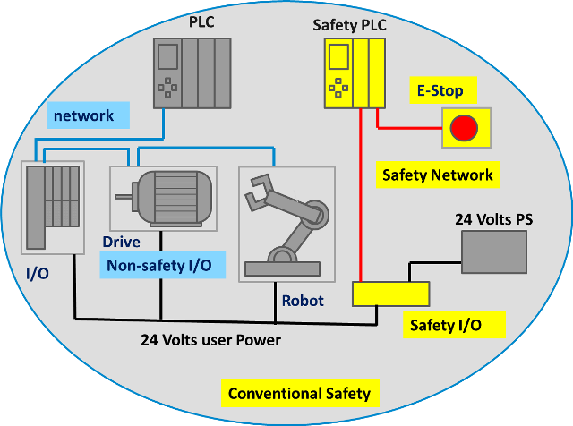

рис.16. Безпекові контури в складі системи керування

У європейській практиці засоби із safety-виконанням, як правило, мають характерне кольорове позначення корпусу, яке дозволяє візуально відрізнити елементи безпечних контурів від стандартних компонентів керування. Найпоширенішим є жовте виконання корпусу, яке використовується як маркер належності пристрою до safety-частини системи, незалежно від його конкретної функції. Таке кольорове позначення застосовується для safety-реле, safety-PLC, модулів safety-I/O, а також інших компонентів, що беруть участь у реалізації безпечних функцій. Жовтий колір у цьому контексті не є індикацією стану і не означає аварію, а виконує роль інженерного ідентифікатора, що вказує на підвищені вимоги до надійності, діагностики та відмовостійкої поведінки.

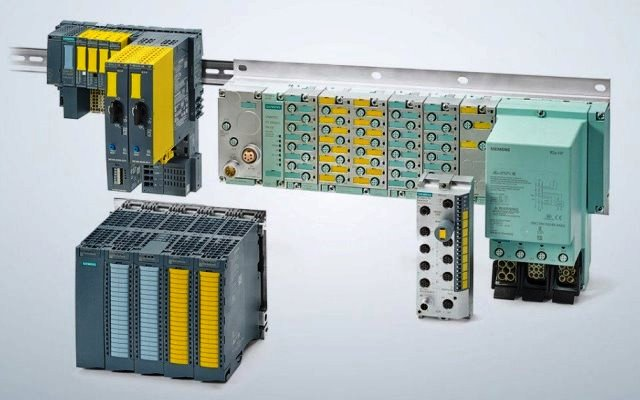

рис.17. Безпекові модулі в PLC (позначені жовтим кольором)

До типових безпекових пристроїв (safety) машинної автоматики зокрема належать наступні засоби. 

- Аварійні кнопки зупинки використовуються для негайного припинення небезпечних рухів незалежно від поточного режиму роботи машини. Вони не сигналізують про стан процесу, а безпосередньо ініціюють перехід у безпечний стан і блокують повторний запуск до усунення причини зупинки.

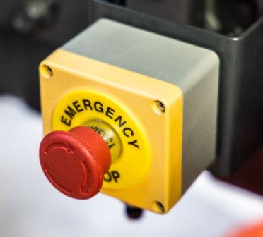

рис.18. Безпекова кнопка швидкого зупину

- Вимикачі для дверей і захисних кожухів контролюють доступ до небезпечних зон машини. Їх спрацювання означає, що подальший рух або запуск механізмів є недопустимим. У машинній автоматиці такі пристрої тісно пов’язані з режимами налагодження та обслуговування, оскільки вони визначають, у яких умовах оператор може взаємодіяти з механікою.

рис.19. Безпековий вимикач для дверей

- Світлові завіси та лазерні сканери застосовуються для контролю робочого простору без фізичних огорож. Вони дозволяють виявляти присутність людини або об’єкта в небезпечній зоні і використовуються для зупинки або запобігання запуску рухів. Їх роль особливо важлива в машинах з автоматичними або швидкими рухами.

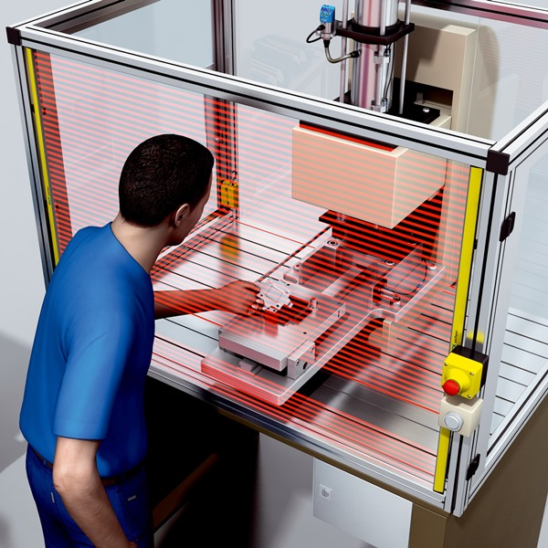

рис.20. Світлові завіси

- Дворукові кнопкові пости керування застосовуються там, де необхідно гарантувати, що оператор перебуває поза небезпечною зоною під час запуску або виконання операції. У логіці машинної автоматики вони формують умову дозволу дії, а не саму команду руху.

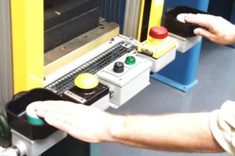

рис.21. Дворукові кнопкові пости 

### Промислові мережі

У машинній автоматиці промислові мережі використовуються як інфраструктура для керування рухом, синхронізації механізмів і забезпечення безпечної поведінки машини. Саме ці задачі визначають їхню специфіку і пояснюють, чому в цій галузі сформувався окремий набір мережевих технологій.

Ключовою вимогою до мереж у машинній автоматиці є детермінізм. Обмін даними повинен відбуватися з передбачуваними затримками, оскільки інформація з мережі безпосередньо впливає на рух, взаємні блокування і реакцію на події. На відміну від процесної автоматики, де часові вимоги часто вимірюються секундами або сотнями мілісекунд, у машинній автоматиці затримки рахуються мілісекундами або навіть меншими інтервалами. Для прикладу популярними в машинній автоматиці є CAN-bus та CanOpen, Profibus DP, Profinet IO EtherNet/IP, Sercos та інші. Такі мережі в тому числі передбачають спеціальні режими та команди синхронного обміну. Наприклад, наявність так званого ізохронного обміну передбачає обмін даними в межах синхронного часового вікна, що дозволяє забезпечити синхронність виконання дій кількома пристроями одночасно.    

Окреме місце в машинній автоматиці займають мережі датчиків, типу AS-i і IO-Link, які орієнтовані на підключення датчиків і простих виконавчих пристроїв на нижньому рівні. Їх застосування зумовлене великою кількістю дискретних сигналів і вимогою до простої, надійної інтеграції без ускладнення архітектури системи керування.

рис.22. (згенеровано ШІ)

### Інтеграція машинної автоматики з суміжними підсистемами

У машинній автоматиці інтеграція з суміжними підсистемами є необхідною умовою роботи машини в складі виробничої системи. При цьому характер інтеграції суттєво відрізняється залежно від того, йдеться про горизонтальну чи вертикальну взаємодію.

Горизонтальна інтеграція пов’язана з взаємодією машини з іншими машинами, станціями або допоміжними підсистемами на одному рівні виробництва. У такому випадку ключовими є обмін станами, сигналами готовності, дозволами на запуск і синхронізація циклів. Саме тому для горизонтальної інтеграції важливою є уніфікована модель станів і подій, а не просто обмін змінними.

Вертикальна інтеграція забезпечує зв’язок машини з системами верхнього рівня, такими як SCADA, MES або аналітичні сервіси. Тут акцент зміщується з реального часу на прозорість, стандартизоване представлення даних і можливість масштабування. Машина розглядається як джерело структурованої інформації про стани, режими, аварії, лічильники і параметри, значення KPI, а не як об’єкт прямого керування.

Специфікою машинної автоматики є те, що інтеграція не повинна порушувати детермінізм локального керування. Будь-який зовнішній обмін даними має бути логічно і часово відокремлений від критичних задач руху і безпеки. Це означає, що інтеграційні інтерфейси завжди працюють через чітко визначені межі, а не мають прямого доступу до внутрішньої логіки машини. Саме ці вимоги зумовили появу і використання спеціалізованих стандартів, зокрема. 

- PackML: орієнтований на уніфікацію станів машин і ліній у пакувальній і суміжних галузях. Він дозволяє описувати поведінку машини через стандартний набір режимів і переходів, що суттєво спрощує горизонтальну і вертикальну інтеграцію без втручання у внутрішню реалізацію керування.

- OPC UA: застосовується здебільшого для вертикальної інтеграції завдяки можливості опису даних у вигляді структурованої інформаційної моделі. У контексті машинної автоматики це дозволяє представляти машину як набір об’єктів зі станами, параметрами і подіями, що добре узгоджується з подієво-орієнтованою природою машинного керування.

- MQTT використовується переважно для подійного і асинхронного обміну з зовнішніми системами, зокрема для моніторингу, збору даних і аналітики. У машинній автоматиці MQTT зазвичай не застосовується для безпосереднього керування, але є зручним механізмом для передачі інформації про стани, аварії або виробничі показники без жорстких вимог до реального часу.

Спільною рисою всіх підходів до інтеграції в машинній автоматиці є орієнтація на стандартизовані інтерфейси і моделі, а не на індивідуальні сигнали. Це дозволяє розглядати машину як автономну, логічно завершену одиницю, яка взаємодіє з оточенням через чітко визначені межі відповідальності.

## 3. Особливості реалізації застосунків для системи керування

Вище ми розглянули особливості машинної автоматики з точки зору функцій і апаратного забезпечення. Тут приділимо увагу тому, як вимоги до функцій відображається на створення застосунків. 

### Підхід до керування на основі станів

Як вже зазначалося вище, машина розглядається як цілісний об'єкт, який описується своїми станами, режимами та поведінкою. Становий підхід є базовим для машинної автоматики, оскільки дозволяє формалізувати поведінку машини у часі. На відміну від універсальних або плоских алгоритмів, він описує роботу машини не через окремі сигнали чи умови, а через послідовність логічно завершених станів і переходів між ними. Машину в цьому випадку варто представляти через модель обладнання, яка описана в посібнику в темі [Рольова модель обладнання: теоретична частина](../../pkisc/equiprole/teor.md). 

Стан у контексті машини слід розуміти як узгоджений набір умов, що описує поточну фазу роботи машини. Це включає положення механізмів, активні дозволи, режим роботи, а також очікувані події. Такий підхід дозволяє відокремити опис поведінки машини від деталей реалізації окремих дій. Перехід між станами ініціюється подіями. Подією може бути спрацювання датчика, завершення руху, команда оператора, сигнал безпеки або внутрішня логічна умова. Важливо, що одна й та сама подія може мати різний ефект залежно від поточного стану машини. Це є принциповою відмінністю станової логіки від плоских умовних алгоритмів. Принципи означення автомату станів, режимів розглянуто як в теоретичній так і практичній частині теми [Рольова модель обладнання](../../pkisc/equiprole/README.md).  

На рис.22 показаний приклад графічного представлення автомату станів базі специфікації PackML, яка розроблена для пакувальних машин. Для кращого розуміння, нижче наведемо пояснення. Кожен прямокутник вказує на певний стан, в якому перебуває машина, а стрілка - перехід від стану до стану за спрацювання умови, яка написана на стрілці. Ті умови, які позначені як `SC` - це спрацювання внутрішньої логіки роботи програми, яка може у свою чергу залежати від входів системи керування, а інші умови - це команди які надає оператор або суміжна система. 

Класичний цикл роботи машини, під час якого не виникає жодних нештатних ситуацій, проходить послідовно через стани `Idle` → `Starting` → `Execute` → `Completing` → `Complete`, після чого машина або переходить до наступного циклу, або повертається у стан очікування.  

- `Idle` -  машина готова до запуску, але не виконує виробничий цикл. Очікує команду `Start`.
- `Starting` - підготовка до роботи: ініціалізація, перевірки, вихід у робочий режим.
- `Execute` -  основний робочий стан. Саме тут виконується виробничий процес.

- `Completing` -  Контрольоване завершення циклу після досягнення умов завершення.

- `Complete` - Цикл завершено коректно. Звідси можливий перехід у новий цикл. 

- `Resetting` -  Повернення у Idle після команди `Reset`. Цей крок потрібен для того щоб підготовити машину до готовності запуску нового циклу роботи машини після її зупиники.

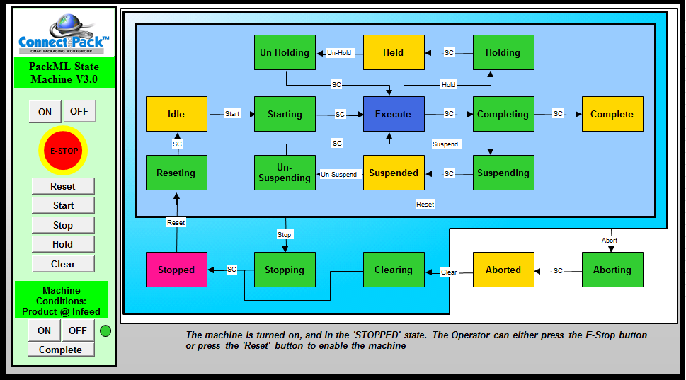

рис.22. Автомат станів машини на базі специфікації PackML

Враховуючи що під час роботи машини можуть виникати нештатні ситуації, вони повинні оброблятися за відповідними алгоритмами, які виконуються в залежності від активності відповідних станів. На рис.22 видно, що стани об'єднані в групи, які відображають логічно завершені фрагменти поведінки машини та призначені для структурованого опису її роботи (внутрішній прямокутник), зупинки (що містить стани Stop..), та аварійна зупинка (Abort..). Якщо стрілка виходить не з окремого стану, а від межі групи, це означає, що відповідний перехід можливий з будь-якого стану, який входить до цієї групи. У автоматі станів, що показано на рис.22, можливі такі ситуації:

- пауза, пов'язана наприклад з тимчасовою відсутністю сировини: шлях `Execute` -> `Suspending` -> `Suspended` -> `Un-Suspending` -> `Execute`
- утримування - довготривала пауза яка передбачає безпечну для продукції роботу, але не зупинку: шлях `Execute` -> `Holding` -> `Htld` -> `Un-Holding` -> `Execute`  

- зупинка за вимогою оператора, яка викликана нештатною ситуацією: шлях `робочі стани` -> `Stopping` -> `Stopped` -> `Resering` -> `Idle`
- аварійна зупинка - швидка зупинка: шлях `робочі стани або Stopping` -> `Aborting` -> `Aborted` -> `Clearing` -> `Stopped` -> `Reseting` -> `Idle`  

Де:

- `Held ` - утримування, довготривала пауза яка передбачає безпечну для продукції роботу
- `Holding` - підготовка машини до стану утримування
- `Un-Holding` - підготовка машини до стану роботи після утримування
- `Suspended` - пауза, наприклад у зв'язку з відсутністю сировини
- `Suspending` - перехід в паузу
- `Un-Suspending` - вихід з паузи в стан роботи
- `Stopping` - процес контрольованої зупинки з будь-якого активного стану.
- `Stopped` - машина зупинена за вимогою оператора. 

- `Aborted` - машина в стані аварійного зупину, подальша робота неможлива без `Clearing`.
- `Aborting` - процес негайного припинення виконання через аварію
- `Clearing` - усунення аварійного стану з поверненням у `Stopped`.

Цей автомат: 

- уніфікує керування машинами різних виробників;
- чітко відокремлює робочі, паузні, зупинені та аварійні стани;
- дозволяє будувати HMI, рецепти, логіку без прив’язки до конкретної реалізації;
- є базою для PackML, RAMI 4.0 та машинних станів у MES.

Варто зауважити що на рис.22 показаний людино-машинний інтерфейс вочевидь зроблений на базі операторської панелі. Однак, наведені вище стани, за рахунок дискретної їх природи, добре відображаються на світлових колонах. Наприклад робочі стани можна показувати через зелену секцію, паузу - через жовту, утримування - рожеву, а аварійну зупинку - через червону. Перехідні стани можна сигналізувати блиманням секцієї. Це дає змогу оператору бачити стан машини у будь якій точці видимості світлосигнальної колони. 

Окрему роль у становій моделі відіграють режими роботи. Автоматичний, ручний, налагоджувальний або сервісний режими зазвичай реалізуються як надбудова над базовими станами або як окремі гілки станної моделі. 

На рис.23 показно три різні автомати станів, в залежності від вибраного режиму роботи машини.

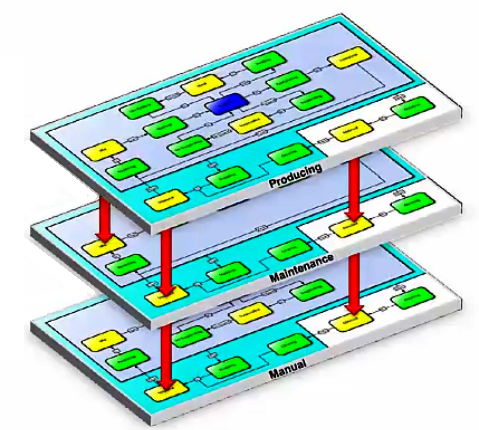

рис.23. Різні автомати станів при різних режимах роботи машини

Становий підхід також полегшує інтеграцію з іншими підсистемами. Обмін із суміжними машинами або системами верхнього рівня зводиться до передачі станів і подій, а не деталей внутрішнього алгоритму. Саме на цьому принципі будуються такі стандарти, як PackML, де поведінка машини описується через уніфікований набір станів.

Підхід на основі станів також спрощує реалізацію логіки в ПЛК. Він може бути реалізований у різних формах, але ключовим є збереження чіткої відповідності між логічними станами машини і структурою програми. Саме це дозволяє масштабувати систему керування без втрати керованості.

### Час у машинній автоматиці

Час у машинній автоматиці є одним з ключових параметрів, що означує поведінку машини. На відміну від багатьох інших класів автоматизації, тут час безпосередньо пов’язаний з рухом, механікою і безпекою, а отже повинен враховуватися явно.

Для опису ритму роботи машини або її частини використовується поняття **такту**. Такт означує, з якою періодичністю виконуються операції, переміщуються вироби або повторюється цикл. У машинній автоматиці такт є результатом узгодження механічних можливостей, логіки керування і вимог продуктивності. Зміна такту майже завжди означає зміну поведінки машини, а не лише параметра в програмі. 

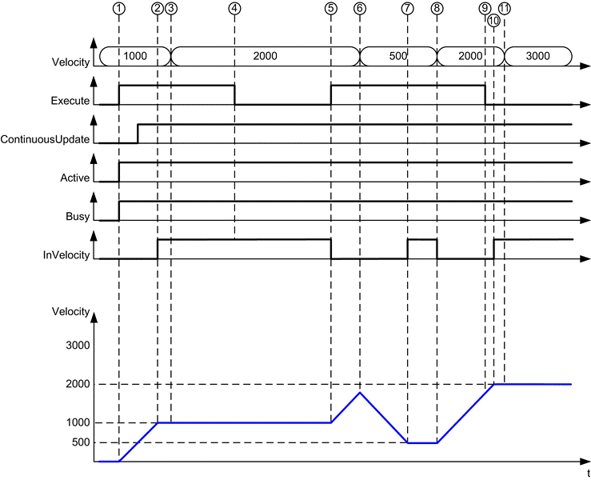

рис.24. Приклад часової циклограми

Варто також враховувати **затримки**, які виникають як у логіці керування, так і у фізичному виконанні дій. У машинній автоматиці важливо розрізняти навмисні затримки, що вводяться для узгодження операцій, і неминучі затримки, пов’язані з інерцією механізмів, реакцією датчиків або обміном по мережі. Невраховані затримки часто призводять до нестабільної або небезпечної роботи машини.

**Синхронізація рухів** є однією з найскладніших часових задач машинної автоматики. Кілька механізмів можуть працювати паралельно, але їхні рухи повинні бути узгоджені в часі і просторі. Це стосується як одночасного запуску, так і правильного завершення рухів. У таких задачах час перестає бути лише параметром, а стає частиною логіки керування, що визначає допустимість переходів між станами.

Принципово важливою є відмінність між логічним і фізичним часом. **Логічний час** визначається виконанням програми PLC, циклами опитування і обробкою подій. **Фізичний час** визначається реальною поведінкою механіки, приводів і датчиків. У машинній автоматиці ці два часові виміри не збігаються автоматично і потребують узгодження. Команда, видана логічно в один момент, реалізується фізично з певною затримкою і з урахуванням динаміки системи.

У машинній автоматиці час повинен розглядатися як повноцінний інженерний ресурс. Його необхідно проєктувати, перевіряти і контролювати так само уважно, як і логіку станів або механічну конструкцію машини. 

### Програма в PLC

У машинній автоматиці роль PLC чітко обмежена координацією поведінки машини в часі, з урахуванням механіки, руху та вимог безпеки. Саме ці обмеження визначають специфіку використання PLC у машинних системах. 

Ключовою особливістю є подійно-орієнтований характер роботи. PLC у машинній автоматиці постійно реагує на події, що надходять від датчиків, приводів, засобів безпеки та оператора. Програма організована навколо переходів між станами машини, а не навколо обчислення значень параметрів. Це призводить до домінування логіки дозволів, блокувань і послідовностей. У процесній автоматиці типовим є періодичне виконання задач, тоді як в машинній автоматиці нерідким є виклик задачі за спрацюванням апаратної події.

Жорсткі вимоги до детермінізму є ще однією принциповою особливістю. PLC повинен гарантувати передбачуваний час реакції на події, оскільки затримки безпосередньо впливають на синхронізацію рухів і безпечну поведінку машини. У машинній автоматиці важливим є не максимальна продуктивність, а стабільність виконання циклу і повторюваність реакцій.

PLC у машинній автоматиці тісно інтегрований з приводами і перетворювачами. Обмін із цими підсистемами відбувається не на рівні окремих сигналів, а на рівні станів, команд і підтверджень. Це вимагає від PLC чіткої структуризації програми та розмежування логіки керування і керування рухом. А це значить що не тільки машина моделюється як обладнання зі своїми станами і режимами, а і його складові також варто розглядати як обладнання нижнього рівня.

Окремою особливістю є співіснування стандартної логіки керування і логіки безпеки. Навіть якщо функції safety реалізовані в окремих модулях або контролерах, PLC повинен узгоджувати свою поведінку з безпечними станами машини. Це накладає обмеження на допустимі дії і визначає пріоритети виконання алгоритмів. У той же час, безпекову логіку варто прописувати як станонезалежну, для того щоб усунути помилки в програмі, пов'язані з зависанням станів.   

Ще однією характерною рисою є потреба в чіткій програмній архітектурі. У машинній автоматиці PLC-програма швидко ускладнюється за рахунок режимів, аварій, ручних операцій і сервісних функцій. Без структурованого підходу така програма стає нестабільною і важкою для супроводу, що безпосередньо впливає на надійність машини. Як вже зазначалося, виділення обладнання та означення їх станів безпосередньо впливає на побудову логіки програми. Також рекомендується використовувати процедурне керування, яке означено в стандарті ISA-88.

### Реалізація HMI

У машинній автоматиці HMI повинен забезпечувати контрольовану взаємодію оператора з машиною в межах дозволених режимів і станів. 

Однією з ключових функцій HMI є відображення поточного стану машини. Оператор повинен однозначно розуміти, у якому стані та режимі перебуває машина, на якому етапі циклу вона знаходиться і чи дозволене виконання наступних дій. У машинній автоматиці це зазвичай реалізується через індикацію станів, а не через детальні графіки або тренди. Також вже було загадано про використання світлосигнальної колони для контролю станів.

HMI виконує важливу роль у керуванні режимами роботи. Перемикання між автоматичним, ручним, налагоджувальним або сервісним режимами здійснюється саме через інтерфейс оператора, але завжди під контролем логіки PLC. HMI лише ініціює зміну режиму, тоді як рішення про її допустимість приймає система керування.

Ще однією характерною функцією є запуск, зупинка і керування циклом машини. Команди оператора на початок або завершення роботи подаються через HMI, але виконуються лише за умови виконання всіх логічних і безпекових умов. Таким чином HMI не керує рухом безпосередньо, а взаємодіє з логікою керування через чітко визначені інтерфейси.

Важливим елементом HMI є відображення повідомлень про помилки, аварії та попередження. У машинній автоматиці такі повідомлення мають бути пов’язані зі станами машини і давати оператору розуміння, чому робота зупинена і які дії необхідні для відновлення. Це відрізняє HMI машини від процесних систем, де акцент часто робиться на аналізі параметрів.

## Відеозапис лекції

- [Відеозапис лекції](https://youtu.be/LUi8QbfD-FM)

## Джерела

1. 

## Автори

Теоретичне заняття розробив [Олександр Пупена](https://github.com/pupenasan). 

## Feedback

Якщо Ви хочете залишити коментар у Вас є наступні варіанти:

- [Обговорення у WhatsApp](https://chat.whatsapp.com/BRbPAQrE1s7BwCLtNtMoqN)
- [Обговорення в Телеграм](https://t.me/+GA2smCKs5QU1MWMy)
- [Група у Фейсбуці](https://www.facebook.com/groups/asu.in.ua)

Про проект і можливість допомогти проекту написано [тут](https://asu-in-ua.github.io/atpv/)
