[<- До підрозділу](README.md)  			[Коментувати](#feedback)

# Автентифікація в Google Workspace : практична частина

**Тривалість**: 1 акад. година.

**Мета:** Навчитися користуватися механізмом автентифікації в Google Workspace API через сервісний аккаунт та API Key. 

**Лабораторна установка**

- Апаратне забезпечення: ПК, бажано віртуальну машину з Windows 10
- Програмне забезпечення: хмарний застосунок Google Sheet, Node-RED

## Порядок виконання роботи 

У цій лабораторній роботі необхідно:

- створити та налаштувати сервісний акаунт Google для доступу через HTTP API
- створити ключ API key в форматі JSON для сервісного аккаунту, отримати JWT, за ним отримати тимчасовий токен доступу
- використати Google Sheet для перевірки доступу до сервісів Google 

### Пре-реквізити

Для лабораторної роботи необхідно мати встановлений Node-RED, та мінімальні знання його використання.

- [ ] Якщо у Вас не встановлений Node-RED, пройдіть практичне заняття [Вступ до Node-RED: практичне заняття](../../nodered/intro/lab.md)
- [ ] Для кращого розуміння матеріалу рекомендується пройти практичне заняття [JSON Web Tokens : практичне заняття](../../nets/security/jwtlab.md)
- [ ] Якщо у Вас немає облікового запису Google - створіть його [на сайті](https://www.google.com/). Це безкоштовно, потребується тільки поштова скринька і номер телефону. 
- [ ] Ознайомтеся з [Автентифікація в Google : теоретична частина](teor.md).

### 1.Створення проєкту та сервісного аккаунту Google 

#### 1.1. Створення проекту

У цьому пункті необхідно за допомогою консолі Google створити проєкт.  

- [ ] Зайдіть на сторінку налаштування API для сервісів, якими Ви користуєтеся на GoogleCloud  [https://console.cloud.google.com/apis](https://console.cloud.google.com/apis). 
- [ ] При першому входженні Вам запропонують прийняти умови використання. Для того, щоб користуватися сервісами виставте опцію "Приймаю умови використання" після чого натисніть кнопку "Прийняти і продовжити" 

- [ ] Натисніть `Select Project`

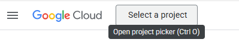

рис.1.

- [ ] Натисніть `New Project` , дайте назву проекту і натисніть `Create`

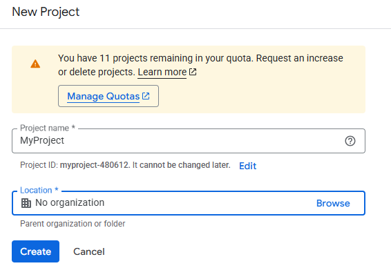

рис.2. Створення проекту (назва)

#### 1.2. Створення сервісного аккаунту

У цьому пункті необхідно за допомогою консолі Google створити сервісний аккаунт від імені якого буде проводитися доступ до API. 

- [ ] Зайдіть в головне меню і перейдіть в розділ створення сервісних аккаунтів 

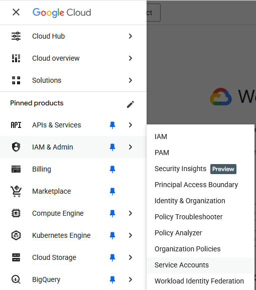

рис.3. Перехід до сервісних акаунтів

- [ ] Натисніть `Create service account` 

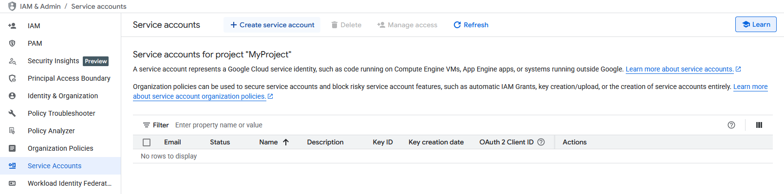

рис.4. Створення сервісного акаунту

- [ ] На першому кроці означте назву, потім натисність `Create and continue`

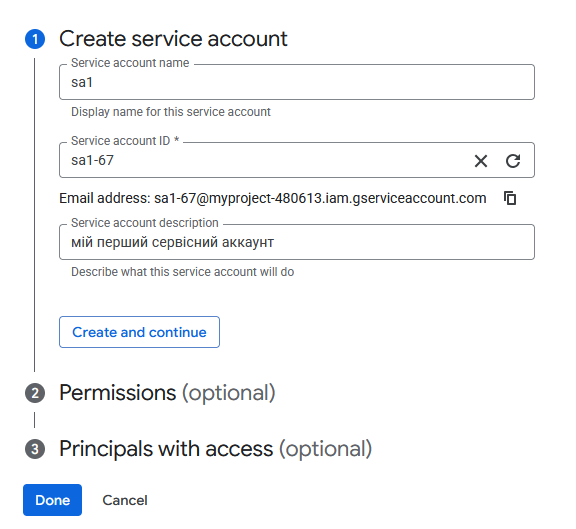

рис.5. 

- [ ] На другому кроці можна поки нічого не вписувати, а просто натиснути `Continue`.  
- [ ] На третьому кроці кроці виберіть `Done`.

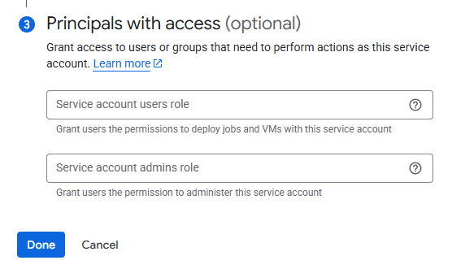

 рис.6.

- [ ] Далі відкриється перелік усіх сервісних аккаунтів. Виберіть новостворений сервісний аккаунт.


рис.7. 

- [ ] Подивіться налаштування сервісного аккаунту (рис.8).

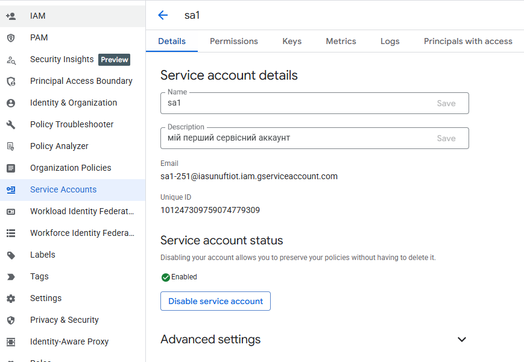

рис.8. 

### 2. Надання доступу до сервісів та таблиць Google Sheet через сервісний аккаунт

У цьому пункті необхідно забезпечити доступ до Google Sheet API для даного проєкту, а також надати доступ до потрібної таблиці сервісному аккаунту.

- [ ] Перейдіть на сторінку бібліотеку сервісів `API & Services -> Library`. 

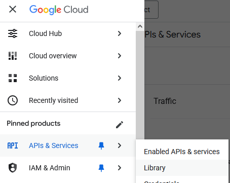

рис.9.

- [ ] У розділі Google Workspace виберіть Google Sheets API
- [ ] Натисніть `Enable` для активації доступу до цього сервісу в межах проєкту.

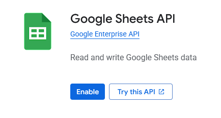

рис.10. Включення активації сервісу

- [ ] Зайдіть на головну сторінку [Google](https://www.google.com/), зайдіть в застосунок `Google Sheet`(`Таблиці`) і створіть нову таблицю.
- [ ] Напишіть довільний текст в перший трьох стовпцях першого рядку

- [ ]  Поділіться документом з сервісним аккаунтом за його іменем, перед цим приберіть опцію `Сповістити`

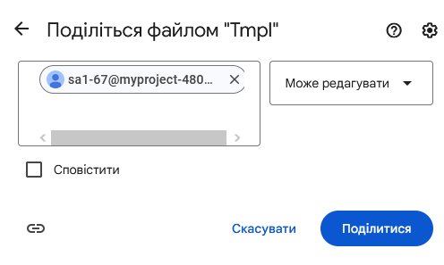

рис.11. Надання прав сервісному аккаунту

### 3. Створення JSON ключа сервісного акаунта

У цьому пункті необхідно створити ключ JSON, через який будуть передаватися облікові дані.

- [ ] У Google Cloud Console оберіть свій сервісний акаунт.
- [ ] Перейдіть на вкладку  `Keys`.
- [ ] Натисніть `Add Key → Create new key`.
- [ ] Виберіть тип: `JSON`  і `Create`, це завантажить файл на комп'ютер. Цей файл є приватним ключем, який використовуватиметься для отримання токена.
- [ ] Відкрийте ключ в текстовому редакторі, наприклад [Notepad++](https://notepad-plus-plus.org/). Зверніть увагу на його структуру, призначення полів наступне:

| Поле                          | Призначення                                                  |
| ----------------------------- | ------------------------------------------------------------ |
| `type`                        | Вказує тип облікових даних. Для сервісних акаунтів завжди `service_account`. Це сигнал бібліотекам Google, що автентифікація має виконуватися через JWT + OAuth 2.0. |
| `project_id`                  | Ідентифікатор проєкту Google Cloud, до якого належить сервісний акаунт. Використовується для білінгу та прив’язки ресурсів. |
| `private_key_id`              | Ідентифікатор приватного ключа. Google використовує його для ротації ключів та керування ключами сервісного акаунта. Сам по собі він не є секретним, але дозволяє Google знати, який ключ на руках. |
| `private_key`                 | Приватний ключ для підпису JWT у форматі PKCS#8 (PEM). Це найважливіше та найсекретніше поле — саме цим ключем підписується JWT для отримання OAuth-токенів (`RS256`). Якщо цей ключ витікає, зловмисник може отримувати токен доступу від сервісного акаунта. |
| `client_email`                | Ідентичність сервісного акаунта у формі електронного листа.  |
| `client_id`                   | Числовий ідентифікатор клієнта (OAuth 2.0). Використовується рідше, ніж `client_email`, але є у метаданих та в Cloud Console. |
| `auth_uri`                    | URL для авторизації в класичному OAuth 2.0 user-consent flow. Для сервісних акаунтів це фактично не використовується, але залишається в JSON для сумісності. |
| `token_uri`                   | URL, на який код має надсилати JWT для обміну на токен доступу |
| `auth_provider_x509_cert_url` | Посилання на публічні сертифікати Google, які використовуються для перевірки підпису Google ID tokens. |
| `client_x509_cert_url`        | URL, за яким можна отримати публічний сертифікат сервісного акаунта (X.509). Цим сертифікатом інші сервіси можуть перевіряти підписи, зроблені приватним ключем. |
| `universe_domain`             | Доменна зона для API (майже завжди `googleapis.com`). Google ввів це для мультидоменних інсталяцій Google Cloud, але для звичайних користувачів це просто метадані. |

### 4. Отримання JWT у Node-RED

У цьому пункті ключ API, який є приватним, треба перетворити в JWT для безпечної автентифікації на сервері автентифікації Google.  

- [ ] Запустіть Node-RED з чистим проєктом.
- [ ] Імпортуйте в Node-RED наступні потоки:

```json
[{"id":"c9a48333878c1b32","type":"inject","z":"c5a2236e723cfe5f","name":"","props":[{"p":"payload"},{"p":"topic","vt":"str"}],"repeat":"","crontab":"","once":false,"onceDelay":0.1,"topic":"","payload":"","payloadType":"date","x":125,"y":360,"wires":[["9a113e4b59ba92c3"]],"l":false},{"id":"9a113e4b59ba92c3","type":"link call","z":"c5a2236e723cfe5f","name":"","links":["bc34378ccf074dfa"],"linkType":"static","timeout":"30","x":230,"y":360,"wires":[["4c8aa01a0fb4c810"]]},{"id":"4c8aa01a0fb4c810","type":"debug","z":"c5a2236e723cfe5f","name":"debug 8","active":true,"tosidebar":true,"console":false,"tostatus":false,"complete":"true","targetType":"full","statusVal":"","statusType":"auto","x":335,"y":360,"wires":[],"l":false},{"id":"bb5263907b0f51b6","type":"group","z":"c5a2236e723cfe5f","name":"get api key","style":{"label":true},"nodes":["6f1fb7251fc9a053","c3509da0d64010dd","5737c143019edb5d"],"x":84,"y":479,"w":282,"h":82},{"id":"6f1fb7251fc9a053","type":"link in","z":"c5a2236e723cfe5f","g":"bb5263907b0f51b6","name":"get api key","links":[],"x":125,"y":520,"wires":[["c3509da0d64010dd"]]},{"id":"c3509da0d64010dd","type":"template","z":"c5a2236e723cfe5f","g":"bb5263907b0f51b6","name":"apikey","field":"apikey","fieldType":"msg","format":"json","syntax":"plain","template":"{\n\n}","output":"json","x":210,"y":520,"wires":[["5737c143019edb5d"]]},{"id":"5737c143019edb5d","type":"link out","z":"c5a2236e723cfe5f","g":"bb5263907b0f51b6","name":"link out 1","mode":"return","links":[],"x":325,"y":520,"wires":[]},{"id":"6c468483a577a2bd","type":"group","z":"c5a2236e723cfe5f","name":"Створення jwt","style":{"label":true},"nodes":["82afc3f24b9a1a5d","4aa2cabe4ce5f41c","bc34378ccf074dfa","c7326e8a9bd7536a"],"x":84,"y":379,"w":442,"h":82},{"id":"82afc3f24b9a1a5d","type":"function","z":"c5a2236e723cfe5f","g":"6c468483a577a2bd","name":"to jwt","func":"const now =  Math.floor(Date.now() / 1000);\nmsg.claimset = {\n  iss: msg.apikey.client_email,\n  scope: \"https://www.googleapis.com/auth/spreadsheets\",\n  aud: msg.apikey.token_uri,\n  exp: now + 3600,\n  iat: now\n}\nmsg.options = {\n  algorithm : \"RS256\",\n  header: {alg:\"RS256\",\n    typ:\"JWT\",\n    kid: msg.apikey.private_key_id\n  } \n}\nmsg.private_key = msg.apikey.private_key;\nmsg.jwt = jsonwebtoken.sign (\n  msg.claimset, msg.private_key, msg.options\n); \n\nreturn msg;","outputs":1,"timeout":0,"noerr":0,"initialize":"","finalize":"","libs":[{"var":"jsonwebtoken","module":"jsonwebtoken"}],"x":390,"y":420,"wires":[["c7326e8a9bd7536a"]]},{"id":"4aa2cabe4ce5f41c","type":"link call","z":"c5a2236e723cfe5f","g":"6c468483a577a2bd","name":"","links":["6f1fb7251fc9a053"],"linkType":"static","timeout":"30","x":250,"y":420,"wires":[["82afc3f24b9a1a5d"]]},{"id":"bc34378ccf074dfa","type":"link in","z":"c5a2236e723cfe5f","g":"6c468483a577a2bd","name":"create jwt ","links":[],"x":125,"y":420,"wires":[["4aa2cabe4ce5f41c"]]},{"id":"c7326e8a9bd7536a","type":"link out","z":"c5a2236e723cfe5f","g":"6c468483a577a2bd","name":"calc token","mode":"return","links":[],"x":485,"y":420,"wires":[]}]
```

- [ ] Подивіться на зміст:

- Група `get api key` слугує для повернення за запитом ключа JSON, який було створено у Google Cloud Console. Він записується в `msg.apikey`, який потім використовується для формування JWT та визначення публічного ключа (тільки для тестування).
- вузол `apikey` призначено для формування ключа
- вузол `to jwt` формує токен JWT за даними ключа, детально розглядався в  [JSON Web Tokens : практичне заняття](../../nets/security/jwtlab.md), лістинг коду наведений нижче.  Значення токена записується в `msg.gwt`
- у верхній частині рис.12 вище показаний потік для тестування формування JWT. 

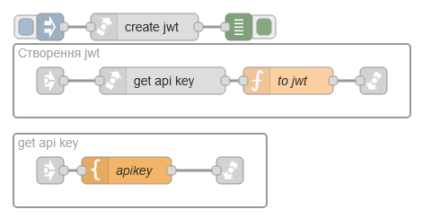

рис.12. Потоки для створення JWT з ключа JSON.

```js
const now =  Math.floor(Date.now() / 1000);
msg.claimset = {
  iss: msg.apikey.client_email,
  scope: "https://www.googleapis.com/auth/spreadsheets",
  aud: msg.apikey.token_uri,
  exp: now + 3600,
  iat: now
}
msg.options = {
  algorithm : "RS256",
  header: {alg:"RS256",
    typ:"JWT",
    kid: msg.apikey.private_key_id
  } 
}
msg.private_key = msg.apikey.private_key;
msg.jwt = jsonwebtoken.sign (
  msg.claimset, msg.private_key, msg.options
); 

return msg;
```

Для формування корисного навантаження `msg.claimset` використовуються деякі поля з `msg.apikey`. У `scope` зазначено список дозволів, розділених пробілом, для Google Sheet з [переліку ](https://developers.google.com/identity/protocols/oauth2/scopes#sheets) вказано тільки  `https://www.googleapis.com/auth/spreadsheets` що забезпечує усі можливості читання та редагування таблиці. 

- [ ] Відкрийте вузол `apikey` ((рис.12) і вставте туди зміст завантаженого в п.4. файлу ключа API JSON. 
- [ ] Зробіть розгортання потоку. 
- [ ] За допомогою потоку для тестування сформуйте JWT. Перевірте що JWT сформовано без помилок. 

### 5. Перевірка в `jwt.io`

Для того, щоб запросити токен доступу цей пункт не обов'язково виконувати. Однак він дозволить перевірити правильність формування JWT сторонніми сервісом www.jwt.io та познайомитися з  бібліотекою `crypto` в Node.js.

Для перевірки JWT в jwt.io, необхідно крім самого токена надати публічний ключ, щоб перевірити електронний підпис JWT. З кожним приватним ключем, що генерується в сервісному аккаунті в парі йде публічний ключ, який є частиною сертифікату. Розміщення сертифікатів для сервісного акаунту вказано в полі `client_x509_cert_url` ключа API. За цим посиланням можна завантажити усі доступні публічні сертифікати в форматі JSON, за `private_key_id` вибрати потрібний. Сертифікати мають формат `pem`, однак jwt.io для перевірки потрібен не сертифікат цілком а тільки сам публічний ключ. Для визначення цього ключа можна скористатися бібліотекою `crypto` в Node.js, опис якої доступний [за посиланням](https://nodejs.org/api/crypto.html#class-keyobject). 

- [ ] Імпортуйте наступний потік

```json
[{"id":"3b05380d93dbda6d","type":"group","z":"c5a2236e723cfe5f","name":"Отримати публічний сертфиікат","style":{"label":true},"nodes":["adfc9439d48426b1","5da87937bf5346aa","e722598d958718c3","455772fafcdc664a","5faac93b6e994d70","d7574bd2639e0e64"],"x":74,"y":619,"w":842,"h":82},{"id":"adfc9439d48426b1","type":"inject","z":"c5a2236e723cfe5f","g":"3b05380d93dbda6d","name":"","props":[{"p":"now","v":"","vt":"date"},{"p":"topic","vt":"str"}],"repeat":"","crontab":"","once":false,"onceDelay":0.1,"topic":"","x":135,"y":660,"wires":[["5faac93b6e994d70"]],"l":false},{"id":"5da87937bf5346aa","type":"http request","z":"c5a2236e723cfe5f","g":"3b05380d93dbda6d","name":"get pubcerts","method":"GET","ret":"obj","paytoqs":"ignore","url":"","tls":"","persist":false,"proxy":"","insecureHTTPParser":false,"authType":"","senderr":false,"headers":[],"x":560,"y":660,"wires":[["455772fafcdc664a"]]},{"id":"e722598d958718c3","type":"debug","z":"c5a2236e723cfe5f","g":"3b05380d93dbda6d","name":"debug 7","active":true,"tosidebar":true,"console":false,"tostatus":false,"complete":"true","targetType":"full","statusVal":"","statusType":"auto","x":855,"y":660,"wires":[],"l":false},{"id":"455772fafcdc664a","type":"function","z":"c5a2236e723cfe5f","g":"3b05380d93dbda6d","name":"export pub key","func":"const key_id = msg.apikey.private_key_id;\nmsg.pemcert = msg.payload [key_id]; \nconst cert = new crypto.X509Certificate(msg.pemcert);\n\nmsg.publicKeyPem = cert.publicKey.export({\n  type: 'spki',\n  format: 'pem',\n});\n\nreturn msg;","outputs":1,"timeout":0,"noerr":0,"initialize":"","finalize":"","libs":[{"var":"crypto","module":"crypto"}],"x":730,"y":660,"wires":[["e722598d958718c3"]]},{"id":"5faac93b6e994d70","type":"link call","z":"c5a2236e723cfe5f","g":"3b05380d93dbda6d","name":"","links":["6f1fb7251fc9a053"],"linkType":"static","timeout":"30","x":240,"y":660,"wires":[["d7574bd2639e0e64"]]},{"id":"d7574bd2639e0e64","type":"change","z":"c5a2236e723cfe5f","g":"3b05380d93dbda6d","name":"url pubcert","rules":[{"t":"set","p":"url","pt":"msg","to":"apikey.client_x509_cert_url","tot":"msg"}],"action":"","property":"","from":"","to":"","reg":false,"x":410,"y":660,"wires":[["5da87937bf5346aa"]]}]
```

 Потік містить наступні вузли (рис.13):

- `get api key` для виклику потоку отримання API key
- `url pubcert` - записує `msg.url = msg.apikey.client_x509_cert_url`
- `get pubcerts` - вузол для формування запиту GET на сертифікати, вихід в форматі JSON
- `export pub key` - виймає потрібний сертифікат, визначає публічний ключ і записує його в `msg.publicKeyPem `. Лістинг наведено нижче  

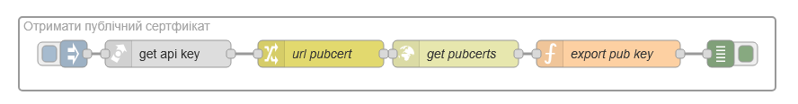

рис.13. Потік для отримання публічного ключа.

```js
const key_id = msg.apikey.private_key_id;
msg.pemcert = msg.payload [key_id]; 
const cert = new crypto.X509Certificate(msg.pemcert);
msg.publicKeyPem = cert.publicKey.export({
  type: 'spki',
  format: 'pem',
});
return msg;
```

- [ ] Проконтролюйте, щоб вузол `get api key` викликав відповідний потік.
- [ ] Зробіть розгортання потоку.
- [ ] Запустіть потік, щоб він сформував `msg.publicKeyPem`
- [ ] Використовуючи сервіс [jwt.io](https://www.jwt.io/#debugger-io) перевірте токен JWT, сформований в п.4 на коректність

### 6. Формування токену доступу

Після формування JWT, його треба обміняти на сервері автентифікації Google на токен доступу, який буде відправлятися з кожним повідомленням http.

- [ ] Імпортуйте потоки для формування токену доступу

```json
[{"id":"f6b59a7efe765d0d","type":"inject","z":"c5a2236e723cfe5f","name":"","props":[{"p":"payload"},{"p":"topic","vt":"str"}],"repeat":"","crontab":"","once":false,"onceDelay":0.1,"topic":"","payload":"","payloadType":"date","x":135,"y":220,"wires":[["a3a28a4489284202"]],"l":false},{"id":"a3a28a4489284202","type":"link call","z":"c5a2236e723cfe5f","name":"","links":["222fe0fb19026db5"],"linkType":"static","timeout":"30","x":240,"y":220,"wires":[["ef59944d91ce66e3"]]},{"id":"ef59944d91ce66e3","type":"debug","z":"c5a2236e723cfe5f","name":"debug 2","active":true,"tosidebar":true,"console":false,"tostatus":false,"complete":"true","targetType":"full","statusVal":"","statusType":"auto","x":345,"y":220,"wires":[],"l":false},{"id":"e58f3f45eefcd257","type":"group","z":"c5a2236e723cfe5f","name":"Отримати токен доступу","style":{"label":true},"nodes":["c830e95fda597440","48060a7d07b4d9ca","504a75adf4c99d36","efd1da4b130eed03","222fe0fb19026db5","0576f87320345fa8"],"x":94,"y":239,"w":662,"h":82},{"id":"c830e95fda597440","type":"link call","z":"c5a2236e723cfe5f","g":"e58f3f45eefcd257","name":"","links":["bc34378ccf074dfa"],"linkType":"static","timeout":"30","x":240,"y":280,"wires":[["48060a7d07b4d9ca"]]},{"id":"48060a7d07b4d9ca","type":"function","z":"c5a2236e723cfe5f","g":"e58f3f45eefcd257","name":"request token","func":"msg.url  = msg.apikey.token_uri;\nmsg.headers = {\n    \"Content-Type\": \"application/x-www-form-urlencoded\"\n}\nmsg.payload = \"grant_type=urn:ietf:params:oauth:grant-type:jwt-bearer&assertion=\";\nmsg.payload += msg.jwt;\nreturn msg;","outputs":1,"timeout":0,"noerr":0,"initialize":"","finalize":"","libs":[],"x":400,"y":280,"wires":[["504a75adf4c99d36"]]},{"id":"504a75adf4c99d36","type":"http request","z":"c5a2236e723cfe5f","g":"e58f3f45eefcd257","name":"","method":"POST","ret":"obj","paytoqs":"ignore","url":"","tls":"","persist":false,"proxy":"","insecureHTTPParser":false,"authType":"","senderr":false,"headers":[],"x":525,"y":280,"wires":[["efd1da4b130eed03"]],"l":false},{"id":"efd1da4b130eed03","type":"change","z":"c5a2236e723cfe5f","g":"e58f3f45eefcd257","name":"to context","rules":[{"t":"set","p":"token","pt":"flow","to":"payload","tot":"msg"}],"action":"","property":"","from":"","to":"","reg":false,"x":620,"y":280,"wires":[["0576f87320345fa8"]]},{"id":"222fe0fb19026db5","type":"link in","z":"c5a2236e723cfe5f","g":"e58f3f45eefcd257","name":"get token","links":[],"x":135,"y":280,"wires":[["c830e95fda597440"]]},{"id":"0576f87320345fa8","type":"link out","z":"c5a2236e723cfe5f","g":"e58f3f45eefcd257","name":"link out 2","mode":"return","links":[],"x":715,"y":280,"wires":[]}]
```

Даний потік викликає потік отримання JWT, і використовує його для формування запиту на тимчасовий токен доступу. Потік містить наступні вузли:

- `create jwt` - викликає потік для створення JWT
- `request token` - формує запит для відправку на сервер автентифікації за токеном доступу, лістинг програми наведений нижче.  
- `http request` - відправляє сформований запит методом `POST`, відповідь надає у форматі JSON
- `to context`- записує відповідь у контекст потоку `flow.token`

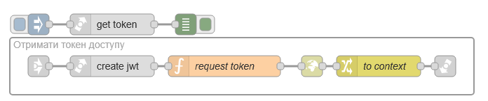

рис.14. Потік отримання токену доступу

```js
msg.url  = msg.apikey.token_uri;
msg.headers = {
    "Content-Type": "application/x-www-form-urlencoded"
}
msg.payload = "grant_type=urn:ietf:params:oauth:grant-type:jwt-bearer&assertion=";
msg.payload += msg.jwt;
return msg;
```

Зверніть увагу, що JWT передається в тілі повідомлення як одна зі складових.

- [ ] Проконтролюйте що вузол `create jwt` викликає потрібний вузол
- [ ] Зробіть розгортання, запустіть потік. Перевірте, що в контексті потоку з'явився очікуваний токен доступу (не забувайте про refresh).   

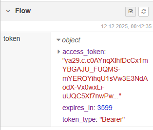

рис.15. Зміст контексту потоку

### 7. Використання токену доступу для читання з Google Sheet

Тепер токен доступу зберігається в контексті (сховищі) потоку Node-RED і він діє одну годину з моменту формування. Протягом цієї години його необхідно передавати в заголовку `Authorization` в форматі `Bearer` з кожним запитом на API.  

- [ ] Імпортуйте наступний потік:

```json
[{"id":"b92fd74dc2b603dc","type":"group","z":"c5a2236e723cfe5f","name":"Пеервірка доступу за токеном","style":{"label":true},"nodes":["e8a109f509ce2f64","a1e02aa442bf2d7e","39c20d096205fa79","3ee5ebfe50d4a840"],"x":144,"y":79,"w":432,"h":82},{"id":"e8a109f509ce2f64","type":"http request","z":"c5a2236e723cfe5f","g":"b92fd74dc2b603dc","name":"","method":"GET","ret":"obj","paytoqs":"ignore","url":"","tls":"","persist":false,"proxy":"","insecureHTTPParser":false,"authType":"","senderr":false,"headers":[],"x":455,"y":120,"wires":[["3ee5ebfe50d4a840"]],"l":false},{"id":"a1e02aa442bf2d7e","type":"function","z":"c5a2236e723cfe5f","g":"b92fd74dc2b603dc","name":"request Sheet","func":"let token = flow.get(\"token\");\nconst spreadsheetId = \"1nzHWYaDHv75imSuP-snupOIMY_STaIc9AmLzngOgpEs\";\nconst range = \"Аркуш1!R1C1:R2C2\";\nmsg.url = `https://sheets.googleapis.com/v4/spreadsheets/${spreadsheetId}/values/${range}`;\nmsg.headers = {\n    Authorization: \"Bearer \" + token.access_token\n}\nreturn msg;","outputs":1,"timeout":0,"noerr":0,"initialize":"","finalize":"","libs":[],"x":320,"y":120,"wires":[["e8a109f509ce2f64"]]},{"id":"39c20d096205fa79","type":"inject","z":"c5a2236e723cfe5f","g":"b92fd74dc2b603dc","name":"","props":[{"p":"payload"},{"p":"topic","vt":"str"}],"repeat":"","crontab":"","once":false,"onceDelay":0.1,"topic":"","payload":"","payloadType":"date","x":205,"y":120,"wires":[["a1e02aa442bf2d7e"]],"l":false},{"id":"3ee5ebfe50d4a840","type":"debug","z":"c5a2236e723cfe5f","g":"b92fd74dc2b603dc","name":"debug 1","active":true,"tosidebar":true,"console":false,"tostatus":false,"complete":"true","targetType":"full","statusVal":"","statusType":"auto","x":515,"y":120,"wires":[],"l":false}]
```

У вузлі `request Sheet` формується доступ до ресурсу вказавши відповідно до API його розміщення. Формування запиту на читання даних з Google Sheet детально описано [за посиланням](https://developers.google.com/workspace/sheets/api/reference/rest/v4/spreadsheets.values/get).   

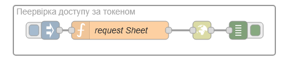

рис.16. Потік доступу до ресурсів

```js
let token = flow.get("token");
const spreadsheetId = "1nzHWYaDHv75imSuP-snupOIMY_STaIc9AmLzngOgpEs";
const range = "Аркуш1!R1C1:R2C2";
msg.url = `https://sheets.googleapis.com/v4/spreadsheets/${spreadsheetId}/values/${range}`;
msg.headers = {
    Authorization: "Bearer " + token.access_token
}
return msg;
```

- [ ] Визначте `spreadsheetId` з відкритої сторінки Google Sheet, наприклад в прикладі повний url має наступний вигляд:

```
https://docs.google.com/spreadsheets/d/1nzHWYaDHv75imSuP-snupOIMY_STaIc9AmLzngOgpEs/edit?gid=0#gid=0
```

- [ ] Змініть програму вказавши Ваш `spreadsheetId` та ваші дані `range`

- [ ] Зробіть розгортання. Перевірте роботу потоку.

У цій практичній роботі не передбачена перевірка негативної відповіді від сервера та автоматичне формування запиту на новий токен доступу після його старіння. Ціль - тільки демонстрація механізмів автентифікації через сервісний аккаунт.  

## Автор

Практичне заняття розробив  [Олександр Пупена](https://github.com/pupenasan). 

## Feedback

Якщо Ви хочете залишити коментар у Вас є наступні варіанти:

- [Обговорення у WhatsApp](https://chat.whatsapp.com/BRbPAQrE1s7BwCLtNtMoqN)
- [Обговорення в Телеграм](https://t.me/+GA2smCKs5QU1MWMy)
- [Група у Фейсбуці](https://www.facebook.com/groups/asu.in.ua)

Про проект і можливість допомогти проекту написано [тут](https://asu-in-ua.github.io/atpv/)