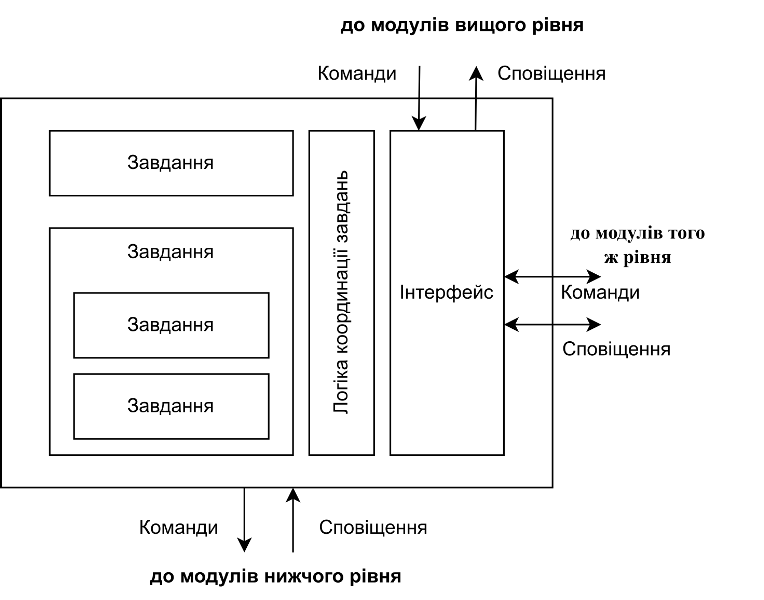

[До підрозділу](../README.md)

# МЕТОДИКИ СТАНДАРТУ ISA-106 ДЛЯ АВТОМАТИЗАЦІЇ ПРОЦЕДУР ОПЕРАЦІЙ НЕПЕРЕРВНИХ ПРОЦЕСІВ

Пупена, О. (2025). МЕТОДИКИ СТАНДАРТУ ISA-106 ДЛЯ АВТОМАТИЗАЦІЇ ПРОЦЕДУР ОПЕРАЦІЙ НЕПЕРЕРВНИХ ПРОЦЕСІВ. *Automation of Technological and Business Processes*, *16*(4), 101-109. https://doi.org/10.15673/atbp.v16i4.3017 

Оригінал статті доступний [за посиланням](https://journals.ontu.edu.ua/index.php/atbp/article/view/3017)

## Анотація

Для неперервних виробництв характерною є складність виконання процедур запуску, зупинки, зміни продукту чи виходу з нештатних ситуацій. Це пов'язано з великою кількістю необхідний, часто ручних, дій, відсутністю достатнього досвіду у операторів, а тривалий їх час приводить до значних витрат. Авторитетна організація по стандартизації International Society of Automation у 2023-му році випустила стандарт ISA-106, мета якого передати кращі практики для автоматизації процедур. За досить тривалий час роботи комітету вийшло небагато просвітнього матеріалу щодо пояснення методик, а їх розуміння тісно пов'язано з іншими спорідненими стандартами. У той же час, відомими світовими інжиніринговими організаціями наводяться вагомі аргументи щодо його важливості. Після виходу стандарту, діяльність щодо висвітлення його концепцій у світі практично не спостерігається, в Україні такого матеріалу немає зовсім. У той же час, стандарт надає основу для автоматизації процедур через означення основних моделей, концепцій автоматизованого керування та опису процесів в життєвому циклі автоматизованих систем керування. Частина з цих моделей є спільними з зі спорідненими стандартами ISA-88/IEC-61512, ISA-95/IEC-62264, тим не менше є певні суперечності в них. Також є ідеологічні відмінності між ISA-88 та ISA-106, що робить впровадження останнього дещо складнішим та обмежує його можливості. Основні відмінності є в інтерпретації нижнього рівня фізичної моделі, концепції модуля у ISA-88 у порівнянні з концепцією процедури в ISA-106 та понятійному відношенні. Наразі необхідна розробка відповідного просвітнього матеріалу, методичного забезпечення та інструментарію, що спростить впровадження стандарту і відповідно матиме позитивний економічний ефект на підприємствах з неперервним виробництвом. 

**Ключові слова:** ISA-106, ISA-88, ISA-95, неперервне виробництво, процедури, СОП 

## Вступ

Сьогодні кращі світові практики автоматизації технологічних процесів та виробництва закріплені в міжнародних стандартах ISO, IEC, ISA та інших, які періодично переглядаються і змінюють редакцію. Це дає змогу інженерам-автоматникам розробляти системи керування, які імплементуються з використанням перевіреного досвіду, легше масштабуватися та виконувати менше помилок та витрачати менше часу. У той же час, як показують опитування [1] в Україні, на жаль, освідомленість про ключові стандарти досить низька, що говорить про відповідно очікувану низьку якість розроблювальних систем керування. Це стосується більшості сучасних міжнародних стандартів та практик. Для зменшення цього гапу, ряд українських авторів у тому числі в рамках роботи технічного комітету ТК-185 було випущено ряд статей в тему висвітлення ключових стандартів автоматизації виробництва, зокрема [1-4]. Неофіційні переклади стандартів IEC, які стосуються автоматизації виробництва та велику кількість просвітніх статей можна знайти на сайті ТК185 [https://tk185.appau.org.ua](https://tk185.appau.org.ua/). Нещодавно ISA офіційно випустила стандарт ISA-106, який йде в комплекті з спорідненими стандартами ISA-88, ISA-95 та ISO-22400. Цей стандарт має на меті спростити та покращити виконання ручних процедур за рахунок їх автоматизації. У цей же час матеріалу що дає висвітлення методик які надає імплементація стандарту в Україні не зустрічається взагалі, а в світі його явно бракує.   

## Аналіз літературних даних і постановка проблеми

Ще до офіційного виходу стандарту, в період з 2015-го по 2017-ті роки вийшло ряд статей в різних онлайн вісниках, пройшло кілька семінарів та вебінарів на цю тему. У всіх статтях наголошується що стандарт є необхідним інструментом саме за причин необхідності автоматизації процедур запуску, зупину та виходу з нештатних ситуацій, які передбачають велику кількість ручних операцій та досвідчених операторів. 

У статті [5] автори вказують на такі фактори, як брак інструментів передачі досвіду між операторами та неналежне документування процедур, які часто приводять навіть до аварійних ситуацій. Автори окремо зупиняються на викликах щодо  автоматизації процедур, такі як нечасте використання певних регулюючих органів, складність написання та імплементації автоматизованих процедур, проблема чіткості опису процедур при імплементації в коді, недовіра операторів до процедур. У той же час M.Wilkins та M.Tennant виділяють що саме можуть отримати компанії, якщо впровадять стандарт в себе на виробництві: покращена безпека за рахунок кращої реалізації підсистеми тривожної сигналізації, зменшення людського фактору і відповідно помилок, зменшення часу та економія ресурсів при запуску/зупину та виведення з нештатної ситуації, збільшення ефективності роботи оператора, передача кращого досвіду та навчання операторів, ефективне керування змінами в процедурах, масштабування процедур на інші відділення, стандартизована термінологія. 

У звіті з форуму [6], який організували ARC Advisory Group в 2017 році відмітили що з 2010 року не було досягнуто суттєвих покращень у зменшенні інцидентів та аварій. Тому стандарт ISA-106 разом з ISA-88 зменшують розрив між повністю автоматизованими та повністю ручними процедурами і спрощують керування операторам складними процедурами. Одна з учасниць форуму розповіла про позитивний досвід використання автоматизованих процедур в системі керування переробкою відпрацьованих ядерних матеріалів. Вона порівняла підхід перетворення написаних документів в автоматизовані процедури з системою GPS, коли оператор виконує дії, але послуговується системою підказок. Інший учасник форуму відмітив, що автоматизацію процедур варто використовувати при зміні стану процесу або при необхідності виконання інтерактивних циклічних процесів. Це дає змогу «кожному оператору працювати як найкращим оператором у свій найкращий день». У той же час він відмітив важливість автоматизації тільки ряду процедур, що повинно бути обґрунтованим як з економічної так і з безпекової точки зору. В загальному у звіті компанія ARC дає наступні рекомендації: створення переліку і документування усіх процедур, які мають вплив на безпеку, втрати, якість та екологію; дослідження можливостей інтеграції автоматизованих процедур із функціями оператора; командна участь у розробці процедур; розроблення бібліотеки функцій процедур автоматизації для повторного використання. 

У [7] та [8] автори зазначають важливість та актуальність питань, описаних вище.  Додатково вони звертають увагу на нові можливості автоматизації операційних процедур з використанням технологій на основі Industry 4.0, пов’язані з мобільністю, мережами, безпекою, доповненою реальністю та віртуалізацією. Вони дають можливість оцифрувати ручні процедури, щоб допомогти операторам в полі виконувати переходи за допомогою пристроїв що не мають засобів КВПіА. У таких ситуаціях оператор стає «віртуальним вводом/виводом», а ручні завдання можна координувати в реальному часі перевіряючи стани обладнання, та надавати їх як підтвердження в систему, побудованою на базі ISA106, тим самим усуваючи потенційну помилку оператора. У [8] також відмічають важливість фіксації історії проходження процедур в журналах та дотримання законодавчих вимог в певних областях промисловості. Автори також підтверджують той факт, що оператори часто не дотримуються процедур, які розроблені підприємствами. Відсутність довіри вони бачать в кількох факторах, зокрема: процедури були написані неправильно з самого початку, або не підтримувалися з часом при розвитку процесу; труднощі для розуміння та тривалість навчання, оскільки кінцевий документ може бути надто складним для прочитання та розуміння кінцевим користувачем; документ часто надто громіздкий для регулярного використання, що перетворюється в запам'ятовування або використання шпаргалок; незрозуміла відповідальність; досвідчений персонал вважає що він знає краще; розсинхронізація ручних та автоматичних процедур; відсутність статусу в реальному часі. На базі аналізу цих проблем автори сформували функціональні вимоги до процедур, з можливістю реалізації їх інтерфейсу на мобільних пристроях та з використанням додаткових інструментів взаємодії як з ручними засобами керування так і з автоматизованими системами керування. 

У роботі [9] на додаток до зазначених вище аргументів автор навів дані про втрати підприємств в різних галузях внаслідок неефективних запусків, зупинок та нештатних ситуацій. Окремо в роботі відзначено важливість інтегрування керування процедурами з системою тривожної сигналізації. Автор поділився досвідом перенесення ідей використання засобів та підходів ISA-88 в автоматизацію процедур на різних стадіях життєвого циклу. Так при плануванні варто залучити до процесів усіх стейкхолдерів. Тут також він підтверджує тезу про важливість виділення процедур, які варто автоматизувати, а також наводить рекомендації та критерії для їх вибору. На етапі впровадження автор рекомендує зважено ставитися до автоматизації засобів для керування, враховуючи що таких засобів дуже багато. Також звертає увагу на модульність процедур та важливість керування винятками. На етапі введення в експлуатацію рекомендується використовувати імітаційне моделювання на ранніх етапах однак це не усуває необхідність перевірки на реальному об'єкті. Враховуючи рідкість нештатних ситуацій, деякі процедури важко відлагодити швидко. Також варто велику увагу приділити навчанню оператора.

Як видно стандарт є дуже важливим так як його впровадження має привести до значеного зменшення помилок в перехідних режимах, зменшення часу переходів і відповідно надмірних витрат матеріалів та енергії. У той же час методичного матеріалу стосовно розуміння та впровадження стандарту явно бракує. Та невелика кількість, що вдалося знайти автору статті дає лише розуміння важливості стандарту та його базових основ. Для того щоб зробити перший крок для імплементації стандарту на промислових підприємствах необхідно проаналізувати сам стандарт та можливості його подальшого впровадження.   

## Мета і завдання дослідження

Метою досліджень є визначення основних засад даного стандарту, місце в життєвому циклі автоматизованих систем керування та його застосовність, а також висвітлення можливих кроків та інструментів для імплементації стандарту. Зокрема є потреба у досліджені та висвітленні наступних питань стосовно ISA-106:

- яке призначення стандарту, і кому варто його імплементувати

- який базис стандарту, тобто сутності і термінологія

- які інструменти пропонує стандарт, а які інструменти можна використовувати натомість 

- які рекомендації щодо впровадження стандарту є, які альтернативні варіанти можна використовувати 

## Методи і матеріали досліджень 

 Стандарти ISA є платними, однак вони доступні для перегляду за досить невеликою для підприємства вартості передплати. Зі змістом стандарту можна познайомитися за посиланням наведеним в [10]. До випуску стандарту вийшли два технічні звіти [11, 12], зміст яких ліг в основу основного стандарту з частиною доповнень та змін. Для швидкого знайомства з основними засадами стандарту можна почитати інфографіку [13] про технічні звіти, в якій наведено більшість основних моментів. Ці чотири документи є основним матеріалом для аналізу, додаткові матеріали доступні в літературних джерелах, наведених вище.

Хоча стандарти ISA є здебільшого досить інформативними документами, цей, на думку автора, містить кілька позицій, які варто б було детальніше пояснити. На відміну від ISA-88, який супроводжувався великою кількістю публікацій, що пояснюють зміст стандарту, у даному випадку відчувається серйозний брак просвітнього матеріалу. Можливо це пов'язано з його недавньою появою, однак основні засади були ще опубліковані в 2015 та 2017 роках, а презентації з виступів на конференціях, які проливають світло на деякі аспекти стандарту були ще в 2011-2015 роках. Окремої уваги вартий вебінар [14-16] у якому розкриваються як основи стандарту так і практики використання інструментів та методик імплементації. 

Автору статті вдалося познайомитися зі змістом стандарту, тому нижче наводяться основні моменти. Стандарт розроблений на базі ISA-88, ISA-95, ISA-84, ISA-5.6, ISA-101 та ISA-18.2, зі змістом та призначенням яких можна ознайомитися на сайті технічного комітету ТК185 https://tk185.appau.org.ua/. Також розробники враховували рекомендації NAMUR, ASM, досвід інтеграторів та постачальників засобів автоматизації. Стандарт включає кілька частин, у яких описані використовувані підходи, методи та інструменти а також процеси в контексті життєвого циклу систем керування неперервним виробництвом.

## Результати досліджень

### Структура стандарту 

Стандарт ISA-106 націлений на автоматизацію процедур для неперервних процесів (порційні і дискретні не передбачено стандартом), які включають ситуації запуску, зупинки, ненормальних ситуацій, утримання та перехідні процеси між подачою матеріалів на вхід та очікування виходу процесу. До автоматизації процедур, вони можуть існувати в ручній, ймовірно письмовій формі, і великою мірою супроводжуються операціями, які персонал виконує вручну (механічно). Метою автоматизації таких процедур є зменшення ризиків, часу, вартості і помилок при їх виконанні. Така автоматизація передбачається в системах диспетчерського керування, моніторингу та автоматизованого керування процесом (нижні рівні керування підприємства) і не виходить на рівень виробництва (L3 - MOM) і вище (L4 - ERP). Стандартизація у даному випадку повинна допомогти у підвищенні уніфікованості, зменшення часу впровадження, уникнення помилок та вартості такого впровадження за рахунок означення термінології, моделей, стилів, стратегій, принципів у контексті життєвого циклу систем керування. 

Враховуючи що ISA-106 націлений на процеси автоматизації процедур, у ньому означений термін Процедура (Procedure) - це специфікація послідовності завдань (Task) із означеним початком і кінцем, яка призначена для досягнення конкретної мети. Цією метою не обов'язково має бути щось, що задіяне у виготовленні продукції, це може бути наприклад мийка CIP. Відповідно автоматизація процедур, як кінцева мета, - це реалізація процедури на програмованій механічній, електричній або електронній системі. Все інше зазначено в стандарті і націлено на автоматизацію процедур.

Розробка автоматизованої процедури для процесу може бути означена на основі наявних документів, зокрема схеми автоматизації (P&ID) установки, з якої беруться означення фізичних об'єктів, та стандартні операційні процедури (СОП, SOP), який забезпечує необхідні дії для кожного пристрою від запуску в роботу до зупинки, які виконує оператор.

У основі стандарту стоять моделі та стилі автоматизації. Моделі надають можливість представити та формалізувати сутності якими оперує стандарт. Ці моделі, так само як і в перших частинах стандартів ISA-88 та ISA-95 мають здебільшого описовий характер. При розгляді та використанні моделей варто не забувати що стандарт розроблений для створення та використання автоматизованих процедур. 

У стандарті означені три моделі:

- Фізична модель (Physical model), яка описує рольове призначення обладнання, аналогічно ISA-88 та ISA-95 але застосовно до неперервних процесів.
- Модель специфікації процедури (Procedure specification model), яка відображає як специфікації процедури відображаються на устатковання у фізичній моделі.
- Модель впровадження процедури (Procedure implementation model), яка показує як специфікації процедури реалізовані для фізичної моделі.

Для всіх моделей характерний ієрархічний принцип побудови, з посиланням на ієрархію фізичної моделі. Вони мають можливість виключення деяких рівнів з ієрархії. 

### Фізична модель 

Першою означена фізична модель, яка має той самий сенс що і рольова модель обладнання в стандарті ISA-95 та фізична модель в ISA-88, але в контексті застосування до неперервних процесів, а саме з метою реалізації автоматизації процедур. У таблиці 1 наведені оригінальні назви рівнів у групі споріднених стандартів. Як видно рівень 5-й (це умовні номери) в ISA-106 має назву Plant (Завод), тоді як в інших стандартах це Area (цех), а 4-й рівень має назву Plant Area (Заводський цех), тоді як в стандарті ISA-95 загальна назва Work Center (Робочий центр), а для неперервних виробництв мало б бути Production Unit (Виробничий підрозділ). 

Таблиця 1. **Найменування обладнання в стандартах ISA-88, ISA-95 та ISA-106**

| Рівень(згори) | ISA-106    | ISA-95(загальне/неперервне)  | ISA-88          |
| ------------- | ---------- | ---------------------------- | --------------- |
| 7             | Enterprise | Enterprise                   | Enterprise      |
| 6             | Site       | Site                         | Site            |
| 5             | Plant      | Area                         | Area            |
| 4             | PlantArea  | WorkCenter / Production Unit | ProcessCell     |
| 3             | Unit       | WorkUnit / Unit              | Unit            |
| 2             | Equipment  | -                            | EquipmentModule |
| 1             | Device     | -                            | ControlModule   |

Критерії виділення обладнання достатньо загальні. Наприклад, Завод (Plant) — це інфраструктура будівель, споруд і систем, необхідних для виконання промислових операцій, і містить Заводські Цехи (Plant Area), які необхідні для виробництва конкретного продукту або групи продуктів. Межі Заводу (Plant) зазвичай базуються на організаційних чи бізнес-критеріях а не технічних. А от Заводські цехи (Plant Area), згідно стандарту, - це просто сукупність з Технологічних вузлів (Unit). 

Технологічний вузол (Unit) як і у випадку з ISA-88 носить основне технологічне навантаження, серед критеріїв його виділення вказуються виконання технологічних процесів над продуктом та виконання завдань дещо незалежно відносно іншого суміжного обладнання. Разом з іншими суміжними технологічними вузлами відбувається поступова зміна основних властивостей продукту в потоці відповідно до технології. На відміну від ISA-88, в якому навіть непродуктові робочі центри можна реалізовувати через вузли порційного типу, у ISA-106 є чітке відсилання на використання технологічних вузлів тільки для процесів над продуктом. Якщо це не так, таке устатковання зветься Utility, і у фізичній ієрархії вона займає нижчий рівень, а саме Устатковання (Equipment), яке знаходиться безпосередньо під рівнем заводського цеху (Plant Area). Прикладом Utility є устатковання CIP. 

Пристрій (Device) включає логіку керування, яка не може бути змінною, однак може параметруватися. Останнє принципово відрізняється від аналогічного рівня Control Module фізичної моделі ISA-88. 

Проміжним місцем в ієрархії є Устатковання (Equipment), яке робить кінцеву сукупність технологічних дій і включає в себе інше обладнання або/та Пристрої. Щоб в даній статті розрізняти загальне поняття "устатковання" від конкретно цього рівня, останній надалі буде писатися з великої літери, як і назви інших рівнів. Це Устатковання є першим рівнем з низу, для якого можна використовувати процедури, про що написано буде нижче. При цьому усі рівні в даному стандарті можуть бути опущені, за винятком Device (Пристрій), який представляє будь яке обладнання КВПіА (датчики, перетворювачі, виконавчий механізм або інший елемент керування).

Принциповим моментом в стандарті є те, що на відміну від ISA-88, об’єкти у фізичній моделі ISA-106 представляють лише фізичні елементи та не включають алгоритми керування, які можуть бути пов’язані з ними, якщо вони не є частиною пристрою. 

### Модель специфікації процедури 

Специфікація процедури — це означення того, що саме потрібно для досягнення конкретної цілі за допомогою конкретної процедури. Наприклад якщо є процедура запуску чогось, то специфікація означує як зробити такий запуск. По суті це вимоги до реалізації, тоді як принципи реалізації означується у іншій моделі, яка розглянута нижче. 

Модель специфікації процедури (Procedure specification model) відображає, як специфікації процедури відображаються в ієрархії у фізичній моделі, тобто як повинно вести себе обладнання певного рівня у тій чи іншій задачі, яка описується конкретною процедурою. У технічному звіті модель називалася Procedure Requirement Model, тому в статтях можна зустріти і такий термін. Взагалі ці специфікації є підмножиною специфікацій функціональних вимог (Functional Requirements Specification, FRS), які означені в стандарті ISA-5.6. Не дивлячись на спорідненість стандартів, термінологія може відрізнятися.

Якщо існує кілька екземплярів устатковання одного типу, єдина специфікація процедури може застосовуватися до всіх з них. Це забезпечує високий рівень повторного використання. 

Модель специфікації процедури означує ієрархію через вкладеність (залежність) процедур для кожного з рівнів фізичної моделі, як це показано в таблиці 2.

Таблиця 2 - **Відповідність рівнів ієрархії специфікацій процедури та фізичної моделі** 

| Рівень(згори) | Рівень фізичної моделі | Рівень специфікації процедури     |
| ------------- | ---------------------- | --------------------------------- |
| 7             | Enterprise             | Enterpriseprocedure specification |
| 6             | Site                   | Siteprocedure specification       |
| 5             | Plant                  | Plantprocedure specification      |
| 4             | PlantArea              | PlantArea procedure specification |
| 3             | Unit                   | Unitprocedure specification       |
| 2             | Equipment              | Equipmentprocedure specification  |
| 1             | Device                 | Controlspecification              |

Верхні рівні специфікації процедури аж до рівня Заводського цеху (Plant Area) як правило не автоматизуються, тому стандарт практично не описує їх. Як вже було описано вище, основна увага стандарту зосереджується на специфікаціях нижніх трьох рівнів: Unit, Equipment, Device. На самому нижньому рівні знаходиться Специфікація керування (Control specification), яка описує поведінку одного або системи з кількох пристроїв для конкретної процедури в конкретний момент часу. Варто звернути увагу, що слово `procedure` тут відсутня, оскільки це конкретні дії конкретних Пристроїв, перелік яких кінцевий, незмінний і означений в самому Пристрої. Тому така специфікація може бути представлена наприклад схемою P&ID (схема автоматизації), в якій відображаються усі функції та функціональні зв'язки. Це можуть бути різні керівні стратегії, наприклад дискретне керування або регулювання. Прикладом Специфікації керування є регулювання тиску обертами насосу з використанням перетворювачем частоти. У вітчизняній практиці це можна б було віднести до означення контурів керування та регулювання. 

Вище знаходяться специфікації процедури Устатковання (Equipment), які означують поведінку обладнання за тих чи інших умов. По суті ці процедури координують роботу Пристроїв, які є частиною цього устатковання, переводячи їх в той чи інший стан. Тут вже можуть використовуватися стано-орієнтоване або/та кроково-орієнтоване керування, і процедура буде означувати перелік станів та кроків Устатковання і умови переходу між ними а також через стан пристроїв. Так, наприклад для Устатковання що представляє насосний агрегат, який складаються з кількох насосів з двигунами та клапанів може бути означена (специфікована) процедура запуску/зупинки або переключення на інший продукт, яка буде вказувати послідовність кроків та дій в них, а також умова переходів між кроками. 

Специфікації процедури Технологічного вузла описують роботу та стратегію керування Технологічним вузлом (Unit) та його взаємодію з іншими вузлами. Це може бути запуск або зупинка устатковання, або перехід його в нештатний режим. 

### Модель та модулі впровадження процедури 

Використовуючи специфікації процедур а також фізичної моделі, ці процедури автоматизовують, реалізуючи їх у відповідних модулях впровадження (Implementation modules). Як вже зазначалося, це може бути частина програми в ПЛК або спеціалізованого ПЗ системи керування. Сама модель вказує для процедур якого обладнання вони реалізовані, та як саме модулі координуються в ієрархії. Ієрархія моделі впровадження процедур показана в таблиці 3. Варто ще раз нагадати, що на рівні Пристроїв (Device) передбачається що уся логіка вже реалізована в них і там відсутні будь які кроки та переходи. Хоч для ISA-88 аналогічний рівень Control Module передбачає тільки базове керування, воно може у свою чергу містити покрокове виконання і реалізоване програмно, що принципово відрізняється від ISA-106. 

Таблиця 3 - **Відповідність рівнів ієрархії впровадження процедури та фізичної моделі**

| Рівень(згори) | Рівеньфізичної моделі | Рівеньспецифікації процедури                                 |
| ------------- | --------------------- | ------------------------------------------------------------ |
| 7             | Enterprise            | специфікаціїпроцедури підприємства будутьреалізовані в модулях реалізаціїSite або нижчих рівнях моделі реалізаціїпроцедури |
| 6             | Site                  | Siteimplementation modules                                   |
| 5             | Plant                 | Plantarea implementation modules                             |
| 4             | PlantArea             | PlantArea procedure specification                            |
| 3             | Unit                  | Unitimplementation modules                                   |
| 2             | Equipment             | Equipmentimplementation modules                              |
| 1             | Device                | Controlimplementation modules                                |

Специфікації процедури не обов'язково реалізуються на відповідних рівнях моделі впровадження, та можуть відображатися як 1:1, так і багато:1 та 1:багато, багато:багато. 

Модулі впровадження складаються з набору завдань (Task), які керуються і координуються для виконання діяльностей відповідною логікою (Task Coordination Logic), що продиктовано специфікаціями процедури (рис.1). У той же час ця логіка може реалізовувати і інший функціонал. Завдання можуть містити інші завдання, можуть виконуватися послідовно (одне за одним) або одночасно. Кожне завдання у свою чергу містить необхідні інструкції для виконання дій (Commands), і перевірку того, що ці дії виконано успішно через сповіщення (Notifications). З операційної точки зору, процедура виконується шляхом виконання завдань, що міститься в одному або кількох модулях впровадження. 

  
 

**Рис.1. - приклад змісту модуля** **впровадження** 

Модулі рівня Control implementation забезпечує прямий доступ до фізичних пристроїв, оскільки як зазначалося, він вже реалізований в Пристроях на рівні, що не програмується. Саме ці модулі забезпечують реалізацію дій на фізичному устаткованні. Методи реалізації дій можуть бути як програмні (через різні мови програмування) так і ручні (через список інструкцій). Модулі вищих рівнів взаємодіють через інтерфейси з модулями нижчих або того самого рівня, відправляючи команди та отримуючи сповіщення. Причому команди можуть отримуватися тільки від модулів вищого або того самого рівня, а сповіщення тільки від модулів нижчого або того самого рівня. 

Для ініціювання Виконання (Perform) завдань модулем впровадження використовуються Команда від іншого модуля або оператора. Завдання може використовувати будь-який тип методу реалізації, але в кінцевому підсумку завдання виконується оператором або комп’ютером. Завершується виконання Перевіркою (Verify) успішного або невдалого виконання завдання, яка може також проводитися оператором або комп’ютером.

### Стилі автоматизації 

Одною з фундаментальних основ ISA-106 є так звані стилі автоматизації, під якими розуміється підхід до розроблення та розгортання модулів впровадження. Стандарт розглядає три таких підходи, але натомість рекомендує два: стано-орієнтоване керування та керування на основі послідовності. Третій стиль, який не рекомендується стандартом, базується на основі кінцевих автоматів. Враховуючи, що говориться саме про стилі автоматизації процедур, які згідно з означенням є послідовністю завдань що мають початок і кінець, усі розглянуті стилі так чи інакше базуються на послідовністних підходах і мають схожу основу, однак пропонують різні техніки реалізації. Тому у стандарті означені спеціальні терміни для реалізації стилів.

- Стан (State) - це попередньо означений стан модуля. Наприклад для запірного клапану можна означити стани "відкритий" або "закритий", для ПІД-регулятору стани "ручний режим", "автоматичний режим" або "каскадний", для насосу - "працює" та "зупинений".
- Крок (Step) - набір дій, у яких поведінка модуля реалізації процедури відповідає набору правил щодо його входів і виходів.

Враховуючи, що логіка та регулювання нижнього рівня моделі устатковання (Пристроїв) повністю є його незмінною частиною, то процедури можуть впливати на фізичний стан булевих пристроїв (з двома станами), таких як запірні клапани, двигуни чи насос, або на режими (які також називаються станами) чи задані параметри аналогових пристроїв. Логіка автоматизації процедур, як повністю базується на концепціях зміни цих станів, тобто діях які переводять в інший стан устатковання або процес і перевіряють такий перехід відноситься до стано-орієнтованого стилю керування (State-based control, SBC). Тут на кожному кроці відбуваються дії для зміну стану, а в якості умови переходу використовується перевірка активного стану. Послідовносно-орієнтований стиль (Sequence-based control, SqBC) також на кожному кроці передбачає певні дії. Ці дії можуть бути означені в SOP, а перехід не обов'язково може бути означений зміною стану, це може бути якась команда або час. Крім того, в межах різних кроків стан може повторюватися, а в один момент часу можуть бути активними кілька кроків, що в стано-орієнтованому стилі недопустимо.

Таким чином, концепція кроку використовується в обидвох рекомендованих стилях. Однак в стано-орієнтованому стилі крок та стан однозначно зв'язані між собою, тоді як в послідовносно-орієнтвоаному стилі - ні. Кожен крок має мати ім'я, статус активності та команди, які надсилаються нижньорівневим модулям. Між кроками є переходи, умова спрацювання яких передбачає перехід до іншого кроку.Тут варто зауважити, що в стандарті віддається перевага реалізації на базі мови програмування ПЛК SFC (Sequential Functional Chart), тому термінологія і концепції стилів повністю ідентичні цій мові. У цій статті не будемо зупинятися на цих деталях, які хоч і займають досить велику частину стандарту, передбачаючи що читач знайомий з основами SFC. 

Для читачів які знайомі з ISA-88/IEC-61512 варто зауважити, що в стандарті ISA-106 є поняття "режим", яке відрізняється від згаданих стандартів. Режим - це в станоорієнтованому стилі поіменована група з кількох кроків-станів, для полегшення керування та представлення оператору. Об'єднання кроків у послідовносно-орієнтованому стилі може називатися "етапом" (phase), що дещо схоже на подібну концепцію етапу в ISA-88. 

ISA-106 для кожного стилю надає певні інструменти формалізації, які можна використовувати для специфікації процедур. Дозволяється і навіть рекомендується використовувати різні стилі для різних завдань. Однак при цьому стандарт не рекомендує використовувати стиль на базі кінцевого автомату станів (Finite-state machine), хоча причина цього та і порівняння формалізму з тим самим станоорієнтованим стилем на думку автора цієї статті недостатньо описані. 

### Життєвий цикл та імплементація 

Велика частина стандарту ISA-106 як і споріднених стандартів які стосуються систем керування присвячена керуванню життєвим циклом автоматизації процедури. Воно має включати модель розробки програмного забезпечення відповідно до V-моделі системи керування проектами або GAMP 5 [14],[15], яка є графічним представленням стратегії керування життєвим циклом. Ця стратегія повинна включати робочі процеси для проектування, розроблення та підтримки автоматизованих процедур, і означувати дії та ресурси, пов’язані з підтримкою автоматизованої процедури протягом усього життєвого циклу. Основним результатом стратегії автоматизації процедур є каркас, який є відправною точкою для всіх екземплярів життєвого циклу автоматизації процедур, і містити встановлення масштабу дії, задокументовані робочі процеси для впровадження для впровадження та обслуговування екземплярів та інструменти (інструментальне ПЗ, бібліотеки, тощо). 

Не дивлячись на детальне висвітлення життєвого циклу в стандарті, у відкритому доступі практично не зустрічається прикладів. Автору статті зустрівся тільки запис вебінару [16-18], в якому розробники розповідали про свої утиліти керування життєвим циклом на базі електронних таблиць. Варто зауважити, що великою мірою на початкових стадіях ЖЦ дані інструменти спираються на стандарт документування ISA-5.6. 

## Обговорення результатів

Цільове призначення стандарту цілком зрозуміле, а сам стандарт є безумовно актуальним. Структура досить класична для сучасних стандартів ISA, і як більшість з них розглядає усі процеси через концепцію життєвого циклу системи, відповідно до системно-інженерних підходів. Тим не менше, в статтях та тезах конференцій та форумів, які описані вище [5-9], потенційний на той час стандарт мав би мати значно більше функціональності, ніж є наразі по факту. Обговорені в ряді статей «набірні» процедури, як це є в рецептах ISA-88/IEC-61512, що можуть компонуватися досвідченим оператором самостійно без зміни в самій системі керування ніяк не відображені в стандарті. У автора статті це викликало подив, бо по факту існуючі інструменти ISA-88 можна б було використати для реалізації процедур ISA-106. Це може бути обумовлено якимось внутрішніми неузгодженнями між підкомітетами, а може навіть і конфліктом інтересів, про які ще згадував колись Деніс Брендл працюючи над ISA-88. Тим не менше, хоч в стандарті описана функціональність ніяк не відображена, вона не заперечується ним.         

Фізична модель, аналогічно до стандарту ISA-88, дає методику декомпозиції об'єктів неперервного виробництва. Однак, не дивлячись на існуючу модель ієрархії обладнання в ISA-95-1 та IEC 62264-1, в яких наведені найменування на вищих 5 рівнях для всіх типів виробництв, в ISA-106 для 4-го та 5-го рівня (знизу) даються інші назви (таблиця 1). Автору не вдалося знайти пояснення такої зміни, адже вся група стандартів мала б бути гармонізованою, натомість така зміна черговий раз вказує, що між комітетами є певне неузгодження. Тим паче ця зміна назви втрачає сенс, враховуючи що область дії стандарту здебільшого зосереджується на нижніх рівнях ієрархії, починаючи як правило з Технологічного вузла (Unit), меншою мірою з Заводського цеху (Plant Area). Також варто зауважити, що правила виділення обладнання на кожному з рівнів є недостатньо чіткими. На відміну від ISA-88 в стандарті ISA-106 явно відчувається брак переліку чітких критеріїв декомпозиції обладнання навіть на середніх та на нижніх рівнях, на яких зосереджується основна увага в стандарті. Також варто зауважити, що пристрої (device) представляють лише фізичні елементи та не включають алгоритми керування, які можуть бути пов’язані з ними, якщо вони не є частиною пристрою. На думку автора це дуже відносне твердження, яке мабуть здебільшого зроблене для явного відокремлення процедур від фізичних сутностей. 

Модулі впровадження процедур дещо нагадують процедурне керування в ISA-88/IEC-61512. З певними обмеженнями процедури ISA-88 можна відобразити на модулі впровадження ISA-106. Однак термінологічно вони зовсім різні. На думку автора статті, це негативно впливає на імплементацію стандарту ISA-106. 

Як вже було зазначено вище, щодо реалізації самих процедур пропонується використовувати мови програмування SFC, PFC або інші. Хоч для спорідненого стандарту ISA-88 рекомендується використовувати мову PFC, у ISA-106 тим не менше, віддають перевагу SFC. Як вже зазначалося, на відміну від більш ширшої ідеології автоматизації процедур, висвітленою в наведених вище статтях, що базується на можливості формування їх без зміни програми в програмованих контролерах, у стандарті ISA-106 про це не згадується. Тобто реалізація і відповідно зміна самої процедури згідно стандарту проводиться в програмованих контролерах зі зміною програми. Це дещо суперечить концепції формування і фіксації кращих практик технологами. Крім того, зміна програми в неперервному виробництві при його роботі досить обмежене, оскільки зупинка програми в ПЛК недопустиме.

Також, як вже зазначалося, при реалізації процедур можна використовувати інструменти керування порційним виробництвом за стандартами ISA-88/IEC-61512, однак при цьому враховувати певні обмеження, зокрема в термінології.

## Висновки

Провівши аналіз змісту стандарту ISA-106 а також попередніх досліджень можна зробити наступні висновки. 

1. Методики та інструменти зі стандарту ISA-106 варто використовувати для автоматизації процедур запуску, зупинки, переходів між матеріалами чи продуктами, нештатних ситуацій в області неперервного виробництва. Повна або навіть часткова імплементація стандарту дає можливість значно зекономити кошти та підвищити надійність.  
2. Стандарт означує кілька моделей, зокрема устатковання, специфікації процедури, впровадження процедури, які сумісні з групою стандартів ISA-88/IEC-61512, ISA-95/IEC-62264 а отже можуть використовуватися разом для автоматизації виробництва. У той же час є певні ідеологічні розбіжності, що варто враховувати при імплементації. Зокрема фізична модель (устатковання) не співпадає з ISA-95 на середніх рівнях, а трактування нижніх рівнів моделі відрізняється з ISA-88. При реалізації стандартів групи ISA-106, ISA-88/IEC-61512 та ISA-95/IEC-62264 на одному виробничому майданчику варто узгодити рольову ієрархію обладнання (фізичну модель) для уникнення плутанини.  
3. Для підприємства варто додатково означити чіткі правила декомпозиції обладнання, бо в стандарті вони досить узагальнені. Це значно допоможе при проектуванні системи.  
4. Стандарт досить детально описує життєвий цикл автоматизації процедур та дає приклади щодо керування ним. У той же час відчувається брак готових інструментів на кінцевих стадіях життєвого циклу а також інтегрованих інструментів які супроводжують весь життєвий цикл. У якості інструментів для реалізації процедур можна скористатися перевіреними часом засоби ISA-88, однак при цьому треба попередньо вирішити певні ідеологічні суперечності, що потребує додаткового уточнення.  
5. Впровадження основних засад стандарту не потребує значних капіталовкладень, так як здебільшого зосереджується на правильній організації процесів життєвого циклу та вдалого використання доступних інструментів. Для повного впровадження стандарту необхідно розробляти власний інструментарій або інтегрувати кілька існуючих. Це потребує подальшого дослідження.  
6. При реалізації стандарту варто розглянути комбінацію засад та інструментів ISA-88 та ISA-106, замість повної імплементації останнього. На думку автора це дасть більше переваг та гнучкості.  
7. Враховуючи відсутність аналогічного стандарту групи IEC, гармонізація стандарту з ДСТУ не є наразі можливою, а враховуючи наведені вище висновки — не є крайнє необхідною. Натомість можна використовувати наведені практики як додаткові до використання сумісно з ДСТУ IEC-61512, який наразі є діючим в Україні.    

 

## Література

1. Стандарти інтегрування систем керування підприємством та виробництвом: сучасний стан та перспективи в Україні. : Біла кн. / О. Пупена та ін. Київ : Техн. ком. 185 «Пром. автоматизація», 2019. 58 с. URL: https://tk185.appau.org.ua/whitepapers/62264.pdf.
2. Computer integrated manufacturing: overview of modern standards / A. Рupena et al. *Automation of technological and business processes*. 2017. Vol. 8, no. 3. URL: https://doi.org/10.15673/atbp.v8i3.571  
3. Пупена О., Ельперін І., Міркевич Р. Сучасні стандарти інтегрованого керування і шляхи їх впровадження в Україні. *Наукові праці Національного університету харчових технологій.* 2017. Т. 23, № 1. С. 25–41.  
4. Принципи функціонування систем керування основним виробництвом через призму стандарту IEC-62264. : Посібник / О. Пупена та ін. Київ : Техн. ком. 185 «Пром. автоматизація», 2020. 60 с. URL: https://tk185.appau.org.ua/guide/aCampus-users-guides-IEC62264+++.pdf  
5. Wilkins M., Tennant M. ISA-106 and concepts of procedural automation. *InTech*. 2015. May/June. URL: https://web-material3.yokogawa.com/InTech_ISA106_ePrints.pdf
6. [Hill D. 	Automated and manual procedures should be integrated. ](https://www.arcweb.com/industry-best-practices/automated-manual-procedures-should-be-integrated)*ARC Advisory Group*. URL: https://www.arcweb.com/industry-best-practices/automated-manual-procedures-should-be-integrated (date of access: 16.07.2024).
7. Williams M. Digital industrial operations procedures complement ISA106 applications. *ARC Advisory Group*. URL: https://www.arcweb.com/industry-best-practices/digital-industrial-operations-procedures-complement-isa106-applications (date of access: 16.07.2024).
8. [Reynolds P. 	Digital transformation of industrial procedures. ](https://www.arcweb.com/blog/digital-transformation-industrial-procedures)*ARC Advisory Group*. URL: https://www.arcweb.com/blog/digital-transformation-industrial-procedures (date of access: 16.07.2024).
9. [Change 	your board operator to a process manager with state based control : 	White Paper. Emerson Electric Co., 2020. 11 p. URL: 	](https://www.emerson.com/documents/automation/change-your-board-operator-to-a-process-manager-state-based-control-white-paper-en-4980032.pdf)https://www.emerson.com/documents/automation/change-your-board-operator-to-a-process-manager-state-based-control-white-paper-en-4980032.pdf.
10. ANSI/ISA-106.00.01-2023, procedure automation for continuous process operations. *isa.org*. URL: https://www.isa.org/products/ansi-isa-106-00-01-2023-procedure-automation-for-c (date of access: 16.07.2024).
11. [ISA-TR106.00.01 	procedure automation for continuous process operations - models and 	terminology. ](https://www.isa.org/products/isa-tr106-00-01-procedure-automation-for-conti-1)*isa.org*. URL: https://www.isa.org/products/isa-tr106-00-01-procedure-automation-for-conti-1 (date of access: 16.07.2024).
12. ISA-TR106.00.02-2017 procedure automation for continuous process operations – Work Processes  *isa.org*. URL: https://www.isa.org/products/isa-tr106-00-02-2017-procedure-automation-for-cont (date of access: 16.07.2024).
13. ISA-106 Procedure Automation for Continuous Process Operations Technical Report 1 Summary 1 of 2 *yokogawa.com* URL: https://web-material3.yokogawa.com/ISA_106_TR1_Infographic.us.pdf  (date of access: 16.07.2024).  
14. Graessler I., Hentze J. The new V-Model of VDI 2206 and its validation. *at - Automatisierungstechnik*. 2020. Vol. 68, no. 5. P. 312–324. URL: https://doi.org/10.1515/auto-2020-0015 (date of access: 16.07.2024).
15. Pedro F., Veiga F., Mascarenhas-Melo F. Impact of GAMP 5, data integrity and QbD on quality assurance in the pharmaceutical industry: How obvious is it?. *Drug Discovery Today*. 2023. P. 103759. URL: https://doi.org/10.1016/j.drudis.2023.103759 (date of access: 16.07.2024).
16. ISA ChemPID. ISA 106 - ChemPID March 2017 - Talk Part 01, 2018. *YouTube*. URL: https://www.youtube.com/watch?v=eNEKOlV_JXM .  
17. ISA ChemPID. ISA 106 - ChemPID March 2017 - Talk Part 02, 2018. *YouTube*. URL: https://www.youtube.com/watch?v=T26m4dEepoA .  
18. ISA ChemPID. ISA 106 - ChemPID March 2017 - Talk Part 03, 2018. *YouTube*. URL: https://www.youtube.com/watch?v=-aUPobpSFCE.  