[<- До підрозділу](README.md)		[Коментувати](#feedback)

# Бібліотека для побудови графіків Apache ECharts: теоретична частина

## 1. Про Apache ECharts

Apache ECharts (https://echarts.apache.org) — це JavaScript-бібліотека для побудови інтерактивних графіків у веб-застосунках. Вона орієнтована на відображення даних у вигляді динамічних візуалізацій і підтримує як прості діаграми, так і складні аналітичні панелі.

Основна ідея бібліотеки полягає у декларативному описі графіка через об’єкт конфігурації. Користувач не малює графік вручну, а описує, що саме потрібно відобразити, після чого бібліотека самостійно виконує рендеринг.

ECharts широко використовується у таких задачах:

- веб-дашборди
- системи моніторингу
- аналітичні панелі

Для задач автоматизації особливо важливим є те, що бібліотека добре працює з потоковими даними і дозволяє будувати тренди у реальному часі. Це робить її зручною для інтеграції з такими інструментами як Node-RED або власними веб-HMI.

На відміну від багатьох інших бібліотек візуалізації, ECharts має вбудовану підтримку:

- масштабування (zoom)
- підказок (tooltip)
- легенд
- роботи з великими обсягами даних

Це дозволяє використовувати її не тільки для демонстрацій, а і для інженерних задач, де важлива стабільність та продуктивність.

Apache ECharts розповсюджується під ліцензією Apache License 2.0. Це одна з найбільш ліберальних open-source ліцензій, яка дозволяє:

- вільне використання у комерційних і некомерційних проєктах
- модифікацію вихідного коду
- розповсюдження власних змінених версій
- інтеграцію у закриті (пропрієтарні) системи

Для розуміння можливостей варто відвідати [сторінку з прикладами](https://echarts.apache.org/examples/en/index.html#chart-type-line) 


## 2. Загальне використання та інтеграція

Для того щоб працювати з ECharts необхідно підключити бібліотеку до сторінки. Найпростіший варіант — через CDN. CDN (Content Delivery Network) — це мережа серверів, яка дозволяє підвантажувати бібліотеки без їх локального зберігання. У цьому випадку код бібліотеки завантажується безпосередньо з зовнішнього ресурсу.

```html
<script src="https://cdn.jsdelivr.net/npm/echarts/dist/echarts.min.js"></script>
```

Після цього у JavaScript стає доступний глобальний об’єкт `echarts`, через який виконується вся подальша робота.

Далі необхідно створити HTML-контейнер, у якому буде відображатися графік:

```html
<div id="chart" style="width: 100%; height: 600px;"></div>
```

Контейнер є обов’язковим елементом, оскільки ECharts рендерить графік всередині DOM-елемента. Важливо, щоб контейнер мав явно задані розміри, інакше графік не відобразиться. Альтернативно, якщо розміри контейнера не задані або потрібно задати інші розміри графіка, їх можна передати під час ініціалізації через параметри `echarts.init()`.

Після цього виконується ініціалізація графіка:

```js
const dom = document.getElementById('chart');
const chart = echarts.init(dom);
```

На цьому етапі створено екземпляр графіка, прив’язаний до контейнера, але сам графік ще не відображається.

Відображення відбувається після передачі конфігурації:

```
chart.setOption(option);
```

Таким чином, базова послідовність використання Apache ECharts в HTML виглядає так:

1. підключення бібліотеки
2. створення контейнера
3. ініціалізація графіка
4. означення конфігурації
5. передача конфігурації

У файлі [echartdemo.html](echartdemo.html) показано дуже простий приклад. Фалй можна переглянути в текстовому редакторі, тут наведемо цей код для демонстрації складових.

```html
<!DOCTYPE html>
<html lang="en">
  <head>
    <meta charset="UTF-8">
    <meta name="viewport" content="width=device-width, initial-scale=1.0">
    <title>ECharts Demo</title>
    <!-- 1. підключення бібліотеки -->
    <script src="https://cdn.jsdelivr.net/npm/echarts/dist/echarts.min.js"></script>
  </head>
  <body>
    <!-- 2. створення контейнера -->
    <div id="chart" style="width: 100%; height: 600px;"></div>
    <script>
      // 3. ініціалізація графіка
      const chart = echarts.init(document.getElementById('chart'));  
      // 4. означення конфігурації (option)
      const option = {
        title: {text: 'Sample Chart'},
        xAxis: {
          type: 'category',
          data: ['Mon', 'Tue', 'Wed', 'Thu', 'Fri', 'Sat', 'Sun']
        },
        yAxis: {type: 'value'},
        series: [
          {
              data: [120, 200, 150, 80, 70, 110, 130],
              type: 'line'
          }
        ]
      };
      // 5. передача конфігурації
      chart.setOption(option);
    </script>
  </body>
</html>
```

## 3. Основи конфігурування графіку

Основна ідея ECharts — декларативний підхід. Замість того щоб описувати кроки малювання (як намалювати вісь, як провести лінію), користувач описує кінцевий результат. Тобто стан графіка в кожен момент часу описується об'єктом `option`.

Таким чином `option` — це об’єкт конфігурації, який описує, що саме потрібно відобразити на графіку і як це має виглядати, тобто він означує:

- структуру графіка
- дані
- типи візуалізації
- додаткові елементи (заголовок, легенда тощо)

Мінімально графік будується на трьох основних елементах:

- `xAxis` — вісь X, тобто шкала по горизонталі (абсцис)
- `yAxis` — вісь Y, тобто шкала значень (ординат)
- `series` — дані, які потрібно відобразити.

Приклад:

```javascript
  const option = {
    xAxis: {
      type: 'category',
      data: ['Mon', 'Tue', 'Wed', 'Thu', 'Fri', 'Sat', 'Sun']
    },
    yAxis: {type: 'value'},
    series: [
      {
          data: [120, 200, 150, 80, 70, 110, 130],
          type: 'line'
      }
    ]
  };
```

Якщо потрібно відобразити кілька трендів, використовується кілька об'єктів у `series`:

```javascript
series: [
  { type: 'line', data: [...] },
  { type: 'line', data: [...] }
]
```

Кожен об'єкт `series` — це окрема лінія або набір даних.

Типовий сценарій роботи:

1. створюється `option`
2. передається через `chart.setOption(option)`
3. при зміні даних змінюється `option`
4. знову викликається `chart.setOption(option)`

Тобто графік не “перемальовується вручну”, а щоразу оновлюється через новий або змінений опис.

Це особливо важливо для задач з потоковими даними (тренди, HMI), де змінюється лише вміст масивів, а структура графіка залишається сталою.


## 4. Робота з даними

У Apache ECharts існує кілька підходів до роботи з даними. Вони відрізняються способом задання даних і сценаріями використання. Загалом можна виділити два основні підходи:

- пряме задання через `series`
- використання `dataset`

Обидва підходи визначають не лише формат даних, але і те, як ці дані зв’язуються з візуалізацією. Від обраного підходу залежить структура конфігурації, можливість повторного використання даних та складність подальших змін. Далі буде розглянуто кожен із підходів окремо та виконано їх порівняння.

### Пряме задання даних в `series`

Найпростіший і найчастіше використовуваний варіант — передача даних безпосередньо в `series`. Такий підхід забезпечує прямий контроль над масивами та простий доступ до даних.

```javascript
xAxis: {
  type: 'category',
  data: ['10:00', '10:01']
},
yAxis: {
  type: 'value'
},
series: [
  {
    type: 'line',
    data: [20, 22] // T1
  },
  {
    type: 'line',
    data: [30, 28] // T2
  }
]
```

Цей підхід добре підходить для потокових даних. Розглянемо приклад оновлення даних у JavaScript.

```javascript
option.xAxis.data.push(time);
option.series[0].data.push(value1);
option.series[1].data.push(value2);

if (option.xAxis.data.length > 600) {
  option.xAxis.data.shift();
  option.series[0].data.shift();
  option.series[1].data.shift();
}
```

У цьому коді реалізовано простий буфер даних фіксованого розміру. Нові значення додаються в кінець масивів за допомогою `push()`, а найстаріші видаляються з початку через `shift()`. При цьому вісь X і всі `series` оновлюються синхронно, що забезпечує коректну відповідність даних.

Таким чином реалізується ковзне вікно, у якому зберігається лише остання частина вимірювань. Після оновлення масивів необхідно викликати:

```javascript
chart.setOption(option);
```

що призводить до оновлення графіка без зміни його структури.

### Використання `dataset`

Альтернативний підхід — винесення даних у окрему структуру `dataset`. У цьому випадку дані описуються окремо від їх відображення. Одна і та сама таблиця може використовуватися кількома `series`, що дозволяє уникнути дублювання. Дані при цьому мають табличну структуру і ближчі до формату Excel, CSV або баз даних.

Розглянемо той самий приклад:

```javascript
dataset: {
  source: [
    ['time', 'T1', 'T2'],
    ['10:00', 20, 30],
    ['10:01', 22, 28]
  ]
},
series: [
  { type: 'line' },
  { type: 'line' }
]
```

У `dataset.source` використовується таблична структура. Перший рядок містить назви колонок (`time`, `T1`, `T2`), наступні рядки — дані. Кожен рядок відповідає одному запису.

ECharts автоматично виконує відображення даних:

- колонка `time` використовується як вісь X
- колонки `T1` і `T2` використовуються як дані для `series`

У блоці `series` задано два елементи, які автоматично прив’язуються до відповідних колонок:

- перша `series` → `T1`
- друга `series` → `T2`

Таким чином, з однієї таблиці формується кілька графіків без явного задання `data` в `series`. Після зміни даних у `dataset` необхідно так само викликати:

```javascript
chart.setOption(option);
```

### Порівняння підходів

series.data:

- простіше
- краще для реального часу
- ручне керування даними

dataset:

- більш структуровано
- зручно для аналітики
- менше дублювання

Оновлення даних

У будь-якому підході оновлення відбувається однаково:

1. змінюється option
2. викликається chart.setOption(option)

```javascript
chart.setOption(option);
```

### Порівняння підходів

Обидва підходи підтримуються в Apache ECharts, але вони орієнтовані на різні сценарії. При цьому документація рекомендує використовувати `dataset` як основний спосіб роботи з даними. 

- Підхід через `series` є більш прямим і простим: дані одразу прив’язуються до конкретної `series`. Це дає повний контроль над масивами і робить його зручним для задач з потоковими даними, де необхідно вручну керувати буфером (додавання, видалення, синхронізація). Такий підхід природно використовувати у трендах реального часу.

- Підхід через `dataset` є більш структурованим. Дані описуються окремо від конфігурації відображення і можуть використовуватися кількома `series` без дублювання. Це відповідає загальному принципу візуалізації: спочатку означуються дані, після чого задається їх відображення. Такий підхід спрощує масштабування конфігурації і роботу з табличними джерелами даних.

Важливий момент з документації: `dataset` дозволяє повторно використовувати дані різними компонентами та уникати попереднього ручного розбиття даних на окремі `series`. У випадку прямого задання через `series` це розбиття виконується програмістом, що ускладнює підтримку при збільшенні кількості даних.

Разом з тим, `dataset` не завжди є кращим вибором. Для спеціальних структур даних (наприклад, `tree`, `graph`) або для високочастотного оновлення даних пряме задання через `series` є більш зручним і керованим.

Таким чином:

- `dataset` — базовий і рекомендований підхід для структурованих і масштабованих задач
- `series` — доцільний для простих або потокових сценаріїв

У підсумку вибір підходу визначається не лише форматом даних, але і характером задачі: аналітика та повторне використання даних проти оперативної роботи з потоком значень.

## 5. Типи графіків

У Apache ECharts тип графіка означується параметром `series.type`. Саме він задає спосіб візуалізації даних, тоді як структура даних (через `series` або `dataset`) на це не впливає. Тобто один і той самий набір даних може бути відображений різними типами графіків без зміни його джерела. 

Незалежно від обраного типу, дані можуть задаватися як напряму через `series.data`, так і через `dataset`. Різниця між цими підходами полягає у способі організації даних, а не у їх візуалізації. В межах одного графіка також допускається використання кількох `series` з різними типами, що дозволяє комбінувати представлення даних.

У таблиці 1 наведено перелік типів. Деякі з типів описані нижче. Варто кожен з прикладів перевірити в онлайн реадакторі [https://echarts.apache.org/examples/en/editor.htm](https://echarts.apache.org/examples/en/editor.htm), більш складні і цікаві приклади наведені за [посиланням](https://echarts.apache.org/examples/en/index.html), які можна в онлайн редакторі змінити та подивитися результат.

| Тип           | Опис                                                       | Приклад                                                      |
| ------------- | ---------------------------------------------------------- | ------------------------------------------------------------ |
| line          | Лінійний графік для відображення змін по впорядкованій осі | 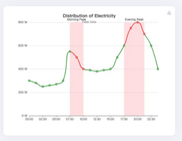 |
| bar           | Стовпчиковий графік для порівняння значень                 | 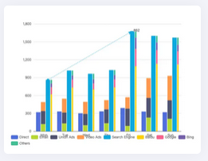 |
| pie           | Кругова діаграма для відображення часток                   | 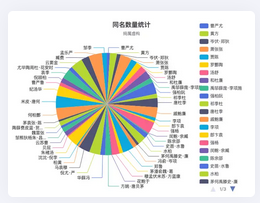 |
| scatter       | Точковий графік для відображення залежностей               | 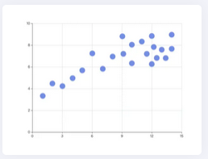 |
| effectScatter | Точковий графік з анімацією (підсвічування точок)          | 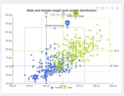 |
| radar         | Радарна діаграма для багатовимірних даних                  | 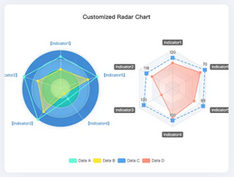 |
| tree          | Ієрархічне дерево                                          | 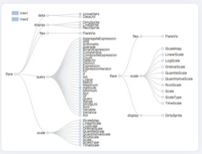 |
| treemap       | Ієрархія у вигляді вкладених прямокутників                 | 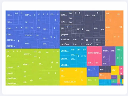 |
| sunburst      | Ієрархія у вигляді концентричних кілець                    | 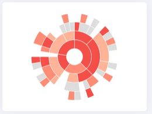 |
| boxplot       | Діаграма розподілу (ящик з вусами)                         | 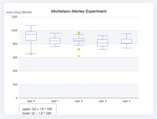 |
| candlestick   | Біржовий графік (open-high-low-close)                      | 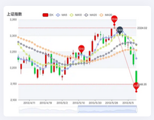 |
| heatmap       | Теплокарта інтенсивності значень                           | 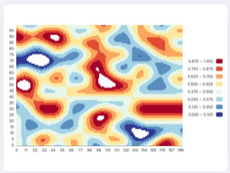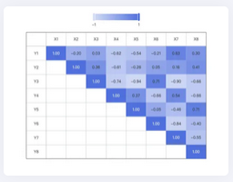 |
| map           | Відображення даних на географічній карті або в просторі    | 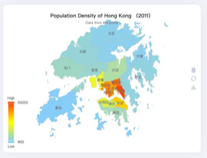 |
| parallel      | Візуалізація багатовимірних даних (паралельні осі)         | 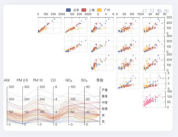 |
| lines         | Відображення ліній (наприклад, маршрути)                   | 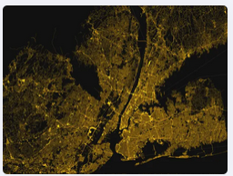 |
| graph         | Графи (вузли та зв’язки)                                   | 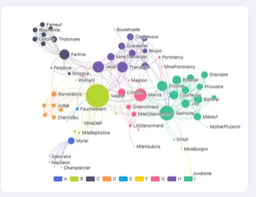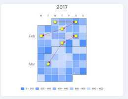 |
| sankey        | Потоки між станами                                         | 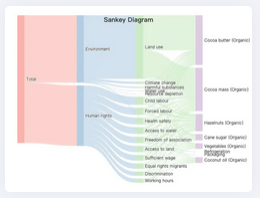 |
| funnel        | Воронка процесу                                            | 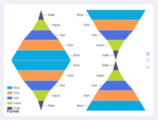 |
| gauge         | Індикатор (шкала, прилад)                                  | 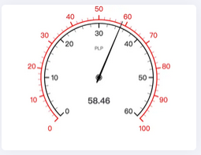 |
| pictorialBar  | Стовпчики з використанням іконок/форм                      | 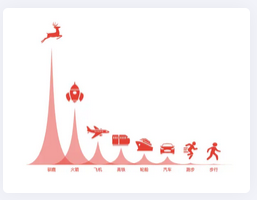 |
| themeRiver    | Потоки даних у часі                                        | 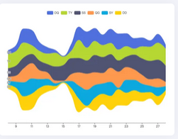 |
| chord         | Зв’язки між категоріями (хордовий графік)                  | 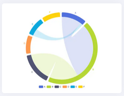 |
| custom        | Користувацька візуалізація                                 | 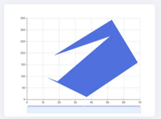 |

### `line`

Тип `line` використовується для відображення змін значення по впорядкованій осі, наприклад у часі.

```javascript
option = {
  xAxis: {type: 'category', data: ['A', 'B', 'C']},
  yAxis: {type: 'value'},
  series: [{ type: 'line', data: [10, 20, 15]}]
};
```

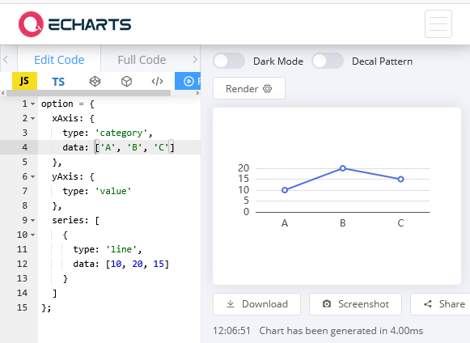

рис.1. Приклад типу `line`

Тип `line` використовується для відображення безперервної зміни значення по впорядкованій осі. Наприклад, це може бути час, порядковий номер або будь-яка інша впорядкована величина. Для роботи необхідні осі `xAxis` і `yAxis`. Як правило, `xAxis` має тип `category`, `time` або `value`, а `yAxis` — `value`. Детальніше про використання осей наведено в окремому підрозділі.

Кожна `series` відповідає одній лінії на графіку. Для відображення кількох параметрів використовується кілька `series`, які можуть спільно використовувати одну вісь X. Дані можуть задаватися у вигляді:

- масиву значень (відповідність до осі X визначається порядком)
- масиву пар `[x, y]` (явне задання координат)

Тип підтримує як статичні, так і динамічні сценарії, включаючи оновлення даних у процесі роботи. Він використовується для побудови як трендів, так і залежностей між параметрами.

### `bar`

Тип `bar` використовується для порівняння значень між категоріями. Дані відображаються у вигляді стовпців, що дозволяє наочно зіставляти величини.

```javascript
option = {
  xAxis: {
    type: 'category',
    data: ['A', 'B', 'C']
  },
  yAxis: {
    type: 'value'
  },
  series: [
    {
      type: 'bar',
      data: [10, 20, 15]
    }
  ]
};
```

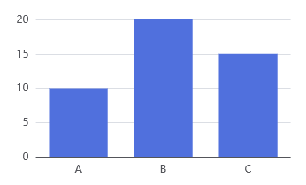

рис.2. Приклад типу `bar`

Тип `bar` працює з осями `xAxis` і `yAxis`. Як правило, `xAxis` має тип `category`, а `yAxis` — `value`. Можливий і зворотний варіант (горизонтальні стовпці), коли категорії задаються по осі Y. Кожна `series` відповідає одному набору стовпців. Для порівняння кількох параметрів використовується кілька `series`, які відображаються поруч або з накладанням.

Дані задаються аналогічно до `line`:

- масив значень (відповідність до категорій визначається порядком)
- масив пар `[x, y]`

Тип `bar` використовується для аналізу співвідношень, агрегованих значень і порівняння між об’єктами або інтервалами.

### `pie`

Тип `pie` призначений для відображення структури, тобто часток від цілого. На відміну від інших типів, дані тут задаються як об’єкти з полями `value` і `name`.

```javascript
option = {
  series: [
    {
      type: 'pie',
      data: [
        { value: 10, name: 'A' },
        { value: 20, name: 'B' }
      ]
    }
  ]
};
```

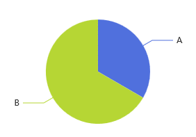

рис.3. Приклад типу `pie`

Тип `pie` використовується для відображення відносного внеску кожного елемента у загальну величину. Кожен сектор відповідає одному елементу даних, а його розмір визначається значенням `value`. На відміну від більшості інших типів, `pie` не використовує осі `xAxis` і `yAxis`. Дані задаються у вигляді масиву об’єктів, де кожен об’єкт містить щонайменше поля `value` (значення) та `name` (підпис).

Кожна `series` відповідає одній круговій діаграмі. За необхідності можна використовувати кілька `series` для створення вкладених або комбінованих діаграм.

Тип `pie` застосовується для відображення структури, розподілу або співвідношення частин у межах одного цілого.

### `scatter`

Тип `scatter` використовується для відображення залежності між двома змінними. Кожна точка задається парою значень.

```javascript
option = {
  xAxis: {
    type: 'value'
  },
  yAxis: {
    type: 'value'
  },
  series: [
    {
      type: 'scatter',
      data: [
        [10, 20],
        [15, 25]
      ]
    }
  ]
};
```

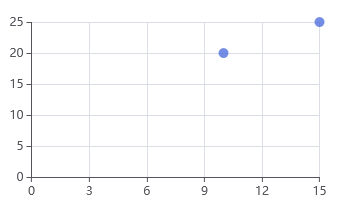

рис.4. Приклад типу `scatter`

Тип `scatter` відображає дані у вигляді окремих точок на площині. Кожна точка задається парою значень `[x, y]`, що означує її координати. Для роботи необхідні осі `xAxis` і `yAxis`, які зазвичай мають тип `value`. Це дозволяє відображати числові залежності між змінними. Кожна `series` відповідає одному набору точок. Для порівняння кількох наборів даних використовується кілька `series`.

Тип `scatter` застосовується для аналізу залежностей, виявлення кореляцій, кластерів та розподілу даних.

## 6. Осі координат та їх налаштування

Для багатьох типів графіків у Apache ECharts осі координат є окремими компонентами конфігурації. Вони задаються через `xAxis` та `yAxis` і означують, як інтерпретуються дані та як формується шкала графіка. Найпростіший приклад:

```javascript
option = {
  xAxis: {
    type: 'category',
    data: ['A', 'B', 'C']
  },
  yAxis: {
    type: 'value'
  },
  series: [{type: 'line',data: [10,20,15]}]
};
```

Тут вісь X є категоріальною, а вісь Y — числовою. 

Усі властивості осей описані у розділах відповідно [xAxis](https://echarts.apache.org/en/option.html#xAxis) та [yAxis](https://echarts.apache.org/en/option.html#yAxis)

Не всі типи графіків використовують осі координат. Типи, яким осі у такому вигляді не потрібні: `pie`, `gauge`, `funnel`, `sankey`, `tree`, `graph`, `sunburst`. Для них застосовуються інші моделі позиціонування даних.

### Типи осей

У той час як типи графіків (`series.type`) означують спосіб візуалізації даних, типи осей (`xAxis.type`, `yAxis.type`) означують спосіб побудови шкали. Тобто за допомогою цих властивостей задається, як інтерпретувати значення даних на координатних осях: як категорії, числову шкалу, часову шкалу або логарифмічне представлення. Для декартових координат (прямокутної системи координат) тип осі задається параметром `type`. 

Основними типами є:

- `category` — категоріальна вісь для дискретних значень, тобто наперед заданих окремих міток (категорій), а не неперервної числової шкали.
- `value` — числова вісь для неперервних даних. Використовується для числових значень, для яких масштаб зазвичай формується автоматично за даними. Підтримує задання меж (`min`, `max`), автоматичний вибір поділок, а також лінійне масштабування за замовченням.
- `time` — спеціалізована часова вісь. Призначена для часових рядів і, на відміну від звичайної числової осі, має власну логіку масштабування та форматування підписів. Наприклад, поділки можуть автоматично формуватися в годинах, днях або місяцях залежно від діапазону часу.
- `log` — логарифмічна шкала. Використовується, коли значення змінюються в широкому діапазоні порядків величин. На такій осі рівні інтервали відповідають не однаковій арифметичній різниці, а однаковому відношенню значень (наприклад, ×10). Це корисно для експоненційних залежностей або даних з великим розкидом.

Приклад часової осі:

```js
xAxis: {type: 'time'}
```

Крім класичних `xAxis` і `yAxis`, у ECharts існують осі для інших координатних систем:

- `radiusAxis` — радіальна вісь у полярних координатах 
- `angleAxis` — кутова вісь у полярних координатах
- `singleAxis` — одновимірна координатна вісь
- `parallelAxis` — осі для багатовимірних (parallel) графіків

Для тривимірних візуалізацій використовуються: `xAxis3D`, `yAxis3D` ,`zAxis3D`

### Межі та масштаб

Для числових осей типів `value`, `time` та `log` масштаб зазвичай визначається автоматично за даними, але за потреби його можна задати явно:

```js
yAxis: { type: 'value', min: 0, max: 100}
```

Параметри `min` і `max` задають межі шкали. Це корисно, коли масштаб повинен бути сталим або контрольованим.

Для числових осей також підтримуються додаткові параметри:

- `scale` — не примушувати вісь включати нуль (актуально для `value`)
- `inverse` — інверсія напрямку осі (працює для різних типів осей)
- `logBase` — основа логарифма для осей типу `log`
- `splitNumber` — рекомендована кількість поділок шкали
- `minInterval`, `maxInterval` — обмеження кроку поділок (для `value` і `time`)

Для категоріальної осі `category` поняття масштабу в такому вигляді не застосовується, оскільки вона працює не з неперервною шкалою, а з набором міток.

### Підписи та відображення осей

Крім типу і масштабу, для осей можна налаштовувати підписи, назви та елементи відображення.

```
option = {
  xAxis: {
    type: 'category', 
    data: ['Mon','Tue','Wed'], 
    name: 'Day',
    axisLabel: { rotate: 45},
    axisLine: { show: true},
    axisTick: { show: true}
  },
  yAxis: {
  	type: 'value',
    splitLine: { show: true}
  },
  series: [{type: 'line',data: [10,20,15]}]
};
```

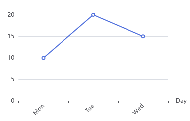

У цьому прикладі:

- `name` задає назву осі
- `axisLabel` керує виглядом підписів; тут вони повернуті на 45°
- `axisLine` вмикає відображення лінії осі
- `axisTick` задає відображення поділок
- `splitLine` вмикає сітку в області графіка

Такі параметри використовуються для покращення читабельності графіка. 

Для часових і категоріальних осей часто застосовується також `formatter`, який дозволяє змінювати формат підписів значень. Наприклад:

```js
axisLabel: {
  formatter: '{value} °C'
}
```

це дозволяє додавати одиниці вимірювання або власний формат відображення.

### Кількість осей

У декартових (rectangular) системах координат Apache ECharts графік зазвичай має одну вісь `xAxis` і одну вісь `yAxis`, тобто мінімально дві осі. Така конфігурація використовується у більшості простих графіків. За потреби кількість осей може бути збільшена. Один компонент `grid` зазвичай допускає до двох осей X (знизу і зверху) та до двох осей Y (ліворуч і праворуч). Для додаткових осей може використовуватись параметр `offset`, щоб уникати накладання.

Приклад двох осей Y:

```javascript
option = {
  xAxis: {
    type: 'category',
    data: ['10:00','10:01','10:02']
  },
  yAxis: [
    {type: 'value', name: 'Temperature', min: 0, max: 300},
    {type: 'value',name: 'Pressure', min: 0, max: 10}
  ],
  series: [
    {name: 'T', type: 'line', data: [180, 190, 185], yAxisIndex: 0},
    {name: 'P', type: 'line', data: [4.2, 4.6, 4.4], yAxisIndex: 1}
  ]
};
```

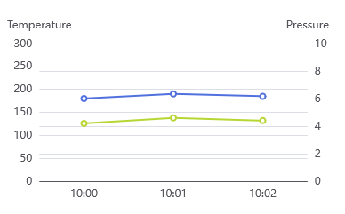

У складніших конфігураціях може бути кілька `grid`, і кожен може мати власні осі, фактично утворюючи кілька координатних областей в одному графіку.

### Тривимірні графіки

У Apache ECharts підтримуються і тривимірні (3D) візуалізації. Вони реалізуються через розширення ECharts GL (`echarts-gl`), яке підключається окремо від базової бібліотеки. Після підключення стають доступними 3D типи графіків, зокрема:

- `bar3D` — тривимірний стовпчиковий графік
- `scatter3D` — тривимірний точковий графік
- `line3D` — тривимірний лінійний графік
- `surface` — поверхня функції або поля значень
- `map3D` — тривимірні карти
- `globe` — глобус з нанесенням даних

У таких графіках використовуються вже три осі:

```javascript
xAxis3D: {...},
yAxis3D: {...},
zAxis3D: {...}
```

та просторове координатне середовище, наприклад:

```javascript
grid3D: {
  viewControl: { }
}
```

На відміну від звичайних 2D графіків, тут додається керування ракурсом, масштабуванням та обертанням сцени.

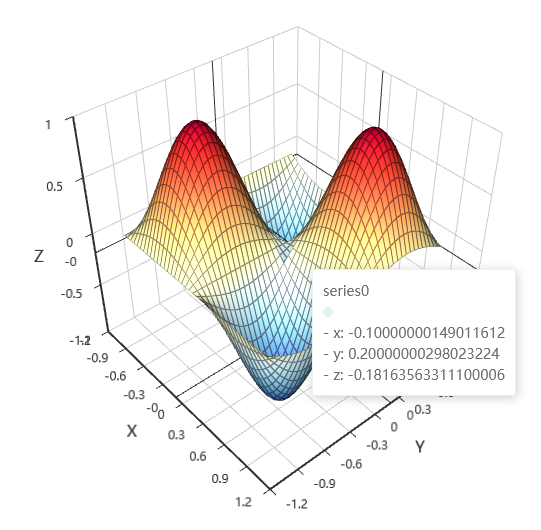

## 7. Інтерактивність

Однією з важливих особливостей Apache ECharts є вбудовані засоби інтерактивної взаємодії з графіком. Вони дозволяють досліджувати дані під час роботи. До базових засобів інтерактивності належать `tooltip`, `legend`, `dataZoom` та події (`events`).

### Принцип тригерів (`trigger`)

У конфігурації інтерактивних компонентів часто використовується поняття *trigger* (тригер), тобто умова або спосіб, за яким активується певна реакція інтерфейсу. Іншими словами, `trigger` означує *що саме є приводом для спрацювання механізму*. Наприклад, якщо у `tooltip` вказати

```js
tooltip: { trigger: 'item' }
```

то підказка формується для окремого елемента графіка, а такий запис

```js
tooltip: { trigger: 'axis'}
```

вказує що підказка формується для поточної координати осі та може охоплювати кілька `series`.

так, тут є кілька важливих речей, які варто додати: `tooltip` можна конфігурувати не лише глобально, є `triggerOn`, `axisPointer` важливіший ніж я раніше показав, і `formatter` буває шаблонний і функціональний. я б підпункт зробив так:

### Спливаючі підказки (`tooltip`)

Компонент `tooltip` використовується для відображення додаткової інформації про дані при взаємодії користувача з графіком. Зазвичай це значення точки, назва `series`, координати або інші пов’язані дані. `tooltip` може конфігуруватися глобально для всього графіка, а також для окремих координатних систем, `series` або навіть окремих елементів даних.

Найпростіший приклад:

```javascript
option = { tooltip: { trigger: 'axis'} };
```

Як вже зазначалося, параметр `trigger` означує спосіб формування підказки: `item` — для окремого елемента, `axis` — для значень усіх `series` у поточній координаті осі, `none` — вимкнення спрацювання

Окрім цього, важливими властивостями є:

- `formatter` — форматування вмісту підказки
- `triggerOn` — спосіб активації (`mousemove`, `click`)
- `position` — положення вікна підказки
- `axisPointer` — покажчик координати
- `alwaysShowContent` — постійне відображення підказки

Приклад форматування:

```javascript
tooltip: { formatter: '{b}: {c} °C' }
```

Тут використовується шаблонний синтаксис форматування, де спеціальні маркери підставляються значеннями даних:

- `{a}` — ім’я `series`
- `{b}` — назва категорії або ім’я точки даних
- `{c}` — значення даних
- `{d}` — додаткове значення для окремих типів графіків (наприклад відсоток для `pie`)

Тому шаблон

```
'{b}: {c} °C'
```

може формувати, наприклад, такий текст:

```
10:00: 125 °C
```

Такий шаблонний підхід зручний для простого форматування без використання функцій. Для складнішої логіки використовується `formatter` як функція.

```js
tooltip: {
 formatter: function(params){
   return params.name + ': ' + params.value;
 }
}
```

У цьому випадку `formatter` викликається щоразу при формуванні підказки, а параметр `params` містить інформацію про вибраний елемент даних. У наведеному прикладі:

- `params.name` — назва точки даних або категорії
- `params.value` — її значення

Функція формує текст підказки конкатенацією цих значень.

### Покажчик осі (`axisPointer`)

Важливою частиною `tooltip` є `axisPointer` — механізм візуального позиціонування на осі. Він допомагає досліджувати дані та особливо корисний для кількох `series`. Наприклад:

```js
option = {
  tooltip: {
    trigger: 'axis',
    axisPointer: {type: 'cross'}
  },
  xAxis: {type: 'category', data: ['A','B','C','D']},
  yAxis: {type: 'value'},
  series: [{type: 'line',data: [10,20,15,25]}]
};
```

При наведенні курсора на графік з’являється підказка, а також перехресний покажчик координат.

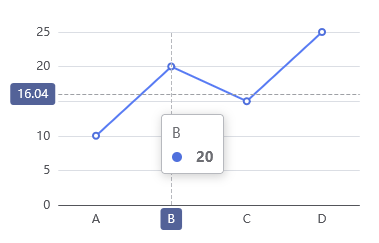

У властивості `type: 'cross'` задається тип покажчика. Можливі варіанти: `line` — лінія покажчика, `shadow` — тіньова область, `cross` — перехресний покажчик. Наприклад, для стовпчикових графіків часто використовують `shadow`. для осей `value` і `time` підтримується також прив’язка до найближчої точки: `axisPointer:{snap: true}`

### Легенда (`legend`)

Компонент `legend` дозволяє відображати назви `series` для можливості ідентифікації та керувати їх видимістю. 

```javascript
option = {
 legend: {},
 xAxis:{type:'category', data:['A','B','C']},
 yAxis:{type:'value'},
 series:[{name:'T1',type:'line',data:[10,20,15]},
   {name:'T2',type:'line',data:[15,12,18]}]
};
```

Користувач може через легенду тимчасово вмикати або вимикати окремі `series`, клікаючи по назві.


У найпростішому варіанті легенда формується автоматично з назв `series.name`, і для її активації достатньо вказати порожній об’єкт `legend: {}`. Водночас `legend` підтримує розширене налаштування через властивості, що дозволяють задавати розташування й орієнтацію, використовувати прокручування для великої кількості `series`, різні режими вибору та засоби керування видимістю груп даних.

### Масштабування (`dataZoom`)

Компонент `dataZoom` використовується для масштабування і прокрутки даних, дозволяючи досліджувати окремі фрагменти графіка або, навпаки, переглядати дані в цілому. У концептуальному сенсі `dataZoom` створює *вікно перегляду* на осі. Найпростіший приклад:

```javascript
option = {
 dataZoom: [{type: 'slider'}],
 xAxis:{type:'category',data:['1','2','3','4','5','6','7']},
 yAxis:{type:'value'},
 series:[{type:'line',data:[10,15,8,20,22,18,16]}]
};
```

У цьому прикладі під графіком з’являється повзунок, за допомогою якого можна змінювати видиму частину даних.

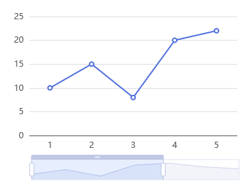

У ECharts підтримуються кілька варіантів `dataZoom`:

- `slider` — окремий повзунок масштабування;
- `inside` — масштабування жестами миші або колеса прокрутки прямо в області графіка;
- `select` — масштабування виділенням області (через `toolbox`).

Можливе поєднання двох механізмів:

```javascript
dataZoom: [
 { type:'slider' },
 { type:'inside' }
]
```

Такий варіант часто використовується на трендах.

`dataZoom` може працювати з різними осями. Також вікно перегляду можна задати програмно:

```javascript
dataZoom: {
 start: 20,
 end: 80
}
```

Тут показуються дані від 20% до 80% діапазону.

### Події (`events`) і дії (`actions`)

Окрім конфігурації компонентів інтерактивності, ECharts підтримує програмну реакцію на дії користувача через події (`events`). Це дозволяє пов’язувати графік з прикладною логікою: відкривати детальні дані, реагувати на вибір користувача, виконувати drill-down або змінювати сам графік. Події підключаються методом:

```javascript
chart.on('click', function(params) {
  console.log(params.name);
});
```

У цьому прикладі обробляється подія `click`, а об’єкт `params` містить інформацію про вибраний елемент. Наприклад:

- `params.name` — ім’я точки або категорії
- `params.value` — значення
- `params.seriesName` — ім’я `series`
- `params.dataIndex` — індекс точки в масиві даних

Підтримуються типові події миші: `click`, `dblclick`, `mouseover`, `mouseout`,` mousemove`.

Події можуть бути пов’язані не лише з елементами графіка, а й з інтерактивними компонентами. Наприклад зміна легенди генерує подію:

```javascript
chart.on('legendselectchanged', function(params){
 console.log(params.selected);
});
```

А зміна масштабу — подію:

```javascript
chart.on('datazoom', function(){
 console.log('zoom');
});
```

### Програмні дії (`dispatchAction`)

Крім реакції на події, ECharts дозволяє програмно ініціювати дії через:

```javascript
chart.dispatchAction({...});
```

Наприклад показати підказку кодом:

```javascript
chart.dispatchAction({
 type:'showTip',
 seriesIndex:0,
 dataIndex:1
});
```

Або програмно виділити точку:

```javascript
chart.dispatchAction({
 type:'highlight',
 seriesIndex:0,
 dataIndex:1
});
```

Поширені дії:

- `showTip` — програмно показати `tooltip` для вибраної точки даних.
- `highlight` — виділити елемент графіка (наприклад точку, сектор або стовпець), зазвичай через візуальний акцент.
- `downplay` — зняти виділення або повернути елемент до звичайного стану.
- `legendSelect` — програмно увімкнути відображення вибраної `series` через легенду.
- `legendUnSelect` — програмно вимкнути відображення вибраної `series`.
- `dataZoom` — програмно змінити поточне вікно масштабування, тобто керувати видимим діапазоном даних.


## Джерела

1. 


## Автори


Теоретичне заняття розробив [Олександр Пупена](https://github.com/pupenasan). 

## Feedback

Якщо Ви хочете залишити коментар у Вас є наступні варіанти:

- [Обговорення у WhatsApp](https://chat.whatsapp.com/BRbPAQrE1s7BwCLtNtMoqN)
- [Обговорення в Телеграм](https://t.me/+GA2smCKs5QU1MWMy)
- [Група у Фейсбуці](https://www.facebook.com/groups/asu.in.ua)

Про проект і можливість допомогти проекту написано [тут](https://asu-in-ua.github.io/atpv/)
