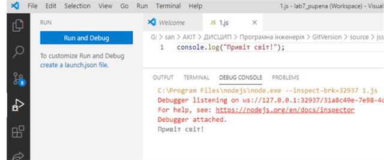

[<- До підрозділу](README.md)

# Основи роботи з JavaScript: практична частина

**Тривалість**: 4 акад. години.

**Мета:** Навчитися працювати з JavaScript

**Лабораторна установка**

- Апаратне забезпечення: ПК
- Програмне забезпечення: NodeJS Visual Studio Code

## Порядок виконання роботи 

### 1. Встановлення та налаштування Node.js та Visual Studio Code (VSC) 

- [ ] Завантажте та встановіть на робочий ПК безкоштовне середовище [Node.js](https://nodejs.org). Це середовище виконання коду JS як серверного застосунку. 
- [ ] Завантажте та встановіть на робочий ПК безкоштовний редактор [Visual Studio Code](https://code.visualstudio.com/) .
- [ ] запустіть його на виконання

### 2. Створення робочої області, добавлення папки та файлу 

Visual Studio Code (надалі VSC) - редактор IDE, який надаєм можливості зручного створення проектів на різних мовах програмування, у тому числі на JavaScript. Проект створюється в межах ***робочого простору*** (***Workspace***), який включає в себе файли налаштування, папки та файли проекту.  

- [ ] створіть десь на диску вашого ПК папку з назвою "Lab7_lastname", де  "lastname" - ваше прізвище 
- [ ] після відкриття VSC, одразу збережіть файл робочої області "File->Save Workspace As.." у папці, яку Ви щойно створили з такою ж назвою  
- [ ] створіть новий файл "File->New File" після чого збережіть його з іменем `2.js` у цю ж папку 
- [ ] скопіюйте в редактор наступний код:

```javascript
console.log("Привіт світ!"); 
```

- [ ] запустіть код на виконання клавішою `F5` у консолі налагодження повинно з'явитися повідомлення



рис.7.2. Використання консолі відлагодження 

- [ ] активуйте термінал: "View->Terminal"
- [ ] виведіть в терміналі 

```bash
node 2.js
```

- [ ] і натисніть `Enter`

У терміналі повинно з'явитися таке ж повідомлення. Надалі рекомендується використовувати запуск програми саме через комнаду  `node`

- [ ] зробіть коментар до рядку виводу, в такому форматі

```javascript
console.log("Привіт світ!"); //вивело "Привіт світ"
```

**У наступних кроках необхідно завжди писати в коментарях до  console.log, що вони виводили, це необхідно для звіту !** 

- [ ] Збережіть файл. 

### 3. Робота зі змінними 

- [ ] Користуючись лекціями [Основи JavaScript](../Лекц/13_js.md) зробіть наступні завдання у новоствореному файлі, доповнюючи його новими рядками:

- Створіть новий файл та збережіть його з назвою "3.js" 
- Створіть змінні, які наведені в таб.7.1:

Таблиця 7.1. Назва змінних

| Назва    | Значення ініціалізації (приклад) | Примітка (вказати в коментарі)         |
| -------- | -------------------------------- | -------------------------------------- |
| frstName | Іван                             | вписати своє ім'я                      |
| lastName | Іваненко                         | вписати своє прізвище                  |
| nick     | mynick                           | вписати нік на GitHub                  |
| age      | 41                               | вписати свій вік                       |
| weight   | 80.4                             | вписати вагу (приблизно)               |
| hight    | 1.83                             | вписати свій ріст в метрах (приблизно) |
| birthday |                                  | залишити порожнім                      |
| marital  | true                             | вписати одружений/заміжня              |

- [ ] допишіть фрагменти для виведення в консоль:
  - типи усіх змінних, використовуючи оператор `typeof` ; 
  - результат множення висоти на 100  
  - речення у наступному форматі (у поля вставляються відповідні змінні)

```
Привіт! Мене звати Іван Іваненко, мені 41 роки.
```

- [ ] допишіть фрагменти для виведення в консоль:
  - повідомлення про свій вік у 10-ковому, 2-ковому та 16-ковому форматі. 
  - прізвища та імені у верхньому регістрі,  використовуючи методи об'єкта `String` 

```
ІВАН ІВАНЕНКО
```

- [ ] допишіть фрагменти для виведення в консоль:
  - суми довжин в літерах прізвища та імені, використовуючи методи об'єкта `String` 
  - перші три літери імені  

- [ ] Запустіть програму на виконання. Біля інструкцій виводу в консоль добавте коментарі, в яких вкажіть, що саме було виведено цією інструкцією.   

- [ ] Збережіть файл як "3.js"

### 4. Робота з операторами 

- [ ] Збережіть файл як "4.js"
- [ ] видаліть усю частину програми, окрім об'явлення змінних
- [ ] використовуючи оператори, допишіть фрагменти для виведення в консоль:
  - остачу від ділення росту на `1`
  - результат порівняння ріст >`1.80`; результат порівняння попередньо занести в нову змінну `isHigh`
  - [індекс маси тіла](https://moz.gov.ua/article/health/jak-viznachti-optimalnu-vagu-formula-indeksu-masi-tila) = вага / квадрат росту; попередньо занести результат порівняння в нову змінну `IMT`
  - `вага нормальна` або `вага поза нормою` використовуючи умовний оператор (`?`), логічні операції та операції порівняння, за умови, що [нормою вважається діапазон](https://moz.gov.ua/article/health/jak-viznachti-optimalnu-vagu-formula-indeksu-masi-tila) IMT 18,5-24,9 ; результат попередньо занести в змінну `IMTstate`
- Запустіть програму на виконання. Біля інструкцій виводу в консоль добавте коментарі, в яких вкажіть, що саме було виведено цією інструкцією.   

- [ ] Збережіть файл як "4.js"

### 5. Робота з умовними інструкціями

- [ ] Збережіть файл як "5.js" 

- [ ] видаліть усю частину програми, окрім об'явлення та розрахунку змінних

- [ ] допишіть фрагменти для виведення в консоль та виконання дій:

  - використовуючи інструкцію `if`  виведіть наступні повідомлення:

Таблиця 7.2. Список повідомлень

| **Показник ІМТ, кг/м2** | Повідомлення              |
| ----------------------- | ------------------------- |
| Менше 18,5              | Показник Менше 18,5       |
| 18,5-24,9               | Показник між 18,5 та 24,9 |
| 25,0-29,9               | Показник між 25,0 та 29,9 |
| Понад 30                | Показник Понад 30         |

- модифікуйте програму з використанням `if`, щоб змінився розрахунок `IMTstate`

Таблиця 7.3. Список повідомлень

| **Показник ІМТ, кг/м2** | **Ознака** (`IMTstate`) |
| ----------------------- | ----------------------- |
| Менше 18,5              | недостатня вага         |
| 18,5-24,9               | нормальна вага          |
| 25,0-29,9               | зайва вага              |
| Понад 30                | дуже надмірна вага      |

- використовуючи конструкцію `switch` визначте приналежність до діапазону значень (виведіть результат на консоль):

  - 0-10: "IMT нульове" 
  - 10-20:"IMT від 10 до 20" 
  - 20-30: "IMT від 20 до 30" 
  - 30-40: "IMT від 30 до 40" 
  - 40-нескінченність; "IMT неможливе" 

- > підказка: поділіть IMT на 10, визначте цілу частину і вкажіть в якості значень результат

- [ ] Запустіть програму на виконання. Біля інструкцій виводу в консоль добавте коментарі, в яких вкажіть, що саме було виведено цією інструкцією.   

- [ ] Збережіть файл як "5.js"

### 6. Робота з циклами

- [ ] Збережіть файл як "6.js" 

- [ ] видаліть усю частину програми, окрім об'явлення та розрахунку змінних

- [ ] допишіть фрагмент програми, де  використовуючи оператори циклів перераховується, яких літер у Вашому прізвищі та імені найбільше; доступ до літер проводиться через `[індекс]`; результат запишіть у дві змінні: `lit` - найчастіше застосовна літера,`cnt` - кількість літер; слід передбачити, що регістр літер не має значення;

- [ ] допишіть фрагмент для виведення в консоль:

  ```
  Найчастіше використовувана у імені та прізвищі літера - lit, зустрічається cnt разів 
  ```

- [ ] Запустіть програму на виконання. Біля інструкцій виводу в консоль добавте коментар, в якому вкажіть, що саме було виведено цією інструкцією. 

- [ ] Збережіть файл як "6.js" 

> підказка: не забувайте ініціалізувати змінні початковими значеннями; можливо знадобиться створювати проміжні змінні 

### 7. Робота з функціями

- [ ] Збережіть файл як "7.js" 

- [ ] видаліть усю частину програми, окрім об'явлення та розрахунку змінних

- [ ] створіть наступні функції:

- `getIMT` для розрахунку IMT за вагою та ростом, які передаються в якості аргументу
- `getIMTstate` для розрахунку `IMTstate` за IMT
- `getLitfavor` для розрахунку найчастіше застосовної літери та їх кількості за переданим іменем та прізвищем; підказка - повертається об'єктна змінна; 

- [ ] модифікуйте код програми таким чином, щоб при розрахунку використовувалися ці функції.

- [ ] Запустіть програму на виконання, перевірте щоб все працювало коректно.

- [ ] Збережіть файл як "7.js"

>  нагадування: функції окрім створення треба ще і викликати. 

### 8. Робота з об'єктами

- [ ] Збережіть файл як "8.js"

- [ ] використовуючи літеральний синтаксис створіть об'єкт `Student`, який би включав в себе наведений вище функціонал, а саме:

- [ ] властивості, що наведені в таблиці 1;

- [ ] метод  `getIMT`, без передачі параметрів, який би автоматично розраховував і повертав об'єкт типу {`IMT`, `IMTstate`}; 

- [ ] метод `getLitfavor`, без передачі параметрів, який би автоматично розраховував і повертав об'єкт типу {`lit`, `cnt`};

- [ ] модифікуйте програму, в якій необхідно використовуючи об'єкт:

- змінити властивість ваги і вивести на консоль `IMT` та `IMTstate` ;
- змінити прізвище та ім'я і вивести на консоль   `lit` та `cnt`

- [ ] Збережіть файл як "8.js"

> нагадування: методи окрім створення треба ще і викликати. 

### 9. Робота з масивом

- [ ] збережіть файл як "9.js"

- [ ] у літеральному означенні об'єкта `Student`добавте нову властивість `traits` типу масив, з трьома рисами у текстовому форматі, типу "працелюбний" і т.п.

- [ ] означте для об'єкта метод `getTraits`, який повертає перелік характеристик через кому; перевірте роботу метода;

- [ ] означте для об'єкта метод `addTraits`, який добавляє в перелік характеристик додаткову; перевірте роботу метода;

- [ ] збережіть файл як "9.js"         

### 10. Робота з датою та часом 

- [ ] запустіть `Visual Studio Code`, якщо він ще не запущений

- [ ] створіть новий файл "10.js".

- [ ] скопіюйте та перевірте роботу наступного фрагменту програми

```javascript
let now = new Date();                     //плинне значення
let tssp = new Date(now.getTime()- 5000); //задане значення
console.log ("Зараз - \t\t" + now.toLocaleString());
console.log ("5 секунд назад було \t" + tssp.toLocaleString());

let ny = new Date(now.getFullYear() + ", 1, 1 00:00:00"); //дата та часу нового року
let fromny = {
    //кількість секунд з нового року
    totalsec: Math.fround((now.getTime() - ny.getTime())/1000)
}; 
//поділено на кількість секунд за добу
fromny.days = Math.floor(fromny.totalsec/(60*60*24));
//остача від ділення кількості годин з НР на 24 
fromny.hours = Math.floor(fromny.totalsec/(60*60)) % 24;
//остача від ділення кількості хивлин з НР на 60
fromny.mins = Math.floor(fromny.totalsec/(60)) % 60;
//остача від ділення кількості секунд з НР на 60
fromny.seconds = fromny.totalsec % 60;        
console.log ("З нового року пройшло \t" + fromny.days + " днів, " + fromny.hours + " годин," + fromny.mins + " хвилин, " + fromny.seconds + " секунд.");
```

- [ ] проаналізуйте наведений вище код, та отримані результати, дайте відповіді на наступні питання:

* розпишіть призначення кожної функції, яка використана в фрагменті
* поясніть яким чином розраховується час нового року 
* поясніть призначення службового символу `\t` 
* поясніть призначення оператору `%`
* порівняйте результати кількості годин, що пройшли з Н.Р. з астрономічним часом, якщо є неспівпадіння, спробуйте вияснити з чим воно пов'язано  

- [ ] відповіді на питання запишіть внизу коду в коментарях 

- [ ] збережіть файл як "10.js".

### 11. Створення функції визначення різниці в часі 

- [ ] збережіть файл як "11.js"

- [ ] модифікуйте програму: створіть функцію, яка буде повертати різницю в часі в добах, хвилинах, секундах:

* буде приймати два аргументи DT1 та DT2 у форматі TimeStamp 
* повертати об'єкт, аналогічний `fromny`

- [ ] перевірте роботу функції, вивівши час з нового року та з Вашого дня народження 

- [ ] збережіть файл як "11.js"

### 12. Робота з функцією setInterval 

Завдання програми в цьому пункті запустити асинхронну функцію періодичного виклику функції планувальника `fnshed`, яка буде перевіряти чи наступила запланована. По завершенню події, планувальнику більше нічого робити, тому він зупиняється.

- [ ] збережіть файл як "12.js"

- [ ] видаліть весь зміст, перекопіюйте код, написаний нижче і запустіть його на виконання: 

```javascript
let fnshed = function (begin, end) {
    let dt = new Date();
    let msg = dt.toLocaleString();
    if (dt.getTime()>=end.getTime()) {
        clearTimeout(htmr);
        msg = msg + ": Подію зупинено";
    }    
    else if (dt.getTime()>=begin.getTime()) {
        msg = msg + ": Подія працює"; 
    }
    console.log (msg);     
} 
let now = new Date();                    
let begin = new Date(now.getTime() + 3000);
let end =  new Date (now.getTime() + 8000);     
htmr = setInterval(fnshed, 1000, begin, end );
console.log (now.toLocaleString () + " Планувальник запущено:"); 
console.log ("- початок події о " + begin.toLocaleString());
console.log ("- кінець події о " + end.toLocaleString());
```

- [ ] проаналізуйте усі інструкції, зробіть коментарі біля кожної з них

- [ ] збережіть файл як "12.js"

### 13. Планувальник на одну подію

У даному пункті треба реалізувати код для роботи планувальника на одну подію  `shedevt`, яка повинна запуститися та зупинитися у вказаний час, при цьому зробити певні повідомлення для адресату з іменем `topic` та командами `cmdbegin` та  `cmdend`.

- [ ] збережіть файл як "13.js"  

- [ ] видаліть весь зміст, перекопіюйте код, написаний нижче і запустіть його на виконання: 

```javascript
let now = new Date();    
let shedevt = {
    tbegin: new Date(now.getTime()+ 5000), //дата/час початку  події
    tend: new Date (now.getTime() + 10000), //датча/час кінця  події
    topic: "lamp", //адресат для події
    cmdbegin:"on", //команда на виконання для початку події
    cmdend:"off"	//команда на виконання для кінця події
};

let fnshed = function () {
    let dt = new Date();
    msgtxt = dt.toLocaleString();
    let msg = {};
    //цю умову треба проаналізувати і прокоментувати
    if (dt.getTime()>=shedevt.tend.getTime()) {
        clearTimeout(htmr);
        msgtxt = msg.msgtxt + ": Подію зупинено";
        shedevt.started = false; //прапорець, що подія зараз не працює
        msg.payload = shedevt.cmdend;
        msg.topic = shedevt.topic;
        console.log (msg);
    }    
    //цю умову треба проаналізувати і прокоментувати
    else if ((dt.getTime()>=shedevt.tbegin.getTime()) && (!shedevt.started)) {
        msgtxt = msg.msgtxt + ": Подію запущено";
        msg.payload = shedevt.cmdbegin;
        msg.topic = shedevt.topic;
        shedevt.started = true; //прапорець, що подія зараз працює
        console.log (msg);  
    }
    console.log (msgtxt);     
}    
htmr = setInterval(fnshed, 1000);
console.log (now.toLocaleString () + " Планувальник запущено");
```

- [ ] проаналізуйте усі інструкції, зробіть коментарі біля вказаних умов; 

> Зверніть увагу, що час початку та завершення події в планувальнику задаються автоматично. Це зроблено свідомо, щоб автоматизувати перевірку. На пізніших етапах це буде використовуватися виключно для цілей тестування. 

- [ ] збережіть файл як "13.js"  

### 14. Планувальник на кілька подій в стеці

- [ ] збережіть файл як "14.js"  

- [ ] видаліть весь зміст, перекопіюйте код, написаний нижче і запустіть його на виконання: 

```javascript
let now = new Date();    
let scheduler = [];
scheduler.push({
    tbegin: new Date(now.getTime()+ 5000), 
    tend: new Date (now.getTime() + 10000), 
    topic: "lamp1", cmdbegin:"on", cmdend:"off"	
});
scheduler.push({
    tbegin: new Date(now.getTime()+ 6000), 
    tend: new Date (now.getTime() + 8000),
    topic: "lamp2", cmdbegin:"on", cmdend:"off"
});
scheduler.push({
    tbegin: new Date(now.getTime()+ 3000),
    tend: new Date (now.getTime() + 9000),
    topic: "power", cmdbegin:"85", cmdend:"0"	
});
for (let schedevt of scheduler) {
    console.log (schedevt.topic);
}
```

- [ ] проаналізуйте роботу наведеного вище коду

- [ ] доповніть наведений вище код наступним фрагментом і запустіть його на виконання:

```javascript
let fnshed = function () {
    let dt = new Date();
    msgtxt = dt.toLocaleString();
    console.log (msgtxt);
    for (let schedevt of scheduler) checkshed (schedevt);
    for (let i = 0; i < scheduler.length; i++) {
        if (dt.getTime()> scheduler[i].tend.getTime()){
            console.log (scheduler[i].topic);
            scheduler.splice(i,1);
        }
    }
    if (scheduler.length === 0) clearTimeout(htmr);         
}

function checkshed (shedevt) {
    let dt = new Date();
    let msg = {};
    if (dt.getTime()>=shedevt.tend.getTime()) {
        if (shedevt.started){
            shedevt.started = false; 
            msg.payload = shedevt.cmdend;
            msg.topic = shedevt.topic;
            console.log ("Подію для "  + msg.topic + " зупинено ");
        }        
    }    
    else if ((dt.getTime()>=shedevt.tbegin.getTime()) && (! shedevt.started)) {
        msg.payload = shedevt.cmdbegin;
        msg.topic = shedevt.topic;
        shedevt.started = true; 
        console.log ("Подію для "  + msg.topic + " запущено");  
    }
}    
htmr = setInterval(fnshed, 1000);
console.log (now.toLocaleString () + " Планувальник запущено");
```

- [ ] проаналізуйте усі інструкції, зробіть коментарі біля усіх інструкцій 

- [ ] збережіть файл як "14.js"  

### 15. Перетворення добового планувальника в астрономічний

У наведеному вище коді в планувальнику задавався астрономічний час. Однак часто план задається для днів тижня. Тому в даному прикладі необхідно написати функцію, яка буде формувати астрономічний план на добу за умов задання часу початку і завершення в мілісекундах, починаючи з 00:00:00.    

- [ ] збережіть файл як "15.js" 

- [ ] видаліть весь зміст, перекопіюйте код, написаний нижче і запустіть його на виконання: 

```javascript
let now = new Date();
let strtday = new Date(now.toDateString());
let delta = now.getTime() - strtday.getTime();//кількість мілісекунд з початку доби
let scheduler = [];
scheduler.push({
    tbegin: delta + 5000, //кількість мілісекунд з початку доби + 5000 мс
    tend: delta + 10000, 
    topic: "lamp1", cmdbegin:"on", cmdend:"off"	
});
scheduler.push({
    tbegin:delta + 6000, 
    tend: delta + 8000,
    topic: "lamp2", cmdbegin:"on", cmdend:"off"
});
scheduler.push({
    tbegin: delta + 3000,
    tend: delta + 9000,
    topic: "power", cmdbegin:"85", cmdend:"0"	
});

//пам'ятайте, що об'єкти передаються за посиланнями а не за значенням
function daytoshed (scheduler ){
    let strtday = new Date(now.toDateString());
    for (let schedevt of scheduler) {
        schedevt.tbegin = new Date (strtday.getTime() + schedevt.tbegin);
        schedevt.tend = new Date (strtday.getTime() + schedevt.tend);    
    }    
}
daytoshed (scheduler);
for (let schedevt of scheduler) {
    console.log (schedevt.tbegin);
    console.log (schedevt.tend);         
} 
```

- [ ] проаналізуйте роботу коду

- [ ] збережіть файл як "15.js" 

- [ ] скопіюйте другу частину коду з файлу "14.js"  (п.5), запустіть на виконання і перевірте роботу 

- [ ] збережіть файл як "16.js" 


Практичне заняття розробив [Олександр Пупена](https://github.com/pupenasan). 
