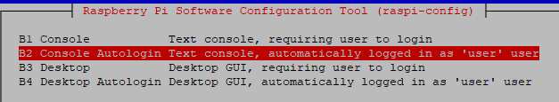

[<- До підрозділу](README.md)

# Прототип: практична частина

**Тривалість**: 

**Мета:**  

## Лабораторна установка для проведення лабораторної роботи у віртуальному середовищі.

**Апаратне забезпечення, матеріали та інструменти для проведення віртуальної лабораторної роботи.** 


Рис.1.20. Функціональна схема лабораторної установки

**Програмне забезпечення, що використане у віртуальній лабораторній роботі.** 

1. Сніфер Wireshark (http://www.wireshark.org/)
2. Вбудовані утиліти Winodws XP.

## Загальна постановка задачі

Цілі роботи: 

- 

## Послідовність виконання роботи

- [ ] ### Встановлення та налаштування ОС

  Нижче описані кроки встановлення необхідного ПЗ на RPI

  - Встановити Raspberry PI OS консольну версію (мінімум **OS Lite**). 
  - Вставити карту, включити та підключити монітор
  - Встановити Samba

  ```
  sudo apt-get update
  sudo apt-get install samba
  ```

  ### Створити користувача

  - Створити користувача `user1`

  ```
  sudo adduser user1
  ```

  Під час виконання команди система попросить ввести пароль. Введіть `пароль` (система може попередити про слабкий пароль, але дозволить його використовувати).

  Щоб користувач мав доступ до X-сервера, відеокарти, USB та інших пристроїв  а також тимчасово `sudo`:

  ```
  sudo usermod -aG sudo,tty,video,render,plugdev,input user1
  ```

  - перегрузитися під користувачем `user1`

  - змінити користувача та вхід за замовченням з входом під консоллю (вимкнути графічну підсистему)

  ```
  sudo raspi-config
  ```

  

  ребутнутися

  ### Встановлення та налаштування серверу X та графіки

  - Встановити Firefox та надати йому доступ до папки користувача

  ```
  sudo apt-get install firefox
  ```

  - встановити xserver

  ```
  sudo apt-get install xorg
  ```

  - добавити (змінити) в 

  ```
  sudo nano /etc/X11/Xwrapper.config
  ```

  рядок

  ```
  allowed_users=anybody
  ```

  - налаштувати програму `sudo nano /home/user1/.xinitrc` з необхідними параметрами сторінки

  ```
  firefox --kiosk --width 1280 --height 1024  http://127.0.0.1:1880/dashboard/main
  ```

  - спробувати запустити `startx`
  - коли видасть помилку змінити:

  ```
  ls -ld ~/.cache  
  sudo chown -R $(whoami):$(whoami) ~/.cache  
  sudo chmod -R 700 ~/.cache  
  ```

  - знову спробувати запустити `startx`, має стартанути на весь екран

  - встановити щоб `startx` завантажувалося за замовченням

  ```
  sudo nano /home/user1/.bash_profile
  ```

  записати

  ```
  if [ -z "$DISPLAY" ] && [ "$XDG_VTNR" = 1 ]; then
    exec startx
  fi
  ```

  - перезапустити систему і перевірити що вікно завантажується 


Практичне заняття розробив  
