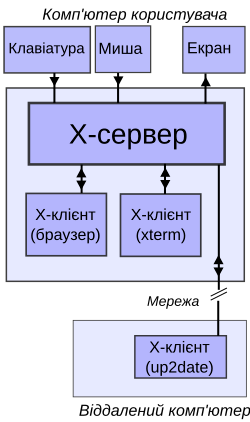

[<- До підрозділу](README.md)

# XServer: теоретична частина

## 1. Загальні поняття

https://uk.wikipedia.org/wiki/X_Window_System

X Window System — віконна система, що забезпечує стандартні інструменти й протоколи для побудови графічних інтерфейсів користувача. Майже всі сучасні операційні системи підтримують X Window System.

X Window System забезпечує базові функції графічного середовища: відображення й переміщення вікон на екрані, взаємодію з мишею та клавіатурою. X Window System не означує деталей інтерфейсу користувача — цим займаються менеджери вікон, яких розроблено безліч. Через це зовнішній вигляд програм у середовищі X Window System може дуже різнитися; різні програми можуть використати цілком несхожі один на одного інтерфейси.

У X Window System передбачена мережева прозорість: графічні програми можуть виконуватися на іншій машині в мережі, інтерфейс при цьому буде передаватися через мережу й відображатись на локальній машині користувача. У X Window System терміни «клієнт» і «сервер» мають незвичне багатьом значення: «сервер» означає локальний дисплей користувача (дисплейний сервер), а «клієнт» — програму, яка цей дисплей використовує (вона може виконуватися й на віддаленому комп'ютері).

 X Window System часто називають X11 чи X, неформально «ікси́».

X Window System використовує клієнт-серверну модель взаємодії: X-сервер обмінюється повідомленнями з різними клієнтськими програмами. Сервер приймає запити виведення графіки (вікон) і відправляє назад введення користувача (з клавіатури, миші чи сенсорного екрану). X-сервер може бути:

- системною програмою, яка контролює виведення зображення на персональному комп'ютері;
- застосунком, який відображає графіку у вікно іншої дисплейної системи;
- виділеним компонентом аппаратного забезпечення.

Ця клієнт-серверна термінологія — **термінал користувача як «сервер» і віддалені програми як «клієнти»** — найчастіше заплутує нових користувачів X, оскільки зазвичай ці терміни мають зворотні значення. Але X Window System приймає точку зору програми, а не кінцевого користувача: локальний дисплей надає послуги відображення графіки програмам, тобто виступає в ролі сервера. Віддалені програми користуються цими послугами, а тому відіграють ролі клієнтів.

рис.1. В цьому прикладі X-сервер приймає введення з клавіатури й миші та здійснює виведення на екран. На робочій станції користувача виконуються веббраузер і емулятор термінала. Програма оновлення системи працює на віддаленому сервері, але керується з машини користувача.

Протокол, за допомогою якого спілкуються сервер і клієнт, є прозорим для мережі: клієнт і сервер можуть знаходитися як на одній і тій же машині, так і на різних. Зокрема, вони можуть працювати на різних архітектурах під керівництвом різних операційних систем — результат буде однаковим. Клієнт і сервер можуть навіть безпечно взаємодіяти через Інтернет за допомогою тунелювання з'єднання крізь зашифрований мережевий сеанс.

Щоб запустити віддалену клієнтську програму, що виводить графіку на локальний X-сервер, користувач зазвичай відкриває емулятор терміналу та підключається до віддаленої машини за допомогою telnet або SSH. Потім він віддає команду, яка вказує дисплей, на який слід виводити графіку (наприклад, export `DISPLAY=[ім'я комп'ютера користувача]:0` при використанні bash). Нарешті, користувач запускає клієнтську програму. Вона підключиться до локального X-сервера та буде відображати графіку на локальний екран і приймати введення від локальних пристроїв введення. Інший варіант — використовувати невелику допоміжну програму, яка підключається до віддаленої машини та запускає на ній потрібну клієнтську програму.

Використання віддалених клієнтів може бути корисно, наприклад, у таких ситуаціях:

- Графічне адміністрування віддаленої машини;
- Виконання інтенсивних ресурсомістких обчислень на віддаленій UNIX-машині та виведення результатів на локальній Windows-машині;
- Виконання графічних програм одночасно на декількох машинах з одним дисплеєм, однією клавіатурою і однією мишею.

Канонічною реалізацією X Window System є референсна (зразкова) реалізація від фонду X.Org Foundation, звана X.Org Server. Оскільки вона поширюється на умовах досить ліберальної ліцензії, з'явилися кілька її різновидів: (як вільних, так і пропрієтарних). Комерційні постачальники UNIX часто беруть референсну реалізацію та адаптують її до власного апаратного забезпечення, зазвичай сильно модифікуючи її та додаючи пропрієтарні розширення.

Коли X Window System виконується всередині іншої віконної системи (наприклад, віконної підсистеми Microsoft Windows або Mac OS), вона зазвичай працює в режимі без кореневого вікна (англ. rootless). Це означає, що кореневе вікно (фон екрану і пов'язані з ним меню) управляється зовнішньою віконною системою, а не власне X Window System. При цьому зовнішня віконна система також управляє геометрією X-вікон, створюваних всередині неї. Однак деякі сервери (наприклад, Exceed, Xming або Cygwin/X) здатні створювати й кореневе вікно — в такому разі клієнти відображаються в окремому вікні зовнішньої системи. 

X-термінал — це виділене апаратне забезпечення, на якому виконується X-сервер і яке служить тонким клієнтом. Ця архітектура завоювала популярність при побудові недорогих термінальних парків, де багато користувачів одночасно використовують один великий сервер застосунків. Таке використання X Window System добре відповідає початковим намірам розробників з MIT.

X-термінали можуть вивчати мережу (в межах локального широкомовного домену) з використанням протоколу XDMCP, складаючи при цьому список вузлів мережі, з яких вони можуть запускати клієнтів. На початковому вузлі повинен виконуватися дисплейний менеджер X (англ. X display manager). Зараз виділені (апаратні) X-термінали не користуються широкою популярністю: зазвичай персональний комп'ютер з X-сервером забезпечує ту ж функціональність при меншій вартості. 

X-сервер складається з набору розширень, кожне з яких реалізує певні функції: від промальовування геометричних примітивів до прискорення обробки та виведення на екран тривимірної графіки з використанням можливостей відеоапаратури. Майже кожен з цих модулів можна відключити або налаштувати в конфігураційному файлі. 

Теоретичне заняття розробив [Прізвище або нік розробника Імя](https://github.com). 
