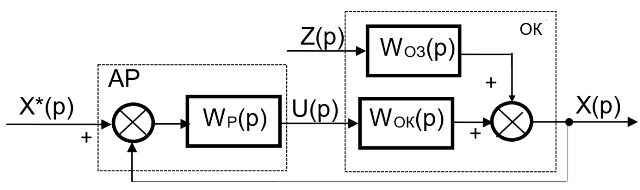
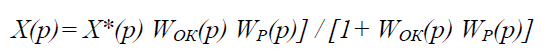
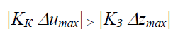
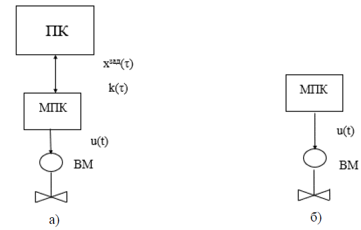
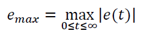
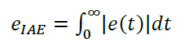
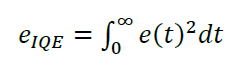
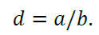
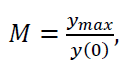
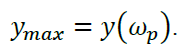

[<- До підрозділу](README.md)

# Одноконтурні системи автоматичного регулювання: теоретична частина

## Одноконтурні системи автоматичного регулювання

Визначимо вплив показників статичних і динамічних характеристик об'єкта за різними каналами на такі найважливіші показники якості процесу регулювання, як динамічна і статична помилки. Структура найпоширенішої одноконтурної замкнутої АСК (рис.1) включає в себе об'єкт керування (ОК) і автоматичний регулятор (АР). Як відомо з теорії автоматичного керування, для замкнутої системи стабілізації справедливим є таке співвідношення, що зв'язує відхилення регульованої змінної Х(р) зі зміною збурення

(1.1.)

 

Рис. 1. Структура одноконтурної замкнутої АСК

Для систем програмного регулювання і слідкування взаємозв'язок зміни $X(p)$ із зміною завдання $Х^*(p)$ має такий вигляд:

(1.2) 

де застосовані такі позначення: $X^*(p)$, $X(р)$ – зображення за Лапласом відповідно змін завдання і регульованої змінної; $U(p)$, $Z(р)$ – зображення за Лапласом відповідно змін керувальної дії і збурення; $W_{ОК}(р)$, $W_{ОЗ}(р)$ – передатні функції об'єкта за каналами керування й збурення.

Із співвідношень (1.1) і (1.2) видно, що менші відхилення $X$ будуть спостерігатися в об'єктах із меншими передатними функціями за каналами збурення і великими – за каналами керування.

У статиці ($р=0$) передатні функції вироджуються у відповідні коефіцієнти передачі. Для вибору каналу регулювальної дії визначають вплив вхідної дії за розміром коефіцієнта передачі об'єкта за каналом керування $K_К$ і діапазоном зміни керувальної дії $\Delta u_{mах}$. Домогтися необхідної якості регулювання в статиці можна, якщо вплив керувальної дії на регульовану змінну не буде меншим впливу найбільшого із збурень, тобто при виконанні умови:

 (1.3) 

де KЗ – коефіцієнт передачі за каналом збурення.

Якщо за допомогою замкнутої одноконтурної системи не забезпечується необхідна динамічна помилка, то застосовуються багатоконтурні АСК, найбільш поширеними серед яких є комбіновані. Вони використовуються у випадках, коли об’єкт має несприятлеві динамічні властивості за каналом збурення (найчастіше – основного) і є вимірювальні перетворювачі для його виміру.

Загальні положення.

Існують два режими реалізації керуючих функцій в системі керування: супервізорне (непряме) і безпосередне (пряме) керування. При супервізорному керуванні завдання  $х^{зад}(τ)$ або/та вектор параметрів налаштування локального регулятора $k(τ)$ змінюється зі SCADA/HMI (на рис.1.4 показаний як ПК) . При прямому керуванні МПК (ПЛК) безпосередньо керує виконавчим механізмом (ВМ), змінюючи сигнал u(τ) за алгоритмом. На рис. 1.4 ліва частина малюнка відповідає супервізорному керуванню, права частина – контролерному керуванню без вживання терміна безпосереднє (пряме) керування, тому що в обох випадках функції регулятора і станції керування виконує МПК.

Рис. 1.4. Супервізорне (а) та пряме (б) керування

ПІД-регулятор був винайдений ще в 1910 році; пізніше, в 1942 р., Зіглер і Нікольс розробили методику його налаштування. Після появи мікропроцесорів в 80-х роках розвиток ПІД-регуляторів відбувається наростаючими темпами.

ПІД-регулятор відноситься до найбільш поширеного типу регуляторів. Близько 90 ... 95 % регуляторів, що знаходяться в даний час в експлуатації, використовують ПІД алгоритм. Причиною такої високої популярності є простота побудови та промислового використання, ясність функціонування, придатність для вирішення більшості практичних завдань і низька вартість. Серед ПІД-регуляторів 64 % займають одноконтурні регулятори і 36 % – багатоконтурні. Контролери зі зворотним зв'язком охоплюють 85 % всіх додатків, контролери з прямим зв'язком – 6 %, контролери, з'єднані каскадно – 9 %.

ПІД-регулятор використовує пропорційно-інтегрально-диференціальний закон регулювання. ПІД-регулятор, втілений у вигляді технічного пристрою, називають ПІД-контролером. ПІД-контролер зазвичай має додаткові сервісні властивості	автоматичної	настройки,	сигналізації,	самодіагностики, програмування, безударного перемикання режимів, дистанційного управління, можливістю роботи в промисловій мережі і т д.

Після появи дешевих мікропроцесорів і аналого-цифрових перетворювачів в ПІД-регуляторах використовується автоматична настройка параметрів, адаптивні	алгоритми,	методи	нечіткої	логіки,	генетичні	алгоритми. Ускладнилися структури регуляторів: з'явилися регулятори з двома ступенями свободи (2DOF), із застосуванням принципів розімкненого управління в поєднанні зі зворотним зв'язком, з вбудованою моделлю процесу… Незважаючи на довгу історію розвитку і велику кількість публікацій, залишається багато проблем у питаннях усунення інтегрального насичення, при регулюванні в контурах з гістерезисом, нелінійними об'єктами і з транспортним запізнюванням; практичні реалізації ПІД-контролерів не завжди містять антіаліасні фільтри, гранична частота фільтра часто обрана неправильно, надмірний шум і зовнішні збурення ускладнюють настройку параметрів. Проблеми ускладнюються тим, що в сучасних системах управління динаміка часто невідома, регульовані процеси не можна вважати незалежними, вимірювання сильно зашумлені, навантаження непостійне, технологічні процеси безперервні.

Частина проблем виникає з причини складності експлуатації. У багатьох ПІД-контролерах диференціальна компонента вимкнена тільки тому, що її важко правильно налаштувати. Користувачі нехтують процедурою калібрування, недостатньо глибокі знання динаміки регульованого процесу не дозволяють правильно вибрати параметри регулятора. В результаті 30 % регуляторів, що використовуються в промисловості налаштовані неправильно. Тому основні зусилля дослідників у даний час зосереджені на пошук надійних методів автоматичної настройки регуляторів, як вбудованих в ПІД-контролер, так і функціонуючих на окремому комп'ютері.

## Якість регулювання

Перед тим, як розраховувати параметри регулятора, необхідно сформулювати мету і критерії якості регулювання, а також обмеження на величини і швидкості зміни змінних в системі керування. Традиційно основні якісні показники формулюються виходячи з вимог до форми реакції замкненої системи на ступеневу зміну уставки. Однак такий критерій дуже обмежений. Зокрема, він нічого не говорить про величину ослаблення шумів вимірювань або впливу зовнішніх збурень, може дати хибне уявлення про робастність системи.

Тому для повного опису або тестування системи з ПІД-регулятором потрібен ряд додаткових показників якості, про які йтиметься нижче.

У	загальному	випадку	вибір	показників	якості	не	може	бути формалізований повністю і повинен здійснюватися виходячи зі змісту розв'язуваної задачі. Для АСК з лінійними регуляторами як критерій використовують один із таких показників: час регулювання, динамічна похибка, інтегральні критерії якості, середня квадратична похибка. При оптимізації прагнуть їх мінімізувати. Обмеженням при цьому найчастіше виступає ступінь згасання перехідного процесу  або ступінь коливальності m. Оптимізація в інженерній практиці проводиться як аналітичними, так і експериментальними методами. Серед яких доволі поширеним є метод Циглера – Нікольса, призначений для визначення настройок регуляторів, що забезпечують мінімум інтегрального квадратичного критерію при ступені згасання не нижче 0,8.

Вибір критерію якості регулювання залежить від мети, для якої використовується регулятор. Такою метою може бути:

- підтримка постійного значення параметра (наприклад, температури) – задача стабілізації;

- стеження за зміною уставки – програмне управління; • управління демпфером в резервуарі з рідиною і т.д.

Для тієї чи іншої задачі найбільш важливими можуть бути такі чинники:

- форма відгуку на зовнішнє збурення (час перехідного процесу, перерегулювання, коефіцієнт затухання та ін.). Зворотний зв'язок послаблює вплив зовнішніх збурень. У часовій області реакцію на зовнішні збурення оцінюють по відгуку на одиничний стрибок d(t). Для ослаблення впливу зовнішніх збурень (зокрема, впливу навантаження) можна зменшити постійну інтегрування ПІД-регулятора 𝑇;
- форма відгуку на шуми вимірювань. Послабити вплив шумів вимірювань за допомогою зворотного зв'язку неможливо. Однак ці шуми легко усуваються
- форма відгуку на сигнал уставки;
- робастність по відношенню до розкиду параметрів об'єкта управління. Замкнута система залишається стійкою при зміні параметрів об'єкта на величину ∆𝑃(𝑠), якщо виконується умова робастності;
- вимоги до економії енергії в системі керування; 
- мінімум шумів вимірювань та ін.

Для класичного ПІД-регулятора параметри, які є найкращими для стеження за уставкою, в загальному випадку відрізняються від параметрів, найкращих для ослаблення впливу зовнішніх збурень. Для того, щоб обидва параметри одночасно були оптимальними, необхідно використовувати ПІД-регулятори з двома ступенями свободи або інші модифіковані структури ПІД-регулятора.

Наприклад, точне стеження за зміною уставки необхідне в системах управління рухом, у робототехніці. У системах управління технологічними процесами, де уставка зазвичай залишається тривалий час без змін, потрібно максимальне ослаблення впливу навантаження (зовнішніх збурень). У системах управління резервуарами з рідиною потрібне забезпечення ламінарності потоку (мінімізація дисперсії вихідної змінної регулятора).

Критерії якості в часовій області. Для оцінки якості регулювання в замкненій системі з ПІД-регулятором зазвичай використовують ступеневий вхідний вплив і ряд критеріїв для опису форми перехідного процесу (рис. 1.5):

- мінімізація максимальної помилки регулювання (мінімум динамічної похибки):

(1.4)

і фіксований момент часу 𝑇𝑎𝑥, при якому помилка досягає цього максимуму;

Рис. 1.5. Критерії якості регулювання в часовій області

- мінімізація інтегральної абсолютної помилки регулювання:

(1.5) 

- мінімізація інтегрально-квадратичної помилки регулювання:

(1.6) 

- декремент загасання d – відношення першого максимуму до другого (типове значення d=4 і більше):

(1.7) 

Відзначимо, що в літературі зустрічаються й інші визначення декремента загасання, зокрема, як 𝑏/𝑎– ступінь затухання, або як коефіцієнт в показнику ступеня експоненти, що описує огинаючу затухаючих коливань;

- статична помилка 𝑒0    – постійна помилка в рівноважному (сталому, статичному) режимі системи;

- час перехідного процесу tes з заданою похибкою es (час, після закінчення якого похибка регулювання не перевищує заданого значення es). Зазвичай es=1%, рідше – 2% або 5%. Відповідно, час перехідного процесу позначають t0.01, t0.02, t0.05;

- перерегулювання – перевищення першого викиду над заданим значенням змінної. Зазвичай виражається у відсотках від заданого значення;

Величина перерегулювання залежить від виду відпрацьованого сигналу. При відпрацюванні ступеневої впливу за сигналом завдання величина перерегулювання визначається як різниця між першим (максимальним) викидом  і заданим (встановленим) значенням регульованої величини поділеним на задане значення, виражається у відсотках. При відпрацюванні збурюючого впливу, величина перерегулювання визначається зі співвідношення першого викиду до другого виражене у відсотках.

- час наростання Tr – інтервал часу, протягом якого вихідна змінна наростає від 10 % до 90 % від свого усталеного значення;

- період згасаючих коливань Tp. Хоча, затухаючі коливання не є періодичними, але для коливальних перехідних процесів період розуміється як відстань між двома сусідніми максимумами перехідної характеристики.

Для систем управління рухомими об’єктами як тестовий сигнал частіше використовують не функцію стрибка, а лінійно наростаючий сигнал, оскільки електромеханічні системи зазвичай мають обмежену швидкість наростання вихідної величини.

Наведені вище критерії використовуються як для оцінки якості реакції на зміну уставки, так і на вплив зовнішніх збурень і шумів вимірювань.

Частотні критерії якості. У частотної області зазвичай використовуються наступні	критерії,	що	одержуються	з	графіка	амплітудно-частотної характеристики замкненої системи (рис. 1.6):

- смуга пропускання ω-3Бд або ω0,7 за рівнем -3 дБ або за рівнем 1/√2= 0,7 – смуга частот від 0 до 𝜔−3дБ=𝜔0,7, в межах якої крива АЧХ знижується не більше ніж на 3 дБ;

- коливальність – відношення максимального (пікового) значення АЧХ ymax до його значення на нульовій частоті y(0), тобто в усталеному режимі:

(1.8)

Рис. 1.6. Критерії якості регулювання в частотній області  типовими значеннями є M = 1,5 ... 1,6;

- резонансна частота системи 𝜔𝑝– частота,на якій АЧХ досягає максимуму:

 (1.9) 

Частотні критерії у реальних регуляторів не можуть бути однозначно пов'язані з часовими критеріями через нелінійності (зазвичай це нелінійності типу обмежень) і алгоритмів усунення ефекту інтегрального насичення. Однак наближено можна встановити наступні залежності між критеріями в частотній і часовій області:

- частота максимуму передавальної характеристики замкнутої системи приблизно відповідає періоду згасаючих коливань відгуку на ступеневий вхідний вплив: 𝜔з≈2𝜋/𝑇 ;

- чим повільніше загасаютьколивання, там більший показник коливальності M.

Ця лекція не завершена, потребує доопрацювання. 

Теоретичне заняття розроблено за матеріалами від [Наталя Луцька, Натля Заєць, Надія Гриценко](https://www.iasu-nuft.pp.ua/staff). 
