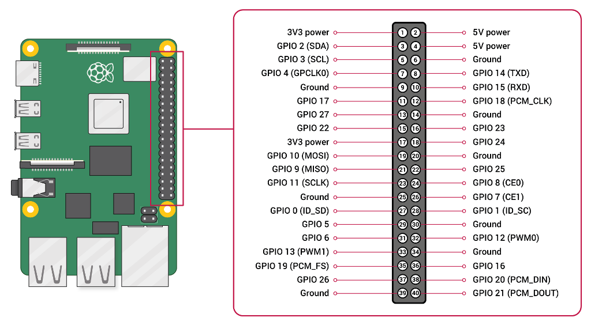
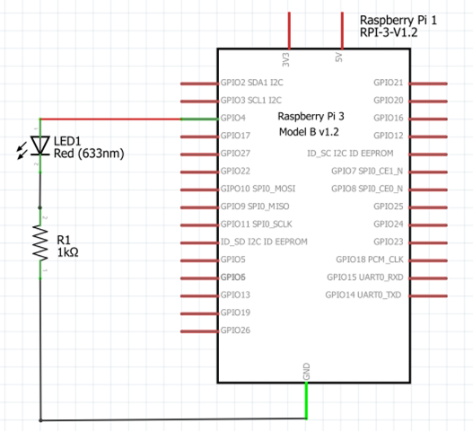
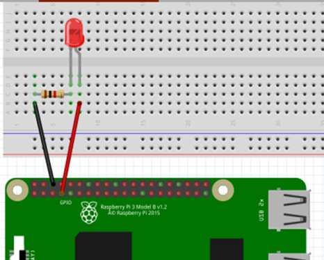
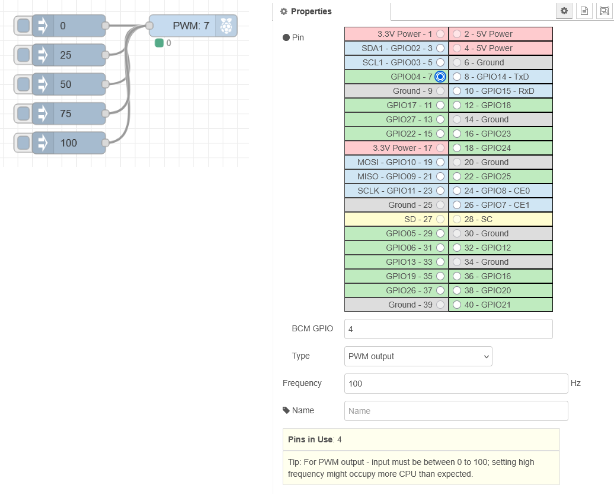

[<- До підрозділу](README.md)		[Коментувати](#feedback)

# Raspberry PI GPIO: практична частина

**Тривалість**: 2 акад. години.

**Мета:** Навчитися створювати проекти та налаштовувати Raspberry PI для роботи в системах IoT. 

**Лабораторна установка**

- Апаратне забезпечення (див.таб.1): ПК, Raspberry PI, датчики, монтажна плата, з'єднувачі
- Програмне забезпечення: Node-RED, PuTTY 

Таблиця 1. Перелік апаратних засобів, необхідних для лабораторної роботи. 

| Найменування                  | Кількість | Примітка                                        |
| ----------------------------- | --------- | ----------------------------------------------- |
| Raspberry PI                  | 1         | У комплекті з блоком живлення та картою пам'яті |
| Макетна плата 170             | 1         | або аналогічна                                  |
| Світлодіод                    | 1         | Пряма напруга: 2 - 2,2 В<br/>Прямий струм: 20мА |
| Резистор 1 кОм                | 1         |                                                 |
| Провід dupont (розетка-вилка) | 6         | бажано 2 чорні, червоний, зелений і білий       |

## Порядок виконання роботи 

### Пререквізити

Для виконання цього практичного заняття, Ви повинні підготовити комплект Raspberry PI, як це описано в [Встановлення ОС та налаштування Raspberry PI: практична частина](../rpiinstall/lab.md)

### 1. Аналіз схеми підключення

- [ ] Пригадайте матеріали з лекції [Raspberry PI GPIO: теоретична частина](teor.md)
- [ ] Ознайомтеся з призначенням контактів GPIO відповідного роз'єма  Raspberry PI 5, як показано на рис.1. Зверніть увагу на реальне розміщення їх на корпусі вашого комплекту Raspberry PI.  



рис.1. Призначення контактів GPIO для Raspberry PI 5

- [ ] Ознайомтеся зі схемою підключення показані на рис.2. Використовуючи карту призначення контактів (рис.1) та матеріали лекції дізнайтеся та запишіть у звіт:
  - чому необхідно ставити резистор R1?
  - поясніть чому саме так підключається світлодіод, чи можна змінити полярність?
  - розрахуйте струм який буде в колі за такого опору     
  - які контакти Raspberry PI необхідно використати щоб:
    - підключити свтілодіод LED1, чи може бути кілька варіантів такого підключення? 
    - підключити резистор R1, чи може бути кілька варіантів такого підключення?
  - які недоліки такого підключення і який варіант забезпечити необхідну силу струму (20 мА) через світлодіод    



рис.2. Принципова електрична схема підключення

### 2. Збирання схеми

- [ ] Вимкніть Raspberry PI, якщо він включений.
- [ ] Попросіть у викладача необхідні елементи, та підключіть їх, відповідно до розробленої схеми (рис.3). 



рис.3. Підключення світлодіода до RPI 3  

- [ ] Уважно перевірте підключення.

 

рис.4. Підключення світлодіода до RPI 3 (альтернативний вигляд)

- [ ] Покличте викладача, щоб він перевірив схему. Якщо схема перевірена, за дозволу викладача перейдіть до виконання наступного пункту. 

### 3. Увімкнення та перевірка

- [ ] Увімкніть RPI.
- [ ] Використовуючи SSH (наприклад через PuTTy) підключіться до Raspberry PI
- [ ] Використовуючи утиліту `pinctrl` перевірте роботу схеми, як це описано в лекції [Raspberry PI GPIO: теоретична частина](teor.md)   

### 4. Встановлення Node-RED

Даний пункт треба виконувати, якщо на Raspberry PI не встановлено Node-RED

- [ ] Запустіть скрипт для автоматизованого встановлення всього що не обхідно для Node-RED:

```
bash <(curl -sL https://raw.githubusercontent.com/node-red/linux-installers/master/deb/update-nodejs-and-nodered)
```

На питання помічника обирайте все за замовченням, окрім паролю для доступу, в якому виберіть режим без паролю. 

- [ ] Для того щоб Node-RED запускався, коли RPI включається або  перезавантажується, треба включити службу до автоматичної запуску, виконавши команду:

```
sudo systemctl enable nodered.service
```

### 5. Створення та перевірка програми керування вкл/відкл для Node-RED

- [ ] Відкрийте браузер на Вашому ПК.
- [ ] У браузері зайдіть на сторінку програмування Node-RED на RPI, для цього впишіть IP адресу або ім'я та порт 1880

```
http://ip_addr:1880
```

- [ ] Створіть програму для керування світлодіодом.


рис.5. Фрагмент застосунку для роботи з входами/виходами GPIO

- [ ] Перевірте роботу програми  натискаючи `Inject TRUE` а потім `Inject FALSE`

### 6. Керування яскравістю з Node-RED

- [ ] Реалізуйте та перевірте роботу програми керування яскравістю світлодіоду за допомогою PWM



рис.6. Фрагмент застосунку для роботи з GPIO в режимі PWM

## Питання до захисту

1. Що таке GPIO?
2. Як підключатися до роз’єму GPIO у Raspberry Pi?
3. Розкажіть про стандартну роботу каналів GPIO. 
4. Які спеціальні функції на роз’ємі GPIO є у Raspberry Pi?
5. Яке живлення є на GPIO є у Raspberry Pi? Які обмеження його використання?
6. Розкажіть про роботу GPIO в режимі виходу.
7. Яким чином відбувається керування силою виходу GPIO?
8. Як працює GPIO в режимі входу?
9. Розкажіть про призначення підтягувальних резисторів.
10. Які способи доступні для програмного керування GPIO Raspberry Pi?
11. На прикладі керування світлодіодом прокоментуйте схеми підключення та способи керування.
12. Яким способом можна керувати елементами в електричних кіл, що мають зовнішнє живлення?
13. Розкажіть про способи використання реле разом з GPIO в Raspberry Pi?
14. Навіщо в лабораторній роботі використовувалася утиліта pinctrl?
15. Які вузли в Node-RED використовуються для роботи з GPIO?
16. Що таке PWM? Для чого використовувався PWM в даній лабораторній роботі? 

 

## Джерела

1. 


## Автори


Практичне заняття розробив  [Олександр Пупена](https://github.com/pupenasan). 

## Feedback

Якщо Ви хочете залишити коментар у Вас є наступні варіанти:

- [Обговорення у WhatsApp](https://chat.whatsapp.com/BRbPAQrE1s7BwCLtNtMoqN)
- [Обговорення в Телеграм](https://t.me/+GA2smCKs5QU1MWMy)
- [Група у Фейсбуці](https://www.facebook.com/groups/asu.in.ua)

Про проект і можливість допомогти проекту написано [тут](https://asu-in-ua.github.io/atpv/)
