[<- До підрозділу](README.md)		[Коментувати](#feedback)

# Взаємодія з входами та виходами Raspberry Pi 

Це частковий переклад розділу 6 "Interfacing to the Raspberry Pi Input/Outputs" з посібника [Molloy, Derek. *Exploring Raspberry Pi: Interfacing to the Real World*. Chichester: Wiley, 2016](http://www.exploringrpi.com)

Також в посібнику є переклад [розділу 4 Узгодження електроніки в Raspberry Pi ](../../electronproto/interfacingelectronics/molloy.md) 

Цей розділ поєднує напрацювання з Linux, програмування та електроніки з попередніх розділів і показує, як будувати електричні кола та писати програми, що взаємодіють з однопровідними входами та виходами Raspberry Pi. У цьому розділі наведено практичні приклади, які пояснюють використання входів/виходів загального призначення (GPIO) для підключення різних типів електронних кіл.

Робота з GPIO спочатку виконується через sysfs, щоб сформувати навички, які можна перенести на інші вбудовані Linux-пристрої. Далі розглядаються підходи з використанням відображення памʼяті, які забезпечують високу продуктивність, але значною мірою є специфічними для платформи Raspberry Pi. Після цього детально розглядається бібліотека C-функцій wiringPi. Вона використовує як sysfs, так і підходи з відображенням памʼяті для створення спеціалізованої бібліотеки взаємодії з GPIO для платформи Raspberry Pi, яка є зручною у використанні. Наведено приклади застосування цієї бібліотеки для обміну даними з однопровідними датчиками, генерації сигналів із широтно-імпульсною модуляцією (PWM) та формування високочастотних часових сигналів. Наприкінці подано коротке обговорення впливу правил udev і механізмів дозволів Linux на роботу з GPIO.

Обладнання, необхідне для цього розділу:

- Raspberry Pi (бажано RPi 2 або RPi 3 для прикладів із використанням багатоядерності)
- Компоненти з розділу 4 (наприклад, кнопка, світлодіод, оптопара)
- Датчик вологості та температури Aosong AM230x
- Типовий сервопривід (наприклад, Hitec HS-422)

Додаткові матеріали до цього розділу доступні за адресою:
[www.exploringrpi.com/chapter6/](http://www.exploringrpi.com/chapter6/)

## Вступ

На цьому етапі книги ви вже ознайомилися з адмініструванням Linux-системи, написанням програм високого рівня та побудовою базових, але реалістичних, схем електронної взаємодії. Тепер настав час поєднати ці різні поняття, щоб ви могли створювати програмні застосунки, які працюють під керуванням Linux і керують електронними схемами власної розробки або зчитують з них вхідні сигнали.

Електронні схеми та модулі можна підключати до Raspberry Pi кількома різними способами. Наприклад:

- використання GPIO на роз’ємi GPIO Raspberry Pi. Цей підхід забезпечує високу гнучкість щодо типів схем, які можна підключати, і саме йому присвячено цей розділ;
- використання шин (наприклад, I2C, SPI) або UART на роз’ємi GPIO. Шинні з’єднання дають змогу організовувати обмін даними зі складними модулями, такими як датчики та дисплеї. Ця тема розглядається в розділі 8;
- підключення USB-модулів (наприклад, клавіатур, Wi-Fi-адаптерів). За наявності драйверів Linux до Raspberry Pi можна підключати багато різних типів електронних пристроїв. Приклади такого використання наведено в наступних розділах;
- обмін даними через Ethernet, Wi-Fi або Bluetooth з електронними модулями. Можна будувати мережеві датчики, які взаємодіють з Raspberry Pi через мережеві з’єднання. Вперше ця тема вводиться в розділі 12, а детально розглядається в розділі 13.

Наступним кроком у роботі з Raspberry Pi є підключення його до електронних схем за допомогою розширювального роз’єму GPIO. Матеріал попередніх розділів є дуже важливим, оскільки це напрочуд складна тема, до якої потрібно певний час звикнути, особливо в частині, що стосується відображення введення/виведення в пам’ять. Водночас упродовж цього розділу наведено програмний код і приклади схем, які можна використовувати як основу для побудови власних інтерфейсних рішень.

На рисунку 6-1 подано перше уявлення про функціональні можливості входів і виходів на роз’ємi GPIO. Багато з цих контактів є мультиплексованими, тобто мають більше функцій (або альтернативних режимів, ALT), ніж показано на рисунку. На цьому рисунку проілюстровано найбільш уживані функціональні можливості.

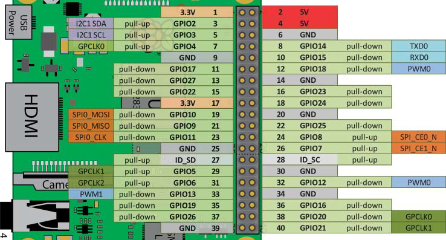

Рисунок 6-1: роз’єм GPIO Raspberry Pi (RPi 2/3)

## Входи та виходи загального призначення

У цьому розділі описано, як виконувати взаємодію з контактами роз’єму GPIO Raspberry Pi такими способами:

- дискретний вихід (Digital output). Показано, як використовувати GPIO для вмикання або вимикання електричного кола. У прикладі використовується світлодіод, однак наведені принципи є справедливими для будь-якого типу кола; наприклад, можна використати реле для керування потужними навантаженнями. Наведено схеми, які забезпечують, щоб через GPIO не протікав надмірний струм. Розроблено приклади програмного коду, що роблять програмну взаємодію простою та ефективною;

- дискретний вхід. Показано, як зчитувати дискретний сигнал з електричного кола у програмний застосунок, що працює під керуванням Linux. Наведено схеми, які забезпечують безпечне виконання цього процесу;

- аналоговий вихід. Показано, як використовувати широтно-імпульсну модуляцію (PWM) для формування пропорційного сигналу, який може застосовуватися як еквівалент аналогового рівня напруги або як керуючий сигнал для певних типів пристроїв, наприклад сервоприводів;

- аналоговий вхід. Raspberry Pi не має вбудованого аналого-цифрового перетворювача (ADC). Однак цю можливість можна додати за допомогою недорогих пристроїв, підключених через шини, як описано в розділі 9.

У цьому розділі передбачається, що ви ознайомилися з [розділом 4](../../electronproto/interfacingelectronics/molloy.md) , зокрема з темами комутації електричних кіл із використанням FET і BJT та застосування підтягувальних резисторів pull-up і pull-down.

Попередження. Будьте особливо обережні під час роботи з роз’ємом GPIO, оскільки неправильні підключення можуть і призводять до пошкодження плати. Перед підключенням до роз’єму GPIO перевіряйте всі нові схеми, щоб переконатися, що рівні напруги та струму перебувають у допустимих межах. Також дотримуйтеся рекомендацій щодо підключення схем із використанням FET і оптопар, наведених у цьому розділі. Додаткові поради щодо взаємодії зі схемами, які використовують інші логічні рівні напруги, подано в розділі 8.

### Дискретний вихід GPIO

Приклад конфігурації виходу, показаний на рисунку 6-2(a), використовує GPIO, підключений до FET, для комутації електричного кола. Як було описано в розділі 4, під час подачі напруги на затвор FET відбувається замикання віртуального «перемикача» між стоком і витоком, унаслідок чого струм починає протікати від джерела 5 В через обмежувальний резистор 220 Ω до GND через світлодіод. Це коло відрізняється від схеми на рисунку 5-1(a), оскільки тут замість джерела 3,3 В використовується джерело 5 В, щоб проілюструвати комутаційні можливості такої конфігурації. На рисунку 6-2(b) показано еквівалентну схему на біполярному транзисторі (BJT). Зверніть увагу, що в обох схемах використовується резистор обмеження струму більшого номіналу (220 Ω замість 120 Ω) для захисту світлодіода.


Рисунок 6-2: схема світлодіода на 5 В: (a) з використанням FET, (b) з використанням BJT

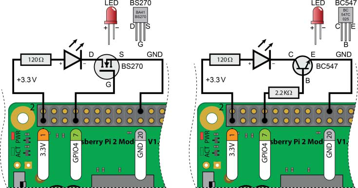

Рисунок 5-1: (a) керування світлодіодом від GPIO з використанням FET, (b) керування світлодіодом від GPIO з використанням NPN-транзистора

Перевагою таких схем є можливість їх застосування в багатьох задачах дискретного керування, оскільки з технічного опису FET BS270 випливає, що він може керувати постійним струмом до 400 мА (та імпульсним струмом до 2 А) між стоком і витоком при напрузі до 60 В. Однак при напрузі затвор–витік 3,3 В BS270 здатний комутувати максимальний струм стоку приблизно 130 мА. Високий вхідний опір затвора означає, що можна використовувати два (або більше) транзистори BS270, з’єднані паралельно, щоб збільшити максимальний струм приблизно до 260 мА при тій самій напрузі на затворі. Аналогічно, транзистор BC547 може забезпечувати струм колектора $I_C$ до 100 мА при напрузі колектор–емітер $V_{CE}$ менш ніж 45 В (загальна розсіювана потужність $P \approx V_{CE} \times I_C$ також повинна бути меншою за 500 мВт; тобто при $V_{CE} = 10\ \text{В}$ струм $I_C \le 50\ \text{мА}$).

Максимальний струм також обмежується у випадку, якщо живлення береться безпосередньо з роз’єму GPIO Raspberry Pi. Контакти живлення 3,3 В (1 і 17) разом можуть забезпечити максимальний струм близько 50 мА. Контакти живлення 5 В (2 і 4) разом можуть безпечно забезпечити приблизно 200–300 мА. Для більших струмів необхідне зовнішнє джерело живлення, однак у цьому випадку слід бути особливо обережним, щоб схема не подавала живлення на GPIO-контакти, коли Raspberry Pi вимкнена.

GPIO Raspberry Pi є толерантними до рівня 3,3 В, і з кожного контакту слід джерелити або приймати приблизно 2–3 мА. Кожен контакт здатний працювати з дещо більшими струмами, якщо використання GPIO є обмеженим, але на таку залежність краще не розраховувати. На рисунку 6-2 використання живлення 5 В для керування світлодіодом є безпечним, оскільки коло між стоком і витоком FET ніколи не з’єднується із затвором.

Також можна помітити, що, на відміну від прикладу в розділі 4, у цій схемі відсутній резистор на затворі FET. У цьому конкретному випадку він не є необхідним, оскільки для цього контакту Raspberry Pi за замовчуванням увімкнено внутрішній підтягувальний резистор pull-down. Це буде розглянуто далі.

Після побудови схеми та підключення її до Raspberry Pi можна завантажити плату і керувати світлодіодом за допомогою термінала Linux та механізму sysfs, як це описано в розділі 5. На рисунку 6-3 показано фактичні значення напруг і струмів, що мають місце в обох схемах.

Можна побачити, що у схемі з FET на рисунку 6-3(a) струм, який джерелиться з GPIO17, є практично знехтовно малим, а напруга на затворі прикладається між затвором і витоком транзистора. На рисунку 6-3(b) резистор 2,2 кΩ формує невеликий струм у базі транзистора, який визначається як
$$
I_B = \frac{3.3\ \text{В} - 0.77\ \text{В}}{2.2\ \text{кΩ}}
$$
Цей струм вмикає транзистор, унаслідок чого світлодіод засвічується. Значення струму 1,15 мА цілком перебуває в допустимих межах для GPIO Raspberry Pi.


Рисунок 6-3: вольт-амперні характеристики схем на рисунку 6-2: (a) з використанням FET, (b) з використанням BJT

Для перевірки продуктивності цього підходу в лістингу 6-1 наведено короткий bash-скрипт оболонки, який перемикає світлодіод з максимально можливою швидкістю. У результаті не виникає видимого «миготіння», оскільки світлодіод перемикається швидше, ніж це може зафіксувати людське око; однак процес перемикання можна візуалізувати за допомогою осцилоскопа.

Лістинг 6-1: `/chp06/flash_script/flash.sh`

```bash
#!/bin/bash
# Short script to toggle a GPIO pin at the highest frequency possible
echo 17 > /sys/class/gpio/export
sleep 0.5
echo "out" > /sys/class/gpio/gpio17/direction
COUNTER=0
while [ $COUNTER -lt 100000 ]; do
echo 1 > /sys/class/gpio/gpio17/value
let COUNTER=COUNTER+1
echo 0 > /sys/class/gpio/gpio17/value
done
echo 17 > /sys/class/gpio/unexport
```

З осцилограм на рисунку 6-4 видно, що вихідний сигнал перемикається приблизно кожні 0,36 мс, що відповідає частоті близько 2,78 кГц. Для вбудованого контролера це не є високою частотою. Період сигналу є достатньо стабільним, що значною мірою пояснюється використанням у цьому ядрі Linux механізмів витіснення ядра, про які йтиметься далі в цьому розділі. Окрім цього, команда `top` (запущена в іншому вікні термінала Linux) показує, що виконання цього скрипту створює навантаження 100% на одне ядро процесора (на RPi 2/3 виконайте `top` і натисніть `1`, щоб побачити завантаження окремих ядер).

Також можна побачити, що струм, який керує світлодіодом, становить 12–13 мА. Це значення є достатньо великим, щоб пошкодити Raspberry Pi, якщо такий струм одночасно джерелився або приймався кількома GPIO-контактами.

У наступному підрозділі представлено клас C++, який можна використовувати для керування GPIO через sysfs. Він забезпечує вищі частоти перемикання, але зі схожим навантаженням на CPU. Якщо потрібен періодичний сигнал з високою частотою, можна використовувати PWM або тактові сигнали загального призначення, які розглядаються далі в цьому розділі. PWM дає змогу досягати частот $1\ \text{МГц}$ і вище без суттєвого навантаження на CPU. Водночас багато застосувань потребують активації комутованих схем на низьких частотах (наприклад, керування двигунами або системи розумного дому), і в таких випадках така конфігурація є цілком прийнятною.

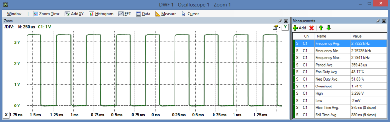

Рисунок 6-4: осцилограмa вихідного сигналу GPIO, сформованого скриптом `flash.sh`

### Дискретний вхід GPIO

Наступним застосуванням є використання GPIO як дискретного входу, що дає змогу програмному забезпеченню, яке виконується на Raspberry Pi, зчитувати стан кнопки або будь-якого іншого логічного входу з рівнями high/low. Спочатку це завдання виконується за допомогою термінала Linux, а потім реалізується з використанням коду на C/C++. Під час побудови цієї вхідної схеми світлодіодну схему слід залишити підключеною, оскільки обидві схеми використовуються повторно протягом усього цього розділу.

Схема, показана на рисунку 6-5(a), складається з нормально розімкненої кнопки (SPST), яка підключена до контакту 13 Raspberry Pi (GPIO27). Можна помітити, що, незважаючи на обговорення необхідності використання підтягувальних резисторів pull-up або pull-down для кнопок у розділі 4, у цій схемі вони відсутні. Це зроблено навмисно, оскільки контакт 13 роз’єму GPIO за замовчуванням з’єднаний із GND через внутрішній підтягувальний резистор pull-down. Це буде розглянуто далі.


Рисунок 6-5: підключення кнопки до Raspberry Pi: (a) з використанням внутрішнього підтягувального резистора pull-down, (b) з використанням внутрішнього підтягувального резистора pull-up

Використайте такі кроки, щоб зчитати стан кнопки (тобто 0 або 1) за допомогою термінала Linux:

```bash
pi@erpi /sys/class/gpio $ echo 27 > export
pi@erpi /sys/class/gpio $ cd gpio27
pi@erpi /sys/class/gpio/gpio27 $ ls
active_low device direction edge subsystem uevent value
pi@erpi /sys/class/gpio/gpio27 $ echo in > direction
pi@erpi /sys/class/gpio/gpio27 $ cat direction
in
pi@erpi /sys/class/gpio/gpio27 $ cat value
0
pi@erpi /sys/class/gpio/gpio27 $ cat value
1
```

Отже, значення дорівнює 1, коли кнопка натиснута, і 0, коли вона відпущена. Контакт GPIO27 приймає приблизно 64 мкА струму під час натискання кнопки. Кожного разу, коли ви вводите команду `cat value`, виконується опитування входу з метою перевірки його стану. Недоліком такого підходу є те, що зміна стану входу не буде виявлена, якщо значення не опитувати постійно.

Цікаво, що якщо не підключати нічого до GPIO4, який відповідає контакту 7, і виконати ту саму послідовність команд, буде отримано інший результат:

```bash
pi@erpi /sys/class/gpio $ echo 4 > export
pi@erpi /sys/class/gpio $ cd gpio4/
pi@erpi /sys/class/gpio/gpio4 $ cat direction
out
pi@erpi /sys/class/gpio/gpio4 $ echo in > direction
pi@erpi /sys/class/gpio/gpio4 $ cat value
1
pi@erpi /sys/class/gpio/gpio4 $ cat value
0
```

Якщо до цього входу нічого не підключено, він реєструє значення 1. Це пояснюється тим, що даний вхід підключений через внутрішній підтягувальний резистор pull-up до лінії 3,3 В. На рисунку 6-5(b) показано правильну схему підключення кнопки для такого GPIO.

Зверніть увагу, що цей GPIO-вхід має протилежну полярність порівняно зі схемою на рисунку 6-5(a): GPIO4 перебуває в низькому рівні, коли кнопка натиснута, тоді як GPIO27 має високий рівень при натисканні кнопки. На цьому етапі має бути очевидно, що для коректного використання GPIO-контактів необхідно розуміти їх конфігурацію, зокрема наявність і роль внутрішніх підтягувальних резисторів.

### Внутрішні підтягувальні резистори pull-up і pull-down

Важливість підтягувальних резисторів pull-up і pull-down детально розглядається в розділі 4. Вони забезпечують, щоб розімкнені перемикачі не призводили до «плаваючого» стану входу GPIO. Такі зовнішні резистори зазвичай є «сильними» підтягувальними резисторами, тобто жорстко фіксують вхід у високому або низькому рівні за рахунок відносно малих значень опору (наприклад, 5 кΩ–10 кΩ). Raspberry Pi має «слабкі» внутрішні підтягувальні резистори pull-up і pull-down, які можна налаштовувати за допомогою методів керування GPIO на основі роботи з пам’яттю, що розглядаються далі в цьому розділі.

Можна експериментально перевірити, чи увімкнений на певному контакті внутрішній pull-up або pull-down резистор, підключивши резистор 100 кΩ між цим контактом і GND (як показано на рисунку 6-6(a), де заштрихована область відповідає функціональності, що є внутрішньою для SoC Raspberry Pi), а потім між цим самим контактом і шиною 3,3 В (як показано на рисунку 6-6(b)). Якщо підключити резистор 100 кΩ (у використаному автором випадку його реальне значення становило 98,5 кΩ) до контакту 16 і виміряти напругу на ньому, можна побачити, що падіння напруги дорівнює 0 В, коли резистор підключений до GND, і приблизно 2,226 В (а не 3,3 В), коли він підключений до шини 3,3 В. Це свідчить про те, що увімкнено внутрішній підтягувальний резистор pull-down, а комбінація резисторів поводиться як подільник напруги. Значення внутрішнього pull-down резистора можна оцінити, як показано на рисунку 6-6(b).

Очевидно, що для контакту 16, який відповідає GPIO23, увімкнено внутрішній підтягувальний резистор pull-down. Проте якщо виконати той самий експеримент для контакту 7, який відповідає GPIO4, буде отримано зовсім інший результат. При підключенні резистора, як показано на рисунку 6-6(a), на резисторі 100 кΩ спостерігатиметься падіння напруги близько 2,213 В, а при підключенні за схемою рисунка 6-6(b) напруга буде майже 0 В. Це означає, що для контакту 7 увімкнено внутрішній підтягувальний резистор pull-up. Виконання аналогічних розрахунків дає значення внутрішнього pull-up резистора приблизно 48,6 кΩ.


Рисунок 6-6: визначення значення внутрішнього підтягувального резистора pull-down із використанням резистора 100 кΩ, підключеного (a) між GPIO-контактом і GND, та (b) між GPIO-контактом і шиною 3,3 В

Поведінку ваших вхідних і вихідних схем необхідно аналізувати з урахуванням цих значень резисторів, а також мати можливість змінювати конфігурацію внутрішніх резисторів у певних випадках. Наприклад, для деяких схем може виникнути потреба повністю вимкнути внутрішні підтягувальні резистори. Також слід зазначити, що контакти 3 (GPIO2) і 5 (GPIO3) мають два постійно підключені на платі «сильні» підтягувальні резистори pull-up номіналом 1,8 кΩ (R23 і R24). Це питання розглядається в розділі 8.

Окрім налаштування контактів на використання pull-up або pull-down конфігурації, для кожного контакту існують також різні режими роботи. Вони називаються альтернативними режимами (ALT) контакту. Далі в цьому розділі, на рисунку 6-11, наведено повний перелік альтернативних режимів для кожного контакту роз’єму GPIO.

### Взаємодія з живленими DC-колами

Сама Raspberry Pi забезпечує живлення, необхідне для вихідних і вхідних схем, показаних відповідно на рисунках 6-2 і 6-5. Струм, який можуть джерелити або приймати ці схеми, обмежується характеристиками Raspberry Pi. Тому часто виникає потреба у взаємодії зі схемами, що живляться від зовнішнього джерела.

Під час підключення Raspberry Pi до схем із власним джерелом живлення (наприклад, потужні світлодіоди, автомобільні сигналізації, приводи гаражних воріт) слід бути особливо обережним. Зокрема, схема повинна бути спроєктована так, щоб вона не намагалася джерелити струм з GPIO або приймати струм у GPIO-контакти Raspberry Pi в той момент, коли плата вимкнена. Крім того, бажано уникати спільного з’єднання GND між зовнішньою схемою і Raspberry Pi на випадок несправності самої схеми або її джерела живлення.

Хорошим рішенням є використання недорогих оптопар, таких як описані в розділі 4, для побудови схем, у яких між Raspberry Pi та зовнішньо живленим колом відсутній будь-який електричний зв’язок. На рисунку 6-7 показано вихідну схему з NPN-транзистором, увімкненим у конфігурації дарлінгтонівської пари з оптопарою для вмикання або вимикання навантаження, що живиться від зовнішнього джерела.

У цьому прикладі використовується зовнішнє джерело живлення 5 В, однак може застосовуватися і вища напруга постійного струму. Максимальний комутований струм у такій схемі обмежується характеристиками транзистора (наприклад, BC547), а не рівнем вихідного струму $I_C$ оптопари.


Рисунок 6-7: вихідна схема з оптопарою

Коефіцієнт передачі струму (CTR) оптопари 617A, який становить приблизно 0,5 при $I_f = 1\ \text{мА}$ (тобто коли GPIO17 перебуває у високому рівні), призводить до формування вихідного струму $I_C = 0{,}5\ \text{мА}$, який подається на базу транзистора BC547. Цей невеликий струм вмикає транзистор BC547, який, у свою чергу, забезпечує струм $I_L = 40\ \text{мА}$ для резистивного навантаження в цьому прикладі. Одним із недоліків такої конфігурації є те, що напруга живлення навантаження зменшується на величину $V_{CE}$ дарлінгтонівської пари (приблизно $1\ \text{В}$). Альтернативою цьому рішенню є використання пари Шіклаї, як показано на рисунку 6-7, у якій до виходу оптопари підключається PNP-транзистор. Обидві конфігурації обмежують максимальну частоту перемикання вихідного кола, як правило, до десятків кілогерц.

На відміну від 617A, оптопара 4N25 має виведений базовий контакт фототранзистора. Це дає змогу додатково встановлювати резистори між базою та емітером для покращення частотної характеристики кола.

Оптопару також можна підключити до GPIO для приймання сигналу від зовнішньо живленого DC-кола, як показано на рисунку 6-8. Важливо, що таку схему можна адаптувати для будь-якої напруги живлення постійного струму, і вона не буде приймати струм у GPIO-вхід, коли Raspberry Pi вимкнена. Для вхідної частини оптопари необхідно вибрати значення резистора, яке обмежує прямий струм світлодіода, так щоб $I_f(\text{max}) < 60\ \text{мА}$ для оптопар 617A або 4N25.

GPIO27 за замовчуванням налаштований з внутрішнім підтягувальним резистором pull-down, тому має низький рівень, коли кнопка не натиснута. Вхідне коло GPIO Raspberry Pi на рисунку 6-5(a) приймає струм 64 мкА з GPIO27 при натисканні кнопки. Аналогічно, це є максимальний струм, який прийматиметься цим колом (коли $I_f$ і $V_f$ перевищують мінімальні значення, необхідні для роботи оптопари). Цю схему можна адаптувати для роботи зі змінною напругою DC (у певному діапазоні), використовуючи стабілізатор напруги для підтримання такого значення $I_f$, яке не перевищує $I_f(\text{max})$ для вибраної оптопари.


Рисунок 6-8: вхідна схема з оптопарою

## C++ Control of GPIOs Using sysfs

Не перекладено, бо не релевантно потребам.

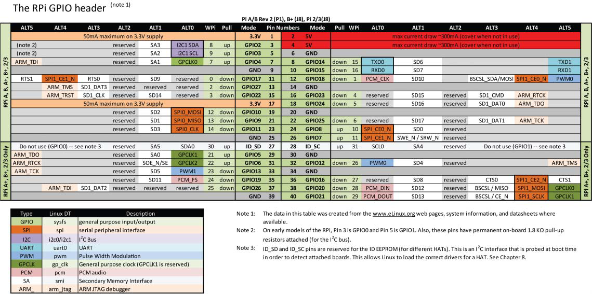

Figure 6-11: The RPi GPIO header

## Memory-Based GPIO Control

Не перекладено, бо не релевантно потребам.

## WiringPi

WiringPi ([www.wiringpi.com](http://www.wiringpi.com/)) є розширеною бібліотекою керування GPIO для платформи Raspberry Pi, яка розробляється та підтримується Гордоном Гендерсоном (@drogon). Синтаксис функцій бібліотеки подібний до бібліотеки Arduino Wiring, і вона є популярним вибором серед користувачів Raspberry Pi. Бібліотека wiringPi також має сторонні прив’язки для мов Python, Ruby та Perl.

wiringPi використовує механізми sysfs і відображення пам’яті, розглянуті раніше в цьому розділі, для створення високоефективної бібліотеки та набору команд, спеціально розроблених для платформи Raspberry Pi. Рекомендується використовувати цю бібліотеку для керування GPIO на Raspberry Pi у випадках, коли потрібне швидке перемикання GPIO. Водночас слід усвідомлювати, що цей підхід значною мірою є специфічним саме для платформи Raspberry Pi і не є універсальним для вбудованих Linux-пристроїв загалом.

### Встановлення wiringPi

Щоб забезпечити встановлення найновішої версії wiringPi, слід клонувати її Git-репозиторій і зібрати бібліотеки безпосередньо на Raspberry Pi таким чином:

```bash
pi@erpi ~ $ git clone git://git.drogon.net/wiringPi
pi@erpi ~ $ cd wiringPi/
pi@erpi ~/wiringPi $ ls
build debian examples INSTALL pins VERSION
COPYING.LESSER devLib gpio People README.TXT wiringPi
pi@erpi ~/wiringPi $ ./build
wiringPi Build script ...
pi@erpi ~/wiringPi $ ls /usr/local/lib/
libwiringPiDev.so libwiringPi.so python2.7 python3.4
libwiringPiDev.so.2.25 libwiringPi.so.2.25 python3.2 site_ruby
```

Зібрані бібліотеки автоматично копіюються до каталогу `/usr/local/lib/`, а заголовкові файли C — до `/usr/local/include/`. Ці каталоги входять до стандартних шляхів пошуку бібліотек і заголовкових файлів компіляторів `gcc`/`g++`. Якщо під час збирання програм з використанням wiringPi виникають труднощі, додайте аргументи `-I/usr/local/include/ -L/usr/local/lib/` до виклику `gcc` або `g++`.

### Команда gpio

Програма `gpio`, яка встановлюється під час збирання wiringPi, є дуже корисним інструментом командного рядка для доступу до GPIO та керування ними на Raspberry Pi. На рисунку 6-16 наведено огляд деяких доступних команд разом із прикладами їх використання.

З історичних причин wiringPi використовує іншу схему нумерації контактів, ніж фізичні номери контактів або номери GPIO. Ці номери наведені в колонці WPi на рисунку 6-11. Водночас багато команд `gpio` можуть також приймати стандартну нумерацію GPIO за допомогою опції `-g`. Команду `gpio` можна використовувати для написання скриптів Linux з метою керування GPIO. Наприклад:

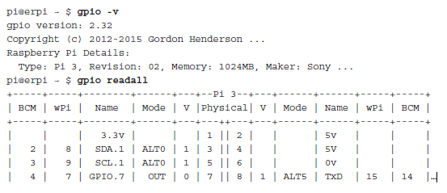

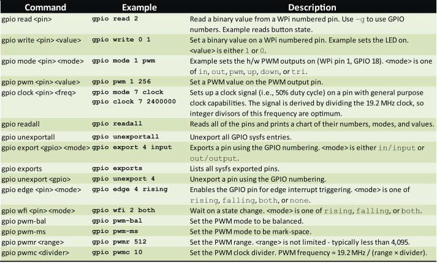

Рисунок 6-16: деякі параметри команди `gpio`

Щоб зчитати значення кнопки, підключеної до контакту 13 (GPIO27) на рисунку 6-5(a), за допомогою команди `gpio`, слід врахувати, що відповідний номер WPi дорівнює 2. Тому використання як нумерації WPi, так і стандартної нумерації GPIO дає узгоджені результати:

```bash
pi@erpi ~ $ gpio mode 2 in
pi@erpi ~ $ gpio read 2
0
pi@erpi ~ $ gpio -g read 27
0
pi@erpi ~ $ gpio read 2
1
pi@erpi ~ $ gpio -g read 27
1
```

Не всі команди `gpio` та виклики бібліотеки підтримують режим `-g`, тому в подальшому описі використовується нумерація WPi. Щоб увімкнути світлодіод на рисунку 6-2 (GPIO17, контакт 11, номер WPi 0) за допомогою команди `gpio`:

```bash
pi@erpi ~ $ gpio mode 0 out
pi@erpi ~ $ gpio write 0 1
pi@erpi ~ $ gpio write 0 0
```

Також можна очікувати появу фронту або спаду сигналу під час натискання кнопки. Перша з наведених нижче команд `gpio wfi` не повертає керування доти, доки кнопка не буде натиснута, а друга команда очікує моменту відпускання кнопки:

```bash
pi@erpi ~ $ gpio wfi 2 rising
pi@erpi ~ $ gpio wfi 2 falling
```

Функціональність PWM, наведена на рисунку 6-16, буде розглянута далі.

### Програмування з використанням wiringPi

wiringPi містить повноцінну бібліотеку функцій мовою C для керування GPIO Raspberry Pi незалежно від моделі плати. У лістингу 6-10 наведено першу програму з використанням wiringPi, яка виводить інформацію про плату, що використовується. Як і раніше, для цих прикладів передбачається, що плата підключена до схем зі світлодіодом і кнопкою, показаних відповідно на рисунках 6-2 і 6-5(a).

Listing 6-10: /chp06/wiringPi/info.cpp

```c++
#include <iostream>
#include <wiringPi.h>
using namespace std;
#define LED_GPIO 17 // this is GPIO17, Pin 11
#define BUTTON_GPIO 27 // this is GPIO27, Pin 13
int main() { // must be run as root
    wiringPiSetupGpio(); // use the GPIO numbering form
    pinMode(LED_GPIO, OUTPUT); // the LED set up as an output
    pinMode(BUTTON_GPIO, INPUT); // the Button set up as an input
    int model, rev, mem, maker, overVolted;
    piBoardId(&model, &rev, &mem, &maker, &overVolted);
    cout << "This is an RPi: " << piModelNames[model] << endl;
    cout << " with revision number: " << piRevisionNames[rev] << endl;
    cout << " manufactured by: " << piMakerNames[maker] << endl;
    cout << " it has: " << mem << " RAM and o/v: " << overVolted << endl;
    cout << "Button GPIO has ALT mode: " << getAlt(BUTTON_GPIO);
    cout << " and value: " << digitalRead(BUTTON_GPIO) << endl;
    cout << "LED GPIO has ALT mode: " << getAlt(LED_GPIO);
    cout << " and value: " << digitalRead(LED_GPIO) << endl;
    return 0;
}
```

Цей код можна зібрати за допомогою `g++`, підключивши бібліотеку wiringPi (параметр `-lwiringPi` явно підключає `libwiringPi.so`, яка розташована в каталозі `/usr/local/lib/`).

Програму необхідно запускати з використанням утиліти `sudo`, оскільки операції з відображенням пам’яті потребують прав суперкористувача:

```bash
pi@erpi ~/exploringrpi/chp06/wiringPi $ g++ info.cpp -o info -lwiringPi
pi@erpi ~/exploringrpi/chp06/wiringPi $ sudo ./info
This is an RPi: Model 2
with revision number: 1.1
manufactured by: Sony
it has: 1024 RAM and o/v: 68956
Button GPIO has ALT mode: 0 and value: 0
LED GPIO has ALT mode: 1 and value: 1
```

На рисунку 6-17 наведено огляд функцій мови C, доступних у бібліотеці wiringPi. У наступних прикладах показано, як ефективно використовувати ці функції wiringPi у власних застосунках для роботи з входами та виходами.

### Перемикання світлодіода з використанням wiringPi

У лістингу 6-11 наведено приклад коду для перемикання GPIO з частотою приблизно $1{,}1\ \text{МГц}$ на Raspberry Pi 2. Це значно швидше, ніж можна досягти з використанням підходу sysfs, і, очевидно, таке перемикання світлодіода є невидимим для людини. Водночас цей приклад є корисним тестом продуктивності wiringPi. Результати вимірювань наведено на рисунку 6-18(a).

Listing 6-11: /chp06/wiringPi/fasttoggle.cpp

```c++
// Do not optimize this code using -O3 as it will remove the delay hack
#include <wiringPi.h>
#include <iostream>
using namespace std;
#define LED_GPIO 17 // this is GPIO17, Pin 11
int main() {
    wiringPiSetupGpio(); // use GPIO, not WPi, labels
    cout << "Starting fast GPIO toggle on GPIO" << LED_GPIO << endl;
    cout << "Press CTRL+C to quit..." << endl;
    pinMode(LED_GPIO, OUTPUT); // GPIO17 is an output pin
    while(1) { // loop forever - await ^C press
        digitalWrite(LED_GPIO, HIGH); // LED on
        for(int i=0; i<50; i++) { } // blocking delay hack
        digitalWrite(LED_GPIO, LOW); // LED off
        for(int i=0; i<49; i++) { } // shorter delay to balance
    } // the duty cycle somewhat
    return 0; // program will never reach here!
}
```

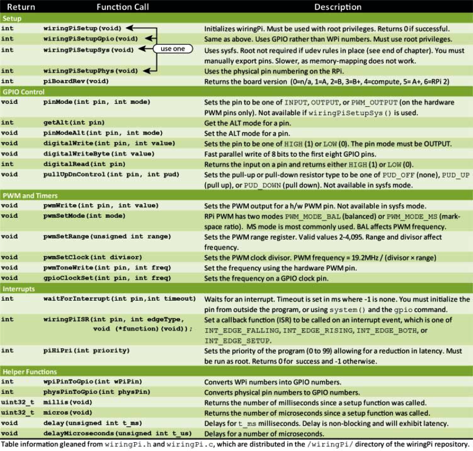

Рисунок 6-17: огляд API бібліотеки wiringPi

На Raspberry Pi 2/3 ця програма використовує 100% одного ядра процесора та значні частини інших ядер для виконання завдань ядра (таких як `kworker` і `ksoftirqd`). Цикл `for` використовується замість виклику `sleep`, оскільки це простий спосіб утримувати контроль над процесором; стандартна альтернатива `usleep()` є неблокувальною і призводить до значно більшої затримки, ніж можна було б очікувати. Це відбувається через те, що ядро може передати обчислювальний ресурс іншим задачам, що також спричиняє джитер сигналу.

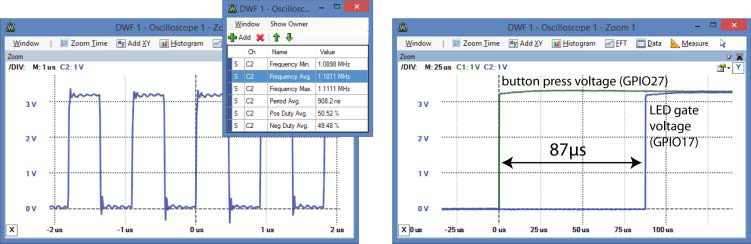

Рисунок 6-18: продуктивність C-коду з використанням wiringPi: (a) приклад fastToggle, (b) приклад buttonLED

Натискання кнопки — реакція світлодіода

У лістингу 6-12 показано реєстрацію функції зворотного виклику обробника переривань (ISR), яка один раз вмикає світлодіод і підраховує кількість натискань кнопки. Для реєстрації функції зворотного виклику в системі переривань використовується функція `wiringPiISR()`, при цьому переривання спрацьовує на фронті наростання сигналу на вході кнопки.

Функція `lightLED()` викликається щоразу, коли кнопка натискається (фронт наростання), але не викликається під час її відпускання (фронт спаду).

Listing 6-12: /chp06/wiringPi/buttonLED.cpp

```c++
#include <iostream>
#include <wiringPi.h>
#include <unistd.h>
using namespace std;
#define LED_GPIO 17 // this is GPIO17, Pin 11
#define BUTTON_GPIO 27 // this is GPIO27, Pin 13
// the Interrupt Service Routine (ISR) to light the LED
void lightLED(void) {
    static int x = 1; // store number of times pressed. Use static
    // to retain the state on multiple calls
    digitalWrite(LED_GPIO, HIGH); // turn the LED on
    cout << "Button pressed " << x++ << " times! LED on" << endl;
}
int main() { // must be run as root
    wiringPiSetupGpio(); // use the GPIO numbering
    pinMode(LED_GPIO, OUTPUT); // the LED
    pinMode(BUTTON_GPIO, INPUT); // the Button
    digitalWrite (LED_GPIO, LOW); // LED is off
    cout << "Press the button on GPIO " << BUTTON_GPIO << endl;
    // call the lightLED() ISR on the rising edge (i.e., button press)
    wiringPiISR(BUTTON_GPIO, INT_EDGE_RISING, &lightLED);
    for(int i=10; i>0; i--) { // countdown to program end
        cout << "You have " << i << " seconds remaining..." << endl;
        sleep(1); // sleep for 1 second
    }
    return 0; // program ends after 10s
}
```

Приклад виводу цього коду наведено нижче. Можна побачити, що кнопка була натиснута майже одразу після запуску лічильника, однак сам лічильник продовжує працювати паралельно. Повторні натискання кнопки збільшують значення лічильника та призводять до появи кількох повідомлень; водночас світлодіод просто залишається увімкненим до моменту перезапуску програми. Програма завершує роботу через 10 секунд; після цього обробник переривань (ISR) більше не є активним.

```bash
pi@erpi ~/exploringrpi/chp06/wiringPi $ sudo ./buttonLED
Press the button on GPIO 27
You have 10 seconds remaining...
You have 9 seconds remaining...
Button pressed 1 times! LED on
Button pressed 2 times! LED on
You have 8 seconds remaining...
```

Час реакції цього кола показано на рисунку 6-18(b), і для користувацької програми Linux він є вражаючим. Світлодіод засвічується приблизно через 87 мкс після натискання кнопки, що швидше, ніж у попередньому варіанті коду з використанням `sys/poll.h`.

Однією з труднощів цього прикладу є його чутливість до брязкоту контактів кнопки. У розділі 4 описано кілька апаратних рішень для усунення брязкоту з використанням RC-ланцюгів і тригерів Шмітта, однак можна застосувати й програмні методи. Функцію обробника переривань `lightLED()` можна модифікувати, додавши часову перевірку, як показано в лістингу 6-13. Це забезпечує, що інтервал між натисканнями кнопки перевищує заданий час (наприклад, 200 мс), перш ніж наступні натискання будуть зареєстровані як коректні.

Listing 6-13: /chp06/wiringPi/buttonLEDdebounced.cpp (segment)

```c++
#define DEBOUNCE_TIME 200 // debounce time in ms
// the interrupt service routine (ISR) to light the LED - debounced
void lightLED(void){
    static unsigned long lastISRTime = 0, x = 1;
    unsigned long currentISRTime = millis();
    if (currentISRTime - lastISRTime > DEBOUNCE_TIME){
        digitalWrite(LED_GPIO, HIGH); // turn the LED on
        cout << "Button pressed " << x++ << " times! LED on" << endl;
    }
    lastISRTime = currentISRTime;
}
```

Примітка
Час від часу можуть виникати незрозумілі проблеми в роботі програм, які використовують GPIO Raspberry Pi. Якщо початкові перевірки не дають змоги усунути проблему, перед подальшим тестуванням перезавантажте плату. Регістри GPIO зберігають свій стан між виконаннями GPIO-застосунків, і можливо, що стан GPIO, залишений попередньою програмою, заважає коректній роботі вашого коду.

#### PYTHON І WIRINGPI

Для бібліотеки wiringPi Філом Говардом (@Gadgetoid) було розроблено прив’язку, яка дає змогу використовувати її у Python-скриптах. Пакет можна встановити відповідно для Python2 і Python3 таким чином:

```python
pi@erpi ~ $ sudo apt install python-dev python-pip
pi@erpi ~ $ sudo pip install wiringpi2
Downloading/unpacking wiringpi2 ...
pi@erpi ~ $ sudo apt install python3-dev python3-pip
pi@erpi ~ $ sudo pip3 install wiringpi2
Downloading/unpacking wiringpi2 ...
```

Після цього можна запустити Python із правами суперкористувача, щоб перевірити коректність роботи wiringPi. Наведений нижче тест керує світлодіодом на GPIO17 (підключеним відповідно до рисунка 6-2) та кнопкою на GPIO27 (підключеною відповідно до рисунка 6-5(a)):

```python
pi@erpi ~ $ sudo python3
Python 3.4.2 (default, Oct 19 2014, 13:31:11) ...
>>> import wiringpi2
>>> wpi.digitalWrite(17,1)
>>> sleep(0.1)
>>> wpi.digitalWrite(17,0)
>>> sleep(0.1)
>>> print("Button pressed: end of example")
pi@erpi ~/exploringrpi/chp06/python $ chmod ugo+x ledflash.py
pi@erpi ~/exploringrpi/chp06/python $ sudo ./ledflash.py
Starting the Python wiringPi example
Button pressed: end of example
>>> wiringpi2.piBoardRev()
2
>>> wiringpi2.wiringPiSetupGpio()
0
>>> wiringpi2.pinMode(17,1)
>>> wiringpi2.digitalWrite(17,1)
>>> wiringpi2.digitalWrite(17,0)
>>> wiringpi2.pinMode(27,0)
>>> wiringpi2.digitalRead(27)
0
>>> wiringpi2.digitalRead(27)
1
```

На основі цих кроків можна розробити програму на Python3, яка блимає світлодіодом із частотою 5 Гц доти, доки не буде натиснута кнопка (див. `/python/ledflash.py`):

```python
pi@erpi ~/exploringrpi/chp06/python $ more ledflash.py
#!/usr/bin/python3
import wiringpi2 as wpi
from time import sleep

print("Starting the Python wiringPi example")
wpi.wiringPiSetupGpio()
wpi.pinMode(17,1)
wpi.pinMode(27,0)
while wpi.digitalRead(27)==0:
wpi.digitalWrite(17,1)
sleep(0.1)
wpi.digitalWrite(17,0)
sleep(0.1)
print("Button pressed: end of example")
pi@erpi ~/exploringrpi/chp06/python $ chmod ugo+x ledflash.py
pi@erpi ~/exploringrpi/chp06/python $ sudo ./ledflash.py
Starting the Python wiringPi example
Button pressed: end of example
```

### Обмін даними з датчиками One-Wire

Сімейство датчиків температури та вологості Aosong (AM2301, AM2302 і DHT11) може здійснювати цифровий обмін даними з Raspberry Pi з використанням одного GPIO. GPIO може встановлюватися у високий або низький рівень у часовій послідовності для передавання бітів даних датчику з метою ініціалізації обміну. Після цього той самий GPIO зчитується у часі для приймання відповіді датчика. Узгодженість часу вибірки є критичною для цього застосування, оскільки відповідь містить 40 бітів даних і передається менш ніж за 4,3 мс. Тому використовується код wiringPi з відображенням пам’яті.

На рисунку 6-19 показано, як підключити один із таких датчиків до Raspberry Pi з використанням довільного GPIO-контакту (наприклад, GPIO22). У технічній документації на датчики AM230x рекомендується підключати лінію DATA до VCC через «сильний» підтягувальний резистор, а також використовувати розв’язувальний конденсатор 100 нФ між VCC і GND. За такої конфігурації як Raspberry Pi, так і датчик можуть безпечно притягувати рівень напруги до GND для двонапрямного обміну даними.

Обмін даними починається з того, що Raspberry Pi притягує GPIO до низького рівня на 18 мс, після чого відпускає лінію у високий рівень ще на 20–40 мкс. Далі GPIO перемикається в режим зчитування і ігнорує низький рівень тривалістю 80 мкс та наступний високий імпульс тривалістю 80 мкс. Після цього датчик повертає 5 байтів даних (тобто 40 бітів) у форматі зі старшим бітом першим (MSB). Перші 2 байти представляють значення вологості, наступні 2 байти — значення температури, а останній байт є контрольним суматором, який можна використати для перевірки коректності прийнятих даних (це 8-бітна обмежена сума попередніх 4 байтів).

Біти передаються шляхом зміни тривалості високих імпульсів. Високий рівень тривалістю 26–28 мкс відповідає двійковому 0, а високий рівень тривалістю 70 мкс відповідає двійковому 1.

У верхній частині рисунка 6-19 наведено реальне осцилографічне захоплення сигналу та виконані розрахунки, які пояснюють процес обміну даними для датчиків AM2301 і AM2302. Датчик DHT11 передає лише старший байт для значень вологості та температури, тому не забезпечує дробової точності.

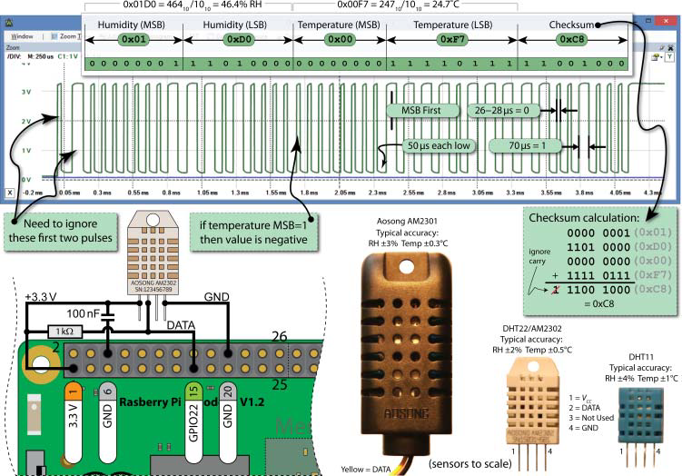

Рисунок 6-19: використання датчика One-Wire з Raspberry Pi та wiringPi (форма сигналу для AM2301/2302)

У лістингу 6-14 наведено програму мовою C++, яку можна використати для обміну даними з датчиками сімейства AM230x/DHT за допомогою бібліотеки wiringPi. Зверніть увагу, що змінна `count` відповідає приростам часу приблизно по 2 мкс, а значення `LH_THRESHOLD` можна використовувати для налаштування часової межі розрізнення ширини імпульсів між двійковими 0 і 1.

Listing 6-14: /chp06/dht/dht.cpp

```c++
#include<iostream>
#include<unistd.h>
#include<wiringPi.h>
#include<iomanip>
using namespace std;
#define USING_DHT11 true // The DHT11 uses only 8 bits
#define DHT_GPIO 22 // Using GPIO 22 for this example
#define LH_THRESHOLD 26 // Low=~14, High=~38 - pick avg.
int main(){
    int humid = 0, temp = 0;
    cout << "Starting the one-wire sensor program" << endl;
    wiringPiSetupGpio();
    piHiPri(99); // Use a high priority to help timing code
    TRYAGAIN: // If checksum fails (come back here)
    unsigned char data[5] = {0,0,0,0,0};
    pinMode(DHT_GPIO, OUTPUT); // gpio starts as output
    digitalWrite(DHT_GPIO, LOW); // pull the line low
    usleep(18000); // wait for 18ms
    digitalWrite(DHT_GPIO, HIGH); // set the line high
    pinMode(DHT_GPIO, INPUT); // now gpio is an input
    // need to ignore the first and second high after going low
    do { delayMicroseconds(1); } while(digitalRead(DHT_GPIO)==HIGH);
    do { delayMicroseconds(1); } while(digitalRead(DHT_GPIO)==LOW);
    do { delayMicroseconds(1); } while(digitalRead(DHT_GPIO)==HIGH);
    // Remember the highs, ignore the lows -- a good philosophy!
    for(int d=0; d<5; d++) { // for each data byte
        // read 8 bits
        for(int i=0; i<8; i++) { // for each bit of data
            do { delayMicroseconds(1); } while(digitalRead(DHT_GPIO)==LOW);
            int width = 0; // measure width of each high
            do {
                width++;
                delayMicroseconds(1);
                if(width>1000) break; // missed a pulse -- data invalid!
            } while(digitalRead(DHT_GPIO)==HIGH); // time it!
            // shift in the data, msb first if width > the threshold
            data[d] = data[d] | ((width > LH_THRESHOLD) << (7-i));
        }
    }
    if (USING_DHT11){
        humid = data[0] * 10; // one byte - no fractional part
        temp = data[2] * 10; // multiplying to keep code concise
    }
    else { // for DHT22 (AM2302/AM2301)
        humid = (data[0]<<8 | data[1]); // shift MSBs 8 bits left and OR LSBs
        temp = (data[2]<<8 | data[3]); // same again for temperature
    }
    unsigned char chk = 0; // the checksum will overflow automatically
    for(int i=0; i<4; i++){ chk+= data[i]; }
    if(chk==data[4]){
        cout << "The checksum is good" << endl;
        cout << "The temperature is " << (float)temp/10 << "°C" << endl;
        cout << "The humidity is " << (float)humid/10 << "%" << endl;
    }
    else {
        cout << "Checksum bad - data error - trying again!" << endl;
        usleep(2000000); // have to delay for 1-2 seconds between readings
        goto TRYAGAIN; // a GOTO!!! call yourself a C/C++ programmer!
    }
    return 0;
}
```

Встановіть значення `USING_DHT11` рівним `false`, якщо ви використовуєте датчик DHT22 (AM2301/AM2302), і виконайте програму таким чином:

```bash
pi@erpi ~/exploringrpi/chp06/dht $ g++ dht.cpp -o dht -lwiringPi
pi@erpi ~/exploringrpi/chp06/dht $ sudo ./dht
Starting the one-wire sensor program
Checksum is good
The temperature is 24.1°C
The humidity is 47.7%
```

Якщо використовується DHT11, дробові значення у виводі відсутні. Значення температури в градусах Цельсія можна перетворити у градуси Фаренгейта, помноживши його на 1,8 і додавши 32, тобто

$$
24.1^\circ\text{C} \approx 75^\circ\text{F}
$$

Важливість цього прикладу полягає в тому, що той самий підхід вибірки сигналу в часі можна застосовувати і для інших датчиків шини One-Wire.

### PWM і тактові сигнали загального призначення

Raspberry Pi має корисні альтернативні режими (ALT) для багатьох контактів роз’єму GPIO, як показано на рисунку 6-11. Деякі з цих ALT-режимів розглядаються в розділі 8, однак у цьому підрозділі увага зосереджена на PWM і GPCLK.

#### Широтно-імпульсна модуляція (PWM)

Raspberry Pi має можливості широтно-імпульсної модуляції (PWM), які можна використовувати для цифро-аналогового перетворення (DAC) або для формування керуючих сигналів для двигунів і певних типів сервоприводів. Кількість апаратних PWM-виходів на платах Raspberry Pi є обмеженою. Усі моделі Raspberry Pi мають один PWM-вихід (PWM0) на контакті 12 (GPIO18). На моделях RPi 2/3 та RPi B+/A+ додатково присутній другий PWM-вихід (PWM1) на контакті 33 (GPIO13).

На інших GPIO-контактах можна реалізувати програмний PWM шляхом перемикання GPIO, однак такий підхід має високу вартість за навантаженням на CPU і придатний лише для PWM-сигналів низької частоти. У розділі 9 описано схеми, які дають змогу додати від 16 до 992 апаратних PWM на кожну шину I2C.

PWM-пристрій Raspberry Pi працює від фіксованої базової тактової частоти 19,2 МГц, тому для налаштування частоти PWM під конкретне застосування використовуються цілочисельні значення дільника і діапазону відповідно до виразу:

$$
f_{\text{PWM}} = \frac{19.2\ \text{МГц}}{\text{divisor} \times \text{range}}
$$

Параметр `range` надалі використовується для регулювання коефіцієнта заповнення PWM-сигналу; слід бути обережним, оскільки мале значення `range` призводить до низької роздільної здатності за коефіцієнтом заповнення. Усі PWM Raspberry Pi працюють на одній і тій самій частоті, але мають незалежні коефіцієнти заповнення.

Типовим режимом роботи PWM на Raspberry Pi є збалансований PWM (див. режим MSEN у розділі 9.4 документації BCM2835 ARM Peripherals). Збалансований PWM означає, що частота змінюється разом зі зміною коефіцієнта заповнення. Тому для керування частотою необхідно використовувати виклик `pwmSetMode(PWM_MODE_MS)`, який перемикає режим у mark-space.

У лістингу 6-15 наведено перший приклад використання PWM. У ньому задіяні обидва PWM на Raspberry Pi 2/3 для формування двох сигналів з різними коефіцієнтами заповнення. Якщо потрібно використати цей код на старіших моделях Raspberry Pi, слід видалити всі посилання на PWM1.

Listing 6-15: /chp06/wiringPi/pwm.cpp

```c++
#include <iostream>
#include <wiringPi.h>
using namespace std;
#define PWM0 12 // this is physical Pin 12
#define PWM1 33 // only on the RPi B+/A+/2/3
int main() { // must be run as root
    wiringPiSetupPhys(); // use the physical pin numbers
    pinMode(PWM0, PWM_OUTPUT); // use the RPi PWM output
    pinMode(PWM1, PWM_OUTPUT); // only on recent RPis
    // Setting PWM frequency to be 10kHz with a full range of 128 steps
    // PWM frequency = 19.2 MHz / (divisor * range)
    // 10000 = 19200000 / (divisor * 128) => divisor = 15.0 = 15
    pwmSetMode(PWM_MODE_MS); // use a fixed frequency
    pwmSetRange(128); // range is 0-128
    pwmSetClock(15); // gives a precise 10kHz signal
    cout << "The PWM Output is enabled" << endl;
    pwmWrite(PWM0, 32); // duty cycle of 25% (32/128)
    pwmWrite(PWM1, 64); // duty cycle of 50% (64/128)
    return 0; // PWM output stays on after exit
}
```

На рисунку 6-20(a) показано результати формування вихідних сигналів. Базова частота 19,2 МГц ділиться на 15 і на значення діапазону 128, у результаті чого отримується частота PWM 10 кГц. При значенні PWM, рівному 32 (тобто $32/128$), сигнал має коефіцієнт заповнення 25%, а при значенні 64 — коефіцієнт заповнення 50%. Ці значення підтверджуються вимірювальною таблицею, наведеною на рисунку 6-20(a).

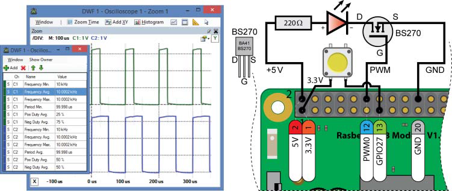

Рисунок 6-20: (a) вихідні результати програми з лістингу 6-15, (b) схема кнопки та світлодіода з PWM

#### Застосування PWM — плавна зміна яскравості світлодіода

На рисунку 6-20(b) показано схему, у якій PWM-вихід використовується для керування яскравістю світлодіода. Світлодіоди є пристроями, керованими струмом, тому PWM зазвичай застосовується для регулювання рівня яскравості. Це досягається шляхом перемикання світлодіода з частотою, вищою за поріг сприйняття людиною, при цьому співвідношення часу, протягом якого світлодіод увімкнений, до часу, коли він вимкнений (тобто коефіцієнт заповнення), визначає сприйманий рівень яскравості.

У лістингу 6-16 наведено приклад коду для повільного плавного вмикання та вимикання світлодіода з використанням PWM доти, доки не буде натиснута кнопка. У цьому прикладі використовується обробник переривань (ISR) на натискання кнопки, щоб забезпечити коректне завершення програми після повного циклу зміни яскравості.

Примітка
Замість плавної зміни яскравості світлодіода можна використати PWM для видимого миготіння світлодіода з мінімальним навантаженням на CPU. Наприклад, щоб миготіти світлодіодом з точною частотою 10 Гц і коефіцієнтом заповнення 50% (дільник тактової частоти = 1920, `range` = 1000):

```bash
pi@erpi ~ $ gpio mode 1 pwm
pi@erpi ~ $ gpio pwm-ms
pi@erpi ~ $ gpio pwmc 1920
pi@erpi ~ $ gpio pwmr 1000
pi@erpi ~ $ gpio pwm 1 500
```

Listing 6-16: /chp06/wiringPi/fadeLED.cpp

```c++
#include <iostream>
#include <wiringPi.h>
#include <unistd.h>
using namespace std;
#define PWM_LED 18 // this is PWM0, Pin 12
#define BUTTON_GPIO 27 // this is GPIO27, Pin 13
bool running = true; // fade in/out until button pressed
void buttonPress(void) { // ISR on button press - not debounced
    cout << "Button was pressed -- start graceful end." << endl;
    running = false; // the while() loop should end soon
}
int main() { // must be run as root
    wiringPiSetupGpio(); // use the GPIO numbering
    pinMode(PWM_LED, PWM_OUTPUT); // the PWM LED - PWM0
    pinMode(BUTTON_GPIO, INPUT); // the button input
    wiringPiISR(BUTTON_GPIO, INT_EDGE_RISING, &buttonPress);
    cout << "Fading the LED in/out until the button is pressed" << endl;
    while(running) {
        for(int i=1; i<=1023; i++) { // Fade fully on
            pwmWrite(PWM_LED, i);
            usleep(1000);
        }
        for(int i=1022; i>=0; i--) { // Fade fully off
            pwmWrite(PWM_LED, i);
            usleep(1000);
        }
    }
    cout << "LED Off: Program has finished gracefully!" << endl;
    return 0;
}
```

#### Застосування PWM — керування сервоприводом

Сервоприводи складаються з двигуна постійного струму, з’єднаного з потенціометром, та керуючої електронної схеми. Положення вала двигуна можна керувати шляхом подавання PWM-сигналу на контролер сервопривода.

Hitec HS-422 є недорогим (менше ніж $10), якісним і широко доступним сервоприводом, який може живитися від лінії 5 В Raspberry Pi. Він розрахований на поворот на ±45° від центрального положення. Фізично сервопривід може обертатися в діапазоні ±90°, однак поза межами ±45° потенціометр поводиться не цілком лінійно. Згідно з технічною документацією, HS-422 очікує імпульс кожні 20 мс (тобто з частотою 50 Гц), тривалість якого змінюється від 1100 мкс (для встановлення положення −45° від центру) до 1900 мкс (для встановлення положення +45° від центру). Центральне положення встановлюється імпульсом тривалістю 1500 мкс.

На рисунку 6-21 показано схему підключення та часові діаграми керування сервоприводом, які дають змогу обертати його від −90° за допомогою імпульсу тривалістю 570 мкс до +90° за допомогою імпульсу тривалістю 2350 мкс. Ці значення, а також центральна точка 1460 мкс, були відкалібровані вручну і можуть відрізнятися для кожного окремого сервопривода.

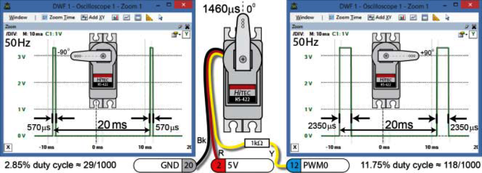

Рисунок 6-21: керування сервоприводом за допомогою PWM, позиціонування від −90° до +90° з використанням імпульсів різної тривалості

Сервопривід має три проводи: чорний, червоний і жовтий. Чорний провід підключається до GND Raspberry Pi (контакт 20), червоний — до лінії живлення 5 В Raspberry Pi (контакт 2), а жовтий — через резистор 1 кΩ до PWM0-виходу Raspberry Pi (контакт 12). Резистор 1 кΩ обмежує струм, який джерелиться з контакту 12, приблизно до 0,01 мА. Код мовою C++, який здійснює переміщення сервопривода вперед і назад доти, доки не буде натиснута кнопка, наведено в лістингу 6-17.

Listing 6-17: /chp06/wiringPi/servo.cpp

```c++
#include <iostream>
#include <wiringPi.h>
#include <unistd.h>
using namespace std;
#define PWM_SERVO 18 // this is PWM0, Pin 12
#define BUTTON_GPIO 27 // this is GPIO27, Pin 13
#define LEFT 29 // manually calibrated values
#define RIGHT 118 // for the left, right and
#define CENTER 73 // center servo positions
bool sweeping = true; // sweep servo until button pressed
void buttonPress(void) { // ISR on button press - not debounced
    cout << "Button was pressed -- finishing sweep." << endl;
    sweeping = false; // the while() loop should end soon
}
int main() { // must be run as root
    wiringPiSetupGpio(); // use the GPIO numbering
    pinMode(PWM_SERVO, PWM_OUTPUT); // the PWM servo
    pinMode(BUTTON_GPIO, INPUT); // the button input
    wiringPiISR(BUTTON_GPIO, INT_EDGE_RISING, &buttonPress);
    pwmSetMode(PWM_MODE_MS); // use a fixed frequency
    pwmSetRange(1000); // 1000 steps
    pwmSetClock(384); // gives 50Hz precisely
    cout << "Sweeping the servo until the button is pressed" << endl;
    while(sweeping) {
        for(int i=LEFT; i<RIGHT; i++) { // rotate to right
            pwmWrite(PWM_SERVO, i);
            usleep(10000);
        }
        for(int i=RIGHT; i>=LEFT; i--) { // rotate to left
            pwmWrite(PWM_SERVO, i);
            usleep(10000);
        }
    }
    pwmWrite(PWM_SERVO, CENTER); // rotate to center
    cout << "Program has finished gracefully - servo centred" << endl;
    return 0;
}
```


#### Керування сервоприводом за допомогою команди gpio

Для керування PWM-контактами також можна використовувати команду `gpio`. Наприклад, щоб налаштувати сигнал з частотою 50 Гц на PWM0, контакт 12 (WPi-контакт 1), виконайте такі команди:

```
pi@erpi ~ $ gpio mode 1 pwm
pi@erpi ~ $ gpio pwm-ms
pi@erpi ~ $ gpio pwmc 384
pi@erpi ~ $ gpio pwmr 1000
```

Щоб керувати сервоприводом на рисунку 6-21, використовуючи наведені там розрахунки для повороту важеля сервопривода у положення −90° (29) і потім у положення +90° (118), виконайте такі команди:

```
pi@erpi ~ $ gpio pwm 1 29
pi@erpi ~ $ gpio pwm 1 118
```

#### Тактові сигнали загального призначення

wiringPi забезпечує підтримку генерації тактових сигналів на виходах тактових сигналів загального призначення. GPCLK0 (контакти 7 і 38) доступний на всіх моделях Raspberry Pi, тоді як GPCLK1 (контакти 29 і 40) та GPCLK2 (контакт 31) доступні відповідно до рисунка 6-11. GPCLK1 не слід використовувати, оскільки він зарезервований для внутрішнього використання.

У лістингу 6-18 наведено короткий приклад коду, який генерує тактовий сигнал з частотою 4,8 МГц. На рисунку 6-22 показано осцилографічне захоплення сигналів на Raspberry Pi 2, де одночасно формуються два тактові сигнали (для наочності на осцилоскопі введено негативне зміщення по постійному струму). Це захоплення виконано на межі можливостей осцилоскопа Analog Discovery, що допомагає пояснити спостережувані ефекти «дзвону» сигналу.

Listing 6-18: /chp06/wiringPi/clock.cpp

```c
#include <iostream>
#include <wiringPi.h>
using namespace std;
#define GPCLK0 4 // this is Pin 7 GPIO4
#define GPCLK1 5 // Pin 29, GPIO5 -- do not use
#define GPCLK2 6 // Pin 31, GPIO6 -- RPi A+,B+,2/3
int main() { // must be run as root
    wiringPiSetupGpio(); // use the GPIO numbers
    pinMode(GPCLK0, GPIO_CLOCK); // set up the clock from 19.2MHz base
    gpioClockSet(GPCLK0, 4800000); // output a clean 4.8MHz clock on GPCLK0
    cout << "The clock output is enabled on GPIO" << GPCLK0 << endl;
    return 0; // clock persists after exit
}
```

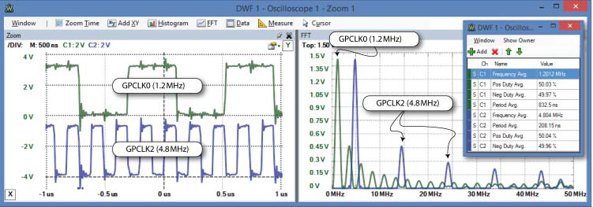

Рисунок 6-22: Raspberry Pi 2, що одночасно генерує тактові сигнали з частотами 1,2 МГц і 4,8 МГц (також показано FFT)

#### Високочастотні тактові сигнали (розширено)

Бібліотека C pigpio (abyz.co.uk/rpi/pigpio/) надає мінімальний код доступу до тактових сигналів і може використовуватися для налаштування контакту 7 на формування тактового сигналу з частотою від 4,687 кГц до 500 МГц. Тактовий сигнал може формуватися з використанням різних внутрішніх джерел тактування. Наприклад, щоб сформувати тактовий сигнал з частотою 10 МГц на виході GPCLK0 (контакт 7) з використанням PLLD (див. розділ 6.3 документації BCM2835 ARM Peripherals), виконайте такі команди:

```bash
pi@erpi ~ $ wget abyz.co.uk/rpi/pigpio/pigpio.zip
pi@erpi ~ $ unzip pigpio.zip
pi@erpi ~ $ cd PIGPIO/
pi@erpi ~/PIGPIO $ make
pi@erpi ~/PIGPIO $ sudo make install
pi@erpi ~/exploringrpi/chp06/minimal_clk $ gcc minimal_clk.c -o minimal_clk
pi@erpi ~/exploringrpi/chp06/minimal_clk $ sudo ./minimal_clk 10.0m
PLLD: 50 0 10.00 MHz
OSC: 1 3768 ILLEGAL
HDMI: 21 2457 10.29 MHz
PLLC: 100 0 10.00 MHz
Using PLLD (I=50 F=0 MASH=0)
Press return to exit and disable clock...
```

У цьому прикладі програма перебирає доступні джерела тактового сигналу та обирає відповідне для формування заданої частоти. Натискання клавіші Enter завершує роботу програми та вимикає тактовий сигнал.

## GPIO і права доступу

Упродовж цього розділу всі програми, що взаємодіють з GPIO, виконуються без використання `sudo`. За замовчуванням у Linux це не так, оскільки доступ до GPIO зазвичай дозволений лише суперкористувачу. У Raspbian систему налаштовано таким чином, що записи GPIO у sysfs належать групі користувачів `gpio`. Можна побачити, що це справді так, а також що користувач `pi` є членом групи `gpio`, виконавши такі команди:

```bash
pi@erpi /sys/class/gpio $ ls -l
total 0
-rwxrwx--- 1 root gpio 4096 Jul 7 01:17 export
lrwxrwxrwx 1 root gpio 0 Jul 7 01:17 gpiochip0 -> ...
-rwxrwx--- 1 root gpio 4096 Jul 7 01:17 unexport
pi@erpi /sys/class/gpio $ groups
pi adm dialout ... gpio i2c spi input
```

Це дуже корисна особливість Raspbian, оскільки вона позбавляє необхідності запускати застосунки з правами суперкористувача, за яких помилка в коді може пошкодити файлову систему. Насправді ця можливість є розширеною функцією основної гілки Linux і реалізується за допомогою правил udev, які дають змогу налаштовувати поведінку служби `udevd`.

### Написання правил udev

Правила udev надають можливість керування пристроями на рівні простору користувача на Raspberry Pi, зокрема перейменування пристроїв, зміни прав доступу та запуску скриптів під час підключення пристрою. Першим кроком до розуміння цих можливостей є отримання інформації про каталог `/sys/class/gpio`:

```
pi@erpi ~ $ udevadm info --path=/sys/class/gpio --attribute-walk
...
looking at device '/class/gpio':
KERNEL=="gpio"
SUBSYSTEM=="subsystem"
DRIVER==""
```

Правила udev зберігаються у файлах, розміщених у каталогах `/etc/udev/rules.d` та `/lib/udev/rules.d/`. Перший каталог призначений для користувацьких правил, тоді як другий зазвичай використовується для загальносистемних правил. Файл правил є звичайним текстовим файлом, назва якого починається з числового префікса пріоритету; чим менше це число, тим вищий пріоритет файлу правил.

У конфігурації Raspbian використовується файл `99-com.rules`, наведений у лістингу 6-19. Він має найнижчий можливий пріоритет, щоб не заважати іншим файлам правил у каталозі `/lib/udev/rules.d/`.

Listing 6-19: /etc/udev/rules.d/99-com.rules

```bash
SUBSYSTEM=="gpio*", PROGRAM="/bin/sh -c 'chown -R root:gpio /sys/class/gpio
&& chmod -R 770 /sys/class/gpio; chown -R root:gpio /sys/devices/virtual/gpio
&& chmod -R 770 /sys/devices/virtual/gpio'"
SUBSYSTEM=="input", GROUP="input", MODE="0660"
SUBSYSTEM=="i2c-dev", GROUP="i2c", MODE="0660"
SUBSYSTEM=="spidev", GROUP="spi", MODE="0660"

```

По суті, цей файл правил запускає однорядковий скрипт, який використовує команду `chown` для зміни групи GPIO-пристрою (і всіх символічних посилань) на `gpio` у момент додавання відповідного запису. Також у цьому файлі є правила для зміни прав доступу для пристроїв `input`, I2C і SPI (це розглядається в розділі 8).

Ви можете відредагувати цей файл відповідно до власних вимог щодо користувачів і груп. Наприклад, можна замінити запис `root:gpio` на `molloyd:gpio` у лістингу 6-19 і перевірити, що правило працює, таким чином:

```bash
pi@erpi /etc/udev/rules.d $ sudo nano 99-com.rules
pi@erpi /etc/udev/rules.d $ sudo udevadm test --action=add /class/gpio
calling: test version 215 ...
read rules file: /lib/udev/rules.d/10-local-rpi.rules ...
read rules file: /etc/udev/rules.d/99-com.rules
read rules file: /lib/udev/rules.d/99-systemd.rules ...
ACTION=add
DEVPATH=/class/gpio
SUBSYSTEM=subsystem
USEC_INITIALIZED=3950621318
```

Щоб переконатися, що зміни у файлі правил застосовані, можна перезапустити службу udev (або перезавантажити систему). Якщо після цього експортувати запис у каталозі `/sys/class/gpio`, власник усіх записів зміниться, і в цьому прикладі користувач `molloyd` стане власником усіх sysfs-записів GPIO:

```bash
pi@erpi /sys/class/gpio $ sudo systemctl restart systemd-udevd
pi@erpi /sys/class/gpio $ ls -l
total 0
-rwxrwx--- 1 root gpio 4096 Jul 7 22:03 export
lrwxrwxrwx 1 root gpio 0 Jul 7 01:17 gpiochip0 -> ...
-rwxrwx--- 1 root gpio 4096 Jul 7 01:17 unexport
pi@erpi /sys/class/gpio $ echo 27 > export
pi@erpi /sys/class/gpio $ ls -l
total 0
-rwxrwx--- 1 molloyd gpio 4096 Jul 7 22:05 export
lrwxrwxrwx 1 molloyd gpio 0 Jul 7 22:05 gpio27 -> ...
lrwxrwxrwx 1 molloyd gpio 0 Jul 7 01:17 gpiochip0 -> ...
-rwxrwx--- 1 molloyd gpio 4096 Jul 7 01:17 unexport
```

Це корисна вправа для розуміння механізму, однак пам’ятайте, що перед продовженням роботи потрібно повернути власника назад до `root`.

Правила udev є потужним інструментом керування тим, що відбувається під час підключення пристроїв до Raspberry Pi. Наприклад, можна створювати символічні посилання під час підключення конкретної USB-вебкамери або USB-флеш-накопичувача. Для розширеного керівництва з написання правил udev див. tiny.cc/erpi602.

### Права доступу і wiringPi

Застосунки wiringPi, які ви створюєте, часто використовують введення/виведення з відображенням пам’яті і потребують запуску з використанням `sudo`. Тоді виникає питання: чому команда `gpio` не потребує прав суперкористувача, зважаючи на те, що вона написана з використанням тієї самої бібліотеки?

Відповідь полягає в тому, що такі права вона все ж має. Якщо переглянути виконуваний файл, можна побачити, яким чином це реалізовано:

```bash
pi@erpi /usr/local/bin $ ls -l gpio
-rwsr-xr-x 1 root root 30456 Jul 10 03:38 gpio
```

Виконуваний файл `gpio` належить користувачу `root`, і для нього встановлено біт `setuid`, який описувався в розділі 3. Це означає, що команда `gpio` отримує права суперкористувача незалежно від того, під яким обліковим записом її запускають. Аналогічне налаштування прав можна використати і для власних програм, розроблених з використанням wiringPi. Наприклад:

```bash
pi@erpi ~/exploringrpi/chp06/wiringPi $ ls -l info
-rwxr-xr-x 1 pi pi 9692 Jul 11 14:31 info
pi@erpi ~/exploringrpi/chp06/wiringPi $ ./info
wiringPiSetup: Must be root. (Did you forget sudo?)
pi@erpi ~/exploringrpi/chp06/wiringPi $ sudo chown root info
pi@erpi ~/exploringrpi/chp06/wiringPi $ ls -l info
-rwxr-xr-x 1 root pi 9692 Jul 11 14:31 info
pi@erpi ~/exploringrpi/chp06/wiringPi $ ./info
wiringPiSetup: Must be root. (Did you forget sudo?)
```

Зміна власника на `root` є недостатньою, оскільки програма все ще виконується від імені користувача `pi`. Проте, якщо встановити біт `setuid` і файл належить `root`, програма виконуватиметься так, ніби її запустив `root`, незалежно від фактичного користувача:

```bash
pi@erpi ~/exploringrpi/chp06/wiringPi $ sudo chmod u+s info
pi@erpi ~/exploringrpi/chp06/wiringPi $ ls -l info
-rwsr-xr-x 1 root pi 9692 Jul 11 14:31 info
pi@erpi ~/exploringrpi/chp06/wiringPi $ ./info
This is an RPi: Model 3 ...
```

Якщо виконуваний файл зібрати повторно, біт `setuid` буде скинуто (навіть якщо використовувати `sudo` під час виклику `g++`). Це зроблено з міркувань безпеки, оскільки в іншому разі користувач міг би вставити зловмисний код у виконуваний файл:

```bash
pi@erpi ~/exploringrpi/chp06/wiringPi $ g++ info.cpp -o info -lwiringPi
pi@erpi ~/exploringrpi/chp06/wiringPi $ ls -l info
-rwxr-xr-x 1 pi pi 9692 Jul 11 18:51 info
```

## Підсумок

Після опрацювання цього розділу ви повинні вміти:

- використовувати GPIO Raspberry Pi для формування двійкового сигналу на цифрове коло або для зчитування двійкового входу з цифрового кола;
- писати shell-скрипти та ефективний код C/C++ з використанням sysfs для керування GPIO на Raspberry Pi;
- пояснювати вплив патча ядра PREEMPT і багатоядерності CPU на продуктивність GPIO-застосунків;
- використовувати внутрішні підтягувальні резистори pull-up і pull-down під час підключення схем;
- керувати станом GPIO за допомогою регістрів з відображенням пам’яті в SoC Raspberry Pi з використанням командного рядка та програм на C/C++;
- застосовувати бібліотеку функцій C wiringPi для ефективного й зручного керування GPIO Raspberry Pi;
- здійснювати двонапрямний обмін даними з датчиком з використанням одного GPIO;
- використовувати PWM на Raspberry Pi для плавної зміни яскравості світлодіода та керування сервоприводом;
- використовувати тактові сигнали загального призначення для формування високочастотних тактових сигналів;
- застосовувати правила udev Linux і біт setuid для покращення керування GPIO-застосунками на рівні користувача.

## Джерела

1.  [Molloy, Derek. *Exploring Raspberry Pi: Interfacing to the Real World*. Chichester: Wiley, 2016](http://www.exploringrpi.com)


## Автори


Molloy, Derek. *Exploring Raspberry Pi: Interfacing to the Real World*. Chichester: Wiley, 2016

## Feedback

Якщо Ви хочете залишити коментар у Вас є наступні варіанти:

- [Обговорення у WhatsApp](https://chat.whatsapp.com/BRbPAQrE1s7BwCLtNtMoqN)
- [Обговорення в Телеграм](https://t.me/+GA2smCKs5QU1MWMy)
- [Група у Фейсбуці](https://www.facebook.com/groups/asu.in.ua)

Про проект і можливість допомогти проекту написано [тут](https://asu-in-ua.github.io/atpv/)