[<- До підрозділу](README.md)		[Коментувати](#feedback)

# Raspberry PI GPIO: теоретична частина

Дана лекція передбачає що Ви ознайомленні з матеріалом з розділу [Знайомство з Raspberry PI та встановлення на неї ОС](../rpiinstall/README.md) як в теоретичній так і практичній частині.

## 1. Загальні відомості

### Про GPIO

**GPIO** (General-Purpose Input/Output) — це універсальний програмно керований цифровий інтерфейс введення та виведення (I/O), який дозволяє процесору або однокристальній системі зчитувати та формувати логічні стани на окремих лініях вводу-виводу, що можуть динамічно конфігуруватися як входи або виходи і, за потреби, працювати в альтернативних функціональних режимах. Про типи сигналів, поняття вхід та вихід можна прочитати в розділі [Сигнали та їх типи в системах керування: теоретична частина](../../signals/basicsign/teor.md).

Поняття GPIO не є специфічним для Raspberry Pi. Це загальний термін, який використовується для опису універсальних цифрових ліній введення та виведення у різних обчислювальних і керуючих пристроях. GPIO зустрічаються в мікроконтролерах, однокристальних системах, одноплатних комп’ютерах, вбудованих системах та деяких промислових пристроях, де потрібна гнучка взаємодія з зовнішніми сигналами.

GPIO працює виключно з дискретними сигналами (в даному контексті вживають термін "digital", тому тут вважаємо за синонім "цифровими") і оперує логічними станами, які інтерпретуються як `0` або `1` залежно від рівня напруги. Кожна лінія GPIO може програмно конфігуруватися як вхід для зчитування стану або як вихід для формування керуючого сигналу. Напрямок роботи не є фіксованим апаратно а може змінюватися під час роботи системи.

Окрім GPIO, у таких пристроях зазвичай присутні й інші типи входів і виходів, зокрема аналогові входи, апаратні інтерфейси або спеціалізовані периферійні блоки. Для зменшення кількості фізичних контактів один і той самий пін часто може використовуватися в різних режимах, наприклад як GPIO або як вхід аналого-цифрового перетворювача, залежно від конфігурації. У цьому випадку режими є взаємовиключними, а сам контакт не стає «аналоговим GPIO», а просто підключається до іншого апаратного блоку.

У технічній документації та програмних інтерфейсах часто використовується термін “пін” (**pin**). У цьому контексті він означає логічний канал введення-виведення всередині мікросхеми, який доступний через відповідний фізичний контакт роз’єму. У межах цієї лекції для простоти використовується термін “контакт”.

### Роз’єм GPIO у Raspberry Pi 

У випадку Raspberry Pi назва групи контактів «GPIO» є дещо умовною. Хоча роз’єм традиційно називають GPIO, на ньому присутні не лише контакти ліній загального цифрового вводу-виводу, а й контакти з фіксованим призначенням, зокрема живлення, земля, а також контакти, що використовуються для апаратних інтерфейсів і альтернативних функцій. Частина контактів може працювати як GPIO лише за умови відповідної конфігурації, а в інших режимах вони перестають бути універсальними лініями вводу-виводу.

Роз’єм GPIO Raspberry Pi у більшості сучасних моделей має уніфікований вигляд у вигляді 40-контактного дворядного пінового роз’єму з кроком 2.54 мм. Такий формат використовується починаючи з Raspberry Pi Model B+ і збережений у наступних моделях, включно з Raspberry Pi 3, 4 та 5. У старіших моделях перших поколінь зустрічався 26-контактний роз’єм, однак на практиці сьогодні він майже не використовується. Незважаючи на відмінності в апаратній частині різних моделей, логіка розташування контактів GPIO, живлення та землі залишається однаковою, що забезпечує сумісність плат розширення і навчальних прикладів.

Фізично GPIO представлений у вигляді ряду металевих контактів, до яких можна підключатися безпосередньо дротами або через проміжні пристрої (рис.1). На практиці пряме підключення до контактів Raspberry Pi використовується рідко, оскільки це незручно і ненадійно для експериментів. Найпоширенішим підходом є використання макетної плати для прототипування.

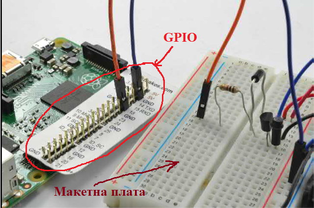

рис.1. Приклад підключення макетної плати до GPIO 

На рис.1 показано типовий варіант такого підключення. Raspberry Pi з’єднується з макетною платою за допомогою плоского шлейфа або окремих дротів-перемичок. Це дозволяє винести сигнали GPIO, живлення та землю на зручне поле контактів, де можна швидко змінювати схему без паяння. Макетна плата використовується для підключення кнопок, резисторів, світлодіодів та інших простих компонентів, що особливо зручно на етапі навчання і експериментів.

Для підключення застосовуються стандартні джампери з роз’ємами типу вилка-розетка (male–female) або розетка-розетка (female–female), які безпосередньо сумісні з GPIO та макетними платами. Такий підхід дозволяє швидко перебудовувати схему, тестувати різні варіанти і мінімізувати ризик пошкодження плати.

Важливо розуміти, що GPIO Raspberry Pi не має захисних корпусів або клем, як у промислових пристроях. Тому всі підключення виконуються на рівні лабораторного або прототипного монтажу. Саме через це для навчальних цілей широко використовуються макетні плати, перехідні плати та готові плати розширення, які спрощують роботу з GPIO і зменшують кількість помилок.

### Призначення контактів

Нумерація GPIO не є послідовною (рис.2). Контакти загального призначення вводу-виводу (GPIO) можуть бути налаштовані як вхід або вихід загального призначення, або як одна з шести спеціальних альтернативних функцій, конкретне призначення яких залежить від номера контакту. Деякі функції доступні на всіх контактах, інші — лише на окремих:

- PWM (широтно-імпульсна модуляція)

  - програмна PWM доступна на всіх контактах;

  - апаратна PWM доступна на GPIO12, GPIO13, GPIO18, GPIO19.

- SPI

  - SPI0: MOSI (GPIO10), MISO (GPIO9), SCLK (GPIO11), CE0 (GPIO8), CE1 (GPIO7);

  - SPI1: MOSI (GPIO20), MISO (GPIO19), SCLK (GPIO21), CE0 (GPIO18), CE1 (GPIO17), CE2 (GPIO16).

- I2C

  - дані (GPIO2), тактова лінія (GPIO3);

  - EEPROM дані (GPIO0), EEPROM тактова лінія (GPIO1).

- Послідовний інтерфейс UART тільки на TX (GPIO14) та RX (GPIO15).

Шини SPI, I2C, One-Wire не розглядаються в даному розділі, тому ту не будемо на них детально зупинятися. Контакти `GPIO 0` і `GPIO 1` фізично присутні на платі Raspberry Pi, але за замовчуванням зарезервовані для службової I2C-шини ідентифікації плат розширення (HAT). Хоча їх можна використовувати як звичайні GPIO, у навчальних і типових проєктах цього не рекомендується робити.


рис.2. Призначення контактів GPIO

### Контакти живлення 

Живлення на роз’ємі GPIO Raspberry Pi представлене кількома окремими лініями, і це зроблено свідомо з міркувань сумісності, струмового навантаження та стабільності.

На GPIO виведені контакти 5 V, 3.3 V та GND. Вони не генеруються самим GPIO як логічною підсистемою, а є безпосереднім виводом внутрішніх шин живлення плати. Тобто на ці контакти подається живлення з системи живлення Raspberry Pi, а не формується програмно або окремо для GPIO. Наявність кількох контактів 5 V та GND пояснюється не різними джерелами, а необхідністю зменшити падіння напруги та рівномірно розподілити струм при підключенні зовнішніх пристроїв або плат розширення. Всі контакти 5 V електрично з’єднані між собою, так само як і всі контакти GND.

Лінія 3.3 V використовується для живлення логіки та низьковольтних зовнішніх схем і відповідає логічним рівням GPIO. Самі GPIO-піни працюють тільки з рівнями 0–3.3 V (CMOS-логіка) і не мають внутрішніх джерел живлення для навантаження. Тобто GPIO може керувати сигналом, але не призначений для живлення пристроїв. 

Важливо розуміти, що контакти живлення на GPIO є допоміжним сервісом, а не повноцінним блоком живлення. Вони дозволяють живити прості зовнішні модулі, але при підключенні споживачів із більшим струмом необхідно враховувати загальні обмеження системи живлення Raspberry Pi.

## 3. Контакти в режимі GPIO

З’єднання GPIO у корпусі мікросхеми BCM2835 у документації на периферію інколи називають **pads** — це термін з напівпровідникового проєктування, який означає «з’єднання кристала з зовнішнім світом». Надалі в українському перекладі ми будемо вживати термін **канал**, для спрощення викладання матеріалу без особливого занурення в електроніку.

### Еквівалентна схема каналу GPIO

Для Raspberry Pi не існує відкритої офіційної документації, яка б детально описувала реальну електричну схему внутрішнього каналу GPIO на рівні транзисторів або елементів кристала. Виробник надає лише функціональний опис режимів роботи каналів, деякі деталі можна почитати в [Raspberry Pi computer hardware](https://www.raspberrypi.com/documentation/computers/raspberry-pi.html).  Проте для розуміння принципів підключення зовнішніх кіл цього недостатньо. Без уявлення про внутрішню логіку роботи GPIO складно усвідомити, чому саме так будується зовнішня схема і які обмеження при цьому існують. Тому на практиці використовуються спрощені пояснювальні моделі внутрішньої будови GPIO-контакту. Одна з них - це схема, яка показана на рис. 3, яка не є реальною електричною схемою Raspberry Pi, однак служить для ілюстрації того, які функціональні блоки можуть бути задіяні в різних режимах роботи піна.

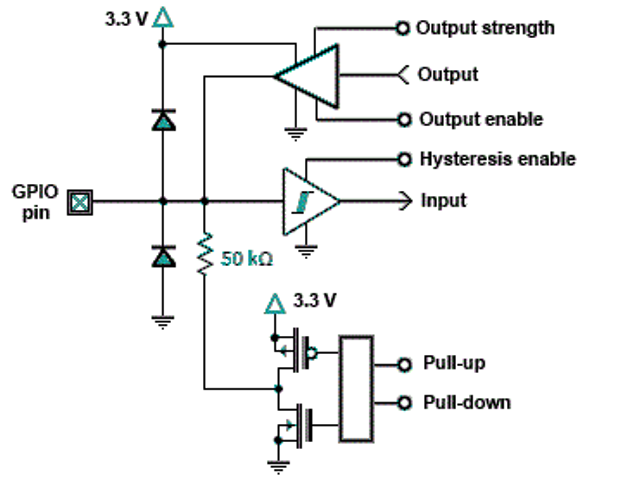

рис.3. Умовна еквівалентна схема GPIO на Raspberry PI ([джерело](http://www.mosaic-industries.com/embedded-systems/microcontroller-projects/raspberry-pi/gpio-pin-electrical-specifications) )

У центрі цієї моделі знаходиться сам GPIO-контакт (`GPIO pin`), до якого підключається зовнішній провід. Усередині мікросхеми цей контакт може з’єднуватися з різними внутрішніми блоками залежно від програмної конфігурації каналу. Саме перемикання між цими блоками і означує поведінку GPIO. У концептуальному вигляді GPIO-пін можна розглядати як набір незалежних функціональних частин, які активуються або деактивуються під час налаштування:

1. захисні елементи для обмеження перенапруги та захисту від статичної електрики
2. вхідний канал, який зчитує логічний рівень
3. вихідний канал, який формує логічний рівень
4. механізм керування напрямком роботи піна (вхід або вихід)
5. підтягувальні елементи pull-up та pull-down
6. додаткові параметри, такі як гістерезис або сила вихідного сигналу

Нижче розглянемо ці елементи окремо, детальніше про використання електронних елементів разом з керуючими платами можна прочитати в розділі [Узгодження електроніки з керуючими платами](../../electronproto/interfacingelectronics/README.md))

Канали GPIO Raspberry Pi є доволі універсальними, і багато їхніх характеристик можна змінювати програмно. Зокрема, можна вмикати або вимикати гістерезис для входів, обмежувати швидкість наростання вихідного сигналу, вмикати або вимикати підтягувальні резистори, а також керувати силою виходу. Все це можна змінювати через використання спеціальних регістрів.

Після подачі живлення або апаратного скидання всі канали GPIO переходять у режим універсальних входів. 

### Живлення GPIO

Живлення, показане на схемі з рис. 3 для каналу GPIO, є внутрішнім живленням мікросхеми і не потребує жодного зовнішнього підключення. Воно подається на внутрішні елементи каналу GPIO автоматично разом із живленням плати Raspberry Pi. 

Лінія 3.3 V на схемі використовується для живлення внутрішніх елементів каналу GPIO, які забезпечують формування та зчитування логічних рівнів, роботу підтягувальних елементів і захисних структур. Це живлення не виводиться назовні через відповідний контакт і не призначене для підключення зовнішніх кіл. Таким чином, під час роботи з GPIO користувач не підключає живлення до каналу GPIO окремо. Достатньо подати живлення на саму плату Raspberry Pi, після чого всі внутрішні елементи каналів GPIO отримують необхідне живлення автоматично.

Важливо не плутати це внутрішнє живлення з контактами 3.3 V і 5 V на роз’ємі GPIO. Контакти на роз’ємі призначені для живлення зовнішніх пристроїв, тоді як живлення, показане на схемі каналу, використовується виключно всередині мікросхеми.

### Захист GPIO 

Захист каналу GPIO реалізується внутрішніми елементами мікросхеми і на умовній схемі з рис.3 показаний у вигляді двох діодів, підключених до шин живлення 3.3 V та GND. Ці елементи призначені для відведення короткочасних перенапруг і захисту від статичної електрики, наприклад під час дотику або підключення проводів. 

Зверніть увагу це аварійні елементи, які у нормальному режимі не беруть участі в роботі каналу і показні тут умовно. У нормальному режимі роботи ці захисні елементи не впливають на сигнал і залишаються неактивними. Вони спрацьовують лише тоді, коли напруга на відповідному контакті виходить за допустимі межі, обмежуючи її відносно шин живлення.

Важливо розуміти, що цей захист не призначений для постійної роботи з напругами, вищими за 3.3 V або нижчими за 0 V. Він є запобіжним механізмом, а не засобом узгодження рівнів або живлення зовнішніх пристроїв. Детальніше про це можна почитати [за посиланням](http://www.mosaic-industries.com/embedded-systems/microcontroller-projects/raspberry-pi/gpio-pin-electrical-specifications).

### GPIO в режимі виходу

#### Спрощена схема GPIO в режимі виходу

На рис. 4 для спрощення показана та ж умовна схема каналу GPIO, але лише для режиму виходу, без інших складових. Формування логічного рівня зображене у вигляді елемента, який за своєю роллю подібний до операційного підсилювача і умовно показаний трикутником, який називають драйвером (**driver**). Це позначення не означає, що всередині каналу GPIO використовується класичний аналоговий операційний підсилювач. Воно застосовується як спрощена модель, що дозволяє наочно пояснити принцип формування вихідного сигналу.

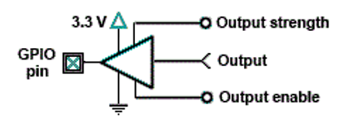

рис.4. Частина умовної еквівалентна схема GPIO в режимі виходу 

Як і будь-який підсилювальний елемент, цей внутрішній вузол потребує живлення. На схемі показано підключення до внутрішньої шини 3.3 V та до землі. Саме це живлення означує можливий діапазон вихідної напруги. Тому у режимі виходу GPIO може формувати лише логічні рівні в межах 0–3.3 V і не здатен видавати напруги за межами цього діапазону.

У загальному розумінні підсилювальний елемент — це вузол, який, отримуючи керуючий сигнал і маючи підключене живлення, формує відповідний вихідний рівень напруги. У випадку GPIO цей елемент не підсилює аналоговий сигнал, а формує один із двох фіксованих логічних рівнів, що відповідають значенням `0` або `1`. Напруга, яка з’являється на каналі GPIO, фактично береться з внутрішнього джерела живлення 3.3 V і керовано подається на вихід.

Роль цього внутрішнього підсилювального елемента полягає в тому, щоб:

- активно встановлювати напругу на каналі GPIO
- відокремлювати внутрішню логіку керування від зовнішнього електричного кола
- забезпечувати здатність каналу віддавати або приймати обмежений струм у межах, допустимих для мікросхеми

На схемі біля підсилювального елемента показані керуючі сигнали, які визначають режим його роботи.

- Цифровий сигнал `Output` є керуючим входом підсилювального елемента і задає логічне значення, яке необхідно сформувати на каналі. Саме він означує, чи буде вихідний рівень близький до 0 V або до 3.3 V.

- Сигнал `Output enable` керує вмиканням або вимиканням підсилювального елемента. Якщо вихід вимкнений, підсилювальний елемент від’єднується від контакту, і контакт переходить у високий імпеданс, тобто електрично майже не пов’язаний із внутрішніми схемами. Якщо вихід увімкнений, підсилювальний елемент отримує живлення і починає активно формувати логічний рівень, заданий сигналом `Output`.

- Сигнал `Output strength` (**сила виходу**) означує електричні властивості підсилювального елемента, зокрема те, наскільки жорстко він здатен утримувати вихідну напругу при підключенні зовнішнього навантаження. Детально див. нижче.

Усі ці сигнали формуються програмно і не потребують жодних зовнішніх підключень. Вони керують внутрішньою поведінкою каналу GPIO і означують, як саме підключене внутрішнє живлення використовується для формування вихідного сигналу.

#### Керування силою виходу

На спрощеній схемі з рис.4 показаний лише один вихідний драйвер, але фактично їх декілька, з’єднаних паралельно (рис.5). Саме за рахунок включення або відключення додаткових драйверів, змінюється здатність віддавати струм у діапазоні від 2 мА до 16 мА (в залежності від моделі). Тому `Output strength` (сила виходу) задає кількість включених додаткових  драйверів у бінарному форматі. Якщо силу виходу встановлено за замовченням, тобто на мінімальне значення ($000_2$), усі три додаткові драйвери переводяться у високий імпеданс (відключаються) і не роблять внеску у вихідний струм, залишається тільки основний. 

Параметр `Output strength` не означує максимальний струм, а означує такий струм, за якого канал усе ще відповідає специфікаціям (за напругою). Силу виходу GPIO слід налаштовувати відповідно до підключеного пристрою, щоб цей пристрій працював коректно.

Зверніть увагу, що на пристроях Raspberry 4 та Raspberry 5 фактичний рівень струму вдвічі менший за значення, показане на рис.5, тобто максимальна сила виходу - 8 мА.


рис.5. Паралельне підключення драйверів.

#### Значення струму

Значення струму (current value) означує максимальний струм, за якого канал усе ще відповідає специфікаціям. Значення струму не є струмом, який канал фактично віддає, і не є обмеженням струму. Розглянемо це детальніше.

Вихід каналу є джерелом напруги, тобто:

- якщо встановлено високий рівень (логічна  `1`), вихід драйверу намагається встановити напругу, близьку до напруги живлення (3.3 V)
- якщо встановлено низький рівень (логічний `0`), вихід драйверу намагається встановити напругу, близьку до землі (0 V)

Драйвер намагається сформувати високий або низький рівень. Успішність цього залежить від того, що саме до нього підключено. Якщо вихід драйверу замкнений на землю (коротке замикання), він не зможе сформувати рівень напруги, достатній для логічної `1`. У такому випадку він намагатиметься віддати якомога більший струм, який обмежується лише внутрішнім опором і з часом драйвер вийде з ладу. Те саме стосується ситуації, коли вихід драйверу підключений до 3.3 V, а на ньому формується логічний `0`.

Відповідність специфікаціям визначається гарантованими рівнями напруги. Оскільки канали є цифровими, існує лише два рівні напруги: високий і низький. Для вихідного рівня використовуються два параметри:

- $V_{OL}$ — максимальна напруга логічного `0` (0.14 V при VDD IO = 3.3 V); $V_{OL} = 0.14\ V$ означає, що якщо канал перебуває у стані `0`, напруга на виході драйверу буде не більшою за 0.14 V.
- $V_{OH}$ — мінімальна напруга логічної `1` (3.0 V при VDD IO = 3.3 V); $V_{OH} = 3.0\ V$ означає, що якщо канал перебуває у стані `1`, напруга на виході драйверу буде не меншою за 3.0 V.

Два приклади:

- встановлена сила виходу 8 мА для версій Raspberry 5 ($Output\ strength = 111_2$)  означає, що якщо канал встановлено у `1`, з нього можна відбирати до 8 мА, і при цьому вихідна напруга гарантовано буде не меншою за $V_{OH}$. 
- встановлена сила виходу  2 мА ($Output\ strength = 000_2$) і при цьому намагатися відбирати 8 мА (нижчий опір кола), напруга вже не відповідатиме $V_{OH}$, а буде нижчою. Фактично вона може бути недостатньою для того, щоб зовнішній пристрій розпізнав її як логічну `1`.

Шина живлення 3.3 V у Raspberry Pi була спроєктована з розрахунком приблизно на 3 мА на один канал GPIO. Якщо навантажити кожен канал струмом 16 мА, сумарний струм становитиме 272 мА. За такого навантаження шина 3.3 V зазнає просідання напруги. Особливо великі струмові імпульси виникають при наявності ємнісного навантаження. Ці імпульси можуть поширюватися на сусідні контакти і створювати завади, що здатні впливати на роботу SD-карти або навіть оперативної пам’яті.

#### Безпечний струм

Уся електроніка контактів розрахована на струм 16 мА. Це безпечне значення, за якого пристрій не буде пошкоджено. Навіть якщо сила виходу встановлена на 2 мА, але фактично з контакту протікає 16 мА, це не призведе до пошкодження мікросхеми. Окрім цього, жодних гарантованих максимальних безпечних значень струму не означено.

#### Специфікація виходів

У таблиці 1 наведені різні специфікації напруг для каналів GPIO у режимі виходу для виробів на базі BCM2835, BCM2836, BCM2837 і RP3A0 (наприклад, Raspberry Pi Zero або Raspberry Pi 3+). Інформацію щодо Compute Module слід шукати у відповідних технічних описах (datasheets).

Таблиця 1.

| Позначення | Параметр                       | Умови             | Мін. | Типове | Макс. | Одиниця |
| ---------- | ------------------------------ | ----------------- | ---- | ------ | ----- | ------- |
| $V_{OL}$   | Вихідна напруга логічного `0`² | $I_{OL} = −2\ мА$ | –    | –      | 0.14  | В       |
| $V_{OH}$   | Вихідна напруга логічної `1`²  | $I_{OH} = 2\ мА$  | 3.0  | –      | –     | В       |
| $I_{OL}$   | Вихідний струм логічного `0`³  | $V_O = 0.4\ В$    | 18   | –      | –     | мА      |
| $I_{OH}$   | Вихідний струм логічної `1`³   | $V_O = 2.3\ В$    | 17   | –      | –     | мА      |

2 — стандартна сила виходу (8 мА), 3 — максимальна сила виходу (16 мА)

У таблиці 2 наведені специфікації напруг для контактів GPIO для каналів GPIO у режимі виходу виробів на базі SoC [BCM2711](https://datasheets.raspberrypi.com/bcm2711/bcm2711-peripherals.pdf) (пристрої серії Raspberry Pi 4). Інформацію щодо Compute Module слід шукати у відповідних технічних описах. Автор лекції не знайшов опис для BCM2712, який використовується у пристроях серії Raspberry Pi 5, однак судячи з усього вони такі самі.

Таблиця 2. 

| Позначення | Параметр                       | Умови             | Мін. | Типове | Макс. | Одиниця |
| ---------- | ------------------------------ | ----------------- | ---- | ------ | ----- | ------- |
| $V_{OL}$   | Вихідна напруга логічного `0`² | $I_{OL} = −4\ мА$ | –    | –      | 0.4   | В       |
| $V_{OH}$   | Вихідна напруга логічної `1`²  | $I_{OH} = 4\ мА$  | 2.6  | –      | –     | В       |
| $I_{OL}$   | Вихідний струм логічного `0`³  | $V_O = 0.4\ В$    | 7    | –      | –     | мА      |
| $I_{OH}$   | Вихідний струм логічної `1`³   | $V_O = 2.6\ В$    | 7    | –      | –     | мА      |

1 — гістерезис увімкнено, 2 — стандартна сила виходу (4 мА) , 3 — максимальна сила виходу (8 мА)

Під час використання контактів GPIO слід враховувати такі обмеження (взято [звідси](http://www.mosaic-industries.com/embedded-systems/microcontroller-projects/raspberry-pi/gpio-pin-electrical-specifications)).

- Контакти GPIO працюють із 3.3-вольтовою логікою. Напруга, близька до 3.3 V, інтерпретується як логічна `1`, а напруга, близька до 0 V, — як логічний `0`. Контакт GPIO ніколи не слід підключати до джерела напруги, вищої за 3.3 V або нижчої за 0 V, оскільки це може призвести до швидкого пошкодження мікросхеми через провідність підкладкових елементів входу. Іноді виникає потреба підключення до напруг поза допустимим діапазоном — у таких випадках струм через вхід обов’язково має бути обмежений зовнішнім резистором до значення, яке не зашкодить мікросхемі. Рекомендується ніколи не подавати і не відводити через вхідний контакт струм понад 0.5 мА.
- Для запобігання надмірному тепловиділенню в мікросхемі не слід віддавати або приймати з контакту більше струму, ніж задано програмно. Наприклад, якщо сила виходу встановлена на рівні 2 мА, не слід навантажувати контакт струмом, більшим за 2 мА.
- Не слід вимагати від жодного вихідного каналу віддавати або приймати струм понад 16 мА.
- Струм, який віддається вихідними каналами, береться з шини живлення 3.3 V, максимальний струм якої становить близько 50 мА. Відповідно, сумарний струм, який можуть одночасно віддавати всі виходи GPIO, має бути меншим за 50 мА. Короткочасно можуть виникати струми, більші за це значення, оскільки вони забезпечуються буферними конденсаторами шини 3.3 V, однак не варто працювати на межі можливостей.
- Для струмів, які контакти GPIO приймають (sink current), подібного обмеження з боку джерела живлення немає. У цьому випадку визначальним є максимально допустиме тепловиділення мікросхеми. Навіть за таких умов можна безпечно приймати до 16 мА на кожному з кількох контактів одночасно. У гіршому випадку, за налаштування максимальної здатності керування струмом (16 мА), мінімальна вихідна напруга логічного `0` становить приблизно 0.4 V, а внутрішнє тепловиділення одного контакту — близько 6.4 мВт. Навіть одночасне приймання 16 мА на 16 контактах дає сумарне тепловиділення приблизно 0.1 Вт. Проте, залежно від джерела струму, короткочасні імпульси приймання струму можуть створювати додаткове навантаження на буферні конденсатори плати, тому небажано одночасно перемикати всі виходи в режим приймання максимального струму, якщо потрібні швидкі та чисті фронти сигналів.
- Не слід безпосередньо навантажувати контакт ємнісними навантаженнями. Не рекомендується підключати конденсатор безпосередньо до контакту GPIO. Струм заряджання будь-якого ємнісного навантаження слід обмежувати так, щоб максимальний імпульсний струм не перевищував 16 мА. Наприклад, якщо на вихідному контакті використовується фільтр нижніх частот, необхідно додати послідовний резистор опором не менше ніж 3.3 V / 16 мА, тобто приблизно 200 Ом.

### GPIO в режимі входу

#### GPIO в режимі входу без підтяжки

Спочатку, для розуміння базової логіки роботи, розглянемо найпростіший варіант використання GPIO як входу — без підтягувальних елементів. На рис. 6 показано спрощену умовну еквівалентну схему каналу GPIO в режимі входу без підтяжки. У цьому режимі канал GPIO нічого не формує назовні, а лише зчитує рівень напруги, який присутній на відповідному контакті.

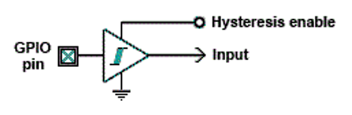

рис.6. Частина умовної еквівалентна схема GPIO в режимі входу без підтяжки

Внутрішній вузол зчитування сигналу отримує напругу з контакту GPIO відносно підключеної сигнальної землі і перетворює її на логічне значення, яке далі доступне програмному забезпеченню як цифровий сигнал `Input`. При цьому канал GPIO має дуже високий вхідний опір (сотні кілоом) і практично не впливає на зовнішнє електричне коло, аналогічно тому якби в коло було підключено вольтметр.

Вхідний вузол визначає, чи є рівень напруги логічним `0` або логічною `1`, порівнюючи напругу на контакті з певним пороговим значенням. Зазвичай цей поріг становить близько 1.8 V, але він не гарантується і може знаходитися в діапазоні між максимальним рівнем логічного `0` та мінімальним рівнем логічної `1`, тобто приблизно між 0.8 V і 2.0 V.

Для підвищення завадостійкості і запобігання коливанням сигналу під час переходів вхідний вузол може бути налаштований на роботу з гістерезисом, подібно до тригера Шмітта. За наявності гістерезису використовуються різні порогові напруги для зростаючого та спадного фронтів сигналу. Broadcom не вказує точну величину гістерезису. Гістерезис вмикається програмно керованим контактом Hysteresis enable

#### Проблема плаваючого входу

Якщо канал GPIO в режимі входу розглядати лише в базовому вигляді, як показано на рис. 6, без додаткових внутрішніх елементів, його електричний стан повністю визначається зовнішнім колом, підключеним до відповідного контакту. У випадку, коли до контакту нічого не підключено або зовнішнє коло перебуває у розімкненому стані, напруга на контакті не має визначеного значення. Такий стан називають **плаваючим входом**. У цьому стані контакт GPIO електрично «відкритий» і через дуже високий вхідний опір практично не пов’язаний ні з напругою живлення, ні з землею. Напруга на контакті може змінюватися під впливом наведень, електромагнітних завад, ємнісних зв’язків або навіть дотику до провідника. Для CMOS-логіки, до якої належать канали GPIO, така поведінка є типовою, оскільки входи мають високу чутливість і не формують власного визначеного рівня.

З точки зору внутрішнього вузла зчитування це призводить до того, що напруга може перебувати поблизу порогових значень або хаотично переходити між зонами логічного `0` і логічної `1`. У результаті програмне забезпечення може спостерігати нестабільні або випадкові значення цифрового сигналу навіть за відсутності реальних зовнішніх подій. При тривалому перебуванні входу у плаваючому стані також можливе зайве споживання енергії через внутрішні струми витоку.

Розглянемо це на прикладі мікросхеми логічного елементу AND. У CMOS-колах входи є дуже чутливими до високих напруг, які можуть виникати через статичну електрику та електричні завади, тому їх також ніколи не слід залишати у плаваючому стані. На рис.7 показано ймовірний вихід логічного елемента AND, підключеного так, як зображено на рисунку. Правильний результат наведено у стовпці «Required (A·B)», у стовпці `CMOS Output` показаний вихід, який буде в CMOS . Невикористані CMOS-входи, залишені у плаваючому стані (між + живленням і GND), можуть поступово заряджатися через струми витоку і, залежно від конструкції мікросхеми, створювати хибні вхідні сигнали або призводити до зайвого споживання енергії через протікання постійного струму (від + живлення до GND).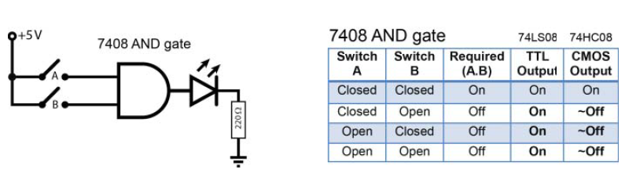

Рис.7: Логічний елемент AND із входами, які залишені у плаваючому стані, коли перемикачі розімкнені  (джерело [Molloy, Derek. *Exploring Raspberry Pi: Interfacing to the Real World*. Chichester: Wiley, 2016](http://www.exploringrpi.com))

Плаваючий вхід не є несправністю або помилкою GPIO. Це природна властивість будь-якого входу з високим опором, якщо для нього не задано означеного електричного стану. Для усунення цієї проблеми необхідно явно задати стан входу за замовчуванням, що досягається використанням підтягувальних елементів або зовнішнього джерела сигналу. Саме це розглянуто нижче.

#### Використання підтягувальних та стягувальних резисторів

Щоб уникнути плаваючих входів, застосовують **підтягувальні** (**pull-up**) або **стягувальні** (**pull-down**) резистори. Розглянемо це на прикладі підключення  елементу AND як показано на рис.8. Стягувальні (pull-down) резистори використовують у випадках, коли потрібно гарантувати, що входи логічного елемента мають низький рівень, коли перемикачі розімкнені. Підтягувальні (pull-up) резистори, відповідно, застосовують тоді, коли необхідно гарантувати високий рівень на входах при розімкнених перемикачах.

Наявність резисторів є принципово важливою, оскільки при замкненні перемикача без них утворився б короткий замикання на землю або на напругу живлення, якби замість резисторів були просто провідники. Значення підтягувальних або стягувальних резисторів також має значення: опір повинен бути достатньо малим, щоб надійно встановлювати низький або високий рівень на вході, коли перемикачі розімкнені, але водночас достатньо великим, щоб обмежити струм, коли перемикачі замкнені. В ідеальному логічному елементі вхідний опір є нескінченним, і будь-яке (не нескінченне) значення резистора було б достатнім. Проте реальні логічні елементи мають струми витоку, які необхідно компенсувати. Щоб мінімізувати споживання енергії, обирають максимально можливий опір, який усе ще забезпечує надійне встановлення потрібного рівня на вході.


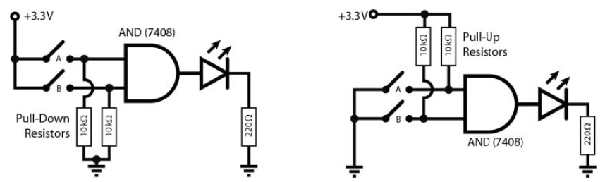

Рис. 8. Підтягувальні та стягувальні резистори, які використовуються для того, щоб перемикачі не створювали плаваючих входів (джерело [Molloy, Derek. *Exploring Raspberry Pi: Interfacing to the Real World*. Chichester: Wiley, 2016](http://www.exploringrpi.com))

Такі зовнішні резистори зазвичай є «сильними» підтягувальними резисторами, тобто жорстко фіксують вхід у високому або низькому рівні за рахунок відносно малих значень опору (наприклад, 5 кΩ–10 кΩ). Raspberry Pi має «слабкі» внутрішні підтягувальні резистори pull-up і pull-down, які можна налаштовувати за допомогою методів керування GPIO.

#### Приклад експериментального визначення величин підтягувальних та стягувальних резисторів

Можна експериментально перевірити, чи увімкнений на певному контакті внутрішній pull-up або pull-down резистор, підключивши резистор 100 кΩ між цим контактом і GND (як показано на рис. 9(a), де заштрихована область відповідає функціональності, що є внутрішньою для SoC Raspberry Pi), а потім між цим самим контактом і шиною 3,3 В (як показано на рис. 9(b)). Якщо підключити резистор з опором приблизно 100 кΩ  до контакту 16 і виміряти напругу на ньому, можна побачити, що падіння напруги дорівнює 0 В, коли резистор підключений до GND, і приблизно 2,226 В (а не 3,3 В), коли він підключений до шини 3,3 В. Це свідчить про те, що увімкнено внутрішній підтягувальний резистор pull-down, а комбінація резисторів поводиться як подільник напруги. Значення внутрішнього pull-down резистора можна оцінити, як показано на рис.9(b).

Очевидно, що для контакту 16, який відповідає GPIO23, увімкнено внутрішній підтягувальний резистор pull-down. Проте якщо виконати той самий експеримент для контакту 7, який відповідає GPIO4, буде отримано зовсім інший результат. При підключенні резистора, як показано на рис.9 (a), на резисторі 100 кΩ спостерігатиметься падіння напруги близько 2,213 В, а при підключенні за схемою рис.9 (b) напруга буде майже 0 В. Це означає, що для контакту 7 увімкнено внутрішній підтягувальний резистор pull-up. Виконання аналогічних розрахунків дає значення внутрішнього pull-up резистора приблизно 48,6 кΩ. 

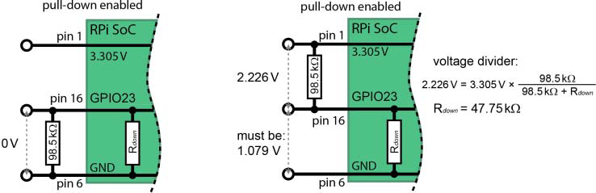

Рис. 9. Визначення значення внутрішнього підтягувального резистора pull-down із використанням резистора 100 кΩ, підключеного (a) між GPIO-контактом і GND, та (b) між GPIO-контактом і шиною 3,3 В  (джерело [Molloy, Derek. *Exploring Raspberry Pi: Interfacing to the Real World*. Chichester: Wiley, 2016](http://www.exploringrpi.com))

Поведінку ваших вхідних і вихідних схем необхідно аналізувати з урахуванням цих значень резисторів, а також мати можливість змінювати конфігурацію внутрішніх резисторів у певних випадках. Наприклад, для деяких схем може виникнути потреба повністю вимкнути внутрішні підтягувальні резистори. Також слід зазначити, що контакти 3 (GPIO2) і 5 (GPIO3) мають два постійно підключені на платі «сильні» підтягувальні резистори pull-up номіналом 1,8 кΩ. 

У таблиці 3 (див. нижче) показані значення підтяжок, означені виробником.

#### GPIO в режимі входу з підтяжками Pull-up або pull-down

На рис.10 показано умовну еквівалентну схему каналу GPIO в режимі входу з підтяжкою. На відміну від режиму без підтяжки, у цьому випадку контакт GPIO більше не є електрично «відкритим», а слабко з’єднаний з одним із потенціалів живлення через внутрішній резистивний елемент.

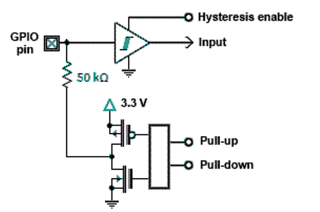

рис.10. Частина умовної еквівалентна схема GPIO в режимі входу з підтяжкою Pull-up або pull-down

Внутрішні підтягувальні елементи реалізовані у вигляді резистора великого номіналу, типово близько 50 кΩ (фактичне значення може знаходитись у діапазоні приблизно 40–100 кΩ залежно від реалізації SoC). Такий опір є значно більшим, ніж у типових зовнішніх підтягувальних резисторів, і тому ці елементи називають «слабкими» підтяжками.

Підключення або відключення підтягувальних елементів здійснюється за допомогою внутрішніх польових транзисторів, керованих конфігурацією GPIO. Елементи, показані на схемі, що відповідають за підтягування до 3.3 V або до землі, вмикаються або вимикаються внутрішніми керуючими сигналами `pull-up` та `pull-down` які керують відповідними ключами. Саме ці керуючі сигнали означують, чи буде підтягувальний резистор 50 кΩ підключений до шини живлення (режим pull-up), до землі (режим pull-down), або повністю відключений (режим без підтяжки). У нормальному режимі роботи одночасно може бути активним лише один із цих варіантів. Сигнали конфігуруються програмним чином.

У режимі pull-up контакт GPIO через внутрішній резистор з’єднується з шиною 3.3 V. За відсутності зовнішнього сигналу напруга на контакті утримується поблизу рівня логічної `1`, і внутрішній вузол зчитування сприймає вхід як встановлений у високий рівень. У режимі pull-down контакт через аналогічний резистор з’єднується із землею, що забезпечує встановлення логічного `0` за відсутності зовнішнього впливу.

Якщо до контакту GPIO підключається зовнішнє джерело сигналу з низьким вихідним опором (наприклад, кнопка, вихід іншої мікросхеми або відкритий колектор), воно легко змінює рівень напруги на контакті, долаючи дію внутрішньої підтяжки. Саме тому внутрішні підтягувальні резистори не заважають нормальній роботі зовнішніх схем.

Після подачі живлення застосовуються типові стани підтяжок за замовчуванням, які наведені в таблиці альтернативних функцій у документації Arm peripherals. Для більшості каналів GPIO певний режим підтяжки встановлений за замовчуванням.  

#### Специфікація входів

У таблиці нижче наведені різні специфікації напруг для каналів GPIO у режимі входу для виробів на базі BCM2835, BCM2836, BCM2837 і RP3A0 (наприклад, Raspberry Pi Zero або Raspberry Pi 3+). Інформацію щодо Compute Module слід шукати у відповідних технічних описах (datasheets).

Таблиця 3.

| Позначення | Параметр                          | Умови       | Мін. | Типове | Макс. | Одиниця |
| ---------- | --------------------------------- | ----------- | ---- | ------ | ----- | ------- |
| $V_{IL}$   | Вхідна напруга логічного `0`      | –           | –    | –      | 0.9   | В       |
| $V_{IH}$   | Вхідна напруга логічної `1`¹      | –           | 1.6  | –      | –     | В       |
| $I_{IL}$   | Струм витоку входу                | TA = +85 °C | –    | –      | 5     | мкА     |
| $C_{IN}$   | Вхідна ємність                    | –           | –    | 5      | –     | пФ      |
| $R_{PU}$   | Підтягувальний резистор (pull-up) | –           | 50   | –      | 65    | кОм     |
| $R_{PD}$   | Стягувальний резистор (pull-down) | –           | 50   | –      | 65    | кОм     |

1 — гістерезис увімкнено,

У таблиці нижче наведені специфікації напруг для каналів GPIO у режимі входу  виробів на базі SoC [BCM2711](https://datasheets.raspberrypi.com/bcm2711/bcm2711-peripherals.pdf) (пристрої серії Raspberry Pi 4). Інформацію щодо Compute Module слід шукати у відповідних технічних описах (datasheets). Автор лекції не знайшов опис для BCM2712, який використовується у пристроях серії Raspberry Pi 5, однак судячи з усього вони такі самі.

Таблиця 4.

| Позначення | Параметр                          | Умови       | Мін. | Типове | Макс. | Одиниця |
| ---------- | --------------------------------- | ----------- | ---- | ------ | ----- | ------- |
| $V_{IL}$   | Вхідна напруга логічного `0`      | –           | –    | –      | 0.8   | В       |
| $V_{IH}$   | Вхідна напруга логічної `1`¹      | –           | 2.0  | –      | –     | В       |
| $I_{IL}$   | Струм витоку входу                | TA = +85 °C | –    | –      | 10    | мкА     |
| $R_{PU}$   | Підтягувальний резистор (pull-up) | –           | 33   | –      | 73    | кОм     |
| $R_{PD}$   | Стягувальний резистор (pull-down) | –           | 33   | –      | 73    | кОм     |

1 — гістерезис увімкнено

### Активація та деактивація режимів входу і виходу GPIO

Кожен канал GPIO може працювати або в режимі входу, або в режимі виходу, залежно від його програмної конфігурації. Перемикання між цими режимами здійснюється шляхом увімкнення або вимкнення відповідних внутрішніх елементів каналу.

У режимі входу активним є лише внутрішній вузол зчитування логічного рівня. Вихідний підсилювальний елемент при цьому відключений, і канал GPIO не формує жодного сигналу назовні. Контакт працює як високoомний вхід, а його стан визначається зовнішнім колом або підтягувальними елементами.

У режимі виходу, навпаки, активується внутрішній елемент формування сигналу, який підключає контакт GPIO до внутрішнього джерела живлення 3.3 V або до землі, формуючи логічний `1` або `0`. Вхідний вузол зчитування при цьому або відключений, або не використовується, а контакт перестає бути високoомним.

Активація або деактивація режиму входу чи виходу відбувається програмно і зводиться до керування внутрішніми транзисторними ключами, які підключають або відключають відповідні частини каналу GPIO. Зовні ці процеси не видно, але саме вони визначають електричну поведінку контакту.

Важливо, що канал GPIO не може одночасно працювати як активний вхід і як активний вихід. У кожен момент часу активним є лише один із цих режимів. Це запобігає внутрішнім конфліктам і пошкодженню мікросхеми.

На відміну від вихідного драйвера, для вхідного вузла окремий сигнал увімкнення не показаний. Це пов’язано з тим, що вхід не формує сигнал і має високий опір, тому вважається активним завжди, коли вихідний драйвер вимкнений.

## 4. Програмне керування GPIO

Цей підрозділ описує програмні механізми керування GPIO в Linux та пояснює, як прикладні програми взаємодіють з фізичними входами і виходами Raspberry Pi.

### Загальна ідея програмного доступу до GPIO

Фізичні лінії GPIO є апаратним ресурсом SoC і не можуть використовуватися прикладними програмами безпосередньо. Усі програмні операції з GPIO в Linux виконуються через ядро операційної системи, яке надає різні інтерфейси доступу для простору користувача. Історично та на практиці ці інтерфейси відрізняються за рівнем абстракції, швидкодією та призначенням.

На програмному рівні доступ до GPIO можна умовно поділити на кілька підходів: 

- файлові інтерфейси ядра ОС; 
- спеціалізовані системні API;
- прямий доступ до апаратних регістрів GPIO; 
- бібліотеки високого рівня, які приховують деталі реалізації.

Найнижчим рівнем є прямий доступ до регістрів GPIO через `memory-mapped I/O`. У цьому випадку програмний код напряму працює з регістрами SoC, минаючи більшість абстракцій ядра. Такий підхід забезпечує максимальну швидкодію і мінімальні затримки, але потребує привілеїв, жорстко прив’язаний до конкретної апаратної платформи і практично не використовується у навчальних та прикладних сценаріях загального призначення.

Наступним рівнем є системні інтерфейси ядра Linux, які формалізують доступ до GPIO. Історично таким інтерфейсом був `sysfs`, що надає керування GPIO у вигляді файлової ієрархії. У сучасних ядрах Linux також існує `character device API`, який реалізує доступ через спеціальні пристрої виду `/dev/gpiochipN`. Обидва ці механізми є частиною ядра і працюють безпосередньо поверх драйверів GPIO.

Поверх системних інтерфейсів працюють бібліотеки та інструменти прикладного рівня. Вони беруть на себе взаємодію з ядром і надають програмісту зручніші абстракції. До таких бібліотек належать Python-бібліотеки, C-бібліотеки, а також інструменти автоматизації та low-code середовища.

У межах цієї лекції посібника використовується як базовий і доступний механізм `sysfs` , що дозволяє зосередитися на принципах програмного керування GPIO, а не на деталях конкретних бібліотек. У інших розділах можна знайти інші варіанти високорівневого керування, зокрема через Node-RED. 

### Використання sysfs для доступу для GPIO

#### Область використання `sysfs`

Інтерфейс `sysfs` є віртуальною файловою системою, змонтованою в каталозі `/sys`, через яку ядро Linux експортує інформацію про пристрої та їхні параметри. Для GPIO використовується підсистема `/sys/class/gpio`, де кожна лінія представлена набором файлів для керування напрямком та логічним рівнем.

`sysfs` для GPIO на сьогодні продовжує працювати у стандартних дистрибутивах Raspberry Pi OS і в більшості навчальних та лабораторних середовищ. Попри те, що цей інтерфейс вважається застарілим з точки зору розвитку ядра Linux, він залишається доступним і функціональним, особливо для повільних дискретних сигналів. Саме тому `sysfs` зручний для навчання:

- він не потребує додаткових бібліотек;
- з ним можна працювати напряму з командного рядка;
- він наочно демонструє взаємодію між користувацьким простором і ядром;
- він добре підходить для лабораторних робіт і експериментів.

Оскільки `sysfs` представлений у вигляді файлів, з ним можна працювати з командного рядка, з shell-скриптів, з програм на C, Python та інших мовах через стандартні файлові операції. Відкриття файлу відповідає зверненню до драйвера, читання і запис виконуються синхронно, додаткових бібліотек на базовому рівні не потрібно.

У той же час варто зауважити, що `sysfs` не призначений для високошвидкісного керування. Він має значні накладні витрати на файлові операції, відсутні гарантії часової детермінованості і він непридатний для імпульсних сигналів високої частоти.

#### Експорт GPIO

Перед використанням GPIO необхідно повідомити ядру, що конкретна лінія буде керуватися з простору користувача. Це робиться шляхом «експорту» GPIO. Експорт створює каталог `gpioN` у `/sys/class/gpio`, де `N` - це номер GPIO у нумерації SoC, а не фізичний номер контакту.

Запис числа `N` у файл `export` призводить до появи каталогу `/sys/class/gpio/gpioN`, запис числа `N` у `unexport` прибирає GPIO з користувацького доступу.

#### Налаштування напрямку

Після експорту необхідно означити напрямок роботи GPIO.

- `direction` означує, чи є лінія входом чи виходом;
- допустимі значення зазвичай `input` або `output`.

Запис `output` означає програмне керування рівнем, запис `input` означує зчитування зовнішнього стану.

#### Читання та запис значення

Файл `value` використовується для безпосередньої роботи з логічним рівнем GPIO:

- значення `0` відповідає логічному нулю;
- значення `1` відповідає логічній одиниці;
- для виходу це встановлення рівня;
- для входу це зчитування поточного стану лінії.

Читання `value` дозволяє визначити стан кнопки, датчика або іншого джерела сигналу, запис `value` дозволяє керувати світлодіодом, реле або іншим навантаженням.

## 5. Приклади підключення, контролю та керування цифровими входами та виходами GPIO

Вище ми розглянули загальні принципи роботи з GPIO як на апаратному так і на програмному рівні. У цьому пункті розглянемо на прикладах.

### Варіанти підключення навантаження до виходу

#### Пряме підключення до живлення

На прикладі керування світлодіоду можна показати основні моменти та особливості, які варто враховувати при проєктуванні систем на базі Raspberry Pi.

Спочатку ми розглянемо схему підключення світлодіоду безпосередньо до джерела живлення 3,3 В, щоб він світився постійно (рис.11). Для цього варто спочатку дізнатися електричні характеристики світлодіода. У паспорті світлодіода можна дізнатися його параметри, зокрема падіння напруги на світлодіоді (позначимо як $U_{LED1}$) та необхідний струм (позначимо $I_{LED1}$), на який він розрахований. Наприклад маємо такі характеристики світлодіода $U_{LED1}=2 \ В$ і $I_{LED1}=10\  мА$ відповідно. Для обмеження струму, нам необхідно підключити світлодіод послідовно з резистором R1. Номінал послідовного резистора визначається залишковою напругою, падіння якої на резисторі повинен забезпечити необхідну напругу на світлодіоду, тобто від напруги живлення (3.3 В) треба відняти необхідну напругу на світлодіоді $U_{LED1}$:  $U_{R1} = 3.3\ В − 2\ В = 1.3\ В$. Тепер відповідно до закону Ома, маючи напругу на резисторі та необхідний струм що має протікати по колу ($I_{R1} = I_{LED1}$) за формулою визначаємо опір $R_{R1} = U_{R1} / I_{R1} = 1.3\ В / 10\ мА,$ що дає $130\ Ом$. Якщо взяти найближчий більший стандартний номінал, наприклад 220 Ом, нічого поганого не станеться. Світлодіод у такому разі світитиме відповідно менш яскраво.

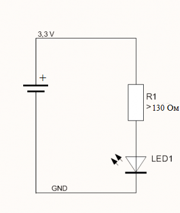 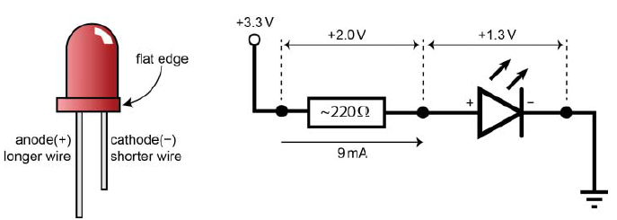

рис.11. Коло з світлодіодом 

#### Пряме підключення до GPIO

Тепер модифікуємо дану схему, щоб він керувався з GPIO-виходу (рис.12). Треба врахувати, що у драйвера цифрового виходу є обмеження на максимальний вихідний струм, про що написано вище. Припустимо, за рахунок сили виходу, ми можемо виставити 8 мА, за яких напруга на виході ще буде в межах заданої рівнем сигналу, це менше ніж 10 мА, тому світлодіод світитиме тьмяніше ніж максимально можливий. Тому треба перерахувати номінал резистора `R1`, аналогічно верхньому розрахунку  $1,3\ В / 8\ мА = 163\ Ом$. Доцільно одразу взяти резистор більшого номіналу, наприклад 330 Ом, що давало струм приблизно 4 мА. 

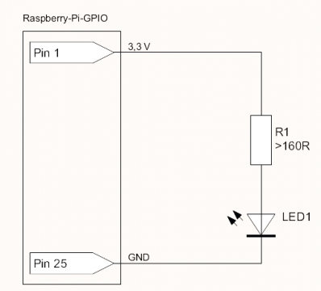

рис.12. Проста схема керування свтілодіодом ([Джерело](https://www.electroniclinic.com/raspberry-pi-led-control-using-different-techniques-complete-guide/))

#### Підключення до GPIO через транзистор

Пряме підключення кінцевого навантаження до каналу GPIO на практиці використовується рідко і лише для дуже простих випадків. Причини цього наведені вище при описі специфікації виходів:

- Канали GPIO розраховані на роботу з малими струмами. Навіть за максимальної сили виходу вони здатні віддавати або приймати лише одиниці міліампер, що недостатньо для більшості реальних навантажень.
- Вихід GPIO є джерелом напруги, а не джерелом струму. При перевищенні допустимого навантаження напруга на контакті просідає, і логічний рівень перестає відповідати специфікаціям.
- Пряме підключення навантаження підвищує ризик пошкодження мікросхеми у випадку короткого замикання, помилки монтажу або неправильного режиму роботи.
- Багато практичних навантажень (світлодіоди без обмежувальних резисторів, реле, двигуни, індуктивні елементи) потребують струмів і напруг, які значно перевищують можливості GPIO.
- Навантаження з ємнісним або індуктивним характером створюють імпульсні струми і завади, які можуть впливати на стабільність роботи всієї плати.

Тому розглянемо більш практичний приклад, у якому світлодіод не підключається безпосередньо до GPIO-контакту з напругою 3.3 V, а керується через вихід 5 V за допомогою транзистора (рис.13). Такий підхід дає можливість отримати значно більший струм, ніж дозволяють GPIO-контакти. У якості керувального елементу у прикладі використовується транзистор BC547, який досить популярний. Транзистор має трививідне виконання і розрахований на максимальний струм колектор–емітер 100 мА. Іншими словами, струм, який згодом протікатиме через підключений світлодіод, для такого транзистора є цілком допустимим.

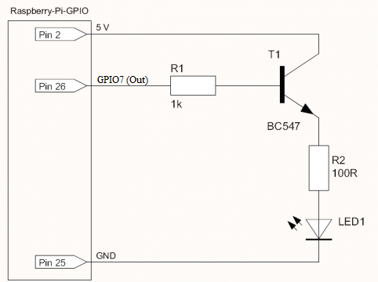

рис.13. Схема керування свтілодіодом через транзистор ([Джерело](https://www.electroniclinic.com/raspberry-pi-led-control-using-different-techniques-complete-guide/))

Вивід бази використовується для керування транзистором. Проте тут необхідно врахувати одну важливу особливість: у біполярному транзисторі, такому як BC547, ступінь відкривання транзистора означується струмом, який протікає через базу. Надто великий струм бази може пошкодити виходу Raspberry Pi, а надто малий струм не забезпечить повного відкривання транзистора. Щоб уникнути цих проблем, між GPIO-контактом і базою транзистора BC547 необхідно встановити базовий резистор R1, який обмежує струм, що протікає через базу $I_{T1B}$ який і буде тим струмом що виходить з драйвера виходу. Для точного розрахунку номіналу R1 слід звернутися до технічного опису (datasheet) транзистора BC547. У технічному описі зазвичай вказується коефіцієнт підсилення струму транзистора ($\beta$). Для BC547 мінімальне значення коефіцієнта підсилення становить приблизно $\beta = 200$. Це означає, що струм колектор–емітер на транзисторі T1  ($I_{T1K}$) може бути приблизно у 200 разів більшим за струм бази ($I_{T1B}$). Виходячи з очікуваного струму навантаження і цього коефіцієнта, можна оцінити необхідний струм бази ($I_{T1B}$) і відповідний опір резистора R1.

Якщо припустити, що для білого світлодіода потрібен струм близько $I_{LED1}=20\ мА$, а $I_{T1K} =I_{LED1} $ отримаємо:

$$I_{T1B} = I_{LED1}/\beta = 0.02\ А / 200 = 0.0001\ А = 100\ мкА$$

Типове падіння напруги на переході база–емітер біполярного транзистора коли він відкритий рівна $0.7\ В$. Тепер маючи напругу на виході драйвера 3.3V, і струм розрахуємо опір через падіння напруги

$$R_{R1}=(3.3\ V – 0.7\ V) / 0.0001\ А = 26 000\ Ом = 26\ кОм$$

Це максимальний опір, для забезпечення мінімально необхідного струму. Зменшення опору приводить до збільшення струму бази. Якщо струм бази взяти за типове обмеження сили виходу за замовченням в 2 мА, матимемо наступні розрахунки:

 $$R_{R1}=(3.3\ V – 0.7\ V) / 0.002\ А = 13 00\ Ом = 1,3\ кОм$$

Для такої простої задачі можна використати типовий базовий резистор номіналом близько 1 кОм. Такий резистор забезпечує достатній струм бази для повного відкривання транзистора і водночас не перевищує допустимий струм, який може віддати GPIO-контакт Raspberry Pi, хоча дещо перевищує силу виходу за замовченням. 

Також варто не забувати, що через світлодіод проходитиме сума струмів бази та переходу колектор-емітер.

### Приклад керування виходом GPIO

Розглянемо приклади підключення та керування виходом GPIO а в наступному пункті входом, які даються в посібнику [Molloy, Derek. *Exploring Raspberry Pi: Interfacing to the Real World*. Chichester: Wiley, 2016](http://www.exploringrpi.com). Ці приклади також можна знайти в перекладі [Взаємодія з входами та виходами Raspberry Pi ](molloy6.md)

#### Схема підключення

Приклад конфігурації виходу, показаний на рисунку 14 (a), використовує GPIO, підключений до польового транзистора (FET), для комутації електричного кола. Під час подачі напруги на затвор польового транзистора відбувається замикання віртуального «перемикача» між стоком і витоком, унаслідок чого струм починає протікати від джерела 5 В через обмежувальний резистор 220 Ом до GND через світлодіод. На рисунку 14(b) показано еквівалентну схему на біполярному транзисторі (BJT). 

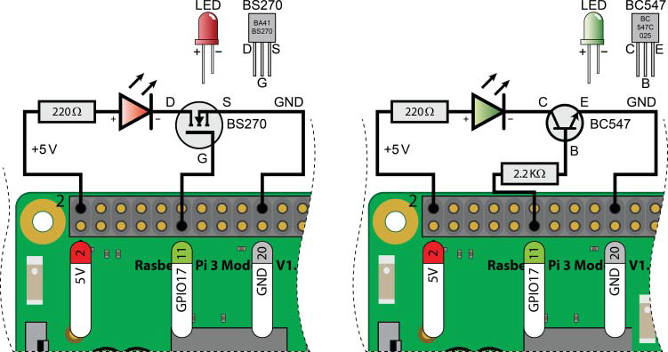

Рис. 14. Схема світлодіода на 5 В: (a) з використанням FET, (b) з використанням BJT (джерело [Molloy, Derek. *Exploring Raspberry Pi: Interfacing to the Real World*. Chichester: Wiley, 2016](http://www.exploringrpi.com))

Використання живлення 5 В в таких схемах для керування світлодіодом є безпечним, оскільки коло між стоком і витоком польового транзистора ніколи не з’єднується із затвором. 

На рис. 15 показано фактичні значення напруг і струмів, що мають місце в обох схемах. Можна побачити, що у схемі з FET на рисунку 6-3(a) струм, який джерелиться з GPIO17, є практично знехтовно малим, а напруга на затворі прикладається між затвором і витоком транзистора. На рисунку 6-3(b) резистор 2,2 кОм формує невеликий струм у базі транзистора, який визначається як

$$
I_B = \frac{3.3\ \text{В} - 0.77\ \text{В}}{2.2\ \text{кОм}}
$$
Цей струм вмикає транзистор, унаслідок чого світлодіод засвічується. Значення струму 1,15 мА цілком перебуває в допустимих межах для GPIO Raspberry Pi.

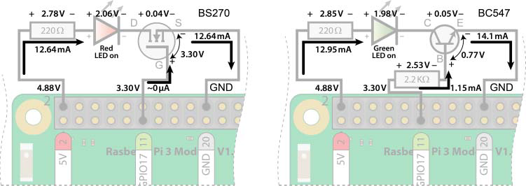

Рис. 15. Вольт-амперні характеристики схем на рисунку 6-2: (a) з використанням FET, (b) з використанням BJT (джерело [Molloy, Derek. *Exploring Raspberry Pi: Interfacing to the Real World*. Chichester: Wiley, 2016](http://www.exploringrpi.com))

#### Перевірка роботи

Після побудови схеми та підключення її до Raspberry Pi можна завантажити плату і керувати світлодіодом за допомогою термінала Linux та механізму sysfs, як це описано вище. 

Для перевірки продуктивності цього підходу в лістингу нижче наведено короткий bash-скрипт оболонки, який перемикає світлодіод з швидкістю. 

```bash
# Short script to toggle a GPIO pin at the highest frequency possible
echo 17 > /sys/class/gpio/export
sleep 0.5
echo "out" > /sys/class/gpio/gpio17/direction
COUNTER=0
while [ $COUNTER -lt 100000 ]; do
echo 1 > /sys/class/gpio/gpio17/value
let COUNTER=COUNTER+1
echo 0 > /sys/class/gpio/gpio17/value
done
echo 17 > /sys/class/gpio/unexport
```

### Дискретний вхід GPIO

Наступним застосуванням є використання GPIO як дискретного входу, що дає змогу програмному забезпеченню, яке виконується на Raspberry Pi, зчитувати стан кнопки або будь-якого іншого логічного входу з рівнями `high/low`. 

#### Схема підключення

Схема, показана на рис. 16(a), складається з нормально розімкненої кнопки (SPST), яка підключена до контакту 13 Raspberry Pi (`GPIO27`) і на якій активовано pull-down резистор. Це дає змогу при відключеному контакті кнопки тримати логічний `0` на вході приймача, а при включеному - сигналом 3.3V відбувається формування логічної `1`. 

На рис.16(b) показана схема підключення кнопки до контакту 7 (GPIO4), але з замиканням на землю та з включеним pull-up резистора. У цьому випадку при відключеному контакті кнопки на вході буде логічна `1` за рахунок активності схеми підтяжки, а при включеному вхід буде заземлятися на землю GND, тобто давати логічний `0`. Це класична схема з підтяжкою до живлення, де активний стан кнопки відповідає логічному `0`.  

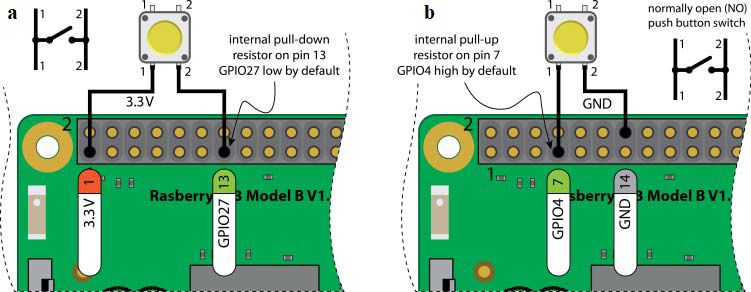

Рис. 16. Підключення кнопки до Raspberry Pi: (a) з використанням внутрішнього підтягувального резистора pull-down, (b) з використанням внутрішнього підтягувального резистора pull-up (джерело [Molloy, Derek. *Exploring Raspberry Pi: Interfacing to the Real World*. Chichester: Wiley, 2016](http://www.exploringrpi.com))

Таким чином у першому випадку (рис.16 a) ми маємо реалізацію прямої логіки, де замкнутий контакт приводить до логічної `1`, тоді як у другому (рис.16 b)  - інверсна логіка, яка при замкненому контакті кнопки дає логічний `0`    

#### Перевірка роботи

Використайте такі кроки, щоб зчитати стан кнопки (тобто 0 або 1) за допомогою термінала Linux:

```bash
pi@erpi /sys/class/gpio $ echo 27 > export
pi@erpi /sys/class/gpio $ cd gpio27
pi@erpi /sys/class/gpio/gpio27 $ ls
active_low device direction edge subsystem uevent value
pi@erpi /sys/class/gpio/gpio27 $ echo in > direction
pi@erpi /sys/class/gpio/gpio27 $ cat direction
in
pi@erpi /sys/class/gpio/gpio27 $ cat value
0
pi@erpi /sys/class/gpio/gpio27 $ cat value
1
```

Отже, значення дорівнює 1, коли кнопка натиснута, і 0, коли вона відпущена. Контакт GPIO27 приймає приблизно 64 мкА струму під час натискання кнопки. Кожного разу, коли ви вводите команду `cat value`, виконується опитування входу з метою перевірки його стану. Недоліком такого підходу є те, що зміна стану входу не буде виявлена, якщо значення не опитувати постійно.

Цікаво, що якщо не підключати нічого до GPIO4, який відповідає контакту 7, і виконати ту саму послідовність команд, буде отримано інший результат:

```bash
pi@erpi /sys/class/gpio $ echo 4 > export
pi@erpi /sys/class/gpio $ cd gpio4/
pi@erpi /sys/class/gpio/gpio4 $ cat direction
out
pi@erpi /sys/class/gpio/gpio4 $ echo in > direction
pi@erpi /sys/class/gpio/gpio4 $ cat value
1
pi@erpi /sys/class/gpio/gpio4 $ cat value
0
```

Якщо до цього входу нічого не підключено, він реєструє значення 1. Це пояснюється тим, що даний вхід підключений через внутрішній підтягувальний резистор pull-up до лінії 3,3 В. На рисунку 6-5(b) показано правильну схему підключення кнопки для такого GPIO.

## 6. Взаємодія з заживленими колами

### Задача керування заживленими колами

Raspberry Pi забезпечує живлення, необхідне для роботи власних вхідних і вихідних схем, як це було показано у попередніх прикладах. Струми, які можуть віддавати або приймати канали GPIO, обмежені характеристиками плати і призначені лише для керування, а не для живлення навантажень. Тому на практиці часто виникає потреба у взаємодії зі схемами, що мають власне джерело живлення.

Під час підключення Raspberry Pi до заживлених зовнішніх схем (наприклад, потужних світлодіодів, автомобільної електроніки, приводів воріт або інших виконавчих пристроїв) необхідно дотримуватися низки принципових вимог. Зокрема, схема не повинна допускати протікання струму в канали GPIO або з них у той момент, коли Raspberry Pi знеструмлена. Такі режими можуть призводити до небажаного живлення мікросхеми через входи або виходи (back-powering) і потенційного пошкодження плати.

Питання спільного з’єднання сигнальної землі (GND) залежить від конкретної схеми. У більшості схем керування постійним струмом спільна земля між Raspberry Pi і зовнішнім колом є необхідною умовою коректної роботи. Водночас у випадках, коли потрібна підвищена безпека або захист від несправностей зовнішньої схеми, застосовують гальванічну розв’язку, і тоді спільне з’єднання GND навмисно відсутнє.

Загалом доцільно розрізняти дві основні задачі керування заживленими колами:

- керування колами постійного струму
- керування колами змінного струму

Для керування колами постійного струму широко застосовуються транзистори, MOSFETи, драйвери та, за необхідності гальванічної розв’язки, оптопари. Оптопари дозволяють повністю розділити керувальне коло Raspberry Pi і зовнішнє силове коло, що підвищує безпеку та стійкість системи. Для керування колами змінного струму зазвичай використовуються реле або твердотільні реле. Реле також можуть застосовуватися і для комутації потужних кіл постійного струму. Нижче буде розглянуто кілька типових схем таких рішень.  

### Оптопари / оптоізолятори

**Оптопари (або оптоізолятори)** — це малі та недорогі дискретні комутаційні пристрої, які використовуються для електричної ізоляції двох кіл між собою. Це може бути особливо важливо для колів Raspberry Pi у випадках, коли існує ризик, що помилка в підключеному колі може призвести до відбору або підведення великого струму до GPIO Raspberry Pi. Такі компоненти доступні у вигляді чотирививідних корпусів типу DIP (рис.17).

Оптопара використовує світлодіодний випромінювач, розміщений поблизу фототранзистора, які відокремлені ізоляційною плівкою всередині силіконового корпусу. Коли через виводи світлодіодного випромінювача протікає струм $I_f$, світло від світлодіода падає на фототранзистор і дозволяє окремому струму $I_c$ протікати через перехід колектор–емітер фототранзистора (див. рис. 17). Коли світлодіодний випромінювач вимкнений, світло на фототранзистор не потрапляє, і струм колектор–емітер $I_c$ практично відсутній. Між двома сторонами корпусу немає електричного з’єднання, оскільки передавання сигналу здійснюється виключно за допомогою світла. Це забезпечує електричну ізоляцію до $5300 \ \text{В}_{\text{RMS}}$ для оптопари на кшталт SFH617A. Оптопари також можна використовувати з PWM-сигналами, оскільки такі сигнали мають бінарний характер (увімкнено / вимкнено).

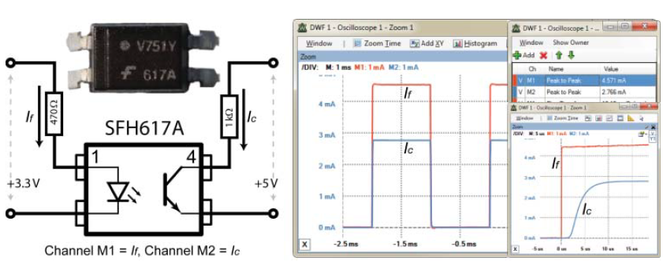

Рис. 17. Коло з оптопарою (617A) та зафіксовані вхідні й вихідні характеристики  (джерело [Molloy, Derek. *Exploring Raspberry Pi: Interfacing to the Real World*. Chichester: Wiley, 2016](http://www.exploringrpi.com))

На рис.17 також показано приклад кола з оптопарою та відповідні осцилограми для вибраних значень резисторів і напруг. Ці значення підібрані так, щоб відповідати типовим умовам використання з Raspberry Pi. Номінал резистора $470 \ \Omega$ було вибрано для того, щоб вихід $3.3 \ В$ забезпечував прямий струм світлодіода $I_f$ приблизно $4.5 \ \text{мА}$. За такого струму відповідно до документації пряме падіння напруги на світлодіоді становить приблизно $1.15 \ В$. Тоді:
$$
R = \frac{V}{I} = \frac{(3.3 \ В - 1.15 \ В)}{0.0045 \ \text{А}} = 478 \ \Omega.
$$
Отже, коло було зібране з використанням найближчого стандартного номіналу резистора — $470 \ \Omega$.

На рис.17 видно, що $I_f = 4.571 \ \text{мА}$, а $I_c = 2.766 \ \text{мА}$. Пропорційне співвідношення між цими струмами називається коефіцієнтом передавання струму (current transfer ratio, CTR) і воно змінюється залежно від рівня $I_f$ та робочої температури. Отже, передавання струму при $4.571 \ \text{мА}$ становить $60.5%$:
$$
100 \times \frac{I_c}{I_f},
$$
що узгоджується з даними документації.

Час наростання і час спаду також відповідають значенням, наведеним у документації: $t_r = 4.6 \ \mu\text{с}$ і $t_f = 15 \ \mu\text{с}$. Ці параметри обмежують максимальну частоту перемикання. Крім того, якщо для кола важливо досягти високого значення CTR, існують оптопари з вбудованими конфігураціями транзистора Дарлінгтона, які забезпечують CTR до $2000%$ (наприклад, 6N138 або HCPL2730). Нарешті, доступні також високоточні лінійні аналогові оптопари (наприклад, HCNR200 від Avago), які можна використовувати для оптичної ізоляції аналогових сигналів.

### Вихідна схема з оптопарою

На рис.18 показано вихідну схему з NPN-транзистором, увімкненим у конфігурації дарлінгтонівської пари з оптопарою для вмикання або вимикання навантаження, що живиться від зовнішнього джерела. У цьому прикладі використовується зовнішнє джерело живлення 5 В, однак може застосовуватися і вища напруга постійного струму, наприклад 24В, як це прийнято у промисловій автоматиці. Максимальний комутований струм у такій схемі обмежується характеристиками транзистора (наприклад, BC547), а не рівнем вихідного струму $I_C$ оптопари.

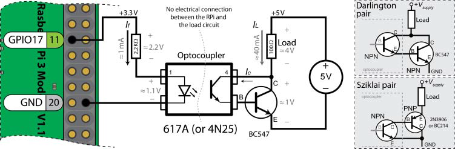

Рис. 18. Вихідна схема з оптопарою  (джерело [Molloy, Derek. *Exploring Raspberry Pi: Interfacing to the Real World*. Chichester: Wiley, 2016](http://www.exploringrpi.com))

Коефіцієнт передачі струму (CTR) оптопари 617A, який становить приблизно 0,5 при $I_f = 1\ \text{мА}$ (тобто коли GPIO17 перебуває у високому рівні), призводить до формування вихідного струму $I_C = 0{,}5\ \text{мА}$, який подається на базу транзистора BC547. Цей невеликий струм вмикає транзистор BC547, який, у свою чергу, забезпечує струм $I_L = 40\ \text{мА}$ для резистивного навантаження в цьому прикладі. Одним із недоліків такої конфігурації є те, що напруга живлення навантаження зменшується на величину $V_{CE}$ дарлінгтонівської пари (приблизно $1\ \text{В}$). Альтернативою цьому рішенню є використання пари Шіклаї, як показано на рис.18 у якій до виходу оптопари підключається PNP-транзистор. Обидві конфігурації обмежують максимальну частоту перемикання вихідного кола, як правило, до десятків кілогерц.

На відміну від 617A, оптопара 4N25 має виведений базовий контакт фототранзистора. Це дає змогу додатково встановлювати резистори між базою та емітером для покращення частотної характеристики кола.

### Вхідна схема з оптопарою

Оптопару також можна підключити до GPIO для приймання сигналу від зовнішньо живленого DC-кола, як показано на рисунку 19. Важливо, що таку схему можна адаптувати для будь-якої напруги живлення постійного струму, і вона не буде приймати струм у GPIO-вхід, коли Raspberry Pi вимкнена. Для вхідної частини оптопари необхідно вибрати значення резистора, яке обмежує прямий струм світлодіода, так щоб $I_f(\text{max}) < 60\ \text{мА}$ для оптопар 617A або 4N25.

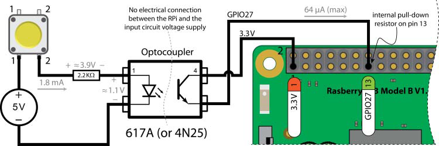

Рис. 19. Вхідна схема з оптопарою  (джерело [Molloy, Derek. *Exploring Raspberry Pi: Interfacing to the Real World*. Chichester: Wiley, 2016](http://www.exploringrpi.com))

GPIO27 за замовчуванням налаштований з внутрішнім підтягувальним резистором pull-down, тому має низький рівень, коли кнопка не натиснута. Вхідне коло GPIO Raspberry Pi на рис.16(a) приймає струм 64 мкА з GPIO27 при натисканні кнопки. Аналогічно, це є максимальний струм, який прийматиметься цим колом (коли $I_f$ і $V_f$ перевищують мінімальні значення, необхідні для роботи оптопари). Цю схему можна адаптувати для роботи зі змінною напругою DC (у певному діапазоні), використовуючи стабілізатор напруги для підтримання такого значення $I_f$, яке не перевищує $I_f(\text{max})$ для вибраної оптопари.

### Реле

Традиційні реле є електромеханічними вимикачами, які зазвичай використовуються для керування сигналами з високою напругою або великим струмом за допомогою сигналів з низькою напругою і малим струмом. Їх конструкція дозволяє малопотужному колу створювати магнітне поле, яке приводить у рух внутрішний механічний перемикач. Цей перемикач, у свою чергу, вмикає або вимикає друге коло, яке часто містить потужне навантаження постійного або змінного струму. Конкретний тип реле обирається залежно від вимог до потужності, від того, чи має навантажувальне коло бути за замовчуванням увімкненим або вимкненим, а також від кількості кіл, що комутуються паралельно.

**Електромеханічні реле (EMR)** - це  це електромеханічні комутаційні пристрої, у яких перемикання електричних контактів здійснюється за рахунок руху механічних елементів під дією магнітного поля, створеного струмом у котушці керування. Коли через котушку реле протікає струм, виникає магнітне поле, яке притягує рухомий якір і замикає або розмикає контакти силового кола (рис.20). Після зняття керувального струму пружина повертає механізм у початковий стан. Таким чином, малопотужне керувальне коло може вмикати або вимикати інше коло з вищою напругою або більшим струмом. Електромеханічні реле забезпечують гальванічну розв’язку між керувальним і силовим колами, можуть комутувати як постійний, так і змінний струм, але мають рухомі частини. Через це вони схильні до зносу, деренчання контактів під час перемикання та обмежені за максимальною частотою спрацювань. Швидке перемикання EMR також може призводити до їх перегріву. 


рис.20. Принцип роботи елетромеханічного реле (Джерело - [Вікіпедія](https://en.wikipedia.org/wiki/Relay)) 

**Сучасніші твердотільні реле (SSR)** є електронними перемикачами, побудованими на основі польових транзисторів, тиристорів та оптронів. Вони не мають рухомих частин, тому характеризуються більшим терміном служби та значно вищою максимальною частотою перемикання (приблизно до 1 кГц). Недоліком SSR є вища вартість, а також схильність до відмов, часто у стані «увімкнено», у разі перевантаження або неправильного підключення. Зазвичай такі реле встановлюють разом з радіаторами охолодження та швидкодіючими запобіжниками в колі навантаження.

І EMR, і SSR доступні у виконаннях, здатних комутувати дуже великі струми та напруги. Це робить їх особливо корисними для застосувань для керування мережевими пристроями, в автомобільній техніці для перемикання потужних ланцюгів постійного струму, а також для живлення індуктивних навантажень у робототехніці. Важливо розуміти, що роботи з мережевою напругою призначені виключно для фахівців, оскільки навіть малі струми у поєднанні з високими напругами можуть бути смертельно небезпечними. У разі будь-якої роботи з великими струмами або високими напругами, зокрема з мережею змінного струму, слід звертатися за консультацією до кваліфікованих спеціалістів.

Оскільки реле по суті є електричними вимикачами, до них застосовується та сама термінологія, що й до звичайних перемикачів. Реле може керувати одним або кількома полюсами, кожен з яких має контакти, що перемикаються під час подачі струму на котушку. Контакти реле поділяються за їх поведінкою у знеструмленому стані:

- нормально відкриті (NO, normally open) контакти у вихідному стані розімкнені і замикаються лише після спрацювання реле
- нормально закриті (NC, normally closed) контакти у вихідному стані замкнені і розмикаються після спрацювання реле

Будь-яке реле може містити один або кілька таких контактів, а конкретна конфігурація визначається кількістю полюсів і кількістю можливих положень перемикання. На практиці найчастіше використовуються такі типи контактних груп:

- SPST-NO (однополюсне однопозиційне, нормально відкрите). Реле має один контакт, який або замикає, або розмикає коло. У вихідному стані контакт розімкнений. Разом з двома виводами котушки таке реле має чотири виводи.
- SPST-NC (однополюсне однопозиційне, нормально закрите). Аналогічне попередньому, але контакт у вихідному стані замкнений. Також має чотири виводи разом із котушкою.
- SPDT (однополюсне двопозиційне). Має один спільний контакт, який перемикається між двома іншими. У кожен момент часу він з’єднаний лише з одним із них. Така конфігурація часто використовується для вибору одного з двох режимів або джерел. Разом із котушкою має п’ять виводів.
- DPST (двополюсне однопозиційне). Фактично це два незалежні контакти типу SPST, які перемикаються одночасно однією котушкою. Може використовуватися для одночасного керування двома колами. Загалом має шість виводів.
- DPDT (двополюсне двопозиційне). Містить дві незалежні контактні групи типу SPDT, що перемикаються синхронно. Такі реле використовуються для більш складних схем комутації, наприклад зміни полярності або одночасного перемикання кількох ланцюгів. Разом із котушкою має вісім виводів.

Ці самі умовні позначення контактів застосовуються як для електромеханічних, так і для твердотільних реле, оскільки вони описують логіку комутації кола, а не спосіб фізичної реалізації перемикання всередині пристрою.

У контексті Raspberry Pi та подібних одноплатних комп’ютерів найчастіше застосовуються реле з контактами SPST-NO або SPDT, оскільки вони є простими у використанні та достатніми для більшості задач керування навантаженнями.

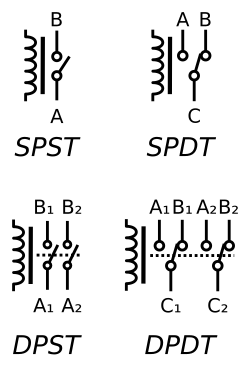

рис.21. Умовні графічні позначення реле на схемах; літера C позначає спільний контакт у реле типів SPDT і DPDT (Джерело - [Вікіпедія](https://en.wikipedia.org/wiki/Relay)) 

### Приклад використання реле

На рисунку 22(a) показано приклад схеми, яку можна використати для підключення Raspberry Pi до реле. Важливо, щоб обране реле могло перемикатися при напрузі 5 В і щоб, як і у випадку з двигуном, паралельно індуктивному навантаженню реле був встановлений захисний зворотний діод для запобігання пошкодженню польового транзистора. На рис.22(b) показаний приклад зовнішнього вигляду плати з SPDT-реле, яка дозволяє комутувати струми до 8 А при напрузі 30 В постійного струму з використанням силового реле Omron G5LE. Плата-адаптер містить транзистор BSS138, захисний діод та світлодіоди, які індикують момент спрацювання реле, тобто замикання кола, підключеного до нормально розімкненого (NO) контакту. На рисунку 22(b) також показано плату з чотирма реле.

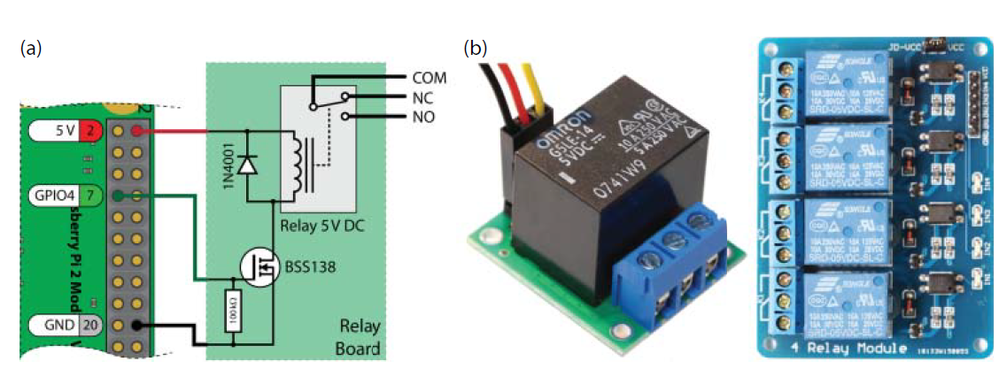

Рис.22. (a) керування реле за допомогою Raspberry Pi, (b) приклади плат-адаптерів реле (джерело [Molloy, Derek. *Exploring Raspberry Pi: Interfacing to the Real World*. Chichester: Wiley, 2016](http://www.exploringrpi.com))

Логіка схеми наведеної на рис.22 наступна: GPIO формує лише керувальний сигнал малої потужності, а реле вже перемикає окреме силове коло через свої контакти `COM/NO/NC`. Один кінець котушки підключений до 5 В, а інший підключається до землі не напряму, а через польовий транзистор BSS138, який працює як електронний ключ. Канал GPIO4 керує затвором транзистора: коли на GPIO4 логічна `1`, транзистор відкривається, струм протікає через котушку, реле спрацьовує і перемикає контакти. Коли на GPIO4 логічний `0`, транзистор закривається, струм через котушку припиняється і реле повертається у вихідний стан.

Паралельно котушці встановлено діод 1N4001 (flyback-діод). Він потрібен для захисту транзистора: при вимиканні струму в котушці виникає імпульс перенапруги (самоіндукція), і діод створює безпечний шлях для цього струму, обмежуючи напругу на транзисторі.

Резистор між затвором і землею (на рисунку показаний як 10 кΩ) утримує затвор у означеному стані `0`, коли GPIO ще не налаштований або знаходиться у високому імпедансі під час старту. Це запобігає випадковому спрацюванню реле при вмиканні Raspberry Pi.

Контакти реле `COM, NO, NC` є повністю окремим комутаційним вузлом. Вони дозволяють підключити зовнішнє коло так, щоб воно було:

- за замовчуванням розімкнене і вмикалося лише при спрацюванні (`COM–NO`)
- або за замовчуванням замкнене і розмикалося при спрацюванні (`COM–NC`)

Саме через ці контакти комутується реальне навантаження, яке може мати іншу напругу і значно більший струм, ніж може забезпечити GPIO. Тому реле тут виконує роль проміжного комутаційного пристрою між Raspberry Pi і силовим колом.

Зауважте, що схема, наведена на рис. 22, призначена лише для підключення до низьковольтних джерел живлення (наприклад, 12 В). Високі напруги становлять серйозну небезпеку для здоров’я людини, і лише належним чином підготовлені особи з відповідним захисним обладнанням та дотриманням професійних заходів безпеки повинні виконувати підключення мережевих пристроїв. Для запобігання ураженню електричним струмом або пожежній небезпеці можуть знадобитися належна ізоляція, захисні корпуси або додаткові захисні пристрої, такі як запобіжники чи автоматичні вимикачі, включно з пристроями обмеження струму та захисту від витоків на землю. Перед встановленням систем домашньої автоматизації, що працюють від мережі, слід проконсультуватися з кваліфікованим електриком.

## Джерела

1. https://www.raspberrypi.com/documentation/computers/raspberry-pi.html
1. [Molloy, Derek. *Exploring Raspberry Pi: Interfacing to the Real World*. Chichester: Wiley, 2016](http://www.exploringrpi.com)
1. http://www.mosaic-industries.com/embedded-systems/microcontroller-projects/raspberry-pi/gpio-pin-electrical-specifications
1. https://www.electroniclinic.com/raspberry-pi-led-control-using-different-techniques-complete-guide/


## Автори


Теоретичне заняття розробив [Олександр Пупена](https://github.com/pupenasan). 

## Feedback

Якщо Ви хочете залишити коментар у Вас є наступні варіанти:

- [Обговорення у WhatsApp](https://chat.whatsapp.com/BRbPAQrE1s7BwCLtNtMoqN)
- [Обговорення в Телеграм](https://t.me/+GA2smCKs5QU1MWMy)
- [Група у Фейсбуці](https://www.facebook.com/groups/asu.in.ua)

Про проект і можливість допомогти проекту написано [тут](https://asu-in-ua.github.io/atpv/)
