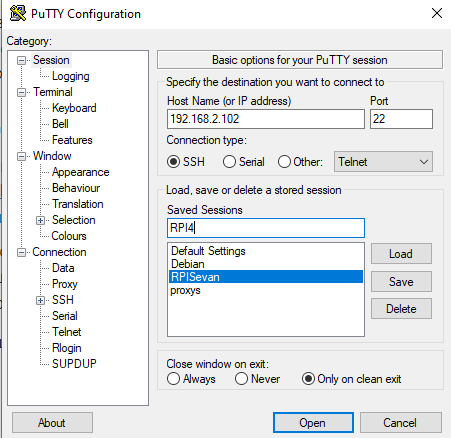
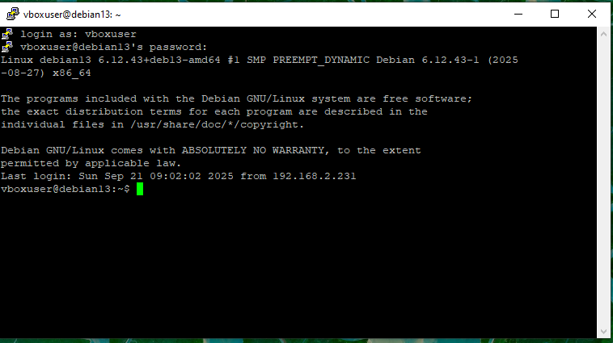
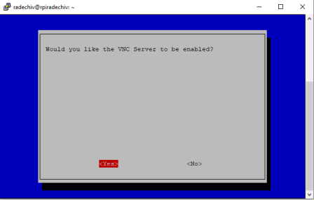
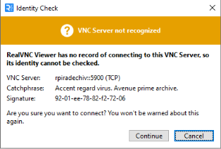

[<- До підрозділу](README.md)

# Встановлення ОС та налаштування Raspberry PI

**Тривалість**: 2 акад. години.

**Мета:** Навчитися встановлювати ОС на Raspberry PI без необхідності підключення до нього монітора та клавіатури/миші  

## Лабораторна установка 

- Апаратне забезпечення: 
  - ПК з адаптером для SD карт або вбудованим слотом для карт 
  - Raspberry PI (у прикладі Model B4) у комплекті з блоком живлення, корпусом, охолодженням та картою пам'яті

- Програмне забезпечення: усе необхідне ПЗ є безкоштовним і буде вказане в процесі проходження заняття, зокрема це `Raspberry Pi Imager`, PuTTY, Samba, VNC 

## Загальна постановка задачі

Цілі роботи: 

- встановити ОС на Raspberry PI без необхідності підключення до нього монітора та клавіатури/миші  
- встановити ПЗ, необхідне для роботи в якості сервера

## Послідовність виконання роботи

### 1. Встановлення карти в ПК 

- [ ] Встановіть MicroSD карту у відповідний порт ПК або в перехідник-адаптер. Якщо Ви маєте труднощі з розумінням як це зробити, можете почитати [цю статтю](https://uk.soringpcrepair.com/how-insert-memory-card-into-pc-or-laptop/)  

### 2. Встановлення Raspberry Pi Imager

- [ ] Завантажте Raspberry Pi Imager за [посиланням](https://www.raspberrypi.org/downloads/raspbian). 
- [ ] Запустіть інсталятор на виконання 

### 3. Встановлення образу на карту

- [ ] Запустіть Raspberry Pi Imager 


- [ ] Натисніть `Обрати пристрій` і вкажіть модель Вашого пристрою


- [ ] Натисніть `Обрати ОС` та вкажіть ОС `Raspberry Pi OS 64` 


- [ ] Натисніть `Обрати накопичувач` та вкажіть адаптер карти


- [ ] Натисніть далі, з'явиться інше вікно в якому треба зробити додаткові налаштування. Натисніть `Редагувати налаштування`


- [ ] На вкладці `Загальні` введіть ім'я пристрою, встановіть користувача та пароль для ОС, та параметри WiFi, далі перейдіть на вкладку `Сервіси` 


- [ ] На вкладці `Сервіси` встановіть опцію використання SSH з автентифікацією через пароль і натисніть `зберегти` 


- [ ] У вікні `Чи бажаєте ви прийняти налаштування ОС` натисніть `так` і в наступному вікні також `так`. Почнеться запис образу на карту.


- [ ] Дочекайтеся поки образ буде записано та перевірено і витягніть карту.

### 4. Увімкнення та пошук в мережі Raspberry

- [ ] Вставте SD карту в Raspberry та ввімкніть його.
- [ ] Дізнайтесь IP адресу Вашого Raspberry. Це можна зробити різними способами, наприклад через сканування мережі, або переглядаючи перелік вузлів в маршрутизаторі. Далі розглянемо підхід через простий перебір IP-адрес
- дізнайтеся початкову IP-адресу з пулу адрес, що видається автоматично DHCP-сервером маршрутизатору; або дізнайтеся через свою адресу на мережній карті, якщо вона видається автоматично, початкова адреса буде десь поряд;
- зробіть ping на кілька адрес в околі Вашої адреси, наприклад якщо Ваша `192.168.100.3` зробіть `ping` на діапазон адрес `192.168.100.1 - 192.168.100.5 ` (діапазон залежить від кількості пристроїв в мережі)
- якщо кілька пристроїв знайдено, дізнайтеся їх MAC адресу через `arp -a`, наприклад 


- в наведеному прикладі є три динамічні запис, в яких нас цікавить `Physical Addres` - тобто MAC-адреса. Перші три байти будуть вказувати на виробника. Перелік таких адрес можна знайти в Інтернеті, наприклад [тут](https://maclookup.app/vendors/raspberry-pi-trading-ltd).  Одна з адрес починається на`D8:3A:DD`, це і є `Raspberry Pi`    

### 5. Підключення до Raspberry по SSH 

- [ ] Завантажте Putty для своєї версії ОС за посиланням https://www.chiark.greenend.org.uk/~sgtatham/putty/latest.html . Ця утиліта дає можливість підключатися до різноманітних пристроїв в термінальному режимі.
- [ ] Запустіть `Putty`. У полі `Host Name`  впишіть IP адресу визначеної IP адреси. У полі `Saved Session` впишіть назву підключення, наприклад `RPI`, через яке Ви зможете підключатися пізніше, зробивши вибір, і натисніть `Save`. Після цього натисніть `Open` щоб відкрити сессію.   



- [ ] Перший раз при підключенні, Putty зробить попередження, натисніть `Accept` щоб погодитися.


- [ ] Відкриється вікно терміналу, введіть користувача та пароль. Зверніть увагу, що при введенні паролю, він не відображається (навіть зірочками). 



Термінал працює з використанням захищеного протоколу `ssh`, який був активований при створенні образу. Доступ по SSH можна відключити в будь який момент. При підключенні до реального пристрою з Linux, Putty дає можливість працювати в командному режимі з Windows. 

- [ ] Звантажте та встановіть WinSCP https://sourceforge.net/projects/winscp/ . Цей застосунок дає можливість підключатися до файлової системи ОС Linux через SSH та інші способи комунікації та працювати з нею через табличне представлення
- [ ] Запустіть WinSCP на виконання. У полі `Depjk`  впишіть IP адресу Raspberry, яку Ви отримали у попередньому пункті. У полях `login`  і`пароль` впишіть відповідно ім'я користувача і пароль, а збережіть налаштування за допомогою кнопки `зберегти`, щоб потім Ви змогли підключатися пізніше, зробивши вибір. Після цього натисніть `Login` щоб відкрити сесію.   


- [ ] Перший раз при підключенні як і випадку з Putty, вийде попередження, натисніть `Accept` щоб погодитися. Відкриється навігатор, в якому перейдіть на верхній рівень в кореневу директорію.


Тепер можна отримувати та записувати файли через табличне прежставлення.  

### 6. Використання Samba

**Samba** - це [пакет](https://uk.wikipedia.org/wiki/Samba) програм, які дозволяють підключатися до мережних дисків і принтерів на різних операційних системах по протоколу SMB/CIFS. Наприклад, встановлення серверу на RPI дає можливість підключатися до RPI з ОС Windows по його імені.    

- [ ] Через термінал PuTTY запустіть команду встановлення samba з репозиторію

```bash
sudo apt-get update
sudo apt-get install samba
```

- [ ] Після повідомлення про необхідне місце на диску натисніть `y` щоб підтвердити операцію. Дочекайтеся коли пакунок буде встановлено.

- [ ] з ПК зробіть пінг по імені хоста, який Ви надали при встановленні образу, наприклад

```
ping raspberry
```

- [ ] Закрийте термінал. Знову запусnіть PuTTy, але в адресі вкажіть ім'я хоста. 

Тепер замість IP адреси, яка може змінитися, Ви можете користуватися іменем хоста.

### 7. Активація VNC для підключення до робочого столу

У даному пункті необхідно активувати сервіси VNC щоб можна було доступитися до робочого столу Raspberry PI.

- [ ] У командному рядку терміналу запустіть команду  запуску опцій налаштування Raspberry

```bash
sudo raspi-config  
```


рис.. Вікно налаштувань конфігурації RPI

- [ ] За допомогою кнопок-стрілок, перейдіть до розділу `Interfacing Options` і натисніть `Enter` .
- [ ] У наступному вікні виберіть VNC та натисніть `Enter`, після чого в діалоговому вікні виберіть `Yes` та натисніть `Enter`




рис.5.7. Активацій сервісу VNC (сервер) на RPI

- [ ] Після активації сервісу з'явиться відповідне повідомлення, у якому натисніть  `Ок` 
- [ ] Щоб завершити конфігурування за допомогою клавіші `tab` перейдіть на кнопку `Finish`  і натисніть `Enter`.

### 8. Завантаження, запуск та підключення сервісу VNC-клієнта на PC-розробника 

- [ ] Завантажте RealVNCViewer з [офіційного сайту](https://www.realvnc.com/en/connect/download/viewer/ ) та запустіть його

- [ ] у полі `VNC Conect` введіть ім'я вашого Raspberry та натисніть `Enter` . У наступному вікні зробіть підтвердження `Continue`




- [ ] Під час входу необхідно ввести логін і пароль користувача.


рис. Автентифікація VNC на сервері

- [ ] після цього відкриється віддалений робочий стіл вашого Raspberry.

VNC також дає можливість підключатися до пристроїв віддалено через Інтернет.

Практичне заняття розробив [Олександр Пупена](https://github.com/pupenasan). 
