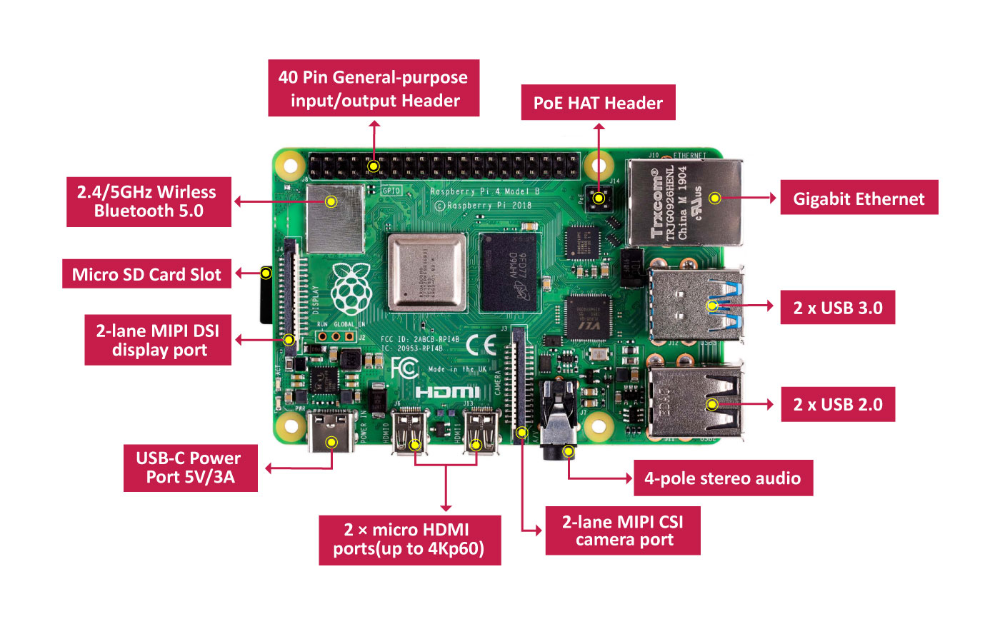
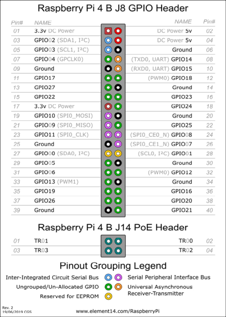

[<- До підрозділу](README.md)

# Знайомство з Raspberry PI 

[https://www.raspberrypi.org](https://www.raspberrypi.org/)

Raspberry Pi (читається як Ра́збері па́й; буквально: укр. малиновий пиріг, надалі **RPI**) — одноплатний комп'ютер, розроблений британським фондом Raspberry Pi Foundation. Головне призначення — сприяти вивченню базових комп'ютерних навичок школярами. Модельний ряд цих комп'ютерів постійно оновлюється, але їх вартість варіюється в районі 50$, що дозволяє їх використовувати у різноманітних застосуваннях у тому числі IoT. 

На рис.1 показаний зовнішній вигляд плати  Raspberry PI версії 4 без корпусу.

рис.1. Загальний вигляд Raspberry PI без корпусу.

На момент написання остання версія Raspberry Pi 5, нижче зосередимося на Raspberry Pi 4 Model B. 

На цей час існує три варіанти комплектації Raspberry Pi 4 Model B, що розрізняються між собою обсягом  оперативної пам'яті: 2G, 4G і 8G LPDDR4-3200 SDRAM. Серцем даних платформ є 4х ядерний Х64-bit Cortex-A72 Broadcom  (BCM2711B0) ARM-v8 SoC 1.5GHz процесор. У порівняні з третьою версією, на борту з'явилися два  USB порти 3.0, тепер в розпорядженні користувача два USB 2.0 і два USB  3.0 проти чотирьох USB 2.0 встановлених на Rpi 3 B/B+. Зміні піддався і HDMI роз'єм, його змінили два micro-HDMI з підтримкою роздільної  здатності 4Kp60. Так само модуль бездротового зв'язку отримав підтримку дводіапазонного Wi-Fi (стандарт IEEE 802.11ac) з підтримкою Bluetooth 5.0. І на завершення, роз'єм живлення USB-Type-C змінив свого попередника micro-USB.

В якості операційної системи, користувач може використовувати, як  Raspberry Pi OS (Raspbian) або інші збірки операційних систем засновані  на базі Linux систем.

Не варто забувати, що з новим процесором і його тактовою частотою,  зросла і робоча температура. **З цієї причини настійно рекомендується  встановлювати хороше активне охолодження.** В іншому випадку,  комп'ютер буде грітися, що своєю чергою буде приводити до не бажаних наслідків.

Важливим фактором є і джерело живлення. В якості джерела живлення варто використовувати тільки якісні блоки живлення, з характеристиками 5В -  3А. Використання неякісних блоків живлення або зарядних пристроїв  мобільних телефонів призводить до виходу з ладу внутрішнього джерела  живлення і не є гарантійним випадком! Максимальне значення вхідної  напруги живлення становить 5.5В. При вхідній напрузі 6В (навіть  імпульсному) мікросхема перетворювача напруги гарантовано вийде з ладу.  До подібного результату призведе замикання будь-якого виходу  внутрішнього перетворювача напруги на землю.

Оскільки вхідні схеми живлення виконана в спрощеному варіанті  інтерфейсу USB-C не всі блоки живлення коректно працюють з Raspberry Pi  4. У останніх редакціях міні-комп'ютера даний недолік виправлений.

На рис. 2 показані основні компоненти Raspberry PI 4 включаючи інтерфейси. Основні характеристики даної моделі:

- Процесор: 1.5 ГГц 64-бітний чотирьохядерний процесор ARM Cortex-A72
- Об'єм оперативної пам'яті: 2, 4 або 8ГБ LPDDR4 SDRAM
- Мережеві інтерфейси: 	
  - Гігабітний Ethernet з повною пропускною спроможністю інтерфейсу
  - Двохдіапазонна бездротова мережа 802.11ac
  - Bluetooth 5.0
- USB порти: 	
  - Два порти USB 3.0
  - Два порти USB 2.0
- Відеовихід: два micro-HDMI з підтримкою двох моніторів з роздільною здатністю до 4K
- Графічний інтерфейс: VideoCore VI, що підтримує OpenGL ES 3.x
- Апаратне декодування 4Kp60 відео HEVC
- Сумісність: Повна сумісність з більш ранніми продуктами Raspberry Pi
- Роз'єм живлення: USB-C
- Напруга живлення: 5В
- Додаткове живлення: Ethernet PoE Hat
- Максимальний споживаний струм: 3А
- Розширений 40-контактний роз'єм GPIO

рис.2. Компоненти Raspberry PI 4.

До базової комплектації можна віднести плату комп'ютера, блок живлення та карта MicroSD. Усе інше підбирається в залежності від задачі.  

рис.3. Базова комплектація Raspberry PI 

Підключення периферії можна проводити як через наявні інтерфейси так і через контакти роз'єму [GPIO - General-purpose input/output](https://uk.wikipedia.org/wiki/GPIO) . Призначення контактів GPIO для Raspberry PI  показано на рис.4 а також доступне [за посиланням](https://www.raspberrypi.org/documentation/usage/gpio/)

рис.4. Призначення контактів GPIO на Raspberry PI 

рис.5. Принципова схема GPIO на Raspberry PI 

рис. 6 Підключення вентилятору 

