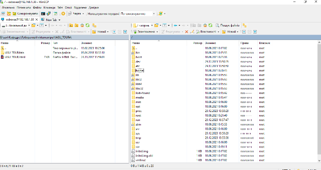

[<- До підрозділу](README.md)		[Коментувати](#feedback)

# Знайомство з Raspberry PI : теоретична частина

## 1. Про Raspberry Pi

Raspberry Pi (читається як Ра́збері па́й; буквально: укр. малиновий пиріг) — це одноплатний комп’ютер, тобто повноцінний комп’ютер, зібраний на одній платі. За логікою роботи він значно ближчий до звичного настільного ПК або ноутбука, ніж до спеціалізованих вбудованих пристроїв.

Для користувача, який уже розуміє, що таке комп’ютер, Raspberry Pi виглядає знайомо: він має процесор, оперативну пам’ять, зовнішній накопичувач для операційної системи, мережеві інтерфейси і працює під керуванням операційної системи. Після увімкнення система завантажується, запускає сервіси, дозволяє працювати з файлами, мережами та прикладними програмами. Можна підключити клавіатуру, мишу, монітор і це буде повноцінний комп'ютер хоч і з дещо обмеженими обчислювальними ресурсами.

 рис.1. Raspberry Pi в якості комп'ютеру для робочий столу

Ключова особливість Raspberry Pi полягає в тому, що це повноцінний комп’ютер загального призначення у дуже компактному форм-факторі, який працює під керуванням операційної системи. На ньому можна виконувати ті самі дії, що і на звичайному комп’ютері: працювати з командним рядком, запускати серверні служби, підключатися до мережі, встановлювати програмне забезпечення з репозиторіїв.

рис.2. Компактність Raspberry Pi

У порівнянні з мікроконтролерами, які часто згадуються в контексті електроніки та автоматизації, Raspberry Pi працює за іншим принципом. Мікроконтролер зазвичай виконує одну програму, без операційної системи, і орієнтований на пряме керування апаратурою. Raspberry Pi ж запускає операційну систему і виконує багато програм паралельно, як звичайний комп’ютер. Це порівняння важливе лише для розуміння масштабу, без заглиблення в деталі.

Модельний ряд Raspberry Pi постійно оновлюється, з’являються нові покоління плат із вищою продуктивністю, більшим обсягом пам’яті та розширеними інтерфейсами. При цьому базова ідея платформи залишається незмінною: це доступний одноплатний комп’ютер для широкого кола задач. Вартість більшості моделей Raspberry Pi перебуває в районі приблизно 50 доларів США (залежно від конкретної моделі та обсягу пам’яті). Така ціна робить можливим масове використання цих пристроїв не лише в навчальних цілях, але і в прикладних проєктах.

Завдяки поєднанню невисокої вартості та повноцінної операційної системи Raspberry Pi часто застосовують у задачах Internet of Things як локальний обчислювальний вузол або мережний шлюз. У таких сценаріях він може виконувати роль локального обчислювального вузла, шлюзу або сервісного пристрою, що збирає, обробляє та передає дані між фізичними об’єктами і мережевими сервісами.

Важливо, що в контексті IoT Raspberry Pi використовується не як сенсорний елемент, а як універсальна обчислювальна платформа, яка інтегрується з іншими пристроями та інформаційними системами.

## 2. Апаратне забезпечення

Raspberry Pi як апаратна платформа є прикладом максимально інтегрованого комп’ютера. Основні обчислювальні та допоміжні компоненти зібрані на одній друкованій платі. Розглянемо це на прикладі Raspberry Pi 5 який показано на рис.3 без корпусу. 

- У центрі плати розташований основний обчислювальний чип з підписом `Faster CPU & Dedicated Graphics Chip`. Це система на кристалі (SoC), яка виконує ту саму роль, що і процесор у звичайному комп’ютері. Саме тут виконуються програми, працює операційна система і обробляються всі обчислення. Користувач безпосередньо з цим чипом не взаємодіє, але він визначає продуктивність усієї системи. 
- Поруч видно окремий чип `PI I/O CHIP`. Його роль аналогічна чипсету або контролерам введення-виведення в ПК. Він відповідає за роботу USB, мережі та інших периферійних інтерфейсів. Для користувача це означає, що підключені пристрої з’являються в Linux як стандартні апаратні ресурси.
- Роз’єм `GIGABIT ETHERNET` на правому боці плати забезпечує дротове мережеве підключення. З точки зору операційної системи це звичайний мережевий інтерфейс, нічим концептуально не відмінний від Ethernet у настільному комп’ютері або сервері.
- Порти `FASTER USB` призначені для підключення периферії: клавіатури, миші, накопичувачів, адаптерів. Для цієї лекції важливо лише те, що USB на Raspberry Pi працює так само, як і на звичайному комп’ютері.
- Внизу плати розміщені `2 x MICRO-HDMI PORTS`. Вони дозволяють підключати один або два монітори. Це ще раз підкреслює, що Raspberry Pi може працювати як повноцінний робочий комп’ютер з графічним інтерфейсом, а не лише як «прихований» пристрій.
- Роз’єм `USB-C POWER SUPPLY` використовується для живлення плати. На відміну від класичних ПК з блоком живлення, тут вся система працює від низьковольтного джерела. Концептуально це не змінює логіку роботи комп’ютера, але накладає вимоги до стабільності живлення.
- Окремо на платі видно `POWER BUTTON` та `FAN CONNECTOR`. Кнопка живлення робить поведінку Raspberry Pi ближчою до звичайних комп’ютерів, а роз’єм вентилятора показує, що продуктивні моделі зазвичай потребують активного охолодження, як і будь-які інші комп’ютери.
- Також присутні інтерфейси PCIe та роз’єми для камери або дисплея. У цій лекції вони важливі не з точки зору підключення конкретних пристроїв, а як показник того, що Raspberry Pi є відкритою апаратною платформою з можливістю розширення, подібно до ПК.

рис.3. Загальний вигляд Raspberry PI без корпусу.

На рис.4 більш детально розписані компоненти Rasobery PI 5. Наведені нижче характеристики подано довідково для розуміння класу пристрою. Для подальших розділів лекції знання точних числових параметрів не є обов’язковим. 

- Процесор: Чотирьохядерний 64-розрядний Arm Cortex-A76 Broadcom BCM2712
- Тактова частота: 2.4 ГГц
- Додатково: криптографічні розширення
- Кеш пам'ять:
  - L2 об'ємом 512 КБ на ядро
  - загальний кешем L3 об'ємом 2 МБ.
- Графічний процесор: VideoCore VII за допомогою OpenGL ES 3.1, Vulkan 1.2
- Відео: 	
  - Вихід: HDMI® 4Kp60 із підтримкою HDR
  - Декодер: HEVC 4Kp60
- Оперативна пам'ять: LPDDR4X-4267 SDRAM (SKU 8 ГБ)
- Бездротові інтерфейси: 	
  - Двохдіапазонний Wi-Fi 802.11ac®
  - Bluetooth 5.0/Bluetooth з низьким енергоспоживанням (BLE)
- Пам'ять програм: Слот для картки microSD із підтримкою високошвидкісного режиму SDR104
- USB порти: 	
  - 2 порти USB 3.0, що підтримують одночасну роботу зі швидкістю 5 Гбіт/с
  - 2 порти USB 2.0
- Ethernet: Gigabit Ethernet з підтримкою PoE+ (потрібна окрема плата PoE+)
- 2 × 4-смуговий приймач камери/дисплея MIPI
- Інтерфейс PCIe 2.0 x1 для швидких периферійних пристроїв (потрібний окремий M.2 HAT або інший адаптер)
- Живлення: постійного струму 5 В/5 А через USB-C з підтримкою Power Delivery
- GPIO: Стандартний 40-контактний роз'єм Raspberry Pi, що підтримує інтерфейси (GPIO наведено для загального розуміння можливостей платформи, детальна робота з цими інтерфейсами розглядається в окремих лекціях і лабораторних роботах.)
  - цифрові (дискретні 0/1) входи та виходи для обміну простими логічними сигналами
  - I2C для підключення повільних периферійних пристроїв з адресацією
  - SPI для швидшого обміну даними з периферією
  - UART для послідовного обміну даними між пристроями
  - PWM (апаратна та програмна генерація імпульсів)
  - I2S / PCM для цифрового аудіо
  - 1-Wire (реалізується на рівні драйверів операційної системи з використанням звичайного GPIO-контакту)
  - сигнали живлення (3.3 V, 5 V)
  - сигнали землі (GND)
  - спеціальні службові сигнали (наприклад, для виявлення HAT-плат)
- Годинник реального часу (RTC): живлення від зовнішньої батареї.
- Керування живленням: Кнопка живлення

рис.4. Компоненти Raspberry PI 5.

Сама плата потребує як мінімум живлення та краточки пам'яті або зовнішнього SSD, однак у більшості випадків потрібен корпус, для Raspberry PI 5 з вентилятором для активного охолодження. Таким чином для типового комплекту для роботи з Raspberry потрібні:

- сама плата Raspberry PI 5
- блок живлення, звертайте увагу на сумісність саме з цією версією
- карту пам'яті MicroSD 
- корпус, бажано з активним охолодженням

рис.5. Типовий набір комплектуючих для роботи з Raspberry PI

Як зробити збірку та встановити ОС можна подивитися у відео [Raspberry PI5: збірка, встановлення ОС та первинні налаштування](https://youtu.be/82nHajeQykg) або почитати в текстовому вигляді [Встановлення ОС та налаштування Raspberry PI: практична частина](lab.md)

## 3. Операційна система для Raspberry Pi

Оскільки Raspberry Pi є повноцінним комп’ютером, для нього може використовуватися різне програмне забезпечення, включно з різними операційними системами. На концептуальному рівні це принципово відрізняє Raspberry Pi від спеціалізованих вбудованих пристроїв з фіксованою прошивкою.

Для Raspberry Pi доступно кілька класів операційних систем.

- Перший клас — спеціалізовані системи та прошивки, орієнтовані на конкретні задачі. До них належать рішення для IoT, мультимедіа, мережевих сервісів або промислових застосувань. Такі системи зазвичай мінімізовані, не мають повноцінного графічного інтерфейсу і часто сприймаються користувачем як «прошивка». Проте за своєю суттю це все одно операційні системи, які запускаються на стандартному апаратному забезпеченні Raspberry Pi.

- Другий клас — універсальні операційні системи загального призначення. Найпоширенішими серед них є Linux-дистрибуції. Вони забезпечують повний набір можливостей сучасної ОС: багатозадачність, користувачів, файлові системи, мережу та стандартні програмні інтерфейси.

- Найчастіше на Raspberry Pi використовується Debian-сумісна операційна система, спеціально адаптована під цю платформу з назвою `Raspberry Pi OS`. Вона доступна у варіантах з графічним середовищем (desktop) та без нього, що дозволяє використовувати Raspberry Pi як робочий комп’ютер або як серверний чи вбудований вузол без підключеного монітора. Доступні як 32-розрядні, так і 64-розрядні версії операційної системи. Вибір між ними залежить від моделі Raspberry Pi, обсягу оперативної пам’яті та вимог до програмного забезпечення. З точки зору користувача це аналогічно вибору архітектури операційної системи на звичайному комп’ютері.

Для встановлення стандартної Raspberry Pi OS на карту Micro-SD пропонується використовувати спеціальне ПЗ з назвою Raspberry Pi Imager, яке безкоштовно завантажується з офіційного сайту за [посиланням](https://www.raspberrypi.org/downloads/raspbian). Таким чином користувач спочатку встановлює один з доступних  образів ОС на Micro-SD картку на своєму ПК, а  після встановлення вставляє її в Raspberry PI. Перед встановленням образу користувач задає назву пристрою, ім'я та пароль користувача, за необхідності назву та пароль доступу до WiFi-мережі, активує доступ до SSH та інші налаштування. Процес встановлення як правило займає кілька хвилин (залежить від типу картки та накопичувача). Як встановити ОС можна подивитися у відео [Raspberry PI5: збірка, встановлення ОС та первинні налаштування](https://youtu.be/82nHajeQykg) або почитати в текстовому вигляді [Встановлення ОС та налаштування Raspberry PI: практична частина](lab.md) 

Далі з Raspberry можна працювати як з використанням клавіатури, миші та монітору, так і через мережу як до серверного пристрою. Якщо встановлена ОС з робочим столом (рис.6), то з Raspberry комфортно працювати навіть недосвідченим користувачам, тим більше що є підтримка української мови.   

рис.6. Робочий стіл Raspberry PI OS Desktop 

## 4. Робота з Raspberry PI як з мережним пристроєм

Якщо Raspberry Pi використовується як мережний серверний пристрій, що є типовим для промислових і IoT-застосувань, він зазвичай працює без підключеного монітора, клавіатури та миші. У такому режимі критично важливим стає програмне забезпечення для віддаленого доступу та адміністрування.

Найчастіше використовуються такі засоби:

- Сервіс Samba. Samba дозволяє Raspberry Pi виступати як мережевий файловий сервер у локальній мережі. У цьому режимі каталоги Raspberry Pi можуть бути доступні з інших комп’ютерів так само, як мережеві диски. Це особливо зручно в навчальних або промислових середовищах, де Raspberry Pi інтегрується в існуючу ІТ-інфраструктуру на рівні файлового обміну.
- SSH-клієнти для віддаленого доступу до командного рядка. SSH є базовим інструментом адміністрування Linux-хостів. Через нього виконується налаштування системи, керування сервісами, оновлення ПЗ та діагностика. Одним з поширених SSH-клієнтів у середовищі Windows є безкоштовна утиліта PuTTY (рис.7). Детальніше можна почитати в [SSH (Secure Shell): теоретична частина ](../../nets/debug/ssh.md)
- Файлові менеджери. Файлові менеджери використовуються для передачі файлів між комп’ютером користувача і Raspberry Pi по захищених протоколах (SCP або SFTP поверх SSH), одним з таких є WinSCP (рис.8). Це зручний інструмент у середовищі Windows, який дозволяє працювати з файловою системою Raspberry Pi у вигляді двох панелей, подібно до класичних файлових менеджерів. Концептуально WinSCP не є чимось специфічним для Raspberry Pi, а лише клієнтом до стандартних серверних механізмів Linux. Детальніше можна почитати в [SSH (Secure Shell): теоретична частина ](../../nets/debug/ssh.md)
- Засоби віддаленого доступу до графічного середовища. У випадках, коли Raspberry Pi використовується з desktop-оточенням, можуть застосовуватися протоколи віддаленого робочого столу. Вони дозволяють працювати з графічним інтерфейсом так, ніби користувач знаходиться безпосередньо біля пристрою. Дуже популярними є служби та клієнти VNC, які дозволяють підключатися навіть через Інтернет без виділеної адреси IP. 
- Веб-інтерфейси сервісів. У багатьох серверних та промислових сценаріях прямий доступ до ОС взагалі не потрібен. Керування здійснюється через веб-інтерфейси прикладних сервісів, які працюють на Raspberry Pi. У цьому випадку сам пристрій виступає як мережний сервер, а браузер є основним інструментом доступу.

Варто відмітити, що Raspberry Pi у серверному режимі адмініструється так само, як будь-який інший Linux-сервер. Використовуються стандартні мережеві протоколи та інструменти, а вибір конкретного ПЗ для віддаленого доступу залежить не від Raspberry Pi, а від операційної системи і середовища, з якого підключається користувач. Як зробити віддалено можна зв'язатися з Raspberry PI можна подивитися у відео [Raspberry PI5: збірка, встановлення ОС та первинні налаштування](https://youtu.be/82nHajeQykg) або почитати в текстовому вигляді [Встановлення ОС та налаштування Raspberry PI: практична частина](lab.md) 

рис.7. Підключення PuTTy

рис.8. Зовнішній вигляд WinSCP

## 5. Типові сценарії використання та межі застосування

У цій лекції Raspberry Pi розглядається не як апаратна плата, а як обчислювальна платформа. Тому сценарії використання доцільно описувати через ролі, які він виконує в системі, незалежно від конкретних інтерфейсів або підключеного обладнання.

У ролі сервера Raspberry Pi використовується як постійно увімкнений вузол, що надає мережеві сервіси. Це можуть бути веб-сервіси, бази даних, брокери повідомлень, файлові сервери або допоміжні інфраструктурні компоненти. У такому режимі Raspberry Pi зазвичай працює без графічного інтерфейсу і адмініструється віддалено, як класичний Linux-сервер.

У ролі клієнта Raspberry Pi може виступати як кінцевий вузол, що підключається до інших систем або сервісів. Це може бути операторська станція, термінал доступу або прикладна система, яка взаємодіє з серверною інфраструктурою. У цьому сценарії він може працювати як з графічним інтерфейсом, так і без нього, залежно від задачі. Підключення монітора через HDMI та клавіатури з мишою (або сенсорний екран) робить з нього повноцінний графічний термінал. 

У ролі шлюзу Raspberry Pi часто використовується в IoT та промислових системах як проміжна ланка між різними мережами або протоколами. Він може збирати дані з локальних пристроїв, виконувати попередню обробку і передавати інформацію у вищі рівні системи. Концептуально це роль edge-вузла, який поєднує фізичний рівень з ІТ-інфраструктурою.

Як експериментальна платформа Raspberry Pi зручний для навчання, прототипування і перевірки архітектурних рішень. На ньому можна швидко розгорнути операційну систему, сервіси та прикладне програмне забезпечення, не прив’язуючись до конкретного виробника або промислового обладнання. У цьому сенсі Raspberry Pi часто використовується як модель реальної системи в зменшеному масштабі.

Попри універсальність, Raspberry Pi не є універсальним рішенням для всіх задач. Він добре підходить для сценаріїв, де потрібен компактний, недорогий і гнучкий обчислювальний вузол з повноцінною операційною системою. Водночас Raspberry Pi не призначений для задач жорсткого реального часу, де критичні точні часові інтервали і гарантована затримка виконання. У таких випадках доцільніше використовувати мікроконтролери або спеціалізовані промислові контролери. 

Також Raspberry Pi має обмеження з точки зору надійності та масштабованості. Він не розрахований на важкі обчислювальні навантаження, великі обсяги даних або безперервну роботу в агресивних промислових умовах без додаткових заходів. У таких випадках доцільно використовувати промислові комп’ютери або спеціалізовані контролери, які забезпечують вищу надійність, але мають значно більшу вартість.

## Джерела

1. [https://www.raspberrypi.org](https://www.raspberrypi.org/)

## Автори

Теоретичне заняття розробив  [Олександр Пупена](https://github.com/pupenasan). 

## Feedback

Якщо Ви хочете залишити коментар у Вас є наступні варіанти:

- [Обговорення у WhatsApp](https://chat.whatsapp.com/BRbPAQrE1s7BwCLtNtMoqN)
- [Обговорення в Телеграм](https://t.me/+GA2smCKs5QU1MWMy)
- [Група у Фейсбуці](https://www.facebook.com/groups/asu.in.ua)

Про проект і можливість допомогти проекту написано [тут](https://asu-in-ua.github.io/atpv/)
