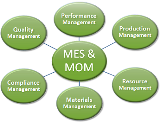

 [Зміст](../contents.md)

# Основи керування виробничими операціями MOM

- [Функції та загальні принципи побудови ІАСК виробництвом](integr/README.md)

- [Стандарти інтегрування. Основні моделі](aboutstandard/README.md)

- [Функціональна та технічна структура MOM](structure/README.md)

- [Модель керування операціями основного виробництва](model/README.md)

- [Означення устатковання](equipment/README.md)

- [Означення продукту](product/README.md)

- [Детальне календарне планування](schedule/README.md)

- [Збір даних, диспетчерування та керування виконанням](tolelevel2/README.md)

- [Аналіз ефективності](efectiv/README.md)

