# Керування переміщенням 

Це переклад презентацій Chooi. AC500 V3 General Motion Control. Presentation. ABB Global Technical Support, July 2024.

## Що таке керування переміщенням?

### Огляд

Керування переміщенням означає «керувати рухом», тобто керування положенням, швидкістю та прискоренням, яке забезпечує роботу сучасного високоавтоматизованого фізичного світу.

Керування переміщенням може бути з **розімкненим контуром** (**Open Loop**) або із **замкненим контуром** (**Closed Loop**).

- У системах з розімкненим контуром контролер надсилає команду і не знає, чи було досягнуто бажаний рух.

- Для точного керування до системи додають вимірювальний пристрій, сигнал з якого передається назад до контролера, і контролер компенсує похибку. У такому випадку система стає системою із замкненим контуром.

### Closed Loop

Керування переміщенням із замкненим контуром забезпечує такий рух машини:

- Точний. Модуль типу Pick & Place зазвичай отримує команди переміщення до точно визначених позицій, щоб забезпечити коректне встановлення пакетів або компонентів. Необхідна точність визначається вимогами застосування, і точність позиціювання на рівні міліметрів є типовою.

- Повторюваний. Для забезпечення якості продукції та надійності компоненти повинні встановлюватися з жорсткими допусками, тобто однаково. Контролери керування переміщенням зазвичай виконують переміщення до кількох позицій під час виготовлення кожної деталі. Система повинна бути здатна повторювати ці самі рухи для кожної деталі.

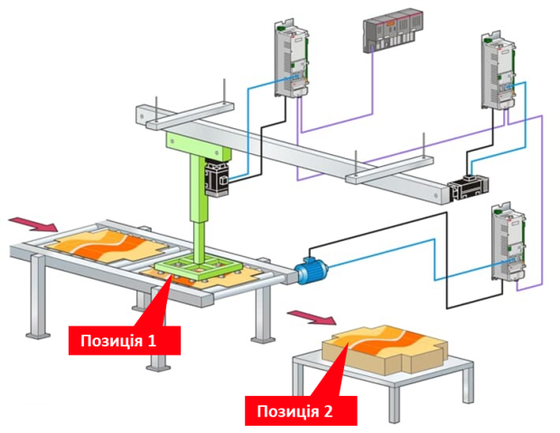

### Стандартні приводи та позиційні серводи із замкненим контуром

Часто виникає запитання, у чому різниця між «стандартним приводом» і «позиційним сервоприводом із замкненим контуром»?

Зазвичай:

- У застосуваннях зі стандартним приводом основним параметром керування є швидкість.
- У застосуваннях із позиційним сервоприводом із замкненим контуром основним параметром керування є положення.

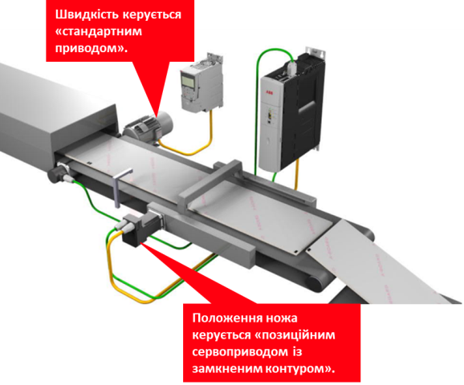

## Застосування керування переміщенням

### Ротаційний ніж

Це типове застосування керування переміщенням у пакувальних і переробних машинах, де безперервна стрічка матеріалу повинна розрізатися на однакові відрізки. 

Матеріал рухається по транспортеру з постійною або змінною швидкістю. На матеріалі нанесені реєстраційні мітки, які визначають точне місце, де потрібно виконати різання. Датчик зчитує ці мітки і передає сигнал у систему керування. Контролер керування переміщенням обчислює положення матеріалу та формує траєкторію руху ножа. Ніж обертається за заданим профілем швидкості: перед контактом з матеріалом він прискорюється, у момент різання його швидкість синхронізується зі швидкістю руху матеріалу, після чого ніж знову змінює швидкість для підготовки до наступного циклу.

Таким чином досягається точне позиціювання точки різання, навіть якщо швидкість подачі матеріалу змінюється. Це дозволяє забезпечити стабільну довжину виробу та високу продуктивність машини.

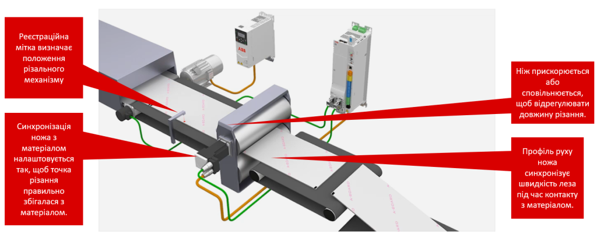

[Відео](https://youtu.be/aMgRKM025Ds?si=xs9OKoXcZCRv_lMB)

### Лінійний ніж

Це інший тип системи різання, який часто використовується у пакувальних, текстильних або паперорізальних машинах. На відміну від ротаційного ножа, різальний інструмент тут переміщується лінійно вздовж напрямку руху матеріалу.

Матеріал рухається транспортером. На ньому нанесені реєстраційні мітки, які визначають точку різання. Датчик фіксує мітку і подає сигнал у систему керування, що запускає цикл різання. Після запуску циклу привід ножа починає рух і прискорюється до швидкості руху матеріалу. Коли швидкості ножа і матеріалу стають однаковими, відбувається різання. У цей момент відносне переміщення між ножем і матеріалом практично відсутнє, що забезпечує точний і чистий розріз.

Після завершення операції вісь ножа зупиняється і повертається у початкове положення, щоб підготуватися до наступного циклу. Така схема забезпечує точне різання навіть при безперервному русі матеріалу.

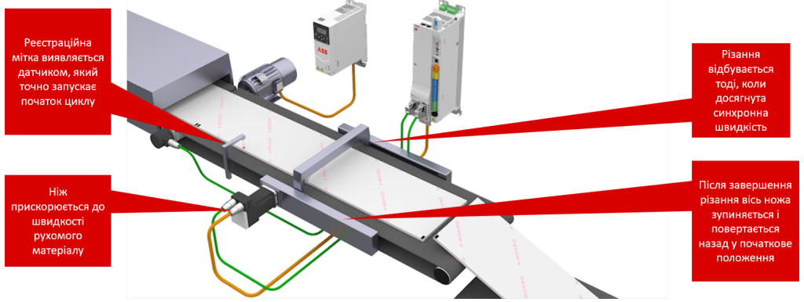

[Відео](https://youtu.be/7Ne4BYEVKdk?si=e-qd9-9kdYqz6-Oa)

### Рознесення продуктів

Це застосування використовується для керування відстанню між продуктами на конвеєрі. У багатьох пакувальних і сортувальних машинах продукти надходять на лінію нерівномірно або з недостатнім інтервалом. Перед наступною технологічною операцією їх необхідно вирівняти і створити між ними задану відстань.

Датчики фіксують появу продукту на транспортері і визначають момент, коли передній край виробу проходить контрольну точку. Одночасно енкодер вимірює положення циклу на вихідному транспортері, який виступає як опорна вісь системи. На основі цих даних система керування переміщенням синхронізує рух стрічок транспортування. Синхронізуюча стрічка змінює свою швидкість, щоб трохи прискорити або сповільнити продукт і тим самим скоригувати його положення відносно інших продуктів.

Як правило, використовується кілька послідовних стрічок фазування. Кожна з них виконує невелику корекцію положення. Такий підхід дозволяє поступово сформувати необхідний інтервал між виробами без різких змін швидкості та без ризику пошкодження продукту.

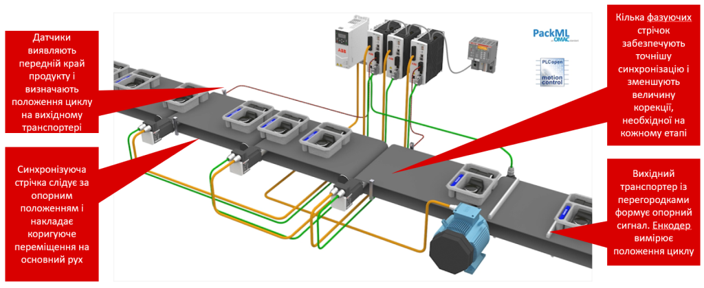

[Відео](https://youtu.be/_KNkrZHbdjQ?si=VlyhDgOl4ZI_0AZw)

### Маркування продуктів

Це типове застосування систем керування переміщенням у лініях маркування продукції. Завдання системи полягає в тому, щоб точно наклеїти етикетку на кожен виріб, який рухається конвеєром.

Продукти рухаються по транспортеру, а подаючий шнек формує між ними однакові інтервали. Це необхідно для того, щоб кожен виріб займав передбачуване положення відносно етикетувального механізму. Датчик продукту визначає момент, коли передній край виробу проходить контрольну точку. На основі цієї інформації система керування обчислює момент подачі етикетки. Вісь етикетувального механізму подає стрічку з етикетками на точно визначену довжину. Датчик етикетки контролює положення кожної етикетки на стрічці та забезпечує її правильне позиціювання перед нанесенням.

У результаті етикетка синхронізовано подається і наноситься на продукт у точному місці навіть при безперервному русі конвеєра.

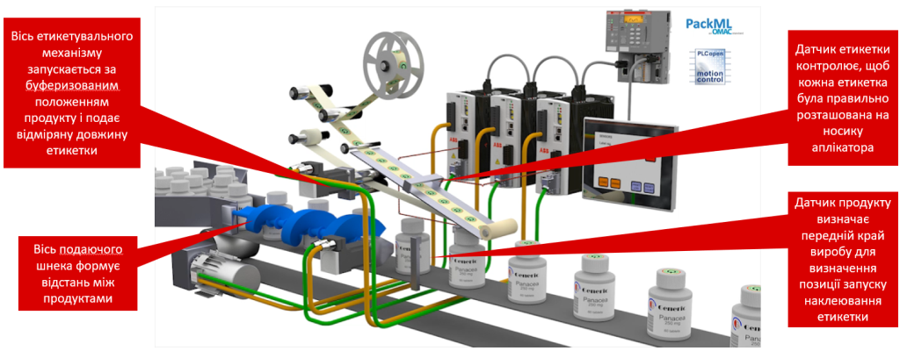

[Відео](https://youtu.be/-AeRM6WIA9E?si=MrXoihD-jWLoqMZX)

### Горизонтальна машина формування, наповнення та запаювання (flow-wrapper)

Це типовий приклад застосування керування переміщенням у пакувальних машинах типу flow-wrapper, які використовуються для упаковки харчових продуктів, кондитерських виробів, печива, батончиків тощо.

Продукт подається в машину транспортером через вісь подачі. Одночасно з рулону подається пакувальна плівка, яка формує оболонку навколо виробу. Для забезпечення правильного положення надрукованого зображення на упаковці використовується датчик реєстраційної мітки. Він визначає положення друку на плівці і передає цю інформацію у систему керування. Вісь нижнього запаювання формує поздовжній шов пакета і подає плівку вперед. Під час роботи система може коригувати положення плівки, щоб друк на упаковці залишався правильно вирівняним відносно продукту. Далі вісь поперечного запаювання синхронізується з рухом продукту і плівки. У потрібний момент вона одночасно виконує дві операції: розрізає плівку між виробами і формує поперечний шов пакета за допомогою нагріву або тиску.

Таким чином кілька осей руху працюють синхронно: подача продукту, подача плівки і механізм запаювання. Система керування переміщенням забезпечує точну координацію цих рухів, що дозволяє отримувати однакові пакети навіть при високій швидкості роботи машини.

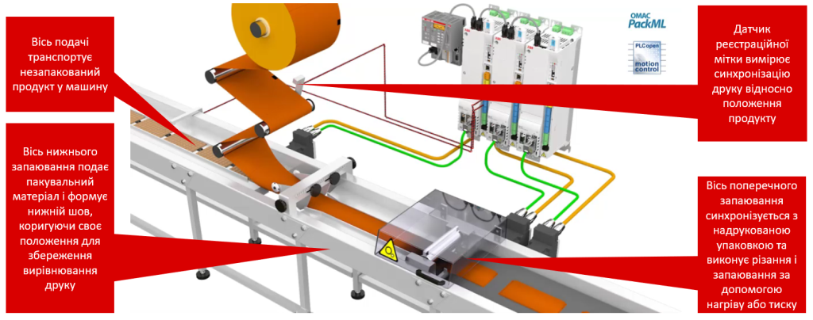

[Відео](https://youtu.be/6WD5uDIrabE?si=LbYdNYqmBTltjXjj)

### Вертикальна машина формування, наповнення та запаювання

Це приклад роботи вертикальної пакувальної машини типу VFFS (Vertical Form Fill Seal), яка широко використовується для пакування сипучих або дрібноштучних продуктів, наприклад цукерок, горіхів, чипсів, круп або інших харчових виробів.

Пакувальна плівка подається з рулону і проходить через формувальний вузол, де з неї утворюється трубка. Далі виконується поздовжнє запаювання, яке формує вертикальний шов пакета. Після формування пакета продукт подається зверху через дозувальний механізм і падає всередину упаковки у точно визначений момент циклу. Система керування переміщенням синхронізує рух плівки з операціями запаювання та різання. Для цього використовуються реєстраційні мітки, нанесені на пакувальний матеріал. Датчик зчитує ці мітки і дозволяє вирівнювати надруковане зображення на упаковці з положенням шва та лінією різання. Під час запаювання та різання механізм виконує профільований рух, щоб синхронізувати швидкість руху плівки та різального механізму. Після завершення операції швидкість змінюється, щоб підготувати систему до наступного циклу пакування.

У результаті машина може безперервно формувати, наповнювати та запаювати пакети з високою точністю і продуктивністю.

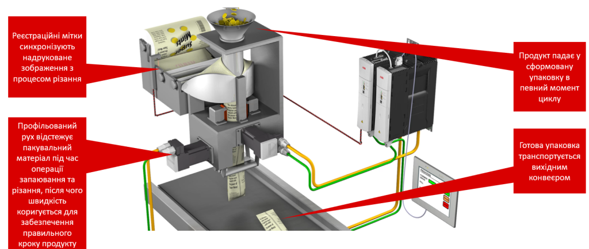

[Відео](https://youtu.be/Z2OS-X9fQOE?si=10KcJ_20l03kdQt3)

## Термінологія керування переміщенням

### Вісь (Axis)

Вісь (Axis) - основний напрямок, уздовж якого відбувається переміщення інструмента або заготовки. Термін *вісь* також означає одну з опорних ліній декартової системи координат.

У системах керування переміщенням осі зазвичай позначаються відповідно до функції, яку вони виконують, як показано нижче.

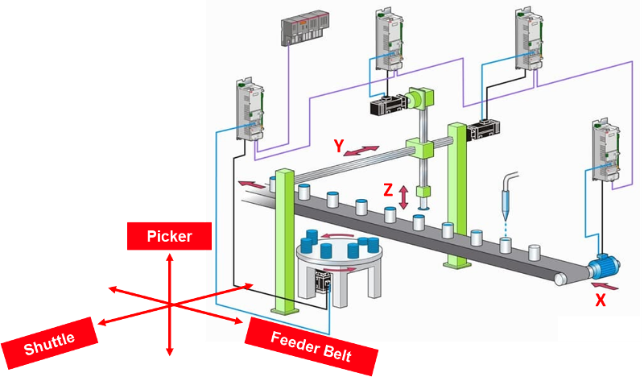

Picker — захват (механізм захоплення), Shuttle — каретка, Feeder Belt — подавальний конвеєр (подаюча стрічка)

### Лінійна вісь

Лінійна вісь (Linear Axis) - по суті, переміщується вздовж прямої лінії, зазвичай вперед і назад. Зазвичай має визначену довжину ходу.

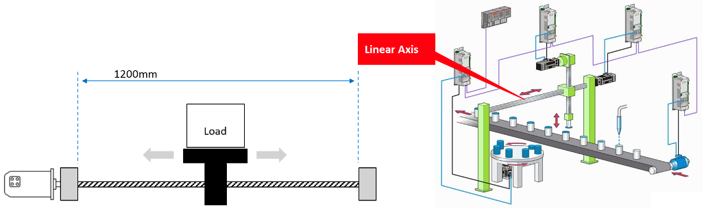

### Обертальна вісь

Обертальна вісь (Rotary Axis) - обертається навколо центральної точки. Типові застосування включають ротаційний ніж або індексний стіл.

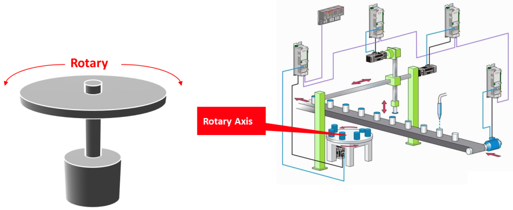

### Одиниці вимірювання

Одиниці вимірювання (Units) Використовуються контролерами руху для визначення параметрів переміщення осі. Зазвичай вони вибираються так, щоб надавати зрозумілу та корисну інформацію операторам машини.

Типові одиниці, які використовують контролери руху для визначення переміщення лінійних і обертальних осей, наведені нижче. Багато контролерів руху дозволяють користувачу налаштовувати власні одиниці вимірювання.

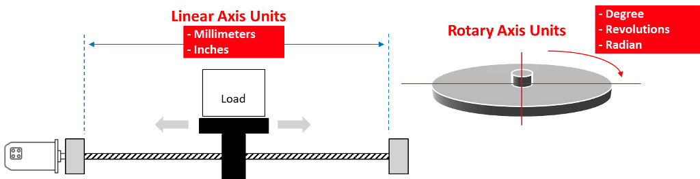

### Швидкість, прискорення, уповільнення  

**Швидкість (Velocity)** — це більш технічний термін для позначення швидкості. Швидкість є мірою відстані, пройденої за одиницю часу. Для автомобіля одиницями швидкості є кілометри за годину (км/год). У задачах керування рухом типовими одиницями швидкості для лінійних осей є міліметри за секунду. Для обертальних осей одиниці швидкості включають градуси за секунду та оберти за секунду.

**Прискорення (Acceleration)** — це додатна зміна швидкості за одиницю часу. Виробники автомобілів зазвичай вказують, як швидко автомобіль може розігнатися (наприклад, 0–60 км/год за 8 секунд). Таке прискорення можна записати так:
(0,0167 км/с) / 8 с = 0,0021 км/с² (тобто ці одиниці були б малозрозумілими).

У машині, однак, якщо вісь змінює швидкість від 0 до 10 одиниць/с за 5 секунд, тоді:
(10 одиниць/с) / 5 с = 2 одиниці/с² (тобто такі одиниці є більш зручними для використання).

**Уповільнення (Deceleration)** — це від’ємна зміна швидкості за одиницю часу.

### Профілі циклу машини

Профілі циклу машини (Machine Cycle Profiles), як показано тут, створюються для визначення профілю швидкості для певної осі.

Профілі циклу чітко визначають фазу прискорення**, **фазу руху з постійною швидкістю та фазу уповільнення під час переміщення осі.

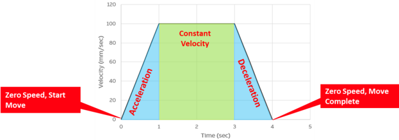

### Unwind

Велика частка застосувань обертальних осей є безперервними (вісь продовжує обертатися в одному й тому самому напрямку).

Зазвичай операторів цікавить кутове положення осі в межах від 0 до 360 градусів, а не загальна кутова відстань, пройдена за багато обертів.

У таких випадках контролери руху можуть бути налаштовані так, щоб обнуляти значення позиції при досягненні заздалегідь визначеного положення. Це попередньо визначене положення називається **позицією розгортання (Unwind position)**.

Unwind також відоме як Rollover (перехід через нуль / циклічне обнулення).

| **Revolutions Traveled** | **Axis Position (Unwind set to  360°)** | **Axis Position (Unwind disabled)** |
| ------------------------ | --------------------------------------- | ----------------------------------- |
| 1.5                      | 180°                                    | 540°                                |
| 2.5                      | 180°                                    | 900°                                |
| 3.5                      | 180°                                    | 1260°                               |

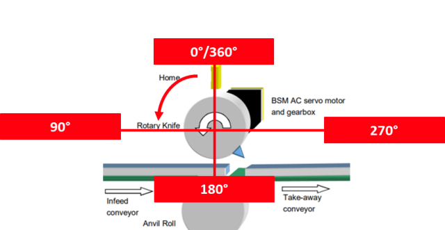

### Крутний момент

**Крутний момент (Torque)** — це сила, що викликає обертання або закручування.

Це момент сили; міра здатності сили створювати кручення та обертання навколо осі. Він дорівнює векторному добутку радіус-вектора (плеча важеля) від осі обертання до точки прикладання сили та вектора сили.

Крутний момент (Н·м) = Сила (Н) × Довжина плеча важеля (м)

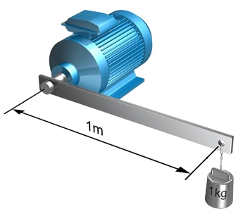

## Апаратні засоби керування рухом

**Сервоприводи** (**Servo Drives**) - Інтерпретують командний сигнал контролера руху і керують швидкістю та крутним моментом двигуна, змінюючи напругу та струм.

**Серводвигун із зворотним зв’язком** (**Servo Motor with Feedback**) - Серводвигун перетворює електричну енергію в обертальний рух. Пристрої зворотного зв’язку надають фактичні дані про положення, які використовуються контролером руху для забезпечення точності. Типи зворотного зв’язку:

- Енкодери
  - Абсолютні (зберігають положення осі при втраті живлення)
  - Інкрементальні (втрачають інформацію про положення осі при втраті живлення)
- Резольвери (дуже міцні та надійні)
- Stegmann Hyperface (абсолютний енкодер із зворотним зв’язком високої роздільної здатності)

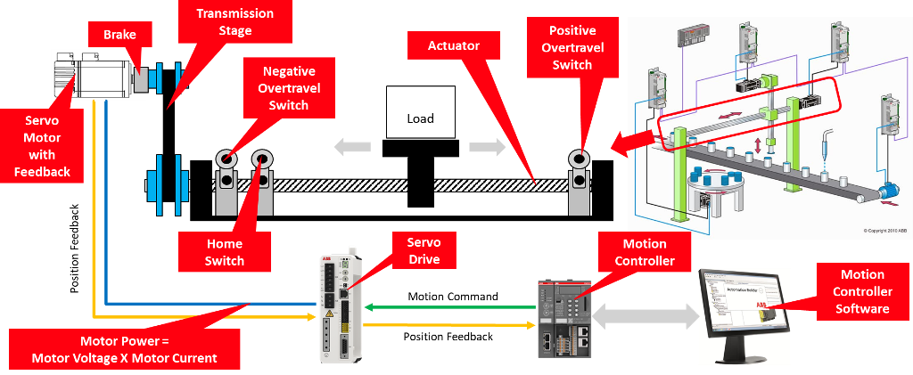

**Актуатори (Actuators)** - Перетворюють обертальний рух на лінійний. Типовим типом актуатора, який використовується в промисловості, є гвинтова передача з кульковою гайкою (ball screw). Коли двигун обертається, гвинт обертається і переміщує стіл. Якщо двигун змінює напрямок обертання, навантаження переміщується у протилежному напрямку.

**Передавальні механізми (редуктор) (Transmission Stages (Gear Box))** - Запобігають безпосередньому механічному з’єднанню двигуна з актуатором. Часто використовуються для зміни орієнтації двигуна, коли простір для монтажу обмежений.

**Гальмо (Brake)** - Зазвичай пружинне і утримується у розімкненому стані при подачі живлення. Якщо живлення вимикається, гальмо замикається і запобігає падінню або переміщенню осі.

**Кінцеві вимикачі ходу** (**Overtravel Switches**) - Зазвичай підключаються до контролера керування рухом для забезпечення безпеки машини. Якщо переміщення осі активує кінцевий вимикач, рух у цьому напрямку негайно зупиняється, щоб запобігти пошкодженню машини або травмуванню оператора.

**Датчик нульової позиції** (**Home Switch**) - Використовується для встановлення початкової опорної точки перед початком руху осі.
Зазвичай, коли під час руху осі спрацьовує датчик нульової позиції, вісь зупиняється, а її позиція встановлюється рівною нулю.

## Вибір компонентів системи керування рухом

На рисунку показана послідовність вибору компонентів системи керування рухом (motion system sizing). Він демонструє логічний порядок, у якому інженер визначає параметри та підбирає обладнання для системи керування переміщенням. 

- Процес починається з аналізу навантаження, де визначаються фізичні параметри механізму: маса, інерція, сили та ефективність механічної передачі.
- Після цього формується профіль руху, який описує, як буде рухатися вісь: швидкість, прискорення, уповільнення, переміщення та робочий цикл.

- Далі визначається передавальний механізм (редуктор), який узгоджує характеристики двигуна з навантаженням. На цьому етапі розраховують передаточне відношення, швидкість, а також необхідний середньоквадратичний і піковий крутний момент.

- На основі цих даних підбирається двигун, який повинен забезпечити потрібну швидкість, номінальний і піковий крутний момент та відповідну інерцію.

- Після вибору двигуна підбирається сервопривід (привід), який повинен відповідати параметрам двигуна за напругою живлення, струмом та комунікаційними можливостями.

- На завершальному етапі вибирається контролер руху, який визначає кількість осей у системі, доступні входи/виходи та типи промислових мереж для зв’язку з іншими пристроями.

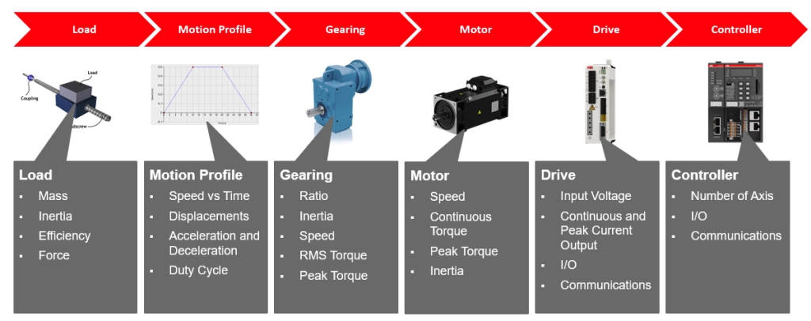

Навантаження (Load): Маса (Mass), Інерція (Inertia), Ефективність (Efficiency), Сила (Force)

Профіль руху (Motion Profile): Швидкість від часу (Speed vs Time), Переміщення (Displacements), Прискорення та уповільнення (Acceleration and Deceleration), Робочий цикл (Duty Cycle)

Передавальний механізм / редуктор (Gearing): Передаточне відношення (Ratio), Інерція (Inertia), Швидкість (Speed), Середньоквадратичний крутний момент (RMS Torque), Піковий крутний момент (Peak Torque)

Двигун (Motor): Швидкість (Speed), Номінальний крутний момент (Continuous Torque), Піковий крутний момент (Peak Torque), Інерція (Inertia)

Привід (Drive): Вхідна напруга (Input Voltage), Неперервний та піковий струм (Continuous and Peak Current Output), Входи/виходи (I/O), Комунікації (Communications)

Контролер (Controller): Кількість осей (Number of Axis), Входи/виходи (I/O), Комунікації (Communications)

