[<- До підрозділу](README.md)		[Коментувати](#feedback)

# Вступ до керування переміщенням: теоретична частина

## 1. ВСТУП. СФЕРИ ЗАСТОСУВАННЯ ТА МОТИВАЦІЯ

Керування позиціонуванням є однією з ключових задач сучасної промислової автоматизації. У широкому розумінні — це процес переміщення рухомого об'єкта (осі, столу, руки маніпулятора) до заданого положення з необхідною точністю, швидкістю та характером руху. Без систем позиціонування неможлива робота верстатів з ЧПК, промислових роботів, сортувальних конвеєрів, медичного обладнання, текстильних машин та сотень інших типів устаткування. 

### 1.1. Де застосовують системи позиціонування?

| **Галузь**             | **Приклад застосування**                          | **Вимога до точності** |
| ---------------------- | ------------------------------------------------- | ---------------------- |
| **Машинобудування**    | Верстати з ЧПК (токарні, фрезерні, шліфувальні)   | від 1 мкм до 10 мкм    |
| **Електроніка**        | Автомати паяння, монтажу компонентів  (SMT)       | від 0,1 мкм до 1 мкм   |
| **Медицина**           | Хірургічні роботи, рентгенівські  столи, дозатори | від 1 мкм до 100 мкм   |
| **Пакування**          | Фасувальні та пакувальні лінії,  стекери          | від 0,1 мм до 1 мм     |
| **Роботика**           | Промислові маніпулятори, AGV-транспорт            | від 0,01 мм до 0,5 мм  |
| **Поліграфія**         | Принтери, плотери, ламінатори                     | від 10 мкм до 100 мкм  |
| **Сонячна енергетика** | Трекери сонячних панелей, поворотні  платформи    | від 0,1° до 1°         |
| **Текстиль**           | Ткацькі верстати, машини для вишивки              | від 0,1 мм до 1 мм     |

Сучасна промисловість ставить дедалі вищі вимоги до точності та продуктивності. Тому прості релейно-контакторні схеми давно поступилися місцем складним цифровим системам керування, які включають мікроконтролери, програмовані логічні контролери (ПЛК), спеціалізовані контролери руху (Motion Controller) та інтелектуальні сервоприводи.

## 2. ОСНОВНІ ПОНЯТТЯ ТА КЛАСИФІКАЦІЯ ЗАДАЧ ПОЗИЦІОНУВАННЯ

### 2.1. Базові поняття

| **Термін**                      | **Визначення та пояснення**                                  |
| ------------------------------- | ------------------------------------------------------------ |
| **Вісь (Axis)**                 | Механічний ступінь свободи, яким керує  система позиціонування. Може бути лінійною (переміщення в мм/м) або  обертальною (кут у градусах чи оборотах). |
| **Позиція (Position)**          | Поточне або задане положення осі у  фізичних або логічних одиницях (мм, градуси, одиниці користувача). |
| **Швидкість (Velocity)**        | Перша похідна позиції за часом. У  лінійних системах — мм/с; в обертальних — об/хв або °/с. |
| **Прискорення  (Acceleration)** | Друга похідна позиції за часом.  Характеризує інтенсивність зміни швидкості (мм/с², °/с²). |
| **Ривок (Jerk)**                | Третя похідна позиції за часом.  Визначає плавність зміни прискорення, впливає на вібрації та механічне  навантаження. |
| **Профіль руху**                | Залежність  позиції/швидкості/прискорення від часу — "траєкторія" осі у  часовому просторі. |
| **Зворотний зв'язок**           | Сигнал від давача (енкодера), що  повідомляє контролеру про фактичне положення та швидкість осі. |
| **Помилка  позиціонування**     | Різниця між заданим і фактичним  положенням осі у кожен момент часу. |
| **Soft limits**                 | Програмні межі допустимого переміщення  осі, що задаються у ПЗ без фізичних кінцевих вимикачів. |
| **Home / Референтна  позиція**  | Базова точка відліку осі, що  встановлюється процедурою «Homing» при старті системи. |

### 2.2. Класифікація задач керування позиціонуванням 

За типом руху розрізняють такі основні класи задач: 

| **Клас   задачі**                 | **Характеристика**                                           | **Типові   застосування**                                |
| --------------------------------- | ------------------------------------------------------------ | -------------------------------------------------------- |
| **Point-to-Point  (PTP)**         | Переміщення  з точки А в точку Б, траєкторія між точками неважлива. | Пресу,  свердлильні верстати, завантажувачі.             |
| **Рух  за профілем швидкості**    | Вісь  рухається з заданою швидкістю без фіксованої кінцевої точки. | Конвеєри,  намотувачі, подавачі матеріалу.               |
| **Контурне  керування (CP)**      | Декілька  осей координовано рухаються для відтворення заданої просторової траєкторії. | ЧПК-верстати,  роботи-маніпулятори, лазерне різання.     |
| **Синхронне  керування**          | Одна  вісь (ведений) відстежує рух іншої (ведуча) за заданим законом (кулачок,  зубчата передача). | Фасувальні  машини, прес-лінії, намотувачі.              |
| **Позиціонування  з реєстрацією** | Рух  коригується за сигналом зовнішнього давача (Touch Probe) для прив'язки до  мітки чи деталі. | Різання  матеріалу за позначкою, синхронізація конвеєра. |

### 2.3. Якісні показники системи позиціонування 

Під час проектування системи позиціонування оцінюють кілька ключових показників. Точність позиціонування — абсолютна похибка між заданою та фактичною позицією після завершення руху — визначається якістю давача, жорсткістю механіки та алгоритмом регулятора. Повторюваність (repeatability) характеризує розкид позицій при багаторазовому підведенні до однієї точки і часто є важливішою за абсолютну точність у серійному виробництві.

Динамічні характеристики — час позиціонування, максимальна швидкість і прискорення — визначають продуктивність. Жорсткість системи керування забезпечує утримання позиції під навантаженням. Стабільність визначає відсутність коливань і перерегулювань після досягнення мети. 

## 3. ВИКОНАВЧІ ПРИСТРОЇ: ДВИГУНИ ТА ПРИВОДИ

Вибір типу приводу є першим і, часто, найважливішим кроком у проектуванні системи позиціонування. Два основних конкуренти в задачах точного позиціонування — кроковий двигун та серводвигун — мають принципово різну архітектуру та властивості.

### 3.1. Кроковий двигун (Stepper Motor)

Кроковий двигун є синхронним двигуном із багатополюсним ротором та статором, що містить кілька незалежних обмоток. При комутації обмоток ротор повертається на фіксований кут — «крок» — зазвичай від 0,9° до 1,8°. Сучасні контролери використовують режим мікрокроку, поділяючи основний крок на 8...256 мікрокроків для підвищення плавності та точності без механічних змін.
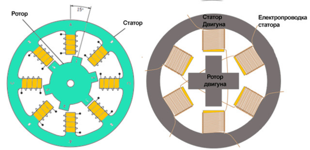

рис.1. Конструкція крокового двигуна

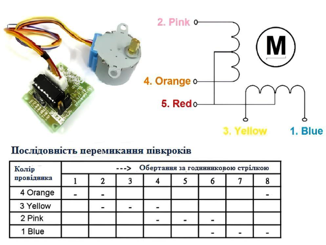

рис.2. Двигун з **напівкроковим** режимом позиціонування

#### Мікрокрок 

 Найбільш часто вживаний спосіб керування кроковими двигунами на сьогоднішній день. Ідея мікрокроку полягає в подачі на обмотки мотора живлення не імпульсами, а сигналу, по своїй формі , що нагадує синусоїду. Такий спосіб зміни положення при переході від одного кроку до іншого дозволяє отримати більш гладке переміщення, роблячи крокові мотори широко використовуваними в таких додатках як системи позиціонування в верстатах з ЧПУ. Крім цього, ривки різних деталей, підключених до мотору, також як і поштовхи самого мотора значно знижуються. У режимі мікрокроку, кроковий мотор може обертатися також плавно як і звичайні двигуни постійного струму .

Форма струму, що протікає через обмотку схожа на синусоїду.

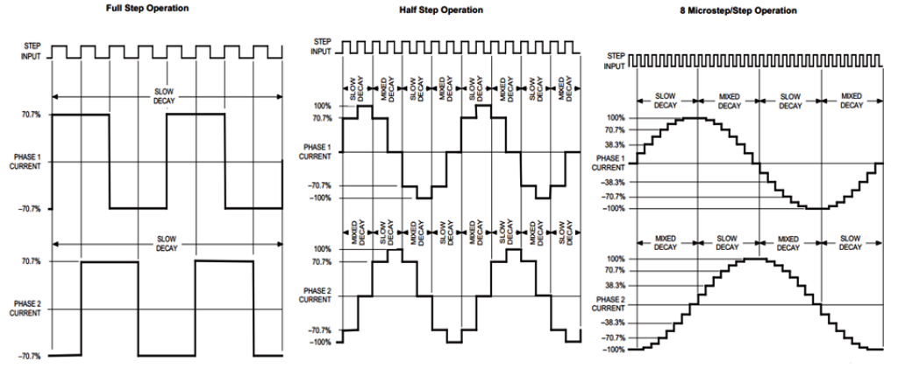

рис.3.

| **Характеристика**      | **Деталі**                                                   |
| ----------------------- | ------------------------------------------------------------ |
| **Принцип дії**         | Дискретне переміщення на фіксований  кут при кожному імпульсі струму. |
| **Переваги**            | Проста схема керування; висока  утримуюча сила; немає потреби у давачі зворотного зв'язку (часто). |
| **Недоліки**            | Небезпека «пропуску кроків» при  перевантаженні; знижений момент при великих швидкостях; резонансні явища. |
| **Типові застосування** | 3D-принтери, плотери, CNC-машини малої  потужності, офісне обладнання. |
| **Точність**            | Зазвичай 3–5% від кроку (без  зворотного зв'язку); до 0,1° з мікрокроком. |

### 3.2. Серводвигун та сервопривід (Servo Motor + Drive)

Серводвигун — це, як правило, синхронний двигун на постійних магнітах (PMSM) або безщітковий двигун постійного струму (BLDC) із вбудованим давачем зворотного зв'язку (зазвичай енкодером). Принципова відмінність від кроковика — замкнений контур регулювання: сервопривід постійно порівнює задане положення/швидкість/момент із виміряним і компенсує відхилення.

Архітектура сервоприводу включає кілька каскадних контурів регулювання. Зовнішній (найповільніший) контур позиції задає профіль руху і порівнює задану позицію з вихідним сигналом енкодера. Середній контур швидкості усуває відхилення швидкості. Внутрішній (найшвидший) контур струму безпосередньо керує обмотками двигуна, забезпечуючи необхідний момент. Смуга пропускання цих контурів зазвичай відноситься як 1 : 5 : 25 (позиція : швидкість : струм).

| **Параметр**                      | **Кроковий двигун**                  | **Серводвигун**                      |
| --------------------------------- | ------------------------------------ | ------------------------------------ |
| **Зворотний зв'язок**             | Зазвичай відсутній                   | Обов'язковий (енкодер/резольвер)     |
| **Точність**                      | Середня (без ЗЗ)                     | Висока (мкм і менше)                 |
| **Момент на малих  швидкостях**   | Дуже високий                         | Нормований, лінійний                 |
| **Момент на великих  швидкостях** | Значно падає                         | Залишається стабільним               |
| **Реакція на  перевантаження**    | Пропуск кроків (втрата позиції)      | Генерація помилки без втрати позиції |
| **Вартість системи**              | Нижча                                | Вища                                 |
| **Складність  налаштування**      | Мінімальна                           | Потребує тюнінгу ПІД-регуляторів     |
| **Типові застосування**           | Низькошвидкісні, малопотужні системи | Високоточні, динамічні системи       |

### 3.3. Типова архітектура роботи сервоприводу  

Зазвичай для керуання рухом використовується цифровий інтерфейс Sercos. Розглянемо типову архітектуру такої системи. 

| **Рівень**                             | **Опис**                                                     |
| -------------------------------------- | ------------------------------------------------------------ |
| **ПЛК  / Motion Controller**           | Виконує  прикладну програму (IEC 61131-3), розраховує траєкторію, відправляє завдання  на привід по Sercos. |
| **Мережа  Sercos III**                 | Детермінована  промислова мережа (Ethernet-based) з жорсткою синхронізацією. Типовий цикл:  250 мкс — 1 мс. Передає завдання позиції/швидкості та отримує стан приводу. |
| **Сервоприводний  підсилювач (Drive)** | Перетворює  завдання контролера у відповідні імпульси напруги на обмотках двигуна.  Містить контури струму та швидкості. |
| **Серводвигун**                        | Синхронний  двигун на постійних магнітах. Має вбудований енкодер, зазвичай  мультиоборотний абсолютний, з роздільною здатністю 65536 імп/об і більше. |

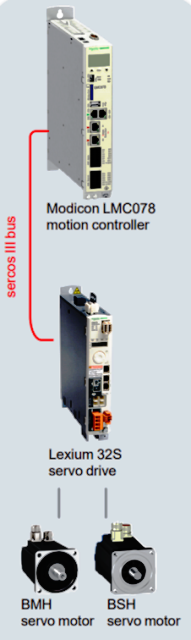

рис.4.

### 3.4. Лінійні двигуни та пряме (Direct Drive) керування

У надточних системах (координатні вимірювальні машини, напівпровідникове виробництво) застосовують лінійні двигуни — аналог обертального синхронного двигуна з постійними магнітами, але з розгорнутим у площину статором та ротором. Перевага — відсутність механічної передачі (кулькова гвинтова пара, зубчастий ремінь), що усуває люфт, пружність та зношування. Недолік — висока вартість, необхідність точного лінійного давача (лінійна шкала) та складне керування через взаємодію з навантаженням.

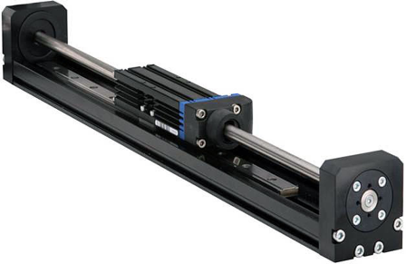

рис.5.

## 4. ДАВАЧІ ЗВОРОТНОГО ЗВ'ЯЗКУ В СИСТЕМАХ ПОЗИЦІОНУВАННЯ

Якість системи позиціонування принципово залежить від якості зворотного зв'язку. Без точного вимірювання фактичного положення неможливо реалізувати ні точне позиціонування, ні стабільний регулятор. Розглянемо основні типи давачів положення. 

### 4.1. Інкрементальний енкодер

Інкрементальний енкодер генерує два квадратурних сигнали (A та B, зсунуті на 90°) та нульовий імпульс (Z) за один оберт. Лічильник контролера підраховує імпульси та визначає відносне переміщення від початкової точки. Роздільна здатність визначається кількістю імпульсів на оберт (PPR) та режимом квадратурного декодування (×1, ×2, ×4).

Основний недолік — відсутність інформації про абсолютне положення після вимкнення живлення. Тому при кожному старті системи необхідно виконувати процедуру «Homing» — пошук базової точки. Типові значення: 1000–20000 PPR (до квадратурного декодування).

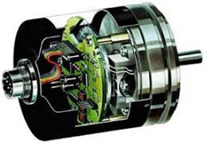

рис.6.

### 4.2. Абсолютний енкодер

Абсолютний енкодер у кожен момент часу видає код, що однозначно відповідає поточному куту вала. Однооборотний (single-turn) кодує положення в межах одного оберту. Мультиоборотний (multi-turn) додатково зберігає кількість обертів, зазвичай за рахунок автономного живлення (батарея) або спеціальних механічних лічильників.

Серводвигуни Schneider BSH, які використовуються з Lexium 32, оснащені мультиоборотними абсолютними енкодерами з роздільною здатністю 65536 (16 біт) позицій на оберт та до 65536 оборотів. Це дозволяє уникнути процедури Homing у більшості застосувань, хоча в лабораторній роботі вона все одно виконується для демонстрації принципу.

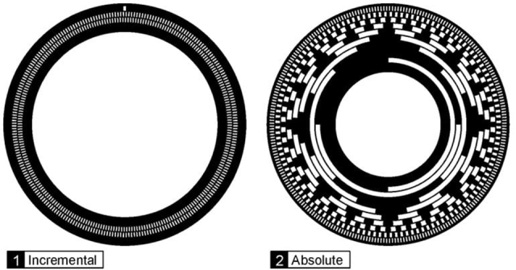

рис.7.

### 4.3. Резольвер (Resolver)

Резольвер — аналоговий давач, що є по суті трансформатором з обертовим ротором. Він видає два синусоїдальних сигнали (sin та cos), що залежать від кута вала. Перетворення аналогового сигналу у цифровий код виконує спеціальна мікросхема R/D (Resolver-to-Digital). Перевага перед енкодером — висока стійкість до вібрацій, ударів, температури та забруднень. Недолік — нижча роздільна здатність та потреба у додатковій схемі перетворення.

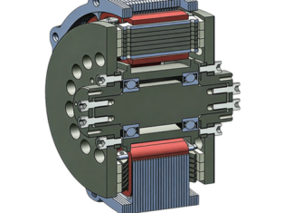 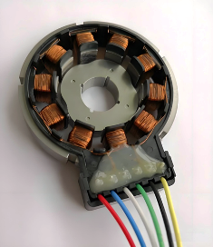

рис.8.

| **Тип давача**                    | **Ключові характеристики та застосування**                   |
| --------------------------------- | ------------------------------------------------------------ |
| **Інкрементальний  енкодер**      | Простий, недорогий; потребує Homing;  типова роздільна здатність 1000–20000 PPR; промислові верстати. |
| **Абсолютний (one-turn)**         | Пам'ять положення в межах оберту; не  потребує Homing після зупинки в межах оберту. |
| **Абсолютний  (multi-turn)**      | Пам'ятає повне положення після  вимкнення; стандарт для серводвигунів в автоматизації. |
| **Резольвер**                     | Надійний в жорстких умовах (вібрація,  температура); авіація, металургія, важке машинобудування. |
| **Лінійна шкала (Linear  scale)** | Давач лінійного переміщення  (оптичний/магнітний); пряме вимірювання без перерахунку; ЧПК, CMM. |
| **Холова давач  (Hall-effect)**   | Використовується в BLDC-двигунах для  комутації; низька роздільна здатність — лише для комутації, не для позиції. |

## 5. ПРОФІЛІ РУХУ: ТРАПЕЦІЄПОДІБНИЙ ТА S-ПОДІБНИЙ

Одна з ключових задач планувальника руху (motion planner) — побудова оптимального профілю швидкості, що забезпечує переміщення осі між двома точками за мінімальний час без перевищення допустимих обмежень на швидкість, прискорення та ривок. 

### 5.1. Трапецієподібний профіль (Trapezoidal Profile)

Найпростіший тип профілю складається з трьох фаз: розгін (acceleration phase), рух зі сталою швидкістю (constant velocity phase) та гальмування (deceleration phase). На графіку швидкість від часу нагадує трапецію. Прискорення при цьому є прямокутною функцією, що означає миттєву зміну прискорення (нескінченний ривок) у точках переходу між фазами.

| **Фаза**           | **Опис**                                                     |
| ------------------ | ------------------------------------------------------------ |
| **Розгін**         | Прискорення  = +a (константа). Швидкість лінійно зростає від 0 до Vmax. |
| **Усталений  рух** | Прискорення  = 0. Швидкість = Vmax = const. Може бути відсутньою при коротких  переміщеннях. |
| **Гальмування**    | Прискорення  = -a (константа). Швидкість лінійно спадає від Vmax до 0. |

Переваги трапецієподібного профілю — простота розрахунку та мінімальний час позиціонування при заданих Vmax та a. Недолік — різкі зміни прискорення викликають ударне навантаження на механіку (люфти, пружні деформації), вібрації та підвищений знос.

Розрахунок параметрів трапецієподібного профілю. Час розгону: t₁ = Vmax / a. Якщо загальна відстань S < Vmax² / a (трикутний профіль без фази Vmax = const), то піку швидкість: Vpeak = √(a · S). Загальний час руху: T = Vmax/a + (S - Vmax²/a) / Vmax + Vmax/a = 2·Vmax/a + S/Vmax - Vmax/a.

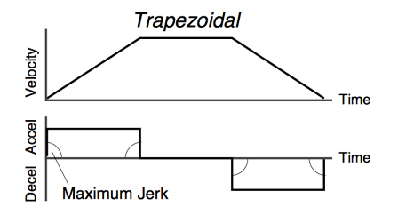

рис.9.

### 5.2. S-подібний профіль (S-curve Profile)

S-подібний профіль усуває недолік трапецієподібного, обмежуючи ривок (Jerk = da/dt). Це призводить до того, що прискорення не змінюється стрибкоподібно, а плавно зростає та спадає за лінійним або синусоїдальним законом. На графіку швидкості від часу фаза розгону і гальмування набуває форми літери «S».

| **Сегмент**     | **Опис**                                                     |
| --------------- | ------------------------------------------------------------ |
| **J+  (Jerk+)** | Ривок  = +J. Прискорення лінійно зростає від 0 до amax. Швидкість — парабола. |
| **Const.  Acc** | Ривок  = 0. Прискорення = amax = const. Швидкість лінійно зростає. |
| **J–  (Jerk–)** | Ривок  = –J. Прискорення спадає від amax до 0. Швидкість досягає Vmax. |
| **Const.  Vel** | Vmax  = const. Аналогічно до трапецієподібного.              |
| **Гальмування** | Симетрично  до розгону: J+, Const.Dec, J– сегменти.          |

| **Критерій порівняння**   | **Трапецієподібний vs S-подібний профіль**                   |
| ------------------------- | ------------------------------------------------------------ |
| **Ривок (Jerk)**          | Трапеція: нескінченний (стрибок  прискорення). S-крива: обмежений параметром Jerk. |
| **Вібрації**              | Трапеція: значні, особливо при великих  мас. S-крива: суттєво менші. |
| **Знос механіки**         | Трапеція: вищий. S-крива: нижчий  завдяки плавності.         |
| **Час позиціонування**    | Трапеція: коротший при однакових Vmax  та a. S-крива: довший через додаткові сегменти. |
| **Складність розрахунку** | Трапеція: проста. S-крива: складніша  (7 сегментів).         |
| **Рекомендація**          | Трапеція: прості механізми, малі маси.  S-крива: важкі вантажі, рідини, точні системи. |

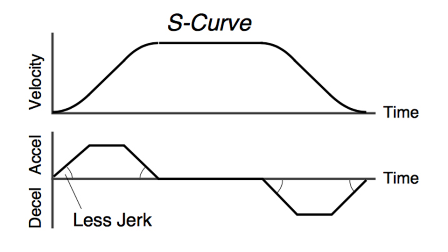

рис.10.

Також прочитайте [Стандарт PLCOPEN motion control](../../filedbus/pds/plcopenmotion.md)

## Відео

- [Лек 6. Задачі керування позиціонуванням. Гостьова лекція. Доповідач Крещенко Павло](https://youtu.be/brOsNwtu6Rs)

## Джерела

## Матеріали для додаткового вивчення

1. Chooi. AC500 V3 General Motion Control. Presentation. ABB Global Technical Support, July 2024.
1. Матеріали Motion Training від ABB
1. https://www.youtube.com/@abbmotion4502
1. https://www.youtube.com/@abbdrives

## Автори

Теоретичне заняття розробив Павло Крещенко

## Feedback

Якщо Ви хочете залишити коментар у Вас є наступні варіанти:

- [Обговорення у WhatsApp](https://chat.whatsapp.com/BRbPAQrE1s7BwCLtNtMoqN)
- [Обговорення в Телеграм](https://t.me/+GA2smCKs5QU1MWMy)
- [Група у Фейсбуці](https://www.facebook.com/groups/asu.in.ua)

Про проект і можливість допомогти проекту написано [тут](https://asu-in-ua.github.io/atpv/)
