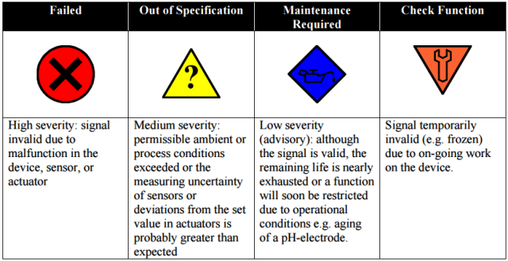
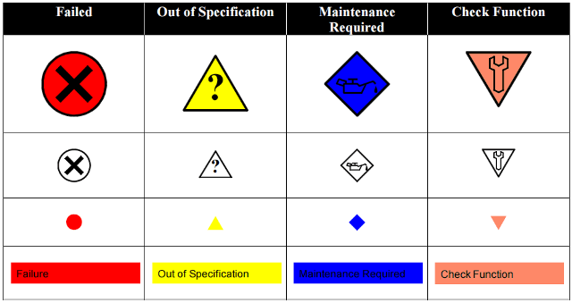
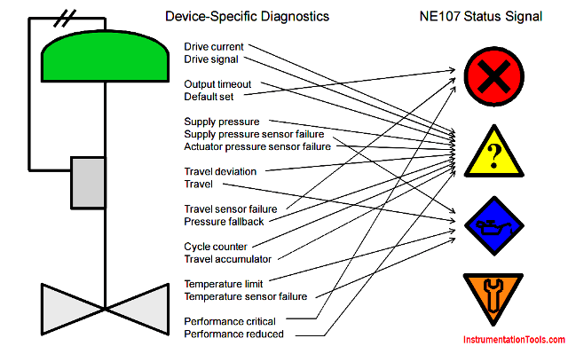

[<- До підрозділу](README.md)		[Коментувати](#feedback)

# Стандарт NAMUR NE107

Це переклад статті https://instrumentationtools.com/namur-ne107-standard/

## Вступ

Процесні змінні та керувальні змінні є найважливішими видами інформації від пристроїв. NAMUR визначила, що стан самих пристроїв також є важливим для того, щоб допомогти операторам установки ефективніше керувати виробництвом. Цю вимогу зафіксовано в рекомендації NE107.

Рекомендація NE107 передбачає, що оператори повинні мати уявлення про процес разом зі станом приладової апаратури у простому та уніфікованому вигляді незалежно від джерела пристрою. Рекомендація NE107 означує, що детальні діагностичні повідомлення, специфічні для конкретних пристроїв, узагальнюються у чотири прості сигнали стану. Ці сигнали гарантують, що оператор установки не буде перевантажений деталями пошуку несправностей пристроїв або незрозумілими кодами помилок. Рекомендація NAMUR NE107 гармонізує відображення стану пристроїв.

Оператор повинен негайно отримати сигнал стану, якщо критично важливий пристрій установки працює несправно, щоб можна було виконати відповідні дії. Це може включати безпечні дії, наприклад переведення контуру в ручний режим або зупинку установки. Попереджувальна сигналізація пристрою, навпаки, відображається оператору у випадку менш критичного пристрою або менш серйозної проблеми. У такому випадку оператор може вирішити безпечно продовжувати роботу до заміни пристрою під час технічного обслуговування або навіть дочекатися наступного планового ремонту. Проблеми пристроїв, що не потребують дій оператора, взагалі не відображаються оператору, а повідомляються лише службі технічного обслуговування.

У критичних ситуаціях операторам потрібна інформація для прийняття рішень. Основними видами інформації, пов’язаними з передавачами та клапанами, є процесні змінні та керувальні змінні. Робоча група NAMUR 3 разом з VDI/VDE та WIB встановили, що для того, щоб допомогти операторам ефективніше керувати установкою, також важливим є стан самих пристроїв. Просте та узгоджене відображення стану пристроїв для операторів означене в рекомендації NAMUR NE107. Детальніша діагностика пристроїв використовується службою технічного обслуговування установки для пошуку несправностей і планування щоденного обслуговування та ремонтів.

## Робота без інформації про стан

Оператори приймають рішення і виконують дії у відповідь на зміни процесу. Відмова або забруднення пристрою протягом кількох хвилин або годин вплине на процес. Тому оператори також повинні мати можливість реагувати у випадку відмови або забруднення приладу до того, як це призведе до порушення технологічного процесу. Тобто, щоб уникнути помилок, які можуть призвести до виробничих втрат, операторам потрібна інформація. Проте в більшості сучасних систем оператори не отримують інформації про багато проблем пристроїв.

У традиційних системах керування процесні змінні відображаються на операторських екранах, і система може формувати сигнал тривоги, якщо передавач повністю відмовляє, за умови що його аналоговий вихід переходить у визначений рівень вище 20 мА або нижче 4 мА і система формує сигнал тривоги на цих рівнях. У простих системах такого сигналу відмови пристрою може взагалі не бути. Інші проблеми пристроїв, такі як відхилення положення клапана, зростання невизначеності вимірювання, перевищення технологічних або навколишніх умов, зношення або забруднення, не відображаються оператору. Некоректні значення процесної змінної, наприклад режим симуляції або режим «hold», що можуть бути встановлені в деяких пристроях під час їх обслуговування, також не індикуються.

Крім того, будь-яка установка має суміш пристроїв від багатьох виробників і різних типів. Типи самодіагностики в кожному з них відрізняються. Тобто кожен тип пристрою і кожен виробник по-своєму означує, для яких проблем аналоговий вихід позначається як відмова, а для яких ні. Крім того, система керування, архіватор даних установки, програмне забезпечення Intelligent Device Management (**IDM**), що входить до системи керування активами, та інші застосунки відображають відмову пристрою різними значками, кольорами і повідомленнями. Такі невідповідності ускладнюють інтерпретацію стану пристрою; нелегко зрозуміти, що означає кожна діагностична тривога приладу, наскільки вона серйозна і наскільки терміновою є. У більшості існуючих установок технологічні перемикачі та клапани типу вкл./викл. взагалі не мають діагностики.

На деяких установках технічний персонал отримує користь від діагностики пристроїв за допомогою програмного забезпечення IDM. Проте майже на всіх установках оператори не отримують користі від діагностики інтелектуальних пристроїв. Рекомендація NE107 означує, як діагностика інтелектуальних пристроїв із дискретним зв’язком узагальнюється перед передаванням, бажано в реальному часі, від пристрою до системи, щоб оператори могли виконувати відповідні дії.

Маючи уявлення про процес разом зі станом приладової апаратури у простому та уніфікованому вигляді незалежно від джерела пристрою, оператори можуть працювати ефективніше.

## Сигнали стану NE107 для оператора

Інтелектуальні пристрої мають самодіагностику для перевірки власного стану, після чого ця інформація передається до системи. Тобто сигнал стану NE107 базується на дискретному зв’язку, а не на примітивному сигналі <4 мА або >20 мА. Процесна змінна датчика і функція клапана перевіряються діагностикою. Використовуючи сигнал стану NE107, можна запобігти тому, щоб відмова пристрою вплинула на якість продукції або навіть спричинила зупинку установки. Діагностика також корисна як вхідна інформація для щоденного технічного обслуговування та планування ремонтів. Наприклад, пристрої можуть прогнозувати залишковий ресурс компонентів, що зношуються, таких як ущільнення штока, або дозволяють виявити забруднення на ранній стадії.

Важливо, щоб оператор установки не був перевантажений незрозумілими кодами помилок і деталями пошуку несправностей пристроїв, які можуть відволікати і заважати приймати правильні рішення. У будь-якому випадку пошук несправностей пристрою виконує не оператор, а технічний персонал. Тому рекомендація NE107 означує чотири прості сигнали стану, до яких категоризується детальна діагностика, специфічна для пристрою, перед передаванням до системи. Важливо, щоб на операторських екранах відображалися лише прості сигнали стану NE107.

рис.1. Опис сигналів стану NAMUR NE107.

Додатково деякі системи відображають піктограму, коли з пристроєм немає проблем, наприклад зелений квадрат із позначкою, щоб явно підтвердити справність пристрою. Інші системи взагалі не відображають жодної піктограми, коли пристрій працює нормально, щоб не перевантажувати екран. Сіра піктограма у вигляді квадрата може відображатися у випадку, якщо сигнали стану для цього пристрою вимкнені.

Сигнали стану NAMUR NE107 можуть відображатися у спрощеному вигляді на монохромних дисплеях пристроїв, а також у програмному забезпеченні у вигляді піктограм у дереві меню або записів у списку зведених тривог, як показано в таблиці нижче.

рис.2. 

На установці використовується багато різних типів інтелектуальних пристроїв від багатьох виробників, з різними принципами вимірювання тощо. До них можуть належати передавачі та позиціонери керувальних клапанів, а також газові хроматографи, електричні приводи / Motor Operated Valves (MOV), інтелектуальні клапани вкл./викл., двопровідні системи вимірювання рівня у резервуарах тощо.

Інтелектуальні пристрої можуть відмовляти або деградувати багатьма різними способами, що призводить до появи сотень або навіть тисяч різних діагностичних кодів помилок і повідомлень у програмному забезпеченні Intelligent Device Management. Ці повідомлення не повинні відображатися операторам. Операторам не потрібна детальна діагностика, оскільки вони не виконують заміну або ремонт пристрою. Для ведення процесу операторам достатньо простого узагальненого повідомлення. Рекомендація NAMUR NE107 гармонізує таке узагальнене відображення стану для всіх типів пристроїв.

Оператор на робочому місці системи керування повинен якомога швидше дізнатися, що вимірювання передавача є недійсним або клапан не переміщується належним чином, щоб він міг безпечно керувати процесом. Водночас спеціаліст з приладового обладнання, який працює з програмним забезпеченням Intelligent Device Management (IDM) у складі системи керування активами (Asset Management System, **AMS**), повинен знати причину проблеми і спосіб її усунення, щоб можна було відповідно планувати щоденне технічне обслуговування та ремонти. Тому операторам відображаються лише узагальнені сигнали стану NAMUR NE107, тоді як детальна діагностика відображається лише технічним спеціалістам з приладового обладнання.

Таб.1. Експлуатація та технічне обслуговування мають різні вимоги.

|                        | Рівень експлуатації                                          | Рівень технічного обслуговування                             |
| ---------------------- | ------------------------------------------------------------ | ------------------------------------------------------------ |
| Користувач             | Оператор                                                     | Спеціаліст з пристроїв (напр. співробітник КВПіА)            |
| Система                | Робоча станція оператора системи керування                   | Intelligent Device Management (IDM) – програмне забезпечення у складі системи керування активами (AMS) |
| Відповідальність       | Безпечне керування установкою                                | Пошук несправностей пристроїв                                |
| Детальність інформації | Без деталей: лише необхідне узагальнення — сигнали стану NE107 | Максимально детальна інформація: діагностика з імовірною причиною та рекомендованою дією |
| Повідомлення           | Передається якомога швидше, сигнал тривоги в реальному часі  | Використовується під час щоденного технічного обслуговування та планування ремонтів |

## Як працює NE107

Пристрої передають діагностичні тривоги приладового обладнання, коли внутрішня самодіагностика виявляє проблеми. Це включає безперервний моніторинг внутрішніх змінних у позиціонері клапана самим пристроєм. Додатково моніторинг внутрішніх змінних у критичних передавачах і клапанах може бути увімкнений із боку системи, якщо така функція не підтримується самим пристроєм. Виявлені проблеми можуть ще не означати фактичну відмову, але дають раннє попередження. Діагностика пристрою може виявляти деградацію, що виникає внаслідок зношення під час нормальної роботи, що впливає на характеристики пристрою і, відповідно, на процес. Таке раннє попередження корисне для планування як щоденного технічного обслуговування, так і ремонтних кампаній.

Діагностичні тривоги приладового обладнання повинні бути своєчасними, так само як і технологічні тривоги. Коли виникають проблеми з приладом, пристрій повинен їх виявити і передати повідомлення, а система повинна відобразити їх достатньо швидко, щоб це мало практичне значення. Різноманітні типи самодіагностики пристрою узагальнюються в самому пристрої, після чого передаються і відображаються на робочому місці оператора як один із чотирьох сигналів стану NAMUR NE107. Швидкі канали зв’язку дозволяють передавати сигнали стану NE107 у систему в режимі реального часу, коли пристрій виявляє проблему.

Підтвердження діагностичної тривоги приладового обладнання не потрібно виконувати на самому пристрої в полі; воно виконується з консолі системи. Діагностичні тривоги не записуються в самому пристрої; вони реєструються в програмному забезпеченні IDM або в системному архіваторі. Детальніша діагностика пристрою з рекомендаціями виробника, наприклад довідковими текстами та ілюстраціями для пошуку несправностей, надається на сторінках пристрою в програмному забезпеченні IDM, що зручно для спеціаліста з приладового обладнання, який виконує діагностику.

## Як використовується NE107

Системи, що реалізують NE107, повідомляють оператора на його робочому місці про погіршення стану пристрою, що дає можливість оператору керувати процесом, визначаючи відповідні дії, оскільки оператор знає, як проблема пристрою вплине на роботу установки. Оператор завжди повинен аналізувати діагностику в контексті застосування, оскільки вплив несправності пристрою на установку залежить від конкретного процесу.

Оператори спочатку стабілізують свій процес. Після цього вони звертаються до технічного спеціаліста з приладового обладнання для пошуку несправності пристрою. Оператори постійно знаходяться перед своїми робочими станціями, тоді як технічний персонал з обслуговування — ні. Тому спеціаліст з приладового обладнання може побачити діагностичну тривогу значно пізніше. Через це вигідно, коли оператори повідомляють спеціалістів про виявлені проблеми.

Слід зазначити, що оскільки EDDL є стисненим текстовим файлом, а не виконуваною програмою-драйвером, використання EDDL дозволяється безпосередньо в системі керування. Тобто, окрім відображення сигналів стану NAMUR NE107 на операторській консолі, також можна відображати детальну діагностику пристрою так, як це передбачив виробник, і отримати доступ до неї менш ніж за три переходи. Завдяки EDDL для відображення панелей пристроїв у системі не потрібні власні системно-специфічні файли для кожного пристрою.

## Інженерна реалізація NE107

Результати діагностики, специфічні для конкретного пристрою, узагальнюються безпосередньо в самому пристрої у чотири стандартні сигнали стану NE107. Кожен тип діагностики, який підтримує пристрій, відноситься до однієї з цих чотирьох категорій. Оскільки відповідні дії у разі проблеми з пристроєм залежать від застосування та критичності, ці категорії можуть бути вільно призначені. За потреби окремі діагностичні функції можуть бути вимкнені. Цю інженерну роботу полегшує те, що виробник пристрою зазвичай уже задає типові налаштування за замовчуванням.

Діагностика пристрою виявляється і передається в режимі реального часу. Наприклад, функції діагностики продуктивності в позиціонері клапана безперервно контролюють внутрішні параметри і формують тривогу при виявленні проблем. У цьому випадку немає потреби виконувати періодичні ручні перевірки або випробування.

Рис.3 Відображення відповідності діагностики, специфічної для пристрою, сигналам стану NE107

Категоризація кожної діагностичної тривоги приладового обладнання, специфічної для пристрою, до одного з чотирьох стандартних сигналів стану NE107 вільно налаштовується в самому пристрої, оскільки кожен тип пристрою має різні можливості діагностики, а критичність і вимоги для кожної точки вимірювання або керування залежать від конкретного застосування. Окремі діагностичні тривоги приладового обладнання можуть бути приглушені, якщо вони не потрібні.

Тому, так само як існує інженерна робота з раціоналізації технологічних тривог, існує і інженерна робота з керування діагностичними тривогами приладового обладнання. Рекомендована категоризація NE107 включена в конфігурацію пристрою за замовчуванням, яку задає виробник пристрою. На етапі проєктування системи діагностика пристроїв класифікується за сигналами стану NE107. Під час планування проєкту слід передбачити інженерні ресурси для виконання роботи з раціоналізації діагностичних тривог приладового обладнання.

## Питання

- Що таке NAMUR? NAMUR — це міжнародна асоціація користувачів технологій автоматизації в процесних галузях промисловості.

- Що таке NE107? NE107 — це рекомендація організації NAMUR «Самомоніторинг і діагностика польових пристроїв», яка пояснює, як використовувати діагностику в інтелектуальних пристроях.

- Навіщо відображати діагностику пристроїв операторам? Інформація про стан пристроїв є корисною і допомагає оператору установки виконувати необхідні дії щодо процесу, яким керує цей пристрій. Див. також ISA 18.2, пункт 3.1.46.

- Що таке «сигнал стану»? Сигнал стану узагальнює інформацію про працездатність пристрою на основі його самодіагностики і відображається у вигляді однієї з чотирьох категорій:

  - Відмова

  - Поза специфікацією

  - Потрібне технічне обслуговування

  - Перевірка функції

    Відповідність кожного діагностичного повідомлення певній категорії може бути налаштована в самому пристрої. Докладніше див. у навчальному матеріалі NE107 та у посібнику Device Diagnostics Deployment and Adoption Guide.

- Чи буде діагностика пристроїв відволікати операторів? Ні. Оператору установки відображається лише простий сигнал стану, щоб не перевантажувати його деталями пошуку несправностей.

- Де реалізується NE107? NE107 реалізується в системах керування, у програмному забезпеченні Intelligent Device Management (IDM), яке входить до систем керування активами (AMS), а також у самих пристроях і у файлах EDDL, що забезпечують інтеграцію між системами і пристроями. Необхідно переконатися, що системи і пристрої протестовані та зареєстровані для підтримки NE107.

- Які дії виконує оператор при отриманні сигналів стану? Дії оператора, окрім повідомлення спеціаліста, можуть включати переведення відповідного контуру в ручний режим або направлення працівника в поле для ручного керування клапаном.

## Автори

Стаття взята з сайту [instrumentationtools](https://instrumentationtools.com/namur-ne107-standard/)

## Feedback

Якщо Ви хочете залишити коментар у Вас є наступні варіанти:

- [Обговорення у WhatsApp](https://chat.whatsapp.com/BRbPAQrE1s7BwCLtNtMoqN)
- [Обговорення в Телеграм](https://t.me/+GA2smCKs5QU1MWMy)
- [Група у Фейсбуці](https://www.facebook.com/groups/asu.in.ua)

Про проект і можливість допомогти проекту написано [тут](https://asu-in-ua.github.io/atpv/)