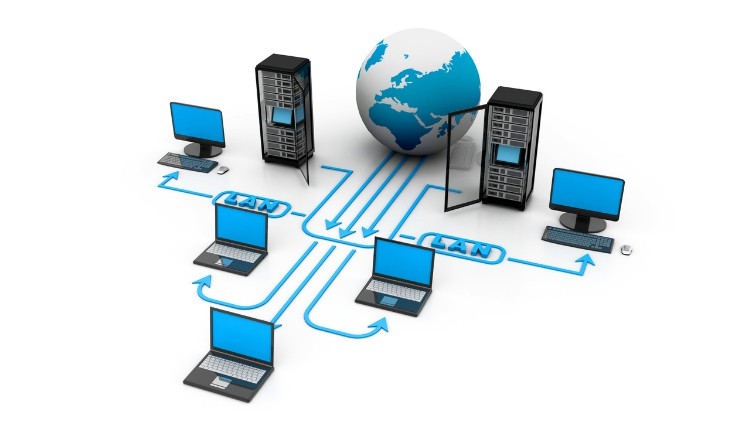

 [Зміст](../contents.md)

# Основи комп'ютерних мереж

- [Інструменти віддаленого доступу та налагодження](debug/README.md)
- [Основи Ethernet](ethernetstart/README.md)
- [Розширені механізми Ethernet та керовані комутатори](ethernetadv/README.md)
- [Основи протоколів рівня IP](ipstart/README.md)
- [Маршрутизація в IP мережах](routing/README.md)
- [Основи протоколів TCP та UDP](tcpudp/README.md)
- [Система доменних імен DNS](dns/README.md)
- [Додаткові служби TCP/IP та основи налаштування маршрутизаторів](tcpiipadd/README.md)
- [Прикладний рівень: HTTP, HTTP API](http/README.md) 
- [Серіалізація: XML та JSON](xmljson/README.md)
- [Керування ідентифікацією і доступом](security/README.md) 
- [Віртуальні приватні мережі (VPN)](vpn/README.md)
- [Сервіси SNMP](snmp/README.md)
- [Інтернет](internet/README.md)
- [ASN,1]()

