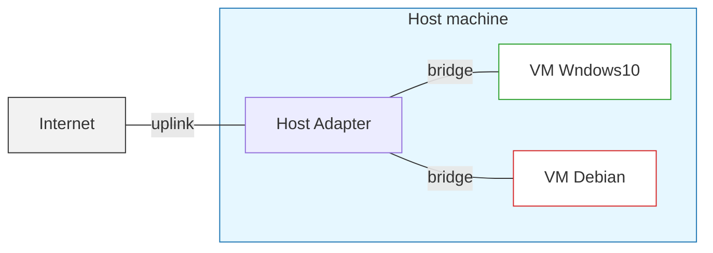
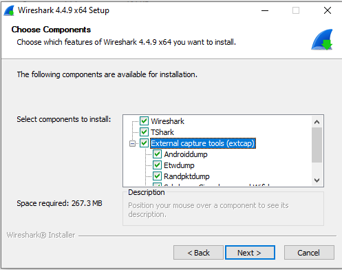
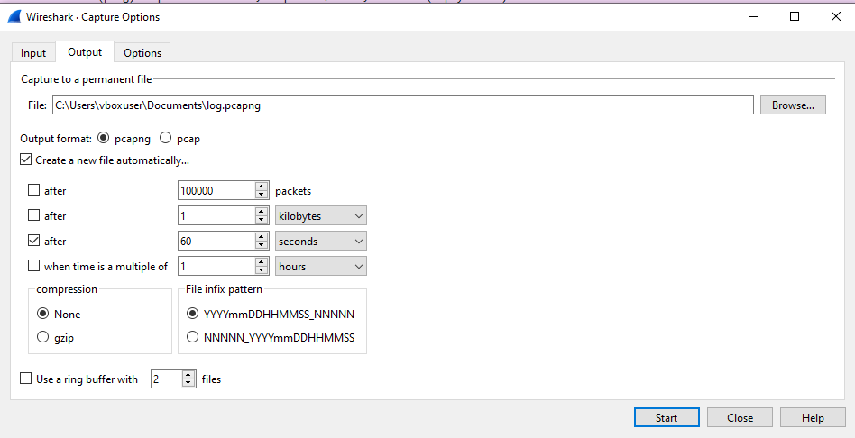
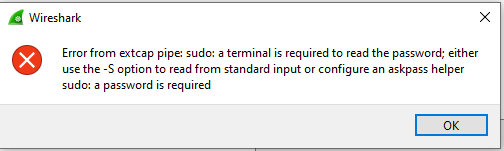

[<- До підрозділу](README.md)

# Інструменти віддаленого доступу та налагодження: практична частина

**Тривалість**: 2 акад. години

**Мета:**  Набути практичних навичок розгортання та налаштування віртуального середовища з операційними системами Windows 10 та Debian 13 для відпрацювання технологій віддаленого доступу й аналізу мережевого трафіку.

## Лабораторна установка для проведення лабораторної роботи у віртуальному середовищі.

**Апаратне забезпечення, матеріали та інструменти для проведення віртуальної лабораторної роботи.** 

- ПК з встановленою сучасною ОС з достатніми вимогами для роботи віртуальних машин Windows 10 та Debian 

**Програмне забезпечення, що використане у віртуальній лабораторній роботі.** 

1. ssh клієнти і сервери
2. PuTTY
3. tcpdump
4. Сніфер Wireshark (http://www.wireshark.org/)

## Загальна постановка задачі

Цілі роботи: 

- встановити VirtualBox

- зробити віртуальну машину Windows 10

- зробити віртуальну машину Debian 13

- налаштування мереж на віртуальних машин

- встановлення PuTTY, WinSCP

- організувати доступ з Windows 10 до Debian 13 по SSH

- організувати доступ з Debian 13 до Windows 10 по SSH

- встановити tcpdump на віртуальній машині Debian та зробити захоплення пакетів

- встановити сніфер Wireshark та отримати навички роботи з ним

- забезпечити віддалений збір пакетів з ВМ Debian на Windows 10




рис.1. Схематичне зображення установки лабораторної роботи

Теоретичний матеріал:

- [SSH (Secure Shell): теоретична частина ](ssh.md)
- [Аналізатори пакетів (Wireshark та інші): теоретична частина](sniffers.md)

## Послідовність виконання роботи

### 1. Встановлення та налаштування віртуальних машин

- [ ] Встановіть VirtualBox та віртуальну машину (надалі **VM**) з Windows 10 як описано в [цьому практичному занятті](../../vm/vbox/labwin10.md). 
- [ ] Завантажте образ Debian і створіть віртуальну машину з Debian.
- [ ] Встановіть на VM Debian Samba

```
sudo apt update 
sudo apt install samba
```

### 2. Налаштування та перевірка зв'язку

- [ ] Налаштуйте обидві віртуальні мережі на зв'язок типу "міст" ("проміжний адаптер") з мережною картою хостової машини, що має доступ до Інтернету (рис.2).


рис.2. Приклад налаштування мережної карти VM Debian

- [ ] Запустіть обидві віртуальні машини

- [ ] Дізнайтеся IP адресу VM Windows 10, наприклад

```
ipconfig
```

- [ ] Дізнайтеся IP адресу VM Debian, наприклад

```
ip -4 a 
```

- [ ] Перевірте доступність однієї VM з іншої (в обидва боки)

```
ping 192.168.2.126
```

- [ ] Перевірте доступність по імені VM Debian, наприклад

```
ping debian13
```

### 3. Доступ по SSH з командного рядку Windows

- [ ] Підключіться з VM Windows по SSH до VM Debian

```
ssh vboxuser@debian13
```

- [ ] Перевірте доступність команд, наприклад 

```
cd ..
ls
```

### 4. Доступ з PuTTY та WinSCP

- [ ] Завантажте Putty на VM Windows посиланням https://www.chiark.greenend.org.uk/~sgtatham/putty/latest.html . Ця утиліта дає можливість підключатися до різноманітних пристроїв в термінальному режимі.
- [ ] Запустіть `Putty`. У полі `Host Name`  впишіть IP адресу або ім'я VM Debian. У полі `Saved Session` впишіть назву підключення, наприклад `Debian`, через яке Ви зможете підключатися пізніше, зробивши вибір, і натисніть `Save`. Після цього натисніть `Open` щоб відкрити сессію.   


рис.3.

- [ ] Перший раз при підключенні, Putty зробить попередження, натисніть `Accept` щоб погодитися.


рис.4.

Це стандартне вікно PuTTY Security Alert, яке з’являється при першому підключенні до нового SSH-сервера. Тут повідомляється таке:

- `The host key is not cached for this server` - ключ цього сервера (`debian13`, порт 22) ще не збережений у кеші PuTTY. Тобто програма не знає, чи справді це та сама машина, до якої ви хочете підключитися.
- `You have no guarantee that the server is the computer you think it is` - попередження, що немає гарантії автентичності сервера (бо ключ бачиться вперше).
- Далі показано `fingerprint ключа сервера` (відбиток ключа SSH, у цьому випадку `ssh-ed25519 255 SHA256:...`). Це унікальний ідентифікатор ключа SSH сервера.

Є кілька варіантів дій:

- Accept — прийняти ключ і зберегти його у кеш PuTTY. Надалі при підключенні PuTTY перевірятиме, що сервер дає той самий ключ.
- `Connect Once` — підключитися тільки цього разу, не зберігаючи ключ. Наступного разу таке вікно з’явиться знову.
- `Cancel` — скасувати підключення.

- [ ] Відкриється вікно терміналу, введіть користувача та пароль. Зверніть увагу, що при введенні паролю, він не відображається (навіть зірочками). 


рис.5.

Термінал працює з використанням захищеного протоколу `ssh`, який був активований при створенні образу. Доступ по SSH можна відключити в будь який момент. При підключенні до реального пристрою з Linux, Putty дає можливість працювати в командному режимі з Windows. 

- [ ] Звантажте та встановіть на VM Windows 10 WinSCP https://sourceforge.net/projects/winscp/ . Цей застосунок дає можливість підключатися до файлової системи ОС Linux через SSH та інші способи комунікації та працювати з нею через табличне представлення
- [ ] Запустіть WinSCP на виконання. У полі `Вузол`  впишіть IP адресу або ім'я пристрою VM Debian. У полях `login`  і `пароль` впишіть відповідно ім'я користувача і пароль, а збережіть налаштування за допомогою кнопки `зберегти`, щоб потім Ви змогли підключатися пізніше, зробивши вибір. Після цього натисніть `Login` щоб відкрити сесію.   


рис.6.

- [ ] Перший раз при підключенні як і випадку з Putty, вийде попередження, натисніть `Accept` щоб погодитися. Відкриється навігатор, в якому перейдіть на верхній рівень в кореневу директорію.


рис.7.

Тепер можна отримувати та записувати файли через табличне представлення.  

### 5. Встановлення та перевірка SSH серверу на Windows

- [ ] Запустіть на VM Windows10 PowerShell від імені адміністратора. Встановіть SSH Server

```powershell
Add-WindowsCapability -Online -Name OpenSSH.Server~~~~0.0.1.0
```

- [ ] Після встановлення запустіть службу `sshd`:

```powershell
Start-Service sshd
Set-Service -Name sshd -StartupType 'Automatic'
```

- `Start-Service sshd` — запускає сервер.
- `Set-Service -Name sshd -StartupType 'Automatic'` — щоб SSH стартував автоматично при завантаженні Windows.

- [ ] Для перевірки стану запустіть команду:

```powershell
Get-Service sshd
```

- [ ] Через консоль VM Debian використовуючи SSH підключіться до Windows

```
ssh user@ip_adr
```

### 6. Копіювання файлів з Debian на Windows

Для простоти будемо копіювати вже наявний файл, наприклад `/var/log/dpkg.log`.  Також на Debian можна створити тестовий файл командою:

```bash
echo "Hello from Linux" > ~/testfile.txt
```

- [ ] Відкрийте PowerShell у VM Windows (не від імені адміністратора)

- [ ] Скопіюйте файл із Debian на Windows:

```powershell
scp vboxuser@debian13:/var/log/dpkg.log  $env:USERPROFILE\Documents\
```

де:

- `vboxuser` — ім’я користувача у Debian,
- `debian13` — назва або IP-адреса Debian-сервера,
- `/var/log/dpkg.log` — шлях до файлу на Debian,
- `$env:USERPROFILE\Documents\` — каталог призначення у Windows.

Якщо все скопіюється має вивести щось на кшталт

```powershell
PS C:\Users\vboxuser> scp vboxuser@debian13:/var/log/dpkg.log  $env:USERPROFILE\Documents\
vboxuser@debian13's password:
dpkg.log                                                                              100%  239KB  38.9MB/s   00:00
```

- [ ] Переконайтеся, що файл з’явився у VM Windows, відкрийте наприклад за допомогою Notepad ++. 
- [ ] Скопіюйте директорію з VM Debian на VM Windows (рекурсивно):

```powershell
scp -r vboxuser@debian13:/var/log/apt $env:USERPROFILE\Documents\
```

- [ ] Скопіюйте файл у зворотному напрямку (VM Windows → VM Debian):

```powershell
scp C:\Users\me\Documents\localfile.txt user@192.168.1.10:/home/user/
```

- [ ] Перевірте результат на VM Debian. Підключіться по SSH і виконайте:

```bash
ls -l ~/localfile.txt
```

### 7. Встановлення та використання tcpdump на Debian

- [ ] Встановіть `tcpdump` на VM Debian

```
sudo apt update
sudo apt install -y tcpdump
```

- [ ] Виведіть спсисок доступних карт

```
sudo tcpdump -D
```

- [ ] Включіть прослуховування на карті Ethernet

```
sudo tcpdump -i enp0s3
```

- [ ] Спробуйте проаналізувати що виводиться на екран

### 8.  Завантаження, інсталяція та налаштування сніферу WireShark на Windows 10

- [ ] Завантажте на віртуальну машину VM Windows10 сніфер Wireshark з офіційної сторінки https://www.wireshark.org/#download . 
- [ ] Запустіть інсталятор, виберіть усі компоненти. В усіх інших діалогових вікнах залиште усі опції за замовченням.



рис.8.

- [ ] Запустіть на виконання сніфер WireShark. Виберіть інтерфейс через який йде з'єднання з Інтернет та іншою віртуальною машиною. Проаналізуйте чи йдуть пакети.

### 9. Фільтрація захоплення пакетів

- [ ] Проаналізуйте трафік з точки зору вузлів відправлення.
- [ ] Зупиніть захоплення пакетів.
- [ ] Зайдіть в налаштування `Capture -> Options`
- [ ] Користуючись довідкою з додатку 1, налаштуйте фільтр захоплення так, щоб проходили тільки пакет до і на VM Debian. Запустіть захоплення пакетів.
- [ ] Зробіть `ping` з віртуальної машини `Debian`. Подивіться чи захоплюються пакети. 
- [ ] Зупиніть захоплення пакетів.

### 10. Фільтрація відображення пакетів

- [ ] Проаналізуйте трафік з точки зору вузлів відправлення.
- [ ] Запустіть захоплення пакетів без фільтрації.
- [ ] Зробіть ping з віртуальної машини Debian а також з хостової машини. Подивіться які показуються пакети.
- [ ] Зробіть щоб відображалися тільки пакети ICMP. Подивіться які показуються пакети.
- [ ] Подивіться які показуються тільки пакети ICMP з Debian.
- [ ] Зупиніть захоплення пакетів.

### 11. Запис у вказаний файл та його пост-аналіз

- [ ] У `Capture -> Options` налаштуйте щоб захоплення писалося у файл `log*` з розділенням кожна 60 секунд.  



рис.9.

- [ ] Запустіть захоплення пакетів. Через 2 хвилини зупиніть.
- [ ] Через `File->Open` відкрийте збережений файл.

### 12. Аналіз gratuitous ARP

- [ ] Зупиніть пінги з VM Debian.
- [ ] Зробіть щоб в WireShark відображалися або захоплювалися тільки пакети ARP, і лог писався в один файл за замовченням.  
- [ ] Запустіть захоплення пакетів.
- [ ] Перезапустіть VM Debian

### 13. Робота з Tshark

- [ ] Перевірте чи є потрібний шлях прописаний у змінній середовища у VM Windows10:

```
echo %PATH%
```

- [ ] Якщо шляху немає, добавте після чого перезагрузіть VM 

```
setx PATH "%PATH%;C:\Program Files\Wireshark\"
```

- [ ] Перевірте версію `tshark`

```
tshark -v
```

- [ ] Запустіть `tshark` для запису в файл на 1 хвилину і перевірте результат.

```
tshark -i Ethernet -a duration:60 -w capture.pcapng
```

### 14. Віддалене захоплення пакетів у WireShark

- [ ] Відкрийте налаштування `SSH remote capture`, для цього необхідно клікнути ліворуч від назви інструменту.


рис.10.

- [ ] Налаштуйте підключення до віддаленого захоплення аналогічно рис.11


рис.11.

- [ ] Запустіть захоплення. Якщо видасть помилку про необхідність Sudo (рис.12) необхідно дозволити запуск потрібної команди без пароля через `sudoers`. 
- Дізнайтеся про розміщення `tcpdump`

```
which tcpdump
```

- Запустіть на VM Debian редактор visudo: 

```
sudo visudo
```

- Добавте шлях шлях до `tcpdump` який не потребуватиме паролю `sudo`:

```
vboxuser ALL=(ALL) NOPASSWD: /usr/bin/tcpdump
```

Після цього команда `ssh vboxuser@host sudo tcpdump ...` повинна запускатися без запиту пароля. 



рис.12.

- [ ] Запустіть захоплення на Wireshark на Wndows 10, також запустіть захоплення на Debian.

```
sudo tcpdump -i enps03 not port 22 
```

- [ ] Порівняйте отримані результати.

## Додаток 1. Робота з tcpdump

Приклади аналізу записів:

1) Старт захоплення

```
listening on enp0s3, link-type EN10MB (Ethernet), snapshot length 262144 bytes
```

Тут tcpdump повідомляє, що слухає інтерфейс `enp0s3`, тип каналу Ethernet (EN10MB), і буде брати максимум 262144 байти з кожного пакета (тобто повний пакет, а не зріз).

2) IGMP-запити (груповий трафік)

```
09:51:51.655626 IP 192.168.2.1 > 224.0.0.253: igmp query v3 [max resp time 1.0s] [gaddr 224.0.0.253]
```

- `09:51:51.655626` — час пакета.
- `192.168.2.1 > 224.0.0.253` — хто кому: маршрутизатор (192.168.2.1) розсилає запит на мультикаст-адресу.
- `igmp query v3` — тип пакета: IGMP (Internet Group Management Protocol), версія 3.
- `[gaddr 224.0.0.253]` — групова адреса, про яку питають.

Тобто маршрутизатор питає всіх у мережі: «Чи є учасники групи 224.0.0.253?».

3) DNS-запити (PTR-записи)

```
09:51:51.958006 IP 192.168.2.126.50895 > 192.168.2.1.domain: 41788+ PTR? 253.0.0.224.in-addr.arpa. (42)
```

- `192.168.2.126.50895` — клієнт з локальної адреси, порт 50895.
- `> 192.168.2.1.domain` — сервер DNS (порт 53), тут `domain` дає розшифровку порту 53
- `PTR? 253.0.0.224.in-addr.arpa.` — запит зворотного DNS (який домен відповідає IP `224.0.0.253`).
- `(42)` — довжина пакета 42 байти.

Далі бачимо відповіді NXDomain (немає такого домену).

4) ARP-запити

```
09:51:52.955624 ARP, Request who-has 192.168.2.232 tell 192.168.2.1, length 46
```

- Це ARP-запит: «Хто має IP 192.168.2.232? Скажи 192.168.2.1».
- Тобто маршрутизатор шукає, хто в локальній мережі використовує адресу 192.168.2.232.

Відповідь:

```
09:51:57.184584 ARP, Reply 192.168.2.115 is-at 50:91:8e:84:d1:d0, length 46
```

Це вже повідомлення від вузла: «IP 192.168.2.115 належить MAC 50:91:8e:84:d1:d0».

5) NXDomain у DNS

```
09:51:52.180146 IP 192.168.2.1.domain > 192.168.2.126.37822: 18676 NXDomain 0/0/0 (44)
```

Тут сервер DNS відповідає клієнту (192.168.2.126): «Немає такого імені» (NXDomain).

Приклади команд

Щоб подивитися всі пакети з певного інтерфейсу, використовується проста команда:

```
sudo tcpdump -i eth0
```

У цьому випадку tcpdump буде в реальному часі відображати трафік, що проходить через інтерфейс eth0.

Щоб подивитися всі пакети з усіх інтерфейсів (Linux), використовується команда:

```
sudo tcpdump -i any
```

У цьому випадку `tcpdump` в реальному часі відображатиме трафік, що приходить на **усі** доступні інтерфейси одночасно (eth0, wlan0, lo тощо). Зауваж: інтерфейс `any` працює переважно на Linux; фільтри по MAC можуть не працювати коректно, і іноді складніше визначити, з якого саме фізичного інтерфейсу прийшов пакет (у Wireshark це можна побачити в полях `frame.interface_id`). Якщо захоплюєте через SSH, корисно виключити сам SSH-трафік, наприклад: `sudo tcpdump -i any not port 22`.

Якщо потрібно записати захоплений трафік у файл для подальшого аналізу у Wireshark, команда буде такою:

```
sudo tcpdump -i eth0 -w capture.pcap
```

Тут пакети не показуються на екрані, а зберігаються у файл `capture.pcap`.

Для фільтрації лише трафіку HTTP, який зазвичай проходить через порт 80, можна виконати:

```
sudo tcpdump -i eth0 tcp port 80
```

У цьому випадку будуть показані тільки пакети TCP, пов’язані з веб-з’єднаннями без шифрування.

Щоб подивитися лише пакети від певного хоста, наприклад 192.168.1.10, використовується команда:

```
sudo tcpdump -i eth0 host 192.168.1.10
```

Це дозволяє зосередитися на обміні даними конкретної машини.

Іноді потрібно побачити лише перші байти корисного навантаження, а не весь пакет. Для цього застосовують опцію `-s` (snapshot length). Наприклад:

```
sudo tcpdump -i eth0 -s 96
```

У цьому випадку tcpdump буде брати лише перші 96 байтів з кожного пакета, що зменшує обсяг даних, але дозволяє все одно бачити заголовки.

Таб.1.

| Команда                                  | Що робить                                                    |
| ---------------------------------------- | ------------------------------------------------------------ |
| `sudo tcpdump -D`                        | Показує всі доступні мережеві інтерфейси, які можна використовувати для захоплення |
| `sudo tcpdump -i any`                    | Виводить усі пакети з  усіх інтерфейсів (Linux) у реальному часі |
| `sudo tcpdump -i eth0`                   | Виводить усі пакети з інтерфейсу eth0 у реальному часі       |
| `sudo tcpdump -i eth0 -w capture.pcap`   | Записує трафік з eth0 у файл `capture.pcap` для подальшого аналізу у Wireshark |
| `sudo tcpdump -i eth0 tcp port 80`       | Захоплює лише HTTP-трафік (TCP на порті 80)                  |
| `sudo tcpdump -i eth0 host 192.168.1.10` | Виводить трафік тільки від або до хоста 192.168.1.10         |
| `sudo tcpdump -i eth0 -s 96`             | Захоплює лише перші 96 байтів кожного пакета (корисно для зменшення обсягу даних) |
| `sudo tcpdump -i eth0 -c 100`            | Захоплює рівно 100 пакетів і завершує роботу                 |
| `sudo tcpdump -i eth0 udp`               | Захоплює лише пакети з протоколом UDP                        |
| `sudo tcpdump -i eth0 not port 22`       | Захоплює весь трафік, окрім SSH (порт 22), щоб уникнути перехоплення власного з’єднання |

## Додаток 2 Фільтри захоплення WireShark

Фільтр захоплення має вигляд послідовності примітивних виразів, з’єднаних сполучниками (`and/or`) і, за потреби, з префіксом `not`:

```
[not] primitive [and|or [not] primitive ...]
```

Наприклад фільтр захоплення для Telnet-трафіку з конкретним хостом

```
tcp port 23 and host 10.0.0.5
```

Цей приклад захоплює весь Telnet-трафік до і від хоста `10.0.0.5` та демонструє, як використовувати два примітиви та сполучник `and`.

Наприклад захоплення всього Telnet-трафіку, окрім того, що йде з `10.0.0.5`

```
tcp port 23 and not src host 10.0.0.5
```

Примітиви:

- `[src|dst] host` - Фільтрація за IP-адресою або іменем хоста. Префікси `src` або `dst` дозволяють уточнити напрямок (джерело чи призначення). Якщо їх немає, фільтр спрацьовує на обидва напрямки.
- `ether [src|dst] host`  - Фільтрація за Ethernet-адресою (MAC). Можна уточнити напрямок через `src` або `dst`.
- `gateway host` - Фільтрація пакетів, що проходять через вказаний хост як шлюз: MAC-адреса збігається, але IP-адреса не є джерелом чи призначенням.
- `[src|dst] net  [{mask }|{len }]` - Фільтрація за мережею (наприклад, `192.168.1.0/24`). Можна уточнити напрямок (src|dst). Підтримується маска або CIDR-префікс.
- `[tcp|udp] [src|dst] port`  - Фільтрація за TCP або UDP-портом. Напрямок можна уточнити через `src` або `dst`. Якщо протокол не вказаний, відбираються обидва (TCP і UDP).
- `less|greater` - Фільтрація за довжиною пакета (менше/більше заданої).
- `ip|ether proto`  - Фільтрація за протоколом на рівні Ethernet або IP.
- `ether|ip broadcast|multicast` - Фільтрація широкомовних або мультикаст-пакетів (Ethernet чи IP).
-  `relop`  - Можна будувати складні вирази для відбору байтів чи діапазонів у пакетах. Докладніше див. `pcap-filter`: https://www.tcpdump.org/manpages/pcap-filter.7.html.

## Додаток 3 Фільтри відображення WireShark

Для фільтрації за значенням поля в PDU, записується назва поля, оператор порівняння та значення з яким порівнюється це поле. Для формування тексту фільтру можна скористатися майстром побудови виразів фільтру, який викликається через кнопку `Expression...`. У таблиці нижче наводиться перелік найбільш вживаних для лабораторних робіт полів.

Таб.2.

| Поле          | Опис                                                         |
| ------------- | ------------------------------------------------------------ |
| eth.addr      | Фізична адреса джерела або отримувача в кадрі Ethernet       |
| eth.dst       | Фізична адреса отримувача в кадрі Ethernet                   |
| eth.src       | Фізична адреса джерела в кадрі Ethernet                      |
| eth.len       | Довжина кадру Ethernet                                       |
| ip.addr       | Мережна адреса джерела або отримувача в пакеті протоколу  IP |
| ip.dst        | Мережна адреса отримувача в пакеті протоколу IP              |
| ip.src        | Мережна адреса джерела в пакеті протоколу IP                 |
| ip.proto      | Позначення протоколу, який був інкапсульований в пакет IP    |
| tcp.ack       | Підтвердження (АСК) протоколу ТСР                            |
| tcp.port      | Порт джерела і отримувача в сегменті протоколу TCP           |
| tcp.dstport   | Порт отримувача в сегменті протоколу TCP                     |
| tcp.srcport   | Порт джерела в сегменті протоколу TCP                        |
| udp.port      | Порт джерела або отримувача в сегменті протоколу UDP         |
| udp.dstport   | Порт отримувача в сегменті протоколу UDP                     |
| udp.srcport   | Порт джерела в сегменті протоколу UDP                        |
| dns.qry.name  | Ім’я мережного ресурсу в DNS запиті                          |
| dns.resp.name | Ім’я мережного ресурсу в DNS відповіді                       |

Оператор порівняння може являти собою С-подібний оператор або символьне скорочення оператору, які наведені в таб.3

Таб.3.

| символьне скорочення | C-like | Опис                 | Приклад            |
| -------------------- | ------ | -------------------- | ------------------ |
| `eq`                 | `==`   | Рівне                | ip.src==10.0.0.5   |
| `ne`                 | `!=`   | Нерівне              | ip.src!=10.0.0.5   |
| `gt`                 | `>`    | Більше  ніж          | frame.len > 10     |
| `lt`                 | `<`    | Менше  ніж           | frame.len < 128    |
| `ge`                 | `>=`   | Більше  або дорівнює | frame.len >= 0x100 |
| `le`                 | `<=`   | Менше  або дорівнює  | frame.len <= 0x20  |

Значення поля типу беззнакового цілого можна вводити в різних системах числення: 10-кова, 8-кова (починається з `0`), 16-кова (починається з `0x`). Наприклад, наступні значення еквівалентні.

`ip.len le 1500`

`ip.len le 02734`

`ip.len le 0x436`

Для того щоб задати умову для булевого поля, достатньо вказати це поле. Наприклад, наступне значення фільтру пропустить тільки ті пакети, для яких прапорець SYN в сегменті TCP буде виставлений  

`tcp.flags.syn`

Байти або два байти адреси Ethernet можуть бути розділені розділювачами `:`, `-` або `.`. Наприклад:

`eth.dst == ff:ff:ff:ff:ff:ff`

`eth.dst == ff-ff-ff-ff-ff-ff`

`eth.dst == ffff.ffff.ffff`

Для означення в умові текстового поля, його значення береться в лапки. Наприклад: 

`http.request.uri == "http://www.wireshark.org/" `

При побудові фільтру можна комбінувати дві та більше умови, використовуючи логічні оператори. У якості умови може виконуватися як фільтрація за протоколами (вказавши назву протокола), так і фільтрація за значенням полів. 

Таб.4.

| символьне скорочення | C-like | Опис                         | Приклад                                 |
| -------------------- | ------ | ---------------------------- | --------------------------------------- |
| not                  | `!`    | заперечення                  | `not llc`                               |
| and                  | `&&`   | конкатенація (логічне «І»)   | `ip.src==10.0.0.5 and tcp.flags.fin`    |
| or                   | `||`   | альтернатива (логічне «АБО») | `ip.scr==10.0.0.5 or ip.src==192.1.1.1` |


## Додаток 4. Команди Tshark

- Виведення переліку інтерфейсів

```
tshark -D
```

- Для захоплення трафіку у консоль з інтерфейсу `eth0` : 

```bash
tshark -i eth0
```

- Збереження у файл для подальшого відкриття у Wireshark:

```bash
tshark -i eth0 -w capture.pcapng
```

- Те саме але з обмеженням 60 секунд

```
tshark -i eth0 -a duration:60 -w capture.pcapng
```

- Фільтри захоплення (як у tcpdump, BPF), наступний захоплює лише HTTP-трафік.

```bash
tshark -i eth0 -f "tcp port 80"
```

Фільтри відображення (як у Wireshark), аналіз уже збереженого дампу, вивід лише пакетів від потрібного хоста.

```bash
tshark -r capture.pcapng -Y "ip.src==192.168.0.1"
```

- Вивід конкретних полів. Показує лише джерело, призначення і довжину кадру.

```bash
tshark -r capture.pcapng -T fields -e ip.src -e ip.dst -e frame.len
```

- Статистика. Будує статистику по кількості пакетів/байтів за інтервалами (1 секунда).

```bash
tshark -z io,stat,1
```

- Ротація файлів (ring buffer). Запис у кілька файлів по 10 МБ у циклі (для довготривалого моніторингу).

```bash
tshark -i eth0 -b filesize:10240 -b files:5 -w dump.pcapng
```


Практичне заняття розробив [Олександр Пупена](https://github.com/pupenasan). 

При створенні елементів заняття використовувався ChatGPT.
