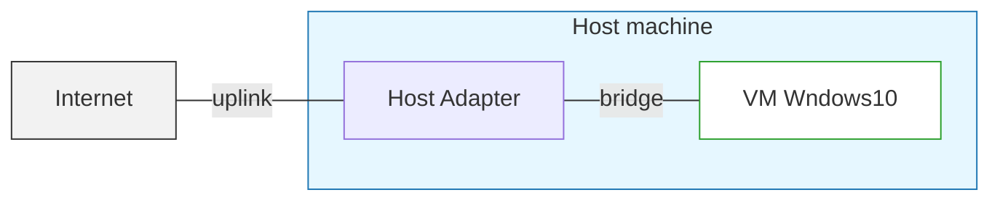
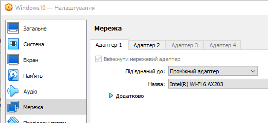
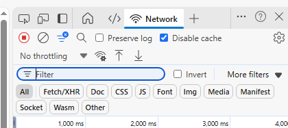
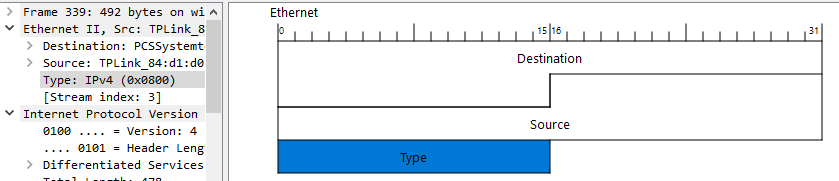

[<- До підрозділу](README.md)

# Аналіз мережних пакетів з використанням Wireshark

**Тривалість**: 0.5 акад. години

**Мета:**  Зрозуміти побудову мережних пакетів в контексті ієрархічної моделі мереж з використанням Wireshark.

## Лабораторна установка для проведення лабораторної роботи у віртуальному середовищі.

**Апаратне забезпечення, матеріали та інструменти для проведення віртуальної лабораторної роботи.** 

- ПК з встановленими віртуальними машинами з практичного заняття [Інструменти віддаленого доступу та налагодження: практична частина](lab.md)

**Програмне забезпечення, що використане у віртуальній лабораторній роботі.** 

1. ПЗ з практичного заняття [Інструменти віддаленого доступу та налагодження: практична частина](lab.md)

## Загальна постановка задачі

Цілі роботи: 

- розібрати мережні пакети в контексті їх структури та призначення
- визначити призначення протоколу кожного рівня на практиці   

рис.1. Схематичне зображення установки лабораторної роботи

Теоретичний матеріал:

- [Аналізатори пакетів (Wireshark та інші): теоретична частина](sniffers.md)

## Послідовність виконання роботи

### 1. Попередні налаштування та запуск віртуальної машини

- [ ] Запустіть віртуальну машину з Windows. Зробіть налаштування мережного інтерфейсу віртуальної машини на мостовий зв'язок з картою хостової, яка має доступ до Інтернет.  

рис.2. Налаштування адаптера віртуальної машини

**Надалі передбачається що всі дії робитимуться на віртуальній машині з Windows 10, якщо явно не буде вказано інше** 

### 2. Захоплення пакетів

- [ ] Запустіть веббраузер. 

- [ ] Натисніть `Ctrl+Shift+I` щоб відкрився інструмент розробника браузера. Деактивуйте кешування встановивши опцію `Disable Cache`. Це потрібно для того, щоб інформація постійно запрошувалася з оригінального розміщення а не кеша. 

рис.3. Встановлення опції вимкнення кешування

- [ ] Запустіть програму Wireshark. 

- [ ] Розпочніть захоплення пакетів з інтерфейсу що має підключення до Інтернет хостової машини.

- [ ] Поки Wireshark захоплює пакети, введіть у браузері URL:  http://gaia.cs.umass.edu/wireshark-labs/INTRO-wireshark-file1.html і відкрийте цю сторінку. Після того як браузер відобразить сторінку `INTRO-wireshark-file1.html` (це буде один рядок із привітанням), зупиніть захоплення вікні Wireshark.

Щоб відобразити сторінку браузер звернувся до HTTP-сервера `gaia.cs.umass.edu` та обмінявся з ним HTTP-повідомленнями для завантаження сторінки. Кадри Ethernet, що містять ці HTTP-повідомлення (а також усі інші кадри, які проходять через ваш мережний адаптер), будуть зафіксовані Wireshark.

- [ ] HTTP-обмін із сервером `gaia.cs.umass.edu` має з’явитися десь у списку захоплених пакетів. Але там також буде багато інших типів пакетів. Хоча ви зробили лише дію із завантаження вебсторінки, на вашому комп’ютері одночасно працювали багато інших протоколів, непомітних користувачу. 

### 3. Аналіз пакетів

- [ ] Проаналізувавши результат виведення визначте IP адресу, куди звертався бразуер для завантаження сторінки. Для пошуку потрібних пакетів зверніть увагу на протокол (`HTTP`) та зміст поля `Info`.   

- [ ] Скориставшись [теоретичними відомостями](sniffers.md) або [онлайн довідником](https://www.wireshark.org/docs/wsug_html_chunked/index.html) і виставте і застосуйте фільтр перегляду, щоб там відображалися тільки ті пакети, які передбачають обмін з визначеним IP. Зверніть увагу що фільтри чутливі до регістрів літер. 

- [ ] Використовуючи [цей опис](https://www.wireshark.org/docs/wsug_html_chunked/ChUsePacketListPaneSection.html) визначте залежності між пакетами. Знайдіть де починається HTTP запит і де приходить на нього відповідь. Зробіть копію екрану для звітності та коротко опишіть які залежності між пакетами вдалося визначити.

- [ ] Використовуючи поле фільтра зробіть так, щоб залишилися пакети тільки для хоста з вказаним IP та  протоколом http.

- [ ] У списку пакетів знайдіть пакет з запитом на сторінку (у полі Info буде вказано `GET` та відповідно адреса сайту), знайдіть пакет з відповіддю на цей запит. У верхньому рядку деталізації пакетів показується загальна інформація про захоплений кадр (`Frame`), а також інформацію про пакет кожного рівня, починаючи від Ethernet. Для кожного захопленого пакету послідовно виділяючи частину кожного рівня, у полі побайтного відображення подивіться за яку частину кадру ця частина відповідає. 

- [ ] Зайдіть в меню `Edit → Preferences → Layout`, і в списку панелей виберіть `Packet Diagram` замість `Packet Bytes`. Послідовно виділяючи частину кожного рівня, у полі пакетного відображення подивіться за яку частину кадру ця частина відповідає.  

рис.4. Приклад відображення виділених полів кадру у вікні структури пакету

- [ ] Виділяючи кадр запиту та відповіді, зробіть копії екранів вікна деталізації пакетів з відкритими деталями (це потрібно для звіту). Використовуючи вікно деталізації пакету, визначте та заповніть таблицю 1, яку також добавте до звіту. 

| Властивість                                                  | Пакет з запитом   | Пакет з відповіддю | Примітка                                                     |
| ------------------------------------------------------------ | ----------------- | ------------------ | ------------------------------------------------------------ |
| Перелік шарів пакетів з зазначенням: протоколів, кількості байтів що виділяються на заголовок та % від всього пакету, |                   |                    | Шари за моделлю IP стеку або OSI, назва; назви протоколів вказуються в деталізації пакетів |
| Кількість байт в захопленому кадрі                           |                   |                    |                                                              |
| Проміжок часу від моменту надсилання запиту                  | не застосовується |                    |                                                              |
| Адреса відправника канального рівня з поясненням того, що це за пристрій |                   |                    | пристроєм може бути мережна карта, маршрутизатор, тощо       |
| Адреса отримувача канального рівня з поясненням того, що це за пристрій |                   |                    |                                                              |
| Адреса відправника мережного рівня з поясненням того, що це за хост |                   |                    |                                                              |
| Адреса отримувача мережного рівня з поясненням того, що це за хост |                   |                    |                                                              |
| Порт відправника транспортного рівня з поясненням того, який процес (програма) його використовує |                   |                    |                                                              |
| Порт отримувача транспортного рівня з поясненням того, який процес (програма) його використовує |                   |                    |                                                              |
| Зміст та кількість байт корисного навантаження прикладної програми | 0                 |                    |                                                              |
| Відсоток кадру, яку займає «корисні дані»                    | не застосовується |                    |                                                              |

- [ ] Усі копії екранів та таблиці прикріпіть до звіту

Практичне заняття розробив [Олександр Пупена](https://github.com/pupenasan) з використанням матеріалів  [Wireshark Labs](https://gaia.cs.umass.edu/kurose_ross/wireshark.php) від J.F. Kurose, K.W. Ross 
