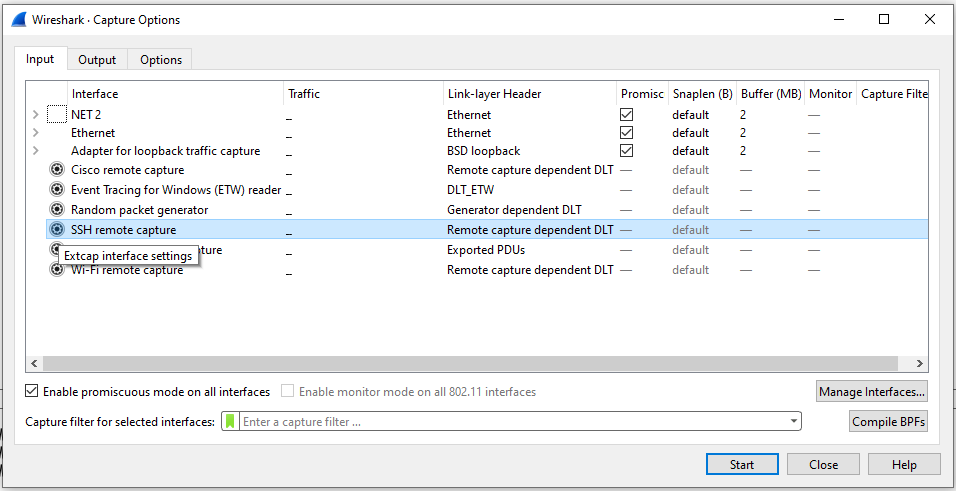

[<- До підрозділу](README.md)

# Аналізатори пакетів (Wireshark та інші): теоретична частина

## 1. Про аналізатори пакетів

Аналізатор пакетів також відомі під назвою  **Sniffer** (від англ. *to sniff* — нюхати) — це мережний аналізатор трафіку: програмний або апаратний засіб, призначений для перехоплення й аналізу мережних пакетів, що передаються між іншими вузлами. Сніфери використовують як у діагностиці та навчанні, так і в атаках або перевірці безпеки (пентестах). 

Сніфери можуть використовуватися для:

- Діагностика мережі: відстеження пакетних втрат, RTT, проблем маршрутизації, помилок протоколів.
- Аналіз продуктивності: вимірювання пропускної здатності, виявлення «вузьких місць».
- Виявлення помилок конфігурації: ARP-конфлікти, дублювання IP, проблеми з MTU.
- Перевірка безпеки: аналіз підозрілої активності, дослідження витоків даних (у тестових/дозволених середовищах).
- Освітні цілі: демонстрація структури протоколів (Ethernet, ARP, IP, TCP, HTTP тощо).

### Способи перехоплення трафіку

Можна виділити наступні способи перехоплення трафіку

1. Пасивне прослуховування інтерфейсу (promiscuous / monitor mode)
   - На Ethernet: інтерфейс у режимі promiscuous може приймати кадри, адресовані не тільки власному MAC.
   - На Wi-Fi: режим monitor дозволяє захоплювати всі 802.11 кадри (корисно для аналізу бездротових мереж).
   - Ефективність залежить від середовища: у сегменті з hub (концентратором) всі кадри доступні; у мережі зі switch — за замовчуванням тільки кадри для цього порту.
2. Підключення «в розрив каналу» (inline). Сніфер ставиться між двома кінцями каналу і отримує весь трафік. Часто застосовується у лабораторіях або з TAP-пристроями.
3. Копіювання/відгалуження трафіку (mirror / SPAN / RSPAN / ERSPAN)
   - Порт-mirroring (SPAN) на комутаторі: копія трафіку одного або кількох портів або VLAN дублюється на порт, де підключено сніфер.
   - RSPAN / ERSPAN — віддалене дзеркалювання (через VLAN або тунель).
4. Network TAP (апаратний): Спеціалізований пристрій, який на апаратному рівні дублює трафік без затримок і без впливу на роботу мережі — надійний спосіб для продукційного моніторингу.
5. Активні атаки / перенаправлення трафіку
   - ARP-spoofing / ARP-poisoning: зловмисник підмінює ARP-записи, щоб трафік ішов через його хост, потім переадресовує далі.
   - ICMP redirect, DNS-маніпуляції, BGP-атакування в інтердоменній мережі — приклади механізмів перенаправлення.
   - Ці методи — небезпечні і незаконні без явного дозволу; їх розгляд в курсі — винятково у контексті захисту та пентестів у контрольованому середовищі.
6. Бічні канали та електромагнітні випромінювання. У дуже спеціалізованих дослідженнях можливе відновлення інформації по побічних сигналах (EM-випромінювання, випромінювання кабелів). Це рідкісний і складний напрям.

Проблеми й обмеження:

- У середовищі зі switch без mirror/TAP — пасивний сніфер не побачить весь трафік.
- Шифрування на рівні застосунку/транспорту (TLS, HTTPS, SSH, IPsec) унеможливлює читання вмісту пакетів без ключів.
- Захоплення великих обсягів трафіку вимагає дискового простору, високої пропускної здатності та потужності для аналізу.
- Етичні й юридичні обмеження: перехоплення чужого трафіку без дозволу заборонене законом.

### Практичні інструменти (приклади)

- Wireshark — графічний аналізатор пакетів (зручний для розбору протоколів і демонстрацій).
- tcpdump / tshark — консольні утиліти для захоплення й аналізу.
- dumpcap — фоновий захоплювач, що використовується Wireshark/Tshark.
- ngrep, ssldump, ngrep, pktstat — для спеціалізованого аналізу.
- Ettercap, Bettercap — інструменти для ман-ін-де-мідел та мережевих тестів (тільки у тестовому середовищі).
- Hardware TAPs — апаратні копіювальні пристрої для продукційного моніторингу.

#### Захист від прослуховування

- Шифрування: TLS, SSH, IPsec — основні методи захисту даних у дорозі.
- 802.1X та автентифікація портів комутаторів.
- Port security, MAC-binding, обмеження mirror-профілів.
- Використання апаратних TAPів для офіційного моніторингу замість небезпечних методів (ARP-spoofing).
- RPKI, BGP-фільтрація та інші механізми захисту в інтердоменному маршрутуванні (для великих мереж).

## 2. Wireshark 

### Основне призначення та функції

Wireshark ― це один з найпотужніших і найпопулярніших аналізаторів мережевого трафіку (packet sniffer).  Програма Wireshark є однією з самих зручних реалізацій сніферів, яка доступна для багатьох ОС і поширюється безкоштовно. Wireshark дозволяє в режимі реального часу захватувати пакети з мережі, та аналізувати їх структуру. Також можна аналізувати структуру пакетів з файлу, який вміщує трафік, отриманий, наприклад програмою `tcpdump` (unix/linux). Його основні функції можна узагальнити так:

- Захоплення трафіку в реальному часі через вказаний мережевий інтерфейс (Ethernet, Wi-Fi, PPP тощо).
- Детальний аналіз пакетів, розбір структури пакетів від фізичного рівня до рівня прикладних протоколів (TCP/IP, HTTP, DNS, TLS, Modbus, OPC UA тощо) у вигляді дерева.
- Фільтрація та пошук, використовуючи як display filters (для перегляду) так і capture filters (для запису). Можливість знаходити потрібні пакети серед величезної кількості даних.
- Відтворення та реконструкція даних: відновлення TCP-сесій, перегляд вмісту (наприклад, HTTP-сторінки або VoIP-дзвінки). 
- Експорт даних з пакетів у файли.
- Візуалізація статистики через діаграми, графіки, гістограми для аналізу продуктивності, затримок, пропускної здатності. Статистика по протоколах, розмовах між вузлами, потоку трафіку.
- Робота з файлами трасувань, зокрема збереження і відкриття захопленого трафіку у форматах pcap/pcapng, порівняння різних дампів.
- Декодування TLS/SSL при наявності ключів.
- Можливість розширення за рахунок плагінів.
- Кросплатформеність і відкритість: працює на Windows, Linux, macOS.
- Є відкритим програмним забезпеченням (GPL).

Крім самого Wireshark що має графічний інтерфейс, до складу пакету входять утиліти, які можна поставити. Зокрема можна поставити `TShark` - консольну версію Wireshark. Дозволяє захоплювати і аналізувати трафік без графічного інтерфейсу. Зручно для скриптів, серверів або автоматизації.

Також входять зовнішні інструменти для захоплення специфічного трафіку, які інтегруються у Wireshark:

- `Androiddump` - Дозволяє захоплювати пакети з пристроїв Android через ADB (Android Debug Bridge).
- `Etwdump` - Працює з ETW (Event Tracing for Windows). Захоплення подій і трафіку напряму з Windows.
- `Randpktdump` - Генерує випадкові пакети для тестування. Використовується для перевірки роботи Wireshark без реального трафіку.
- `Sshdump` - Захоплення трафіку з віддаленого хоста через SSH (фактично запускає tcpdump/dumpcap на віддаленій машині і передає дані у Wireshark).
- `Ciscodump` - Захоплення трафіку з Cisco-роутерів і пристроїв за допомогою CLI або API.
- `Wifidump` - Захоплення Wi-Fi трафіку через бездротові адаптери у режимі моніторингу.

- `UDPdump` — це проста утиліта, яка прослуховує UDP-порта/адреси і «зливає» (dump) прийняті UDP-дейтаграми у вихід (stdout) або у файл (часто у pcap/pcapng або у вигляді шестнадцяткового/текстового дампу). 


### Робота з утилітою Wireshark

На рис. 1 зображене основне вікно програми Wireshark. У стандартному режимі вікно сніферу ділиться на 3 панелі: панель списку захоплених пакетів (packet lists), панель деталізації пакету (packet details), панель побайтового відображення пакетів (packet bytes). 


Рис.1. Основне вікно сніферу Wireshark. 

Панель списку пакетів вміщує всі пакети, які захоплені з мережі, попередньо відфільтровані через умову фільтру (Filter). Список можна відсортувати по будь-якому полю (в прямому або зворотному порядку) – для цього треба натиснути по заголовку відповідного поля. Кожний рядок вміщує наступні поля (по замовченню) 

-     порядковий номер пакету (`No.`);

-     час надходження пакету (`Time`);

-     джерело пакету (`Source`);

-     пункт призначення (`Destination`);

-     протокол (`Protocol`);

-     інформаційне поле (`Info`). 

Список полів які будуть відображатися в панелі списку як колонки налаштовується в Edit/Perferencis/Columns. Для того, щоб зміни вступили в силу, після добавлення колонок треба натиснути `Apply`. 

Панель деталізації пакетів показує ієрархічну протокольну структуру вибраного в панелі списку пакету. Тобто вказується вкладеність PDU (пакетів) один в одного, згідно відомих Wireshark протоколів. При виділенні PDU, його вміст в байтах показується на панелі побайтового відображення. При розкриванні PDU (+), виводиться детальний аналіз його полів. Так, наприклад, на рис.1 видно, що в кадр EthernetII вкладений пакет IPv4, в який в свою чергу вкладений пакет ICMP (Internet Control Message Protocol). Для виділених пакетів видно поля та їх значення, які розділені через двокрапку. Так, наприклад, на рис.1 видно, що поле ICMP-пакету з назвою Type має значення 0, що вказує на тип «Echo (ping) reply». 


Рис.2.

На панелі побайтового відображення пакетів для виділених пакетів показується його 16-кове та символьне представлення. 

### Захоплення пакетів

Для початку захоплення пакетів необхідно задати параметри, зокрема, вказати мережний інтерфейс, з якого і буде відбуватися захват пакетів. Це можна зробити під час запуску (рис.3) або через команду `Options` меню `Capture`.  


Рис.3. Вибір інтерфейсів та параметрів захвату пакетів.

Вкладка `Input` містить таблицю `Interface`, яка показує такі стовпці:

- `Interface` -  Назва інтерфейсу. Деякі інтерфейси дозволяють або вимагають конфігурацію перед початком захоплення. Це позначається піктограмою налаштування ліворуч від назви інтерфейсу. Натиснувши на піктограму, ви відкриєте діалог налаштування цього інтерфейсу.
- `Traffic` = Міні-графік (sparkline), що відображає активність мережі з часом.
- `Link-layer Header` - Тип пакета, який захоплює цей інтерфейс. У деяких випадках його можна змінити (див. розділ 4.9 «Link-layer header type»).
- `Promiscuous` - Дозволяє встановити інтерфейс у режим `promiscuous` під час захоплення. Зверніть увагу, що інший застосунок може перевизначити цей параметр.
- `Snaplen` - Довжина зрізу (snapshot length) або кількість байтів, які будуть збережені для кожного пакета. Можна задати явно з міркувань продуктивності чи конфіденційності.
- `Buffer` - Розмір буфера ядра, зарезервованого для захоплення пакетів. Зазвичай значення за замовчуванням достатнє, але його можна змінювати.
- `Monitor Mode` - Дозволяє захоплювати повні сирі заголовки 802.11. Підтримка залежить від типу інтерфейсу, обладнання, драйвера та ОС. Зверніть увагу: увімкнення може розірвати підключення до бездротової мережі.
- `Capture Filter` - Фільтр захоплення, застосований до цього інтерфейсу. Його можна змінити подвійним клацанням. 

При наведенні курсора на інтерфейс або його розгортанні відображаються пов’язані з ним IPv4- та IPv6-адреси. Якщо увімкнено `Enable promiscuous mode on all interfaces`, індивідуальні параметри promiscuous, зазначені вище, будуть переозначені. Параметр `Capture filter for selected interfaces` дозволяє задати фільтр одразу для кількох інтерфейсів. `Manage Interfaces` відкриває діалогове вікно, де можна визначати канали (pipes), сканувати чи приховувати локальні інтерфейси, а також додавати віддалені. `Compile Selected BPFs` відкриває діалогове вікно, у якому показується скомпільований байткод для вашого capture filter. Це може допомогти краще зрозуміти створений фільтр.

Вкладка `Output` показує таку інформацію:

- `Capture to a permanent file`
  - `File` -  Тут задається ім’я файлу для збереження захоплених даних. За замовчуванням порожнє, тоді дані зберігаються у тимчасовий файл. Можна також натиснути кнопку справа, щоб вибрати файл у файловій системі.
  - `Output format` -  Формат файлу захоплення. За замовчуванням `pcapng`, який є гнучкішим за `pcap`. Наприклад, `pcapng` потрібний, якщо обрано більше одного інтерфейсу. Детальніше: https://wiki.wireshark.org/Development/PcapNg.
- `Create a new file automatically…`  Умови автоматичного створення нового файлу захоплення: кількість пакетів у файлі; розмір файлу; тривалість захоплення; системний час.
- `Use a ring buffer with` (лише для кількох файлів). Формує буфер кільця з файлів захоплення із заданою кількістю файлів.


Рисунок 4. Вкладка Capture Options → Output

Вкладка `Options` показує таку інформацію:

- `Display Options` 
  - `Update list of packets in real-time`  Оновлює список пакетів у реальному часі. Якщо не ввімкнено — пакети з’являться тільки після завершення захоплення. У цьому режимі Wireshark захоплює трафік окремим процесом і передає його процесу відображення.
  - `Automatically scroll during live capture` - Автоматичне прокручування списку пакетів під час надходження нових. Прокрутка тимчасово відключається при ручному прокручуванні або дії "Go", і відновлюється при поверненні в кінець списку. Якщо опція вимкнена, пакети додаються без прокручування. (Не діє, якщо вимкнено «Update list of packets in real-time»).
  - `Show capture information during capture` - Показує інформаційне вікно про процес захоплення
- `Name Resolution`
  - `Resolve MAC addresses` — перетворювати MAC-адреси на імена.
  - `Resolve network names` — перетворювати мережеві адреси на імена.
  - `Resolve transport names` — перетворювати транспортні номери портів на імена.
- `Stop capture automatically after…`
   Захоплення можна зупинити автоматично за умовами:
  - кількість пакетів у файлі;
  - кількість файлів захоплення;
  - розмір файлу;
  - тривалість захоплення.

Ви можете двічі клацнути по рядку інтерфейсу у вкладці `Input` або натиснути `Start` у будь-якій вкладці, щоб почати захоплення. Кнопка `Cancel` застосовує зміни та закриває діалог.


Рисунок 5. Вкладка Capture Options → Options

Діалогове вікно `Manage Interfaces` спочатку відкриває вкладку `Local Interfaces`, яка дозволяє керувати такими параметрами:

- `Show`- Відображати чи приховувати цей інтерфейс на стартовому екрані та в діалоговому вікні `Capture Options`.
- `Friendly Name` - Людинозрозуміле ім’я інтерфейсу.
- `Interface Name` - Системне ім’я інтерфейсу.
- `Comment` - Може бути використане для додавання описового коментаря до інтерфейсу.

Вкладка `Pipes` дозволяє захоплювати пакети з іменованого каналу (named pipe). Для успішного додавання канал уже має бути створений. Натисніть **+** і введіть ім’я каналу разом із шляхом до нього. Також можна скористатися кнопкою `Browse` для пошуку каналу.

У `Microsoft Windows` вкладка `Remote Interfaces` дозволяє захоплювати пакети з інтерфейсу іншої машини. Перед цим на цільовій платформі має бути запущений сервіс `Remote Packet Capture Protocol`, інакше Wireshark не зможе підключитися. 

Кожен інтерфейс можна приховати. 


Рисунок 6. Діалогове вікно “Manage Interfaces”

У якості додаткових параметрів захвату можна вказати:

-     `Capture Filter` – фільтр захвату. Тут можна добавляти той чи інший фільтр із існуючих, або вказати умови фільтрації.
-     `Update list of packets in real time` – оновлення списку захоплених пакетів в режимі реальног очасу.
-     `Stop Capture` – набір параметрів, які дозволяють задати те чи інше значення, при досягненні якого процес захвату закінчиться.
-     `Name Resolution` – набір параметрів вирішення імен дозволяє визначити які із способів вирішення імен повинні використовуватися.

Для початку моніторинга мережної активності необхідно натиснути `Start`. Після вибору інтерфейсу, який цікавить, можна починати і закінчувати захват пакетів через команди в меню `Capture`.

### Налаштування фільтрів

Якщо запустити сніфер без додаткових налаштувань, то він буде захоплювати всі пакети, які проходять через мережний інтерфейс. Найбільш часто користувача цікавлять тільки деякі пакети, які відповідають заданим критеріям. Для означення цих критеріїв служать фільтри . Існує два варіанти фільтрації пакетів: на етапі захоплення і на етапі відображення користувачу. У першому випадку споживані системні ресурси значно нижче, ніж у 2-му випадку. 

#### Фільтри захоплення (Capture Filters)

Wireshark підтримує обмеження захоплення пакетів лише тими, які відповідають фільтру захоплення. Фільтри захоплення Wireshark пишуться мовою фільтрів libpcap. Нижче наведено короткий огляд синтаксису цієї мови. Повна документація доступна на сторінці `pcap-filter` (man page). Багато прикладів Capture Filter можна знайти за адресою: https://wiki.wireshark.org/CaptureFilters.

Фільтр захоплення вводиться у поле `Filter` діалогового вікна `Capture Options` у Wireshark. Фільтр захоплення має вигляд послідовності примітивних виразів, з’єднаних сполучниками (`and/or`) і, за потреби, з префіксом `not`:

```
[not] primitive [and|or [not] primitive ...]
```

Наприклад фільтр захоплення для Telnet-трафіку з конкретним хостом

```
tcp port 23 and host 10.0.0.5
```

Цей приклад захоплює весь Telnet-трафік до і від хоста `10.0.0.5` та демонструє, як використовувати два примітиви та сполучник `and`.

Наприклад захоплення всього Telnet-трафіку, окрім того, що йде з `10.0.0.5`

```
tcp port 23 and not src host 10.0.0.5
```

Примітиви:

- `[src|dst] host` - Фільтрація за IP-адресою або іменем хоста. Префікси **src** або **dst** дозволяють уточнити напрямок (джерело чи призначення). Якщо їх немає, фільтр спрацьовує на обидва напрямки.
- `ether [src|dst] host`  - Фільтрація за Ethernet-адресою (MAC). Можна уточнити напрямок через **src** або **dst**.
- `gateway host` - Фільтрація пакетів, що проходять через вказаний хост як шлюз: MAC-адреса збігається, але IP-адреса не є джерелом чи призначенням.
- `[src|dst] net  [{mask }|{len }]` - Фільтрація за мережею (наприклад, `192.168.1.0/24`). Можна уточнити напрямок (src|dst). Підтримується маска або CIDR-префікс.
- `[tcp|udp] [src|dst] port`  - Фільтрація за TCP або UDP-портом. Напрямок можна уточнити через **src** або **dst**. Якщо протокол не вказаний, відбираються обидва (TCP і UDP).
- `less|greater` - Фільтрація за довжиною пакета (менше/більше заданої).
- `ip|ether proto`  - Фільтрація за протоколом на рівні Ethernet або IP.
- `ether|ip broadcast|multicast` - Фільтрація широкомовних або мультикаст-пакетів (Ethernet чи IP).
-  `relop`  - Можна будувати складні вирази для відбору байтів чи діапазонів у пакетах. Докладніше див. `pcap-filter`: https://www.tcpdump.org/manpages/pcap-filter.7.html.

Якщо Wireshark запускається віддалено (наприклад, через SSH, експортоване X11-вікно, термінальний сервер тощо), то весь цей допоміжний трафік також проходить через мережу, додаючи безліч (зазвичай неважливих) пакетів до корисного трафіку. Щоб цього уникнути, Wireshark намагається визначити, чи працює він у віддаленому середовищі (перевіряючи деякі змінні середовища) й автоматично створює capture filter, що відсікає «сервісний» трафік з’єднання. Аналізуються такі змінні:

- `SSH_CONNECTION (ssh)` -  `<remote IP> <remote port> <local IP> <local port>`
- `SSH_CLIENT (ssh)` -  `<remote IP> <remote port> <local port>`
- `REMOTEHOST (tcsh, інші?)` -  `<remote name>`
- `DISPLAY (x11)` -  `[remote name]:<display num>`
- `SESSIONNAME (terminal server)` -  `<remote name>`

У Windows Wireshark звертається до ОС, щоб дізнатися, чи працює вона у середовищі Remote Desktop Services.

#### Фільтри перегляду (Display Filters) 

При означенні фільтру вказуються умови, яким повинні відповідати ті пакети, які повинні бути пропущені через фільтр. Назва полів та протоколів в фільтрі вводиться тільки маленькими літерами. Якщо текст фільтру має коректний зміст, поле фільтру підсвічується зеленим, якщо некоректний – червоним. Для задіяння фільтру необхідно його підтвердити кнопкою "Apply".

Фільтрацію можна проводити за протоколами або за значеннями полів в PDU (пакеті). Для застосування фільтрації за протоколом необхідно в поле вводу фільтра ввести назву протоколу. Наприклад фільтр за протоколом `arp` виводить тільки ARP-кадри (рис.7).


Рис.7. Приклад задавання фільтру через назву протоколу.

Для фільтрації за значенням поля в PDU, записується назва поля, оператор порівняння та значення з яким порівнюється це поле. Для формування тексту фільтру можна скористатися майстром побудови виразів фільтру, який викликається через кнопку `Expression...`. Наприклад результат роботи майстра з рис.8 буде текстове значення фільтру  

`modbus_tcp.func_code == 3`

У таб.1наводиться перелік найбільш вживаних для лабораторних робіт полів.

 Таб 1 

| Поле          | Опис                                                         |
| ------------- | ------------------------------------------------------------ |
| eth.addr      | Фізична адреса джерела або отримувача в кадрі Ethernet       |
| eth.dst       | Фізична адреса отримувача в кадрі Ethernet                   |
| eth.src       | Фізична адреса джерела в кадрі Ethernet                      |
| eth.len       | Довжина кадру Ethernet                                       |
| ip.addr       | Мережна адреса джерела або отримувача в пакеті протоколу  IP |
| ip.dst        | Мережна адреса отримувача в пакеті протоколу IP              |
| ip.src        | Мережна адреса джерела в пакеті протоколу IP                 |
| ip.proto      | Позначення протоколу, який був інкапсульований в пакет IP    |
| tcp.ack       | Підтвердження (АСК) протоколу ТСР                            |
| tcp.port      | Порт джерела і отримувача в сегменті протоколу TCP           |
| tcp.dstport   | Порт отримувача в сегменті протоколу TCP                     |
| tcp.srcport   | Порт джерела в сегменті протоколу TCP                        |
| udp.port      | Порт джерела або отримувача в сегменті протоколу UDP         |
| udp.dstport   | Порт отримувача в сегменті протоколу UDP                     |
| udp.srcport   | Порт джерела в сегменті протоколу UDP                        |
| dns.qry.name  | Ім’я мережного ресурсу в DNS запиті                          |
| dns.resp.name | Ім’я мережного ресурсу в DNS відповіді                       |


Рис.8. Приклад задавання фільтру через поле протоколу.

Оператор порівняння може являти собою С-подібний оператор або символьне скорочення оператору, які наведені в таб.2

Таб.2

| символьне скорочення | C-like | Опис                 | Приклад            |
| -------------------- | ------ | -------------------- | ------------------ |
| `eq`                 | `==`   | Рівне                | ip.src==10.0.0.5   |
| `ne`                 | `!=`   | Нерівне              | ip.src!=10.0.0.5   |
| `gt`                 | `>`    | Більше  ніж          | frame.len > 10     |
| `lt`                 | `<`    | Менше  ніж           | frame.len < 128    |
| `ge`                 | `>=`   | Більше  або дорівнює | frame.len >= 0x100 |
| `le`                 | `<=`   | Менше  або дорівнює  | frame.len <= 0x20  |

Значення поля типу беззнакового цілого можна вводити в різних системах числення: 10-кова, 8-кова (починається з `0`), 16-кова (починається з `0x`). Наприклад, наступні значення еквівалентні.

`ip.len le 1500`

`ip.len le 02734`

`ip.len le 0x436`

Для того щоб задати умову для булевого поля, достатньо вказати це поле. Наприклад, наступне значення фільтру пропустить тільки ті пакети, для яких прапорець SYN в сегменті TCP буде виставлений  

`tcp.flags.syn`

Байти або два байти адреси Ethernet можуть бути розділені розділювачами `:`, `-` або `.`. Наприклад:

`eth.dst == ff:ff:ff:ff:ff:ff`

`eth.dst == ff-ff-ff-ff-ff-ff`

`eth.dst == ffff.ffff.ffff`

Для означення в умові текстового поля, його значення береться в лапки. Наприклад: 

`http.request.uri == "http://www.wireshark.org/" `

При побудові фільтру можна комбінувати дві та більше умови, використовуючи логічні оператори. У якості умови може виконуватися як фільтрація за протоколами, так і фільтрація за значенням полів. 

Таб.3.

| символьне скорочення | C-like | Опис                         | Приклад                                 |
| -------------------- | ------ | ---------------------------- | --------------------------------------- |
| not                  | `!`    | заперечення                  | `not llc`                               |
| and                  | `&&`   | конкатенація (логічне «І»)   | `ip.src==10.0.0.5 and tcp.flags.fin`    |
| or                   | `||`   | альтернатива (логічне «АБО») | `ip.scr==10.0.0.5 or ip.src==192.1.1.1` |

### Кольорове виділення пакетів

Дуже корисним механізмом у Wireshark є кольорове виділення пакетів відповідно до фільтра відображення. У Wireshark існує два типи правил кольоризації:

- тимчасові правила, які діють лише до завершення роботи програми,
- постійні правила, що зберігаються у файлі налаштувань і доступні при наступному запуску Wireshark.

Тимчасові правила можна додати, вибравши пакет і натиснувши клавішу Ctrl разом з однією з цифрових клавіш. Це створить правило кольоризації на основі поточно вибраної сесії. Wireshark намагатиметься створити фільтр сесії спочатку на основі TCP, потім UDP, далі IP і нарешті Ethernet. Тимчасові фільтри також можна створити, клацнувши правою кнопкою миші в області деталей пакета й обравши Colorize with Filter → Color X.

Щоб постійно виділяти пакети кольором, оберіть `View → Coloring Rules….`  Якщо ви відкрили діалогове вікно Coloring Rules вперше та використовуєте профіль налаштувань за замовчуванням, то побачите стандартні правила, показані вище.


рис.9.

Перше співпадіння перемагає. Більш специфічні правила зазвичай потрібно розташовувати вище за більш загальні. Наприклад, якщо у вас є правило кольоризації для UDP перед правилом для DNS, правило DNS може не застосовуватися (DNS зазвичай працює поверх UDP, і правило UDP спрацює першим). 

Таб.4.

| Назва правила                    | Фільтр (скорочено)         | Пояснення                                                    |
| -------------------------------- | -------------------------- | ------------------------------------------------------------ |
| Bad TCP                          | `tcp.analysis.flags`       | Проблеми з TCP (retransmission, dup ACK, out-of-order, keep-alive тощо). |
| HSRP State Change                | `hsrp.state != ...`        | Зміна стану HSRP (протокол резервування шлюзів).             |
| Spanning Tree Topology Change    | `stp.type == 0x80`         | Повідомлення про зміну топології Spanning Tree Protocol.     |
| OSPF State Change                | `ospf.msg == 1`            | Зміна стану OSPF (Open Shortest Path First).                 |
| ICMP errors                      | `icmp.type in {3,5,11}`    | ICMP-повідомлення про помилки (Destination Unreachable, Time Exceeded). |
| ARP                              | `arp`                      | Запити та відповіді ARP (розпізнавання MAC-адрес).           |
| ICMP                             | `icmp                      |                                                              |
| TCP RST                          | `tcp.flags.reset == 1`     | TCP-пакети з прапором Reset (розрив з’єднання).              |
| SCTP ABORT                       | `sctp.chunk_type == ABORT` | Аварійне завершення SCTP-сесії.                              |
| IPv4 TTL low or unexpected       | `ip.ttl <= ...`            | Аномалії TTL у IPv4 (може вказувати на помилки маршрутизації). |
| IPv6 hop limit low or unexpected | `ipv6.hlim not in ...`     | Аномалії hop limit у IPv6.                                   |
| Checksum Errors                  | `eth.fcs.status == "Bad"   |                                                              |
| SMB                              | `smb                       |                                                              |
| HTTP                             | `tcp.port == 80            |                                                              |
| DCERPC                           | `dcerpc`                   | DCE/RPC (використовується Windows для віддалених викликів).  |
| Routing                          | `hsrp                      |                                                              |
| TCP SYN/FIN                      | `tcp.flags.syn == 1        |                                                              |
| TCP                              | `tcp`                      | Увесь TCP-трафік.                                            |
| UDP                              | `udp`                      | Увесь UDP-трафік.                                            |
| Broadcast                        | `eth[0] & 1`               | Широкомовні Ethernet-кадри.                                  |
| System Event                     | `systemd_journal           |                                                              |


### Архітектура

Wireshark складається з двох великих частин: захоплення (capture / dumpcap / libpcap) і аналіз/відображення (epan → core → GUI). Захоплені байти потрапляють із мережі через драйвер (libpcap / Npcap) → записуються (dumpcap / wiretap) → розбираються (epan dissectors) → показуються в GUI або виводяться TShark/утилітами (рис.10).


рис.10.

Компоненти та їх призначення (див. рис.10)

- `npcap/libpcap` - низькорівнева бібліотека/драйвер, що взаємодіє з мережевим інтерфейсом (raw socket/BPF). Вона забезпечує capture-filters (BPF) — відсікає пакети ще в ядрі/драйвері, щоб передавати в користувацький простір лише потрібні байти. Працює з мережею/шиною (Network / Bus).

- `Dumpcap` (capture engine) - оптимізований процес/утиліта для захоплення й запису пакетів у файл. Мінімальний оверхед: саме його часто запускає Wireshark замість повноцінного GUI-процесу. Підтримує опції: snaplen, ring buffer (-b), авто-стоп (-a), не вимагає повного розбору пакетів.

- `Wiretap` - бібліотека для читання/запису файлів трасувань (pcap, pcapng та ін.). Відповідає за доступ до жорсткого диска (Harddisk): запис і читання capture-файлів.

- `Capture` (модуль у Core) - Логіка, яка керує процесом захоплення (виклик dumpcap/libpcap, опції, інтерфейси). Координує збереження файлів через Wiretap.

- `Core` - Серцевина Wireshark: координує взаємодію між захопленням, парсингом (epan) та GUI. Приймає байти з Capture/Wiretap і передає їх на розбір.

- `Epan` (dissector engine) - Модуль, що розбирає (dissect) пакети по стеку протоколів. Складається з:

  - `Dissectors` — функції/модулі, які розпізнають протоколи (Ethernet, IP, TCP, HTTP, DNS і т.д.).

  - `Dissector-plugins` — розширення, додаткові розбори, користувацькі плагіни.

  - `Protocol-Tree` — структура, яка зберігає розбір пакета (для відображення у дереві).

  - `Display-Filters` — логіка фільтрації вже розібраних пакетів (мова display filter, складні умови).

- `GUI (Qt)` - Інтерфейс користувача: список пакетів, панель деталей (protocol tree), байтовий перегляд, статистика, діаграми. Отримує розбір (Protocol-Tree) від Epan і відображає користувачу. Викликає Core для старт/стоп захоплення, застосування display-filter, coloring rules тощо.

- `Utilities`
  - Утиліти, які йдуть разом із Wireshark (tshark, editcap, mergecap, extcap-tools).
  - CLI-версія (TShark) використовує ті самі рушії (epan, wiretap).

Ось спрощена схема роботи Wireshark:

Таб.5.

| Етап                            | Що відбувається                                              |
| ------------------------------- | ------------------------------------------------------------ |
| 1. Захоплення мережевих пакетів | Wireshark використовує бібліотеку типу `libpcap` (на Linux/Unix) або `Npcap / WinPcap` (на Windows) для перехоплення сирих пакетів з інтерфейсу мережі. Пакети можуть бути фільтровані вже на цьому етапі (“capture filter”). |
| 2. Буферизація / запис          | Пакети або відразу обробляються, або записуються у файл (наприклад `.pcap` чи `.pcapng`), щоб зберегти дані для майбутнього аналізу |
| 3. Розбір (dissection)          | Коли пакети захоплені або відкриті з файлу, Wireshark розбирає (дескодує) заголовки протоколів (Ethernet, IP, TCP/UDP, додаткові рівні, прикладні протоколи) і визначає поля (адреси, порти, прапорці, типи). |
| 4. Фільтрація та відображення   | Користувач може застосувати display-фільтри, щоб побачити тільки ті пакети, які відповідають якимось умовам (IP адреса, порт, тип протоколу і т.д.). Також є кольорове підсвічення (colorization), яке допомагає візуально виділити певні пакети. |
| 5. Аналіз / статистика          | Wireshark дає можливість переглянути часові параметри, діаграми, об'єднання розмов (“conversations”), підрахунок ендпоінтів, статистику по протоколах, побудувати графіки потоку трафіку тощо. Це допомагає виявити аномалії, вузькі місця, помилки. |

Capture-filters (BPF) застосовуються на етапі libpcap/driver — дуже ефективні, але незворотні: якщо щось не захоплено — відновити не можна. `Display-filters` застосовуються після розбору (epan) — гнучкі та безпечні для аналізу (ви завжди маєте весь дамп). `dumpcap` запускають підпривілеєм (root) для доступу до інтерфейсу; після захоплення Wireshark може працювати з обмеженими правами для безпеки. Для великих/тривалих захоплень краще використовувати `dumpcap` із `ring buffer` та обмеженнями, щоб уникнути переповнення диску. Розширюваність: dissector-плагіни дозволяють додавати нові протоколи без зміни ядра Wireshark.

### Tshark

**TShark** — це консольна (CLI) версія Wireshark. Вона виконує ті ж основні функції: захоплення та аналіз мережевих пакетів, але без графічного інтерфейсу. Він працює в терміналі (Windows CMD/PowerShell, Linux shell), використовує ті ж бібліотеки, що й Wireshark (libpcap / npcap), може запускатися як у реальному часі, так і для аналізу вже готових `.pcap/.pcapng` файлів, підходить для автоматизації, скриптів, серверів без GUI.

Приклади використання

- Автоматичний збір трафіку на сервері (cron/systemd).
- Моніторинг підозрілих з’єднань у реальному часі (`tshark -i any -Y "tcp.analysis.retransmission"`).
- Швидкий пошук по великих дампах (без відкриття у Wireshark).
- Інтеграція з IDS/моніторингом (запуск по тригеру).
- Використання на headless-серверах, де GUI неможливий.

Приклади команд:

- Виведення переліку інтерфейсів

```
tshark -D
```

- Для захоплення трафіку у консоль з інтерфейсу `eth0` : 

```bash
tshark -i eth0
```

- Збереження у файл для подальшого відкриття у Wireshark:

```bash
tshark -i eth0 -w capture.pcapng
```

- Те саме але з обмеженням 60 секунд

```
tshark -i eth0 -a duration:60 -w capture.pcapng
```

- Фільтри захоплення (як у tcpdump, BPF), наступний захоплює лише HTTP-трафік.

```bash
tshark -i eth0 -f "tcp port 80"
```

Фільтри відображення (як у Wireshark), аналіз уже збереженого дампу, вивід лише пакетів від потрібного хоста.

```bash
tshark -r capture.pcapng -Y "ip.src==192.168.0.1"
```

- Вивід конкретних полів. Показує лише джерело, призначення і довжину кадру.

```bash
tshark -r capture.pcapng -T fields -e ip.src -e ip.dst -e frame.len
```

- Статистика. Будує статистику по кількості пакетів/байтів за інтервалами (1 секунда).

```bash
tshark -z io,stat,1
```

- Ротація файлів (ring buffer). Запис у кілька файлів по 10 МБ у циклі (для довготривалого моніторингу).

```bash
tshark -i eth0 -b filesize:10240 -b files:5 -w dump.pcapng
```

### Віддалене захоплення пакетів з Linux

**sshdump** — це зовнішній модуль (extcap) Wireshark, який дозволяє виконувати віддалене захоплення трафіку через SSH. Він запускає на віддаленій машині інструмент (наприклад, `tcpdump` або `dumpcap`) і передає пакети у Wireshark по захищеному SSH-з’єднанню. Деталі на https://www.wireshark.org/docs/man-pages/sshdump.html

Основні можливості:

- Захоплення пакетів з віддаленого Linux/Unix-хоста без встановлення Wireshark на ньому.
- Підтримка автентифікації паролем або SSH-ключем.
- Використання тих самих інтерфейсів фільтрації, що й у локальному захопленні.
- Безпечна передача трафіку (зашифровано через SSH).

sshdump можна запускати окремо, наприклад:

```bash
sshdump --remote-host 192.168.1.10 \
        --remote-port 22 \
        --remote-username user \
        --remote-interface eth0 \
        --remote-capture-command "sudo tcpdump -U -i eth0 -w - not port 22" \
        -w capture.pcapng
```

Тут пакети з віддаленого хоста будуть збережені у файл `capture.pcapng`.

Перед використанням необхідно

- Переконатись, що на віддаленій машині встановлений `tcpdump` або `dumpcap`.
- Користувач повинен мати права на захоплення трафіку (через `sudo` або capabilities).
- Виключайте SSH-трафік у фільтрі, інакше ви будете «ловити» власний тунель.
- При великому обсязі трафіку застосовуйте capture-фільтри, щоб зменшити навантаження на мережу і Wireshark.

Є кілька способів підключити Wireshark на Windows до мережевого інтерфейсу на Linux і захоплювати пакети «з віддаленої машини». Нижче — огляд варіантів з практичними прикладами та застереженнями.

#### Через Remote Packet Capture (rpcap / rpcapd)

Це «рідний» механізм від libpcap, який Wireshark підтримує (вікно `Manage Interfaces → Remote Interfaces`). На Linux встановлюєте і запускаєте `rpcapd` (демон Remote Packet Capture), який слухає порт 2002 (за замовчуванням). У Wireshark (Windows) додаєте віддалений хост у `Manage Interfaces → Remote Interfaces` і підключаєтесь.

Переваги: пряме підключення інтерфейсу у Wireshark, інтерактивне управління. 

Недоліки / застереження: `rpcapd` за замовчуванням може бути небезпечним (null-auth). Рекомендується використовувати парольну автентифікацію або запускати через SSH-тунель. Потрібні права root на Linux, щоб `rpcapd` міг захоплювати інтерфейси. Відкритий порт 2002 у фаєрволі цільової машини / мережі.

#### Локальне захоплення на Linux + передача файлу

Простіший (і часто безпечніший) підхід — зробити захоплення на Linux у файл (`tcpdump -w capture.pcapng`), потім переслати файл на Windows (SCP, SMB) і відкрити у Wireshark.

Плюс: дозволяє зберегти повний дамп для подальшого аналізу.

#### Через SSH

Захоплення трафіку через SSH дозволяє аналізувати пакети на віддаленому хості без встановлення графічного інтерфейсу чи копіювання великих pcap-файлів на локальну машину. У Wireshark це можна налаштувати через extcap-інструмент `sshdump` (SSH remote capture) або вручну через консоль (див. нижче). Основна ідея — на віддаленому вузлі запускати процес, який читає мережевий інтерфейс і пише pcap-потік на stdout, а локальна машина через SSH читає цей потік і передає його в Wireshark або записує у файл.

##### SSH remote capture

Щоб налаштувати віддалене захоплення через SSH remote capture необхідно клікнути ліворуч від назви інструменту.



рис.11. 

У вікні параметрів SSH remote capture є кілька вкладок (рис.12). На вкладці `Server` вказують адресу віддаленого SSH-сервера і порт (типово 22). На вкладці `Authentication` задають ім’я користувача, пароль або шлях до приватного SSH-ключа (за бажанням — passphrase до ключа), а також ProxyCommand для обходу проксі, якщо це потрібно. На вкладці `Capture` в полі `Remote interface` вводять ім’я інтерфейсу на віддаленому хості (наприклад `enp0s3`), вибирають, якою командою виконувати захоплення (`tcpdump` або `dumpcap`), вказують спосіб отримання привілеїв (`sudo`, `doas` або `none`), встановлюють capture filter (BPF) і ліміт на кількість пакетів. Вкладка Debug дозволяє включити логування роботи `extcap` для діагностики помилок. `Log level` означує, наскільки детально `sshdump` буде повідомляти про свою роботу. Це не має відношення до журналів самого Wireshark або до трафіку, який захоплюється. Це стосується лише службових повідомлень від extcap-процесу. Параметри можна зберегти для подальшого використання.


рис.12

Для захоплення на віддаленому хості звично використовують `tcpdump` або `dumpcap`. `Tcpdump` широко доступний і зручний для швидких тестів; `dumpcap` менше навантажує систему і оптимізований для тривалого запису, тому в production-сценарі частіше рекомендується `dumpcap`. У Wireshark у полі Remote capture `command selection` можна обрати `tcpdump` або `dumpcap`; якщо на віддаленому хості встановлений `dumpcap`, саме його варто використовувати.

Частою перешкодою при запуску `sshdump` є те, що sudo на віддаленому хості вимагає інтерактивного вводу пароля, а Wireshark не має tty для передачі пароля. Типове повідомлення про помилку: «sudo: a terminal is required to read the password». Існують кілька способів вирішення. Перший — дозволити запуск потрібної команди без пароля через `sudoers`. Це реалізується додаванням рядка у конфігурацію sudoers через visudo, наприклад (шлях до `tcpdump` слід перевірити командою `which tcpdump`):

```
vboxuser ALL=(ALL) NOPASSWD: /usr/bin/tcpdump
```

Після цього команда `ssh vboxuser@host sudo tcpdump ...` повинна запускатися без запиту пароля. Якщо дозволяти sudo без пароля неприйнятно, можна надати самому бінарнику право захоплення пакетів без `root` через `setcap`:

```
sudo setcap cap_net_raw,cap_net_admin=eip /usr/bin/tcpdump
```

Після цього `tcpdump` можна запускати без `sudo` і у Wireshark у полі `Gain capture privilege` вибрати `none`. Альтернативний підхід — налаштувати автентифікацію по SSH-ключу і організувати `runner` на віддаленій машині, який записує дампи у файл після спрацьовування певного тригера.

У GUI потрібно правильно вказати віддалений інтерфейс, вибрати команду (tcpdump або dumpcap) і спосіб підйому привілеїв. Часто помилка виникає через те, що sudo вимагає пароль або tcpdump знаходиться в іншому шляху, ніж вказано в sudoers. Для діагностики корисно спочатку протестувати команду вручну з вашої робочої станції:

```
ssh user@remote "sudo tcpdump -i enp0s3 -c 5"
```

якщо цей виклик питає пароль або дає помилку, потрібно виправити конфігурацію sudoers або шляхи до бінарника. Також варто включити логування у вкладці Debug в діалозі SSH remote capture, щоб отримати розгорнуту інформацію про помилки extcap.

Фільтри захоплення (capture filters, мова BPF) застосовуються на віддаленому боці та зменшують обсяг передаваних даних, тому їх слід використовувати максимально обережно й ефективно. Наприклад, якщо вас цікавить лише трафік до певного хоста або порту, вкажіть `host 10.0.0.5 and tcp port 80`. Виключення SSH-трафіку значно зменшить зашумлення: `not port 22`. Для великих обсягів краще застосувати dumpcap із кільцевим буфером або обмеженням часу і розміру файлів, щоб запобігти заповненню диску.

Приклади перевірки працездатності. Перше, що варто зробити на етапі налагодження: перевірити доступність SSH і запуск команди без пароля вручну, перевірити шлях до tcpdump (`which tcpdump`) і переконатися, що на віддаленому хості встановлена потрібна утиліта. Після цього протестуйте стрімінг у простому режимі та відкрийте pcap у локальному Wireshark або збережіть файл для подальшого аналізу.

##### Через консоль

Можна зробити ручний запуск через SSH і передачі прямо у локальний Wireshark або файл корисні наступні шаблони. Якщо потрібно підключити локальний Wireshark до `stdout` віддаленого `tcpdump`:

```
ssh vboxuser@debian13 "sudo tcpdump -U -s 0 -w - -i enp0s3 not port 22" | wireshark -k -i -
```

Команда відкриває SSH-з’єднання до віддаленої машини `debian13` під юзером `vboxuser`, на віддаленому хості виконує `tcpdump` і пише захоплені пакети в `stdout`. Потік stdout передається по SSH і по каналу (pipe) подається на вхід локального процесу wireshark, який читає пакети зі стандартного вводу й одразу відображає їх у GUI.

Що саме робить кожен ключ:

- `ssh vboxuser@debian13` — підключення по SSH до віддаленої машини.
- `sudo tcpdump` … — запуск tcpdump з правами root на віддаленому хості (потрібні права для захоплення).
- `-U` — у tcpdump робить вивід «unbuffered», тобто пакети передаються відразу, без великої буферизації.
- `-s 0` — знімок (snaplen) повної довжини пакета; захоплюються всі байти пакета.
- `-w -` — запис у `stdout` (мінус означає «виводити pcap у стандартний потік виводу»).
- `-i eth0` — інтерфейс, з якого захоплювати (замініть на реальний інтерфейс віддаленого хоста).
- `not port 22` — capture-filter BPF: виключає SSH-трафік, щоб не «ловити» власний тунель.
- `| wireshark -k -i -` — локальний Wireshark читає pcap з `stdin` (`-i -`) і автоматично запускає відображення (`-k`).

Команду запускають у терміналі локальної машини, яка має встановлений ssh-клієнт і доступ по SSH до віддаленого хоста та встановлений Wireshark (GUI) і можливість запускати його з командного рядка. Після запуску з підключенням за користувачем і паролем ssh просить ввести пароль користувача (інтерактивний режим). 

На Windows замість ssh можна використати `plink.exe (PuTTY)`, і тоді синтаксис трохи інший: підставляється шлях до plink і повний шлях до wireshark.exe. Якщо локально ви не використовуєте GUI, то замість `wireshark -k -i -` можна направити потік у файл або в tshark.

```
plink.exe user@remote "sudo tcpdump -U -s 0 -w - -i eth0 not port 22" | "C:\Program Files\Wireshark\wireshark.exe" -k -i -
```

Якщо ви запустили команду в інтерактивному терміналі, зазвичай Ctrl+C у локальному терміналі зупиняє wireshark/pipe і закриває ssh-сесію. Інколи потрібно окремо вбити процес ssh на локальній машині або завершити процес tcpdump на віддаленій машині.

Передавати великий обсяг трафіку по SSH навантажує CPU і канал. Тому на віддаленому боці бажано ставити capture-фільтр та виключати зайвий трафік (як у прикладі `not port 22`). Для довгих записів краще запускати dumpcap на віддаленому хості з кільцевим буфером і періодично передавати файли, а не стрімити весь трафік у реальному часі. Якщо замість tcpdump ви хочете використовувати dumpcap на віддаленому вузлі і зберегти файл локально:

```
ssh user@remote "sudo dumpcap -i eth0 -s 0 -w -" > /tmp/remote_capture.pcapng
```


## 3. Tcpdump в Linux

### Про Tcpdump 

`Tcpdump` є однією з найстаріших і найвідоміших утиліт для роботи з мережевим трафіком у середовищах Unix та Linux. Вона створена для того, щоб адміністратори могли швидко переглядати пакети безпосередньо в командному рядку. На відміну від Wireshark, tcpdump не має графічного інтерфейсу, однак забезпечує простий і гнучкий спосіб аналізу трафіку в реальному часі.

Основою `tcpdump` є використання бібліотеки `libpcap`, яка дозволяє отримувати доступ до сирих пакетів. Завдяки цьому утиліта може показувати зміст заголовків протоколів Ethernet, IP, TCP, UDP та багатьох інших. Вивід формується у текстовому вигляді, тому адміністратор може одразу бачити, з яких адрес і портів відбувається обмін, які прапорці виставлені в заголовках, які пакети відкидаються чи повторюються.

`Tcpdump` уміє не лише виводити пакети на екран, але й зберігати їх у файл формату `pcap`. Ці файли можна пізніше відкрити у Wireshark для більш детального аналізу. Таким чином `tcpdump` може працювати як легкий інструмент збору даних, коли на машині немає графічного середовища або потрібно мінімізувати навантаження.

Важливим елементом `tcpdump` є підтримка фільтрів. Використовуючи мову BPF, адміністратор може вказати умови, за якими будуть відбиратися лише потрібні пакети. Це дозволяє уникнути потоку зайвої інформації і зосередитися на певному протоколі, адресі чи порту. Наприклад, можна відслідковувати лише HTTP-з’єднання або пакети від конкретного хоста.

Популярність `tcpdump` пояснюється його універсальністю та надійністю. Утиліта входить до стандартних репозиторіїв більшості дистрибутивів Linux і часто використовується для діагностики мережевих проблем безпосередньо на серверах, маршрутизаторах або вбудованих системах. Вона лишається базовим інструментом у наборі будь-якого системного адміністратора чи інженера з безпеки, навіть якщо подальший аналіз здійснюється у більш зручних середовищах на кшталт Wireshark.

Для Windows Tcpdum має версію WinDump.

### Приклад розбору пакетів

На рис. показаний приклад виведення журналу захоплених пакетів. Як в загальному треба читати такий журнал:

1. Дивимось на час — щоб зрозуміти порядок подій.
2. Дивимось на IP-адреси й порти: хто відправник, хто отримувач.
3. Читаємо протокол: ARP, DNS, IGMP, TCP чи UDP.
4. Звертаємо увагу на дії:
   - ARP: хто шукає кого.
   - DNS: хто питає яке ім’я, яка відповідь.
   - IGMP: чи є учасники у групах.
   - TCP: прапорці (SYN, ACK, FIN, RST).


Подивимся кілька записів:

1) Старт захоплення

```
listening on enp0s3, link-type EN10MB (Ethernet), snapshot length 262144 bytes
```

Тут tcpdump повідомляє, що слухає інтерфейс `enp0s3`, тип каналу Ethernet (EN10MB), і буде брати максимум 262144 байти з кожного пакета (тобто повний пакет, а не зріз).

2) IGMP-запити (груповий трафік)

```
09:51:51.655626 IP 192.168.2.1 > 224.0.0.253: igmp query v3 [max resp time 1.0s] [gaddr 224.0.0.253]
```

- `09:51:51.655626` — час пакета.
- `192.168.2.1 > 224.0.0.253` — хто кому: маршрутизатор (192.168.2.1) розсилає запит на мультикаст-адресу.
- `igmp query v3` — тип пакета: IGMP (Internet Group Management Protocol), версія 3.
- `[gaddr 224.0.0.253]` — групова адреса, про яку питають.

Тобто маршрутизатор питає всіх у мережі: «Чи є учасники групи 224.0.0.253?».

3) DNS-запити (PTR-записи)

```
09:51:51.958006 IP 192.168.2.126.50895 > 192.168.2.1.domain: 41788+ PTR? 253.0.0.224.in-addr.arpa. (42)
```

- `192.168.2.126.50895` — клієнт з локальної адреси, порт 50895.
- `> 192.168.2.1.domain` — сервер DNS (порт 53), тут `domain` дає розшифровку порту 53
- `PTR? 253.0.0.224.in-addr.arpa.` — запит зворотного DNS (який домен відповідає IP `224.0.0.253`).
- `(42)` — довжина пакета 42 байти.

Далі бачимо відповіді NXDomain (немає такого домену).

4) ARP-запити

```
09:51:52.955624 ARP, Request who-has 192.168.2.232 tell 192.168.2.1, length 46
```

- Це ARP-запит: «Хто має IP 192.168.2.232? Скажи 192.168.2.1».
- Тобто маршрутизатор шукає, хто в локальній мережі використовує адресу 192.168.2.232.

Відповідь:

```
09:51:57.184584 ARP, Reply 192.168.2.115 is-at 50:91:8e:84:d1:d0, length 46
```

Це вже повідомлення від вузла: «IP 192.168.2.115 належить MAC 50:91:8e:84:d1:d0».

5) NXDomain у DNS

```
09:51:52.180146 IP 192.168.2.1.domain > 192.168.2.126.37822: 18676 NXDomain 0/0/0 (44)
```

Тут сервер DNS відповідає клієнту (192.168.2.126): «Немає такого імені» (NXDomain).

Таб.6.Приклади команд

| Команда                                  | Що робить                                                    |
| ---------------------------------------- | ------------------------------------------------------------ |
| `sudo tcpdump -D`                        | Показує всі доступні мережеві інтерфейси, які можна використовувати для захоплення |
| `sudo tcpdump -i any`                    | Виводить усі пакети з  усіх інтерфейсів (Linux) у реальному часі |
| `sudo tcpdump -i eth0`                   | Виводить усі пакети з інтерфейсу eth0 у реальному часі       |
| `sudo tcpdump -i eth0 -w capture.pcap`   | Записує трафік з eth0 у файл `capture.pcap` для подальшого аналізу у Wireshark |
| `sudo tcpdump -i eth0 tcp port 80`       | Захоплює лише HTTP-трафік (TCP на порті 80)                  |
| `sudo tcpdump -i eth0 host 192.168.1.10` | Виводить трафік тільки від або до хоста 192.168.1.10         |
| `sudo tcpdump -i eth0 -s 96`             | Захоплює лише перші 96 байтів кожного пакета (корисно для зменшення обсягу даних) |
| `sudo tcpdump -i eth0 -c 100`            | Захоплює рівно 100 пакетів і завершує роботу                 |
| `sudo tcpdump -i eth0 udp`               | Захоплює лише пакети з протоколом UDP                        |
| `sudo tcpdump -i eth0 not port 22`       | Захоплює весь трафік, окрім SSH (порт 22), щоб уникнути перехоплення власного з’єднання |

### Порівняння з Wireshark

Обидва інструменти — це аналізатори мережевого трафіку, які працюють поверх тієї ж самої бібліотеки `libpcap/Npcap`. Тобто вони «бачать» ті самі пакети. Різниця у тому, як вони ці пакети показують і які можливості дають для аналізу.

Таб.7.

| Критерій       | tcpdump                                                      | Wireshark                                                    |
| -------------- | ------------------------------------------------------------ | ------------------------------------------------------------ |
| Інтерфейс      | Консоль (CLI), текстовий вивід                               | Графічний інтерфейс (GUI на Qt), є також CLI-версія TShark   |
| Призначення    | Швидка діагностика прямо у терміналі, збір дампів            | Глибокий аналіз, візуалізація, статистика, графіки           |
| Платформи      | Linux, Unix, macOS; WinDump на Windows                       | Windows, Linux, macOS (кросплатформний GUI)                  |
| Запис у файл   | Так, у `.pcap`                                               | Так, у `.pcap` та `.pcapng`                                  |
| Аналіз пакетів | Простий, обмежений текстовий розбір                          | Детальний розбір сотень протоколів, дерево полів, expert information |
| Фільтрація     | Capture filter (BPF) — ефективно, але лише на етапі запису   | Capture filter + Display filter (гнучкі, після захоплення)   |
| Ресурси        | Дуже легкий, мінімальний                                     | Важчий, особливо при великих дампах                          |
| Використання   | Часто на серверах без GUI, у скриптах, для швидкої перевірки | На робочих станціях, для розгорнутого аналізу та навчання    |
| Сценарії       | Перевірити, чи йде трафік; подивитися заголовки; зібрати файл | Розібрати до бітів один пакет, візуалізувати розмови, будувати статистику |

- tcpdump — це «швейцарський ніж» у консольному середовищі: швидко, мінімально, без графіки. Його вибирають для серверів, автоматизації й оперативної діагностики.
- Wireshark — це «мікроскоп» для мереж: зручний графічний аналіз, кольори, фільтри, експертні повідомлення, статистика. Ідеальний для глибокого дослідження або навчання.

## Контрольні питання


При створенні конспекту використовувався ChatGPT

Теоретичне заняття розробив [Олександр Пупена](https://github.com/pupenasan). 

- [Обговорення у WhatsApp](https://chat.whatsapp.com/BRbPAQrE1s7BwCLtNtMoqN)
- [Обговорення в Телеграм](https://t.me/+GA2smCKs5QU1MWMy)
- [Група у Фейсбуці](https://www.facebook.com/groups/asu.in.ua)

Про проект і можливість допомогти проекту написано [тут](https://asu-in-ua.github.io/atpv/)

