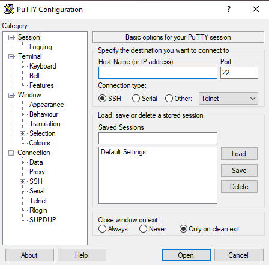
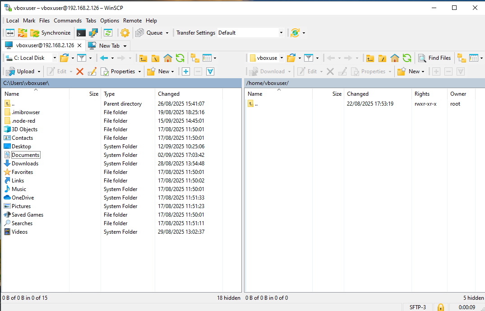

[<- До підрозділу](README.md)

# SSH (Secure Shell): теоретична частина 

## 1. Вступ до SSH

- Що таке SSH (Secure Shell)
  - Протокол безпечного віддаленого доступу
  - Шифрування даних, аутентифікація користувачів
- Основні сценарії використання:
  - Віддалене адміністрування
  - Передача файлів
  - Тунелювання трафіку
  - Інтеграція з Git та автоматизацією

**SSH (Secure Shell)** — це мережевий протокол і набір інструментів, що забезпечують безпечне з’єднання між двома комп’ютерами через незахищену мережу (наприклад, Інтернет). Його головна ідея — дати можливість адміністратору чи користувачу працювати з віддаленим комп’ютером так, ніби він сидить безпосередньо за його терміналом, але при цьому весь трафік зашифрований і захищений від перехоплення.

З одного боку, SSH - це протокол, який означує правила встановлення безпечного з’єднання між клієнтом і сервером. Працює поверх TCP (за замовченням на порту 22), використовує криптографічні методи для шифрування трафіку (AES, ChaCha20 тощо), перевірки цілісності даних (HMAC), аутентифікації (паролі, ключі, сертифікати). Має кілька версій, з яких сьогодні використовується SSH-2 (безпечніший і сучасний).

З іншого боку SSH - це програми, які реалізують протокол. Найпопулярніший набір має назву OpenSSH:

- `ssh` — підключення до віддаленої машини;
- `scp` — копіювання файлів;
- `sftp` — передача файлів у режимі FTP, але через SSH;
- `ssh-keygen` — створення ключів;
- `ssh-agent` і `ssh-add` — керування ключами;
- `sshd` — серверна частина (демон).

У сучасних Windows також є вбудований OpenSSH, а раніше користувалися окремими програмами (PuTTY, WinSCP).

SSH використовують для:

- віддаленого адміністрування
- передачі файлів (див.4)
- тунелювання трафіку (див.5)
- інтеграція з Git та автоматизацією (див.6.)

Найпоширеніше використання SSH це віддалене адміністрування. Системний адміністратор може зайти на сервер і виконувати команди:

```bash
ssh admin@server.example.com
```

Таким чином керують вебсерверами, базами даних, маршрутизаторами, IoT-пристроями. У Windows це особливо актуально після появи OpenSSH, бо раніше користувалися PuTTY або RDP.

Коли ви підключаєтесь через SSH, сам SSH лише створює захищений канал зв’язку між клієнтом і сервером. А команди, які ви вводите після входу, виконуються саме тією операційною системою, до якої ви підключились. Тобто якщо ви підключились по SSH до Linux-сервера, то у вас відкривається Bash (або інший shell). Там доступні всі команди Linux (`ls`, `cd`, `cat`, `systemctl`, `apt`, `yum` тощо). Якщо ви підключились по SSH до Windows з увімкненим OpenSSH Server, то у вас відкривається `cmd.exe` або `PowerShell` (залежить від налаштувань). Відповідно, доступні команди Windows (`dir`, `type`, `netstat`, PowerShell-скрипти і т.д.). Сам протокол SSH не означує команди — він лише передає текстові дані між клієнтом і оболонкою сервера.

У той же час команди SSH (`ssh`, `scp`, `sftp`, `ssh-keygen`) - це клієнтські утиліти, які запускаєте ви на своєму комп’ютері. А команди, які ви вводите після підключення — це вже  нативні команди операційної системи сервера. Наприклад команда:

```bash
ssh user@192.168.1.10
```

ця команда запуск ssh-клієнта, яикй створює захищене з’єднання. Після входу ви можете написати:

```bash
ls -l /home/user
```

і це виконається на сервері Linux. Якщо б це був Windows-сервер, то там би треба було писати:

```powershell
dir C:\Users\user
```

## 2. SSH у Linux

### 2.1. Клієнтська частина

У Linux клієнт SSH зазвичай встановлений за замовчуванням у більшості дистрибутивів. Це утиліта `ssh`, яка дозволяє користувачу підключатися до віддаленого сервера. Базова форма команди:

```bash
ssh user@host
```

де

- `user` — ім’я користувача на віддаленій системі,
- `host` — IP-адреса або доменне ім’я сервера.

Наприклад:

```bash
ssh admin@192.168.1.10
```

Часто потрібні додаткові параметри:

- `-p <порт>` — вказати номер порту, якщо сервер слухає не стандартний 22-й.
- `-i <файл_ключа>` — підключення з використанням приватного ключа.
- `-L` — локальне тунелювання портів (проброс із клієнта на сервер).
- `-R` — зворотне тунелювання (проброс із сервера на клієнт).

Приклад складного підключення:

```bash
ssh -p 2222 -i ~/.ssh/id_rsa user@192.168.1.10
```

У цьому випадку: використовується порт 2222, підключення йде через приватний ключ `id_rsa`.

### 2.2. Серверна частина (OpenSSH)

Щоб дозволити іншим користувачам підключатися до вашого Linux-комп’ютера по SSH, потрібно встановити OpenSSH Server. Встановлення пакета:

У Debian/Ubuntu:

```bash
sudo apt update
sudo apt install openssh-server
```

У CentOS/RHEL/Fedora:

```bash
sudo dnf install openssh-server
```

Основні параметри зберігаються у файлі:

```
/etc/ssh/sshd_config
```

Тут можна змінити порт, дозволити/заборонити логін по паролю, задати список користувачів, які можуть підключатися.

У сучасних системах керування службою здійснюється через `systemd`:

```bash
sudo systemctl enable ssh
sudo systemctl start ssh
sudo systemctl status ssh
```

- `enable` — автоматичний старт при завантаженні.
- `start` — запуск служби одразу.
- `status` — перевірка стану.

Після цього сервер починає слухати підключення на порту 22 (або іншому, вказаному у конфігурації).

### 2.3. Аутентифікація

SSH підтримує два основних методи входу:

- За паролем. Користувач вводить логін і пароль. Це просто, але менш безпечно, оскільки паролі можуть бути підібрані brute-force атаками.
- За допомогою ключів. Користувач генерує пару ключів — приватний і публічний. Публічний ключ додається на сервер у файл `~/.ssh/authorized_keys`, а приватний залишається тільки на клієнті. Генерація ключів виконується командою:

```bash
ssh-keygen -t rsa -b 4096
```

Після цього ключі зберігаються у каталозі `~/.ssh/` (наприклад, `id_rsa` і `id_rsa.pub`). Щоб передати публічний ключ на сервер, використовується утиліта:

```bash
ssh-copy-id user@host
```

Вона автоматично додає ключ у файл `authorized_keys` на віддаленій машині. Після цього можна входити без пароля, просто використовуючи ключ. Це зручно й безпечніше.

## 3. SSH у Windows

### 3.1. SSH-клієнти у Windows

#### Вбудований клієнт

У сучасних версіях Windows (починаючи з Windows 10, а також у Windows 11) є вбудований SSH-клієнт. Це означає, що для базових підключень більше не потрібно додаткове програмне забезпечення. Запуск через PowerShell або командний рядок (cmd):

```powershell
ssh
usage: ssh [-46AaCfGgKkMNnqsTtVvXxYy] [-B bind_interface] [-b bind_address]
           [-c cipher_spec] [-D [bind_address:]port] [-E log_file]
           [-e escape_char] [-F configfile] [-I pkcs11] [-i identity_file]
           [-J destination] [-L address] [-l login_name] [-m mac_spec]
           [-O ctl_cmd] [-o option] [-P tag] [-p port] [-Q query_option]
           [-R address] [-S ctl_path] [-W host:port] [-w local_tun[:remote_tun]]
           destination [command [argument ...]]

```

зокрема у форматі:

```powershell
ssh user@host
```

де:

- `user` — ім’я користувача на віддаленому комп’ютері,
- `host` — IP-адреса або доменне ім’я сервера.

Наприклад:

```powershell
ssh admin@192.168.1.100
```

Корисні параметри:

- `-p 2222` — вказати інший порт, якщо сервер не на стандартному 22.
- `-i C:\Users\user\.ssh\id_rsa` — використати приватний ключ для входу.
- `ssh -L 8080:localhost:80 user@host` — прокидування локального порту.

За замовчуванням ключі зберігаються у:

```
C:\Users\<ім’я_користувача>\.ssh\
```

Туди можна скопіювати `id_rsa` (приватний ключ) і `id_rsa.pub` (публічний ключ).

Є альтернативні SSH-клієнти (коли треба більше можливостей):

- PuTTY - класичний, легкий клієнт з графічним інтерфейсом.
- MobaXterm — розширений термінал з підтримкою X11, SFTP, кількох вкладок.
- Termius — сучасний кросплатформовий клієнт (Windows, Linux, macOS, Android, iOS).
- WinSCP — для передачі файлів через SFTP/SCP.

#### PuTTY

PuTTY з’явився наприкінці 90-х років як відповідь на відсутність у Windows стандартного інструмента для безпечного віддаленого доступу. У той час у Linux та Unix-системах вже існували реалізації SSH-клієнтів і серверів, але у Windows користувачі були змушені працювати через небезпечні Telnet або Rlogin. PuTTY запропонував легке і безкоштовне рішення: невеликий виконуваний файл, який запускався без інсталяції і дозволяв швидко підключитися до серверів по SSH, Telnet чи навіть через послідовний порт. Завдяки простоті, відкритому коду та широким можливостям налаштування він став стандартом де-факто для адміністраторів Windows.

Сьогодні, коли у Windows з’явився вбудований SSH-клієнт, актуальність PuTTY дещо знизилась. Проте він і далі має сенс у кількох випадках. По-перше, коли потрібна робота зі старими протоколами або специфічним обладнанням, яке не підтримує сучасні засоби. По-друге, PuTTY зручний для користувачів, яким потрібен графічний інтерфейс налаштувань і можливість зберігати профілі підключень без редагування конфігураційних файлів. По-третє, програма й досі популярна у portable-варіанті, коли треба мати інструмент з собою на флешці або на тимчасовій машині без додаткових інсталяцій.



рис.1. Графічний вигляд PuTTY

Таб.1. Порівняння з вбудованим SSH у Windows

| Характеристика                | PuTTY                                           | Вбудований SSH у Windows                       |
| ----------------------------- | ----------------------------------------------- | ---------------------------------------------- |
| Рік появи                     | Кінець 1990-х, коли у Windows не було SSH       | З’явився у Windows 10 (2018, версія 1809)      |
| Спосіб запуску                | Окремий `.exe`, може бути portable              | Вбудований у PowerShell та cmd                 |
| Налаштування                  | Графічний інтерфейс, збереження профілів        | Через командний рядок або файл `~/.ssh/config` |
| Підтримувані протоколи        | SSH, Telnet, Rlogin, COM-порт                   | Тільки SSH (протокол 2)                        |
| Передача файлів               | Окремі утиліти: `pscp`, `psftp`                 | Вбудовані команди `scp`, `sftp`                |
| Гнучкість терміналу           | Кодування, кольори, розмір буфера               | Обмежені можливості PowerShell/cmd             |
| Використання ключів           | Через GUI або завантаження вручну               | Автоматично з папки `C:\Users\user\.ssh\`      |
| Зручність для DevOps/скриптів | Менш зручний, краще для ручної роботи           | Оптимально для автоматизації та CI/CD          |
| Основні переваги              | Графічний інтерфейс, профілі, portable-режим    | Інтеграція з Windows, простота для скриптів    |
| Актуальні сценарії            | Старі протоколи, робота з обладнанням, portable | Сучасне адміністрування, DevOps, Git, CI/CD    |

#### WinSCP

WinSCP з’явився на початку 2000-х як зручний інструмент для передачі файлів між Windows і Unix/Linux-серверами. У той час командні утиліти `scp` та `sftp` у Windows були відсутні, і користувачам потрібен був простий спосіб завантажувати та завантажувати файли по захищеному каналу. На відміну від FTP-клієнтів, які передавали дані у відкритому вигляді, WinSCP одразу орієнтувався на використання SSH-протоколу, забезпечуючи шифрування та безпечну аутентифікацію. Завдяки інтеграції з PuTTY і можливості виклику команд безпосередньо з програми він швидко став популярним серед адміністраторів.

Сьогодні WinSCP зберігає актуальність завдяки своєму графічному інтерфейсу, що дозволяє працювати з файлами у знайомому для користувачів Windows вигляді. У програмі доступні два режими роботи: класичний файловий менеджер у стилі Norton Commander та звичайне вікно провідника. Це робить WinSCP зручним як для досвідчених адміністраторів, так і для початківців, які не хочуть запам’ятовувати команди `scp` чи `sftp`. Додаткові можливості включають синхронізацію директорій, інтеграцію з текстовими редакторами для швидкого редагування файлів на сервері та збереження сесій з ключами і паролями.

Попри появу вбудованих команд `scp` і `sftp` у Windows, WinSCP часто обирають там, де важлива швидкість роботи через GUI, особливо коли доводиться обмінюватися файлами з різними серверами. У сценаріях DevOps і автоматизації більше підходять консольні утиліти, але для повсякденної ручної роботи WinSCP і досі є одним з найзручніших рішень.



рис.2. Графічний вигляд WinSCP

Про обмін файлами через SSH та обмеження додатково читайте п.4.

### 3.2. SSH-сервер у Windows

Windows також може виступати як SSH-сервер. Це зручно, коли потрібно підключатися до вашого ПК з іншої машини. Починаючи з Windows 10 (версія 1809) і Windows Server 2019, OpenSSH входить до складу системи як додатковий компонент. Його можна встановити кількома способами. 

Наприклад скористатися графічним інтерфейсом: у налаштуваннях Windows відкрити розділ *Apps → Optional features*, обрати *Add a feature*, знайти у списку OpenSSH Server і встановити його. Після цього компонент з’явиться у системі як служба, яку можна запускати та налаштовувати.

Другий поширений спосіб — встановлення через PowerShell. Для цього використовується команда:

```powershell
Add-WindowsCapability -Online -Name OpenSSH.Server~~~~0.0.1.0
```

яка завантажує і додає компонент у систему. Такий варіант зручний для адміністраторів, оскільки легко автоматизується через скрипти. Як альтернатива, у класичному командному рядку можна застосувати утиліту DISM: 

```powershell
dism /Online /Add-Capability /CapabilityName:OpenSSH.Server~~~~0.0.1.0 
```

Це фактично той самий механізм, але виконується без PowerShell.

У старіших версіях Windows, де вбудованого пакета ще немає, можливе ручне встановлення OpenSSH з офіційного репозиторію GitHub проєкту PowerShell/Win32-OpenSSH. Проте в сучасних випусках ОС у цьому вже немає потреби, оскільки весь необхідний інструментарій інтегрований у систему.

Після встановлення штатного сервер перевірити наявність клієнта/сервера:

```powershell
Get-WindowsCapability -Online | ? Name -like 'OpenSSH*'
```

Після встановлення потрібно запустити службу `sshd`:

```powershell
Start-Service sshd
Set-Service -Name sshd -StartupType 'Automatic'
```

- `Start-Service sshd` — запускає сервер.
- `Set-Service -Name sshd -StartupType 'Automatic'` — щоб SSH стартував автоматично при завантаженні Windows.

Для перевірки стану:

```powershell
Get-Service sshd
```

 Основний файл конфігурації сервера:

```
C:\ProgramData\ssh\sshd_config
```

У ньому можна:

- дозволити/заборонити логін по паролю (`PasswordAuthentication yes/no`),
- вказати дозволені ключі,
- заборонити вхід для певних користувачів.

Після змін — перезапустити службу:

```powershell
Restart-Service sshd
```

При першому запуску Windows може запитати дозвіл на відкриття порту 22. Якщо ні — потрібно додати правило вручну, наприклад через PowerShell:

```powershell
New-NetFirewallRule -Name sshd -DisplayName 'OpenSSH Server' -Enabled True -Direction Inbound -Protocol TCP -Action Allow -LocalPort 22
```

Підключення до Windows по SSH**

- З Linux або іншої Windows:

  ```bash
  ssh user@windows-host
  ```

- Якщо використовується ключова аутентифікація, потрібно додати публічний ключ у файл:

  ```
  C:\Users\<ім’я_користувача>\.ssh\authorized_keys
  ```

## 4. Передача файлів через SSH

SSH використовується не лише для віддаленого адміністрування, але й для безпечної передачі файлів. Це особливо важливо, адже звичайний FTP передає дані та паролі у відкритому вигляді. На відміну від нього, SSH забезпечує шифрування і захист від перехоплення. Для цього застосовуються протоколи **SCP** (Secure Copy Protocol) та **SFTP** (SSH File Transfer Protocol).

SCP і SFTP є двома різними підходами до передачі файлів, але обидва вони базуються на використанні SSH. Коли запускається команда `scp`, клієнт встановлює SSH-з’єднання з віддаленим сервером і передає дані через захищений канал. За своєю суттю `scp` нагадує старий протокол `rcp`, тільки з тією різницею, що вся комунікація відбувається з використанням шифрування та аутентифікації, які забезпечує SSH. Це робить `scp` простим і зручним для швидкого копіювання файлів, але його можливості обмежуються лише пересиланням даних у один або в інший бік.

SFTP, на відміну від `scp`, не є лише утилітою, а окремим підпротоколом усередині SSH. Його повна назва — SSH File Transfer Protocol. Він також використовує порт 22 і всі механізми захисту SSH, але надає значно ширший набір функцій. У рамках одного з’єднання користувач отримує змогу переглядати вміст каталогів на сервері, завантажувати і відвантажувати файли, перейменовувати їх, видаляти та змінювати права доступу. Таким чином, SFTP перетворює SSH-сесію на повноцінний файловий менеджер у стилі класичного FTP, але із збереженням безпеки.

У сучасних системах обидва варіанти використовуються паралельно. Scp зручний тоді, коли потрібно швидко передати один файл або каталог, і для цього вистачає короткої команди. Якщо ж мова йде про регулярну роботу з великою кількістю файлів чи потребу у більшому контролі, ефективніше застосовувати SFTP. Саме тому у графічних клієнтів, таких як WinSCP чи FileZilla, основою роботи є саме SFTP, тоді як scp залишається популярним у сценаріях автоматизації й скриптів.

Хоча SFTP і SCP дозволяють безпечно передавати файли між Windows і Unix/Linux-серверами, вони не можуть повністю замінити локальну файлову систему. Одне з обмежень пов’язане з продуктивністю: передача великих файлів через SSH завжди трохи повільніша, ніж копіювання локально або за допомогою оптимізованих інструментів, наприклад rsync. Інша проблема — різні моделі керування доступом у Windows і Linux. Через це при копіюванні не завжди коректно зберігаються права, власники чи спеціальні атрибути. Наприклад, файл з правами `755` у Linux може втратити свої дозволи після копіювання на Windows.

Певні труднощі виникають і при роботі з великими наборами даних або при потребі синхронізації каталогів. SCP не підтримує синхронізацію, а робота через SFTP з тисячами файлів чи глибокими деревами каталогів може бути повільною. У таких випадках краще застосовувати rsync. До цього додається ще й обмежена інтеграція з іншими застосунками: редактори та IDE не завжди можуть напряму працювати з файлами по SSH. Хоча WinSCP пропонує можливість редагування на сервері, це не так зручно, як робота з локальним диском.

Ще одним обмеженням є відсутність прозорого доступу. Хоча у Linux існують рішення на кшталт SSHFS, у Windows файли з сервера через SFTP не монтуються як звичайний диск без додаткового програмного забезпечення. Це означає, що користувач бачить їх лише у спеціальному клієнті, а не у стандартному провіднику Windows.

### 4.1. Передача файлів Linux ↔ Linux

У Linux найпростіший спосіб — це команда `scp`. Вона працює подібно до `cp`, але замість локального шляху використовується синтаксис `user@host:/шлях/`. Приклад:

```bash
scp file.txt user@192.168.1.10:/home/user/
```

Ця команда скопіює файл `file.txt` з локальної машини на сервер у каталог `/home/user/`. Зворотна передача (з сервера на клієнт):

```bash
scp user@192.168.1.10:/home/user/file.txt .
```

Тут крапка означає поточний каталог. Також можна копіювати рекурсивно цілі директорії:

```bash
scp -r project/ user@192.168.1.10:/home/user/
```

Крім `scp`, є більш зручна утиліта `sftp`, яка відкриває інтерактивну сесію, схожу на FTP:

```bash
sftp user@192.168.1.10
sftp> put localfile.txt
sftp> get remotefile.txt
```

### 4.2. Передача файлів Linux ↔ Windows

У сучасних версіях Windows (10 і 11) вже є вбудовані команди `scp` і `sftp` у PowerShell, тож можна використовувати той самий синтаксис, що й у Linux. Приклад з Windows PowerShell:

```powershell
scp C:\Users\me\Documents\report.pdf user@192.168.1.10:/home/user/
```

або у зворотному напрямку:

```powershell
scp user@192.168.1.10:/home/user/report.pdf C:\Users\me\Documents\
```

Таким чином, Windows тепер має ті ж можливості, що і Linux, без додаткового ПЗ. До появи вбудованого OpenSSH у Windows найпоширенішим інструментом для передачі файлів був WinSCP, який розглядався вище. 

Якщо на Windows встановлений OpenSSH Server, то ця система може виступати і як сервер для отримання чи видачі файлів через `scp` та `sftp`. Це означає, що до Windows можна підключатися з Linux або іншої Windows-комп’ютера і передавати файли у зворотному напрямку. Наприклад, команда з Linux:

```bash
scp file.txt user@windows-host:C:/Users/user/
```

або інтерактивна сесія:

```bash
sftp user@windows-host
sftp> put localfile.txt
sftp> get remotefile.txt
```

У такому випадку всі операції виконуються через службу `sshd`, а файлові шляхи відповідають структурі Windows (`C:\Users\...`). Потрібно враховувати, що права доступу до файлів будуть інтерпретуватися за правилами Windows, тому POSIX-атрибути з Linux не завжди зберігаються коректно.

## 5. Тунелювання та порти

SSH уміє прокидати TCP-трафік через зашифроване з’єднання. Є три режими: 

- локальне прокидання порту (local port forwarding)
- зворотне прокидання порту (remote port forwarding)
- динамічне прокидання (dynamic port forwarding, SOCKS proxy)

У всіх випадках корисно додавати `-N` (не запускати shell на сервері) і `-T` (без псевдотермінала), коли вам потрібен тільки тунель.

Загальний синтаксис:

```
-L [bind_addr:]LPORT:DEST_HOST:DEST_PORT
-R [bind_addr:]RPORT:DEST_HOST:DEST_PORT
-D [bind_addr:]LPORT
```

### 5.1 Локальний форвардинг (-L)

todo

Команда:

```bash
ssh -N -L 8080:localhost:80 user@host
```

Ви відкриваєте на своєму ПК порт 8080. Коли звертаєтесь до `http://localhost:8080`, SSH шифровано доставляє трафік на сервер `host`, а вже там під’єднується до `localhost:80` (відносно сервера). Типовий кейс: доступ до внутрішнього веб-інтерфейсу/БД за бастіоном.

Можна прокидати відразу кілька портів, повторивши `-L`. Якщо потрібно, щоб локальний порт був доступний з інших машин вашої мережі, вкажіть прив’язку: `-L 0.0.0.0:8080:localhost:80` і подбайте про фаєрвол.

Зручно для БД:

```bash
ssh -N -L 5432:db.internal:5432 user@bastion
psql -h localhost -p 5432 …
```

### 5.2 Зворотний форвардинг (-R)

todo

Команда:

```bash
ssh -N -R 2222:localhost:22 user@host
```

На віддаленому сервері `host` з’являється порт 2222, підключення до нього шифровано перекидається до вашого локального `localhost:22`. Це корисно, коли ваш ПК за NAT/фаєрволом і вам треба дати доступ назовні. За замовчуванням віддалений порт слухає лише на `127.0.0.1` сервера. Щоб відкрити його назовні, вкажіть адресу прив’язки:

```bash
ssh -N -R 0.0.0.0:2222:localhost:22 user@host
```

і на сервері має бути `GatewayPorts yes` або `GatewayPorts clientspecified` у `sshd_config` (і правильне правило фаєрвола). Якщо цього не зробити, порт не буде доступний ззовні.

Практичний прийом для обміну файлами чи тимчасового SSH-доступу до вашої машини з Інтернету — але використовуйте з обережністю, обмежуйте доступ фаєрволом і ключами.

### 5.3 Динамічний форвардинг (SOCKS) (-D)

todo

Команда:

```bash
ssh -N -D 1080 user@host
```

SSH підіймає на вашому ПК SOCKS-проксі на `localhost:1080`. Далі програми, які підтримують SOCKS5, можуть тунелювати будь-які TCP-з’єднання через сервер `host` (ad-hoc “VPN” для окремих застосунків).

Як користуватися:

- У браузері вкажіть проксі SOCKS5: `127.0.0.1:1080`.

- Щоб уникнути DNS-витоків, у застосунку вмикайте “proxy DNS” (наприклад, у Firefox `network.proxy.socks_remote_dns=true`).

- CLI-приклад:

  ```bash
  curl --socks5-hostname 127.0.0.1:1080 https://example.com
  ```

Пам’ятайте, що шифрується шлях до сервера SSH. Далі до кінцевого сайту шифрування є лише якщо це HTTPS.

### 5.4 Бастіони та multi-hop (ProxyJump)

todo

Можна комбінувати тунелі з “стрибком” через бастіон:

```bash
ssh -J user@bastion user@app
ssh -N -J user@bastion -L 5432:db.internal:5432 user@app
```

Або описати в `~/.ssh/config`:

```
Host app
  HostName app.internal
  User user
  ProxyJump bastion

Host bastion
  HostName bastion.myorg.com
  User user
```

Це спрощує команди та дозволяє робити надійні ланцюжки доступу.

### 5.5 Типові параметри для “стабільних” тунелів

todo

- `-o ExitOnForwardFailure=yes` — упасти одразу, якщо форвардинг не піднявся.
- `-o ServerAliveInterval=60 -o ServerAliveCountMax=3` — підтримка живості сесії.
- Стиснення для повільних лінків: `-C`.
- На Linux для постійного тунелю зручно використати `autossh` або unit systemd. На Windows — окреме вікно PowerShell, фонове завдання (Scheduled Task) чи NSSM-сервіс.

### 5.6 Усунення несправностей

todo

- “Address already in use” — локальний порт зайнятий; виберіть інший або закрийте процес.
- Тунель піднявся, але сервіс не відповідає — перевірте цільовий `DEST_HOST:DEST_PORT` з точки зору того кінця, де він має досяжність (часто проблема в тому, що `localhost` трактують не там).
- Для діагностики додайте `-v`/`-vvv`.

## 6. Інтеграція SSH у DevOps

todo

- Підключення до Git по SSH
- Використання в CI/CD (GitHub Actions, GitLab Runner)
- Автоматизація через Ansible

## 7. Безпека

todo

- Заборонити root-логін у `sshd_config`
- Використовувати лише ключі, вимкнути паролі
- Використання fail2ban / firewall


## Контрольні питання

todo

При створенні конспекту використовувався ChatGPT

Теоретичне заняття розробив [Олександр Пупена](https://github.com/pupenasan). 

- [Обговорення у WhatsApp](https://chat.whatsapp.com/BRbPAQrE1s7BwCLtNtMoqN)
- [Обговорення в Телеграм](https://t.me/+GA2smCKs5QU1MWMy)
- [Група у Фейсбуці](https://www.facebook.com/groups/asu.in.ua)

Про проект і можливість допомогти проекту написано [тут](https://asu-in-ua.github.io/atpv/)
