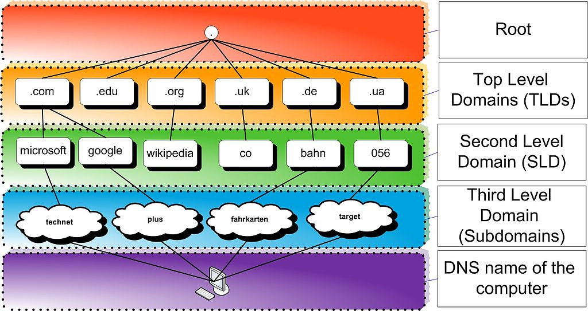
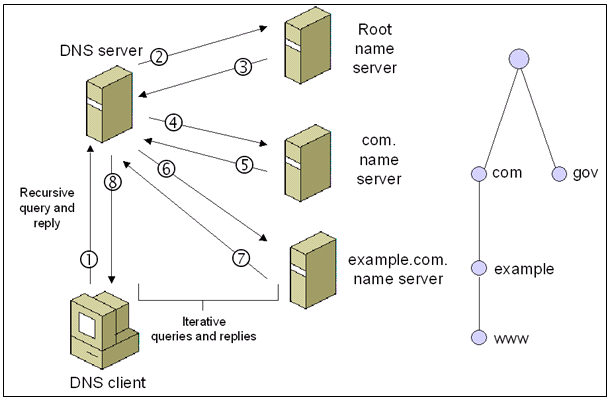
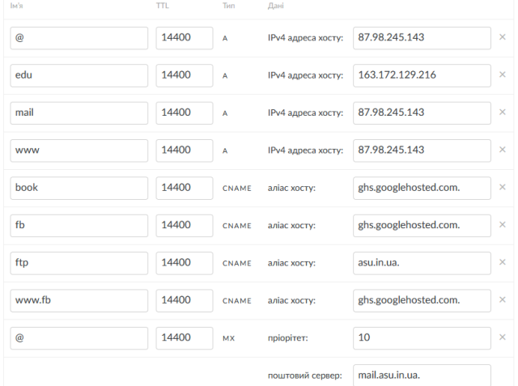

[<- До підрозділу](README.md)

# Система доменних імен DNS: теоретична частина

## Про DNS

Користувачам мереж зручніше користуватися іменами ніж адресами. Наприклад простіше запам'ятати символьну адресу сайту університету www.nuft.edu.ua аніж її IP `193.28.200.x`. Крім того, сервера часто змінюють своє розташування (хостинг), "переїжджаючи" з однієї локації (наприклад серверу безпосередньо в будівлі університету) на іншу, наприклад в хмарний сервіс в безпечному місці з постійним живленням. При цьому адреса IP зміниться, а символьне ім'я - ні. Також, в деяких розподілених системах, таких як `www`, на одному вузлі (сервері) можуть виконуватися (хоститися) різні WEB-сайти, які будуть мати різні імена але однакові IP. 

Найпростішим підходом є збереження відповідності між доменними іменами та IP-адресами безпосередньо на кінцевих вузлах. Уявімо, що кожен комп’ютер у мережі мав би власний список імен і відповідних адрес, подібний до телефонної книги. У цьому випадку браузер чи інший застосунок міг би просто звертатися до локального файлу, щоб знайти потрібний IP для певного імені. Такі файли справді існують — у більшості операційних систем вони відомі як **hosts-файл**, і в ранні часи Інтернету саме таким способом імена й адреси узгоджувалися. Однак цей метод не масштабується. Коли мережа налічує мільйони й мільярди вузлів, підтримувати актуальність локальних таблиць на кожному комп’ютері стає практично неможливо. Будь-які зміни у відповідності «ім’я ↔ адреса» вимагали б розповсюдження оновлених файлів на всі машини світу, що створювало б величезні затримки та численні помилки. Крім того, такий підхід позбавляє систему гнучкості — додавання нових ресурсів чи переміщення серверів означало б суцільний хаос в оновленні локальних копій.

Для можливості звернення до вузлів через їх імена в Інтернеті існує **система доменних імен** (Domain Name System, **DNS**) — ієрархічна та розподілена система ідентифікації хостів (комп’ютерів та інших подібних пристроїв), доступних через Інтернет або інші мережі з Інтернет-протоколом (IP). Ресурсні записи, що містяться в DNS, пов’язують доменні імена із числовими IP-адресами, необхідними комп’ютерам для визначення місцезнаходження служб і пристроїв.

Тим не менш, локальні сховища не зникли зовсім. Hosts-файл і сьогодні залишається в операційних системах, і його можна використовувати для ручного визначення імен, наприклад для тестування, блокування небажаних сайтів чи перевизначення адрес. А ще локальні кеші відіграють ключову роль у сучасному DNS: після отримання відповіді від сервера відповідність імені та IP тимчасово зберігається на хості, щоб при наступному зверненні уникати повторних запитів у мережу. Таким чином, локальні таблиці існують і сьогодні, але вони мають допоміжний характер і не можуть замінити глобальну систему DNS, яка забезпечує єдину, масштабовану й узгоджену схему іменування в Інтернеті.

Важливою та повсюдною функцією DNS є його центральна роль у розподілених Інтернет-сервісах, таких як хмарні сервіси та мережі доставки контенту. Коли користувач отримує доступ до розподіленої служби Інтернету за допомогою URL-адреси, доменне ім’я з цієї URL-адреси перетворюється на IP-адресу сервера, який є найближчим до цього користувача. Ключова функція DNS, яка використовується тут, полягає в тому, що різні користувачі можуть одночасно отримувати різні IP-адреси для одного доменного імені найбільш релевантно саме для цього користувача. 

Система доменних імен складається з трьох основних компонентів:

-  Простір доменних імен (domain namespace) є специфікацією для структури дерева доменних імен.
-  Сервери імен (Name servers) — це серверні програми, які містять інформацію про структуру дерева домену, які можуть встановлювати інформацію або кешувати її.
-  Розв'язувачі (Resolvers) — це клієнтські програми, які отримують інформацію з серверів імен у відповідь на запити користувачів.

Розпізнавання доменних імен (або **DNS resolution**) — це процес пов’язування IP-адрес із доменними іменами. Наприклад, веб-браузер за допомогою розв’язувача зв’язується з сервером імен і за доменним іменем отримує інформацію, що міститься в просторі імен домену.


## Простір доменних імен та зони DNS

Символьна назва вузла в системі DNS називається **повним доменним ім'ям** (**FQDN** - Fully Qualified Domain Name). Наприклад `nuft.edu.ua` - це повне доменне ім'я, яке можна розбити на дві частини: ім'я вузлу ( `nuft`) та ім'я області-домену (`edu.ua`), де знаходиться вузол. За адміністрування та обслуговування вузлів в домені (Domain) займаються група серверів імен цього домену, які містять інформацію про відповідність IP та імен. 

Весь простір доменних імен має деревовидну структуру. Існує домен кореневого рівня (root), який позначається крапкою `.`, наступний рівень ієрархії — це домени верхнього рівня (TLD), далі другого рівня (SLD), ті субдомени третього рівня і так далі (рис.1). Таким чином повне доменне ім'я складається з кількох **міток** (**labels**), які розділені крапками і означують шлях по ієрархії. Наприклад вузол з міткою `nuft` лежить в домені другого рівня з міткою `edu` який у свою чергу знаходиться в домені верхнього рівня з міткою `ua`.  Це дерево підрозділів може теоретично мати до 127 рівнів.



рис.1. Ієрархія доменів DNS

Мітка може містити від нуля до 63 символів, а довжина повного доменного імені не може перевищувати 253 символи в текстовому представленні. Символи, дозволені в мітках, є підмножиною набору символів в ASCII кодуванні, що складається з символів від `a` до `z`, від `A` до `Z`, цифр від `0` до `9` і дефіса. Це правило відоме як правило `LDH` (літери, цифри, дефіс). Зараз існує рішення, яке дозволяє використовувати національні символи в мітках, наприклад кирилицю. 

Ієрархічність імен в DNS дає можливість розподілити функції вирішення зв'язування імен та IP-адрес між різними групами серверів імен. Таким чином за певну частину простору імен в системі DNS відповідає певна організація, яка забезпечує адміністрування бази даних, в якій зберігається вся необхідна для цього інформація. Ці області відповідальності називаються **зонами DNS**, кожна з яких може відповідати за кілька субдоменів. Зона починається в домені певного рівня та простягається вниз по дереву домену до листових вузлів або до верхнього рівня субдоменів, де починаються інші зони. Більшість операторів реєстру доменних імен верхнього рівня пропонують свої простори імен громадськості або організаціям із обов’язковим географічним чи іншим призначенням для реєстрації доменів другого рівня. Подібним чином організація, яка відповідає за домен нижчого рівня, може аналогічно керувати своїм простором імен і розділяти свій простір. 

## DNS-сервери

**Сервери імен** (або DNS-Сервери, NS), це застосунки, які містять інформацію для вирішення зв'язки `доменне ім'я -> IP-адреса(-си)`. Вони відповідають на запити від DNS-Клієнтів, яким потрібна ця інформація. 

Коли кажуть про DNS-сервери, то зазвичай мають на увазі не один фізичний комп’ютер, а цілу інфраструктуру з кількох серверів, об’єднаних у кластер. Це робиться з міркувань надійності, масштабованості та продуктивності: у разі відмови одного вузла інші продовжують обробляти запити, а навантаження рівномірно розподіляється між усіма компонентами кластера. Крім того, такі системи часто реалізовані у вигляді географічно розподіленої мережі серверів, які використовують технологію anycast, коли одна й та сама IP-адреса оголошується в різних точках світу, і користувач автоматично потрапляє до найближчої копії. Тому термін «DNS-сервер» слід розуміти як логічну сутність, що майже завжди підтримується кластером серверних програм у різних датацентрах.

Є два типи серверів імен: авторитетні та рекурсивні. Кожен домен має принаймні один **авторитетний сервер** імен (authoritative name server), в задачу якого входить публікувати інформацію про цей домен і сервери імен будь-яких підлеглих йому доменів. Він відповідає на запити, беручи інформацію з записів, що були створені в його базі даних шляхом адміністрування. Натомість **рекурсивний сервер** (також називають неавторитетним), у відповідь на запит в пошуках відповіді звертається до інших серверів DNS або до власних кешованих даних, які з'явилися за попередніх відповідей на аналогічні запити (рис.2).       


рис.2. Спрощене представлення взаємодії авторитетних та рекурсивних сереврів.

Рекурсивні сервери є робочими конячками в процесі пошуку DNS. Їм часто доводиться виконувати численні пошуки в системі DNS, щоб надати необхідну інформацію про IP-адресу клієнту. Такими типами серверів зазвичай керує провайдер Інтернет-послуг (Інтернет-провайдер), або спеціалізовані DNS-провайдери. Дійсні (оригінальні) записи зіставлення IP доменному імені існують лише на авторитетних DNS-серверах. У ієрархічній доменній структурі все починається з кореневих авторитетних серверів імен, тобто що відповідають за домен з міткою `.`. Ці авторитетні сервери імен знають IP-адреси авторитетних серверів для доменів верхнього рівня (TLD), наприклад `.com`.

Якщо на запит клієнта (рис.3(1)) рекурсивний DNS-сервер не має жодної кешованої інформації, щоб знайти IP-адресу, наприклад для `www.example.com` він запускає рекурсивний алгоритм:

- спочатку рекурсивний сервер спитає серверу кореневого домену про авторитетний сервер домену `.com` (2,3)
- потім він питає авторитетного сервера домену `.com` про субдомен `example` (4,5)
- потім у домену `example` про розташування вузла `www` (6,7)
- повертає відповідь клієнту (8)



рис.3. Робота рекурсивного алгоритму

Рекурсивні сервери рекурсивно проходять через ієрархічне дерево DNS зверху вниз, доки не потраплять на авторитетний сервер відповідного домену. У більшості випадків рекурсивні DNS-сервери фактично кешують записи авторитетних DNS-серверів. Це означає, що вони зберігають відображення URL-адрес на IP-адреси протягом певного часу (відомого як `TTL`, або час життя). Це означає, що їм не потрібно повторно надсилати ті самі запити на ті самі авторитетні сервери, що економить користувачеві багато часу а також зменшує навантаження на авторитетні сервери. Рекурсивний сервер імен знає лише, де знайти кореневі сервери імен (з міткою `.`). На основі кожного рівня серверів імен, знаючи, де знаходиться наступний рівень в ієрархії, відповідь зрештою знайдеться.

Авторитетний сервер імен може бути основним (primary server) або резервним сервером (secondary server). Основний сервер — це сервер, на якому зберігаються оригінальні копії всіх записів зони. Резервний сервер використовує спеціальний механізм автоматичного оновлення в протоколі DNS під час зв’язку зі своїм основним сервером для підтримки ідентичної копії первинних записів. Кожній зоні DNS має бути призначений набір авторитетних серверів імен. Цей набір серверів зберігається в зоні батьківського домену із записами сервера імен (`NS`, див. нижче). 

## Ресурсні записи та налаштування DNS

Кожен вузол у дереві має мітку та нуль або більше **ресурсних записів** (**RR** - Resource record), які містять інформацію, пов’язану з доменним іменем. Кожен запис має тип (ім’я та номер), термін дії (час життя), клас і дані, що стосуються типу. Під час надсилання через мережу Інтернет-протоколу всі записи використовують загальний формат, в яких є поля, які налаштовуються при створенні записів:

| Поле | Опис                                                         |
| ---- | ------------------------------------------------------------ |
| NAME | Доменне ім’я вузла в дереві. У мережі ім’я можна скоротити за допомогою стиснення міток, де кінці доменних імен, згаданих раніше в пакеті, можна замінити на кінець поточного доменного імені. |
| TYPE | Тип запису у цифровій формі (наприклад, 15 для MX RR), що вказує на формат даних і дає підказку про їх призначення. |
| TTL  | Кількість секунд, протягом яких RR залишається дійсним (максимум 68 років) |
| DATA | Додаткові специфічні для запису дані. Вони залежать від типу запису, наприклад IP-адреса для записів адрес або пріоритет і ім’я хоста для записів `MX`. |

Відповідно при налаштуванні DNS добавляються кілька записів, для кожної з якої вказують наведені вище поля, та деякі інші. В таблиці нижче наведені деякі типи записів та призначення Name та Data:

| Тип   | Призначення                                    | Функція                                                      | Name                                            | Data                                         |
| ----- | ---------------------------------------------- | ------------------------------------------------------------ | ----------------------------------------------- | -------------------------------------------- |
| A     | Адресний запис                                 | Повертає 32-бітну адресу IPv4, яка найчастіше використовується для зіставлення імен хостів з IP-адресою хосту, але також використовується для DNSBL (чорний список), зберігання масок підмереж у RFC 1101 тощо. | доменне ім'я                                    | адреса IPv4                                  |
| AAAA  | Адресний запис IPv6                            | Повертає 128-бітну адресу IPv6, яка найчастіше використовується для зіставлення імен хостів з IP-адресою хосту. | доменне ім'я                                    | адреса IPv6                                  |
| CNAME | Канонічний запис імені (Canonical name record) | Псевдонім (alias) одного імені для іншого (канонічного). Наприклад для запуску кількох сервісів (FTP-сервер і веб-сервер, кожен з яких працює на різних портах) з однієї IP-адреси: `ftp.example.com` і `www.example.com` на запис DNS для `example.com`, який, у свою чергу, має запис `A`, який вказує на IP-адресу. Канонічне імя може бути в іншій зоні DNS. | доменне ім'я псевдоніму                         | канонічне доменне ім'я                       |
| MX    | Запис про обмін поштою                         | Вказують сервери (з визначенням пріоритетності), на які потрібно відправляти електронну пошту, призначену для адрес в даному домені. Ім'я хоста, зазначеного в MX-записі, повинне містити IP-адресу, визначену за допомогою запису типу A. Псевдоніми CNAME не можуть мати своїх MX-записів. Щоб відправити електронну пошту на певну адресу, сервер-відправник робить DNS-запит, запитуючи MX-запис домену одержувача електронного повідомлення (тобто частини адреси після символу «@»). В результаті запиту повертається список імен хостів поштових серверів, що приймають пошту для даного домену, а також величина пріоритету для кожного з хостів. Сервер-відправник потім намагається встановити SMTP-з'єднання з одним з цих хостів, починаючи з того, у кого значення величини пріоритету найменше, перебираючи кожний з них, поки не вдасться встановити з'єднання принаймні з одним з них. Механізм MX-записів надає можливість використовувати безліч серверів для одного домену та впорядкування їх використання в цілях зменшення навантаження і збільшення ймовірності успішної доставки пошти. | доменне ім'я (що йде після @ в поштовій адресі) | канонічне доменне ім'я для поштового серверу |
| TXT   | Текстовий запис                                | Спочатку було для довільного читабельного тексту в записі DNS, наприклад текстовий опис доменного імені, однак зараз частіше містить машинозчитувані дані. | доменне ім'я                                    | довільний текст                              |
| NS    | Запис сервера імен                             | Делегує зону DNS для використання вказаних авторитетних серверів імен | доменне ім'я                                    | доменне ім'я серверу імен                    |
| PTR   | Вказівник                                      | Зв'язує IP адресу хоста з його канонічним ім'ям. Він обернений до `A`-записів. Запит в  домені `in-addr.arpa` на IP хоста в reverse формі поверне ім'я (FQDN)  даного хоста. Наприклад для IP адреси `192.0.34.164`: запит запису PTR `164.34.0.192.in-addr.arpa` поверне його канонічне ім'я  `referrals.icann.org`. З метою зменшення обсягу небажаної кореспонденції (спаму) багато серверів-одержувачів електронної пошти можуть перевіряти  наявність PTR запису для хоста, з якого відбувається відправлення. У цьому випадку PTR запис для IP адреси повинен відповідати імені відправляючого поштового сервера, яким  він представляється в процесі SMTP-сесії. | адреса IPv4                                     | доменне ім'я                                 |

Організація, яка реєструє домени часто надає послуги і на використання власних серверів імен. Наприклад,  для налаштування записів для www.nic.ua діють наступні правила при створенню запису типу `A` або `AAA`:

1. `Name` (Ім'я): якщо це основний домен, то вноситься ім'я `@`. Якщо це для піддомену, то вноситься його ім'я. Наприклад, для `blog.domain.com` буде  достатньо внести ім'я `blog`;
2. `TTL`: час життя запису. Мінімальний параметр 3600 секунд,  стандартний 14400 секунд. В більшості випадків вам не потрібно його  змінювати;
3. `Type` (Тип): тут ви обираєте тип `А` (для IPv4) або `АААА` (для IPv6);
4. `Data` (Дані) IPv4(IPv6) адреса хосту: вноситься IP адреса хостингу.

Нижче наведений приклад таблиці налаштування серверу імен DNS для домену `asu.in.ua.`, який зареєстрований на NIC.ua та використовує їх сервери імен.  



рис.4. Приклад налаштування DNS-серверу 

Як видно з рис.4 основний запис (`@`) типу `A` посилається на конкретну IP адресу. На ту ж адресу посилаються піддомени `mail` та  `www`. Запис з іменем `edu` (тобто `edu.asu.in.ua`) задає хост за іншою адресою IP. Ім'я `ftp` типу CNAME є псевдонімом для `asu.in.ua.`, тоді як субдомени `book`, `fb`, `www.fb` посилаються на записи типу `A` в домені `ghs.googlehosted.com.` (сайти гугл). Усі поштові листи, які приходимуть за шаблоном отримувача на `xxxx@asu.in.ua` будуть перенаправлятися на запис, що означено в `mail.asu.in.ua`.

Система доменних імен підтримує записи DNS із символами узагальнення, які означують імена, що починаються з зірочки `*`, наприклад, `*.example`. Записи DNS, що належать доменним іменам із символом узагальнення, означують правила для створення записів ресурсів у межах однієї зони DNS шляхом заміни цілих міток на відповідні компоненти імені запиту, включаючи будь-які вказані нащадки. Наприклад, у наведеній нижче конфігурації зона DNS `x.example` визначає, що всі субдомени, включаючи субдомени субдоменів, `x.example` використовують поштовий обмінник (MX) `a.x.example`. Запис `A` для `a.x.example` потрібен для вказівки IP-адреси поштового обмінника. Оскільки це призведе до виключення цього доменного імені та його субдоменів зі збігів символів підстановки, додатковий запис `MX` для субдомену `a.x.example`, а також запис `MX` із символами підстановки для всіх його субдоменів також необхідно визначити в зоні DNS.

```
x.example.       MX   10 a.x.example.
*.x.example.     MX   10 a.x.example.
*.a.x.example.   MX   10 a.x.example.
a.x.example.     MX   10 a.x.example.
a.x.example.     AAAA 2001:db8::1
```

## Кілька IP-адрес для одного доменного імені

Іноді одного сервера недостатньо, щоб обробляти весь трафік. Тому для одного доменного імені (наприклад, `www.example.com`) у DNS можуть бути вказані кілька записів A/AAAA. Це дозволяє: розподіляти навантаження між кількома серверами; підвищувати відмовостійкість (якщо один сервер недоступний, інший відповість); оптимізувати маршрутизацію для користувачів із різних географічних регіонів.

Приклад DNS-записів:

```
www.example.com.   A      192.0.2.10
www.example.com.   A      192.0.2.11
www.example.com.   A      192.0.2.12
```

У цьому прикладі `www.example.com` відповідає трьом різним IP-адресам. Це працює наступним чином:

- Рекурсивний DNS-сервер повертає **всі** доступні IP у відповіді.
- Клієнтський застосунок (наприклад, браузер) зазвичай обирає перший IP у списку.
- Для балансування навантаження DNS-сервери часто «обертають» (round-robin) порядок IP-адрес у відповідях так, щоб розподілити навантаження на сервери, бо клієнтський застосунок зазвичай бере перший у списку.

Щоб вирішити проблему «мертвих» серверів, деякі DNS-системи роблять перевірку доступності серверів (health-check), а саме періодично пінгують сервери або роблять HTTP-запити і якщо сервер не відповідає то DNS сервер тимчасово перестає віддавати його IP у відповідях поки він не відновиться.  Балансування також може відбуватися за допомогою сервісів які працюють на транспортному або прикладному рівні. 

Клієнтський застосунок (наприклад, веб-браузер) зазвичай обирає перший IP у списку, що його повертає DNS-сервер. Це означає, що порядок адрес у відповіді має вирішальне значення для того, на який саме сервер буде скеровано початкове з’єднання. Якщо DNS реалізує механізм round-robin, то послідовність адрес у відповідях буде змінюватися, і таким чином різні користувачі отримуватимуть різні «перші» адреси. Це забезпечує найпростіший спосіб балансування навантаження між кількома фізичними вузлами, що відповідають за одне доменне ім’я.

У більш складних сценаріях, зокрема у випадку мереж доставки контенту (Content Delivery Networks, **CDN**), порядок IP-адрес у відповіді вже не є результатом випадкової ротації, а формується завдяки цілеспрямованій оптимізації. Основна мета CDN полягає у мінімізації затримок та підвищенні надійності доступу до ресурсів шляхом розташування серверів із кешованими копіями контенту у різних географічних точках, максимально наближених до кінцевих користувачів. У цьому випадку DNS-запит користувача, після делегування на авторитетні сервери CDN, обробляється з урахуванням його географічного розташування, і у відповідь повертається IP найближчого Edge-сервера. Таким чином, користувач, який перебуває в Європі, може бути спрямований на вузол у Франкфурті, тоді як користувач із Південної Америки — на сервер у Сан-Паулу, хоча обидва вводять у браузері одне й те саме доменне ім’я.

## Динамічний DNS

**Dynamic DNS (DDNS)** — це технологія, яка дозволяє автоматично оновлювати записи у системі доменних імен (DNS) у разі зміни IP-адреси хоста. На відміну від статичного DNS, де записи створюються вручну адміністратором і залишаються незмінними до моменту редагування, у випадку DDNS ці записи модифікуються програмними засобами у режимі реального часу.

Потреба в DDNS виникла через широке використання динамічних IP-адрес, які користувачі часто отримують від свого провайдера через DHCP. Якщо IP змінюється кожного разу при новому підключенні, стандартний DNS не може надати постійного відповідника «домен → IP». Dynamic DNS вирішує цю проблему, дозволяючи клієнтським пристроям або маршрутизаторам автоматично надсилати оновлення на спеціалізований DNS-сервер. Це робить можливим використання постійного доменного імені для ресурсів, що фізично працюють на змінних IP-адресах.

Це працює наступним чином. Пристрій користувача (наприклад, домашній маршрутизатор) має встановлений DDNS-клієнт. Кожного разу, коли змінюється IP-адреса, клієнт надсилає запит на сервер DDNS-провайдера з проханням оновити відповідний A/AAAA-запис для конкретного доменного імені. Сервер у свою чергу оперативно оновлює запис у DNS-зоні, після чого нове зіставлення домену й IP стає доступним для всіх користувачів мережі.

Dynamic DNS широко використовується для: доступу до домашніх серверів або систем відеоспостереження за допомогою постійного доменного імені, навіть коли змінюється зовнішня IP-адреса; організації VPN-з’єднань з мережами, де провайдер видає динамічні IP; підтримки мобільних чи хмарних сервісів, які повинні залишатися доступними під сталою адресою.

## Організація доменних імен

Функціонування системи DNS неможливе без чіткої координації на всіх рівнях її ієрархії. На глобальному рівні за керування кореневою зоною відповідає організація ICANN (Internet Corporation for Assigned Names and Numbers) через підрозділ IANA (Internet Assigned Numbers Authority). Саме вони означують, які домени верхнього рівня (TLD) існують, та контролюють їхню унікальність. Зміни у кореневій зоні публікуються через мережу з 13 кореневих серверів (A–M), які фізично реалізовані як кластери сотень вузлів у різних країнах світу.

На наступному рівні знаходяться **реєстри TLD**, тобто організації, які безпосередньо керують доменами верхнього рівня. Наприклад, компанія Verisign відповідає за зону `.com`, тоді як український домен `.ua` адмініструє організація Hostmaster Ltd. Реєстр підтримує авторитетні DNS-сервери для своєї зони та забезпечує їхню коректну роботу.

Далі працюють **реєстратори**, тобто комерційні компанії, акредитовані ICANN (для gTLD) або національним реєстром (для ccTLD). Вони взаємодіють із кінцевими користувачами, надаючи послуги з реєстрації доменів, перевірки їхньої унікальності та передачі відповідних даних у реєстр. Таким чином, реєстратор є «посередником» між користувачем і глобальною системою DNS.

Останній рівень становлять **власники доменів** (registrants), які реєструють імена у реєстратора та керують своїми зонами. Вони вказують авторитетні DNS-сервери для домену, де зберігаються записи про конкретні сервіси — IP-адреси вебсайтів (A/AAAA-записи), поштові сервери (MX-записи), псевдоніми (CNAME) та інші ресурси. Саме на цьому рівні формується відповідність між доменними іменами та реальними серверами, з якими взаємодіють користувачі в Інтернеті.

## Альтернативні системи DNS

Альтернативні системи DNS — це інфраструктури, що існують паралельно з офіційною системою доменних імен, тобто координованою організацією ICANN та IANA. Вони створюються для надання додаткових доменів верхнього рівня (TLD), яких немає у глобальному кореневому просторі, або для реалізації власних принципів керування та ідентифікації. Технічно такі системи працюють подібно до класичного DNS: користувачеві достатньо налаштувати свій резолвер на використання альтернативних кореневих серверів, після чого він отримує доступ до нестандартних доменів. Альтернативні DNS — це, по суті, інша система «каталогізації» Інтернету: замість кореневих серверів ICANN використовується власний корінь. Доступ відкритий, але лише для тих, хто підключився до цих серверів.

Найвідомішим прикладом є **OpenNIC**, який позиціонує себе як демократична, відкрита альтернатива ICANN. Ця мережа підтримує власні TLD (наприклад, `.geek`, `.libre`), але водночас забезпечує сумісність із традиційними доменами ICANN, щоб уникнути повної ізоляції. Інший приклад — **Namecoin**, що базується на блокчейн-технології й пропонує децентралізовану систему доменів, таких як `.bit`, де реєстрація імен здійснюється без посередників. Подібні експерименти прагнуть усунути централізований контроль і надати більшу свободу користувачам.

Разом із тим, альтернативні DNS мають суттєві проблеми. По-перше, вони несумісні з офіційною системою: користувачі, які не використовують їхні сервери, не бачать цих доменів. Це призводить до фрагментації Інтернету й обмежує масове поширення. По-друге, рівень надійності, безпеки та координації у таких мережах часто нижчий, ніж у системі ICANN, яка має глобальну інфраструктуру та суворі стандарти. Нарешті, виникає питання довіри: уніфікований DNS забезпечує передбачуваність, тоді як у різних альтернативних мережах можуть існувати конфлікти між назвами доменів.

Таким чином, альтернативні системи DNS залишаються нішевими проєктами, які демонструють технічні можливості та протестують проти централізації керування Інтернетом. Вони цікаві як експерименти з децентралізації та інноваційних підходів, але не можуть повністю замінити офіційну інфраструктуру без втрати єдності та універсальності мережі.


## Утиліти для перевірки DNS

### WHOIS

WHOIS — протокол запит/відповідь, що дозволяє отримати інформацію про домен, наприклад:

- Дані про поточний реєстратор домену.
- Поточний статус домену.
- Дату і термін реєстрації домену.
- Поточні NS (сервери імен), на яких обслуговується домен.
- Дату останньої зміни статусу домену або його NS (зміна налаштувань домену не враховується).

Є утиліти які надають інформацію безпосередньо з командного рядку ОС, наприклад в Linux вбудовані, у Windows можна завантажити. Натомість є безкоштовні онлайн-сервіси, наприклад [за цим посиланням](https://www.ukraine.com.ua/uk/domains/whois-service) . Наприклад, якщо ввести `nuft.edu.ua`  в поле для введення, можна тримати таку інформацію (деякі фрагменти видалені):

```
Інформація реєстру whois домену - nuft.edu.ua

% % .UA whois
% Domain Record:
% =============
domain:     nuft.edu.ua
admin-c:    NUFT-UANIC
tech-c:     NUFT-UANIC
status:     OK-UNTIL 20230614113424
nserver:    ns.nuft.edu.ua
nserver:    miranda.uran.ua
remark:     National University Of Food Technologies
created:    0-UANIC 20020415000000
changed:    UARR168-UANIC 20220515060245
source:     UANIC


% Glue Record:
% ===========
nserver: ns.nuft.edu.ua
ip-addr: 193.28.200.5
```

Для `asu.in.ua` буде виведена наступна інформація:

```
Інформація реєстру whois домену - asu.in.ua

domain:             asu.in.ua
dom-public:         NO
mnt-by:             ua.nic
nserver:            ns12.uadns.com
nserver:            ns11.uadns.com
nserver:            ns10.uadns.com
status:             ok
created:            2014-04-10 14:58:55+03
modified:           2022-03-18 10:57:52+02
expires:            2024-04-10 00:00:00+03
source:             SUNIC
```

У наведених вище фрагментах видалена оригінальна інформація про того, хто зареєстрував домен, та різноманітні контактні дані.

### nslookup

nslookup - це утиліта, що надає користувачеві інтерфейс командного рядка для звернення до системи DNS. Наявна в ОС Linux та Windows, доступна також в різних онлайн сервісах в Інтернеті (наприклад https://www.nslookup.io) Дозволяє задавати різні типи запитів і запрошувати довільно вказані сервери. Її аналогом є утиліти `host` і `dig`. `nslookup` може працювати в інтерактивному режимі, коли спочатку запускається утиліта, а потім вводяться команди.  

```
C:\Users\user>nslookup
Default Server:  mail.startnet.com.ua
Address:  91.217.179.254

> ?
Commands:   (identifiers are shown in uppercase, [] means optional)
NAME            - надрукувати інформацію про хост/домен NAME за допомогою сервера за замовчуванням
NAME1 NAME2     - як вище, але використовуйте NAME2 як сервер
help or ?       - друкувати інформацію про типові команди
set OPTION      - встановити опцію
    all                 - параметри друку, поточний сервер і хост
    [no]debug           - роздрукувати інформацію про налагодження
    [no]d2              - роздрукувати вичерпну інформацію про налагодження
    [no]defname         - додати доменне ім’я до кожного запиту
    [no]recurse         - запитати рекурсивну відповідь на запит
    [no]search          - використовувати список пошуку домену
    [no]vc              - завжди використовувати віртуальну схему
    domain=NAME         - встановити назву домену за умовчанням на NAME
    srchlist=N1[/N2/.../N6] - встановити домен на N1 і список пошуку на N1, N2 тощо.
    root=NAME           - встановити кореневий сервер на NAME
    retry=X             - встановити кількість повторних спроб на X
    timeout=X           - встановити початковий інтервал тайм-ауту на X секунд
    type=X              - встановити тип запиту 
    					(напр.  A,AAAA,A+AAAA,ANY,CNAME,MX,NS,PTR,SOA,SRV)
    querytype=X         - те саме, що type
    class=X             - встановити клас запиту (ex. IN (Internet), ANY)
    [no]msxfr           - використовуйте MS fast zone transfer
    ixfrver=X           - поточна версія для використання в запиті на передачу IXFR
server NAME     - встановити сервер за умовчанням на NAME, 
					використовуючи поточний сервер за замовчуванням
lserver NAME    - встановити сервер за умовчанням на NAME, 
					використовуючи початковий сервер
root            - встановити кореневий поточний сервер за замовчуванням
ls [opt] DOMAIN [> FILE] - виведення списку адрес у DOMAIN (необов'язково: у FILE)
    -a          -  список канонічних імен і псевдонімів
    -d          -  вивести всі записи
    -t TYPE     -  вивести записи заданого типу запису RFC (напр. A,CNAME,MX,NS,PTR etc.)
view FILE           - відсортувати вихідний файл 'ls' і переглянути його за допомогою pg
exit            - вийти з програми
```

Команда `?` - виводить допомогу

Приклад режиму командного рядку для виведення IP-адреси `nuft.edu.ua`:

```bash
C:\Users\user>nslookup nuft.edu.ua
Server:  mail.startnet.com.ua
Address:  91.217.179.254

Non-authoritative answer:
Name:    nuft.edu.ua
Address:  193.28.200.16
```

 Спочатку виводиться DNS-сервер, з яким відбувається спілкування. Потім виводиться результат запиту.

 Приклад режиму командного рядку для виведення доменного імені по IP-адресі `8.8.8.8`:

```
C:\Users\user>nslookup 8.8.8.8
Name:    dns.google
Address:  8.8.8.8
```

Вивести детальну інформацію про `asu.in.ua`, сконфігуровані записи якої показані вище на рис.4 можна наступним чином:

```
C:\Users\user>nslookup
Default Server:  router.asus.com
Address:  192.168.9.50

> set type=any
> asu.in.ua
Server:  router.asus.com
Address:  192.168.9.50

Non-authoritative answer:
asu.in.ua
        primary name server = ns10.uadns.com
        responsible mail addr = hostmaster.nic.ua
        serial  = 2021071504
        refresh = 28800 (8 hours)
        retry   = 7200 (2 hours)
        expire  = 3600000 (41 days 16 hours)
        default TTL = 86400 (1 day)
asu.in.ua       MX preference = 10, mail exchanger = mail.asu.in.ua
asu.in.ua       internet address = 87.98.245.143
asu.in.ua       nameserver = ns12.uadns.com
asu.in.ua       nameserver = ns11.uadns.com
asu.in.ua       nameserver = ns10.uadns.com
```

Як видно, утиліта вивела записи трьох типів:

- MX - `mail.asu.in.ua`
- A - `87.98.245.143`
- ns - `ns12.uadns.com`, `ns11.uadns.com`, `ns10.uadns.com`

Перші два записи кореневого домену, які при конфігуруванні відмічені `@`. Для отримання інформації про піддомени, треба звернутися до них, наприклад:

```
C:\Users\user>nslookup fb.asu.in.ua
Server:  router.asus.com
Address:  192.168.9.50

Non-authoritative answer:
Name:    ghs.googlehosted.com
Addresses:  2a00:1450:400d:80c::2013
          142.251.39.19
Aliases:  fb.asu.in.ua
```


Теоретичне заняття розробив [Олександр Пупена](https://github.com/pupenasan). 

## Контрольні питання

1) Яке призначення системи DNS?
2) Що таке повне доменне ім'я FQDN?
3) Що таке мітка в доменному імені? Розкажіть про ієрархію доменів.
4) Поясніть що таке зона DNS.
5) Що таке сервери імен DNS? Чим авторитетні сервери імен відрізняються від неавторитетних (рекурсивних)?
6) Розкажіть про принцип функціонування рекурсивного алгоритму в DNS.
7) Поясніть призначення полів NAME, TYPE, TTL та DATA в ресурсних записах.
8) Наведіть приклад використання записів різних типів, та поясніть що значать NAME та TYPE для них.
9) Яка інформація доступна через протокол і однойменну утиліту WHOIS?
10) Яку інформацію можна отримати, використовуючи nslookup?

- [Обговорення у WhatsApp](https://chat.whatsapp.com/BRbPAQrE1s7BwCLtNtMoqN)
- [Обговорення в Телеграм](https://t.me/+GA2smCKs5QU1MWMy)
- [Група у Фейсбуці](https://www.facebook.com/groups/asu.in.ua)

Про проект і можливість допомогти проекту написано [тут](https://asu-in-ua.github.io/atpv/)
