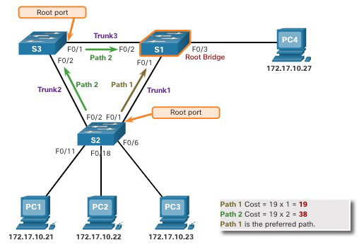
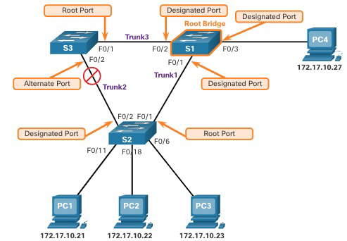

Даний матеріал є дослівним перекладом з  https://irkr.fei.tuke.sk/PocitacoveSiete/_materialy/Prednasky/pred_4%20STP%20Concepts.pdf

# Spanning Tree Protocol (STP): уникнення петель у комутованих мережах Ethernet

## 1. Про STP

### Резервування в комутованих мережах канального рівня (Layer 2)

Ця тема розглядає причини виникнення петель у мережі канального рівня та коротко пояснює, як працює протокол побудови остовного дерева (Spanning Tree Protocol, STP). Резервування є важливою складовою ієрархічного проєктування, оскільки дозволяє усунути єдині точки відмови (single points of failure) та запобігти порушенню роботи мережевих сервісів для користувачів. Щоб забезпечити резервування, у мережу додають додаткові фізичні шляхи, але також необхідно передбачити логічне резервування на рівні структури. Наявність альтернативних фізичних маршрутів для передачі даних мережею дає змогу користувачам отримувати доступ до ресурсів навіть у разі пошкодження основного каналу. Однак у комутованій Ethernet-мережі такі резервні шляхи можуть створювати як фізичні, так і логічні петлі на рівні 2.

Локальні мережі Ethernet потребують топології без петель, з єдиним маршрутом між будь-якими двома пристроями. Наявність петлі в Ethernet-мережі може призвести до безперервного поширення кадрів Ethernet, аж поки не буде розірвано одне зі з’єднань і петля не припиниться.

### Протокол побудови остовного дерева (Spanning Tree Protocol, STP)

Протокол побудови остовного дерева (**STP**, Spanning Tree Protocol) є мережевим протоколом, що запобігає утворенню петель у мережі. Він дозволяє реалізувати резервування, водночас забезпечуючи топологію канального рівня (Layer 2) без петель.

STP логічно блокує фізичні петлі в мережі канального рівня, запобігаючи безкінечному циркулюванню кадрів по мережі.

STP компенсує відмову в мережі шляхом повторного обчислення топології та відкриття раніше заблокованих портів.

Резервування шляхів забезпечує надійність роботи мережі, усуваючи можливість появи єдиної точки відмови. Однак, коли між двома пристроями в Ethernet-мережі існує кілька шляхів, але на комутаторах не реалізовано протокол STP, виникає петля канального рівня (Layer 2 loop). Така петля може призвести до нестабільності таблиці MAC-адрес, перевантаження каналів і надмірного використання ресурсів процесора комутаторів та кінцевих пристроїв, у результаті чого мережа стає непридатною до роботи.

Ethernet на канальному рівні не має механізму для виявлення й усунення кадрів, що безкінечно циркулюють мережею. У протоколах IPv4 та IPv6 передбачено механізм обмеження кількості ретрансляцій пакета пристроями мережевого рівня. Маршрутизатор зменшує значення поля TTL (Time to Live) у кожному пакеті IPv4 або поля Hop Limit у пакеті IPv6. Коли це значення зменшується до нуля, маршрутизатор відкидає пакет. Ethernet і комутатори Ethernet не мають подібного механізму для обмеження кількості ретрансляцій кадрів канального рівня. Саме для вирішення цієї проблеми був розроблений протокол STP як механізм запобігання петлям у мережах Ethernet канального рівня.

Петлі:

- Якщо STP не активовано, у мережі можуть утворюватися петлі канального рівня, через які широкомовні, багатоточкові та невідомі одноадресні кадри циркулюватимуть мережею безкінечно. Це може дуже швидко вивести мережу з ладу.
- Коли виникає петля, таблиця MAC-адрес комутатора постійно оновлюється під впливом широкомовних кадрів, що призводить до нестабільності бази MAC-адрес. Це спричиняє надмірне завантаження процесора, через що комутатор втрачає здатність пересилати кадри.
- Невідомий одноадресний кадр (unknown unicast frame) — це кадр, для якого комутатор не має MAC-адреси призначення у своїй таблиці, тому він змушений передати цей кадр через усі порти, крім вхідного.

Широкомовний шторм  (Broadcast Storm) — це аномально велика кількість широкомовних кадрів, що перевантажують мережу за короткий проміжок часу. Такий шторм може вивести мережу з ладу буквально за кілька секунд, перевантажуючи комутатори й кінцеві пристрої. Причиною широкомовного шторму може бути як апаратна несправність, наприклад пошкоджений мережевий адаптер (Network Interface Card, NIC), так і петля канального рівня в мережі.

Широкомовні кадри канального рівня, наприклад ARP-запити (Address Resolution Protocol), є звичним явищем у мережах. Багатоточкові (multicast) кадри на канальному рівні зазвичай передаються комутатором так само, як широкомовні. Пакети IPv6 ніколи не передаються як широкомовні кадри, оскільки для службових повідомлень, таких як ICMPv6 Neighbor Discovery, використовуються багатоточкові кадри.

Вузол, що опинився всередині петлі канального рівня, стає недоступним для інших пристроїв у мережі. Крім того, через постійні зміни в таблиці MAC-адрес комутатор не може визначити, через який порт надсилати одноадресні кадри.

Щоб запобігти таким проблемам у мережах із резервуванням, на комутаторах слід активувати один із варіантів протоколу побудови остовного дерева (Spanning Tree). На комутаторах Cisco цей протокол увімкнено за замовчуванням, щоб запобігати виникненню петель канального рівня.

### Алгоритм побудови остовного дерева (Spanning Tree Algorithm, STA)

Протокол STP ґрунтується на алгоритмі, який розробила Радія Перлман (Radia Perlman), працюючи в компанії Digital Equipment Corporation. Цей алгоритм було описано в її статті 1985 року під назвою «An Algorithm for Distributed Computation of a Spanning Tree in an Extended LAN». Алгоритм побудови остовного дерева (Spanning Tree Algorithm, STA) створює топологію без петель шляхом вибору одного кореневого комутатора (root bridge), відносно якого всі інші комутатори визначають єдиний маршрут із найменшою вартістю (least-cost path).

Протокол STP запобігає виникненню петель, формуючи петле-безпечний маршрут через мережу за допомогою стратегічно розміщених портів у стані блокування (blocking state). Комутатори, що працюють із STP, можуть автоматично реагувати на відмови, динамічно розблоковуючи раніше заблоковані порти та дозволяючи трафіку проходити через альтернативні шляхи.

Як алгоритм STA створює топологію без петель:

- Вибір кореневого комутатора (Root Bridge): цей комутатор є опорною точкою, відносно якої вся мережа будує остовне дерево.
- Блокування резервних шляхів (Block Redundant Paths): STP забезпечує існування лише одного логічного шляху між усіма вузлами мережі, навмисно блокуючи резервні шляхи, які могли б спричинити петлю. Коли порт заблоковано, користувацькі дані не можуть передаватися через нього в жодному напрямку.
- Створення топології без петель (Create a Loop-Free Topology): заблокований порт фактично робить лінію зв’язку між двома комутаторами непередавальною (non-forwarding). Це утворює топологію, у якій кожен комутатор має лише один шлях до кореневого комутатора, подібно до гілок дерева, що з’єднуються зі стовбуром.
- Повторне обчислення у разі відмови з’єднання (Recalculate in case of Link Failure): фізичні шляхи продовжують існувати для забезпечення резервування, але залишаються неактивними, щоб уникнути петель. Якщо один із основних шляхів виходить з ладу через пошкодження кабелю або відмову комутатора, STP повторно обчислює топологію й розблоковує потрібні порти, активуючи резервний маршрут. Перерахунок STP також відбувається щоразу, коли до мережі додається новий комутатор або нове з’єднання між комутаторами.

## 2. Операції STP

### Етапи створення топології без петель

Використовуючи алгоритм STA, протокол STP формує топологію без петель у чотири етапи:

1. Вибір кореневого комутатора (root bridge).
2. Вибір кореневих портів (root ports).
3. Вибір призначених портів (designated ports).
4. Визначення альтернативних (заблокованих) портів (alternate or blocked ports).

Під час роботи алгоритму STA та протоколу STP комутатори обмінюються спеціальними службовими повідомленнями — одиницями протоколу моста (Bridge Protocol Data Units, **BPDU**), через які вони повідомляють про себе та свої з’єднання. BPDU використовуються для вибору кореневого комутатора, визначення кореневих, призначених та альтернативних портів.

Кожен BPDU містить ідентифікатор комутатора (**Bridge ID**, **BID**), який указує, який саме комутатор надіслав це повідомлення. BID відіграє ключову роль у більшості рішень, які приймає алгоритм STA, зокрема при виборі кореневого комутатора та визначенні ролей портів.

Ідентифікатор BID складається з трьох компонентів: значення пріоритету (priority value), розширеного системного ідентифікатора (extended system ID) та MAC-адреси комутатора. Найменше значення BID визначається комбінацією цих трьох параметрів.

Пріоритет комутатора (**Bridge Priority**): стандартне значення пріоритету для всіх комутаторів Cisco становить 32768 у десятковій системі. Діапазон можливих значень — від 0 до 61440 із кроком 4096. Нижче значення пріоритету вважається кращим. Пріоритет зі значенням 0 має перевагу над усіма іншими.

Розширений системний ідентифікатор (**Extended System ID**): це десяткове значення, яке додається до пріоритету комутатора у складі BID, щоб визначити VLAN, до якого належить цей BPDU.

MAC-адреса: якщо два комутатори мають однаковий пріоритет і однаковий розширений системний ідентифікатор, то комутатор із меншою MAC-адресою (у шістнадцятковому форматі) матиме нижче значення BID і, відповідно, перевагу.

### Етап 1. Вибір кореневого комутатора (Elect the Root Bridge)

Алгоритм STA призначає один комутатор як кореневий (root bridge) і використовує його як точку відліку для всіх обчислень маршрутів. Комутатори обмінюються BPDU-повідомленнями, щоб побудувати топологію без петель, починаючи з вибору кореневого комутатора. Усі комутатори в межах одного домену широкомовлення беруть участь у процесі вибору. Після завантаження комутатор починає надсилати BPDU-кадри кожні дві секунди.

Кожен BPDU-кадр містить:

1. BID комутатора, який надсилає BPDU.
2. BID кореневого комутатора, відомий як Root ID.

Комутатор із найменшим значенням BID стає кореневим. Спочатку кожен комутатор вважає себе кореневим і вказує власний BID як Root ID. Згодом, обмінюючись BPDU, комутатори визначають, у кого найменше значення BID, і погоджуються на одному кореневому комутаторі.

#### Вплив стандартних значень BID

Оскільки стандартне значення BID дорівнює 32768, можлива ситуація, коли два або більше комутаторів мають однаковий пріоритет. У такому випадку, коли пріоритети збігаються, кореневим стає комутатор із найменшою MAC-адресою. Адміністратору слід заздалегідь призначити бажаному кореневому комутатору нижчий пріоритет.

На прикладі, показаному на рисунку, усі комутатори мають однаковий пріоритет — 32769. Тому вирішальним чинником стає MAC-адреса: комутатор із найменшим значенням MAC-адреси у шістнадцятковому форматі стає кореневим. У цьому випадку комутатор S2 має найменше значення MAC-адреси й обирається кореневим для цього екземпляра остовного дерева.

Примітка. Пріоритет усіх комутаторів дорівнює 32769. Це значення утворюється шляхом додавання стандартного пріоритету комутатора 32768 і розширеного системного ідентифікатора, що відповідає VLAN 1 (32768 + 1).

#### Визначення вартості шляху до кореневого комутатора (Root Path Cost)

Після того як для певного екземпляра остовного дерева обрано кореневий комутатор, алгоритм STA починає визначати найкращі шляхи до нього від усіх вузлів у межах домену широкомовлення. Інформація про шлях, відома як внутрішня вартість шляху до кореня (internal root path cost), обчислюється як сума вартостей усіх окремих портів уздовж маршруту від комутатора до кореневого комутатора.

Коли комутатор отримує BPDU, він додає вартість порту, через який було прийнято цей BPDU (ingress port cost), щоб визначити власну внутрішню вартість шляху до кореня.

Стандартні вартості портів визначаються швидкістю, з якою працює порт. У таблиці наведені рекомендовані значення за стандартом IEEE. Комутатори Cisco за замовчуванням використовують ці значення, визначені стандартом IEEE 802.1D (так звані short path cost), як для STP, так і для RSTP.

Хоча кожен порт має стандартну вартість, цей параметр може бути змінений вручну. Можливість налаштовувати індивідуальні вартості портів надає адміністратору гнучкість у ручному керуванні маршрутами остовного дерева до кореневого комутатора.

### Етап 2. Вибір кореневих портів (Elect the Root Ports)

Після того як визначено кореневий комутатор, алгоритм STA використовується для вибору кореневого порту. Кожен не кореневий комутатор обирає один порт, який стає кореневим. Кореневим вважається порт, що має найменшу загальну вартість шляху до кореневого комутатора. Ця загальна вартість називається внутрішньою вартістю шляху до кореня (internal root path cost).

Внутрішня вартість шляху до кореня дорівнює сумі вартостей усіх портів уздовж маршруту до кореневого комутатора, як показано на рисунку. Шляхи з найменшою вартістю вважаються пріоритетними, а всі інші резервні шляхи блокуються. У наведеному прикладі внутрішня вартість шляху від комутатора S2 до кореневого комутатора S1 через шлях 1 становить 19, тоді як через шлях 2 — 38. Оскільки шлях 1 має меншу сумарну вартість, він стає основним, і порт F0/1 на комутаторі S2 призначається як кореневий порт.

### Етап 3. Вибір призначених портів (Elect Designated Ports)

Кожен сегмент між двома комутаторами має один призначений порт. Призначений порт (**Designated Port**) — це порт на сегменті, який має найменшу внутрішню вартість шляху до кореневого комутатора. Іншими словами, призначений порт забезпечує найкращий маршрут для **отримання** трафіку, що прямує до кореневого комутатора.

Будь-який порт, який не є ні кореневим, ні призначеним, стає альтернативним або заблокованим портом.

Усі порти на кореневому комутаторі є призначеними. Якщо один кінець сегмента є кореневим портом, інший його кінець буде призначеним портом. Усі порти, підключені до кінцевих пристроїв, також вважаються призначеними.

На сегментах між двома комутаторами, де жоден із них не є кореневим, призначеним стає порт того комутатора, який має найменшу вартість шляху до кореневого комутатора.

Якщо два комутатори на одному сегменті мають однакову сумарну мінімальну вартість шляху до кореневого комутатора, то призначеним стає порт того комутатора, який має нижчий ідентифікатор моста (Bridge ID, BID), а порт на іншому комутаторі вважається непризначеним (Non-Designated Port).

### Етап 4. Визначення альтернативних (заблокованих) портів (Elect Alternate / Blocked Ports)

Якщо порт не є ні кореневим, ні призначеним, він стає альтернативним (alternate) або резервним (backup). Такі порти перебувають у стані відкидання або блокування (discarding / blocking), щоб запобігти виникненню петель у мережі.

На прикладі, показаному на рисунку, алгоритм STA визначив порт F0/2 на комутаторі S3 як альтернативний. Порт F0/2 на S3 перебуває у стані блокування і не передає кадри Ethernet. Усі інші порти між комутаторами перебувають у стані пересилання (forwarding). Саме ця поведінка і є механізмом запобігання петлям у протоколі STP.

### Вибір кореневого порту серед кількох шляхів з однаковою вартістю

Коли комутатор має кілька шляхів до кореневого комутатора з однаковою вартістю, він визначає, який порт стане кореневим, за такими критеріями (у порядку пріоритету):

- найменший ідентифікатор комутатора-відправника (sender BID)
- найменший пріоритет порту відправника (sender port priority)
- найменший ідентифікатор порту відправника (sender port ID)

#### Найменший BID відправника (Lowest Sender BID)

У цій топології є чотири комутатори, де S1 є кореневим комутатором. Порт F0/1 на комутаторі S3 та порт F0/3 на комутаторі S4 вибрані як кореневі порти, оскільки вони мають найменшу вартість шляху до кореневого комутатора для своїх відповідних пристроїв.

Комутатор S2 має два порти — F0/1 і F0/2 — через які існують шляхи до кореневого комутатора з однаковою вартістю. Щоб розв’язати цю ситуацію, використовуються ідентифікатори комутаторів S3 і S4, тобто BID відправників (sender’s BID). Комутатор S3 має BID 32769.5555.5555.5555, а S4 — 32769.1111.1111.1111.

Оскільки BID комутатора S4 менше, порт F0/1 на комутаторі S2, який підключений до S4, буде обрано як кореневий порт.

#### Найменший пріоритет порту відправника (Lowest Sender Port Priority)

У цій топології є два комутатори, з’єднані двома шляхами з однаковою вартістю. Комутатор S1 є кореневим, тому обидва його порти є призначеними.

Комутатор S4 має два порти з однаковою вартістю шляху до кореневого комутатора. Оскільки обидва порти підключені до одного й того самого комутатора S1, ідентифікатор відправника (sender BID) однаковий, тож перший етап порівняння не дає результату.

Далі враховується пріоритет порту відправника (sender port priority). За замовчуванням цей пріоритет дорівнює 128, тому обидва порти комутатора S1 мають однакове значення — знову нічия. Однак, якщо одному з портів S1 призначити нижчий пріоритет, то комутатор S4 переведе свій відповідний порт у стан пересилання (forwarding), а інший порт — у стан блокування (blocking).

#### Найменший ідентифікатор порту відправника (Lowest Sender Port ID)

Останній критерій для вибору — це найменший ідентифікатор порту відправника. Комутатор S4 отримав BPDU від портів F0/1 і F0/2 комутатора S1. Рішення приймається на основі ідентифікатора порту відправника, а не порту приймача. Оскільки порт F0/1 на комутаторі S1 має менший ідентифікатор, ніж порт F0/2, порт F0/6 на комутаторі S4, який підключений до F0/1 на S1, буде визначений як кореневий порт.

Порт F0/5 на комутаторі S4 стане альтернативним портом і буде переведений у стан блокування (blocking state).

### Таймери та стани портів (STP Timers and Port States)

Для збіжності (convergence) протоколу STP використовуються три основні таймери:

- **Hello Timer** — інтервал між надсиланням BPDU-повідомлень. Типове значення становить 2 секунди, але його можна змінити в межах від 1 до 10 секунд.

- **Forward Delay Timer** — час, протягом якого порт перебуває у станах прослуховування (listening) і навчання (learning). Типове значення становить 15 секунд, діапазон зміни — від 4 до 30 секунд.

- **Max Age Timer** — максимальний час, протягом якого комутатор очікує перед тим, як розпочати зміну топології STP. Типове значення — 20 секунд, можливий діапазон від 6 до 40 секунд.

Примітка. Значення цих таймерів задаються на кореневому комутаторі, і саме він визначає їх для всього домену STP.

STP забезпечує логічний шлях без петель у межах домену широкомовлення. Остовне дерево визначається на основі інформації, отриманої під час обміну BPDU-кадрами між взаємопов’язаними комутаторами. Якщо порт комутатора переходить безпосередньо зі стану блокування (blocking) у стан пересилання (forwarding), не маючи актуальної інформації про всю топологію під час цього переходу, він може тимчасово створити петлю передачі даних.

Саме тому в STP передбачено п’ять станів портів, чотири з яких є робочими (operational), як показано на рисунку. П’ятий стан — **disabled** — вважається неробочим (non-operational).

Таблиця узагальнює особливості роботи кожного стану порту

| Стан порту                  | Обробка BPDU             | Таблиця MAC-адрес | Передавання кадрів даних |
| --------------------------- | ------------------------ | ----------------- | ------------------------ |
| Blocking (блокування)       | Лише приймає             | Не оновлюється    | Ні                       |
| Listening (прослуховування) | Приймає і надсилає       | Не оновлюється    | Ні                       |
| Learning (навчання)         | Приймає і надсилає       | Оновлюється       | Ні                       |
| Forwarding (пересилання)    | Приймає і надсилає       | Оновлюється       | Так                      |
| Disabled (вимкнений)        | Не приймає і не надсилає | Не оновлюється    | Ні                       |

### Остовне дерево для кожного VLAN (Per-VLAN Spanning Tree)

Протокол STP може бути налаштований для роботи в середовищі з кількома VLAN.

У версіях STP типу Per-VLAN Spanning Tree (**PVST**) для кожного екземпляра остовного дерева обирається власний кореневий комутатор (root bridge). Це дає змогу мати різні кореневі комутатори для різних груп VLAN.

Таким чином, для кожного VLAN створюється окремий екземпляр протоколу STP. Якщо всі порти на всіх комутаторах належать до VLAN 1, то в мережі існує лише один екземпляр остовного дерева.

## 3. Еволюція STP

### Різновиди протоколу STP

Багато фахівців уживають терміни *spanning tree* і *STP* узагальнено, маючи на увазі різні реалізації цього протоколу, такі як *Rapid Spanning Tree Protocol (RSTP)* і *Multiple Spanning Tree Protocol (MSTP)*. Щоб коректно передавати зміст, важливо уточнювати, про який саме стандарт або реалізацію остовного дерева йдеться.

Остання документація IEEE щодо остовного дерева (IEEE 802.1D-2004) зазначає: «STP нині замінено протоколом Rapid Spanning Tree Protocol (RSTP)». У стандартах IEEE термін *STP* використовується для позначення оригінальної реалізації остовного дерева, а *RSTP* — для версії, визначеної в IEEE 802.1D-2004.

Оскільки обидва протоколи мають спільну термінологію та принципи побудови топології без петель, основну увагу приділяють сучасному стандарту та фірмовим реалізаціям Cisco для STP і RSTP.

Комутатори Cisco з операційною системою IOS версії 15.0 або новішою за замовчуванням працюють у режимі PVST+. Ця версія реалізує багато положень стандарту IEEE 802.1D-2004, зокрема використання альтернативних портів (alternate ports) замість попередніх не призначених (non-designated) портів. Щоб комутатор працював у режимі швидкого остовного дерева (Rapid Spanning Tree), його потрібно явно перевести в режим rapid spanning tree.

| Різновид        | Опис                                                         |
| --------------- | ------------------------------------------------------------ |
| **STP**         | Початкова версія стандарту IEEE 802.1D (802.1D-1998 і раніші), що забезпечує топологію без петель у мережі з резервними з’єднаннями. Також відома як *Common Spanning Tree (CST)*. Припускає існування лише одного екземпляра остовного дерева для всієї мережі з мостами, незалежно від кількості VLAN. |
| **PVST+**       | *Per-VLAN Spanning Tree Plus* — фірмове розширення Cisco для STP, що створює окремий екземпляр остовного дерева 802.1D для кожного VLAN, налаштованого в мережі. Підтримує функції *PortFast, UplinkFast, BackboneFast, BPDU Guard, BPDU Filter, Root Guard* і *Loop Guard.* |
| **802.1D-2004** | Оновлена версія стандарту STP, яка включає специфікації IEEE 802.1w (RSTP). |
| **RSTP**        | *Rapid Spanning Tree Protocol* або IEEE 802.1w — розвиток STP, що забезпечує швидшу збіжність топології порівняно зі стандартним STP. |
| **Rapid PVST+** | Розширення Cisco для RSTP, яке поєднує PVST+ і створює окремий екземпляр протоколу 802.1w для кожного VLAN. Кожен екземпляр підтримує функції *PortFast, BPDU Guard, BPDU Filter, Root Guard* і *Loop Guard.* |
| **MSTP**        | *Multiple Spanning Tree Protocol* — стандарт IEEE, розроблений на основі попередньої власної реалізації Cisco *Multiple Instance STP (MISTP)*. Дозволяє об’єднувати кілька VLAN у спільний екземпляр остовного дерева. |
| **MST**         | *Multiple Spanning Tree* — реалізація MSTP від Cisco, що підтримує до 16 екземплярів RSTP і дає змогу поєднувати кілька VLAN із однаковою фізичною та логічною топологією в один спільний екземпляр RSTP. Кожен екземпляр підтримує функції *PortFast, BPDU Guard, BPDU Filter, Root Guard* і *Loop Guard.* |

### Концепції RSTP

RSTP (IEEE 802.1w) замінює оригінальний стандарт 802.1D, зберігаючи при цьому зворотну сумісність. Термінологія протоколу 802.1w STP загалом відповідає термінам оригінального IEEE 802.1D STP, і більшість параметрів залишилися без змін. Тому користувачам, знайомим зі стандартом STP, легко налаштувати RSTP. Для визначення ролей портів і побудови топології використовується той самий алгоритм остовного дерева, що й у STP.

RSTP прискорює процес повторного обчислення остовного дерева під час змін у топології мережі канального рівня. У правильно налаштованій мережі RSTP забезпечує значно швидшу збіжність — іноді за кілька сотень мілісекунд. Якщо порт налаштовано як альтернативний (alternate port), він може негайно перейти в стан пересилання (forwarding), не очікуючи повної перебудови мережі.

Примітка. Rapid PVST+ є реалізацією RSTP від Cisco, що працює на рівні окремих VLAN. У режимі Rapid PVST+ для кожного VLAN запускається власний екземпляр протоколу RSTP.

У протоколі RSTP існує лише три стани портів, що відповідають трьом робочим станам у STP. Станами **disabled**, **blocking** і **listening** зі стандарту 802.1D у RSTP об’єднано в один спільний стан — **discarding**.

Ролі портів **root** і **designated** залишилися такими самими, як у STP. Проте в RSTP з’явилися дві додаткові ролі портів, що відповідають стану блокування (blocking) у STP. У STP заблокований порт визначався як той, що не є ані призначеним, ані кореневим. У RSTP для цього введено дві ролі портів.

- backup
- alternative

Альтернативний порт (alternate port) має резервний шлях до кореневого комутатора. Резервний порт (backup port) використовується як дублюючий у середовищі з розділеним доступом, наприклад у сегменті з концентратором (hub). Резервні порти трапляються рідко, оскільки концентратори нині вважаються застарілими пристроями.

### PortFast і BPDU Guard

Коли пристрій під’єднується до порту комутатора або коли сам комутатор запускається, порт проходить через стани прослуховування (listening) і навчання (learning), кожного разу очікуючи завершення таймера Forward Delay. Для кожного стану ця затримка становить 15 секунд, тобто загалом 30 секунд. Це може створити проблему для клієнтів DHCP, які намагаються знайти сервер DHCP, адже процес може завершитися за тайм-аутом. У результаті клієнт IPv4 не отримає дійсної IP-адреси.

Якщо порт комутатора налаштовано з функцією **PortFast**, він переходить зі стану блокування (blocking) у стан пересилання (forwarding) миттєво, минаючи затримку у 30 секунд. PortFast застосовується для портів доступу (access ports), щоб пристрої, підключені до них, могли відразу отримати доступ до мережі. Цю функцію слід використовувати лише на портах доступу. Якщо увімкнути PortFast на порту, що з’єднує комутатор з іншим комутатором, можна випадково створити петлю в топології STP.

Порт із активованою функцією PortFast ніколи не повинен отримувати BPDU, оскільки це означало б, що до порту під’єднано інший комутатор, і це може спричинити петлю. Для захисту від таких ситуацій комутатори Cisco підтримують функцію BPDU Guard. Якщо вона активована, то при отриманні будь-якого BPDU комутатор негайно переводить порт у стан *errdisabled* (помилково вимкнений). Це ефективно вимикає порт, запобігаючи утворенню петлі. Щоб повернути інтерфейс у роботу, адміністратор повинен зробити це вручну.

### Альтернативи STP

З роками організації почали вимагати від локальних мереж (LAN) більшої стійкості та доступності. Мережі Ethernet еволюціонували від кількох з’єднаних комутаторів, підключених до одного маршрутизатора, до складних ієрархічних структур, які включають комутатори рівнів доступу, розподілу та ядра.

Залежно від конкретної реалізації, канальний рівень (Layer 2) може охоплювати не лише рівень доступу, а й розподільний або навіть ядровий рівні. Такі архітектури можуть включати сотні комутаторів і сотні або навіть тисячі VLAN. Протокол STP пристосувався до збільшення надмірності та складності завдяки удосконаленням, реалізованим у RSTP та MSTP.

Важливим аспектом проєктування мережі є швидка й передбачувана збіжність (convergence) у разі відмови або зміни топології. Протокол остовного дерева не забезпечує такої ефективності й передбачуваності, як маршрутизаційні протоколи мережевого рівня (Layer 3).

Маршрутизація на рівні 3 дозволяє мати надлишкові шляхи та навіть петлі в топології без потреби блокувати порти. Саме тому деякі сучасні мережі поступово переходять на архітектуру, де рівень 3 використовується всюди, крім підключення кінцевих пристроїв. Тобто з’єднання між комутаторами рівня доступу та рівня розподілу виконуються не на рівні 2, а на рівні 3.

## 4. Module Practice and Quiz

- Резервні шляхи в комутованій Ethernet-мережі можуть спричиняти як фізичні, так і логічні петлі на канальному рівні (Layer 2).
- Петля канального рівня може призвести до нестабільності таблиці MAC-адрес, перевантаження каналів і надмірного використання процесора на комутаторах і кінцевих пристроях. У результаті мережа стає непридатною до роботи.
- STP — це мережевий протокол, який запобігає утворенню петель, дозволяючи при цьому зберігати резервування. Він створює топологію канального рівня без петель. Без STP у мережі можуть утворюватися петлі, через які широкомовні, багатоточкові й невідомі одноадресні кадри циркулюватимуть безкінечно, що може паралізувати мережу.
- Використовуючи алгоритм STA, STP формує топологію без петель у чотири етапи: вибір кореневого комутатора, вибір кореневих портів, вибір призначених портів і визначення альтернативних (заблокованих) портів.
- Під час роботи алгоритму STA та протоколу STP комутатори обмінюються BPDU-повідомленнями, у яких передають інформацію про себе та свої з’єднання. BPDU використовуються для вибору кореневого комутатора, кореневих, призначених і альтернативних портів.
- Після вибору кореневого комутатора для певного екземпляра остовного дерева алгоритм STA визначає найкращі шляхи до нього з усіх вузлів у домені широкомовлення. Інформація про шлях, відома як внутрішня вартість шляху до кореня (internal root path cost), обчислюється як сума вартостей усіх портів уздовж маршруту від комутатора до кореневого комутатора.
- Після визначення кореневого комутатора алгоритм STA обирає кореневий порт. Кореневим стає порт, який має найменшу сумарну вартість шляху до кореневого комутатора — тобто найменшу internal root path cost.
- Після того як кожен комутатор обрав свій кореневий порт, відбувається вибір призначених портів. Призначений порт — це порт у сегменті (що з’єднує два комутатори), який має найменшу внутрішню вартість шляху до кореневого комутатора.
- Якщо порт не є ні кореневим, ні призначеним, він стає альтернативним (alternate) або резервним (backup). Такі порти перебувають у стані blocking або discarding, щоб запобігти утворенню петель у мережі.
- • Коли комутатор має кілька шляхів до кореневого комутатора з однаковою вартістю, він визначає кореневий порт за такими критеріями: найменший ідентифікатор комутатора-відправника (sender BID), потім найменший пріоритет порту відправника, а далі найменший ідентифікатор порту відправника (sender port ID).
- Для збіжності (convergence) протоколу STP використовуються три таймери: hello timer, forward delay timer і max age timer.
- Станами портів у STP є blocking, listening, learning, forwarding і disabled.
- У версіях STP типу PVST для кожного екземпляра остовного дерева обирається власний кореневий комутатор, що дозволяє мати різні root bridge для різних груп VLAN.
- Термін STP часто використовують узагальнено для позначення різних реалізацій протоколу остовного дерева, таких як RSTP і MSTP.
- RSTP є розвитком STP і забезпечує швидшу збіжність топології.
- Стани портів у RSTP — learning, forwarding і discarding.
- PVST+ — це розширення STP від Cisco, яке створює окремий екземпляр остовного дерева для кожного VLAN у мережі. PVST+ підтримує функції PortFast, UplinkFast, BackboneFast, BPDU Guard, BPDU Filter, Root Guard і Loop Guard.
- Комутатори Cisco з операційною системою IOS версії 15.0 або новішою за замовчуванням працюють у режимі PVST+.
- Rapid PVST+ — це розширення Cisco для RSTP, яке використовує механізм PVST+ і створює окремий екземпляр протоколу 802.1w для кожного VLAN.
- Якщо порт комутатора налаштований із функцією PortFast, він миттєво переходить із блокуючого стану (blocking) у стан пересилання (forwarding), минаючи стани прослуховування (listening) і навчання (learning) та уникаючи затримки тривалістю близько 30 секунд.
- Функцію PortFast слід застосовувати на портах доступу (access ports), щоб пристрої, підключені до них (наприклад клієнти DHCP), могли отримати доступ до мережі одразу, не очікуючи, доки STP досягне збіжності для кожного VLAN.
- Комутатори Cisco підтримують функцію BPDU Guard, яка негайно переводить порт комутатора у стан помилкового вимкнення (error-disabled) при отриманні будь-якого BPDU. Це запобігає можливому утворенню петель у мережі.
- З часом мережі Ethernet еволюціонували від кількох з’єднаних між собою комутаторів, підключених до одного маршрутизатора, до складної ієрархічної структури. Залежно від реалізації, канальний рівень (Layer 2) може включати не лише рівень доступу, але й рівень розподілу або навіть ядровий рівень. Такі мережеві архітектури можуть складатися зі сотень комутаторів і охоплювати сотні або навіть тисячі VLAN. Протокол STP пристосувався до зростання надмірності та складності, отримавши вдосконалення в межах стандартів RSTP та MSTP.
- Маршрутизація на рівні 3 (Layer 3 routing) дозволяє мати резервні шляхи й петлі в топології без потреби блокувати порти. Саме тому деякі мережеві архітектури поступово переходять до використання рівня 3 усюди, окрім місць підключення кінцевих пристроїв до комутаторів рівня доступу.