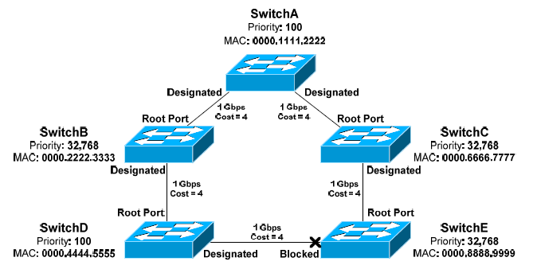
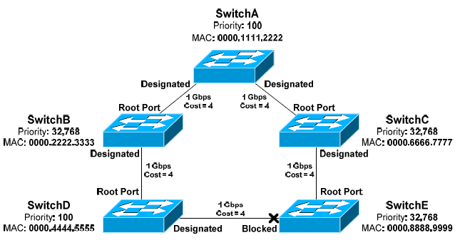
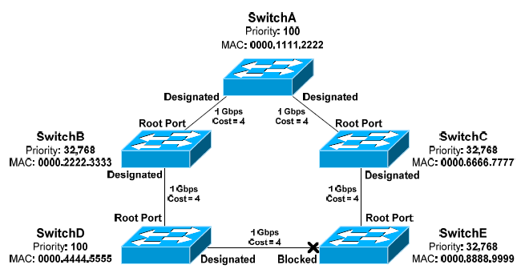

All original material copyright © 2014 by Aaron Balchunas (aaron@routeralley.com), unless otherwise noted. All other material copyright © of their respective owners. This material may be copied and used freely, but may not be altered or sold without the expressed written consent of the owner of the above copyright. Updated material may be found at http://www.routeralley.com.

Даний матеріал є дослівним перекладом з https://www.routeralley.com/guides/stp.pdf

# Протокол побудови остовного дерева (Spanning Tree Protocol)

## Петлі комутації (Switching Loops)

Комутатор канального рівня (Layer 2) належить лише до одного домену широкомовлення та передає як широкомовні, так і багатоточкові кадри через усі порти, окрім того, з якого кадр було отримано. Коли в мережі з’являється петля комутації, протягом кількох секунд розвивається руйнівний широкомовний шторм. Такий шторм виникає тоді, коли широкомовні кадри безкінечно передаються петлею. Зрештою, цей потік кадрів блокує весь інший мережевий трафік.

Розглянемо приклад:

Якщо хост A надсилає широкомовний кадр, комутатор D передасть його через усі порти в межах того самого VLAN, включно з транковими портами, що з’єднують його з комутаторами B і E. У свою чергу, ці два комутатори також передадуть цей кадр через усі свої порти, включно з транковими з’єднаннями до сусідніх комутаторів A і C.

У результаті широкомовний кадр безкінечно циркулюватиме між комутаторами. Насправді в мережі утворяться дві окремі широкомовні бурі, які рухатимуться петлею в протилежних напрямках. Зупинити цей шторм можна лише вимкнувши комутатори або фізично розірвавши петлю.


## Протокол побудови остовного дерева (Spanning Tree Protocol, STP)

Протокол Spanning Tree (STP) був розроблений для запобігання широкомовним бурям, що виникають через петлі комутації. STP спочатку був визначений у стандарті IEEE 802.1D.

Комутатори, що працюють із STP, створюють карту або топологію всієї комутованої мережі. Протокол визначає наявність петель і блокує або відключає необхідну кількість портів, щоб усунути всі петлі з топології.

Заблокований порт може бути повторно активований, якщо інший порт виходить з ладу. Це дозволяє STP підтримувати резервування та відмовостійкість.

Однак, оскільки частина портів блокується для усунення петель, STP не підтримує балансування навантаження, якщо не використовується технологія EtherChannel. Детальний опис EtherChannel наведено в іншому посібнику.

Комутатори STP обмінюються службовими повідомленнями BPDU (Bridge Protocol Data Units) для побудови бази топології. BPDU передаються через усі порти кожні дві секунди на спеціальну MAC-адресу для багатоточкової розсилки — 0180.c200.0000.

Побудова топології STP є процесом збіжності, який включає кілька етапів:

-  обирається кореневий комутатор (Root Bridge);
-  визначаються кореневі порти (Root Ports);
-  визначаються призначені порти (Designated Ports);
-  за потреби певні порти переводяться в стан блокування, щоб усунути петлі.

Кореневий комутатор слугує центральною точкою відліку для всієї топології STP. Протокол був створений ще в часи, коли переважали мости (bridges) рівня 2, тому термін «Root Bridge» зберігся історично. У сучасних документах допустимо також вживати термін «Root Switch», хоча він використовується рідше.

Після того як топологія повністю визначена, а петлі усунено, комутатори вважаються такими, що досягли збіжності (convergence).

На всіх комутаторах Cisco протокол STP увімкнено за замовчуванням для всіх VLAN.

### Вибір кореневого комутатора STP (Electing an STP Root Bridge)

Першим етапом процесу збіжності STP є вибір кореневого комутатора (Root Bridge), який стає центральною точкою відліку для всієї топології остовного дерева. Як правило, найкращою практикою вважається вибір як Root Bridge найбільш центрального комутатора в межах топології STP.

Кореневий комутатор обирається на основі його ідентифікатора Bridge ID, який у початковій версії стандарту 802.1D складався з двох компонентів:

-  16-бітного значення пріоритету комутатора (Bridge Priority);
-  48-бітної MAC-адреси.

Стандартне значення пріоритету становить 32 768, і комутатор з **найменшим значенням пріоритету** стає кореневим. Якщо кілька комутаторів мають однаковий пріоритет, вирішальним чинником стає **найменша MAC-адреса**.

Розглянемо приклад:


Комутатори обмінюються BPDU-повідомленнями, щоб виконати процес вибору кореневого комутатора. Кореневим стає той комутатор, який має найменший ідентифікатор Bridge ID:

- Комутатори B, C і E мають стандартний пріоритет 32 768.
- Комутатори A і D мають нижчий пріоритет — 100.
- Оскільки комутатор A має найменшу MAC-адресу, саме він буде обраний як Root Bridge.

За замовчуванням кожен комутатор вважає себе кореневим, доки не отримає BPDU від іншого комутатора з меншим Bridge ID. Таке BPDU називають «переважаючим» (superior BPDU).

Процес вибору є безперервним: якщо в топологію додається новий комутатор з меншим Bridge ID, він автоматично буде обраний новим Root Bridge.

### Визначення кореневих портів (Identifying Root Ports)

Другим етапом процесу збіжності STP є визначення кореневих портів (Root Ports). Кореневим портом на кожному комутаторі вважається порт, який має найменшу сумарну вартість шляху (Root Path Cost) до кореневого комутатора.

Кожен комутатор може мати лише один кореневий порт. Кореневий комутатор не має Root Port, оскільки призначення цього порту — вказувати напрямок до Root Bridge.

Вартість шляху (Path Cost) є сумарною величиною, що залежить від пропускної здатності каналів зв’язку. Чим вища швидкість каналу, тим нижча його вартість:

| Пропускна здатність | Вартість шляху |
| ------------------- | -------------- |
| 4 Мбіт/с            | 250            |
| 10 Мбіт/с           | 100            |
| 16 Мбіт/с           | 62             |
| 45 Мбіт/с           | 39             |
| 100 Мбіт/с          | 19             |
| 155 Мбіт/с          | 14             |
| 1 Гбіт/с            | 4              |
| 10 Гбіт/с           | 2              |

Менше значення вартості вважається кращим.

Розглянемо приклад:


Кожне з’єднання зі швидкістю 1 Гбіт/с має вартість шляху 4. Комутатор A має сумарну вартість шляху 0, оскільки він є кореневим комутатором (Root Bridge). Тому, надсилаючи BPDU-повідомлення, комутатор A оголошує в них вартість шляху до кореня, що дорівнює 0.

Комутатор B має два можливі шляхи до кореневого комутатора:

- Пряме з’єднання з комутатором A з вартістю шляху 4.
- Інший шлях через комутатор D з вартістю шляху 16.

Найменша сумарна вартість шляху вважається найкращою, тому порт, що має пряме з’єднання з комутатором A, стане кореневим портом. BPDU, яке містить більшу вартість шляху, часто називають «гіршим» (inferior BPDU).

Комутатор D також має два шляхи до кореневого комутатора:

-  шлях через комутатор B з вартістю шляху 8;
-  шлях через комутатор E з вартістю шляху 12.

Перевага надається порту, що з’єднаний із комутатором B, тому саме він стане кореневим портом.

Нагадаємо, що кореневий комутатор розсилає BPDU з вартістю шляху 0. Коли нижчі комутатори отримують такі BPDU, вони додають вартість свого приймального порту, після чого передають сусідам BPDU із сумарною (накопиченою) вартістю шляху.

Наприклад, комутатор C отримає BPDU з вартістю шляху 0 від комутатора A, який є Root Bridge. Додавши вартість свого порту, комутатор C матиме сумарну вартість шляху 4. Потім C передасть цю інформацію далі до комутатора E, який, у свою чергу, додасть вартість свого приймального порту. Таким чином, сумарна вартість шляху для комутатора E становитиме 8.

Вартість шляху можна також задати вручну для окремого порту. Приклад конфігурації:

```
SwitchD(config)# int gi2/22  
SwitchD(config-if)# spanning-tree vlan 101 cost 42
```

### Визначення призначених портів (Identifying Designated Ports)

Третім етапом процесу збіжності STP є визначення призначених портів (Designated Ports). Для кожного мережевого сегмента визначається один призначений порт. Цей порт відповідає за пересилання BPDU та кадрів у відповідний сегмент.

Якщо на одному сегменті виявляються два порти, які можуть стати призначеними, це означає, що в мережі існує петля. У такому випадку один із портів буде переведено в стан блокування, щоб усунути петлю.

Подібно до кореневого порту, призначений порт визначається на основі найменшої сумарної вартості шляху (cumulative path cost) до кореневого комутатора. Призначений порт ніколи не переходить у стан блокування, якщо тільки в топології комутації не відбулися зміни й не було обрано новий, більш пріоритетний призначений порт.

Примітка. Один і той самий порт не може одночасно бути і призначеним, і кореневим.

Розглянемо приклад:



Порти на кореневому комутаторі ніколи не переходять у стан блокування. Тому два порти комутатора A автоматично стають призначеними портами.

Слід пам’ятати, що кожен мережевий сегмент повинен мати один призначений порт, навіть якщо в цьому сегменті вже є кореневий порт.

Отже, мережеві сегменти між комутаторами B і D, а також між C і E, також повинні мати призначений порт. Оскільки порти на комутаторах D і E вже визначено як кореневі, порти на комутаторах B і C стають призначеними.

Зверніть увагу, що мережевий сегмент між комутаторами D і E не містить кореневого порту:

### Ідентифікатор порту (Port ID)

Під час вибору кореневих і призначених портів може виникнути ситуація, коли значення вартості шляху (path cost) і ідентифікатора комутатора (Bridge ID) збігаються. Розглянемо приклад:


Пропускна здатність обох ліній однакова, тому обидва порти комутатора B мають однакову вартість шляху до кореневого комутатора. Виникає питання: який порт стане кореневим? Зазвичай для розв’язання таких ситуацій використовується найменший Bridge ID, але в цьому випадку це неможливо.

Для остаточного вибору використовується ідентифікатор порту (Port ID), який складається з двох компонентів:

- 4-бітного пріоритету порту (port priority);
- 12-бітного номера порту (port number), що відповідає фізичному номеру інтерфейсу.

За замовчуванням пріоритет порту дорівнює 128, і перевагу має менше значення. Якщо пріоритети збігаються, вибір здійснюється за найменшим номером порту.

Для визначення переможця враховується **ідентифікатор порту відправника (sender Port ID)**, а не локальний.

У наведеному прикладі комутатор B повинен вирішити, який порт — gi2/23 чи gi2/24 — стане кореневим. Він аналізує BPDU, отримані від комутатора A, у яких містяться Port ID для портів gi2/10 і gi2/11.

Якщо пріоритети рівні, то перевагу має порт gi2/10 завдяки меншому номеру. Отже, порт gi2/23 на комутаторі B стає кореневим портом.

Номер порту є фіксованим значенням, але пріоритет можна змінювати окремо для кожного інтерфейсу. Приклад конфігурації:

```
Switch(config)# int gi2/11  
Switch(config-if)# spanning-tree vlan 101 port-priority 32
```

Примітка. У деяких джерелах можна зустріти твердження, що Port ID складається з 8-бітного пріоритету та 8-бітного номера порту. Це було справедливо для початкової специфікації IEEE 802.1D.

Однак стандарт IEEE 802.1t змінив цю специфікацію, розширивши поле номера порту до 12 біт, щоб підтримувати модульні комутатори з великою кількістю портів.

Ще більше плутанини додають деякі документи Cisco, у яких Port ID описується як комбінація пріоритету порту та MAC-адреси, а не номера порту. У сучасних реалізаціях STP це визначення є некоректним.


Запам’ятайте: ідентифікатор порту (Port ID) є останнім критерієм, який STP враховує під час вибору. Протокол STP визначає кореневі та призначені порти за такими правилами, у порядку пріоритету:

- найменша вартість шляху до кореневого комутатора (Root Bridge);
- найменший ідентифікатор комутатора (Bridge ID);
- найменший ідентифікатор порту відправника (Sender Port ID).

Найменший Bridge ID завжди використовується для визначення кореневого комутатора (Root Bridge).

### Версії протоколу STP

Існує три варіанти початкової версії STP за стандартом IEEE 802.1D:

- Common Spanning Tree (CST)
- Per-VLAN Spanning Tree (PVST)
- Per-VLAN Spanning Tree Plus (PVST+)

CST використовує єдиний екземпляр STP для всіх VLAN, тому іноді його називають моноостовним деревом (mono spanning tree). Усі BPDU протоколу CST передаються через рідний VLAN (native VLAN) на транковому порту, тобто без тегування кадрів.

PVST створює окремий екземпляр STP для кожного VLAN, що підвищує гнучкість і продуктивність роботи мережі. Для функціонування PVST транкові порти повинні використовувати інкапсуляцію ISL. Протоколи PVST і CST є несумісними.

Розширена версія PVST+ сумісна як із CST, так і з PVST, та підтримує обидва типи інкапсуляції — ISL і IEEE 802.1Q. Режим PVST+ є типовим для більшості комутаторів Cisco.

З часом STP продовжив розвиватися, і сучасні розширення цього протоколу розглядаються далі в документі:

- Rapid Spanning Tree Protocol (RSTP)
- Multiple Spanning Tree (MST) 

### Розширені системні ідентифікатори (Extended System IDs)

У початковому стандарті IEEE 802.1D ідентифікатор Bridge ID мав довжину 64 біти і складався з двох компонентів:

- 16-бітного пріоритету комутатора (Bridge Priority);
- 48-бітної MAC-адреси.

Коли STP почав працювати на рівні окремих VLAN, виникла потреба мати унікальний Bridge ID для кожного VLAN. Спочатку це реалізували шляхом призначення кожному VLAN окремої MAC-адреси комутатора. Однак такий підхід мав проблему масштабованості — комутатор мав підтримувати щонайменше 1024 унікальні системні MAC-адреси, по одній для кожного VLAN.

У стандарті IEEE 802.1t було змінено структуру Bridge ID, додавши розширений системний ідентифікатор (Extended System ID), який указує номер VLAN для певного екземпляра STP.

Bridge ID залишився 64-бітним, але тепер складається з трьох частин:

- 4 біти — пріоритет комутатора (Bridge Priority);
- 12 біт — системний або VLAN-ідентифікатор (System/VLAN ID);
- 48 біт — MAC-адреса.

Оскільки 12 біт було «запозичено» з поля пріоритету, діапазон можливих значень пріоритетів змінився:

- у початковій версії пріоритет мав діапазон від 0 до 65 535, стандартне значення — 32 768;
- із розширеними системними ідентифікаторами новий діапазон становить від 0 до 61 440, а значення пріоритету задається кратно 4096;
- стандартне значення залишилося 32 768.

Розширені системні ідентифікатори активовані за замовчуванням і не можуть бути вимкнені, якщо апаратна платформа комутатора не підтримує 1024 системні MAC-адреси.

Для платформ, які підтримують 1024 MAC-адреси, розширені системні ідентифікатори можна вмикати вручну:

```
Switch(config)# spanning-tree extend system-id
```

Використання розширених системних ідентифікаторів збільшує кількість VLAN, які підтримуються в топології STP, із 1005 до 4094.

### Базова конфігурація STP (Basic STP Configuration)

Протокол STP увімкнений за замовчуванням на всіх комутаторах Cisco для всіх VLAN і всіх портів. На більшості сучасних платформ Cisco за замовчуванням використовується режим PVST+, який дозволяє кожному VLAN працювати у власному екземплярі STP. STP можна вимкнути, однак це слід робити з обережністю — будь-яка петля комутації призведе до виникнення широкомовного шторму. Щоб вимкнути STP для всього VLAN:

```
Switch(config)# no spanning-tree vlan 101
```

Можна також указати діапазон VLAN:

```
Switch(config)# no spanning-tree vlan 1 - 4094
```

STP можна вимкнути і для окремого порту в межах конкретного VLAN:

```
Switch(config)# interface gi2/23  
Switch(config-if)# no spanning-tree vlan 101
```

Комутатор із найменшим Bridge ID обирається як Root Bridge. Пріоритет можна змінити від стандартного значення 32 768, щоб збільшити ймовірність обрання певного комутатора як кореневого. Пріоритет налаштовується окремо для кожного VLAN. Важливо пам’ятати, що при ввімкнених розширених системних ідентифікаторах значення пріоритету має бути кратним 4096:

```
SwitchA(config)# spanning-tree vlan 101 priority 8192
```

Комутатор можна опосередковано змусити стати Root Bridge для певного VLAN за допомогою команди:

```
SwitchA(config)# spanning-tree vlan 101 root primary
```

Параметр `root primary` автоматично знижує пріоритет до 24 576. Якщо в мережі вже є комутатор із меншим пріоритетом, ніж 24 576, значення буде зменшено до рівня на 4096 менше, ніж у поточного Root Bridge.

Хоча STP технічно не підтримує резервного кореневого комутатора, команда `root secondary` підвищує ймовірність того, що зазначений комутатор стане новим Root Bridge у разі відмови поточного:

```
SwitchB(config)# spanning-tree vlan 101 root secondary
```

Параметр `root secondary` автоматично знижує пріоритет комутатора до 28 672.

### Стани портів STP (STP Port States)

Під час процесу збіжності STP порти комутатора проходять кілька послідовних станів:

- Blocking
- Listening
- Learning
- Forwarding

Спочатку порт комутатора завжди починає роботу в стані блокування (**Blocking**):

- У цьому стані порт не пересилає кадри та не запам’ятовує MAC-адреси.
- Порт у стані блокування все одно приймає BPDU від інших комутаторів, щоб відстежувати зміни топології.

Далі порт переходить зі стану Blocking у стан **Listening**:

- Комутатор має переконатися, що порт не буде вимкнено для усунення петлі — тобто порт може стати кореневим або призначеним.
- Порт у стані Listening не пересилає кадри та не навчається MAC-адрес.
- Порт у стані Listening надсилає й приймає BPDU, беручи участь у виборі кореневого комутатора (Root Bridge), кореневих (Root Ports) і призначених портів (Designated Ports).
- Якщо порт у стані Listening не буде обраний як кореневий або призначений, він повернеться у стан Blocking.

Якщо порт у стані Listening буде обраний як кореневий або призначений, він переходить у стан **Learning**:

- Перед переходом з Listening у Learning порт очікує протягом певного часу, який визначається таймером Forward Delay.
- У стані Learning порт продовжує обмінюватися BPDU.
- Порт у стані Learning починає додавати MAC-адреси до таблиці комутації (CAM table).
- Проте в цьому стані порт ще не може пересилати кадри користувацьких даних.

Після цього порт переходить у стан **Forwarding**:

- Перед переходом із Learning у Forwarding порт знову очікує значення таймера Forward Delay.
- У стані Forwarding порт повністю функціональний — він надсилає та приймає BPDU, навчається MAC-адрес і пересилає кадри.
- Усі кореневі та призначені порти зрештою переходять у цей стан.

Технічно існує й п’ятий стан порту — **Disabled**. Порт у цьому стані вимкнений адміністративно, не пересилає кадри й не бере участі у процесі збіжності STP. 

Чому порт починає роботу в стані Blocking? STP спочатку припускає, що петля вже існує. Широкомовний шторм може виникнути за лічені секунди й потребує фізичного втручання для зупинки.

Тому STP діє проактивно: починаючи з блокування, він має час завершити процес збіжності до того, як почне пересилати будь-який трафік. За коректної роботи STP широкомовний шторм у мережі не повинен виникати взагалі.


Щоб переглянути поточний стан порту, використовується команда:

```
SwitchA# show spanning-tree interface gi2/10
```

Результат:

```
Vlan        Role  Sts  Cost     Prio.Nbr  Type
------------------- ---- --- --------- -------- -----------------
VLAN0101    Desg  FWD     4     128.34   P2p
VLAN0102    Desg  FWD     4     128.34   P2p
```

У цьому прикладі порт gi2/10 на комутаторі A працює у VLAN 101 і VLAN 102 як **призначений порт (Designated Port)** у стані **пересилання (Forwarding)**.

Команда для комутатора B:

```
SwitchB# show spanning-tree interface gi2/24
```

Результат:

```
Vlan        Role  Sts  Cost     Prio.Nbr  Type
------------------- ---- --- --------- -------- -----------------
VLAN0101    Root  FWD     4     128.48   P2p
VLAN0102    Altn BLK     4     128.48   P2p
```

У цьому випадку порт gi2/24 на комутаторі B у VLAN 101 виконує роль **кореневого порту (Root Port)** у стані **пересилання (Forwarding)**, а у VLAN 102 — **альтернативного (Alternate Port)** у стані **блокування (Blocking)**.

### Таймери STP (STP Timers)

Комутатори, що працюють із протоколом STP, обмінюються BPDU-повідомленнями для побудови та узгодження топології мережі. У роботі STP важливу роль відіграють три основні таймери:

- Hello Timer
- Forward Delay Timer
- Max Age Timer

**Hello Timer** визначає, як часто комутатори надсилають BPDU. За замовчуванням BPDU передаються кожні 2 секунди.

**Forward Delay Timer** визначає, як довго порт має залишатися у станах Listening і Learning:

- Цей інтервал затримки гарантує, що STP матиме достатньо часу для виявлення й усунення петель.
- Типове значення таймера — 15 секунд.
- Оскільки порт має пройти два етапи із затримкою Forward Delay, загальна затримка становить близько 30 секунд.

**Max Age Timer** визначає, як довго комутатор зберігатиме інформацію про BPDU від сусіднього комутатора, перш ніж видалити її:

- Нагадаємо, що BPDU надсилаються кожні 2 секунди.
- Якщо комутатор не отримує BPDU від сусіда протягом часу, заданого таймером Max Age, він вважає, що в топології відбулися зміни.
- Після цього STP видаляє інформацію про BPDU цього сусіда.
- Типове значення таймера Max Age — 20 секунд.

Значення таймерів можна змінювати вручну, але це роблять дуже рідко, оскільки неправильне налаштування може негативно вплинути на стабільність і швидкість збіжності STP. Змінювати параметри таймерів потрібно лише на кореневому комутаторі (Root Bridge). Саме він поширює нові значення через BPDU-повідомлення. Некореневі комутатори ігнорують власні локальні налаштування таймерів.

Для ручного налаштування трьох таймерів STP для певного VLAN використовують такі команди:

```
Switch(config)# spanning-tree vlan 101 hello-time 10
Switch(config)# spanning-tree vlan 101 forward-time 20
Switch(config)# spanning-tree vlan 101 max-age 40
```

Значення таймерів задаються в секундах; наведені вище приклади показують максимально допустимі значення для кожного з них.

### Діаметр STP (STP Diameter)

Типові значення таймерів STP розраховані відповідно до діаметра топології комутації.

**Діаметр (diameter)** — це довжина топології, виміряна кількістю комутаторів у найтривалішому шляху, включно з кореневим комутатором (Root Bridge).

У наведеному прикладі діаметр мережі становить 4 комутатори.


За замовчуванням STP припускає, що діаметр комутаційної топології дорівнює 7. Це також є максимальне допустиме значення діаметра.

Примітка. Топологія комутації може містити більше ніж сім комутаторів, однак кожна гілка остовного дерева може мати не більше семи комутаторів у глибину, причому кореневий комутатор (Root Bridge) завжди знаходиться на вершині цієї гілки.

Діаметр задається на кореневому комутаторі командою:

```
SwitchA(config)# spanning-tree vlan 101 root primary diameter 5
```

Команда `diameter` автоматично налаштовує таймери hello, forward delay і max age. Це рекомендований спосіб корекції таймерів, оскільки значення при цьому підлаштовуються відповідно до реального діаметра комутаційної мережі.

### Зміни топології STP (STP Topology Changes)

Під час побудови та збіжності топології комутатори обмінюються двома типами BPDU:

- Configuration BPDU
- Topology Change Notification (TCN) BPDU

Configuration BPDU використовуються для вибору кореневого комутатора (Root Bridge), кореневих портів (Root Ports) і призначених портів (Designated Ports).

TCN BPDU надсилається у двох випадках:

- коли порт переходить у стан пересилання (Forwarding);
- коли порт, що перебував у стані Forwarding або Learning, переходить у стан блокування (Blocking) або вимикається.

Коли в мережі відбувається зміна топології, комутатор надсилає BPDU типу TCN через свій кореневий порт у напрямку до Root Bridge.

Таке повідомлення не містить конкретної інформації про подію — воно лише сигналізує, що зміна в топології сталася.

Розглянемо приклад:


Якщо порт на комутаторі D, що з’єднує його з комутатором E, вийшов з ладу:

- Комутатор D надішле BPDU типу TCN через свій кореневий порт до комутатора B.
- Комутатор B підтвердить отримання цього TCN, надіславши у відповідь BPDU із встановленим прапорцем TCA (Topology Change Acknowledgement).
- Потім комутатор B передасть TCN далі через свій кореневий порт до комутатора A, який є Root Bridge.

Коли Root Bridge отримає TCN, він розішле всім комутаторам Configuration BPDU з установленим прапорцем TC (Topology Change). Це гарантує, що всі комутатори в топології STP отримають інформацію про зміну.


Коли комутатор отримує цей кореневий BPDU, він тимчасово зменшує свій таймер старіння CAM із 300 секунд до значення, рівного таймеру затримки переходу (forward delay) — 15 секунд за замовчуванням. Це дозволяє швидко видалити з таблиці CAM будь-які помилкові MAC-адреси.

Таймер старіння CAM залишатиметься зменшеним протягом одного періоду forward delay плюс одного періоду max age — загалом 35 секунд за замовчуванням.

У топології STP можуть виникати два типи збоїв, залежно від точки зору комутатора:

- Прямі збої
- Непрямі збої

Наприклад, якщо на SwitchB відмовляє кореневий порт, SwitchB розцінює це як прямий збій. Комутатор SwitchB негайно визначить, що фізичний порт не працює, і STP відповідно відреагує. Той самий збій порту буде непрямим для SwitchD. SwitchD втратить шлях до Root Bridge. Проте, оскільки цей порт не є локальним для SwitchD, він має дізнатися про зміну топології від своїх сусідів.

Визначаючи та реагуючи на відмови каналів, STP може використовувати резервування, яке забезпечують петлі. Однак перемикання на резервний шлях не відбувається миттєво.



Якщо на SwitchE відмовить кореневий порт:

- SwitchE негайно видалить будь-яку інформацію BPDU, отриману від SwitchC.
- SwitchC надішле TCN до Root Bridge.
- Root Bridge надішле всім комутаторам конфігураційний BPDU із встановленим прапорцем TC.
- Усі комутатори зменшать свій таймер старіння CAM до 15 секунд.
- SwitchE згодом отримає BPDU від SwitchD.

Пам’ятай, заблоковані порти все одно отримують BPDU, щоб дізнаватися про зміни топології.

- Заблокований порт до SwitchD тепер є найкращим і єдиним шляхом для SwitchE, щоб досягти Root Bridge.
- Заблокований порт спочатку перейде у стан прослуховування (listening), а потім у стан навчання (learning). У кожному зі станів порт чекатиме час затримки переходу (forward delay), загалом 30 секунд.
- Зрештою порт перейде у стан пересилання (forwarding).

Отже, вузли, підключені до SwitchE, зазнають впливу цього збою щонайменше протягом 30 секунд. STP зберігатиме резервування, якщо в мережі є петля, проте відмова каналу все одно тимчасово негативно вплине на роботу мережі.

## Покращення збіжності STP

У багатьох середовищах простої тривалістю 30 секунд під час кожної зміни топології є неприйнятними. Компанія Cisco розробила три власні (пропрієтарні) функції, які покращують час збіжності STP:

- PortFast
- UplinkFast
- BackboneFast

Кожна з цих функцій буде детально розглянута в наступних розділах.

### PortFast

За замовчуванням усі порти комутатора беруть участь у топології STP. Це стосується й портів, підключених до вузлів, наприклад до робочих станцій. У більшості випадків такий вузол не створює ризику появи петлі.

Порт вузла проходить через звичайні стани STP, включно з очікуванням двох періодів затримки переходу (forward delay). Таким чином, під час увімкнення вузол залишатиметься без мережевого з’єднання щонайменше 30 секунд.

Це небажано з кількох причин:

- Користувачі дратуються через коротке переривання зв’язку.
- Під час завантаження вузол часто запитує IP-адресу через DHCP. Якщо порт комутатора не переходить у стан пересилання досить швидко, DHCP-запит може завершитися невдачею.
- Пристрої, що завантажуються через мережу, також можуть зазнати збою.

Функція PortFast дозволяє порту комутатора обійти звичайну послідовність станів STP. Замість цього порт переходить зі стану блокування безпосередньо у стан пересилання, усуваючи типовий 30-секундний проміжок очікування.

PortFast слід вмикати лише на портах, підключених до вузлів. Якщо активувати його на порту, що з’єднує комутатори або концентратори, будь-яка петля може призвести до широкомовного шторму.

Примітка: PortFast не вимикає STP на порту — він лише прискорює збіжність STP. Якщо порт із увімкненим PortFast отримає BPDU, він перейде через звичайну послідовність станів STP.


PortFast має ще одну перевагу. Нагадаймо, що комутатор генерує TCN, якщо порт переходить у стан пересилання або блокування. Це справедливо навіть тоді, коли порт підключено до вузла, наприклад робочої станції.

Отже, вмикання або вимикання робочої станції спричинить надсилання TCN до Root Bridge, який у відповідь розішле конфігураційні BPDU. Хоча топологія комутації технічно не змінилася, перебоїв у роботі не буде. Проте всі комутатори зменшать таймер старіння CAM до 15 секунд, що призведе до швидкого очищення MAC-таблиць. Це, у свою чергу, збільшить широкомовлення кадрів і знизить ефективність та продуктивність мережі.

PortFast усуває цей непотрібний обмін BPDU і широкомовлення кадрів. Для портів із увімкненим PortFast не генеруються TCN під час зміни стану порту.

За замовчуванням PortFast вимкнений. Щоб увімкнути його на конкретному порту комутатора:

```
SwitchD(config)# int gi1/14  
SwitchD(config-if)# spanning-tree portfast
```

PortFast також можна ввімкнути глобально для всіх інтерфейсів:

```
SwitchD(config)# spanning-tree portfast default
```

### UplinkFast

Часто комутатор має кілька висхідних з’єднань (uplinks) до іншого, вищого за ієрархією комутатора:


Якщо з’єднання не об’єднані за допомогою EtherChannel, принаймні один із портів перейде в стан блокування, щоб усунути петлю. У наведеному прикладі порт gi2/24 на SwitchB був переведений у стан блокування.

Зазвичай, якщо на локальному комутаторі відмовляє кореневий порт, STP має виконати перерахунок топології, щоб вивести інший порт зі стану блокування. У найкращому випадку цей процес триває щонайменше 30 секунд.

UplinkFast дозволяє утримувати заблокований порт у режимі очікування (standby). Якщо кореневий порт виходить з ладу, заблокований порт може негайно перейти в стан пересилання. Таким чином, UplinkFast скорочує час збіжності при прямих збоях у топології STP.

Якщо кілька портів перебувають у стані блокування, у стан пересилання перейде той, який має найменшу вартість шляху до Root Bridge.

За замовчуванням UplinkFast вимкнений і має бути ввімкнений глобально для всіх VLAN на комутаторі:

```
Switch(config)# spanning-tree uplinkfast
```

UplinkFast працює, відстежуючи всі можливі з’єднання з Root Bridge. Тому ця функція не підтримується на Root Bridge. Більше того, під час її активації пріоритет моста автоматично збільшується до 49 152.

UplinkFast призначений для комутаторів, що розташовані найнижче в топології STP, тобто на кінцях мережі.

### BackboneFast

UplinkFast забезпечує швидшу збіжність у разі відмови безпосередньо підключеного порту. Натомість BackboneFast покращує час збіжності у випадку непрямого збою в топології STP.



Якщо з’єднання між SwitchB і SwitchA виходить з ладу, SwitchD з часом перерахує шлях до Root Bridge через SwitchE. Проте SwitchD повинен дочекатися завершення таймера max age, перш ніж видалити інформацію про кращий BPDU, отриману від SwitchB. За замовчуванням цей час становить 20 секунд.

BackboneFast дозволяє комутатору обійти очікування таймера max age. Комутатор негайно приймає «гірші» BPDU від SwitchE. Заблокований порт на SwitchE все одно повинен пройти перехід у стан пересилання. Таким чином, BackboneFast фактично скорочує загальний час збіжності з 50 секунд до 30 секунд при непрямому збої.

Це досягається за рахунок надсилання спеціальних запитів Root Link Query (RLQ). Root Bridge відповідає на ці запити повідомленням RLQ Reply:

- Якщо RLQ Reply отримано на кореневому порту, комутатор розуміє, що шлях до Root Bridge залишається стабільним.
- Якщо RLQ Reply отримано на некореневому порту, комутатор визначає, що шлях до Root Bridge порушено. Таймер max age негайно примусово завершується, щоб дозволити вибір нового кореневого порту.

BackboneFast є глобальною командою і має бути ввімкнений на кожному комутаторі:

```
Switch(config)# spanning-tree backbonefast
```

## Захист STP

Протокол STP є вразливим до атак із двох причин:

-  STP формує топологію, приймаючи BPDU від сусідніх комутаторів.
-  Root Bridge завжди визначається за найменшим ідентифікатором моста (Bridge ID).

Комутатор із низьким пріоритетом може бути навмисно або випадково підключений до мережі та стати Root Bridge. У результаті STP виконає повторну збіжність, що часто призводить до нестабільності або неефективної топології.

Компанія Cisco реалізувала три механізми для захисту топології STP:

- Root Guard
- BPDU Guard
- BPDU Filtering

Усі три механізми налаштовуються окремо для кожного порту та за замовчуванням вимкнені.

### Root Guard

Функція Root Guard запобігає тому, щоб несанкціонований комутатор міг оголосити себе Root Bridge. Якщо на порт із увімкненим Root Guard надходить BPDU, який має вищий пріоритет, ніж у поточного Root Bridge, цей порт переходить у стан root-inconsistent.

У цьому стані порт фактично працює як заблокований і не пересилає кадри, але продовжує приймати BPDU.

Root Guard вмикається окремо для кожного порту та за замовчуванням вимкнений:

```
Switch(config)# interface gi1/14
Switch(config-if)# spanning-tree guard root
```

Щоб переглянути всі порти, які перебувають у стані root-inconsistent:

```
Switch# show spanning-tree inconsistentports
Name                Interface               Inconsistency
-------------------- -------------------- ------------------
VLAN100             GigabitEthernet1/14     Root Inconsistent
```

Root Guard може автоматично відновити роботу. Як тільки припиняється отримання BPDU з вищим пріоритетом, порт проходить звичайну послідовність станів STP.

### BPDU Guard

Нагадаймо, що функція PortFast дозволяє порту комутатора обійти звичайну послідовність станів STP. Проте PortFast не вимикає STP на порту — він лише прискорює збіжність STP. Однак порт із увімкненим PortFast все одно приймає BPDU.

PortFast слід активувати лише на портах, підключених до вузлів. Якщо його ввімкнути на порту, який з’єднує комутатори, будь-яка петля може призвести до широкомовного шторму.

Щоб запобігти такій ситуації, BPDU Guard можна використовувати разом із PortFast. За нормальних умов порт із увімкненим PortFast ніколи не має отримувати BPDU, оскільки він призначений лише для підключення вузлів.

BPDU Guard переведе порт у стан errdisable, якщо буде отримано BPDU — незалежно від того, чи має BPDU вищий або нижчий пріоритет. Таким чином топологія STP не постраждає, навіть якщо до цього порту випадково підключено інший комутатор.

BPDU Guard слід вмикати на кожному порту, де активовано PortFast. За замовчуванням він вимкнений і може бути увімкнений окремо для кожного інтерфейсу:

```
Switch(config)# interface gi1/14
Switch(config-if)# spanning-tree bpduguard enable
```

Якщо BPDU Guard увімкнути глобально, він застосовуватиметься лише до портів із увімкненим PortFast:

```
Switch(config)# spanning-tree portfast bpduguard default
```

Інтерфейс можна вручну вивести зі стану errdisable, виконавши послідовність команд:

```
Switch(config)# interface gi1/14
Switch(config-if)# shutdown
Switch(config-if)# no shutdown
```

BPDU все одно будуть надсилатися з портів, для яких увімкнено BPDU Guard.

### BPDU Filtering

Функція BPDU Filtering запобігає надсиланню BPDU через порт і має бути ввімкнена разом із PortFast.

Якщо на порт надходить BPDU, BPDU Filtering може реагувати двома способами — залежно від конфігурації:

-  Якщо фільтрацію ввімкнено глобально, отримання BPDU призведе до вимкнення PortFast на цьому порту. Після цього порт перейде у звичайний процес STP.
-  Якщо фільтрацію ввімкнено для окремого інтерфейсу, отримане BPDU буде проігноровано.

Слід бути особливо обережним, коли BPDU Filtering вмикається вручну на порту. Оскільки порт ігнорує отримані BPDU, STP фактично вимикається. Такий порт не перейде у стан errdisable і не братиме участі в процесі STP, тому стає вразливим до утворення петель.

Якщо BPDU Filtering увімкнути глобально, він застосовуватиметься лише до портів із активованим PortFast:

```
Switch(config)# spanning-tree portfast bpdufilter default
```

Щоб увімкнути BPDU Filtering для конкретного інтерфейсу:

```
Switch(config)# interface gi1/15
Switch(config-if)# spanning-tree bpdufilter enable
```

### Unidirectional Link Detection (UDLD)

Більшість мережевих з’єднань є двонаправленими. Однак іноді через апаратний збій передача даних може здійснюватися лише в одному напрямку — тобто стає односпрямованою. Найбільш уразливими до таких збоїв є оптичні порти.

STP вимагає двонаправленого обміну BPDU між комутаторами. Якщо порт стає односпрямованим, один із комутаторів перестає отримувати BPDU. У такому випадку комутатор може помилково перевести заблокований порт у стан пересилання, створивши петлю.

Компанія Cisco розробила механізм Unidirectional Link Detection (UDLD), щоб гарантувати збереження двонаправленого зв’язку. UDLD надсилає кадри ідентифікації (ID frames) через порт і очікує, що віддалений комутатор відповість власним кадром ID. Якщо відповідь не надходить, UDLD вважає, що порт має односпрямований збій.

За замовчуванням UDLD надсилає ID-кадри кожні 15 секунд на більшості платформ Cisco (деякі моделі роблять це кожні 7 секунд). UDLD має бути активований з обох боків каналу.

При виявленні односпрямованого з’єднання UDLD може діяти двома способами:

-  Normal Mode – порт не вимикається, але позначається як невизначений.
-  Aggressive Mode – порт переводиться у стан errdisable.

UDLD можна ввімкнути глобально, але він застосовується лише до оптичних портів:

```
Switch(config)# udld enable message time 20
Switch(config)# udld aggressive message time 20
```

Параметр **enable** встановлює нормальний режим роботи, а **aggressive** – агресивний режим. Параметр **message time** задає інтервал між надсиланням ID-кадрів (у секундах).

UDLD також можна налаштувати для окремих інтерфейсів:

```
Switch(config-if)# udld enable
Switch(config-if)# udld aggressive
Switch(config-if)# udld disable
```

Щоб переглянути стан UDLD на портах або скинути порти, вимкнені цим механізмом:

```
Switch# show udld
Switch# udld reset
```

### Loop Guard

STP покладається на обмін BPDU для підтримання топології без петель.
 Якщо через програмну або апаратну помилку комутатор перестає отримувати BPDU, він зрештою видаляє цю інформацію після завершення часу таймера max age.

У результаті комутатор може помилково перевести заблокований порт у стан пересилання, створивши петлю.

UDLD вирішує лише одну з можливих причин такої ситуації — односторонній (unidirectional) зв’язок. Проте інші проблеми, наприклад перевантаження процесора комутатора, також можуть завадити отриманню або обробці BPDU.

Loop Guard пропонує більш комплексне рішення — якщо заблокований порт перестає отримувати BPDU у певному VLAN, він переводиться у стан loop-inconsistent для цього VLAN.

Порт у стані loop-inconsistent не може пересилати трафік для відповідних VLAN і фактично перебуває у псевдостані errdisable.

Однак Loop Guard може автоматично відновити роботу: як тільки BPDU знову починають надходити, порт переходить через звичайну послідовність станів STP.

Loop Guard можна ввімкнути глобально:

```
Switch(config)# spanning-tree loopguard default
```

Також його можна активувати для конкретного інтерфейсу:

```
Switch(config)# interface gi2/23
Switch(config-if)# spanning-tree guard loop
```

Loop Guard слід вмикати лише на транкових портах або на портах, які з’єднують комутатори між собою. Цю функцію ніколи не слід вмикати на портах, підключених до вузлів, оскільки access-порт ніколи не має отримувати BPDU.

## Усунення несправностей STP

 Щоб переглянути загальну інформацію STP для всіх VLAN:

```
Switch# show spanning-tree
VLAN0101  
Spanning tree enabled protocol ieee  
Root ID Priority    32869  
        Address     000a.f43b.1b80  
        This bridge is the root  
        Hello Time  2 sec  Max Age 20 sec  Forward Delay 15 sec  

Bridge ID Priority    32869  (priority 32768 sys-id-ext 101)  
           Address     000a.f43b.1b80  
        Hello Time  2 sec  Max Age 20 sec  Forward Delay 15 sec  
        Aging Time 300  

Interface        Role Sts Cost      Prio.Nbr Type  
---------------- ---- --- --------- -------- --------------------------  
Gi2/23           Desg FWD 4         128.47   P2p  

<скорочено для стислості>  
```

Щоб переглянути детальнішу інформацію STP:

```
Switch# show spanning-tree
VLAN0101 is executing the ieee compatible Spanning Tree protocol  
Bridge Identifier has priority 32768, sysid 101, address 000a.f43b.1b80  
Configured hello time 2, max age 20, forward delay 15  
We are the root of the spanning tree  
Topology change flag not set, detected flag not set  
Number of topology changes 1 last change occurred 1w6d ago  
        from GigabitEthernet2/23  
Times: hold 1, topology change 35, notification 2  
        hello 2, max age 20, forward delay 15  
Timers: hello 0, topology change 0, notification 0, aging 300  

Port 47 (GigabitEthernet2/23) of VLAN0101 is forwarding  
   Port path cost 4, Port priority 128, Port Identifier 128.47.  
   Designated root has priority 32869, address 000a.f43b.1b80  
   Designated bridge has priority 32869, address 000a.f43b.1b80  
   Designated port id is 128.47, designated path cost 0  
   Timers: message age 0, forward delay 0, hold 0  
   Number of transitions to forwarding state: 1  
   Link type is point-to-point by default  
   BPDU: sent 1129012, received 0  
```

Щоб переглянути інформацію STP, що стосується конкретного інтерфейсу:

```
Switch# show spanning-tree interface gi2/24
Vlan                Role Sts Cost      Prio.Nbr Type  
------------------- ---- --- --------- -------- -----------------  
VLAN0101            Root FWD 4         128.48   P2p  
VLAN0102            Altn BLK 4         128.48   P2p  
```

## Per-VLAN Spanning Tree (PVST) — балансування навантаження

Протоколи PVST і PVST+ використовують окремий екземпляр STP для кожного VLAN. Це забезпечує набагато більшу гнучкість у порівнянні з CST, який підтримує лише один екземпляр STP для всіх VLAN.

Розглянемо наступний приклад:


Якщо порт на SwitchB переходить у стан блокування, щоб усунути петлю, цей порт блокує трафік для всіх VLAN. Резервування при цьому не втрачається, оскільки STP розпізнає, якщо незаблокований порт вийде з ладу, і повторно активує заблокований.

Однак це неефективно, оскільки потенційна пропускна здатність заблокованого порту недоступна для жодного VLAN. Натомість PVST підтримує балансування навантаження VLAN між різними гілками комутаційної топології.


PVST запускає окремий екземпляр для кожного VLAN, що дозволяє порту переходити в стан блокування лише для певного VLAN. Це забезпечує як резервування, так і ефективніше використання доступної пропускної здатності.

Примітка: ще кращим рішенням для наведеного прикладу є використання EtherChannel, який STP розглядає як один логічний інтерфейс.

## Rapid Spanning Tree Protocol (RSTP)

У сучасних мережах затримка збіжності тривалістю 30–50 секунд є неприйнятною. Для усунення цієї проблеми було вдосконалено початковий стандарт IEEE 802.1D. Результатом став стандарт 802.1w, або **Rapid Spanning Tree Protocol (RSTP)**.

RSTP у багатьох аспектах подібний до STP:

- між комутаторами передаються BPDU;
- обирається Root Bridge на основі найменшого Bridge ID;
- визначаються кореневі (root) і призначені (designated) порти, які виконують ті самі функції, що й у STP.

RSTP визначає чотири ролі портів:

- Root Port — порт на кожному комутаторі, який має найкращу вартість шляху до Root Bridge. Кожен комутатор може мати лише один кореневий порт;
- Alternate Port — резервний кореневий порт, який має менш бажану вартість шляху;
- Designated Port — некореневий порт, що забезпечує найкращий шлях для свого сегмента мережі до Root Bridge;
- Backup Port — резервний призначений порт із менш бажаною вартістю шляху.

STP за стандартом 802.1D підтримував п’ять станів портів, тоді як RSTP підтримує лише три:

-  Discarding (відкидання)
-  Learning (навчання)
-  Forwarding (пересилання)

Спочатку порт комутатора перебуває у стані discarding:

- порт у стані discarding не пересилає кадри й не навчається MAC-адрес;
- порт у цьому стані слухає BPDU;
- alternate і backup порти залишаються у стані discarding.

RSTP не потребує окремого стану listening. Якщо порт обрано як root або designated, він переходить зі стану discarding у стан learning:

- порт у стані learning починає додавати MAC-адреси до таблиці CAM;
- проте він ще не може пересилати кадри.

Зрештою порт переходить у стан forwarding:

- порт у стані forwarding повністю функціональний — він надсилає та приймає BPDU, навчається MAC-адрес і пересилає кадри;
- root і designated порти зрештою переходять саме в цей стан.

Основною перевагою RSTP є швидша збіжність:

-  кожен комутатор самостійно генерує BPDU та надсилає їх із заданим інтервалом hello;
-  комутатори більше не потребують штучних таймерів затримки переходу (forward delay).

У стандарті 802.1D BPDU генерує Root Bridge. Якщо комутатор отримує BPDU від Root Bridge на своєму кореневому порту, він передає його далі своїм сусідам. Такий процес збіжності є повільним, а STP покладається на таймери затримки переходу, щоб уникнути петель.

RSTP дає змогу комутаторам обмінюватися BPDU безпосередньо між собою, що дозволяє швидко синхронізувати топологію. Завдяки цьому порти можуть переходити зі стану discarding у forwarding без очікування таймера.

Ключовим елементом процесу RSTP є тип порту:

- Edge — порт, що підключений до вузла. Працює аналогічно до порту з увімкненим PortFast, тобто одразу переходить у стан forwarding.
- Root — порт, що з’єднаний із іншим комутатором і має найменшу вартість шляху до Root Bridge.
- Point-to-Point — порт, який з’єднує два комутатори і може стати призначеним портом для сегмента.

Примітка: якщо порт типу edge отримує BPDU, він втрачає статус edge-порту і переходить через звичайну процедуру RSTP. На комутаторах Cisco будь-який порт із увімкненим PortFast автоматично вважається edge-портом.

Процес збіжності RSTP відбувається так:

-  комутатори обмінюються BPDU для вибору Root Bridge;
-  edge-порти негайно переходять у стан forwarding;
-  усі потенційні root та point-to-point порти спочатку перебувають у стані discarding;
-  якщо порт отримує BPDU з кращими параметрами, він стає root-портом і одразу переходить у стан forwarding;
-  для point-to-point портів комутатори обмінюються пропозиціями (proposal handshake), щоб визначити, який порт стане призначеним;
-  після узгодження призначений порт негайно переходить у стан forwarding.

Кожен комутатор виконує цей процес обміну з усіма своїми сусідами, доки топологія повністю не синхронізується. Повна збіжність відбувається дуже швидко — протягом кількох секунд.

RSTP ефективніше обробляє зміни топології, ніж 802.1D STP, який генерує повідомлення Topology Change Notification (TCN) у двох випадках:

- коли порт переходить у стан forwarding;
- коли порт переходить у стан blocking або down.

TCN у результаті досягає Root Bridge, який потім повідомляє всі інші комутатори, надсилаючи BPDU з установленим бітом Topology Change (TC).

У RSTP лише не-edge порт, що переходить у стан forwarding, генерує TCN. Комутатор, який фіксує зміну топології, не зобов’язаний спершу повідомляти Root Bridge — будь-який комутатор може створити та розповсюдити BPDU із позначкою TC, що забезпечує швидку збіжність через механізм «рукостискання».

Комутатор, який отримує TC BPDU, очищує всі MAC-адреси, вивчені на призначених портах, окрім того, що прийняв TC BPDU.

У разі зміни топології RSTP дозволяє alternate або backup портам негайно перейти в стан forwarding. Крім того, RSTP не очікує довільного таймера max age, щоб прийняти гірший BPDU у разі непрямої відмови в топології.

Фактично, RSTP внутрішньо реалізує функціональність UplinkFast і BackboneFast.

RSTP сумісний із 802.1D STP. Якщо сусідній комутатор не реагує на handshake RSTP, порт повертається до переходу через стани 802.1D. У цьому випадку переваги RSTP для цього порту втрачаються.

Існують дві реалізації RSTP:

-  Rapid Per-VLAN Spanning Tree Protocol (RPVST+)
-  Multiple Spanning Tree (MST)

RPVST+ є пропрієтарною розробкою Cisco, тоді як MST визначено стандартом IEEE 802.1s.

Щоб увімкнути RPVST+ глобально на комутаторі:

```
Switch(config)# spanning-tree mode rapid-pvst
```

## Multiple Spanning Tree (MST)

 Раніше в цьому посібнику було описано три версії протоколу 802.1D STP:

-  CST використовує один екземпляр STP для всіх VLAN;
-  PVST і PVST+ запускають окремий екземпляр STP для кожного VLAN.

PVST і PVST+ працюють ефективніше, дозволяючи балансувати навантаження VLAN між каналами, але мають недолік — підтримка окремого екземпляра STP для кожного VLAN збільшує навантаження на процесор і пам’ять комутатора.

Multiple Spanning Tree (MST), визначений стандартом IEEE 802.1s, дозволяє групувати VLAN та прив’язувати їх до одного екземпляра STP.

Кожен екземпляр MST (MSTI — Multiple Spanning Tree Instance) створює власну базу даних топології RSTP, включно з вибором власного Root Bridge. Один VLAN може належати лише до одного екземпляра.

MST додатково розділяє топологію STP на регіони. Усі комутатори в межах одного регіону повинні мати однакові параметри MST:

-  32-байтна назва конфігурації (configuration name)
-  16-бітний номер ревізії (revision number)
-  база даних відповідності VLAN — MSTI (VLAN-to-instance mapping)

Якщо два комутатори налаштовані з різними параметрами MST, вони вважаються різними MST-регіонами.

Для більшості комутаторів Cisco один регіон може містити максимум 16 екземплярів MST (нумеруються від 0 до 15). За замовчуванням усі VLAN належать до екземпляра 0.

Внутрішнє spanning tree (Internal Spanning Tree, IST) відповідає за підтримання топології для всього регіону та всіх MSTI. Лише IST може надсилати й отримувати BPDU, інкапсулюючи інформацію MSTI у BPDU як MST-запис (M-record).

IST завжди прив’язаний до екземпляра 0.

MST сумісний з усіма іншими реалізаціями STP. Для комутаторів поза MST-регіоном уся область MST виглядає як один комутатор 802.1D або RSTP.

Щоб глобально активувати MST на комутаторі:

```
Switch(config)# spanning-tree mode mst
```

Зміни параметрів MST виконуються в режимі конфігурації MST:

```
Switch(config)# spanning-tree mst configuration
Switch(config-mst)#
```

Щоб задати назву конфігурації MST і номер ревізії:

```
Switch(config-mst)# name MYMSTNAME
Switch(config-mst)# revision 2
```

Щоб призначити VLAN певним екземплярам MST:

```
Switch(config-mst)# instance 2 vlan 1-100
Switch(config-mst)# instance 3 vlan 101-200
```

Нагадаємо: підтримується максимум 16 екземплярів MST, нумерованих від 0 до 15. Назва конфігурації MST, номер ревізії та відповідність VLAN-екземплярів мають бути однаковими на всіх комутаторах у межах одного регіону.

Щоб переглянути зміни в конфігурації:

```
Switch(config-mst)# show pending
Pending MST configuration
Name [MYMSTNAME]
Revision 2
Instance Vlans mapped
-------- ------------------------
0        201-4094
2        1-100
3        101-200
```

Усі інші параметри MST налаштовуються так само, як у 802.1D STP, за двома винятками:

- усі команди мають містити параметр **mst**;
- усі команди посилаються на екземпляр MST, а не на VLAN.

Отже, щоб налаштувати комутатор як Root Bridge для екземпляра MST 2:

```
Switch(config)# spanning-tree mst 2 root primary
```


All original material copyright © 2014 by Aaron Balchunas (aaron@routeralley.com), unless otherwise noted. All other material copyright © of their respective owners. This material may be copied and used freely, but may not be altered or sold without the expressed written consent of the owner of the above copyright. Updated material may be found at http://www.routeralley.com.
