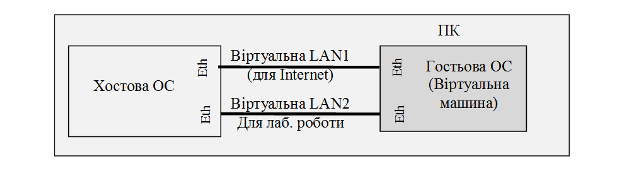

[<- До підрозділу](README.md)

# Основи Ethernet та IP

**Тривалість**: 3 акад. години.

**Мета:** Познайомитись з протоколами Ethernet та отримати навики налаштування та тестування комунікацій в ОС Windows. 

## Лабораторна установка для проведення лабораторної роботи у віртуальному середовищі.

**Апаратне забезпечення, матеріали та інструменти для проведення віртуальної лабораторної роботи.** 

Усі досліди проводяться на комп’ютері (ПК) на якому встановлена віртуальна машина. Передбачається, що хостова ОС є однією з версій починаючи з Winodws XP. Інші хостові ОС також можуть бути використані, але опис роботи з ними не розглядаються в даній лабораторній роботі. 

Між хостовою та гостьовою ОС до існуючої віртуальної мережі (для Internet) створюється ще одна, яка буде використовуватися в дослідах.



Рис.1.20. Функціональна схема лабораторної установки

**Програмне забезпечення, що використане у віртуальній лабораторній роботі.** 

1. Сніфер Wireshark (http://www.wireshark.org/)
2. Вбудовані утиліти Winodws XP.

## Загальна постановка задачі

Цілі роботи: 

- налаштувати віртуальну локальну мережу між хостовою та гостьовою ОС для проведення наступних лабораторних робіт
- встановити сніфер Wireshark та отримати навички роботи з ним
- проаналізувати структуру кадрів Ethernet та ARP-пакетів

## Послідовність виконання роботи

### 1. Встановлення віртуальної машини

- [ ] Якщо у Вас ще не встановлена віртуальна машина на Windows XP або Windows 7, виконайте практичне завдання щоб поставити віртуальну машину одним з варіантів що вказані [за посиланням](../../vm/vbox/lab.md).  Якщо вже є існуюча віртуальна машина, можете виконувати з нею.

- [ ] Встановіть на віртуальній машині браузер Firefox, якщо він ще не встановлений, як це описано в [цьому практичному завданні](../../vm/vbox/lab.md).  

### 2. Добавлення мережного адаптеру

Віртуальна машина може мати декілька віртуальних мережних адаптерів з різними варіантами реалізації з’єднань. За замовченням на віртуальній машині створений один мережний адаптер. Налаштування цього мережного адаптеру показане на рис.1.21. У налаштуванні «Під’єднаний до» стоїть властивість NAT, яка вказує на те, що адаптер буде використовувати під’єднання Інтернет хостової операційної системи (механізм NAT-трансляції розглядається в наступній темі). 


Рис.1.21.  

У віртуальній машині відповідно до цього налаштування створюється один мережний адаптер, через який відбувається з’єднання з Інтернет. Це з’єднання автоматично отримує всі необхідні налаштування. 

У лабораторній роботі необхідно добавити ще один адаптер, який буде реалізовувати внутрішню віртуальну мережу між хостовою ОС та віртуальною машиною. Для цього необхідно зробити налаштування, відповідно до рис.1.22. Після чергового завантаження віртуальної машини у гостьовій ОС буде два мережні адаптери: 

- `Local Area Connection` - для Адаптеру 1
- `Local Area Connection 2` - для Адаптеру 2

Слід звертати увагу на назву адаптеру, так як вона вказує на конкретне підключення. 

- [ ] Якщо віртуальна машина увімкнена, вимкніть її.
- [ ] У налаштуванні віртуальної машини Virtual Box сконфігуруйте другий мережевий адаптер для віртуальної машини з властивістю `Під’єднаний до` - `Лише головний адаптер` для створення ще однієї віртуальної мережі між гостьовою та хостовою ОС, яка буде використовуватися в дослідах (рис.1.22). 

Для адаптеру, за необхідності можна вибрати тип та налаштувати різні режими. У лабораторній роботі всі інші налаштування, що показані на рис.1.22 необхідно залишити без змін.


Рис.1.22. 

### 3. Налаштування адаптерів

- [ ] Запустіть віртуальну машину.

- [ ] У Virtual Box перейдіть у налаштування `Адаптер 2` і вимкніть опцію `Cable Connected`, після чого натисніть `Ok` (рис.1.22а).

- [ ] Подивіться яка саме мережна карта стала відключеною у віртуальній машині (рис.1.22a), саме вона відповідає за підключення через Адаптер 2.   


Рис.1.22а. 

- [ ] На гостьовій ОС перейменуйте назву новоствореного адаптеру (наприклад `Local Area Connection 2`) відповідно до назви вашого логіну (формується з прізвища та імені по типу `FistnameLastname`): `NET вашлогін` 

- [ ] У Virtual Box перейдіть у налаштування `Адаптер 2` і поверніть назад опцію `Cable Connected`, після чого натисніть `Ok`. Проконтролюйте, що на віртуальній машині стан підключення повернувся.

- [ ] Користуючись відомостями з додатку 1.1 налаштуйте драйвери TCP/IP адаптерів в гостьовій (на віртуальній машині) та хостовій ОС наступним чином:

  -  IP адаптера з назвою `VirtualBox Host-Only Network` хостової ОС:`192.168.x.1/24` (рис.1.22б)


    -  IP адаптера з назвою `NET вашлогін` гостьової ОС (віртуальної машини):`192.168.x.2/24` (рис.1.22в)


Де `x` – номер варіанту (по списку). 

> **Зверніть увагу для якого самого адаптеру в гостьовій машині Ви змінюєте налаштування, адже там два адаптери - перший для NAT (вихід до мереж гостьової машини - у випадку прикладу вище адаптер має назву `Local Area Connection`), а другий - для віртуальної мережі, саме його і треба налаштовувати.**  

**Надалі в лабораторній роботі всі дії на гостьовій ОС будуть проводитися саме з цим мережним адаптером!**


Рис.1.22б.

 

Рис.1.22в.

### 4. Визначення MAC-адрес утилітою Getmac 

- [ ] На віртуальній машині запустіть консольну утиліту ***cmd*** (`Start -> Run` наберіть `cmd`). Налаштуйте властивості консольного вікна через контекстне меню утиліти так, щоб ширина розміру вікна була 120 символів. 

- [ ] На віртуальній машині через консольне вікно запустіть утиліту ***Getmac*** (див. додаток Д1.3.4, та використайте її для перегляду MAC-адрес доступних мережних інтерфейсів. Зробіть копію екрану, та занесіть значення MAC-адрес в таблицю. Повторіть те саме для хостової ОС.

- [ ] Заповніть таблицю з МАС-адресами мережних плат для новоствореної віртуальної мережі.

### 5. Тест наявності підключення 

- [ ] За допомогою утиліти ***ping*** зробіть тест наявності підключення:

- адаптера хостової ОС з гостьової

- адаптера гостьової ОС з хостової

Зробіть копії екранів для звіту. Проаналізуйте результати тестування. За відсутності з’єднання повторіть п.2. 

### 6. Завантаження, інсталяція та налаштування сніферу

- [ ] Завантажте та встановіть на віртуальну машину сніфер Wireshark. Ресурс для завантаження описано в додатку Д1.2.2. 

- [ ] Запустіть на виконання сніфер WireShark. Через меню Edit/Preferences/Columns добавте необхідні поля, що показані на рис.1.23, якщо вони відсутні, а всі інші видаліть.


Рис.1.23.

### 7. Робота з кешем ARP

- [ ] Ознайомтесь з додатком Д.1.3.3. Видаліть всі записи з кешу ARP віртуальної машини. Виведіть таблицю записів таблиці ARP і перевірте чи є там записи. 

- [ ] Потім запустіть утиліту ping для тесту з’єднання з мережною картою хостової ОС. Виведіть таблицю записів таблиці ARP. Зробіть копію екрану і поясніть отримані результати (усі поля таблиці ARP). 

### 8. Запуск прослуховування мережі сніфером Wireshark 

- [ ] Налаштуйте інтерфейс Wireshark на мережну карту та запустіть захоплення пакетів. 

- [ ] Очистіть ARP кеш та перевірте чи він порожній. 

- [ ] Запустіть утиліту ping для тесту з’єднання адаптера хостової ОС з гостьовою. Після закінчення тесту зупиніть захоплення пакетів. 

- [ ] Зробіть фільтрацію пакетів по протоколу ARP, тобто щоб відображалися тільки кадри з arp-пакетами. Зробіть копію екрану, та поясніть отримані результати. 

### 9. Аналіз пакету

- [ ] Використовуючи вікно деталізації пакету визначте структуру та призначення пакетів в кадрі, які містять ARP (2 шт). Зокрема для кожного кадру та кожного пакету в ньому згідно ієрархії вкладеності визначити:
- протокол
- поля та їх призначення  

### 10. Аналіз gratuitous ARP

- [ ] На хостовій ОС вимкніть мережний адаптер «VirtualBox Host-Only Ethernet Adapter». На гостьовій ОС (віртуальній машині) запустіть на виконання Wireshark. Включіть захоплення пакетів з мережі. Після цього включіть на хостовій ОС попередньо вимкнений мережний адаптер. Коли індикатор мережі покаже, що вона працює (порядку декілька секунд) зупиніть на гостьовій машині захоплення пакетів.
- [ ] Використовуючи фільтри та вікно деталізації пакету визначте структуру та призначення пакетів в кадрі, які містять ARP (3 шт). Зокрема для кожного кадру та кожного пакету в ньому згідно ієрархії вкладеності визначити:
- протокол
- поля та їх призначення

## Додаток 1.1. Налаштування адаптерів Ethernet на Winodws XP та Windows 7

### Д.1.1.1. Налаштування адаптерів Windows XP (для гостьової ОС)

Для налаштування адаптерів в гостьовій ОС, тобто віртуальної машини, необхідно зайти в меню `Start->Control Panel` , перейти в `Switch to Classic View` далі вибрати  `Network Connection` (рис.Д1.1) 


Рис.Д1.1.

У списку адаптерів видно їх стан, а також можна змінити їх налаштування. Необхідні операції вибираються через контекстне меню. На рис.Д1.2 показано як можна перейменувати підключення через мережний адаптер. Для налаштування адаптерів в контекстному меню вибирається команда `Properties`, для вимкнення адаптеру – `Disable`, для перегляду стану – `Status`. 


Рис.Д1.2.

Серед налаштувань адаптеру можна вказати необхідні параметри для драйверів та служб. Наприклад, для налаштування драйверу TCP/IP, той вибирається зі списку і натискається кнопка `Properties` (рис.Д1.3). Додатково до основних налаштувань можна вибрати додаткові через кнопку `Advanced`. 
 

Рис.Д1.3. 

### Д.1.1.2. Налаштування адаптерів у Windows10

У лабораторній роботі також необхідно налаштовувати адаптери на хостовій ОС, яка є новішою версію Windows або іншою ОС. 

Налаштування адаптерів для новіших версій Windows проводиться авторизувавшись з правами Адміністратора. До вікна налаштування можна зайти різними способами, ось деякі з них:

- в меню `Пуск-> Налаштування -> Мережа і Інтернет -> Змінити настройки адаптера`
- в Провіднику в контекстному меню `Мережа` вибрати `Властиовості` після чого у вікні вибрати `Змінити налаштування адаптера` (рис.Д1.4)


Рис.Д1.4. 

У вікні мереж вибрати властивості необхідного адаптеру через контекстне меню.


Рис.Д1.6. 

Налаштування адаптерів у інших ОС виходить за рамки даної лабораторної роботи, необхідно попередньо ознайомтеся з довідниковою інформацією.  

## Додаток 1.2. Встановлення і робота з Wireshark

### Д.1.2.1. Загальні відомості про сніфери та Wireshark 

***Sniffer*** (від англ. to sniff – нюхати) – це мережний аналізатор трафіку, програма або програмно-апаратний пристрій, призначений для перехвату та наступного аналізу, або тільки аналізу мережного трафіку, призначеного для інших вузлів. Перехват трафіку може відбуватися:

-     звичайним "прослуховуванням" мережного інтерфейсу; метод ефективний при ивикористанні в сегменті концентраторів (hub) замість комутаторів (switch), в іншому випадку метод малоефективний, оскільки на сніфер попадають лише окремі кадри, які призначені приймаючому вузлу;

-     підключенням сніферу в розрив каналу; 

-     відгалуженням (програмним чи апаратним) трафіку і направленням його копії на сніфер;

-     через аналіз побічних електромагнітних випромінювань та відновленням таким чином трафіку, що прослуховується;

-     через атаку на канальному рівні (2-му) або мережному рівні (3-му), яка приводить до перенаправлення трафіку жертви або всього трафіку сегменту на сніфер з наступним поверненням трафіку на потрібну адресу .

Сніфери застосовуються як в благих, так і деструктивних цілях. Аналіз трафіку, що проходить через сніфер, дозволяє:

-     відслідковувати мережну активність додатків;

-     відлагоджувати протоколи мережних додатків;

-     локалізувати несправність або помилку конфігурації;

-     знаходити паразитний, вірусний та закільцьований трафік, наявність котрого збільшує навантаження мережного обладнання та каналів зв’язку;

-     виявити в мережі шкідливе ПО, наприклад, мережні сканери, флудери, троянські програми, клієнти пірингових мереж та інші; 

-     перехватити любий незашифрований (а інколи і зашифрований) трафік користувача з ціллю дізнавання паролів та іншої інформації

Поступово із інструментів, призначених тільки для діагностики, сніфери перетворилися в засоби для дослідження та навчання. Наприклад, вони постійно використовуються для вивчення динаміки і взаємодії в мережах. Зокрема, вони дозволяють легко та наглядно вивчати тонкощі мережних протоколів. Спостерігаючи за даними, які відправляє протокол, можна глибше зрозуміти його функціонування на практиці, а заодно побачити, коли деяка конкретна реалізація робить не у відповідності зі специфікацією. На сьогоднішній момент існує достатня кількість хороших реалізацій сніферів. Деякі з них:   

-     Tcpdump (http://www.tcpdump.org/) – консольний варіант сніферу. Працює на найбільш поширених на сьогоднішній день ОС;

-     Wireshark (http://www.wireshark.org/) до недавнього часу був відомий під іменем Ethreal;

-     WinDump http://www.winpcap.org/windump;

Програма **Wireshark** являеться однією з самих зручних реалізацій сніферів, яка доступна для багатьох ОС і поширюється безкоштовно. 

Сніфери використовують бібліотеку в режимі "захоплення" пакетів, тобто може отримувати копію всіх даних що проходить через драйвер мережного інтерфейсу. Зміни в самі дані не вносяться. Якщо локальний трафік не проходить через драйвер мережного пристрою (див. рис.Д1.7), то він не буде видимий сніфером. Але якщо використати спеціальний віртуальний трафік loopback, то можна відслідковувати обмін через poopback інтерфейс (127.0.0.1).


рис.Д1.7.

Wireshark дозволяє в режимі реального часу захватувати пакети з мережі, та аналізувати їх структуру. Також можна аналізувати структуру пакетів з файлу, який вміщує трафік, отриманий, наприклад програмою «tcpdump» (unix/linux).

### Д.1.2.2. Завантаження та інсталяція Wireshark 

Завантажити Wireshark можна з офіційної сторінки https://www.wireshark.org/#download . Слід звернути увагу що для різних версій ОС використовуються різні дистрибутиви:

- для 32-бітного Winodws 7 https://1.na.dl.wireshark.org/win32/Wireshark-win32-2.0.1.exe  

- для 64-бітних Windows https://1.na.dl.wireshark.org/win64/Wireshark-win64-2.0.1.exe

- для Windows XP (для гостьової ОС віртуальної машини) треба завантажувати стару портативну версію Wireshark (1.12) https://1.na.dl.wireshark.org/win32/all-versions/WiresharkPortable-1.12.9.paf.exe після чого розпакувати її в необхідну папку

При встановленні Wireshark на віртуальній машині з Windows XP, необхідно створити папку на диску `C` наприклад з назвою `Install`, куди перенести дистрибутив. Саме з цієї папки запускати дистрибутив. При встановленні Wireshark всі опції залишити за замовченням.

Слід звернути увагу, що після закриття портативної версії WireShark система запропонує деінсталювати WinPcap. У цьому немає потреби, тому для лабораторної робити треба відмовитися від деінсталяції бібліотеки. 

### Д.1.2.3. Робота з утилітою

На рис. Д.1.9 зображене основне вікно програми Wireshark. У стандартному режимі вікно сніферу ділиться на 3 панелі: панель списку захоплених пакетів (packet lists), панель деталізації пакету (packet details), панель побайтового відображення пакетів (packet bytes). 


Рис.Д1.9. Основне вікно сніферу Wireshark. 

**Панель списку пакетів** вміщує всі пакети, які захоплені з мережі, попередньо відфільтровані через умову фільтру (Filter). Список можна відсортувати по будь-якому полю (в прямому або зворотному порядку) – для цього треба натиснути по заголовку відповідного поля. Кожний рядок вміщує наступні поля (по замовченню) 

-     порядковий номер пакету (No.);

-     час надходження пакету (Time);

-     джерело пакету (Source);

-     пункт призначення (Destination);

-     протокол (Protocol);

-     інформаційне поле (Info). 

Список полів які будуть відображатися в панелі списку як колонки налаштовується в Edit/Perferencis/Columns (рис.Д1.10). Для того, щоб зміни вступили в силу, після добавлення колонок треба натиснути “Apply”. 

**Панель деталізації пакетів** показує ієрархічну протокольну структуру вибраного в панелі списку пакету. Тобто вказується вкладеність PDU (пакетів) один в одного, згідно відомих Wireshark протоколів. При виділенні PDU, його вміст в байтах показується на панелі побайтового відображення. При розкриванні PDU (+), виводиться детальний аналіз його полів. Так, наприклад, на рис.Д1.9 видно, що в кадр EthernetII вкладений пакет IPv4, в який в свою чергу вкладений пакет ICMP (Internet Control Message Protocol). Для виділених пакетів видно поля та їх значення, які розділені через двокрапку. Так, наприклад, на рис.Д.1.9 видно, що поле ICMP-пакету з назвою Type має значення 0, що вказує на тип «Echo (ping) reply». 


Рис.Д.1.10.

**На панелі побайтового відображення пакетів** для виділених пакетів показується його 16-кове та символьне представлення. 

### Д.1.2.4. Захоплення пакетів

Для початку захоплення пакетів необхідно задати параметри, зокрема, вказати мережний інтерфейс, з якого і буде відбуватися захват пакетів. Ця дія доступна через меню `Capture -> Interfaces...` (рис.Д1.11)., для більш детального налаштування -`Capture -> Options...` (рис.Д1.12). У полі `Interface:` вибирається доступний інтерфейс (наприклад мережний адаптер).

У якості додаткових параметрів захвату можна вказати:

-     *«Capture Filter»* – фільтр захвату. Тут можна добавляти той чи інший фільтр із існуючих, або вказати умови фільтрації.

-     *«Update list of packets in real time»* – оновлення списку захоплених пакетів в режимі реальног очасу.

-     *«Stop Capture»* – набір параметрів, які дозволяють задати те чи інше значення, при досягненні якого процес захвату закінчиться.

-     *«Name Resolution»* – набір параметрів вирішення імен дозволяє визначити які із способів вирішення імен повинні використовуватися.


Рис.Д1.11


Рис.Д1.12. Вибір інтерфейсів та параметрів захвату пакетів.

Для початку моніторинга мережної активності необхідно натиснути `Start`. Після вибору інтерфейсу, який цікавить, можна починати і закінчувати захват пакетів через команди в меню `Capture`.

### Д.1.2.5.Налаштування фільтрів

Якщо запустити сніфер без додаткових налаштувань, то він буде захоплювати всі пакети, які проходять через мережний інтерфейс. Найбільш часто користувача цікавлять тільки деякі пакети, які відповідають заданим критеріям. Для визначення цих критеріїв служать фільтри відображення та захоплення.

Існує два варіанти фільтрації пакетів: на етапі захоплення і на етапі відображення користувачу. У першому випадку ефективність роботи сніферу та споживані ним системні ресурси значно нижче, ніж у 2-му випадку.

При визначенні фільтру вказуються умови, яким повинні відповідати ті пакети, які повинні бути пропущені через фільтр. Назва полів та протоколів в фільтрі вводиться тільки маленькими літерами. Якщо текст фільтру має коректний зміст, поле фільтру підсвічується зеленим, якщо некоректний – червоним. Для задіяння фільтру необхідно його підтвердити кнопкою "Apply".

Фільтрацію можна проводити за протоколами або за значеннями полів в PDU (пакеті). Для застосування фільтрації за протоколом необхідно в поле вводу фільтра ввести назву протоколу. Наприклад фільтр за протоколом `arp` виводить тільки ARP-кадри (рис.Д1.13).


Рис.Д1.13. Приклад задавання фільтру через назву протоколу.

Для фільтрації за значенням поля в PDU, записується назва поля, оператор порівняння та значення з яким порівнюється це поле. Для формування тексту фільтру можна скористатися майстром побудови виразів фільтру, який викликається через кнопку "Expression...". Наприклад результат роботи майстра з рис.Д1.14 буде текстове значення фільтру  

`modbus_tcp.func_code == 3`

У таб. наводиться перелік найбільш вживаних для лабораторних робіт полів.

 Таб Д1.1 

| **Поле**      | **Опис**                                                     |
| ------------- | ------------------------------------------------------------ |
| eth.addr      | Фізична адреса джерела або отримувача в кадрі Ethernet       |
| eth.dst       | Фізична адреса отримувача в кадрі Ethernet                   |
| eth.src       | Фізична адреса джерела в кадрі Ethernet                      |
| eth.len       | Довжина кадру Ethernet                                       |
| ip.addr       | Мережна адреса джерела або отримувача в пакеті протоколу  IP |
| ip.dst        | Мережна адреса отримувача в пакеті протоколу IP              |
| ip.src        | Мережна адреса джерела в пакеті протоколу IP                 |
| ip.proto      | Позначення протоколу, який був інкапсульований в пакет IP    |
| tcp.ack       | Підтвердження (АСК) протоколу ТСР                            |
| tcp.port      | Порт джерела і отримувача в сегменті протоколу TCP           |
| tcp.dstport   | Порт отримувача в сегменті протоколу TCP                     |
| tcp.srcport   | Порт джерела в сегменті протоколу TCP                        |
| udp.port      | Порт джерела або отримувача в сегменті протоколу UDP         |
| udp.dstport   | Порт отримувача в сегменті протоколу UDP                     |
| udp.srcport   | Порт джерела в сегменті протоколу UDP                        |
| dns.qry.name  | Ім’я мережного ресурсу в DNS запиті                          |
| dns.resp.name | Ім’я мережного ресурсу в DNS відповіді                       |


Рис.Д1.14. Приклад задавання фільтру через поле протоколу.

Оператор порівняння може являти собою С-подібний оператор або символьне скорочення оператору, які наведені в таб.Д1

Таб.Д1.2

| символьне скорочення | C-like | Опис                 | Приклад            |
| -------------------- | ------ | -------------------- | ------------------ |
| eq                   | ==     | Рівне                | ip.src==10.0.0.5   |
| ne                   | !=     | Нерівне              | ip.src!=10.0.0.5   |
| gt                   | >      | Більше  ніж          | frame.len > 10     |
| lt                   | <      | Менше  ніж           | frame.len < 128    |
| ge                   | >=     | Більше  або дорівнює | frame.len >= 0x100 |
| le                   | <=     | Менше  або дорівнює  | frame.len <= 0x20  |

Значення поля типу беззнакового цілого можна вводити в різних системах числення: 10-кова, 8-кова (починається з 0), 16-кова (починається з 0x). Наприклад, наступні значення еквівалентні.

`ip.len le 1500`

`ip.len le 02734`

`ip.len le 0x436`

Для того щоб задати умову для булевого поля, достатньо вказати це поле. Наприклад, наступне значення фільтру пропустить тільки ті пакети, для яких прапорець SYN в сегменті TCP буде виставлений  

`tcp.flags.syn`

Байти або два байти адреси Ethernet можуть бути розділені розділювачами `:`, `-` або `.`. Наприклад:

`eth.dst == ff:ff:ff:ff:ff:ff`

`eth.dst == ff-ff-ff-ff-ff-ff`

`eth.dst == ffff.ffff.ffff`

Для означення в умові текстового поля, його значення береться в лапки. Наприклад: 

`http.request.uri == "http://www.wireshark.org/" `

При побудові фільтру можна комбінувати дві та більше умови, використовуючи логічні оператори. У якості умови може виконуватися як фільтрація за протоколами, так і фільтрація за значенням полів. 

Таб.Д1.3.

| символьне скорочення | C-like | Опис                         | Приклад                                 |
| -------------------- | ------ | ---------------------------- | --------------------------------------- |
| not                  | !      | заперечення                  | `not llc`                               |
| and                  | &&     | конкатенація (логічне «І»)   | `ip.src==10.0.0.5 and tcp.flags.fin`    |
| or                   | \|\|   | альтернатива (логічне «АБО») | `ip.scr==10.0.0.5 or ip.src==192.1.1.1` |

## Додаток 1.3. ВБУДОВАНІ ЗАСОБИ WINDOWS ДЛЯ КОНФІГУРУВАННЯ ТА ПЕРЕВІРКИ РОБОТИ МЕРЕЖІ

### Д.1.3.1. Загальний перелік утиліт, що використовуються в даній лабораторній роботі

***ping*** - перевіряє з’єднання на рівні протоколу IP з іншим пристроєм, який підтримує TCP/IP

***arp*** - виводить та змінює записи кешу ARP: таблиць відповідності IP-адрес і відповідних їм фізичних адрес (наприклад MAC в Ethernet)

***getmac*** – отримання апаратних адрес мережних адаптерів (MAC-адрес) як на локальному так і на віддаленому ПК.

### Д.1.3.2. Утиліта PING 

У даному пункті дані мінімальні функції, детальніше розглянутий в наступній лабораторній роботі. 

Дана утиліта перевіряє досяжність на рівні протоколу IP іншого пристрою, який підтримує протокол IP. Функціонування даного сервісу базується на протоколі ICMP (розглянутий в наступному розділі курсу). Утиліта відправляє ехо-запит, і після повернення ехо-відповіді виводить час очікування. 

Політики фільтрування пакетів для маршрутизаторів, брандмауерів та інших шлюзів безпеки можуть запобігати перенаправленню пакетів.     

Мінімальний синтаксис: 

`ping кінцевийВузол`

Де `кінцевийВузол` - задає IP-адресу або ім’я вузла-призначення

На рис.Д1.15 показаний приклад роботи утиліти Ping:

Вузол `192.168.1.1` відповідає на ехо-запити, а вузол `192.168.1.5` – ні. 

Слід зазначити, що не всі вузли мають відповідати на ехо-запити. Політика безпеки може передбачати ігнорування деяких повідомлень `ICMP`.


Рис.Д1.15.

Для отримання інформації про всі значення параметрів, наберіть команду:

```bash
ping /?
```

```
ping [-t] [-a] [-n кількість] [-l розмір] [-f] [-i TTL] [-v TOS] [-r кількість] [-s кількість] [[-j списокВузлів] | [-k списокВузлів]]  [-w таймаут] кінцевийВузол 
```

| Параметр        | Призначення параметру                                        |
| --------------- | ------------------------------------------------------------ |
| /?              | виводить довідку по використанню                             |
| -t              | Періодична відправка на вказану адресу до команди переривання. Для виводу статистики та продовження необхідно нажати `<Ctrl>+<Break>`, для закінчення `<Ctrl>+<C>`. |
| -a              | Визначення імені (DNS) по адресі вузлу. У випадку успішного виконання виводиться ім’я відповідного вузлу. |
| -n кількість    | Кількість запитів для відправлення. По замовченню дорівнює 4. |
| -l розмір       | Довжина (в байтах) поля даних увідправлених повідомленнях з ехо-запитом. По замовченню – 32байти. Максимальний розмір - 65527 |
| -f              | Виставляє в IP-заголовку пакету  відправки прапорець, який забороняє фрагментацію пакету. |
| -i TTL          | Задає значення поля TTL  (тривалість життя пакету) в IP-заголовку. По замовченню – 128, максимум - 255 |
| -v TOS          | Вказівка на тип служби (TOS  "Type Of Service") в IP-заголовку. Задається від 0 до 255. По  замовченню дорівнює 0. |
| -r кількість    | Задає значення запису  шляху (Record Route) в IP-заголовку – максимальна  кількість переходів між джерелом та місцем призначення (від 1 до 9). |
| -s кількість    | Вказує на штамп часу для кожного  переходу (Internet Timestamp) в IP-заголовку. Від 1 до 4. |
| -j списокВузлів | Вказується набір IP-адрес або  імен (розділених пробілами) проміжних вузлів-маршрутизаторів, через які  повинні йти ехо-запити. Вказується до 9-ти вузлів |
| -k списокВузлів | Вказує необхідність строгої  маршрутизації в IP-заголовку та перелік вузлів, через які повинен проходити ехо-запит. На відміну від попереднього  параметру, при строгій маршрутизації наступна проміжна точка призначення  повинна бути досяжна напряму (вона повинна бути сусідньою в інтерфейсі  маршрутизатору). Вказується до 9-ти вузлів. |
| -w таймаут      | Визначає час очікування  повідомлення з ехо-відповіддю. Якщо час виходить, то видається  повідомлення про помилку "Request timed out". По замовченню дорівнює  4000 (4 секунди) |
| кінцевийВузол   | задає IP-адресу або ім’я  вузла-призначення                  |

Деякі вузли не реагують на ехо-запити PING. Наприклад замовченням вони часто відключені у Windows.  Для активації їх в Winidows необхідно активувати цю опцію в налаштуваннях брандмауера. 

Для налаштування протоколу ICMP у Windows XP в мережній карті треба перейти на вікно `Advanced`  та налаштувати все як показано на Рис.Д1.16.

 

 Рис.Д1.16. Увімкнення реагування на запит відлуння у Windows XP

Для налаштування брандмауера у Windows 10 треба зайти у вікно брандмауера (Рис.Д1.17) 


 Рис.Д1.17. Увімкнення реагування на запит відлуння у Windows 10

### Д.1.3.3. Утиліта ARP

Служить для виводу та змін записів кешу реалізації протоколу ARP. Кеш вміщує одну або декілька таблиць, які використовуються для збереження IP-адрес і відповідних їм фізичних адрес (наприклад MAC в Ethernet). Для кожного мережного адаптеру (наприклад Ethernet), встановленого в ПК, використовується окрема таблиця. 

Синтаксис:

**arp** *[-a [інет_адреса] [-N іф_адреса]]* 

**arp** *[-g [інет_адреса] [-N іф_адреса]]* 

**arp** *[-d інет_адреса [іф_адреса]]* 

**arp** *[-s інет_адреса еth_адреса [іф_адреса]]*

| Параметр                                 | Призначення параметру                                        |
| ---------------------------------------- | ------------------------------------------------------------ |
| */?*                                     | виводить довідку по використанню                             |
| *-a [інет_адреса] [-N іф_адреса]*        | Виведення таблиць плинного протоколу ARP для всіх  інтерфейсів.  Щоб вивести записи   ARP для певної IP-адреси:   *arp -a інет_адреса*, де *інет_адреса* — це IP-адреса.   Щоб вивести записи   ARP для певного інтерфейсу:   *arp -a -N іф_адреса*,  де *іф_адреса* — це IP-адреса, призначена інтерфейсу. |
| *-g [інет_адреса] [-N іф_адреса]*        | Співпадає з -a.                                              |
| *-d інет_адреса [іф_адреса]*             | Видалення запису з певною  IP-адресою, де *інет_адреса* – це  IP-адреса  Видалення запису для  конкретного інтерфейсу:   *arp -d іф_адреса,*  де *іф_адреса* — це IP-адреса, призначена інтерфейсу.  Щоб видалити всі записи,  замість *інет_адреса* пишеться  зірочка (*). |
| *-s інет_адреса еth_адреса  [іф_адреса]* | Добавлення статичного запису в  ARP кеш , який зіставляє IP-адресу *інет_адреса* фізичній адресі *еth_адреса*. |

Фізична адреса *еth_адреса* складається з 6 байт, записаних в 16-ковому форматі та розділених дефісами (наприклад 00-AA-00-4F-2A-9C). Записи, добавлені з параметром **-s**, являються статичними і не видаляються з кешу ARP після закінчення періоду часу. Записи видаляються, при повторному завантаженні реалізації протоколу TCP/IP. Щоб створити постійні статичні записи кешу ARP, треба записати послідовність команд *arp* в командний файл і запускати його при старті ПК.

Приклади:

Виведення таблиці кешу ARP для всіх інтерфейсів (рис.Д1.18):

```
arp –a
```


Рис.Д1.18

Виведення таблиці кешу ARP для інтерфейсу, якому призначена IP-адреса 10.0.2.15:

```
arp -a -N 10.0.2.15
```

Добавлення статичного запису кешу ARP, який зіставляє IP-адресу 10.0.0.80 з фізичною адресою `00-AA-00-4F-2A-9C`:

```
arp -s 10.0.0.80 00-AA-00-4F-2A-9C
```

### Д.1.3.4. Утиліта GETMAC

Утиліта повертає апаратну МАС адресу та перелік мережних протоколів, пов’язаних з кожною адресою для всіх мережних плат у будь-якому комп’ютері – як локальному так і доступному по мережі (через мережі Windows).

```
getmac /? - виводить довідку по використанню
```

На рис.Д1.19 показаний приклад використання утиліти getmac. 

```
getmac /FO list /V
```


Рис.Д1.19

Практичне заняття розробив [Олександр Пупена](https://github.com/pupenasan). 
