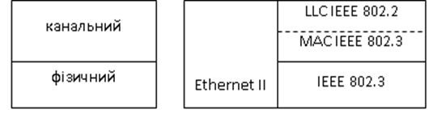
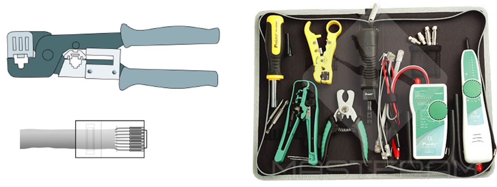
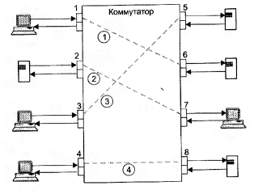

[<- До підрозділу](README.md)

# Основи Ethernet

## 1. Загальні поняття

Мережі забезпечують зв'язком між собою пристрої, на яких виконуються різноманітні програми та служби, які послуговуються цими мережами. Для такої взаємодії необхідно вирішувати багато завдань, ось деякі з них:

1. як об'єднати мережні пристрої між собою та забезпечити обмін цифровим сигналом між ними
2. як забезпечити доставку даних саме тому пристрою, якому вони призначені
3. як перевірити що дані прийшли без спотворення сигналу
4. як забезпечити щоб дані передавалися між об'єднаними мережами і курсували за місцем признчення
5. як забезпечити доставку даних саме тій програмі на пристрої, для якої вони призначені
6. як забезпечити безпечний обмін даними
7. як забезпечити однакове розуміння даних та порядок взаємодії    

Для вирішення навіть наведених вище завдань як правило використовують набори апаратних рішень та відповідних інтерфейсів, протоколів та реалізацією їх в різноманітних службах. Щоб було простіше керувати цим, уніфікувати та комбінувати кілька рішень, ці задачі вирішують на різних рівнях "віддаленості" від фізичного середовища передачі (кабель, бездротовий зв'язок) у бік програм. Так наприклад, задачі кодування та передачі бітів напругою вирішуються на **фізичному рівні**. Уніфікація правил передачі цих бітів на фізичному рівні дає можливість з'єднувати між собою фізичні інтерфейси пристроїв, які дотримуються цих правил. Так само, єдині правила формування послідовності бітів у вигляді **кадрів (frame)** і їх інтерпретування, дає можливість доставляти дані до того пристрою, якому вони призначені. Взагалі правила в мережах прийнято називати **протоколами**, тому правила обміну кадрами - це протоколи **рівня передачі даних**, який також називають **канальним рівнем**. Таким чином, якщо на фізичному рівні пристрої будуть мати той самий інтерфейс і будуть об'єднані між собою з підтримкою всіх вимог, а також будуть використовувати ті самі протоколи канального рівня, то можна вирішити принаймні перші три наведених вище завдання. Мережі Ethernet якраз і забезпечують це.         

**Ethernet** – це сімейство стандартизованих технологій пакетної передачі даних для комп'ютерних мереж, які з'явилися ще в 1970-х роках і з великими змінами використовуються і сьогодні. Ethernet у багатьох асоціюється просто з мережею на витій парі. Технологія і перші стандарти Ethernet були розроблені компанією Xerox Corporation. Пізніше група компаній DEC, Intel і Xerox сумісно розробили стандарт під назвою DIX, який відомий як Ethernet ІІ. Ще через деякий час подібний стандарт був розроблений інститутом IEEE (Інститут інженерів з електротехніки і радіоелектроніки), який є законодавцем в області стандартів на локальні комп’ютерні мережі. Цей стандарт називається IEEE 802.3 і має деякі відмінності у формуванні кадру порівняно з форматом Ethernet ІІ. На сьогоднішній день мережними картами Ethernet як правило підтримуються обидва стандарти. 

Колись Ethernet використовував спільне середовище обміну, що потребувало означення порядку доступу пристроїв до нього. Наразі використовується комутований Ethernet, в якому зв'язок між пристроями в мережі забезпечує комутатор, який переключає свої канали між собою, за адресою призначення. Для того щоб кадри доходили за місцем призначення, кожна мережна карта має свою 6-байтну MAC-адресу, яка використовується для фільтрації "потрібних вхідних кадрів".  Архітектура Ethernet показана на рис.1, як вже було зазначено є дві версії, які означені кількома протоколами. 

 

Рис.1. Стандарти нижніх рівнів мереж Ethernet

## 2. Фізичний рівень 

На фізичному рівні Ethernet дозволяє використовувати різноманітні середовища передачі даних для кожної з яких є стандартна назва виду XBaseY, де X - бітова швидкість в Мбіт/с (10,100,1000...), Base – ключове слово (позначає немодульовану передачу), Y – умовне позначення середовища передачі і дальності зв’язку. У перших версіях використовувався коаксіальний кабель та шинна топологія, однак в сучасних реалізаціях Ethernet використовується кабель типу "вита пара" або оптоволоконний і топологія типу "зірка", коли кілька пристроїв об'єднуються між собою спеціальним пристроєм, інколи використовується з’єднання типу точка-точка. У центрі зірки може бути концентратор (хаб – hub, наразі практично не використовується) або комутатор (switch). В табл.1 показані стандарти мереж Ethernet на фізичному рівні.

Таблиця 1 Стандарти мережі Ethernet

При використання витої пари пристрої підключають через роз’єми типу RJ-45. На пристроях використовують вилки, а на кабелях – розетки. Призначення контактів роз’єму мережного адаптеру (порт типу MDI) показане в табл. 2. 

Рис.2. Призначення контактів роз’єму RJ-45.

Рис.3 Зовнішній вигляд зачищеного "хвоста" кабелю. 

Для створення з'єднання необхідної довжини відрізають кабель необхідної довжини і обжимають його з двох боків роз'ємами з використанням спеціальних інструментів, або замовляють обжатий кабель певної довжини. Після обжимання необхідно перевірити якість з використанням спеціальних інструментів (рис.4).   

рис.4. Інструмент для обжимання кабелю (ліворуч) та набір різноманітних інструментів для обжимання та тестування.

Для розуміння правил підключення розглянемо схему на базі 10BaseT, в якій показано порти пристроїв з точки зору приймачів та передавачів (на рис.5 показані трикутниками). Передавачі  - це перетворювачі, які за появи логічного сигналу з пристрою формують на його виході відповідний рівень сигналу за напругою, який можна передати на більшу відстань (100 м). Приймачі - навпаки, за появою фізичного сигналу на вході пристрою, видають на його плату логічної обробки логічний сигнал. У цьому типі мережі використовується тільки дві пари провідників які з'єднують між собою передавач одного пристрою та приймач іншого та навпаки. Кожен передавач підключається двома проводами до приймача іншого пристрою. Тому, якщо два пристрої підключаються безпосередньо (без комутатора та концентратора) їх треба з'єднувати навхрест.    

рис.5. Спрощена схема безпосереднього з'єднання портів пристроїв в Ethernet 10BaseT. 

Порти старих концентраторів або комутаторів мають тип MDIX, в яких сигнали Rx та Tx поміняні місцями.

рис.5.а. Спрощена схема з'єднання портів пристроїв в Ethernet 10BaseT через комутатори або коцентратори. 

Таким чином, при підключені пристрою з MDI (мережна карта) до MDIX (концентратор/комутатор) використовується "прямий кабель" (рис.6.а), а при безпосередньому підключенні двох MDI – "перехресний кабель" (рис.6б).

 Рис.6. Схеми підключень пристроїв мережі Ethernet

Схема "прямого" та "перехресного" кабелю показана на рис.7 (a – пряме, б – перехресне).  

Рис.7. Схема "прямого" та "перехресного" кабелю 

При 4-х провідному підключенні (в Ethernet 10BaseT, 100BaseTX ) дві інші пари можуть не використовуватися. Є мережі які використовують їх для інших цілей. Наприклад PoE (Power over Ethernet) використовує їх для передачі живлення.  

Для Fast Ethernet 100BaseTX також використовується 4-х провідне підключення (див. таблицю з рис.2). А от в 100BaseT4, замість 2-х пар використовуються 4-ри пари проводів, де дві пари можуть працювати або в один або в другий бік (передачі або приймання) в залежності від навантаження, тому вони маркуються як `BI`.  У Ethernet 1000BaseT по кожній парі може відбуватися приймання і передача сигналу одночасно, забезпечуючи швидкість передачі 1 Гбіт/с (рис.8).

Рис.8. Схема з'єднання портів пристроїв в Ethernet 1000BaseT.

У будь якому випадку максимальна довжина кабелів між пристроями не може перевищувати 100 м.

## 3. Концентратори та комутатори 

У найпростішій схемі мережі 10BaseT центральний елемент зірки представляє собою активний елемент, який називається концентратором (**hub**, хаб). Кожна станція з’єднується з ним двома витими парами – для прийому і для передачі. Враховуючи що канали мають пару передавача і приймача, через яких ведеться підключення до високошвидкісної внутрішньої шини (а не напряму), він також має функції повторювача, що дозволяє збільшити відстань між вузлами до 200 м. Хоч фізично така схема представляє собою зірку, логічно вона є шиною, адже передача кожної станції приймається усіма іншими станціями. Такий обмін можливий тільки за використання напівдуплексного обміну, коли тільки один пристрій в мережі веде передачу свого кадру, а інші в цей час тільки отримують ці дані. Випадковий доступ пристроїв до передачі своїх кадрів в Ethernet також може призводити до колізій при одночасній передачі. Для вирішення колізій в Etehrnet на базі концентраторів використовується спеціальний метод CSMA/CD, який передбачає короткочасні конфлікти (колізії) та їх вирішення випадковим чином.

Рис.9. Підключення через концентратор. 

Концентратори можуть об’єднуватись в ієрархічну структуру із головного та проміжних хабів. Концентратори в комп’ютерних мережах на базі Ethernet практично вже не використовуються, замість них використовують комутатори.

Комутатори 2-го рівня (layer 2 **switch**), або просто "**комутатори**" працюють по іншому принципу. Кадр, який приходить на комутатор по одному порту, направляється тільки в той порт до якого підключений вузол-приймач (рис.410). Тобто комутатори 2-го рівня аналізують кадр, та по МАС-адресі приймача визначають куди необхідно його направити. Відбувається комутація між портами, тобто створюється канал, який не заважає створювати такі самі канали між іншими портами. Це в свою чергу виключає можливість колізії, тому немає необхідності в використанні алгоритму CSMA/CD. Поява таких комутаторів дала можливість працювати в дуплексному режимі (одночасної передачі та прийому між пристроями), що значно збільшило ефективність роботи Ethernet. В дуплексному режимі використовується такий же формат кадру МАС-стандарту.

Рис.10. Підключення через комутатор. 

Таким чином Ethernet на базі концентраторів організований через напівдуплексний зв'язок, а на базі комутаторів - дуплексний.

За способом передачі кадрів комутатори діляться на:

-  store-and-forward (з проміжним збереженням)– комутатор отримує з вхідного каналу весь кадр, аналізує його на наявність помилок і у випадку їх відсутності відправляє кадр на вихідний канал отримувача;

-  cut-through (наскрізний) – комутатор починає відправляти дані у вихідний порт призначення відразу, як тільки визначить МАС адресу отримувача, тобто без очікування кінця передачі та аналізу цілісності отриманого кадру; 

Вибір того, чи іншого комутатора залежить від протоколів верхніх рівнів, що базуються на Ethernet. Перший тип комутаторів працює більш повільно, однак відкидає пошкоджені кадри вже в момент їх отримання. 

Сучасні комутатори 2-го рівня можуть надавати ряд додаткових сервісів. Наприклад це комутатори з підтримкою технології VLAN, виділення пріоритетних портів, додаткова MAC фільтрація, IGMP snooping (потребує додаткової обробки на мережному рівні). Такий тип комутаторів потребує конфігурування, тому отримали назву **керованих комутаторів** (**managed switches**). Для конфігурування та керування керованими комутаторами можуть надаватися різні типи сервісів, наприклад WEB, SNMP. Тож комутатори діляться на некеровані (unmanaged), що не потребують конфігурування, та керовані (managed) логіка роботи яких залежить від конфігурування. 

Пристрої з Ethernet підтримують сумісність зі старими стандартами. Тобто, наприклад пристрій з 1Гбітним Ethernet може з'єднуватися з пристроєм, що підтримує 100BaseT4. Крім того вони можуть працювати як в дуплексному так і в напівдуплексному режимі.  На сьогоднішній день більшість телекомунікаційних пристроїв підтримують технологію **Auto-negotiation** (авто-переговори), що дозволяє автоматично налаштувати оптимальний зв’язок між пристроями. В момент ініціалізації зв’язку (при включенні або підключенні пристрою в мережі), по спеціальному протоколу пристрої домовляються про швидкість передачі та тип з’єднання (дуплекс/напівдуплекс). Авто-переговори дають можливість відмовитись від ручного налаштування мережних карт. Однак слід зазначити, що для використання технології авто-переговорів, карти пристроїв які зв’язуються, повинні її підтримувати, інакше можлива втрата кадрів або взагалі відсутність обміну.

Повсякмісне використання Ethernet в офісних будівлях, призвело до необхідності організації робочих місць розетками для підключення комп’ютерів до мережі. Таким чином при проектуванні виникала потреба в правильному плануванні кабельної системи будівлі, що включала в себе всі телекомунікаційні ланцюги (комп’ютерна мережа, телефон, аудіо, відео тощо). В результаті сумісної роботи комітетів ISO та IEC виник стандарт ISO/IEC 11801 на організацію універсальних структурованих кабельних системи (СКС) в офісних приміщеннях. 

## 4. Адресація вузлів

Для адресації вузлів в мережі використовується 6-байтові **МАС**-адреси. Адреса як правило записується в 16-ковому форматі: наприклад `EC-F4-BB-83-B0-4E` або `EC:F4:BB:83:B0:4E`. Кожний мережний адаптер повинен мати прошиту в неї виробником унікальну МАС-адресу.

Для відправки можна використовувати адресацію окремого вузла (індивідуальну), усіх вузлів (широкомовну), декількох вузлів (групову). Широкомовна адреса `FF-FF-FF-FF-FF-FF`.  

Мережні карти можуть працювати в режимі нерозбірливого захвату (promiscuous mode), тобто не відфільтровувати кадри по адресі МАС.  

Унікальність адреси МАС досягається комбінацією: "адреса" виробника карти + номер карти (рис.11). Перші 3 байти виділені виробнику обладнання, видаються кординуючим комітетом IEEE, наприклад:

- `00:80:F4` -  Telemecanique,  
- `EC:F4:BB` – Dell Inc. 

За цими першими трьома байтами можна визначити виробника в Інтернет, наприклад на сайті https://macaddress.io/ (рис.12) . Наступні 3 байти – виробник виділяє на кожну свою карту. Унікальна (прошита) адреса називається також глобальною. Адміністратор може назначити адресу локально.  

Рис.11. Структура MAC адреси. 

Рис.12. Приклад визначення виробника за MAC адресою. 

Для визначення адреси на ОС Windows можна використати різноманітні утиліти, зокрема `getmac` (рис.13) або `ipconfig` (рис.14). 

Рис.13. Приклад використання утиліти getmac.

Рис.14. Приклад використання утиліти ipconfig `ipconfig /all`.

Змінити адресу МАС у Windows можна через вікна налаштування мережної карти (рис.15), або різноманітні консольні утиліти.

рис.15. Зміна MAC-адреси через налаштування карти.

## 5. Структура кадру

### DIX Ethernet ІІ та IEEE 802.3

На сьогоднішній день існує два формати кадрів Ethernet. Це пов’язано з тим, що в той час, коли організація по стандартизації IEEE розвивала стандарти для локальних мереж, DIX Ethernet (DIX - абревіатура перших букв фірм-розробників DEC, Intel, Xerox) вже широко використовувався. Мета IEEE полягала у тому, щоб розвинути стандарти та правила, які були б базовими для всіх типів обчислювальних мереж так, щоб обмін даними був можливий між різними типами мереж (Ethernet та Token Ring). Оскільки це було потенційно небезпечним для існуючих впроваджень Ethernet, правила обробки для "нового" і "старого" формату були різними. С тих пір існує відмінність між кадрами DIX Ethernet та IEEE 802.3, хоч обидва називаються –  Ethernet. 

У кадрах Ethernet II перед корисними даними, які він переносить, йде 14-байтовий заголовок, в якому міститься MAC адреса отримувача (6 байт), MAC адреса відправника (6 байт) та тип кадру (2 байти). В кінці кадру передається 4-байтова контрольна сума. На рис.16 не показана преамбула, з якої починається кадр - це 64 бітна послідовність чередування логічних 0 та 1, що призначена для синхронізації. 

рис.16. Структура кадру Ethernet 2

Кадри DIX та IEEE 802.3 ідентичні по кількості та довжини полів (рис.17) . Єдина відмінність заключається в змісті полів та їх інтерпретації станціями, які відправляють та отримують кадри. Враховуючи це, будь яка станція може відправити будь який з цих кадрів. З рис.17 видно що відрізняється структура преамбули, однак наповнення та інтерпретація цієї частини буде однаковою. Поля адреси призначення та адреси відправника однакові і призначені для адресації за допомогою МАС-адреси. Призначення поля – довжина/тип (які також називаються EtherType) дещо відрізняються в стандартах. Для DIX це поле описує тип PDU вищого рівня (мережного), який переноситься даним кадром. Наприклад $800_{16}$ вказує, що кадр використовується для пакету IP. В кадрі IEEE 802.3 дане поле використовується як для вказівки типу PDU, так і для опису довжини кадру. Якщо значення цього поля < $600_{16}$, воно вказує на довжину поля даних, а в іншому випадку - на тип протоколу даних. 

Рис.17. Порівняння структури кадрів IEEE 802.3 (зверху) та DIX (внизу)

Оскільки канальний рівень в стандартах IEEE включає підрівень LLC, поле даних в IEEE 802.3 включає частину, яка відноситься до IEEE 802.2. 

###  IEEE 802.1Q та VLAN. 

Для підтримки керованих мостів та комутаторів IEEE випустила додатковий стандарт 802.1Q. Стандарт IEEE 802.1Q – забезпечує незалежний від виробника спосіб реалізації віртуальних мереж VLAN (Virtual bridged Local Area Network) за рахунок виділення частини портів комутатора в незалежні групи перемикання. Це дозволяє менеджеру мережі призначити окремі групи портів незалежним віртуальним мережам. Розділення між віртуальними мережами проходить по виділеним для цього полям кадру (рис.18). На відміну від стандартного кадру IEEE 802.3, після адреси відправника вставляються додаткові 4 байти: 2 байти TPID та два байти TCI.  

Рис.18. Структура кадрів IEEE 802.3 з розширенням IEEE 802.1Q

Поле TPID – це ідентифікатор протоколу. Призначення цього поля заключається в ідентифікації даного кадру, як особливого (тегового). Зустрічаючи такий кадр комутатори або мости, які підтримують додаткові можливості 802.1Q почнуть обробляти його по особливому алгоритму. Для Ethernet значення цього поля $8100_{16}$. Поле  TCI – вміщує інформацію для управління теговим кадром. Перші три біти вміщують інформацію про пріоритетність кадру, яка базується на 8-ми рівнях CoS (Class of Service, 0-7, 7-й – самий пріоритетний) описаних в IEEE 802.1p. Останні 12 біт ідентифікують віртуальну мережу VLAN (0-4095) для якої призначений даний кадр. 

Кадри VLAN можуть одночасно функціонувати з стандартними кадрами IEEE 802.3 та DIX. Використання VLAN потребує керованих елементів мережної інфраструктури - керовані мости, керовані комутатори, тощо.  

Рис.19. Приклад VLAN

## 6. Принципи роботи комутаторів

Джерело [Host to Host through a Switch](https://www.practicalnetworking.net/series/packet-traveling/host-to-host-through-a-switch/)

### Функції комутаторів

Комутатор (switch) має чотири функції: навчання (Learning), широкомовна передача (Flooding), переадресування (Forwarding) та фільтрація(Filtering):

Комутатор приймає всі свої рішення на основі інформації, що міститься в заголовку кадру. Зокрема, комутатор використовуватиме MAC-адресу джерела та MAC-адресу призначення для прийняття рішень щодо передресування. Однією з функцій комутатора є створення таблиці MAC-адрес, зіставляючи кожен з його портів комутатора з MAC-адресою підключених пристроїв для подальшої переадресації.

Таблиця MAC-адрес спочатку порожня, і щоразу, коли комутатор щось отримує, він переглядає поле MAC-адреси джерела вхідного кадру. Він використовує MAC-адресу джерела та порт комутатора, на якому отримано кадр, для створення запису в таблиці MAC-адрес. Рано чи пізно, оскільки кожен підключений пристрій неминуче щось надсилає, комутатор матиме повністю заповнену таблицю MAC-адрес. Цю таблицю потім можна використовувати для швидкого пересилання кадрів відповідно до їх призначення.

Однак, незважаючи на наведений вище процес навчання, комутатор неминуче в якийсь момент отримає кадр, призначений для MAC-адреси, розташування якої комутатор не знає. У таких випадках єдиний варіант комутатора — просто скопіювати кадр і надіслати його на *всі* порти. Ця дія відома як Flooding (широкомовна передача). 

Широкомовна передача гарантує, що *якщо* передбачений пристрій існує і *якщо* він підключений до комутатора, він обов’язково отримає кадр. Звичайно, так само цей кадр отримає кожен інший пристрій, підключений до цього комутатора. І хоча це не ідеально, це абсолютно нормально. Мережевий адаптер кожного підключеного пристрою отримає кадр і перегляне поле MAC-адреси призначення. Якщо вони не є тим одержувачем, вони просто мовчки проігнорують кадр.

Проте, якщо вони *є* призначеним пристроєм, комутатор може бути задоволений, знаючи, що йому вдалося успішно доставити кадр. Крім того, коли призначений пристрій отримує кадр, буде згенеровано відповідь, яка, надіслана на комутатор, дозволить комутатору вивчити та створити таблицю MAC-адрес, що відображає цей невідомий пристрій на його порт комутатора.

В ідеалі, звичайно, комутатор матиме запис у своїй таблиці MAC-адрес для кожної MAC-адреси призначення, яку він зустріне. Коли це трапляється, комутатор пересилає кадр на відповідний порт комутатора. Існує три методи, за допомогою яких комутатор може пересилати кадри. Вони коротко описані нижче.

- **Store and Forward** – Комутатор копіює весь кадр (заголовок + дані) у буфер пам’яті та перевіряє кадр на наявність помилок перед пересиланням. Цей метод є найповільнішим, але забезпечує найкраще виявлення помилок і додаткові функції, наприклад визначення пріоритету певних типів трафіку для швидшої обробки.
- **Cut-Through** – Комутатор нічого не зберігає, а перевіряє лише необхідний мінімум для читання MAC-адреси призначення та пересилання кадру. Цей спосіб є найшвидшим, але не забезпечує виявлення помилок і можливості для додаткових функцій.
- **Fragment Free** – Цей метод є сумішшю двох попередніх. Комутатор перевіряє лише першу частину кадру (64 байти) перед пересиланням кадру. Якщо сталася помилка передачі, вона зазвичай помічається в перших 64 байтах. Таким чином, цей метод забезпечує «достатньо добре» виявлення помилок, одночасно збільшуючи швидкість і ефективність, уникаючи збереження всього кадру в пам’яті перед його пересиланням.

Сьогодні різниця у швидкості між цими трьома способами незначна, і більшість комутаторів працюють у режимі Store та Forward.

І, нарешті, остання функція комутатора — фільтрація. В основному ця функція стверджує, що комутатор ніколи не пересилатиме кадр назад через той самий порт, який отримав кадр, а відправляє саме туди, куди цей кадр призначений.  Рідко хост надсилає кдар зі своєю MAC-адресою, як адресою призначення. У будь-якому випадку, коли це трапляється, комутатор просто відкидає кадр.

### Функціонування комутатору

Тепер, коли ми розглянули кожну з окремих функцій Switch, ми можемо подивитися на них у дії. Анімація нижче показує комутатор, який виконує всі чотири функції під час обробки трафіку. Зазвичай хости в наведеній нижче анімації повинні виконати розв’язку ARP, але, щоб зосередитися на роботі комутатора, ми опустимо ARP (розглянемо на наступній лекції) і продовжимо розглядати так, ніби всі хости вже знають IP та MAC-адреси один одного.

Рис.20. Демонстрація роботи комутаторів ([Host to Host through a Switch](https://www.practicalnetworking.net/series/packet-traveling/host-to-host-through-a-switch/))

Хост A має «щось» надіслати хосту B. Вміст «щось» абсолютно не має значення, якщо зрозуміло, що кадр має заголовок L2, який містить MAC-адресу джерела та призначення. Спочатку таблиця MAC-адрес комутатора порожня. Пам’ятайте, що він заповнюється лише після отримання кадру.

Коли хост A надсилає кадр комутатору, він містить MAC-адресу джерела `aaaa.aaaa.aaaa`. Це спонукає комутатор створити запис в таблиці MAC-адрес, який зіставляє порт 1 з MAC-адресою `aaaa.aaaa.aaaa`. Тоді, вирішуючи, як переслати кадр, комутатор розуміє, що немає запису для `bbbb.bbbb.bbbb`. Це залишає комутатору лише один варіант: дублювати та відправляти кадр на всі порти. Зверніть увагу, що кадр дублювався на всі порти, окрім порту 1 (порт, через який він надійшов) – це приклад того, як комутатор виконує свою функцію фільтрування.

Потім цей кадр буде отримано хостом C і хостом B. Хост C під час перевірки заголовка L2 зрозуміє, що кадр не призначений для нього, і просто відкине його. І навпаки, коли хост B отримує кадр і розуміє, що він справді призначений йому, він прийме кадр і згенерує відповідь.

Коли відповідь надходить на комутатор, можна створити інший запис зіставлення таблиці MAC-адрес: порт 2 містить MAC-адресу `bbbb.bbbb.bbbb`. Потім комутатор шукає MAC-адресу призначення (`aaaa.aaaa.aaaa`) і розуміє, що ця адреса існує на виході порту 1. Потім комутатор може просто переслати кадр, оскільки він знає розташування MAC-адреси призначення. Анімація вище ілюструє чотири функції комутатора на *одному* комутаторі. Щоб побачити, як процес масштабується до *кількох* комутаторів, перегляньте [цю статтю](https://www.practicalnetworking.net/stand-alone/communication-through-multiple-switches/). 

Часто виникає певна плутанина щодо комутатора щодо Broadcast (широкомовна адресація) та поведінки комутатора при flooding (широкомован розсилка). Плутанина зрозуміла, оскільки кінцевий результат однаковий, але також важливо розуміти різницю. Широкомовний кадр (Broadcast frame) – це кадр, який адресовано всім у локальній мережі. Це робиться за допомогою того самого заголовка Ethernet, який ми обговорювали, за винятком того, що в полі MAC-адреси призначення вказана спеціальна широкомовна адреса: `ffff.ffff.ffff`. При цьому Flooding — це дія, яку може виконати комутатор, як у випадку широкомовної адреси так у випадку, якщо він не знає, на який порт треба відправити кадр. 

## Контрольні питання

1) Які завдання в мережі вирішує Ethernet. Поясніть що це значить.
2) Які мережі Ethernet ви знаєте? Поясніть що значать цифри і літери в назві.
3) Які мережі Ethernet на базі витої пари Ви знаєте? Чим вони різняться?
4) Розкажіть про призначення контактів в Ethernet :
   - 10BaseT, 100BaseTX
   - 100baseT4
   - 1000BaseT

5. Поясніть у якому випадку і чому в Ethernet 10BaseT використовують прямі та перехресні кабелі? Чому для нових мережних карт тип кабелю (прямий чи перехресний) вже не має значення?
6. Чому пари не можна розділяти при підключенні до одного приймача/передавача?
7. Навіщо в кабелі кольорове позначення провідників? Чи має значення колір проводу при підключенні?
8. Розкажіть про спосіб та засоби створення мережних з'єднань.
9. Які характеристики дальності та швидкості для мереж Ethernet на базі витої пари?
10. Чим принципово відрізняється робота комутаторів(hub) і концентраторів(switch)?
11. Поясніть чому в мережах на базі комутаторів вже немає необхідності в алгоритмі SCMA/CD.
12. Поясніть принцип роботи комутатора.
13. Чи можуть пристрої з різноманітними варіаціями швидкості та способу підключення (дуплекс/напівдуплекс) автоматично налаштуватися на зв'язок між собою?
14. Яким чином налаштовуються мережні карти Ethernet та WiFi в ОС Windows?
15. Яка інформація передається в кадрі окрім корисного навантаження? За що вона відповідає?
16. Як забезпечується унікальність глобальних MAC-адрес? Чи можна змінити MAC адресу від якої буде спілкуватися карта в мережі? 
17. Поясніть як функціонує VLAN?
18. Поясніть на прикладі як працює комутатор з динамічно заповнюваними таблицями.

## Посилання на відеозаписи лекцій

- [Л4. Основи Ethernet Ч1](https://youtu.be/tEf4JIFmn1I?si=uxBLGCibuh5dqhee)

- [Л4. Основи Ethernet Ч2](https://youtu.be/iUUKojfOkC0?si=ctR5umScth0dFotZ)

Теоретичне заняття розробив [Олександр Пупена](https://github.com/pupenasan). 

Якщо Ви хочете залишити коментар у Вас є наступні варіанти:

- [Обговорення у WhatsApp](https://chat.whatsapp.com/BRbPAQrE1s7BwCLtNtMoqN)
- [Обговорення в Телеграм](https://t.me/+GA2smCKs5QU1MWMy)
- [Група у Фейсбуці](https://www.facebook.com/groups/asu.in.ua)

Про проект і можливість допомогти проекту написано [тут](https://asu-in-ua.github.io/atpv/)
