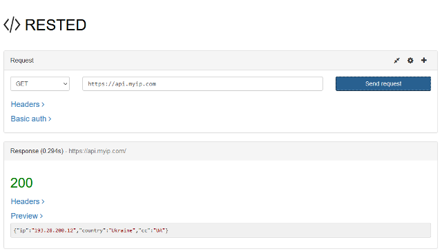
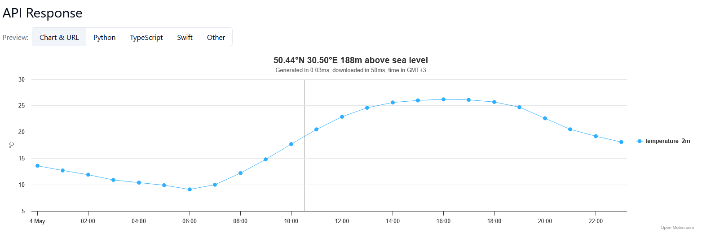
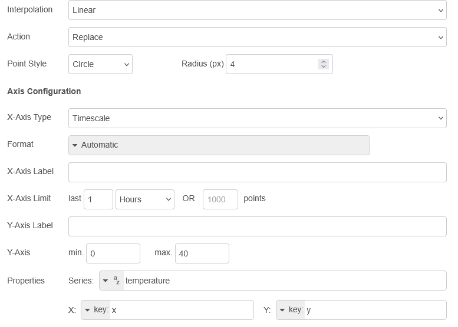

[<- До підрозділу](README.md)		[Коментувати](#feedback)

# Використання HTTP API: практична частина

**Тривалість**: 1 акад. години.

**Мета:** навчитися використовувати публічний HTTP API.  

**Лабораторна установка**

- Апаратне забезпечення: ПК. 
- Програмне забезпечення: Node-RED

## Порядок виконання роботи 

### 1. Використання відкритого HTTP API 

Багато застосунків в Інтернеті мають відкритий API інтерфейс для доступу до різних ресурсів як сервісів чи даних. Більшість з них є платними і надаються за підпискою. Деякі з них мають можливість обмеженого користування на певний період чи на певну продуктивність. 

Node-RED  може представляти як бік клієнта так і сервера HTTP. У більшості випадків на рівні Edge він представляє бік клієнта. Дана частина практичного завдання призначена для побудови в Node-RED WEB-клієнта для доступу через API до інших застосунків. 

**Увага! Більшість ресурсів є захищеними та потребують автентифікації, шифрування і т.п. У цій роботі усі інтерфейси є відкритими, тому не можуть в чистому вигляді використовуватися в промислових умовах!**  

### 2. Знайомство з сервісами IPAPI

У якості прикладу серверного Веб-застосунку використовуватиметься  [IPA-PI](https://ip-api.com/), який дає можливість визначити деталі місця розташування за IP адресою. Це можна зробити через сторінку Веб-інтерфейсу, або через відкритий API-інтерфейс. Повний опис API з форматом JSON доступний за [посиланням](https://ip-api.com/docs/api:json).

- [ ] Зайдіть на сторінку за посиланням https://ip-api.com. 
- [ ] Ознайомтеся зі змістом сторінки. Зверніть увагу на ту інформацію, яка надається по IP-адресі, а також на значення Вашої білої адреси IP, вірніше від якої Ваш пристрій спілкується в Інтернеті. 

Слід розуміти, що у більшості випадків видима IP-адреса – це одна з адрес провайдера, що надає послуги Інтернету, тому координати будуть саме цього провайдера. 

- [ ] Подивіться на приклад запиту і відповіді в форматі JSON. 
- [ ] Зайдіть на сайт https://www.myip.com/, подивіться яка інформація там надається.
- [ ] Ознайомтеся з API-сервісом https://www.myip.com/api-docs/. 

### 3. Робота з утилітами для API-тестування

Для тестування API Ви можете користуватися будь якою онлайн або офлайн утилітою. У даній лабораторній роботі пропонується скористатися доповненням до браузерів `FireFox` з назвою RESTED або `Chrome` з назвою REST API Tester.

- [ ] Встановіть розширення для браузера, або аналогічне, яке можна знайти за посиланнями:

- для Firefox https://addons.mozilla.org/en-US/firefox/addon/rested/
- для Chrome https://chromewebstore.google.com/detail/rest-api-tester/oihoocdkmajhmnlonamoilbpjjehgbka

- [ ] Для перевірки роботи API  https://www.myip.com введіть в поле адреси https://api.myip.com у метод – «GET», і натисніть «SEND» або "TEST" в залежності від вибраного програми. 



рис.1.

- [ ] Проаналізуйте відповідь

- [ ] Повторіть те саме з адресою <http://ip-api.com/json/8.8.8.8/> . 
- [ ] Повторіть те саме зі своєю білою IP-адресою, або просто відправивши http://ip-api.com/json/. Порівняйте отримані результати з тими, що показані на сторінці https://ip-api.com 

### 4. Створення клієнту для IPAPI в Node-RED 

- [ ] Запустіть Node-RED, створіть нову вкладку з назвою `IPAPI`. 
- [ ] самостійно реалізуйте програму, яка буде використовуючи вузол “Http request” для витягування інформації про білий IP, використовуючи сервіси  <http://ip-api.com/json/>. Зверніть увагу, що **IP-API може повернути негативну відповідь** - це може бути спричинено обмеженим використанням безкоштовного сервісу.     

- [ ] Зробіть копію фрагменту екрану виводу у вікні відлагодження і збережіть для звіту.

### 5. Виведення прогнозних даних по температурі та опадам 

У цьому пункті необхідно самостійно ознайомитися з API сервісу надання даних по температурі та вивести прогнозні дані на добу 

- [ ] Перейдіть на сторінку опису документації [open-meteo](https://open-meteo.com/en/docs). Використовуючи наявний опис та налаштування виведіть прогнозні дані у вигляді графіку на екран для Вашого місця перебування (рис.1)  



рис.1. Приклад графіку прогнозу температури

- [ ] Подивіться на сформований API URL та відкрийте його в браузері. Проаналізуйте отриманий результат.
- [ ] Зробіть фрагмент програми в Node-RED для формування запиту, подивіться результат за допомогою вікна `Debug`.
- [ ] Реалізуйте відображення архівних даних за допомогою вузла Chart в Dashboard2.

Підказка. Для відображення даних що повернулися з HTTP Request у вузлі Chart треба їх попередньо обробити у вузлі Function. Приклад коду для оброблення показано нижче   

```js
let data = [];
for (let i = 0; i < msg.payload.hourly.time.length; i++){
    data [i] = {
        x: new Date(msg.payload.hourly.time[i]),
        y: msg.payload.hourly.temperature_2m[i]
    }
}
msg.payload = data;
return msg;
```

Вузол Chart може мати наступні налаштування



## Автори


Практичне заняття розробив [Олександр Пупена](https://github.com/pupenasan). 

## Feedback

Якщо Ви хочете залишити коментар у Вас є наступні варіанти:

- [Обговорення у WhatsApp](https://chat.whatsapp.com/BRbPAQrE1s7BwCLtNtMoqN)
- [Обговорення в Телеграм](https://t.me/+GA2smCKs5QU1MWMy)
- [Група у Фейсбуці](https://www.facebook.com/groups/asu.in.ua)

Про проект і можливість допомогти проекту написано [тут](https://asu-in-ua.github.io/atpv/)