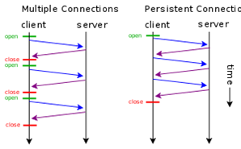

[<- До підрозділу](README.md)

# Протокол HTTP: теоретична частина

На минулих лекціях розглядалися протоколи, які забезпечують обмін даними між процесами, що можуть виконуватися на різних вузлах. Тобто усі мережні протоколи здебільшого слугують зрештою одній меті - забезпечити взаємодію між процесами: Ethernet для обміну в одній мережі, IP - для обміну між вузлами в обєднаних мережах через маршрутизатори, а протоколи TCP та UDP забезпечують транспорт між цими процесами. Що саме процеси передають один одному і як налагоджують правила взаємодії є задачою протоколів прикладного рівня. У цій лекції розглянемо протокол HTTP, який використовується для доступу до ресурсів в Інтернеті (і не тільки).     

## 1. Протокол HTTP 

**HTTP** (HyperText Transfer Protocol — «протокол передачі гіпертексту») — протокол прикладного рівня передачі даних, який є повінстю текстовим, тобто використовуються тільки літери та цифри. Початково проткол використовувався для передачі гіпертекстових документів HTML, зараз використовується для передачі чого завгодно. 

У обміні приймають участь два застосунки (рис.9.1):

- HTTP Клієнт (наприклад Web Browser) - ініціатор, той застосунок, якому потрібні ресурси серверу. Він формує запит (Request Message) на сервер на виконання операціъ з ресурсом. 
- HTTP Сервер (Web Server) - той застосунок, у якого є ресурси. Він обробляє запит клієнта і відправляє відповідь (Response Message), у якому повертає результат обробки ресурсу, або сам ресурс. 


рис.9.1. Клієнт-серверний обмін в HTTP.

На сьогодні інсує кілька версій: HTTP/1.1, впроваджується HTTP/2 (з 2015) та HTTP/3 (з 2019).

HTTP так само і багато споріднених протоколів використовує стандартний стек TCP, UDP, IP та інші (рис.9.2)  


рис.9.2. Стек протоколів HTTP

Розглянемо приниципи функціонування HTTP на прикладі (рис.9.3). 

1) Коли користувач заходить за посиланням на WEB-ресурс він вказує *URL* того ресурсу (наприклад сторінки), який необхідно завантажити. 

2) Браузер запитує цей ресурс за допомогою повідомлення в текстовому форматі, що починається з назви методу `GET` в якому передається адреса ресурсу та додаткові параметри запиту. Це повідомлення передається по TCP до серверу по вказаному порту. Якщо користувач не вказав порт він буде рівним 80 (див. попередню лекцію).    


рис.9.3. Приклад фунуціонування протоколу HTTP. 

3) Сервер, отримавши повідомлення на отримання ресурсу, шукає його за URL.

4) У випадку знаходження ресурсу сервер відправляє відповідь, в заголовку якої вказує позитивний результат виконання запиту `200 Ok`. Також в корисному навантаженні він передає запрошуваний ресурс. 

5) Браузер виводить ресурс, якщо це буде HTML-сторінка показує її у відповідному вигляді.

### Ідентифікація ресурсу

**Ресурси** на сервері - це документи у різноманітному форматі, які можна отримати, записати, змінити і т.п. Для доступу до потрібного ресурсу вказується його унікальний для серверу ідентифікатор розміщення -  **URL (**Uniform Resource Locator). Він задається у вигялді рядку і має наступний формат:

```http
<схема>://<логін>:<пароль>@<хост>:<порт>/<шлях>?<параметри>#<якір>
```

- схема – це означення того, який проткол використовується для доступу ресурсу, наприклад `http` або `https`
- логін та пароль – це ім'я і пароль користувача, якщо доступ до ресурсу обмежений; як видно вони розділені двокрапкою; якщо дсотуп до ресурсу не обмежується, логін та пароль не вказуються 
- хост - доменне ім'я хоста (DNS) або IP-адреса 
- порт – TCP порт хоста, якщо не вказується,  
- шлях – інформація що уточнює місцезнаходження ресурсу
- параметри – рядок запиту з параметрами, що передаються на сервер (методом GET) 
  - використовується разділювач параметрів — знак &. 
- #<якір> - якір, тобто заголовок всередині документа, або атрибут id 

Приклади:

`https://uk.wikipedia.org/wiki/Уніфікований_локатор_ресурсів#Cтруктура` `http://asu.in.ua/viewtopic.php?p=6135#p6135`

### Структура повідомлення

Як зазначалося в протоколі HTTP повідомлення-запит та повідомлення-відповідь мають повністю текстовий формат. Повідомлення складається з (рис.9.4): 

- стартового рядку, який завершується символом кінця рядку і включає в себе 
  - для запиту вказується рядок запиту (`request line`): у ньому вказується метод (на рисунку `GET`), ресурс (на рисунку `/doc/test.html`) та версія протоколу (на рисунку `HTTP/1.1`) 
  - для відповіді вказується статусний рядок (`status line`): у ньому вказується версія протоколу (на рисунку `HTTP/1.1`), код статусу (на рисунку `200`) та текстове представлення статусу (на рисунку `OK`) 
- headers (заголовки), які уточнюють повідомлення; кожен заголовок закінчується символом кінця рядку; є тільки один обовязковий заголовок для клієнта - `Host`, в якому  треба вказати імя хоста, до якого відбувається звернення; усі інші заголовки добалвяються за необхідності; 
- body (тіло повідомлення), яке включає зміст ресурсу; може бути порожнім, наприклад у повідомленні-запиті на отримання ресурсу
- розділювач - пустий рядок, який розділяє заголовки і тіло повідомлення    


рис.9.4. Структура повідомлення HTTP 

Перевірити роботу http можна за допомогою програми-терміналу, наприклад для систем Windows це PuTTY (рис.9.5). Для цього треба підключитися до потрібного порта потрібного `host` в режимі передачі тексту (`raw`). Далі у консольному вікні набрати текстове повідомлення, після подвійного `Enter` з'явиться відповідь від серверу.        


рис.9.5. Приклад перевірки роботи HTTP за допомогою PuTTY.

### Методи запитів

Метод запиту (HTTP Method) - це означення дії, яку необхідно провести над ресурсом. За великим рахунком це може бути довільний символьний набір, але цей метод повинен підтримуватися і Client і Server.  Тим не менше є стандартні методи, зокрема:

- **GET** – запит на зміст ресурсу 
- **POST** – передача даних для існуючого ресурсу 
- **HEAD** – запит інформації про ресурс але без змісту
- **PUT** – розміщення нового ресурсу на Web-сервері
- PATCH – часткова зміна ресурсу
- DELETE – видалення ресурсу з Web-серверу
- TRACE – трасировка (ехо-запит) перевірки зміни запиту по шляху
- OPTIONS – запит підтримуваних методів HTTP та розширень
- CONNECT – підключення до Web-серверу через проксі

### Статуси відповідей

Статус відповіді вказує на результат виконання сервером запиту. Він включає числове представлення у вигялді коду та текстову рошифровку. Перша цифра тризначного коду (сотні) вказують на тип відповіді: 

- **1XX** – інформаційна; наприклад `101 switching protocols` вказує на те, що відбулося переключення на інший протокол (наприклад з HTTP на WebSocket)
- **2XX** – успішне виконання; наприклад `200 ОК`
- **3ХХ** – перенаправлення на інше розміщення ресурсу; наприклад `301` – перенаправлення на постійне розміщення, `307` – перенаправлення на тимчасове переміщення
- **4ХХ** – помилка з причини клієнта; наприклад `403` –доступ заборонений за неправильної вказівки користувача та пароля, `404` – ресурс не знайдено за вказаним посиланням
- **5ХХ** – помилка на сервері; наприклад `500` – відбулася внутрішня помилка серверу

### Заголовки

Заголовки HTTP (HTTP Headers) уточнюють повідомлення. Описуються парою `ім'я: значення` (див. рис.9.6). Наприклад 

```http
Content-Type: text/html;charset=utf-8
```

задає формат і спосіб представлення тіла повідомлення типу `text/html` з кодуванням `charset=utf-8`.

Існують стандартні заголовки, які описані в документах RFC. Нестандартні  заголовки повинні починатися з `X-`. Для протоколу HTTP > v1.1 заголовок «Host» в повідомленні-запиті повинен бути обов'язковим, так як на одному IP/домені може бути декілька Веб-серверів. Список заголовків можна подивитися на [Вікіпедії](https://uk.wikipedia.org/wiki/Список_заголовків_HTTP).

Розглянемо вплив заголовку `Connection` на функціонування обміну. Заголовок вказує на властивість підключення, зокрема `Connection: Keep-Alive` вказує на необхідність утримання (`persistent`) з'єднання після відповіді на запит. У протоколі `HTTP/1.0` передбачалося, що після обробки кожного запиту – з'єднання розривається. Однак для багатьох випадків це може спричинити до значних часових затрат. Розглянемо це на прикладі (рис.9.6). Якщо при завантаженні сторінки необхідно додатково зробити запит, наприклад, на завантаження рисунків для неї, то в звичайному варіанті після кожного запиту GET TCP-з'єднання в `HTTP/1.0` буде розриватися, хоча логічний сеанс обміну при цьому триває. Як відомо з попередньої лекції це приведе до додаткових часових затрат, тому для утримання з'єднання в HTTP/1.0 потрібен заголовок `Connection: Keep-Alive`, який після відповіді серверу тримає TCP-з'єднання активним протягом 5-15 секунд (залежить від реалізації серверу). У версії `HTTP/1.1` за замовченням вважається даний параметр `persistent` а у 2-й версії заголовок взагалі заборонений.



рис.9.6. Функціонування постійного з'єднання `Persisten Connection`

Інший прикладом є використання заголовку `Cache-Control`. Для прискорення обміну завантажувані ресурси можуть кешуватися, тобто зберігатися на локальних (приватних) або проміжних загальнодоступних  (shared) кешах (рис.8). Тобто якщо запит проходить через сервера, які передбачають кешування, може повернутися старе значення ресурсу. Це з одного боку зменшує трафік, так як надає багатьом клієнтам швидше доступ до одного і того ж ресурсу. З іншого боку, якщо ресурс (наприклад сторінка) змінився, усі клієнти отримають старе значення. Для вказівки параметрів роботи з кешем передбачений заголовок: `Cashe Control`, наприклад:

- `Cache-Control: no-cache, no-store` - не кешувати, не зберігати, 
- `Cache-Control: max-age=31536000` - максимальний час збереження в кеші в секундах

## 2. Робота зі змістом HTML повідомлень

### Тип змісту тіла повідомлення (Content-Type)

Хоч протокол HTTP повністю текстовий, за допомогою тексту можна кодувати будь-який зміст тіла, навіть бінарні файли. Однак для їх правильної інтерпретації необхідно вказати тип змісту за допомогою заголовка `Content-Type`. Заголовок може включати декілька директив, розділені крапкою з комою:

- `media-type`, тип змісту, наприклад `text/html`, або `multipart` - для вказівки багато-частинних повідомлень
- `charset` – стандарт кодування, наприклад `utf-8`
- `boundary` – для багато-частинних (`multipart`) повідомлень розділювач  

Наприклад:

```text
Content-Type: text/html; charset=utf-8 
Content-Type: multipart/form-data; boundary=something
```

Тип змісту, визначається типом **MIME**(Multipurpose Internet Mail Extensions) – стандарт на характер і формат документу, файлу або даних. Він описується парою тип/підтип, тобто:

```
type/subtype
```

Ці типи можуть бути дискретними, тобто які описують весь формат, або у випадку змішаного формату (наприклад текст та рисунки) включати кілька частин. Популярні дискретні формати

```
application/octet-stream (бінарний)
text/plain (текстовий)
text/css, text/html, text/javascript, text/xml (текстовий з ромзіткою)
image/gif, image/jpeg, image/png (зображення)
application/json (JSON)
```

Інші дискретні формати:

```
text/css, audio/mpeg, audio/ogg, audio/*, video/mp4, application/*, pplication/ecmascript
application/octet-stream ...
```

Для змісту що включає кілька розділів (зміст) виділяється тип **MIME Multipart**. На рис.9.7 показаний приклад використання змісту, який включає кілька розділів. Це тіло повідомлення відправлення HTML-форми. Для цього використовується директива `multipart/form-data` заголовку `Content Type` . Директива`boundary` вказує на роздільник, який використовується для ідентифікації початку частин. Далі кожен розділ тіла повідомлення починається з вказаного роздільника, після чого вказується тип формату через `Content-type` . 

 

рис.9.7. Приклад використання MIME Multipart

## Контрольні питання

1) Розкажіть про загальні принципи функціонування протоколу HTTP.
2) На якому протоколі транспортного рівня базується HTTP?
3) Поясніть що таке ресурс HTTP? Як він ідентифікується на сервері?
4) Розкажіть про структуру повідомлення HTTP.
5) Розкажіть про призначення методів запитів HTTP.
6) Розкажіть про призначення статусів відповіді HTTP. 
7) Розкажіть про призначення заголовків HTTP. 
8) Розкажіть про призначення кешування в HTTP. Як можна керувати кешем в протоколі HTTP?
9) Як вказується формат повідомлення в HTTP?
10) Що таке Multipart повідомлення?

## Посилання на відеозаписи лекцій

[Запис Л9. Прикладний рівень: HTTP, HTTP API](https://youtu.be/a_VaPldelPw?si=uxcvLaOaGoOCDoB9)


Теоретичне заняття розробив [Олександр Пупена](https://github.com/pupenasan). 
